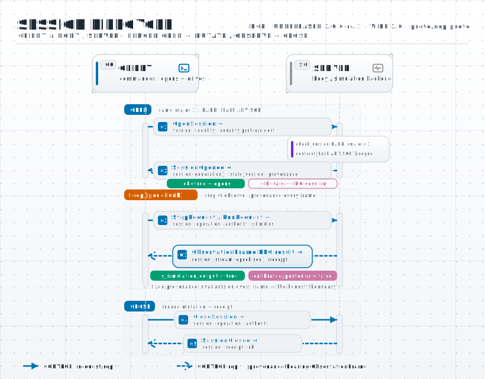

# Neuro-Cybernetic Protocol (NCP) wire 0.7

A versioned, **transport-agnostic, project-agnostic** standard for letting a
running NEST simulation serve external robot / UAV / simulation systems —
robot/UAV bodies, analysis/observer clients, and **any others** ("there could be
more"). One protocol, two complementary interaction patterns:

1. **Neural-simulation service** *(the general case)* — an external system **asks
   the simulation backend for a simulation**, declares **what and where to record**
   (membrane potential / spikes / rate from a single neuron, a synapse, or a
   population) and **what stimuli to inject**, then **steps or runs** the simulation
   and reads back the neural data. It serves **perception, action, both, or neither**:
   the backend runs only the neural part the client requests; whether a given
   sensor/actuator is NEST-backed or classic ML is entirely the client's choice.
2. **Closed-loop controller** *(a layered special case)* — the neural backend drives
   an external actuator as "just another controller" over the system's *existing*
   transport (e.g. a robot/UAV client's MAVROS setpoint topics), non-invasively.

Normative **schema** contract: `proto/ncp.proto` (proto-native; the JSON Schemas
are its JSON projection — and **JSON, not protobuf binary, is the shipped runtime
encoding**; see §5A). The wire is **simulator-agnostic** — the typed record/stimulus
vocabulary are abstract SNN concepts a `SimulationBackend` maps to its simulator
(NEST today; NEURON/Brian2/GeNN are a future *backend*, no wire change — see
[`ROADMAP.md`](ROADMAP.md)). Reference implementations:
- **Rust (reference implementation):** this Rust workspace — [`ncp-core`](ncp-core/)
  (pure protocol: wire types, version guard, key scheme, rate codec, safety
  governor, in-process bus + control loop), [`ncp-zenoh`](ncp-zenoh/) (the decoupled
  Zenoh transport with per-plane QoS), and [`ncp-gateway`](ncp-gateway/) (the
  simulation host's Rust edge — see §6A). NCP is intended to become a reusable
  standard (cf. MCP/ACP); Rust is the high-performance reference implementation,
  self-contained and extractable to its own repo / crates.io. **Language bindings
  off the same core:** Python (`ncp-python`, PyO3), TypeScript (`@sepahead/ncp`,
  ts-rs-generated types), and C/C++ (`ncp-cpp`, a C ABI + `ncp.h`) — every peer is
  wire-identical. Integration is documented in [`INTEGRATING.md`](INTEGRATING.md);
  real-time NEST interaction vs MUSIC in [`NEST_REALTIME.md`](NEST_REALTIME.md).
- **Python:** the host simulation service — a NEST-driving `SessionService` +
  `NestBackend` and an in-process reference client (the reference deployment runs
  this behind the Rust gateway).

Machine-readable contract (proto-native): the protobuf IDL `proto/ncp.proto` is
the **normative schema** — the single source of truth for message structure, field
numbers, types, and enum wire strings — and the conformance authority every binding
is checked against. It *defines* a protobuf binary encoding, but that encoding is
**not what the reference SDK currently ships** (see §5A). The **JSON Schemas** `schemas/*.schema.json` are its JSON
projection (parity-guarded by `scripts/check_proto_schema_parity.py`); `ncp-core`'s
Rust `serde` types conform to it (`ncp-core/tests/conformance.rs`), and the
`prost`/`ts-proto`/`protobuf-python` outputs under `gen/` are **preview** codegen
(gitignored, not workspace members, no `prost` runtime dependency), not the shipped
path. All reference implementations serialize to the **same** wire — **JSON** today
(§5A) — so they interoperate. This
document is the human-readable spec.

> **Why NCP exists** (unbiased rationale vs ROS 2/DDS, Zenoh, MUSIC, the
> Neurorobotics Platform, MCP/ACP, gRPC, dm_env_rpc, and the "compose, don't
> invent" alternative): [`RATIONALE.md`](RATIONALE.md).

> **Scientific boundary (binding).** Returned `V_m`/spikes are **raw simulation
> outputs of a specified model**, never a validated reproduction. Every
> simulation response carries `calibrated_posterior=false` and
> `is_simulation_output=true` and references a backend-issued **handle**, not raw
> code or a path. A neuro-controller is a **control artifact**, never a
> paper-reproduction claim. Engram's existing safety/handle discipline applies
> unchanged.

## 1. Versioning & compatibility

Every message carries `ncp_version` (semver). Consumers **ignore unknown fields**, so
adding an *optional* field or a new message type is **non-breaking** and does not bump
the version (since v0.4). An **incompatible** change (removing/retyping/renaming a
field, removing an enum value) is breaking; pre-1.0 the **minor is breaking** for those
— a receiver checks the full version and an exact `(major, minor)` match is required,
any `0.x` minor difference is fail-closed rejected, never coerced.

Two layers separate *compatibility* from *identity*: `ncp_version` is the hard
compatibility gate (above), while `contract_hash` (carried in
`OpenSession`/`SessionOpened`; `ncp_core::CONTRACT_HASH`, FNV-1a of the
wire-semantically-canonicalized proto) is an **advisory** identity signal — a
mismatch within a compatible version is *logged, not rejected* (the peers are on
different but compatible contract revisions). A strict `verify_contract` opt-in
exists for deployments that mandate an exact revision. Wire 0.7 is released as the
latest immutable tag, `v0.7.0`, with contract hash `f05e328cad20959d`. NCP is
pre-1.0 and the wire may still change, so pin an immutable release tag.

The session lifecycle, with the version (HARD) + contract-hash (ADVISORY) handshake:

<picture>
  <source media="(prefers-color-scheme: dark)"  srcset="docs/diagrams/sequence-dark.svg">
  <source media="(prefers-color-scheme: light)" srcset="docs/diagrams/sequence-light.svg">
  
</picture>

### 1.1 Wire-0.7 acceptance rules (normative)

Wire 0.7 is an incompatible acceptance-and-shape cut (`contract_hash =
f05e328cad20959d`). The key words
**MUST**, **MUST NOT**, and **MAY** are used as in
[RFC 2119](https://www.rfc-editor.org/rfc/rfc2119.html) /
[RFC 8174](https://www.rfc-editor.org/rfc/rfc8174.html).

- **`ncp_version` is mandatory on every message.** A receiver **MUST** reject a message
  whose `ncp_version` is absent or wire-incompatible — an absent version no longer
  defaults to the receiver's own, and the full `(major, minor)` must match (pre-1.0,
  minor-is-breaking). Each component is one or more unsigned ASCII decimal digits
  in the `u64` range; signs, whitespace, overflow, and a patch component are
  invalid. The same mandatory-presence rule holds for `kind`.
- **Every JSON `int64` is precision-safe.** Because the JSON projection uses numbers,
  every int64-valued `seq`, id, size, seed, sender, resolved count, and link counter
  **MUST** lie in `[-(2^53-1), +(2^53-1)]`. A receiver **MUST** reject a larger value
  before a JavaScript/binary64 peer can round it to different bytes. JSON Schema's
  semantic integer rule applies: mathematically integral spellings such as `1`,
  `1.0`, and `1e0` are equivalent and **MUST** receive the same decision; fractions
  are rejected.
- **Additive enum strings are lossless.** A receiver **MUST** accept any non-empty
  string in an extensible enum position and preserve an unrecognized value exactly
  across decode → encode. On the action plane, only the exact mode `active` grants
  authority; every unknown mode fails closed to HOLD.
- **Honesty-boundary values are explicit.** `ObservationFrame` and a successful
  `SessionOpened.provenance` **MUST** carry `calibrated_posterior=false` and
  `is_simulation_output=true`. Omission is invalid; a receiver MUST NOT fabricate
  those assertions from local defaults.
- **Failures are typed and versioned.** An RPC failure is `ErrorFrame{kind="error",
  ncp_version, error, session_id?, request_kind?}` and passes the same version/kind
  gate as a success reply. Clients **MUST** verify reply session identity.
- **Nested stimuli are complete envelopes.** A Step/Run `stimulus`, when present,
  **MUST** be a compatible `stimulus_frame` whose `session_id` equals the outer request.
- **Closed-loop `seq` is stamped and strictly increasing.** A `sensor_frame` and a
  `command_frame` **MUST** carry `seq >= 1`, strictly increasing per stream, and a
  `command_frame` echoes the driving `sensor_frame.seq`. `seq == 0` is no longer an
  accept-everything escape hatch — a plant-side watchdog/buffer **MUST NOT** accept
  `seq < 1` (an inbound ESTOP still latches regardless — a fail-safe is never dropped).
- **Fail-safe modes outrank replay rejection.** A plant-side action buffer **MUST**
  clear buffered actuation on every mode other than exact `active` before applying
  envelope/sequence rejection; `estop` additionally latches. Only a complete,
  accepted `active` frame may add or refresh actuation authority.
- **Local clock rewinds revoke authority.** A plant watchdog **MUST** retain its
  local high-water mark, HOLD through a backward/non-finite step and catch-up, and
  require a fresh non-duplicate command before actuation resumes.
- **Observation-plane `seq` echoes the driving sensor.** An `observation_frame`
  **published on the observation plane MUST** echo the driving `SensorFrame.seq`
  (`>= 1`, publisher-enforced); `seq == 0` remains the pull/RPC-reply form only.
  Its payload `session_id` **MUST** equal the session encoded in its pub/sub key.
- **Stream-restart recovery (no wire epoch field).** A receiver re-anchors a restarted
  stream to a new epoch only on a strictly-**lower** `seq`, and only once the stream has
  already expired; an **equal** `seq` never re-anchors, so a frozen or replayed frame
  cannot forge liveness.
- **Unknown `kind`s are skipped, not rejected.** A glob subscriber **MUST** skip a
  message whose `kind` it does not recognize *before* validating it, so additive message
  kinds stay non-breaking for existing consumers.

## 2. Entity model (perception, action, neither; 0..N of each)

A client system has a hierarchy: a **system** (e.g. `uav1`) with **0..N
sensors** and **0..M actors** (e.g. UAVs), each actor itself having **0..N
sensors** and **0..K actuators**. NCP addresses entities by a string path and a
role, e.g.

```
uav1/sensor/cam0          role=sensor
uav1/actuator/rotor       role=actuator
ground/radar0             role=sensor
```

Entities are bound to **named ports** of a simulation (a `stimulus` port or a
`record` port) via `EntityBinding`. The binding is the client's concern; Engram
only sees ports. This is what makes the protocol agnostic to how many sensors or
actors exist (including zero) and reusable across projects.

## 3. The neural-simulation service

A **session** is one running simulation with a declared recording and stimulus
surface. Lifecycle (each message has a JSON Schema of the same name):

| Message | Dir | Purpose |
|---|---|---|
| `open_session` | client → server | request a simulation: a `NetworkRef`, a `RecordSpec`, a `StimulusSpec`, a `SimConfig`, optional entity `bindings` |
| `session_opened` | server → client | ack with backend, resolved population sizes, and `SimProvenance` (model/seed, `calibrated_posterior=false`, `is_simulation_output=true`) |
| `step_request` | client → server | advance one chunk; optional `stimulus_frame`; returns an `observation_frame` |
| `run_request` | client → server | batch: advance `duration_ms` holding a stimulus; returns an `observation_frame` |
| `observation_frame` | server → client | recorded data per record port (see below) |
| `close_session` / `session_closed` | both | tear down |

### Time domains

Every envelope field named `t` is measured in **seconds on the producing peer's
local monotonic clock**. It is ordered only within that producer's stream and MUST
NOT be compared across peers or used as a network freshness deadline. A
`CommandFrame` echoes the driving `SensorFrame.t`; an `ObservationFrame` published
on the observation plane does likewise. Cross-plane correlation uses `seq`, and
plant-side watchdogs use the plant's local arrival clock. `sim_time_ms` and each
`Observation.times[]` entry are instead authoritative simulation milliseconds.

### NetworkRef — what to simulate
- `kind=handle` — a backend-issued `pynest_script_id` / `compiled_module_id` (a
  backend-generated network; the canonical, handle-based path).
- `kind=builtin` — a NEST built-in neuron model name (e.g. `iaf_psc_alpha`) with
  `population_sizes` (quick single-neuron / population sims).
- `kind=model_id` — a knowledge-graph / paper-derived model id.
- `kind=spec` — a small inline spec (advisory).
- `model_name` (optional) selects which registered model to create for a multi-model
  `handle`; `params` (numeric) / `population_sizes` carry advisory overrides.

### RecordSpec — what & where to record
A list of `RecordTarget { port, target, observable, ids[], cadence_ms, recordables[] }`:
- `port` — the client's name for this recording (keys the observation).
- `target` — population / group name in the network.
- `observable` — `V_m` | `spikes` | `rate` | `weight` | `binary_state` (the last
  for binary/multi-state neurons, recorded via a spin detector, not a multimeter).
- `ids` — neuron/synapse indices (empty = all in `target`).
- `cadence_ms` — analog sampling interval (ignored for `spikes`).
- `recordables[]` — generic named, model-specific recordables beyond the typed
  `observable` (e.g. `g_ex`/`g_in` for conductance models, `w` for adaptation,
  `rate` for rate models), resolved via the backend's multimeter `record_from`.
  Empty = just `observable`. (#10)

### StimulusSpec / StimulusFrame — what to inject
A list of `StimulusTarget { port, target, kind, ids[], params{} }` declares the
input ports; each `step`/`run` carries a `StimulusFrame { values: {port → ChannelValue} }`.
`kind` ∈ `current_pA` | `rate_hz` | `spike_times` | `weight_set` | `rate_inject`
(continuous-rate injection for rate-based neurons via rate connections /
`step_rate_generator` — rate models cannot receive spikes). `params{}` carries
named scalars beyond the value, e.g. a siegert neuron's `drift_factor` /
`diffusion_factor`. (#10) A `ChannelValue` is `{ data: float[], unit }` — e.g.
`[500.0]` pA, `[40.0]` Hz, or a list of spike times.

### ObservationFrame — the returned neural data
`records: { series_name → Observation }`, where each unique series name maps to
an `Observation` and the nested `Observation.port` names the negotiated record
port. This permits multiple named `recordable` series from one port. `Observation` is
`{ port, target, observable, times[], values[], senders[], unit, recordable }`:
- analog (`V_m`): `times` (ms) + `values` (mV), parallel.
- `spikes`: `times` (spike times, ms) + `senders` (neuron ids), parallel.
- `rate`: `values=[rate_hz]`.
- `recordable` — when set, names which specific recorded series this carries
  (e.g. `g_ex`, `w`) and is authoritative for it; `observable` is then the record
  target's family hint, not this series' type. `""`/absent = the series is
  `observable`. (#10)

This is exactly "pass stimuli → get back membrane potential, conductance, spiking,
binary-state, or rate data from a single neuron / synapse / population".

**Bulk codec status (#6).** `ncp-core::BulkBlock` defines and golden-vector-pins a
packed little-endian column block for large arrays. It is currently a local/offline
codec, not a complete transport frame: a bare NCPB block has no session, seq,
timestamp, or provenance and `ncp-zenoh` therefore rejects it. The proto
`BulkObservation` reserves the complete metadata envelope for a future
capabilities-negotiated implementation that must ship across every binding before
it is enabled. JSON `ObservationFrame` is the only shipped observation-plane frame.

## 4. The closed-loop controller (layered)

For the "the neural network is the brain" pattern, NCP adds control messages:
`capabilities` (handshake), `sensor_frame` (plant → controller), `command_frame`
(controller → plant), `control_status`. A **codec** (`CodecSpec`) declares the
sensor→spike encoding and spike→command decoding so a trained SNN trains against
a frozen interface. The controller loop is `sensor_frame → encode → stimulus →
step(chunk) → record → decode → command_frame`, i.e. it is built *on* the session
service. `SafetyLimits` bound commands and a stale sensor forces `HOLD`.

## 5. Transport bindings (and why)

NCP separates the **contract** from the **medium**. The contract is proto-native:
the **protobuf IDL** `proto/ncp.proto` is the normative *schema* source of truth, and the
**JSON Schemas** in `schemas/` are its JSON projection (kept in parity, CI-guarded).
The serialization shipped on every medium below is **JSON**; protobuf *binary* is defined by the schema but is
**not** a wired runtime encoding today — see §5A.
The medium is a per-deployment choice behind the `Transport` abstraction — do
**not** marry NCP to one wire. With many heterogeneous projects this matters; the
trade-offs:

The key lens is **coupling**: with dozens of loosely-coupled systems you do not
want each client wired to a server address.

| Medium | Coupling | Upsides | Downsides | Use when |
|---|---|---|---|---|
| **Zenoh** — *recommended decoupled default* | **low** — addresses *data* (`{realm}/**`), automatic discovery, many-to-many | RPC via **queryable**, streaming via **pub/sub**; location-transparent; N server instances on one keyspace; **robot/UAV clients already speak it** (a `ZenohBridge`, ROS 2 `rmw_zenoh`); carries opaque JSON payloads today | younger RPC ecosystem; you define the queryable convention; browsers need a router's WS plugin | the many-project fleet; robotics-native; multiple/replicated server instances |
| **WebSocket + JSON** — *zero-friction fallback* | medium (client → one URL) | works from any language incl. browsers/Tauri-webview; human-readable; no codegen | no typing/codegen; manual correlation; verbose at high rate | quick starts, debugging, the frontend (shipped: `/api/neurocontrol/ws`) |
| **gRPC** (HTTP/2 + protobuf) — *optional point-to-point* | **high** — client dials a host:port; needs a load balancer to scale | first-class bi-di streaming; typed codegen from `ncp.proto`; deadlines/backpressure | endpoint coupling; browser needs grpc-web/Connect; protoc step | cloud/enterprise point-to-point with a known endpoint |
| **ROS 2 (DDS) + rosbridge** | low (within ROS) | native for ROS projects; QoS; rosbridge bridges browsers | couples non-ROS projects to ROS; heavy | the project is already ROS 2 |
| **NATS / MQTT / ZeroMQ** | varies | fast pub/sub (+ NATS req-reply); ubiquitous (MQTT) | weaker typing/RPC; reinvent framing | existing message-bus deployments |

**Decision (proto-native; see [`VERSIONING.md`](VERSIONING.md) and [`RATIONALE.md`](RATIONALE.md)):** treat
`proto/ncp.proto` as the **normative schema** (the source of truth) — with the
**JSON Schemas** as its parity-guarded JSON projection and **JSON as the shipped
runtime serialization** on the bus (§5A); make **Zenoh the recommended *decoupled* default** for the
bus (RPC via queryable, streaming via pub/sub — so no client is bound to a server
address); keep **WebSocket/JSON** as the no-dependency fallback (shipped, and what
a browser/Tauri-based client's frontend uses); treat **gRPC** as an *optional* point-to-point binding
for deployments that specifically want it. The bus binding is `bus.py`
(`Bus`/`LocalBus`/`ZenohBus` + `NcpBusServer`/`NcpBusClient`);
`SessionService.handle_json(message)` is the
transport-neutral seam every binding calls.
## 5A. Wire encoding: JSON runtime today, protobuf as the schema

First principles: a *schema* (which fields exist, with what types and names) and an
*encoding* (how the bytes are laid out on the wire) are independent decisions, and
NCP makes them separately. The most common misreading of this protocol is to
conflate "there is a `.proto`" with "protobuf binary is on the wire." It is not —
not in the reference SDK today.

- **Schema = source of truth = `proto/ncp.proto`.** It fixes message structure,
  field numbers, types, and the canonical enum *wire strings* (`"V_m"`,
  `"current_pA"`, …). The JSON Schemas in `schemas/` are its parity-guarded JSON
  projection (`scripts/check_proto_schema_parity.py`), and `ncp-core`'s Rust `serde`
  types are conformance-checked against those schemas (`ncp-core/tests/conformance.rs`).
  This is the contract every binding must agree on, in any encoding.

- **Shipped runtime encoding = JSON.** Every reference peer today serializes the
  Sensor / Command / RPC / Observation planes as JSON via `serde_json` (`ncp-zenoh` publishes
  `serde_json::to_vec(frame)` and the gateway + WebSocket binding are JSON
  end-to-end). JSON is the deliberate debuggable default: self-describing,
  language-neutral, and inspectable on the bus with no codegen. Its cost is small
  and dominated by in-sim compute, not framing — a `CommandFrame` serializes in
  ~248 ns / deserializes in ~446 ns at ~215 B, a `SensorFrame` ~223 ns / ~474 ns at
  ~195 B (release, measured), a fraction of a microsecond against a 20–1000 Hz
  control budget. See [`PERFORMANCE.md`](PERFORMANCE.md).

- **`BulkBlock` is a bounded codec, not a frame.** The packed NCPB column format is
  implemented and cross-language golden-vector-pinned for offline/local use, with a
  64 MiB input ceiling and cumulative allocation budget. It is not accepted bare on
  Zenoh. A future binary path must wrap it in the complete `BulkObservation`
  metadata and ship encode/decode/conformance in Rust, Python, C/C++, and TypeScript.

- **Protobuf *binary* is defined but not wired.** The `prost` (Rust), `ts-proto`
  (TS), and `protobuf-python` outputs under `gen/` are **preview** codegen
  (`buf.gen.yaml`): gitignored, not Cargo workspace members, and with **no `prost`
  runtime dependency** in any `Cargo.toml`. `ncp-core` is a hand-written `serde`
  implementation that owns wire *behavior*; `proto/ncp.proto` owns the *schema*. So
  protobuf is the schema contract and a conformance authority — not the shipped
  serialization.

**Why JSON and not protobuf binary today?** Because in a closed sensorimotor loop
the dominant cost is **NEST / in-sim compute**, not frame (de)serialization: at kHz
the whole NCP contract + safety overhead is ~0.003–0.1 % of the control budget
(see [`PERFORMANCE.md`](PERFORMANCE.md)). JSON's debuggability is worth more than
protobuf's byte savings until a bandwidth- or kHz-constrained consumer proves
otherwise. The clean upgrade path is then an **opt-in, capabilities-negotiated
binary encoding** for the action / perception planes (advertised in the handshake,
JSON staying the always-available default) — **not** stripping fields from the self-describing JSON
wire (which would break `validate()` / version diagnosis). This is tracked in
[`KNOWN_LIMITATIONS.md`](KNOWN_LIMITATIONS.md) ("Hot action/perception planes are
JSON-only").

> **Zero-copy caveat (audited, not fixed).** The Zenoh transport compiles in the
> `shared-memory` feature, but `ZenohBus::put` currently does `payload.to_vec()` on
> every publish (`ncp-zenoh/src/lib.rs:441`), copying each frame and defeating the
> SHM zero-copy path. Routing the owned-buffer publish paths through Zenoh
> `ZBytes` / SHM removes a per-frame copy **with no wire change**. See
> [`KNOWN_LIMITATIONS.md`](KNOWN_LIMITATIONS.md).
>
> **Bulk decode hardening (fixed in 0.7).** Encode/decode enforce 64 MiB / 4,096-column
> ceilings, checked narrowing conversions, a cumulative name+column allocation
> budget, and sorted `O(n log n)` region validation; overlapping directory entries
> cannot amplify a small input into unbounded heap or pairwise parser work.


## 6. How a project integrates — and why the commander core stays project-agnostic

**Separation of concerns is the load-bearing rule:** project specifics (topic
names, message types, field layouts, transport deps) must **not** live in the
commander's repo (e.g. Engram) — it has to scale to dozens of projects. The
commander core speaks **only** NCP (entity/channel-addressed). A project integrates
via one of three mechanisms, in decreasing preference, all of which keep its
specifics *out of the commander*:

1. **Client-side adapter (best).** The project owns its NCP client **and** its
   mapping in *its own* repo/language, and calls the commander's service. For control,
   **the commander emits NCP `command_frame`s; the project's adapter maps them to its
   actuators** — so even the control path carries no project specifics in the commander.
   A robot/UAV client's drop-in adapter is a small client module (copy into your
   own `src/neuro/`; touches no existing client code).
2. **Declarative profile (data, not code).** The project ships a JSON mapping
   file that a *generic* loader (`profiles.DeclarativeProfile` via
   `load_profile(path, ns=…)`) consumes — no per-project class in core. A
   client's mapping lives as **data** in a declarative profile JSON, not as code.
3. **Plugin package (entry points).** Richer logic ships as a separately
   installable `engram-ncp-<project>` package registering a profile under the
   `engram.ncp.profiles` entry-point group (`profiles.discover_plugins()`).

The commander never assumes a fixed sensor/actor count: a system with no cameras or no
UAVs simply declares no ports; one with many addresses each by entity path.
Perception and action are symmetric — both are bindings of client entities to
stimulus/record ports. The core registry ships **only** the `generic` profile;
every concrete project is loaded from data or a plugin.

## 6A. The Rust edge: planes, QoS, and the gateway

The Rust SDK makes the transport decision concrete. **Perception and action are
separate planes** — opposite-signed on rate, payload size, fan-in/out, failure
isolation and safety authority — so they ride separate keys with separate QoS.
The **NEST brain is not split**: a closed sensorimotor loop is one
`nest.Run(chunk)` binding sense→act; only the wire diverges.

```text
{realm}/rpc/{request_kind}               control-plane RPC   exact query key; server declares {realm}/rpc/*
{realm}/session/{id}/sensor[/{name}]     perception plane    pub/sub, best-effort DROP (lossy-OK)
{realm}/session/{id}/command[/{name}]    action plane        pub/sub, express + DROP + RealTime, safety-gated
{realm}/session/{id}/observation         neural / diagnostic commander publishes; observers subscribe read-only
```

Per-entity sub-keys (`…/sensor/imu`, `…/command/cmd_vel`) address the
multi-sensor / multi-actuator case; a subscriber wildcards `…/sensor/**`. The
action plane is the only one with command authority (`ttl_ms`, `Mode.HOLD`/
`ESTOP`, `command_timeout_ms`, geofence). A `CommandFrame.seq` echoes the
`SensorFrame.seq` it was computed from, so a split-plane observer joins **on
`seq`, not arrival time** (the DROP QoS on the perception plane makes arrival-time
pairing unsound).

NCP's per-plane QoS **maps onto** the standard ROS 2 / DDS QoS vocabulary, so a
`rmw_zenoh` / DDS deployment can express the same contract. What the Zenoh binding
sets **today** is the Reliability/priority column only (`CongestionControl` +
priority + `express`); the History / lifespan / deadline columns are the DDS QoS
that would express the *same intent* but are **not currently configured on the
Zenoh wire** (and `ttl_ms` is enforced plant-side by `CommandWatchdog`, not as a
wire lifespan):

| NCP plane | Reliability (set today) | History (DDS mapping, not set today) | NCP safety field | ROS 2 / DDS equivalent |
|---|---|---|---|---|
| perception (sensor) | best-effort (DROP), DataHigh | _(would be `KEEP_LAST(1)`)_ | — | `BEST_EFFORT` |
| action (command) | best-effort (DROP), express, RealTime | _(would be `KEEP_LAST(1)`)_ | `ttl_ms` (plant-side) | `BEST_EFFORT`; `LIFESPAN`+`DEADLINE` would express `ttl_ms`/staleness |
| control RPC / observation | reliable (BLOCK) | keep-all | — | `RELIABLE` |
| liveness / fail-safe | — | — | `Mode.HOLD`/`ESTOP`, `command_timeout_ms` | `LIVELINESS` + `DEADLINE` watchdog (plant-side) |

`ttl_ms` is the application-layer analogue of DDS `LIFESPAN` (enforced plant-side,
not on the wire); the genuinely NCP-specific part is only the `mode`
enum as an explicit wire authority. Mapping to these names keeps NCP interoperable
with a ROS 2/DDS stack rather than diverging from it.

**Conformance — action-plane liveness (normative).** Because the action plane is
best-effort and **MAY** silently drop a `CommandFrame`, a conformant plant **MUST**
enforce command liveness locally: once the most-recent command's `ttl_ms` has
elapsed (measured on the plant's own clock), it **MUST** fail safe — HOLD to a safe
setpoint (zeroed / `Mode.HOLD`) — and **MUST NOT** continue actuating on the stale
setpoint or replay a horizon past its `ttl_ms`. The wire layer only *detects* a
gap (as DDS `DEADLINE` notifies but does not act); the plant owns the safe state —
the required "safe state" / de-energize-to-safe principle of functional-safety
practice (IEC 61508 / ISO 13849). A stale, duplicate, or out-of-order command
**MUST NOT** refresh the liveness deadline. NCP's reference plant-side primitives
are `CommandWatchdog` and `ActionBuffer` (see [`RESILIENCE.md`](RESILIENCE.md)). The
key words **MUST**, **MUST NOT**, and **MAY** are used as defined in
[RFC 2119](https://www.rfc-editor.org/rfc/rfc2119.html) and
[RFC 8174](https://www.rfc-editor.org/rfc/rfc8174.html) (only the uppercase forms
carry the normative meaning).

**Safety hardening status.** [`KNOWN_LIMITATIONS.md`](KNOWN_LIMITATIONS.md) is the
live audit. The former high-severity bulk allocation, unbounded/non-finite TTL,
empty/truncated position, and unit-confusion paths are fixed and regression-tested.
Enabled limits require canonical width-three SI `pose_position`/`velocity_setpoint`
contracts. Under its explicit kinematic command model, the reference governor
projects velocity over the complete TTL/horizon
actuation window and HOLDs or truncates before a geofence crossing; it never turns
a non-empty unsafe horizon into the empty legacy form (which means replay tick 0).
For that projection, the sensor and command effective `frame_id` values **MUST**
match (`frame_id` defaults to `"world"` when omitted); mismatched coordinate frames
HOLD because adding their vectors would be dimensionally meaningless.
When a fresh, validated position is already outside a configured geofence, the
reference governor **MUST** latch ESTOP regardless of the current command mode or
validity; a controller HOLD cannot conceal a breached physical boundary.
Plants still **MUST** deploy both the governor and the independent `ActionBuffer` /
watchdog at the actuator boundary; a controller-side check alone is not authority,
and the physical flight controller / safety PLC remains responsible for a braking-
and-dynamics-aware geofence.
- **`seq == 0` anti-replay escape hatch — RESOLVED in wire 0.6.** The action plane now
  requires a stamped, strictly-increasing `seq >= 1`, and `CommandWatchdog`/`ActionBuffer`
  reject `seq < 1`, so a default-constructed (`seq = 0`) `CommandFrame` no longer bypasses
  the anti-stale/anti-replay guarantee (an inbound ESTOP still latches regardless). `seq >= 1`
  is now normative for `command_frame`/`sensor_frame` on the closed-loop planes — see §1.1.


**The reference gateway (`ncp-gateway`).** When the commander's brain is NEST (Python)
— as in the Engram reference — its NCP *server* stays Python. The gateway gives it a production-grade Rust Zenoh edge
— it declares the `{realm}/rpc/*` queryable and forwards each validated request
received on its exact `{realm}/rpc/{request_kind}` key
to the Python `SessionService` over a localhost socket, reusing the one
transport-neutral seam `handle_json`. NEST never leaves Python; the fleet-facing
transport is Rust:

```text
 Zenoh RPC ──► ncp-gateway (Rust) ──(localhost JSON)──► bridge_server.py → SessionService → nest.Run
 sensor / command / observation pub-sub planes connect directly between NCP peers
```

```bash
# reference deployment: run the host simulation service (NEST) behind the gateway
python -m <host>.bridge_server --backend nest   # the Python NEST host
cargo run -p ncp-gateway                         # the Rust edge, from the workspace root
```

## 7. Status & roadmap

Implemented: the protocol (+ `ncp.proto` IDL + JSON Schemas); the **project-agnostic**
profile mechanism (generic + `DeclarativeProfile` data loader + plugin discovery;
a client's mapping carried as **data** in a declarative profile JSON); a deterministic
**MockBackend** and a **real `NestBackend`** (live NEST 3.9 — V_m/spikes via
multimeter/spike_recorder, `Prepare/Run/Cleanup`) for **both built-in models and
`kind=handle`** (a generated/compiled Engram network resolved via the artifact
store: `load_compiled_module` → install the absolute `.so` → create the registered
model); the `SessionService` + reference client; the **WebSocket/JSON** binding
(`/api/neurocontrol/ws`); the **decoupled bus** binding (`bus.py`: `LocalBus` tested
+ lazy `ZenohBus`, RPC-via-queryable + pub/sub streaming); the `SessionController`
(a spiking session *is* the controller); a client-side TS client; and a reflex
closed-loop demo.

Also implemented: the **Rust reference SDK** (`ncp/`) — `ncp-core` (wire types,
version guard, key scheme, rate codec, safety governor, in-process bus + control
loop; unit-tested for wire-compatibility with the Python JSON), `ncp-zenoh` (the
Zenoh transport with per-plane QoS), and `ncp-gateway` + `bridge_server.py`
(Engram's Rust edge bridging to the Python `SessionService`). Two kinds of consumer
wire against it: a **robot/UAV client** (a self-contained client module behind an
`ncp` feature — a native Rust+Zenoh client and a pose/velocity↔NCP mapping) and an
**analysis/observer client** (a read-only tap mapping the data planes to an external
analysis representation, joining on `seq`).

Also implemented since: the **streaming control plane over Zenoh**
(`ncp_zenoh::ZenohControlTransport` + `ncp_core::NeuroControlLoop` — `sensor`→
`command` over pub/sub, no per-tick RPC; verified by a real-Zenoh loopback test);
`nest.Run` **offloaded off the WebSocket event loop** (`backend/api/neurocontrol.py`,
single shared worker thread); `ObservationFrame.seq` for exact split-plane
`(V,L,D,A)` alignment; the **C/C++** (`ncp-cpp`) and **Python** (`ncp-python`)
bindings; and a conformance/smoke script (`ncp/scripts/check.sh`). Plus the
**degraded-link resilience** primitives (`ncp-core`: `ActionBuffer` predictive
replay, `CommandWatchdog` enforcing `ttl_ms`, `LinkMonitor` seq-gap+CUSUM →
`LinkStatus`, `CommandFrame.horizon`); **multi-UAV / varying sensor-actuator**
addressing (`Keys::sensor_glob`/`command_glob`/`fleet_glob`, per-named-entity
`ZenohBus` methods); the **NestSession O(history) readback bottleneck fix**; and
docs `PERFORMANCE.md`, `RESILIENCE.md`, `NEST_REALTIME.md`, `NEUROMORPHIC.md`,
`INTEGRATING.md`.

Implemented as an opt-in deployment profile: **action-plane auth/ACL** — a complete
default-deny mTLS router template, strict client template, safe realm renderer, and
TLS/ACL enablement steps now ship (#7; `deploy/`, `SECURITY.md`), with receiver-acknowledged
live enforcement validation the remaining P0; next: a `no_std`
core + tiny transport
(zenoh-pico / micro-ROS) for MCUs; per-session capability negotiation; spike-time/
weight stimuli; multi-population/multi-model handles; an optional **gRPC** binding
from `ncp.proto`; independent implementations + a neutral spec home for the standard (the
pragmatic cross-language shape/behavior conformance corpus already ships; see
[`GOVERNANCE.md`](GOVERNANCE.md)); and a trained SNN-RL controller.
