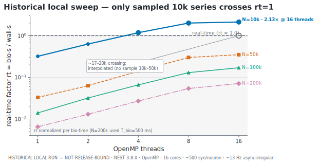
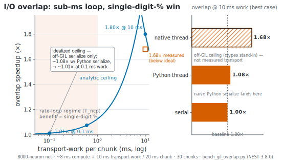

# Does NCP bottleneck NEST? — performance review

> **Evidence boundary:** measurements in this document are historical developer
> benchmarks, not release-bound certification of the unreleased NCP
> `1.0.0-rc.1` artifacts. The final installed-package, platform, secure-transport,
> fault-load, memory, and queue profile is **NOT RUN**.

**Release answer: not established.** Historical developer measurements suggest
that protocol processing was not the dominant term in the tested configurations,
after one reference-backend readback defect was fixed. NEST advances simulation
time *during* `nest.Run(chunk)`;
between chunks NCP does its work (read recorders, serialize, transport, inject
stimulus). So the effective throughput is

```
effective_rate ≈ chunk_ms / (T_run + T_ncp)
```

NCP becomes a material throughput term when its per-chunk overhead `T_ncp` is
comparable to or larger than the integration time `T_run`. Whether that happens is
deployment-, workload-, transport-, and platform-specific; the candidate has no
release-bound performance profile.

## One reference-backend readback defect — fixed

The reference NEST backend's `step` previously called `device.get("events")` for
**every** record port on **every** step and sliced `[last:]`. `get("events")`
materialises the recorder's **entire history** each call, so per-step cost grew
**O(total events recorded)** — linearly with retained history. That creates an
avoidable duration-dependent cost even though each step needs only the latest
chunk; no long-duration bound was measured.

Fixed (in the reference NEST backend's `step`):
- **`RATE`** (the common control observable): difference the **`n_events`
  counter** — **O(1)** counter read/difference per step, without materializing the
  events array.
- **`SPIKES` / `V_m`**: fetch the events, return the `[last:]` tail, then
  **best-effort drain** the recorder (`set(n_events=0)`) so the next read is
  **O(new)**; if the NEST build doesn't support clearing, fall back to index
  tracking (correct output, but fetching the growing array remains O(history) per
  step—prefer `RATE` for long loops).

Result: per-step readback is **O(1)** for rate. Spikes/V_m are **O(new events)** and
independent of run length only on a build where recorder drain succeeds; the
index-tracking fallback remains O(history).

## Per-tick cost model (after the fix)

| Term | Cost | Notes |
|---|---|---|
| stimulus inject (`generator.set`) | O(#stimulus ports), µs | a few `set()` calls |
| **`nest.Run(chunk)`** | **dominant in the retained fixtures; model-size dependent** | simulator work; the candidate does not alter it |
| readback | **O(1)** rate / **O(new)** spikes-V_m with supported drain; otherwise O(history) | drain capability is deployment-dependent |
| encode/decode (codec) | workload-dependent | linear rate map in the measured example |
| serialize | rates: hundreds of bytes; raw spikes: O(events) | **prefer rate for the loop**; raw spikes are the analysis path. Current canonical JSON frame serialization is **~0.5–0.6 µs** and deserialization **~1.0 µs** on the reference machine (measured — see [NCP's own per-tick overhead](#historical-local-measurement-ncps-rust-per-tick-operations)) |
| transport | deployment-dependent | secure profile, topology, payload, load, queues, and failure behavior were not measured as one release-bound matrix |

The historical measurements below must not be generalized to a UAV, secure
deployment, installed package, or other consumer without an exact bound profile.

## Historical local measurement: NCP's Rust per-tick operations

The sections above ask whether NCP slows *NEST*. A complementary question is what
the contract, codec, and safety gate cost. One developer microbenchmark gives a
local estimate only. [`ncp-core/examples/overhead.rs`](ncp-core/examples/overhead.rs)
times the exact hot-path operations a controller runs **every tick** — JSON
(de)serialization of the action/perception frames, the safety governor, and the
reflex controller — on the **release** build, with warmup and `black_box` to
defeat dead-code elimination.

| hot-path op (per tick)                | cost   | frame size |
|---------------------------------------|--------|------------|
| `CommandFrame` serialize (serde_json) | ~0.56 µs | 403 B   |
| `CommandFrame` deserialize            | ~1.00 µs | 403 B   |
| `SensorFrame` serialize               | ~0.52 µs | 337 B   |
| `SensorFrame` deserialize             | ~0.96 µs | 337 B   |
| `SafetyGovernor::govern`              | ~0.81 µs | —       |
| `ReflexController::step`              | ~0.48 µs | —       |

A full closed-loop tick — deserialize the inbound `SensorFrame`, step the reflex
controller, run the safety governor, serialize the outbound `CommandFrame` — sums
to **≈2.8 µs** of CPU (0.96 + 0.48 + 0.81 + 0.56 µs). The measured canonical
frames are **337 B** (perception) and **403 B** (action). Those CPU timings do not
include transport, contention, allocator variance, security, queues, retries, or
consumer work.

> **Reproduce:** `cargo run -p ncp-core --release --example overhead`
> (`--release` is load-bearing — a debug build is 10–50× slower and not
> representative of shipped overhead). The rounded values above are from two
> July 14, 2026 runs on the reference machine; individual nanosecond timings are
> load-sensitive, while serialized sizes are deterministic. This is a developer
> microbenchmark, not cross-platform release evidence. The three NEST-side Python benchmarks are documented under
> [Benchmark methodology & reproducibility](#benchmark-methodology--reproducibility).

This local result supports retaining readable JSON as the candidate runtime default
(see [`RATIONALE.md`](RATIONALE.md)); it does not prove that JSON is optimal or
non-bottlenecking for every payload, rate, platform, or consumer.
The protobuf schema in [`proto/ncp.proto`](proto/ncp.proto) (+ `gen/rust`) is the
normative field-number/message-shape IDL within the repository's documented
contract-registry precedence, *not* the shipped runtime encoding or the sole
contract source. The `prost` bindings are not compiled into the runtime path. Binary protobuf would
be worth negotiating only as an opt-in for a kHz / bandwidth-constrained consumer.
The bounded local/offline `BulkBlock` codec is also measured as more compact than
JSON for the same numeric array (≈2× smaller with `f32`/`i32` columns). It is not a
transport frame: JSON `ObservationFrame` remains the only shipped observation-plane
representation.

### Local budget illustration

For illustration only, dividing the retained ≈2.8 µs local estimate by example
20–1000 Hz periods gives:

| control rate | period | NCP CPU tax (≈2.8 µs) |
|--------------|--------|---------------------|
| 20 Hz        | 50 ms  | ≈0.006 %            |
| 100 Hz       | 10 ms  | ≈0.028 %            |
| 1000 Hz      | 1 ms   | ≈0.28 %             |

These ratios are arithmetic projections, not measured end-to-end loop budgets.
Transport and simulator/consumer work are separate and may dominate or may not;
the required release-bound load/resource matrix is `NOT RUN`.

What that measured ≈2.8 µs path is intended to buy is a stable cross-language
**contract**, per-tick **safety gating** (`SafetyGovernor`: speed / geofence /
timeout / health), and a generic four-plane **hub-interop** surface. Engram's
native-1.0 migration is in progress while crebain and prisoma remain wire 0.8, so
the multi-consumer shape is a design and certification target, not current
interoperability evidence. The retained microbenchmark is useful for hypothesis
formation; release-bound platform and consumer measurements remain required.

### Candidate optimization: avoid one owned-buffer copy

One wire-neutral optimization candidate is in [`ncp-zenoh`](ncp-zenoh): the current
slice-based `ZenohBus::put` makes an owned copy for Zenoh.

```rust
// ncp-zenoh/src/lib.rs — ZenohBus::put
self.session.put(key, payload.to_vec())   // clones an already-owned Vec<u8>
```

Some callers already own the serialized `Vec<u8>`. Adding an owned-buffer path,
for example
`put_owned(key, payload: Vec<u8>, plane)`, or making `put` generic over
`impl Into<ZBytes>`, could remove that one allocation/copy without changing wire
bytes. It does **not** by itself establish shared-memory zero-copy: ownership,
buffer compatibility, Zenoh behavior, backpressure, and end-to-end measurement all
need separate implementation and verification. No benefit is claimed until that
path is benchmarked in the release-bound matrix.

This optimization and the remaining audited risks are catalogued individually in
[`KNOWN_LIMITATIONS.md`](KNOWN_LIMITATIONS.md). All original high-severity findings
(bulk decode amplification, unbounded/non-finite TTL, and empty-position geofence
bypass) are fixed and regression-tested; the live ledger retains unresolved work.


## Secondary implementation considerations

- **Hot loop bypasses the gateway.** The streaming control plane is
  `ZenohControlTransport` pub/sub (sensor→command); it does **not** go through the
  gateway's per-request RPC. The gateway's localhost-TCP-per-request is only the
  lifecycle RPC (open/close); it is not on the per-tick streaming path. Connection
  reuse remains an unmeasured optimization candidate.
- **WebSocket single-thread executor.** The reference WebSocket endpoint runs
  `handle_json` on one shared worker thread — this serialises all connections'
  NEST work, matching the one-kernel reference-backend design and keeping the event
  loop free. Its multi-client queueing and latency still require measurement.
- **Raw spike streaming** at high rate produces large JSON. Use `RATE`/counts for
  the control loop; stream raw spikes only on the observation/analysis plane
  (an analysis/observer client), which is loss-tolerant.
- **Bulk column codec for the observation plane (#6).** When raw spikes/V_m traces
  *are* streamed on the analysis plane, the JSON/`repeated double` serialize cost
  scales O(events) (~11 ms for 50k spikes). `ncp-core::bulk` packs those arrays as
  a self-describing little-endian **column block** (proto `BulkObservation.block`):
  fixed-width, parse-free (bulk `copy_from_slice`, no tokenizer), random-access via
  a column directory, and ~2× smaller with the `f32`/`i32` column widths. It is a
  bounded local/offline codec today, not a transported frame. A future negotiated
  `BulkObservation` envelope could carry it only on the observation/analysis
  plane—never the hot action loop—but must first ship across every SDK. The
  canonical JSON `ObservationFrame` remains the only available wire representation.

## Cross-system comparison boundary

MUSIC, ROS/MUSIC, DDS/ROS 2, NRP, NEST Server, and NCP measurements use different
payloads, topologies, simulators, encoding/decoding work, clocks, hardware, and
latency definitions. For example, the ROS/MUSIC paper's reported end-to-end
reaction latency includes a complete sensory-to-motor toolchain; it is not
comparable to a transport-only loopback hop. Combining those values into a
faster/slower ranking would be invalid.

The cited systems remain architectural context, not an NCP performance baseline:
[Djurfeldt et al. 2010](https://pmc.ncbi.nlm.nih.gov/articles/PMC2846392/),
[Weidel et al. 2016](https://www.frontiersin.org/articles/10.3389/fninf.2016.00031/full),
and [Liang et al. 2023](https://arxiv.org/abs/2303.09419). NCP currently claims no
state-of-the-art standing, latency crown, throughput advantage, or cross-system
equivalence. A valid comparison requires one preregistered workload and estimand,
the same hardware/topology/security profile, retained raw data, uncertainty, and
independent reproduction; that campaign is `NOT RUN`.

## Historical chunk, scaling, and overlap measurements (NEST 3.8.0, 16 cores)

Three developer benchmarks illustrate the local cost decomposition. They neither
confirm a general bottleneck model nor bind the release candidate.
Reproduce with [`scripts/bench_chunk_overhead.py`](scripts/bench_chunk_overhead.py),
[`scripts/bench_realtime.py`](scripts/bench_realtime.py), and
[`scripts/bench_overlap.py`](scripts/bench_overlap.py); full sizing table in
[`NEST_REALTIME.md`](NEST_REALTIME.md) and full methodology in
[Benchmark methodology & reproducibility](#benchmark-methodology--reproducibility)
below.

### Per-chunk readback overhead — already ~free

The earlier readback fix (above) made per-step readback **O(1)** for rate and, when
recorder drain is supported, **O(new events)** for spikes/V_m. The real-time sweep
recorded from a 1000-neuron readout subset (an NCP `RecordSpec`) and saw recording
overhead stay negligible in that measured environment—the numbers are raw integrate
+ spike-delivery throughput, not dominated by readback. This does not bound an
O(history) fallback on a different NEST build.

### Scaling: the binding constraint is the real-time factor

In the retained sweep, a Brunel-style balanced net (~500 syn/neuron, ~13 Hz
async-irregular) reached `rt >= 1` only for N=10000 at T>=4; no sampled N>=50000
configuration reached it. The unsampled crossing between 10k and 50k must not be
reported as a measured capacity. Ratios above 100% apparent efficiency occurred in
some retained minima, but with at most three repetitions, no uncertainty, and no
independent reproduction, cache effects are only one hypothesis. These values may
guide a new campaign; they do not establish a practical live ceiling or prescribe
thread/chunk settings for another deployment.

<picture>
  <source media="(prefers-color-scheme: dark)"  srcset="docs/plots/realtime_dark.svg">
  <source media="(prefers-color-scheme: light)" srcset="docs/plots/realtime_light.svg">
  
</picture>

<sub>**Historical local real-time-factor sweep** (`rt = bio-s / wall-s`, log–log). Only the sampled 10k-neuron series crosses `rt = 1`; the hollow ~17–20k marker is an interpolation across an unsampled range, not capacity evidence. Regenerate with [`scripts/plot_perf.py`](scripts/plot_perf.py).</sub>

### Historical I/O-overlap and GIL probes

Two historical GIL probes suggest where transport work might run in this specific
PyNEST configuration. (1) A background spinner thread
retained only **~0.4–1.3% of its standalone counting rate during a real
`nest.Run()`** — `nest.Run()` holds the Python GIL for essentially its full
duration (`gil_released=false` in that probe). (2) A `ThreadPoolExecutor` overlap
loop produced **~0.92–1.10×**. Those observations are not a general proof about
other NEST/Python versions or workloads.

The second test used a C `pthread` invoked through `ctypes`; the synthetic worker
did not execute Python and could run while the main thread called `nest.Run()`.
Its wall-clock result used an off-GIL busy-spin transport stand-in
(8000-neuron net, ~8 ms compute and 10 ms transport-work per 20 ms chunk, 30 chunks;
[`scripts/bench_gil_overlap.py`](scripts/bench_gil_overlap.py)):

| overlap mechanism                              | wall    | speedup |
| ---------------------------------------------- | ------- | ------- |
| serial (`Run`, then transport)                 | 0.586 s | 1.00×   |
| **native thread** (C / Rust / PyO3) during `Run` | **0.348 s** | **1.68×** |
| Python thread during `Run`                     | 0.541 s | 1.08×   |

<picture>
  <source media="(prefers-color-scheme: dark)"  srcset="docs/plots/overlap_dark.svg">
  <source media="(prefers-color-scheme: light)" srcset="docs/plots/overlap_light.svg">
  
</picture>

<sub>**The I/O-overlap ceiling, read honestly.** Left: the analytic ceiling `(compute+work)/max(compute,work)` falls from 1.80× at 10 ms transport-work to ~1.01× at 0.1 ms — at a sub-ms rate-loop `T_ncp` the gain is single-digit-%. Right: the 1.68× native-thread bar is **hatched** because it is an idealized off-GIL `ctypes` ceiling, *not* a measured transport result; a naive Python-serialize thread lands at 1.08×. Regenerate with [`scripts/plot_perf.py`](scripts/plot_perf.py).</sub>

The 1.68× value is an idealized local ceiling, not measured NCP transport. Real
serialization, queues, synchronization, and Zenoh behavior could erase or reverse
the gain. Native, PyO3, and out-of-process designs therefore remain hypotheses to
measure against the serial baseline on the exact installed stack. The committed
scripts make that experiment repeatable in form, but the original raw receipts and
environment image are absent and one prototype was reconstructed; neither the
absolute values nor a native-over-Python ordering is independently reproduced.

## Benchmark methodology & reproducibility

The benchmark scripts are committed and parameterized, so a third party can attempt
the same procedure. Exact numerical reproduction is not promised: the original raw
result files, complete environment image, dependency lock, uncertainty analysis,
and independent receipt are absent. This section documents the intended method and
known caveats so a future release-bound campaign can replace the historical values.

### Shared environment, protocol & caveats

* **Hardware / OS:** 16 physical cores, 128 GB RAM (the reference machine).
* **Simulator:** the retained values report **NEST 3.8.0**, OpenMP-only, single MPI
  rank. They say nothing about later NEST/Python combinations until rerun. Each
  script prints `nest.__version__`; run
  [`scripts/verify_nest_chunking.py`](scripts/verify_nest_chunking.py) as a local
  semantic probe, not as certification.
* **Build is excluded from the timer.** Network construction (`Create`/`Connect`)
  runs *outside* `perf_counter`; only the simulate phase is timed. These results
  therefore cannot characterize startup or total experiment latency.
* **Warmup + reps + retained minimum.** Configurations use an untimed warmup and a
  small number of timed repetitions. The historical tables retain the minimum,
  which is a best observed sample—not an estimate of typical, tail, or achievable
  production performance. Future evidence must retain all samples and uncertainty.
* **Determinism where it gates correctness.** The chunk benchmark uses
  `local_num_threads = 1` and a fixed `rng_seed` so its bit-identical equivalence
  check is meaningful. (The realtime/overlap sweeps vary threads on purpose and do
  not require cross-thread bit-identity.)
* **Run a NEST-enabled interpreter DIRECTLY, not via `conda run`.** `conda run`
  fully buffers child stdout when redirected, so per-row streaming progress never
  appears. Invoke the NEST-enabled Python directly with `-u`, e.g.
  `python -u scripts/bench_*.py` (point at your env's interpreter). The `-u`
  forces unbuffered stdout. Each script also exits with a clear **"REQUIRES NEST"**
  message if `import nest` fails.
* **General caveats:** few-reps timing is noisy on tiny signals (sub-millisecond
  per-chunk costs); the realtime frontier's ~17k–20k crossing is *interpolated*
  (no sample between 10k and 50k); firing-regime and fixed-indegree assumptions are
  stated per benchmark and the numbers do not transfer outside them.

### 1. Chunk overhead — [`scripts/bench_chunk_overhead.py`](scripts/bench_chunk_overhead.py)

* **Measures:** the per-chunk cost of NCP's stepwise control model — monolithic
  `Run(T_bio)` vs **chunked-efficient** (`Prepare()` once → `Run(chunk)` in a loop
  → `Cleanup()`, the NCP pattern, kernel state persists) vs **chunked-naive**
  (`nest.Simulate(chunk)` per chunk, the anti-pattern that re-`Prepare`/`Cleanup`s
  every chunk), swept across chunk sizes.
* **Network:** `iaf_psc_alpha`, 10000 neurons (8000 E / 2000 I), **sparse**
  recurrent connectivity (`fixed_total_number`, 4000 synapses; E sources 80% / I
  sources 20% of the budget; inhibition `-g·w`, g=5). One `poisson_generator`
  (8000 Hz default) drives all neurons → real, identical spiking compute across
  every config. A `spike_recorder` on all neurons supplies the equivalence check.
  Sparse-on-purpose: keeps recurrent delivery cheap so the timer reflects
  per-`Run()` overhead rather than synaptic compute.
* **Timing protocol:** `local_num_threads=1`, fixed `rng_seed`; the network is
  **rebuilt fresh (untimed) before every rep**; 1 untimed warmup + 5 timed reps
  per config; **MIN wall** reported; slowdown = `min_config / min_monolithic`.
* **Correctness / equivalence check:** because kernel state persists across
  `Run(chunk)`, monolithic and **all** chunked-efficient reps must produce
  **bit-identical total spike counts** for the fixed seed. The script asserts this
  (`--strict` → non-zero exit on any divergence). chunked-naive is timing-only and
  excluded from the equivalence set (each `Simulate` tears down/rebuilds).
* **Command:**
  ```bash
  python -u scripts/bench_chunk_overhead.py \
      --neurons 10000 --synapses 4000 \
      --chunk-ms 100 50 20 10 5 2 1 --t-bio-ms 1000 --reps 5 --strict
  ```
  (Smoke test: `--neurons 200 --synapses 100 --chunk-ms 100 10 --t-bio-ms 100
  --reps 2`.) On the sparse 10k net the per-`Run()` overhead is small and the
  equivalence check passes (bit-identical spike counts mono ↔ chunked-efficient);
  chunked-naive is the slowest. The takeaway matching the cost model: on a
  *compute-bound* net, shrinking the chunk adds per-`Run()` overhead without
  changing throughput (see the 50k-net 10 ms-chunk figure above).

### 2. Real-time factor & sizing — [`scripts/bench_realtime.py`](scripts/bench_realtime.py)

* **Measures:** the real-time factor `rt = bio_time / wall_time` of a NEST network
  vs network size N and thread count — the binding constraint for a live loop
  (`rt ≥ 1` ⇒ can be driven faster than real time).
* **Network:** Brunel-style balanced random net (the NEST standard scaling
  benchmark): `iaf_psc_alpha`, 0.8N E / 0.2N I, **fixed indegree** held constant
  across N (`fixed_indegree`, CE=400 from E, CI=CE/4=100 from I ⇒ ~500 recurrent
  syn/neuron), inhibition-dominated (g=5), per-neuron `poisson_generator` tuned for
  an async-irregular **~13 Hz** regime. A `spike_recorder` reads back only a
  1000-neuron readout subset (mimics an NCP `RecordSpec`). Recording overhead was
  not isolated, and the sampled scaling must not be extrapolated beyond the grid.
* **Timing protocol:** `local_num_threads` set **before** node creation (required
  by NEST); build outside the timer; only `nest.Simulate(T_bio)` timed; one untimed
  warmup, then up to 3 timed reps with the **MIN wall** reported;
  `rt = (T_bio_ms/1000) / min_wall_s`. Reps exceeding a 60 s skip threshold stop
  after one timed rep (large-N budget guard).
* **Regime diagnostic:** the retained per-cell firing rates were 12.3–13.5 Hz
  across the sampled grid. That narrow range is a diagnostic, not proof of model
  correctness, statistical equivalence, or N/T invariance. The full sizing table is
  in [`NEST_REALTIME.md`](NEST_REALTIME.md).
* **Command:**
  ```bash
  python -u scripts/bench_realtime.py \
      --n 10000 50000 100000 200000 --threads 1 2 4 8 16 \
      --t-bio-ms 1000 --reps 3
  ```
* **Caveats:** the ~17k–20k crossing at T=16 is an **interpolation** (no sample
  between 10k and 50k), not a measured ceiling; `fire_hz` comes from the first-rep
  event count, not the min-wall rep; N≥200000 uses a shortened `T_bio` with `rt`
  scaled to its own bio time.

### 3. I/O overlap & GIL test — [`scripts/bench_overlap.py`](scripts/bench_overlap.py)

* **Measures:** (a) whether `nest.Run()` releases the Python GIL, and (b) whether
  in-process Python threading can overlap NCP transport I/O with NEST compute.
* **Network:** Brunel-style `iaf_psc_delta`, default N=5000 (0.8/0.2 E/I),
  `fixed_indegree` CE=100 / CI=25, g=5, `poisson_generator` 20000 Hz, `Prepare()`'d
  once for chunked `Run()`. (Lighter `iaf_psc_delta` net so per-chunk compute is in
  the same ballpark as the modeled I/O, to actually exercise the overlap question.)
* **GIL-probe method:** a background **spinner thread** increments a
  counter in a tight Python loop. First measure its *standalone* counting rate over
  0.3 s (baseline). Then start a fresh spinner and call a real `nest.Run(run_ms)`;
  measure the counter's rate *during* the Run. The **retained fraction** =
  during/baseline. A GIL that was **released** during Run would let the spinner keep
  substantially more activity; a held GIL would starve it. The retained NEST 3.8.0
  observations were ~0.4–1.3%. Scheduler behavior and probe interference prevent
  treating that threshold as a formal GIL proof.
* **Overlap-loop method:** a chunked `Run` loop run two ways with the **same total
  work** (same chunk count, same per-chunk serialize-I/O): (a) **serial** —
  `serialize_io(); Run()` per chunk; (b) **overlapped** — a `ThreadPoolExecutor`
  (1 worker) that submits `serialize_io(chunk N)` and calls `Run(chunk N+1)` on the
  main thread, joining the previous future each iteration. `serialize_io` does a
  **real JSON round-trip** (`json.loads(json.dumps(...))` of a `CommandFrame` and a
  `SensorFrame`) **plus** a modeled transport RTT via `time.sleep(io_ms/1000)`,
  swept over several `io_ms`. Speedup = `serial_period / overlapped_period`; ~1.0×
  means no observed overlap. Retained ratios were **0.92–1.10×**. The experiment
  does not isolate all causal factors or establish a mandatory architecture.
* **Command:**
  ```bash
  python -u scripts/bench_overlap.py \
      --n 5000 --threads 16 --chunk-ms 10 --t-bio-ms 1000 --io-ms 0.5 2 5
  ```
* **Caveat (reproduction provenance):** the original `bench_overlap.py` prototype
  was deleted after its first run and reconstructed. The reconstruction produced
  similar qualitative observations, but absolute per-chunk-compute magnitudes
  differ by >2× because the exact original Poisson drive was unknown. That is a
  provenance failure; the original run is not exactly reproducible.

## What to measure on your hardware

1. `T_run` for your network at your `chunk_ms` — this sets the feasible rate.
2. Readback cost (O(1) for rate; O(new) only after proving recorder drain, otherwise
   O(history)) and end-to-end tick time.
3. **p99 jitter**, not mean — the thing a control loop actually cares about.
4. Then pick `chunk_ms` for your latency/throughput point (as you would a MUSIC tick).

## Honest remaining items

- The spikes/V_m **drain is best-effort** — confirm `set(n_events=0)` clears on
  the exact installed NEST build; otherwise that path stays O(history) (use `RATE`).
- Large-population multimeter recording is intrinsically heavy regardless of NCP;
  record from a representative subset (the backend already pins V_m to one neuron).
- Continuing adversarial audits of NCP (correctness, safety, robustness, overhead)
  are catalogued in [`KNOWN_LIMITATIONS.md`](KNOWN_LIMITATIONS.md). Its old numeric
  summary is retired; treat the per-finding ledger as the live status register. The
  top *performance* item there (the `ncp-zenoh`
  `payload.to_vec()` copy) is still open and is discussed in
  [candidate copy-avoidance optimization](#candidate-optimization-avoid-one-owned-buffer-copy) above.
