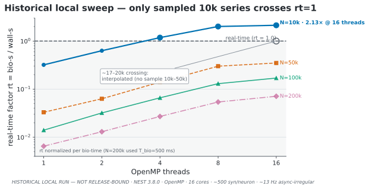
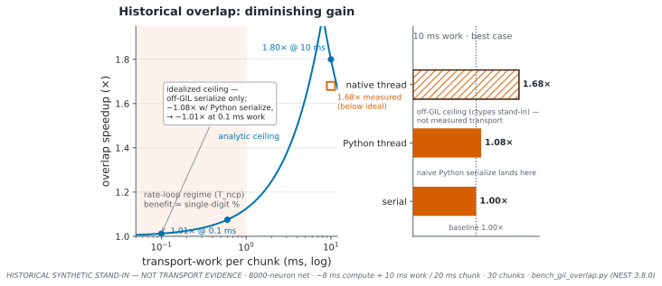

# Does NCP bottleneck NEST? — performance review

> **Evidence boundary:** measurements in this document are historical developer
> benchmarks, not release-bound certification of the unreleased NCP
> `1.0.0-rc.1` artifacts. The final installed-package, platform, secure-transport,
> fault-load, memory, and queue profile is **NOT RUN**.

**Release answer: not established.** Historical NEST measurements characterize
specific simulator workloads and chunking choices. They do not establish the cost
of the complete NCP boundary.

NEST advances simulation time during `nest.Run(chunk)`. A chunked provider can do
recorder readback, stimulus injection, validation, serialization, and transport
work outside that call. The exact boundary is provider-specific. Two useful models
are:

```
real_time_factor ≈ chunk_ms / (T_run + T_boundary)
chunk_frequency ≈ 1 / (T_run + T_boundary)
```

Here, `T_boundary` is the complete measured work outside `nest.Run`. Boundary work
becomes material when it is comparable to `T_run`. The result depends on the
workload, transport, security profile, provider, and platform. The candidate has no
release-bound performance profile.

## Reference-backend readback boundary

The NCP [implementation ledger](docs/implementation/NCP_1_0_TASK_LEDGER.md)
records Engram's native-1.0 provider migration as open. NCP retains no public,
installed, source-bound performance receipt for that consumer backend. Private
consumer source is not a public citation or release artifact, so this document
does not make source-bound complexity claims about it.

A counter-difference rate path can be O(1) per step. An event path can be O(new
events) only when the installed recorder proves bounded drain or equivalent tail
access; a fallback that fetches retained history can remain O(history). Measure the
exact installed provider. No retained long-duration profile establishes either
cost for the candidate stack.

## Component cost model

| Term | Cost | Notes |
|---|---|---|
| stimulus injection | O(number of stimulus ports) | backend, model, and build dependent |
| `nest.Run(chunk)` | model and configuration dependent | simulator work is outside the NCP contract |
| readback | provider and path dependent | prove counter, bounded drain, tail-access, and retained-history behavior on the installed build |
| codec mapping | workload dependent | channel count, record kind, and model shape affect cost |
| canonical JSON boundary | payload and validation dependent | full ingress includes bounded raw parsing and semantic validation |
| transport | deployment dependent | security profile, topology, load, queues, and failure behavior affect cost |

No retained run measures all rows together for one current installed source and
artifact set. Do not infer a per-tick NCP cost from one component.

## Rust component-measurement boundary

[`ncp-core/examples/overhead.rs`](ncp-core/examples/overhead.rs) is an exploratory
component harness. It applies `serde_json` to constructed typed frames. It also
calls `SafetyGovernor::govern` and `ReflexController::step` as separate operations.

Those operations are not a complete ingress or control tick. In particular, a
typed `serde_json` decode does not exercise the bounded raw-JSON ingress path. That
path checks byte limits, duplicate decoded keys, Unicode, nesting, node counts,
member counts, and semantic limits before admission.

The harness also excludes transport-principal binding, manifest policy, route and
plane admission, session and stream fencing, authority leases, idempotency,
security-state validation, queue behavior, transport, and body integration. Its
constructed frame sizes are not a release payload profile.

No exact-environment receipt, retained raw samples, uncertainty analysis, or
installed-artifact run supports a numeric NCP tick budget from this harness. The
release-bound CPU, allocation, memory, frame-size, throughput, and latency profile
is **NOT RUN**.

Canonical JSON remains the candidate runtime representation because the current
contract specifies it. This is not a performance conclusion. See
[`RATIONALE.md`](RATIONALE.md) for the protocol design boundary.

The protobuf schema in [`proto/ncp.proto`](proto/ncp.proto) (+ `gen/rust`) is the
normative field-number/message-shape IDL within the repository's documented
contract-registry precedence. It is not a shipped runtime encoding or the sole
contract source. The `prost` bindings are not compiled into the runtime path.

A future binary encoding requires explicit negotiation, conformance, and measured
need. The bounded local/offline `BulkBlock` codec is not a transport frame. JSON
`ObservationFrame` remains the only shipped observation-plane representation.

### Release-bound budget

NCP has no current release-bound CPU percentage or end-to-end control-loop budget.
A valid budget must measure the complete installed path under the selected security
profile, payload, topology, queue load, simulator, plant integration, and platform.
It must retain sample distributions and tail latency. This work is **NOT RUN**.

Engram's native-1.0 migration is in progress. Crebain and Prisoma remain on wire
0.8. The multi-consumer shape is a target, not interoperability evidence.

### Candidate optimization: avoid one owned-buffer copy

One wire-neutral optimization candidate is in [`ncp-zenoh`](ncp-zenoh): the current
slice-based `ZenohBus::put` makes an owned copy for Zenoh.

```rust
// ncp-zenoh/src/lib.rs — ZenohBus::put
self.session.put(key, payload.to_vec())   // clones an already-owned Vec<u8>
```

Some callers already own the serialized `Vec<u8>`. Adding an owned-buffer path,
for example
`put_owned(key, payload: Vec<u8>, plane)`, or making `put` generic over
`impl Into<ZBytes>`, could remove that one allocation/copy without changing wire
bytes. It does **not** by itself establish shared-memory zero-copy: ownership,
buffer compatibility, Zenoh behavior, backpressure, and end-to-end measurement all
need separate implementation and verification. No benefit is claimed until that
path is benchmarked in the release-bound matrix.

This optimization and the remaining audited risks are catalogued individually in
[`KNOWN_LIMITATIONS.md`](KNOWN_LIMITATIONS.md). All original high-severity findings
(bulk decode amplification, unbounded/non-finite TTL, and empty-position geofence
bypass) are fixed and regression-tested; the live ledger retains unresolved work.


## Secondary implementation considerations

- **Consumer transports are unqualified.** A local or bridge test does not
  establish installed streaming performance, authenticated principal binding, or
  gateway behavior.
- **Provider scheduling is workload dependent.** Measure multi-client queueing,
  concurrency, throughput, and tail latency for the exact installed provider.
- **Raw spike JSON grows with event count.** Use only an observation stream whose
  declared consumer can accept gaps. The stable observation transport uses DROP,
  and its bounded adapter queue drops the oldest item and counts the loss. This is
  not a loss-free trace-transfer channel.
- **The bulk column codec is local and offline.** `ncp-core::bulk` packs bounded
  numeric arrays in fixed-width columns with a column directory. It is not a
  transported frame. `BulkObservation` is excluded from the stable 1.0 transport
  surface. Canonical JSON `ObservationFrame` is the available wire representation.

## Cross-system comparison boundary

MUSIC, ROS/MUSIC, DDS/ROS 2, NRP, NEST Server, and NCP measurements use different
payloads, topologies, simulators, encoding/decoding work, clocks, hardware, and
latency definitions. For example, the ROS/MUSIC paper's reported end-to-end
reaction latency includes a complete sensory-to-motor toolchain; it is not
comparable to a transport-only loopback hop. Combining those values into a
faster/slower ranking would be invalid.

The cited systems remain architectural context, not an NCP performance baseline:
[Djurfeldt et al. 2010](https://pmc.ncbi.nlm.nih.gov/articles/PMC2846392/),
[Weidel et al. 2016](https://www.frontiersin.org/articles/10.3389/fninf.2016.00031/full),
and [Liang et al. 2023](https://arxiv.org/abs/2303.09419). NCP currently claims no
state-of-the-art standing, latency crown, throughput advantage, or cross-system
equivalence. A valid comparison requires one preregistered workload and estimand,
the same hardware/topology/security profile, retained raw data, uncertainty, and
independent reproduction; that campaign is `NOT RUN`.

## Historical chunk, scaling, and overlap measurements (NEST 3.8.0, 16 cores)

Three developer benchmarks illustrate the local cost decomposition. They neither
confirm a general bottleneck model nor bind the release candidate.
Reproduce with [`scripts/bench_chunk_overhead.py`](scripts/bench_chunk_overhead.py),
[`scripts/bench_realtime.py`](scripts/bench_realtime.py), and
[`scripts/bench_overlap.py`](scripts/bench_overlap.py); full sizing table in
[`NEST_REALTIME.md`](NEST_REALTIME.md) and full methodology in
[Benchmark methodology & reproducibility](#benchmark-methodology--reproducibility)
below.

### Historical per-chunk readback observation

The historical real-time sweep used a 1,000-neuron readout subset. It did not
isolate readback cost from integration and spike delivery. It therefore cannot
establish a readback budget or bound the O(history) fallback on another NEST build.

### Scaling: simulator feasibility is necessary, not sufficient

In the retained sweep, a Brunel-style balanced net (~500 syn/neuron, ~13 Hz
async-irregular) reached `rt >= 1` only for N=10000 at T>=4; no sampled N>=50000
configuration reached it. This condition is necessary only for the measured NEST
work. A complete loop also requires `T_run + T_boundary <= chunk_ms`. The unsampled
crossing between 10k and 50k must not be reported as a measured capacity. Ratios
above 100% apparent efficiency occurred in some retained minima, but with at most
three repetitions, no uncertainty, and no independent reproduction, cache effects
are only one hypothesis. These values may guide a new campaign; they do not
establish a practical live ceiling or prescribe thread/chunk settings for another
deployment.

<picture>
  <source media="(prefers-color-scheme: dark)"  srcset="docs/plots/realtime_dark.svg">
  <source media="(prefers-color-scheme: light)" srcset="docs/plots/realtime_light.svg">
  
</picture>

<sub>**Historical local real-time-factor sweep** (`rt = bio-s / wall-s`, log–log). Only the sampled 10k-neuron series crosses `rt = 1`; the hollow ~17–20k marker is an interpolation across an unsampled range, not capacity evidence. Regenerate with [`scripts/plot_perf.py`](scripts/plot_perf.py).</sub>

### Historical I/O-overlap and GIL probes

Two historical GIL probes suggest where transport work might run in this specific
PyNEST configuration. (1) A background spinner thread
retained only **~0.4–1.3% of its standalone counting rate during a real
`nest.Run()`** — `nest.Run()` holds the Python GIL for essentially its full
duration (`gil_released=false` in that probe). (2) A `ThreadPoolExecutor` overlap
loop produced **~0.92–1.10×**. Those observations are not a general proof about
other NEST/Python versions or workloads.

The second test used a C `pthread` invoked through `ctypes`; the synthetic worker
did not execute Python and could run while the main thread called `nest.Run()`.
Its wall-clock result used an off-GIL busy-spin transport stand-in
(8000-neuron net, ~8 ms compute and 10 ms transport-work per 20 ms chunk, 30 chunks;
[`scripts/bench_gil_overlap.py`](scripts/bench_gil_overlap.py)):

| overlap mechanism                              | wall    | speedup |
| ---------------------------------------------- | ------- | ------- |
| serial (`Run`, then transport)                 | 0.586 s | 1.00×   |
| **native thread** (C / Rust / PyO3) during `Run` | **0.348 s** | **1.68×** |
| Python thread during `Run`                     | 0.541 s | 1.08×   |

<picture>
  <source media="(prefers-color-scheme: dark)"  srcset="docs/plots/overlap_dark.svg">
  <source media="(prefers-color-scheme: light)" srcset="docs/plots/overlap_light.svg">
  
</picture>

<sub>**Historical I/O-overlap illustration.** The left panel shows the analytic ceiling `(compute+work)/max(compute,work)` for modeled work. The ceiling approaches one as modeled work becomes small relative to compute. The hatched native-thread bar is an idealized off-GIL `ctypes` result, not measured NCP transport. Regenerate with [`scripts/plot_perf.py`](scripts/plot_perf.py).</sub>

The 1.68× value is an idealized local ceiling, not measured NCP transport. Real
serialization, queues, synchronization, and Zenoh behavior could erase or reverse
the gain. Native, PyO3, and out-of-process designs therefore remain hypotheses to
measure against the serial baseline on the exact installed stack. The committed
scripts make that experiment repeatable in form, but the original raw receipts and
environment image are absent and one prototype was reconstructed; neither the
absolute values nor a native-over-Python ordering is independently reproduced.

## Benchmark methodology & reproducibility

The benchmark scripts are committed and parameterized, so a third party can attempt
the same procedure. Exact numerical reproduction is not promised: the original raw
result files, complete environment image, dependency lock, uncertainty analysis,
and independent receipt are absent. This section documents the intended method and
known caveats so a future release-bound campaign can replace the historical values.

### Shared environment, protocol & caveats

* **Hardware / OS:** 16 physical cores, 128 GB RAM (the reference machine).
* **Simulator:** the retained values report **NEST 3.8.0**, OpenMP-only, single MPI
  rank. They say nothing about later NEST/Python combinations until rerun. Each
  script prints `nest.__version__`; run
  [`scripts/verify_nest_chunking.py`](scripts/verify_nest_chunking.py) as a local
  semantic probe, not as certification.
* **Build is excluded from the timer.** Network construction (`Create`/`Connect`)
  runs *outside* `perf_counter`; only the simulate phase is timed. These results
  therefore cannot characterize startup or total experiment latency.
* **Warmup + reps + retained minimum.** Configurations use an untimed warmup and a
  small number of timed repetitions. The historical tables retain the minimum,
  which is a best observed sample—not an estimate of typical, tail, or achievable
  production performance. Future evidence must retain all samples and uncertainty.
* **Determinism where it gates correctness.** The chunk benchmark uses
  `local_num_threads = 1` and a fixed `rng_seed` so its bit-identical equivalence
  check is meaningful. (The realtime/overlap sweeps vary threads on purpose and do
  not require cross-thread bit-identity.)
* **Run a NEST-enabled interpreter DIRECTLY, not via `conda run`.** `conda run`
  fully buffers child stdout when redirected, so per-row streaming progress never
  appears. Invoke the NEST-enabled Python directly with `-u`, e.g.
  `python -u scripts/bench_*.py` (point at your env's interpreter). The `-u`
  forces unbuffered stdout. Each script also exits with a clear **"REQUIRES NEST"**
  message if `import nest` fails.
* **General caveats:** few-reps timing is noisy on tiny signals (sub-millisecond
  per-chunk costs); the realtime frontier's ~17k–20k crossing is *interpolated*
  (no sample between 10k and 50k); firing-regime and fixed-indegree assumptions are
  stated per benchmark and the numbers do not transfer outside them.

### 1. Chunk overhead — [`scripts/bench_chunk_overhead.py`](scripts/bench_chunk_overhead.py)

* **Measures:** the per-chunk cost of NCP's stepwise control model — monolithic
  `Run(T_bio)` vs **chunked-efficient** (`Prepare()` once → `Run(chunk)` in a loop
  → `Cleanup()`, the NCP pattern, kernel state persists) vs **chunked-naive**
  (`nest.Simulate(chunk)` per chunk, the anti-pattern that re-`Prepare`/`Cleanup`s
  every chunk), swept across chunk sizes.
* **Network:** `iaf_psc_alpha`, 10000 neurons (8000 E / 2000 I), **sparse**
  recurrent connectivity (`fixed_total_number`, 4000 synapses; E sources 80% / I
  sources 20% of the budget; inhibition `-g·w`, g=5). One `poisson_generator`
  (8000 Hz default) drives all neurons → real, identical spiking compute across
  every config. A `spike_recorder` on all neurons supplies the equivalence check.
  Sparse-on-purpose: keeps recurrent delivery cheap so the timer reflects
  per-`Run()` overhead rather than synaptic compute.
* **Timing protocol:** `local_num_threads=1`, fixed `rng_seed`; the network is
  **rebuilt fresh (untimed) before every rep**; 1 untimed warmup + 5 timed reps
  per config; **MIN wall** reported; slowdown = `min_config / min_monolithic`.
* **Correctness / equivalence check:** because kernel state persists across
  `Run(chunk)`, monolithic and **all** chunked-efficient reps must produce
  **bit-identical total spike counts** for the fixed seed. The script asserts this
  (`--strict` → non-zero exit on any divergence). chunked-naive is timing-only and
  excluded from the equivalence set (each `Simulate` tears down/rebuilds).
* **Command:**
  ```bash
  python -u scripts/bench_chunk_overhead.py \
      --neurons 10000 --synapses 4000 \
      --chunk-ms 100 50 20 10 5 2 1 --t-bio-ms 1000 --reps 5 --strict
  ```
  (Smoke test: `--neurons 200 --synapses 100 --chunk-ms 100 10 --t-bio-ms 100
  --reps 2`.) On the sparse 10k net the per-`Run()` overhead is small and the
  equivalence check passes (bit-identical spike counts mono ↔ chunked-efficient);
  chunked-naive is the slowest. The takeaway matching the cost model: on a
  *compute-bound* net, shrinking the chunk adds per-`Run()` overhead without
  changing throughput (see the 50k-net 10 ms-chunk figure above).

### 2. Real-time factor & sizing — [`scripts/bench_realtime.py`](scripts/bench_realtime.py)

* **Measures:** the real-time factor `rt = bio_time / wall_time` of a NEST network
  versus network size N and thread count. `rt = 1` means exactly real time and
  `rt > 1` means faster than real time for the measured NEST work only. A complete
  loop still requires `T_run + T_boundary <= chunk_ms`.
* **Network:** Brunel-style balanced random net (the NEST standard scaling
  benchmark): `iaf_psc_alpha`, 0.8N E / 0.2N I, **fixed indegree** held constant
  across N (`fixed_indegree`, CE=400 from E, CI=CE/4=100 from I ⇒ ~500 recurrent
  syn/neuron), inhibition-dominated (g=5), per-neuron `poisson_generator` tuned for
  an async-irregular **~13 Hz** regime. A `spike_recorder` reads back only a
  1000-neuron readout subset (mimics an NCP `RecordSpec`). Recording overhead was
  not isolated, and the sampled scaling must not be extrapolated beyond the grid.
* **Timing protocol:** `local_num_threads` set **before** node creation (required
  by NEST); build outside the timer; only `nest.Simulate(T_bio)` timed; one untimed
  warmup, then up to 3 timed reps with the **MIN wall** reported;
  `rt = (T_bio_ms/1000) / min_wall_s`. Reps exceeding a 60 s skip threshold stop
  after one timed rep (large-N budget guard).
* **Regime diagnostic:** the retained per-cell firing rates were 12.3–13.5 Hz
  across the sampled grid. That narrow range is a diagnostic, not proof of model
  correctness, statistical equivalence, or N/T invariance. The full sizing table is
  in [`NEST_REALTIME.md`](NEST_REALTIME.md).
* **Command:**
  ```bash
  python -u scripts/bench_realtime.py \
      --n 10000 50000 100000 200000 --threads 1 2 4 8 16 \
      --t-bio-ms 1000 --reps 3
  ```
* **Caveats:** the ~17k–20k crossing at T=16 is an **interpolation** (no sample
  between 10k and 50k), not a measured ceiling; `fire_hz` comes from the first-rep
  event count, not the min-wall rep; N≥200000 uses a shortened `T_bio` with `rt`
  scaled to its own bio time.

### 3. I/O overlap & GIL test — [`scripts/bench_overlap.py`](scripts/bench_overlap.py)

* **Measures:** (a) whether `nest.Run()` releases the Python GIL, and (b) whether
  in-process Python threading can overlap NCP transport I/O with NEST compute.
* **Network:** Brunel-style `iaf_psc_delta`, default N=5000 (0.8/0.2 E/I),
  `fixed_indegree` CE=100 / CI=25, g=5, `poisson_generator` 20000 Hz, `Prepare()`'d
  once for chunked `Run()`. (Lighter `iaf_psc_delta` net so per-chunk compute is in
  the same ballpark as the modeled I/O, to actually exercise the overlap question.)
* **GIL-probe method:** a background **spinner thread** increments a
  counter in a tight Python loop. First measure its *standalone* counting rate over
  0.3 s (baseline). Then start a fresh spinner and call a real `nest.Run(run_ms)`;
  measure the counter's rate *during* the Run. The **retained fraction** =
  during/baseline. A GIL that was **released** during Run would let the spinner keep
  substantially more activity; a held GIL would starve it. The retained NEST 3.8.0
  observations were ~0.4–1.3%. Scheduler behavior and probe interference prevent
  treating that threshold as a formal GIL proof.
* **Overlap-loop method:** a chunked `Run` loop uses the same modeled work in two
  arrangements. The serial arrangement runs `serialize_io(); Run()` for each
  chunk. The overlap arrangement submits `serialize_io` to one worker while the
  main thread calls the next `Run`.

  `serialize_io` uses Python's standard JSON library on constructed frame-shaped
  values. It also uses `time.sleep` as a modeled transport delay. It does not call
  NCP's bounded raw-JSON ingress, semantic admission, or a transport. The retained
  ratios were **0.92–1.10×**. The experiment does not establish a required
  architecture.
* **Command:**
  ```bash
  python -u scripts/bench_overlap.py \
      --n 5000 --threads 16 --chunk-ms 10 --t-bio-ms 1000 --io-ms 0.5 2 5
  ```
* **Caveat (reproduction provenance):** the original `bench_overlap.py` prototype
  was deleted after its first run and reconstructed. The reconstruction produced
  similar qualitative observations, but absolute per-chunk-compute magnitudes
  differ by >2× because the exact original Poisson drive was unknown. That is a
  provenance failure; the original run is not exactly reproducible.

## What to measure on your hardware

1. `T_run` for your network at your `chunk_ms` — this sets the feasible rate.
2. Readback cost (O(1) for rate; O(new) only after proving recorder drain, otherwise
   O(history)) and end-to-end tick time.
3. **p99 jitter**, not mean — the thing a control loop actually cares about.
4. Then pick `chunk_ms` for your latency/throughput point (as you would a MUSIC tick).

## Honest remaining items

- Confirm bounded recorder drain or tail access on the exact installed provider.
  Otherwise, an event-readback path can remain O(history).
- Large-population analog recording can be expensive. An explicit member ID can
  select one neuron when the provider supports it; without IDs, a provider can
  record the declared population. Measure and bound the exact installed selection.
- Continuing adversarial audits of NCP (correctness, safety, robustness, overhead)
  are catalogued in [`KNOWN_LIMITATIONS.md`](KNOWN_LIMITATIONS.md). Its old numeric
  summary is retired; treat the per-finding ledger as the live status register. The
  top *performance* item there (the `ncp-zenoh`
  `payload.to_vec()` copy) is still open and is discussed in
  [candidate copy-avoidance optimization](#candidate-optimization-avoid-one-owned-buffer-copy) above.
