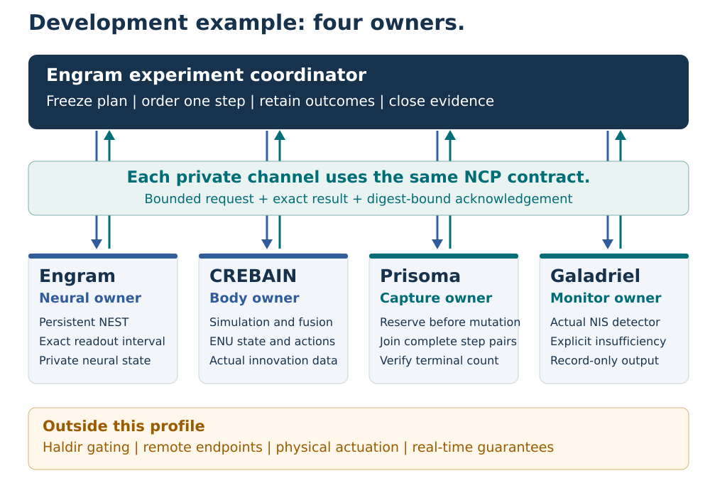

# NCP — Neuro-Cybernetic Protocol

<p align="center">
  <picture>
    <source media="(prefers-color-scheme: dark)" srcset="assets/logo-dark.svg">
    <source media="(prefers-color-scheme: light)" srcset="assets/logo-light.svg">
    
  </picture>
</p>

<p align="center"><a href="assets/archive/logos/README.md">Logo design archive</a></p>

NCP connects independently owned neural simulations, simulated bodies, capture tools, and monitors through explicit data contracts.
The first bounded development profile demonstrates exact causal steps and retained outcomes in one local experiment.
Final product v1 requirements remain open.

**Release status: unreleased.**
The [local release registry](local/release.v1.json) records this reference profile's contract, packages, application roles, and required gates.
Native development controls have passed.
Immutable installed qualification and final publication remain open.
The reference profile's intended tag remains `local-v1.0.0`.
That profile does not define the complete final product scope.

The broader `1.0.0-rc.1` protocol candidate remains release-blocked under its [separate scope](docs/1.0-scope.md).
Its Zenoh, remote-security, physical-control, and eleven-role gates remain unpassed.
The latest published legacy release remains `v0.8.0`, with an incompatible wire.
No local test promotes either historical surface.

## Open final v1 requirements

NCP must support independently selectable adapters and optional project combinations.
Using one project must not require a mandatory all-project bundle.
The final product also requires:

- Declared profiles for many entities and multiple actual sensor modalities, with exact units, layouts, missingness, and measured bounds.
- CREBAIN standalone operation and many-drone experiments, with declared camera/3DGS, audio, and heat sensor profiles.
- Prisoma ownership of embodied-agent and world-model experiments, with CREBAIN available as a simulation dependency.
- Optional Engram integration and independent qualification of each supported project combination.

These requirements need implementation and qualification evidence.
The current four-owner controls cover only the bounded reference profile below.

## Development reference: one experiment, four owners



[Open the scalable architecture SVG](docs/local-v1/architecture.svg).
The figure shows this reference experiment's ownership and communication.
It is not a release receipt.

| Owner | Responsibility | Authority boundary |
| --- | --- | --- |
| Engram | Maintain one NEST network and sequence the experiment. | Own neural execution and scientific interpretation. |
| CREBAIN | Advance simulated bodies and produce actual fusion diagnostics. | Apply the final simulated acceleration. |
| Prisoma | Reserve journal capacity and capture exact causal step pairs. | Verify storage completeness; grant no command authority. |
| Galadriel | Run its actual statistical detector on the supplied diagnostics. | Record results and abstentions; grant no command authority. |
| NCP | Define shared shapes, limits, identities, and outcomes. | Provide a contract and SDKs; own no central runtime process. |

In this reference, the run owner uses separate private process pipes for each peer.
Peer engines and stores cannot become alternative runtime integration paths.
Each request binds the exact profile, role, run, generation, sequence, operation, and body.
The receiver retains its complete outcome until the caller acknowledges that outcome's digest.

Capture reservation precedes dependent neural and body mutation.
A lost response does not establish whether execution occurred.
The owner preserves known results, records unresolved dispatches, and retires uncertain generations.
Same-generation crash resume is excluded.

## Supported reference envelope

| Property | Reference contract |
| --- | --- |
| Host qualification target | Darwin, trusted installed applications, private pipes, and the selected process sandbox. |
| Entities | One through three, with a frozen ordered roster. |
| Run length | At most 1,024 coupled steps. |
| Shared step duration | 1 through 1,000 milliseconds; applications can impose stricter limits. |
| Coordinates | East, north, up; position in meters, velocity in meters per second. |
| Action | Simulated acceleration in meters per second squared. |
| Wire | A four-byte big-endian length followed by at most 65,536 JSON bytes. |
| Identity | Closed typed data and domain-separated digests with exact binary64 round trips. |
| Capture | Bounded lossless capture with complete terminal verification. |
| Monitoring | Record-only output with explicit insufficient-evidence results. |
| Recovery | Exact live result lookup and acknowledgement; no re-execution of a released operation. |

Engram's reference application targets NEST Simulator 3.9.0.
It supports five fixed neuron profiles and one tested persistent update/readout mechanism.
The [local guide](docs/local-v1/README.md) states the stricter application bounds.

This CREBAIN adapter supplies one Visual modality per entity.
Galadriel's selected detector requires at least two modalities.
A ready Visual channel therefore remains insufficient for a cross-modal verdict.
Three innovation dimensions do not become three modalities.

Haldir-gated execution is unsupported by this profile.
Haldir's existing velocity-command semantics do not define this acceleration interface.
A gated request must fail before preparation.
Remote endpoints, physical actuation, and real-time guarantees are also excluded.

## Learn the contract

The [mathematical guide](docs/local-v1/math-guide.md) defines the symbols, units, assumptions, and operating bounds.
It explains delayed spike readout, innovation statistics, exact outcomes, and capture completeness through worked examples.

- [Eight-page vector PDF](docs/local-v1/ncp-local-v1-guide.pdf)
- [Scalable step-order SVG](docs/local-v1/step-order.svg)
- [Exact profile and semantic contract](docs/local-v1/profile-contract.md)
- [Ten-approach reference-profile decision and five review lenses](docs/local-v1/decision.md)
- [Original 70 acceptance requirements and current evidence status](docs/local-v1/acceptance-70.md)

The JSON descriptor is canonical for this reference profile's local wire.
The [release registry](local/release.v1.json) registers that descriptor and its separate publication requirements.
Application profiles own their additional configuration and execution rules.
An inconsistency between these sources and an implementation blocks release.

The older `contract/*.v1.json`, protobuf, schema, and conformance hierarchy continues to govern the broader candidate only.
The [historical overview](https://github.com/sepahead/NCP/blob/11a1931871fbd27235bf53dbb5e55227b78d857e/README.md) preserves that earlier release scope.
Its retained [light diagram](docs/diagrams/overview-light.svg) and [dark diagram](docs/diagrams/overview-dark.svg) describe the broader candidate's proposed admission architecture.
Those historical diagrams do not describe an implemented local-v1 runtime or close their original gates.

## Implementations and verification

| Package | Selected purpose | Independence |
| --- | --- | --- |
| [Local Rust SDK](local/rust/README.md) | Standalone local framing, data validation, and outcome ownership. | Rust reference implementation. |
| [Local Python SDK](local/python/README.md) | Equivalent local contract and bounded client/owner implementation. | Independent pure-Python implementation; no Rust FFI. |
| [Broader candidate packages](docs/1.0-scope.md) | Historical migration and broader protocol development. | Separate candidate identities and unpassed release gates. |

The standalone Rust package has no dependency on the broader `ncp-core` candidate.
Its generated projection preserves the exact canonical module bytes.
Only test and example package imports change.
The projection gate checks every selected source and descriptor.

From the repository root, run the focused source and Rust gates:

```sh
python3 scripts/project_local_rust.py --check
cargo test --manifest-path local/rust/Cargo.toml --locked
cargo clippy --manifest-path local/rust/Cargo.toml --all-targets --locked -- -D warnings
```

The [release registry](local/release.v1.json) lists this reference profile's bootstrap and operational requirements.
Final product v1 also requires the open modular and multimodal capabilities stated above.
A source test does not qualify an installed application.
The operational gate must start from immutable, pushed source and exact installed artifacts.
Terminal release evidence follows that gate.

The broader candidate's complete local regression command remains `scripts/check.sh`.
Its separate external gates remain required for a broader release.
Local profile qualification cannot close those gates.

## Scientific and operating limits

Protocol success does not validate a paper reproduction, calibrated posterior, controller stability, or physical safety.
Simulation records retain `calibrated_posterior=false`.
Missing data, malformed output, and unusable traces cannot become successful measurements.

Digests identify supplied bytes and labels.
They are not scientific signatures or loaded-model attestations.
The Darwin boundary assumes trusted installed applications.
It does not isolate arbitrary malicious code or all Mach and process metadata.

The neural controller is a bounded research example.
Its fixed encoding and readout do not claim training, optimality, or state-of-the-art control performance.
Measured timing and resource results must state their exact host, workload, and artifact scope.

## Project documents

- [Local scope, owners, and remaining gates](docs/local-v1/README.md)
- [Broad candidate specification](NEURO_CYBERNETIC_PROTOCOL.md)
- [Broad candidate security contract](SECURITY.md)
- [Broad candidate release ledger](RELEASE_READINESS.md)
- [Frozen wire-0.8 baseline](docs/0.8-current-baseline.md)
- [System-design PDF build and comparison](docs/publication/README.md)
- [Documentation style](DOCUMENTATION_STYLE.md)
- [Contribution workflow](CONTRIBUTING.md)
- [Versioning policy](VERSIONING.md)

NCP uses either the [MIT](LICENSE-MIT) or [Apache-2.0](LICENSE-APACHE) license.
Use an immutable release's citation metadata when citing that release.
Repository HEAD and the local candidate are not published release evidence.
