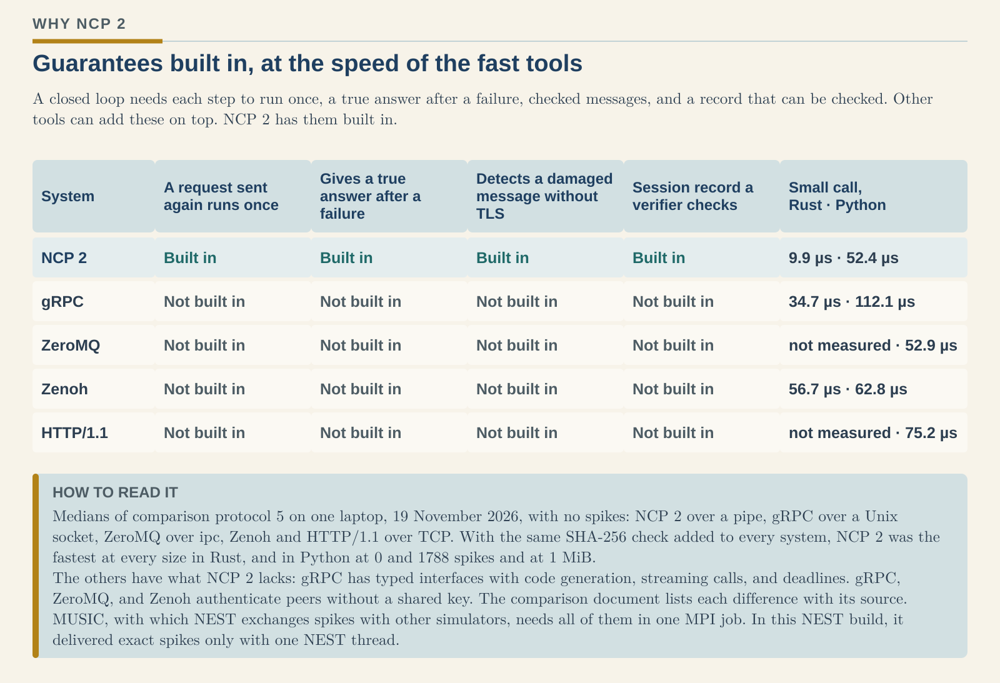
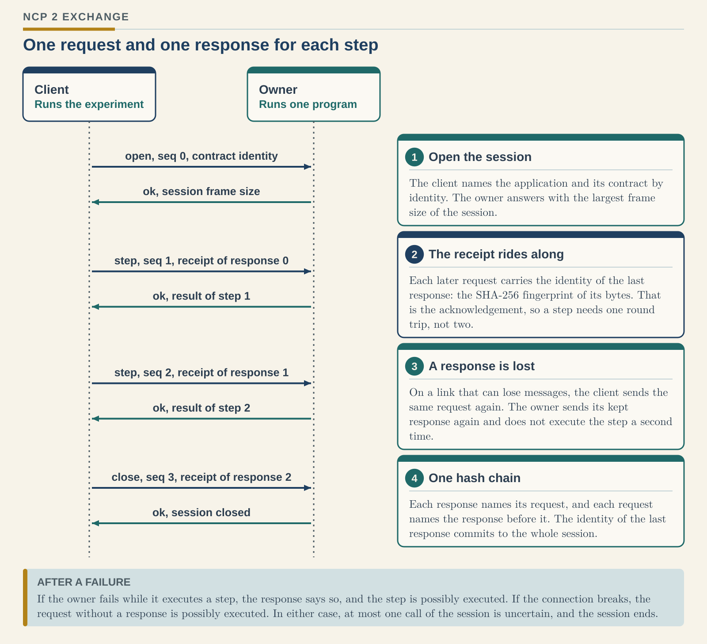
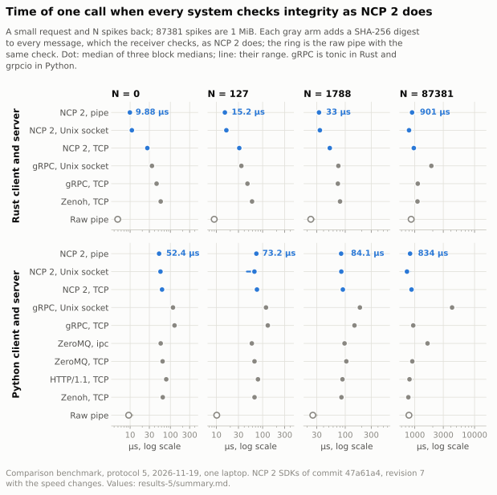
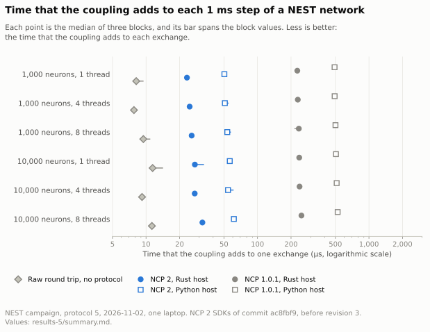
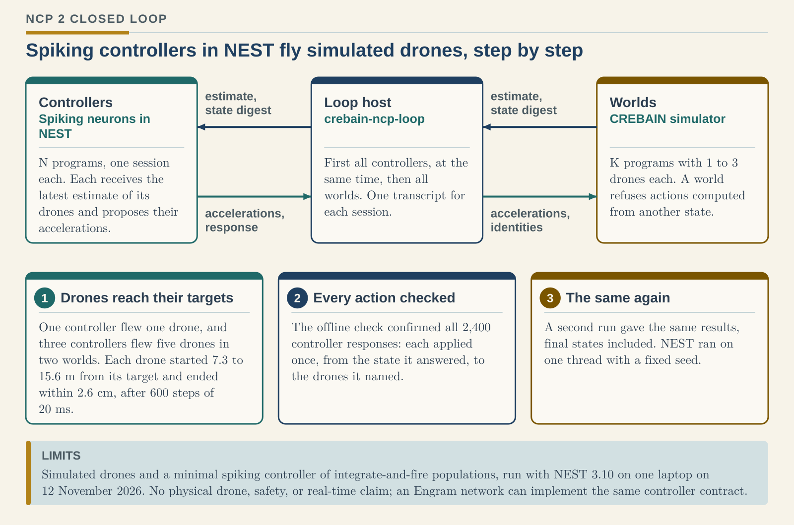
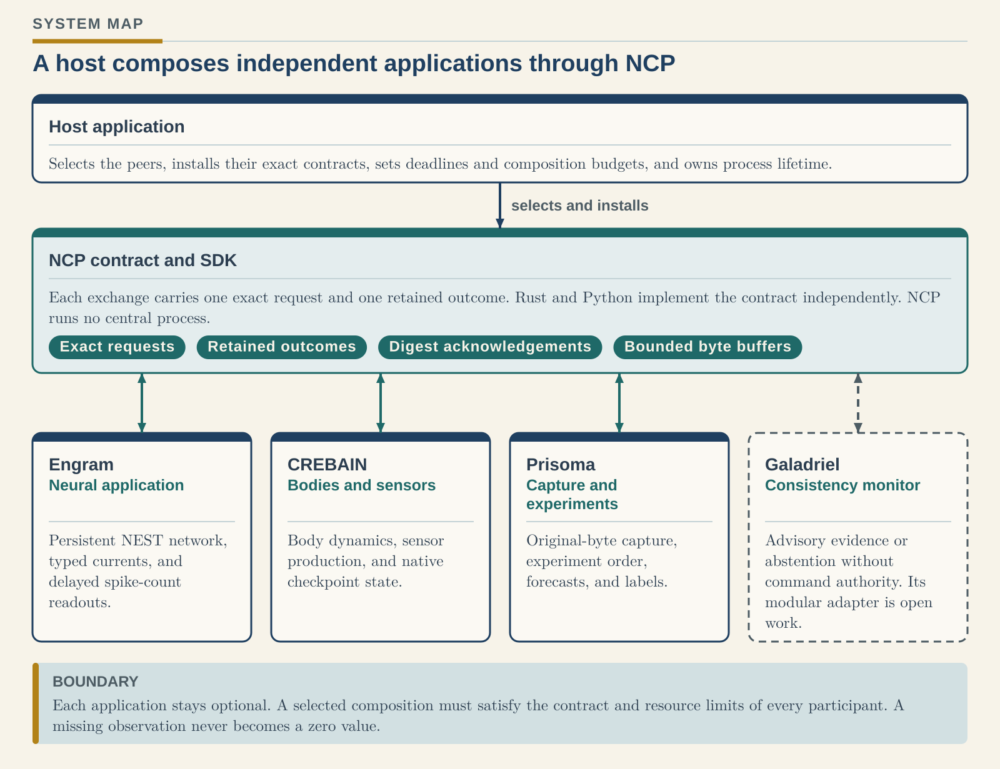
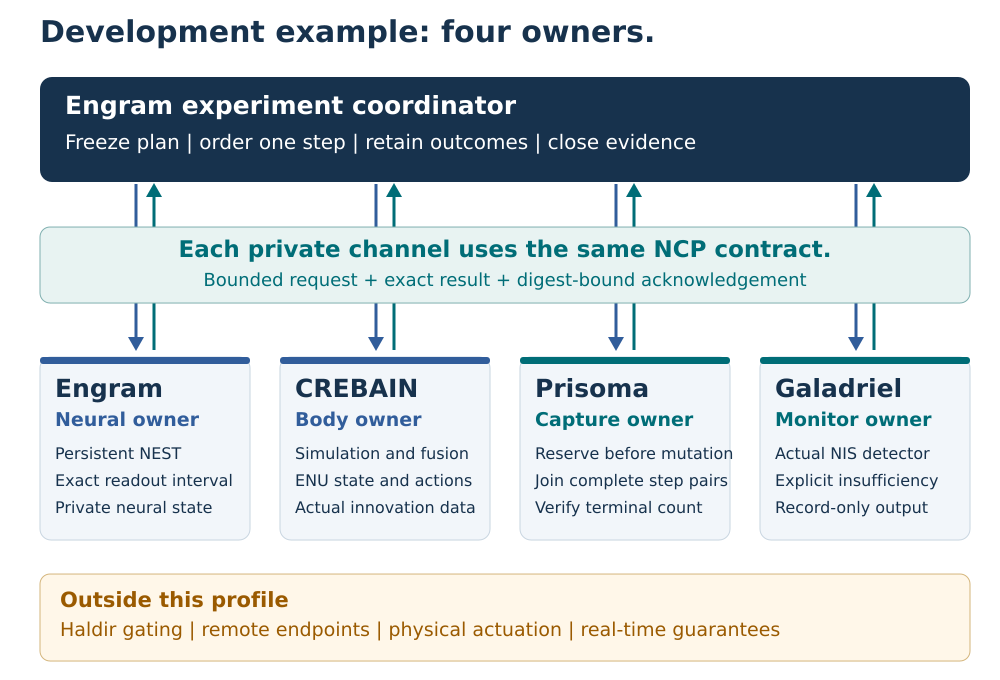
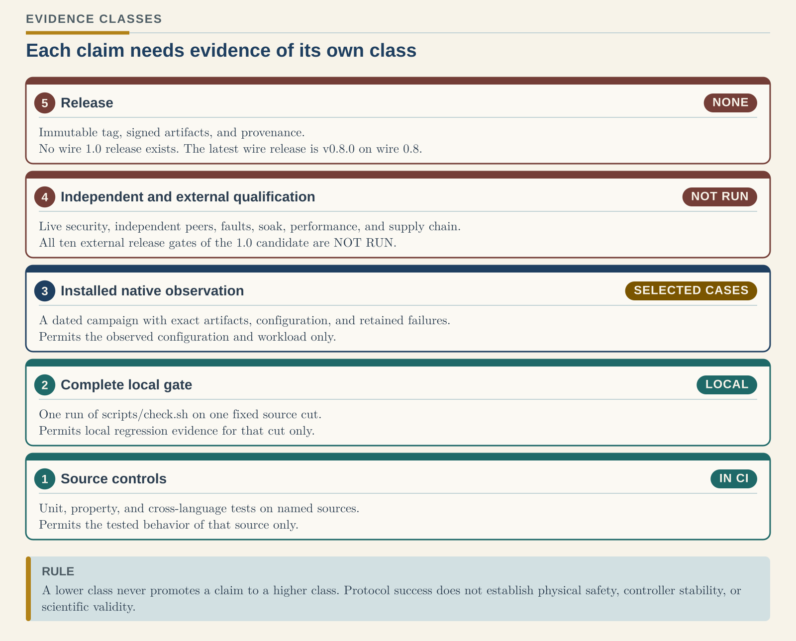

# NCP — Neuro-Cybernetic Protocol

<p align="center">
  <picture>
    <source media="(prefers-color-scheme: dark)" srcset="assets/logo-dark.svg">
    <source media="(prefers-color-scheme: light)" srcset="assets/logo-light.svg">
    
  </picture>
</p>

<p align="center"><a href="assets/archive/logos/README.md">Logo design archive</a></p>

NCP couples programs that different people write and run, such as a simulated brain and a simulated body, so that they can work together in steps.
One program, the client, asks another, the owner, to do a step.
NCP makes sure that no step runs twice, that the client learns whether each step ran or, after a failure, that it possibly ran, that damaged messages are detected, and that a record can show exactly what was sent and in which order.
Each application describes its own steps and data in a contract.

## Why NCP 2 exists

A closed-loop experiment couples programs that different people write: a simulated brain such as NEST, a simulated body or world, monitors, and recorders.
Each program runs in its own process, and they work in steps.
Four failures can make the result of such an experiment wrong without a visible error:

1. **A step runs twice.** A client sends a request again after a timeout, and the owner executes both copies. The simulation then advances two steps instead of one.
2. **The client does not know whether a step ran.** The connection breaks after the owner executed the step but before the response arrived. A client that guesses "not executed" sends the step again.
3. **Data changes on the way.** A damaged message, or a message that another connection replays, gives the receiver false data.
4. **Nobody can check the run afterwards.** Without a complete record in order, a result cannot be traced to the messages that made it.

General tools such as gRPC, ZeroMQ, HTTP, and Zenoh carry messages quickly and between many systems. They leave these four failures to each application.
NCP 2 handles them once, in the protocol:

| Failure | What NCP 2 does | Evidence |
| --- | --- | --- |
| A step runs twice | Each request carries its sequence number and the identity of the last response. The owner keeps its last response and sends it again for a copy of the request. | Lean claim `AtMostOnce`, fault trials |
| The client does not know | After a failure, the client says "executed", "not executed", or "possibly executed". It never says "not executed" for a step that could have run. | Lean claim `ClientTruthful`, a model check of the real Python client and owner in 5,150,954 states, and 11,040 fault trials with revision 7, before and after the speed changes |
| Data changes on the way | Each message carries a SHA-256 digest, or an HMAC-SHA-256 with a shared key. A response that names no request counts only when it names the client's session and last response. | Fuzzing of both decoders, fault trials with damaged and replayed frames |
| Nobody can check the run | The responses of a session form a hash chain. A verifier can check a transcript of the session afterwards. | Lean claim `Commitment`, transcript tests |

<a href="docs/diagrams/ncp2-why-light.svg">
<picture>
  <source media="(prefers-color-scheme: dark)" srcset="docs/diagrams/ncp2-why-dark.svg">
  
</picture>
</a>

The checks take time.
On one laptop, a small call took 9.9 µs between two Rust programs and 52.4 µs between two Python programs, against 4.5 µs and 9.4 µs for a raw pipe without any protocol ([comparison protocol 5](benchmarks/comparison/README.md#results-of-protocol-5)). In Python, it was as fast as ZeroMQ, the fastest other tool measured, and faster than gRPC, HTTP/1.1, and Zenoh.
When a program needs only the fastest transfer on one computer and makes its own checks, request and response over shared memory with iceoryx2 is about ten times faster ([comparison protocol 4](benchmarks/comparison/README.md#results-of-protocol-4)).
NCP 2 is for runs whose results must be correct and traceable. The [comparison document](docs/design/NCP-2-COMPARISON.md) states when another tool fits better.

## NCP 2

**NCP 2.0 is a release candidate: revision 7 of the specification, and packages of version 2.0.0rc7 (Python) and 2.0.0-rc.7 (Rust). The tag and the publication follow.** NCP 2 replaces the three protocol families of NCP 1, below, with one protocol. The projects that use NCP 1 move to NCP 2 before NCP 1 leaves the main branch.
[NCP 2 in plain words](docs/NCP-2-GUIDE.md) explains it with figures for readers without a background in protocols.
[Status of NCP 2](docs/NCP-2-STATUS.md) says what is ready, what blocks the tag, and why revision 7 is slower than earlier SDKs.
The [specification](spec/NCP-2.md) is the exact definition, and the [design record](docs/design/NCP-2-DESIGN.md) gives the reason for each decision and the alternatives that were measured.

<a href="docs/diagrams/ncp2-call-light.svg">
<picture>
  <source media="(prefers-color-scheme: dark)" srcset="docs/diagrams/ncp2-call-dark.svg">
  
</picture>
</a>

| Measured on one laptop | NCP 2 | NCP 1.0.1 | Record |
| --- | --- | --- | --- |
| One call with a small result, Rust to Rust | 9.9 µs (SDKs of 19 November 2026), 9.0 µs before revision 3 | 38.2 µs | [Comparison benchmark, protocols 5 and 2](benchmarks/comparison/README.md#results-of-protocol-5) |
| One call with a small result, Python to Python | 52.4 µs (SDKs of 19 November 2026), 38.8 µs before revision 3 | 473 µs | [Comparison benchmark, protocols 5 and 2](benchmarks/comparison/README.md#results-of-protocol-5) |
| Time added to each 1 ms step of a NEST network, Rust client | 23 to 32 µs | 228 to 248 µs | [NEST campaign](benchmarks/nest-campaign/README.md#results-of-protocol-5) |
| Spikes compared with NEST's recorder | All 42,026,126 exact, in 96 trials with up to 10,000 neurons | All exact in 72 trials with 1000 neurons | [NEST campaign](benchmarks/nest-campaign/README.md#results-of-content-protocol-2) |
| Spikes, precise spike times, and membrane potentials compared with NEST, eight networks of seven neuron models (SDK revision 7, before and after the speed changes) | All exact, bit for bit, in 216 trials each time: 66,165,804 spikes and 172,713,600 float64 samples over two hosts | not run | [NEST campaign](benchmarks/nest-campaign/README.md#results-of-content-protocol-4) |
| Fault trials with real programs, over Unix domain sockets and TCP (SDK revision 7, before and after the speed changes) | 4,560 trials each time: no wrong result, no step run twice, no false report of a step | 3,816 trials over pipes: no wrong result | [Fault campaign](benchmarks/fault-campaign/README.md#results-of-protocols-8-and-9) |
| Fault trials over the Zenoh binding: lost, repeated, delayed, and replayed messages, killed and restarted owners (SDK revision 7, before and after the speed changes) | 960 trials each time: no wrong result, no step run twice, no false report of a step. Every session with network faults only completed | not run | [Fault campaign](benchmarks/fault-campaign/README.md#results-of-protocols-8-and-9) |
| One round over 256 programs from one host (`call_all`) | 0.92 ms (Rust), 2.8 ms (Python) | not measured | [Multi-agent benchmark](benchmarks/multi-agent/README.md#results) |
| 64 agents sharing one world in rounds, Python owner | 2.6 ms per round; the same final state in every run | no rounds profile | [Multi-agent benchmark](benchmarks/multi-agent/README.md#results) |

With the SDKs before revision 3, NCP 2 was faster than gRPC and Zenoh in Rust and than gRPC and HTTP in Python up to 1,788 spikes per call, and, when every other system made the same SHA-256 check, the fastest at every size in both languages ([comparison protocol 2](benchmarks/comparison/README.md#results-of-protocol-2)).
Revision 7 made each small call 1.2 times as long in Rust and 1.5 times as long in Python ([comparison protocol 3](benchmarks/comparison/README.md#results-of-protocol-3)). A [bisection by revision](benchmarks/comparison/speed-by-revision/README.md) finds nearly all of the cost in revision 3, which rebuilt both SDKs around pure state machines for verification ([status of NCP 2](docs/NCP-2-STATUS.md#why-revision-7-is-slower)). A speed change of 19 November 2026 removed a part of it without a change of a rule: with it, a small call took 9.9 µs in Rust and 52.4 µs in Python ([comparison protocol 5](benchmarks/comparison/README.md#results-of-protocol-5)). With the same check, NCP 2 is the fastest at every size in Rust. In Python, it is the fastest at 0 spikes, 1,788 spikes, and 1 MiB, and ZeroMQ over ipc is faster at 127 spikes. HTTP/1.1 without a check was faster at 1,788 spikes. With 1 MiB per call, the systems without an integrity check are faster, by about the time of NCP 2's SHA-256 check. Request and response over shared memory with iceoryx2, with both ends polling, took 0.8 to 1.3 µs up to 1,788 spikes, about ten times faster than NCP 2 over a pipe, also with the same check ([comparison protocol 4](benchmarks/comparison/README.md#results-of-protocol-4)). NCP 2 has no shared-memory binding.

- The SDKs: [Python](python/README.md), which uses only the standard library, and [Rust](rust/README.md). The optional [Zenoh binding](bindings/zenoh/README.md), for both languages, carries the same frames between computers, with mutual TLS and access control.
- Nineteen claims about the owner and the client are proved in Lean for every sequence of inputs ([`formal/`](formal/README.md)). The SDKs are not proved: the Python and Rust owners give the same answers as the compiled Lean model on 20,000 random traces, and an exhaustive check drives the real Python client and owner through about 5.2 million states with faults, and the lockstep profile through about 565,000 ([`model/`](model/README.md)).
- The NEST and multi-agent times in this section were measured with the SDKs before revision 3 (23 October to 3 November 2026), and have not run again. The comparison benchmark ran again with revision 7 (protocols 3 and 4) and with the speed changes (protocol 5). The fault trials ran with the SDKs before revision 3 (8,730 trials over pipes, Unix domain sockets, and TCP), with revision 7 (5,520 trials), and with the speed changes (5,520 trials).
- [What NCP 2 changes from NCP 1](docs/design/NCP-1-SHORTCOMINGS.md) maps each known shortcoming of NCP 1 to its fix and its check, and lists the work that is still open.
- [NCP 2 compared with other tools](docs/design/NCP-2-COMPARISON.md) lists what NCP 2 adds, what it lacks, and when another tool fits better, with a source for each statement.
- The projects that use NCP move to NCP 2 one at a time, in the order of the [migration plan](docs/design/NCP-2-MIGRATION.md). NCP 1 stays available until the last one has moved.

## NCP 2 benchmarks: speed, lag, and correctness

Each measurement below comes from a protocol that was fixed, with its SHA-256 fingerprint, before its runs; each protocol ran in three blocks in a shuffled order on one laptop (Apple MacBook Pro, M4 Max, macOS 26.5.1).
A median is the median of the three block medians, and a 99th percentile is the median of the three blocks' 99th percentiles. Each benchmark's README gives every value, the range over the blocks, the conditions, and what the results do not show.

### Time of one call

One call sends a small request and gets N spikes back, 12 bytes each, between two processes on the laptop. The table gives [comparison protocol 5](benchmarks/comparison/README.md#results-of-protocol-5), with the NCP 2 SDKs of 19 November 2026, on the power adapter, with the clock and the load checked before and after each run.
Each cell gives the median and, after the slash, the 99th percentile, in µs. 99 of 100 calls took at most the 99th percentile, so it shows how long the slow calls take.

| Rust client and server | No spikes | 127 spikes | 1,788 spikes | 1 MiB |
| --- | ---: | ---: | ---: | ---: |
| NCP 2, pipe | 9.9 / 12.3 | 15.2 / 19.6 | 33.0 / 38.0 | 901 / 955 |
| NCP 2, Unix socket | 11.0 / 13.5 | 16.4 / 22.9 | 34.2 / 40.7 | 802 / 859 |
| gRPC (tonic), Unix socket | 34.7 / 39.9 | 31.3 / 37.8 | 55.8 / 63.3 | 1,174 / 1,256 |
| gRPC (tonic), TCP | 46.3 / 54.4 | 46.7 / 55.3 | 53.4 / 61.4 | 231 / 426 |
| Zenoh, TCP | 56.7 / 76.7 | 57.8 / 77.5 | 62.2 / 84.2 | 370 / 1,707 |
| NCP 1.0.1, pipe | 38.2 / 43.8 | 69.0 / 77.1 | 430 / 447 | not measured |
| Raw pipe, no protocol | 4.5 / 9.1 | 7.6 / 9.5 | 8.4 / 10.3 | 151 / 162 |

| Python client and server | No spikes | 127 spikes | 1,788 spikes | 1 MiB |
| --- | ---: | ---: | ---: | ---: |
| NCP 2, pipe | 52.4 / 59.6 | 73.2 / 86.5 | 84.1 / 101 | 834 / 903 |
| NCP 2, Unix socket | 56.7 / 65.8 | 66.5 / 86.5 | 84.7 / 96.2 | 740 / 866 |
| ZeroMQ, ipc | 52.9 / 68.6 | 55.0 / 69.2 | 76.0 / 93.2 | 1,041 / 1,083 |
| Zenoh, TCP | 62.8 / 87.5 | 63.5 / 82.4 | 66.0 / 88.0 | 142 / 178 |
| HTTP/1.1, TCP | 75.2 / 90.0 | 75.2 / 91.9 | 74.2 / 93.2 | 145 / 237 |
| gRPC (grpcio), TCP | 123 / 139 | 125 / 149 | 128 / 149 | 241 / 379 |
| NCP 1.0.1, pipe | 473 / 682 | 1,253 / 1,467 | 11,305 / 11,993 | not measured |
| Raw pipe, no protocol | 9.4 / 12.5 | 8.5 / 11.7 | 10.0 / 14.2 | 186 / 216 |

In Rust, NCP 2 was the fastest protocol up to 1,788 spikes, at the median and at the 99th percentile.
In Python, NCP 2 over a pipe was as fast as ZeroMQ over ipc with no spikes (52.4 against 52.9 µs) and faster than Zenoh, HTTP/1.1, and gRPC. With 127 spikes, ZeroMQ and Zenoh were faster at the median. With 1,788 spikes, HTTP/1.1 was also faster.
At 1 MiB, the other systems make no integrity check of the message, while NCP 2 computes and checks a SHA-256 digest of every message. That check takes most of NCP 2's time there: on a raw pipe in Rust, the same check costs 719 µs.
With the same check added to every system (the figure below), NCP 2 was the fastest at every size in Rust. In Python, it was the fastest at 0 spikes, 1,788 spikes, and 1 MiB, and ZeroMQ over ipc was faster at 127 spikes.
Before revision 3 ([comparison protocol 2](benchmarks/comparison/README.md#results-of-protocol-2)), a small call took 9.0 µs in Rust and 38.8 µs in Python, and with the same check NCP 2 was the fastest at every size in both languages. Revision 3 added work to every call ([status of NCP 2](docs/NCP-2-STATUS.md#why-revision-7-is-slower)).

<a href="benchmarks/comparison/results-5/figures/integrity_light.svg">
<picture>
  <source media="(prefers-color-scheme: dark)" srcset="benchmarks/comparison/results-5/figures/integrity_dark.svg">
  
</picture>
</a>

### Lag added to a running simulation

Coupled to the NEST simulator, a host asks NEST to advance its network by one step and waits for the result ([NEST campaign, protocol 5](benchmarks/nest-campaign/README.md#results-of-protocol-5)).
The table gives the time that the coupling adds to each exchange, measured inside the processes, for the Brunel network with 1,000 and 10,000 neurons on 1, 4, and 8 threads and one exchange after every 1 ms of simulated time: the range over the six configurations, in µs.

| Coupling | Median | 99th percentile |
| --- | ---: | ---: |
| NCP 2, Rust host | 23 to 32 | 39 to 78 |
| NCP 2, Python host | 50 to 61 | 72 to 109 |
| NCP 1.0.1, Rust host | 228 to 248 | 279 to 324 |
| NCP 1.0.1, Python host | 492 to 524 | 574 to 629 |
| Raw round trip to another process, no protocol | 8 to 11 | 13 to 23 |

When each step also returns its spikes, NCP 2 adds 36 to 119 µs with a Rust host. NCP 1.0.1 adds 434 to 1,365 µs, and it cannot carry the steps of 10,000 neurons at 5 ms, because some of them exceed its 64 KiB message limit.
These times leave out one effect: a coupled NEST can do its own work more slowly than NEST alone. With 10,000 neurons, that effect varied between runs by more than the time of an exchange.
MUSIC, the MPI library with which NEST exchanges spikes with other simulators, needs all coupled programs in one MPI job. From the difference of wall times, it added 0.001 to 0.256 ms per 1 ms step in these configurations, against 0.026 to 0.141 ms for NCP 2 with a Rust host: less in three of the six, all with 4 or 8 NEST threads, and more in the other three. In this NEST build, MUSIC delivered the exact spikes only with one NEST thread; with T threads, only one channel in T carried its exact spike train ([content protocol](benchmarks/nest-campaign/README.md#results-of-the-content-protocol)).

<a href="benchmarks/nest-campaign/results-5/figures/overhead_light.svg">
<picture>
  <source media="(prefers-color-scheme: dark)" srcset="benchmarks/nest-campaign/results-5/figures/overhead_dark.svg">
  
</picture>
</a>

### Correctness

- **Exact data.** Both NCP 2 hosts received exactly the spikes that NEST recorded, each neuron and each time, in all 96 trials of [content protocol 2](benchmarks/nest-campaign/README.md#results-of-content-protocol-2), with 1 to 8 threads and up to 10,000 neurons: 42,026,126 spikes compared. Through the first process of an MPI program, all 521 million spikes that the client checked arrived exactly ([multi-agent benchmark](benchmarks/multi-agent/README.md#results)).
- **Faults.** In 4,560 trials with revision 7 of the SDKs and real programs over Unix sockets and TCP, with Rust and Python on both sides, messages were damaged, cut, or repeated, programs were killed, steps stalled, and messages were too large: no client accepted a wrong result, no owner ran a step twice or out of order, and no client was told something false about a step ([fault campaign, protocol 6](benchmarks/fault-campaign/README.md#results-of-protocol-6)). The SDKs before revision 3 had passed the same trials, and more over pipes, 8,730 in all (protocols 3 and 5).
- **One order for many agents.** With the rounds profile, up to 256 agents sharing one world received the same result after every round, and the world ended in the same state in every run ([multi-agent benchmark](benchmarks/multi-agent/README.md#results)).
- **Proofs and checks.** Nineteen claims about the owner and the client are proved in Lean for every sequence of inputs, and eleven injected defects each break the proof of the claim that forbids them. An exhaustive check drives the real Python client and owner through about 5.2 million states with up to two faults: lost, repeated, and reordered messages, restarts and stops of the owner, wrong requests, and an application whose verdict depends on its state. The Python and Rust owners give the same answers as the compiled Lean model on 20,000 random traces. Both SDKs pass the same conformance vectors, each requirement of the specification maps to its checks, and the decoders and message checks agree on 200,000 random and damaged messages in every gate run.

### Scale

- One host called 256 owners in one round in 0.92 ms with the Rust SDK and 2.8 ms with the Python SDK (`call_all`).
- 64 agents in rounds on one Python owner took 2.6 ms per round.
- An owner in the first process of an MPI program added 4 to 11 µs to a call with 1 to 8 processes, up to 1,788 spikes.

### Spiking controllers in NEST fly simulated drones

CREBAIN's [closed-loop host](https://github.com/sepahead/crebain/blob/main/docs/NATIVE_NCP_SIMULATION.md) runs controllers and simulated drone worlds, each with its own NCP 2 session.
Each controller here simulates spiking neurons in NEST: unconnected integrate-and-fire populations carry a proportional-derivative signal, computed in Python, as firing rates, and their spike counts give the accelerations.
On 12 November 2026, one controller flew one drone, and three controllers flew five drones in two worlds, to within 2.6 cm of their targets in 600 steps of 20 ms; an offline check of the transcripts confirmed all 2,400 controller responses, and a second run of the one-drone loop gave the same results. The run tests the coupling, not neural control ([evidence](https://github.com/sepahead/crebain/blob/main/integrations/ncp2-nest-controller/README.md)).

<a href="docs/diagrams/ncp2-loop-light.svg">
<picture>
  <source media="(prefers-color-scheme: dark)" srcset="docs/diagrams/ncp2-loop-dark.svg">
  
</picture>
</a>

### What these results do not show

They come from one laptop, with programs on one computer. They measure the protocols, not the work of a real simulation, except in the NEST campaign. The other systems ran with their default settings; NCP 2 sets 1 MiB socket buffers, which matters most at 1 MiB. The [Zenoh binding](bindings/zenoh/README.md) and networks between computers have not been measured yet.

## NCP 1: the released local SDK

NCP connects independently owned simulations and tools through exact, bounded data contracts.
The [modular local SDK](local/modular/README.md) lets a host select installed applications without requiring a fixed project bundle.
NCP owns message identity, retained outcomes, acknowledgements, and byte-buffer lifetime.
Each application owns its operations, observations, units, clocks, and accepted values.

<a href="docs/diagrams/system-map-light.svg">
<picture>
  <source media="(prefers-color-scheme: dark)" srcset="docs/diagrams/system-map-dark.svg">
  <source media="(prefers-color-scheme: light)" srcset="docs/diagrams/system-map-light.svg">
  
</picture>
</a>

Full-size vector figure: [light](docs/diagrams/system-map-light.svg?raw=true) · [dark](docs/diagrams/system-map-dark.svg?raw=true).

The [NCP System Design report](output/pdf/ncp-system-design.pdf) is the standalone technical reference.
It explains the design, the equations, and the evidence boundary of each scope.
A Lean 4 file checks its discrete arithmetic.

**Release status: local SDK 1.0.1 released; product v1 and wire 1.0 unreleased.**
The standalone `ncp-local` Rust and Python packages are released as version `1.0.1` under the tag `sdk-v1.0.1`, after `1.0.0` under `sdk-v1.0.0`.
The [SDK release record](local/modular/SDK_RELEASE.md) states the released scope, the council decision, and the verification steps.
The applications have source controls and selected native evidence.
Complete qualification of their declared installed combinations and final product v1 remain open.
Read the [architecture, interface mathematics, evidence, and remaining work](local/modular/STATUS.md) for the current modular scope.
The [v1 preparation notes and checklist](local/modular/PREPARATION.md) collect the supported evidence and outstanding prerequisites.
No package-registry upload has taken place.

In the intended paper-driven workflow, Engram extracts candidate evidence from a PDF for review.
After evidence review, Engram constructs a supported network and experiment, configures CREBAIN, and coordinates execution and reporting.
Prisoma experiment services and Galadriel monitoring for possible sensor tampering remain optional.
The other applications can run without Galadriel. An anomaly does not prove an attack.

Current native tests use explicit plans and scenes. They do not establish arbitrary-paper reproduction.
The [target ownership flow](local/modular/STATUS.md#target-a-paper-driven-experiment) distinguishes that goal from current measured behavior.

## Select the applications you need

| Component | Implemented use | Current evidence boundary |
| --- | --- | --- |
| [NCP modular SDK](local/modular/owner.md) | Independent Rust and Python owners and clients for installed application contracts and bounded buffers. | SDK controls do not qualify an application's native behavior or resources. |
| [Engram NEST application (private source)](https://github.com/sepahead/Paper2Brain/tree/main/packages/ncp-nest) | Run a persistent neural network or select the guarded body/neural host CLI. | Native host comparisons retain exact count/rate and payload results. Private repository access is required. |
| [CREBAIN sensor application](https://github.com/sepahead/crebain/tree/main/integrations/ncp-force-ground-sensors) | Run an explicitly installed body through `body_session`, or use caller-owned streams through `SensorSession`. | Installed CLI and body/neural cases cover selected workloads. Each advertised configuration needs its own qualification. |
| [CREBAIN checkpoint family](https://github.com/sepahead/crebain/blob/main/integrations/ncp-force-ground-sensors/FAMILY.md) | Retain a live native checkpoint and serve separately bound restored continuations. | The selected E1 study checks original pressure bytes and final CPU equality. It does not restore arbitrary runtime state. |
| [CREBAIN city sources](https://github.com/sepahead/crebain/tree/main/integrations/ncp-force-city-sources) | Control 1–256 entities in one world with separately selected world-fixed sensor sources. | Native cases retain delivery and fault bounds, with a separate integration-law hull certificate. Complete resource and general tracking qualification remain open. |
| [Prisoma transcript](https://github.com/sepahead/prisoma/tree/main/integrations/ncp-transcript) | Capture original NCP exchanges from selected peers and verify terminal completeness. | Capture does not launch a simulator or validate an experiment's scientific result. |
| [Prisoma Agent Bridge](https://github.com/sepahead/prisoma/tree/main/integrations/agent-bridge) | Record sensor execution, forecast commitments, and restored labels through the selected application contract. | The native E1 study completed 112 episodes. Its forecast result was null or inconclusive under the frozen useful-margin requirement. |

Engram, CREBAIN, and capture are independently selectable.
A selected composition must satisfy every participating application's contract and resource limits.
The SDK supplies no automatic application discovery, downloaded decoder, or mandatory central runtime.

CREBAIN's scalar sensor application admits one simulated drone and no city solids.
It supports zero through four RGB cameras, thermal cameras, or microphones, with at least one sensor overall.
Camera-free selections require no Node or graphics process.
The [installed body guide](https://github.com/sepahead/crebain/tree/main/integrations/ncp-force-ground-sensors/python) explains the runtime prerequisites and lifecycle contract.

The separate city contract adds whole-roster control and source recipients without widening the scalar or checkpoint-family contracts.
The [current evidence](local/modular/STATUS.md#implemented-and-observed) links each campaign to its owning source, workload, result, and limitations.

## Remaining product v1 work

The remaining work includes:

- Complete installed qualification, lifecycle controls, and reproducible distribution for each advertised optional combination.
- Measure the declared workload and resource envelope, including supported sensor sizes and entity counts.
- Qualify declared many-drone workloads within their exact contact, resource, and lifecycle requirements.
- Extend experiment evidence beyond E1's null or inconclusive forecast result before claiming general model quality or policy benefit.
- Qualify additional advertised application roles, including selected monitoring, through their own typed contracts.

These requirements need implementation or operating evidence according to the owning application contract.
Selected demonstrations do not establish real-time operation, controller stability, sensor accuracy, or model quality.

## Earlier four-owner reference control

The earlier `ncp.local-lockstep.v1` reference remains a separate regression control.
Its [release registry](local/release.v1.json) records its fixed roles, packages, and outstanding publication gates.
Its intended tag remains `local-v1.0.0`.
That registry does not qualify the modular applications above or define the complete final product scope.

The broader `1.0.0-rc.1` candidate retains its [separate scope](docs/1.0-scope.md) and release blockers.
The latest published legacy release remains `v0.8.0`, with an incompatible wire.



[Open the scalable architecture SVG](docs/local-v1/architecture.svg).
The figure shows this reference experiment's ownership and communication.
It is not a release receipt.

| Owner | Responsibility | Authority boundary |
| --- | --- | --- |
| Engram | Maintain one NEST network and sequence the experiment. | Own neural execution and scientific interpretation. |
| CREBAIN | Advance simulated bodies and produce actual fusion diagnostics. | Apply the final simulated acceleration. |
| Prisoma | Reserve journal capacity and capture exact causal step pairs. | Verify storage completeness; grant no command authority. |
| Galadriel | Run its actual statistical detector on the supplied diagnostics. | Record results and abstentions; grant no command authority. |
| NCP | Define shared shapes, limits, identities, and outcomes. | Provide a contract and SDKs; own no central runtime process. |

In this reference, the run owner uses separate private process pipes for each peer.
Peer engines and stores cannot become alternative runtime integration paths.
Each request binds the exact profile, role, run, generation, sequence, operation, and body.
The receiver retains its complete outcome until the caller acknowledges that outcome's digest.

Capture reservation precedes dependent neural and body mutation.
A lost response does not establish whether execution occurred.
The owner preserves known results, records unresolved dispatches, and retires uncertain generations.
Same-generation crash resume is excluded.

## Supported reference envelope

| Property | Reference contract |
| --- | --- |
| Host qualification target | Darwin, trusted installed applications, private pipes, and the selected process sandbox. |
| Entities | One through three, with a frozen ordered roster. |
| Run length | At most 1,024 coupled steps. |
| Shared step duration | 1 through 1,000 milliseconds; applications can impose stricter limits. |
| Coordinates | East, north, up; position in meters, velocity in meters per second. |
| Action | Simulated acceleration in meters per second squared. |
| Wire | A four-byte big-endian length followed by at most 65,536 JSON bytes. |
| Identity | Closed typed data and domain-separated digests with exact binary64 round trips. |
| Capture | Bounded lossless capture with complete terminal verification. |
| Monitoring | Record-only output with explicit insufficient-evidence results. |
| Recovery | Exact live result lookup and acknowledgement; no re-execution of a released operation. |

Engram's reference application ran on NEST Simulator 3.9.0.
Engram now targets NEST Simulator 3.10.0, and its active environment has not yet moved.
It supports five fixed neuron profiles and one tested persistent update/readout mechanism.
The [local guide](docs/local-v1/README.md) states the stricter application bounds.

This CREBAIN adapter supplies one Visual modality per entity.
Galadriel's selected detector requires at least two modalities.
A ready Visual channel therefore remains insufficient for a cross-modal verdict.
Three innovation dimensions do not become three modalities.

Haldir-gated execution is unsupported by this profile.
Haldir's existing velocity-command semantics do not define this acceleration interface.
A gated request must fail before preparation.
Remote endpoints, physical actuation, and real-time guarantees are also excluded.

## Learn the reference contract

The [mathematical guide](docs/local-v1/math-guide.md) defines the symbols, units, assumptions, and operating bounds.
It explains delayed spike readout, innovation statistics, exact outcomes, and capture completeness through worked examples.

- [Eight-page vector PDF](docs/local-v1/ncp-local-v1-guide.pdf)
- [Scalable step-order SVG](docs/local-v1/step-order.svg)
- [Exact profile and semantic contract](docs/local-v1/profile-contract.md)
- [Ten-approach reference-profile decision and five review lenses](docs/local-v1/decision.md)
- [Original 70 acceptance requirements and current evidence status](docs/local-v1/acceptance-70.md)

The JSON descriptor is canonical for this reference profile's local wire.
The [release registry](local/release.v1.json) registers that descriptor and its separate publication requirements.
Application profiles own their additional configuration and execution rules.
An inconsistency between these sources and an implementation blocks release.

The older `contract/*.v1.json`, protobuf, schema, and conformance hierarchy continues to govern the broader candidate only.
The [historical overview](https://github.com/sepahead/NCP/blob/11a1931871fbd27235bf53dbb5e55227b78d857e/README.md) preserves that earlier release scope.
The generated [light diagram](docs/diagrams/overview-light.svg?raw=true) and [dark diagram](docs/diagrams/overview-dark.svg?raw=true) show the broader candidate's proposed admission gates.
They do not describe an implemented local-v1 runtime or close any gate.

## Implementations and verification

The packages, figure, and evidence classes of this section belong to NCP 1.

<a href="docs/diagrams/evidence-ladder-light.svg">
<picture>
  <source media="(prefers-color-scheme: dark)" srcset="docs/diagrams/evidence-ladder-dark.svg">
  <source media="(prefers-color-scheme: light)" srcset="docs/diagrams/evidence-ladder-light.svg">
  
</picture>
</a>

Full-size vector figure: [light](docs/diagrams/evidence-ladder-light.svg?raw=true) · [dark](docs/diagrams/evidence-ladder-dark.svg?raw=true).

| Package | Selected purpose | Independence |
| --- | --- | --- |
| [Local Rust SDK](local/rust/README.md) | Local framing, installed application contracts, bounded buffers, and outcome ownership. | Rust reference implementation. |
| [Local Python SDK](local/python/README.md) | Equivalent local contracts, buffers, and bounded client/owner behavior. | Independent pure-Python implementation; no Rust FFI. |
| [Broader candidate packages](docs/1.0-scope.md) | Historical migration and broader protocol development. | Separate candidate identities and unpassed release gates. |

The standalone Rust package has no dependency on the broader `ncp-core` candidate.
Its generated projection preserves the exact canonical module bytes.
Only test and example package imports change.
The projection gate checks every selected source and descriptor.

Run the maintained SDK gate with Python 3.11 or later:

```sh
python3 -I scripts/check_local_sdk.py --python python3
```

This gate includes source projections, independent language controls, and fresh installed-wheel checks.
It grants no application or release qualification.

From the repository root, run the focused source and Rust gates:

```sh
python3 scripts/project_local_rust.py --check
cargo test --manifest-path local/rust/Cargo.toml --locked
cargo clippy --manifest-path local/rust/Cargo.toml --all-targets --locked -- -D warnings
```

The [release registry](local/release.v1.json) lists this reference profile's bootstrap and operational requirements.
Final product v1 also requires the open modular and multimodal capabilities stated above.
A source test does not qualify an installed application.
The operational gate must start from immutable, pushed source and exact installed artifacts.
Terminal release evidence follows that gate.

The broader candidate's complete local regression command remains `scripts/check.sh`.
Its separate external gates remain required for a broader release.
Local profile qualification cannot close those gates.

## Scientific and operating limits

Protocol success does not validate a paper reproduction, calibrated posterior, controller stability, or physical safety.
Simulation records retain `calibrated_posterior=false`.
Missing data, malformed output, and unusable traces cannot become successful measurements.

Digests identify supplied bytes and labels.
They are not scientific signatures or loaded-model attestations.
The Darwin boundary assumes trusted installed applications.
It does not isolate arbitrary malicious code or all Mach and process metadata.

The neural controller is a bounded research example.
Its fixed encoding and readout do not claim training, optimality, or state-of-the-art control performance.
Measured timing and resource results must state their exact host, workload, and artifact scope.

## Project documents

- [Modular architecture, mathematics, evidence, and remaining work](local/modular/STATUS.md)
- [Earlier local reference scope, owners, and gates](docs/local-v1/README.md)
- [Broad candidate specification](NEURO_CYBERNETIC_PROTOCOL.md)
- [Broad candidate security contract](SECURITY.md)
- [Broad candidate release ledger](RELEASE_READINESS.md)
- [Frozen wire-0.8 baseline](docs/0.8-current-baseline.md)
- [NCP System Design report](output/pdf/ncp-system-design.pdf)
- [System-design PDF build and comparison](docs/publication/README.md)
- [Closed-loop identity, timing, and stability](docs/implementation/CLOSED_LOOP_MATH.md)
- [Advisory reviews of NCP 2, with their probes and prototypes](reviews/ncp2-advisory/README.md)
- [Documentation style](DOCUMENTATION_STYLE.md)
- [Contribution workflow](CONTRIBUTING.md)
- [Versioning policy](VERSIONING.md)

## Further work

This list holds all work that remains before and after the NCP 2 tag. The [status of NCP 2](docs/NCP-2-STATUS.md) explains each item, and the [release record](docs/release/NCP-2.0.0.md#gates-for-the-tag) gives the state of each gate.

**Decisions of the owner**

1. Decide which parts the `v2.0.0` tag freezes. The advisory design review recommends to freeze the exercised core and to keep streams, the Zenoh binding, contract schemas, the key and TLS guidance, and both profiles provisional.
2. Tag and publish the packages after the gates below ([owner steps](docs/release/NCP-2.0.0.md#owner-steps)).

**Before the tag**

3. Speed of the Python SDK. A small call takes 53.6 µs, against 37.1 µs before revision 3 ([speed bisection](benchmarks/comparison/speed-by-revision/README.md#second-run)). The remaining cost is in the frozen dataclasses of each call and in the strict frame codec. A further change must keep the model check, the vectors, and the conformance check passing.
4. Run the NEST and multi-agent timings with the final revision of the SDKs. They ran only with the SDKs before revision 3.
5. Measure the Zenoh binding in a benchmark.
6. Model-check the rounds profile.
7. Run both gates in hosted CI at the commit that the tag names.
8. If the SDKs change again, run the fault campaigns, the NEST content runs, the comparison benchmark, and the speed bisection again.

**Independent evidence (NOT RUN)**

9. An implementation of the frozen parts by another author: a decoder, an owner, and a client.
10. An external review of the specification and of the security model.
11. Signatures, an SBOM, and provenance of the published files.
12. Qualification on Linux, between computers, and under sustained load. The campaigns and benchmarks ran on one macOS computer, mostly over loopback.

**Consumers and profiles**

13. CREBAIN, Prisoma, and Galadriel move their pins from revision 4 to the tagged revision.
14. A stream profile for sensors and advisories, first for Galadriel and the world of CREBAIN.
15. An authority profile for commands, with a lease and a term, first for CREBAIN and Haldir.
16. Haldir and Engram move from NCP 1 to NCP 2. NCP 1 stays on the main branch until the last project has moved.
17. The other open items of the [migration plan](docs/design/NCP-2-MIGRATION.md#open-work-after-revision-7): rounds revision 4, a composition document, a check of a profile's verification rules on a transcript, and the reader choices of the Zenoh binding.

**NCP 1 reference profile**

18. The work in [Remaining product v1 work](#remaining-product-v1-work).

Author and maintainer: **[Sepehr Mahmoudian](https://github.com/sepahead)**.

NCP uses either the [MIT](LICENSE-MIT) or [Apache-2.0](LICENSE-APACHE) license.
Use an immutable release's citation metadata when citing that release.
Repository HEAD and the local candidate are not published release evidence.
