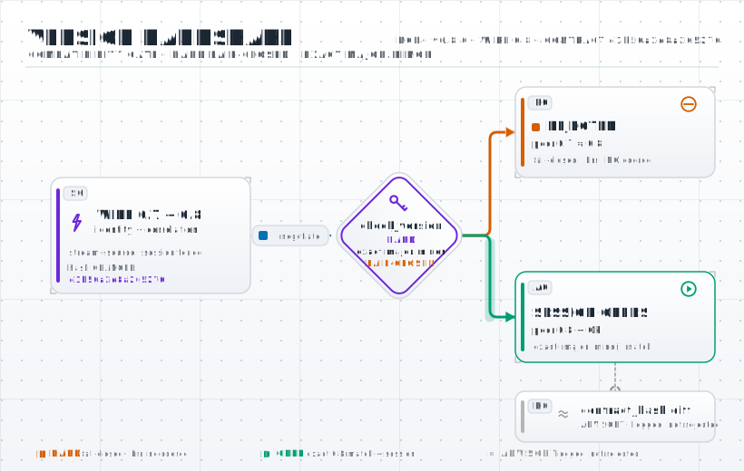

# NCP Versioning & Compatibility Policy

The wire contract carries a string `ncp_version` on every message. This document
is the **published versioning/breaking-change policy** — one of the artifacts a
protocol needs to become a standard (cf. MCP's date-based policy, OMG DDS's
interop program).

## Scheme: SemVer of the wire contract

NCP versions the SDK with [SemVer](https://semver.org) and carries a shorter
`MAJOR.MINOR` compatibility ID on the wire. They are related but not identical:

- **MAJOR** — a backwards-incompatible wire change (removed/renamed field,
  changed type, removed enum value, changed semantics).
- **MINOR (SDK)** — a backwards-compatible addition (new optional field, new
  enum value, new message). Existing peers keep interoperating, so the wire
  compatibility ID does not change.
- **PATCH** — clarifications/docs with no wire effect.

**Wire version vs crate/package version.** The latest immutable release is
`v0.7.1` and its `ncp_version` wire string is `0.7`. The Rust crates and the `@sepahead/ncp`
package carry their own SemVer (see `Cargo.toml` / `package.json` for the current
SDK version — the manifests are the single source of truth) for the SDK. They usually move
together, but a PATCH that touches only code/docs/build artifacts leaves the wire
string unchanged. Pin **`tag = "v0.7.1"`** for the latest release.

**Wire 0.7 is an incompatible acceptance-and-shape release.** It requires `kind` in
every schema, bounds JSON `int64` numbers to ±(2^53−1), preserves unknown enum
strings losslessly, requires explicit scientific-boundary assertions, versions
error replies, makes nested stimulus identity enforceable, and completes the
reserved bulk-observation metadata envelope. The contract hash is
`f05e328cad20959d`. Bare NCPB blocks are no longer accepted as complete Zenoh
observation messages because they carry no session, seq, timestamp, or provenance.

**Additive evolution is NON-breaking (since v0.4).** Adding an *optional* field or a
new message type does **not** bump the minor — protobuf/serde ignore unknown fields,
so a peer on an older minor keeps working. The minor bumps **only** for genuinely
incompatible changes (removing/renaming a field, changing a type, removing an enum
value, changing semantics). This corrects the earlier over-aggressive rule that forced
fleet re-pins (`v0.2.5/6/7/8`, and `0.2→0.3` for the merely-additive `contract_hash`
field). Two layers do the work: **`ncp_version`** is the hard *compatibility* gate
(`check_version`, exact `(major, minor)` pre-1.0), and **`CONTRACT_HASH`** is an
*advisory* identity signal (see §"Contract hash") that flags "same wire version, newer
contract revision" without breaking anyone.

**Pre-1.0 caveat:** while `0.x`, an *incompatible* minor bump is breaking and the
version guard fails closed on a minor difference (`check_version`). Pin an exact
released version (`tag = "v0.7.1"` today). `0.x` is explicitly unstable.

The current released wire is **`0.7`** (`ncp_version = "0.7"`). Earlier wires: `0.6` was
the **enforcement cut**: mandatory `ncp_version`, stamped closed-loop `seq`,
normative observation-plane seq stamping, and removal of the `seq == 0` escape
hatch — a semantic break with unchanged serialization. `0.5`
was the **stable-wire cut** (the three bare proto `string mode` fields were
promoted to enums — a real `string`→enum wire change that recomputed
`CONTRACT_HASH` to `24e8e6e31e1dec8a`); `0.4` was the **decoupling +
robustness** release (the proto `package` was renamed `engram.ncp.v0 → ncp.v0`
— naming-only, hash-neutral; the contract handshake became advisory; the
additive-is-non-breaking policy above was adopted); `0.3` added the
`contract_hash` handshake field; `0.2` the neuron-family wire (#10) and bulk
column codec (#6).

<picture>
  <source media="(prefers-color-scheme: dark)"  srcset="docs/diagrams/versioning-dark.svg">
  <source media="(prefers-color-scheme: light)" srcset="docs/diagrams/versioning-light.svg">
  
</picture>

## Enforcement: `buf breaking`

Breaking changes are caught mechanically, language-agnostically, by Buf's tiered
rules (configured in `buf.yaml`):

- **`WIRE` / `WIRE_JSON`** — binary and JSON wire compatibility (the contract).
- **`FILE` / `PACKAGE`** — source/codegen-level stability.

CI runs `buf lint`; `buf breaking` is anchored to the latest immutable tag,
`v0.7.0`. The release's JSON projection is frozen under
`conformance/baseline/v0.7.0/`.
A change that trips `WIRE`/`WIRE_JSON` **must** bump MAJOR (or MINOR while `0.x`).
(The 0.7 cut includes additive proto shape plus incompatible JSON/behavioral
acceptance rules; Buf covers the former while the frozen schema and behavior
corpora cover the latter.)

## Per-session version + contract handshake

At session setup the client sends its `ncp_version` **and** `contract_hash` in
`OpenSession`; the reference server (engram's `SessionService.handle`) and the Zenoh
client (`ncp-zenoh::ZenohNcpClient::open`) call `negotiate(peer_version, peer_hash)`.
The two checks are **separated by concern** (since v0.4):

1. **`ncp_version` is the hard *compatibility* gate.** An incompatible version
   (`check_version` — exact `(major, minor)` pre-1.0) is rejected, never coerced: the
   server replies with a versioned `ErrorFrame` and the session does not open.
   Components are unsigned ASCII-decimal `u64` values; signs, whitespace, overflow,
   and patch components are rejected identically by every SDK. "Can we speak the
   same wire at all?"
2. **`contract_hash` is an *advisory* identity signal.** `negotiate` returns a
   `ContractStatus` (`Match` / `NotAdvertised` / `Mismatch`); a `Mismatch` is **logged,
   not rejected**. "Are we on the exact same contract revision?" A mismatch within a
   compatible version is expected (e.g. one peer added an optional field — non-breaking
   per the additive policy) and must not break the flow. A `verify_contract` strict
   opt-in remains for deployments that *mandate* an exact revision (safety-certified
   configs).

Separating the two means additive evolution and naming-only proto changes never break
any version-compatible commander↔plant flow, while drift is still surfaced for
operators.
## Where the version gate runs — enforced end to end since wire 0.6

The gate runs at **both** layers since wire 0.6:

1. **Session establishment** — `check_version` inside `negotiate` at
   `OpenSession` (the reference server's `SessionService.handle`; the Zenoh
   client `ncp-zenoh::ZenohNcpClient::open`), plus per-reply validation in the
   typed RPC client.
2. **Per frame on the data plane** — `required_fields()` lists `ncp_version` for
   **every** `kind` (injected into every JSON Schema's `required` array with a
   `const` pin), `validate()` rejects an absent OR incompatible version, an
   absent version deserializes to a detectable `""` (never fabricated as the
   receiver's own), and the hot-path typed ingress
   (`ncp_core::decode_validated` / `WireFrame::validate_wire`, used by the Zenoh
   subscriber and publish gates) drops a version-less/incompatible/unstamped
   frame with a diagnostic. `diagnose_version` now also flags the absent-version
   case so a receiver can log *why* a frame was dropped.

The per-frame cost is one string comparison on an already-deserialized frame
(no extra parse — `validate_wire` works on the typed value), so the original
microseconds-budget argument no longer trades safety for speed. A transport that
delivers frames from a mismatched peer straight onto the data plane (bypassing
the `OpenSession` handshake) is now rejected at ingress rather than silently
accepted. Transport-level peer authentication (mTLS) remains the *adversarial*
integrity layer — the version gate is compatibility, not authentication (see
`SECURITY.md`).

## Contract hash (the wire-identity digest)

`ncp_version` says *which version* a peer speaks; `CONTRACT_HASH` says *which exact
contract* — it is the FNV-1a digest of the **wire-semantically canonicalized**
`proto/ncp.proto`. `canonical_proto` reduces the proto to its wire-relevant content:
it strips cosmetic comments (respecting string literals), preserves the structured
`// wire string "…"` annotations that define NCP's JSON enum mapping and the
`// wire key "…"` annotations that define lifecycle RPC addressing, preserves
`syntax` and imports, normalizes line-edge whitespace, and drops naming/codegen-only
`package` / top-level `option` declarations. So a purely *naming* change — e.g. the v0.4 rename
`package engram.ncp.v0 → ncp.v0` that decoupled the protocol's identity from a
consumer — leaves the wire identical and is **hash-neutral**; a real wire change
(add/remove/retype a field, change an enum value/JSON wire string, change a lifecycle
wire key, change proto
syntax) flips the hash. It is **not** a
cryptographic MAC: adversarial integrity is the transport's job (mTLS); the hash
*detects* accidental drift, and per the handshake above a mismatch is advisory.

**Why it is a hardcoded constant** (`ncp_core::CONTRACT_HASH`, exposed by Python/C
and mirrored by TypeScript) rather than computed at runtime:

- **The proto is not on disk at runtime.** `contract_hash_of_proto` reads the
  `.proto` via `CARGO_MANIFEST_DIR`, which only exists in the source tree at
  build/test time. A shipped binary / wheel / C ABI has no proto to hash, so the
  advertised value must be embedded.
- **It is a contract *identity*, not a derived quantity.** A pinned constant makes
  "which wire do I claim to speak" explicit, greppable, and reviewable, and makes a
  bump a deliberate, visible diff.
- **It is the shared cross-language anchor.** Rust recomputes it from the normative
  proto; Python and C expose the Rust-core constant, TypeScript mirrors it, and the
  shared corpus pins every peer. A skew fails CI instead of silently creating two
  contract identities.
- **Drift cannot ship.** `contract_hash_matches_proto` asserts the Rust constant
  equals the computed value, while the peer/corpus checks assert every binding
  advertises that same constant.

The considered-and-rejected alternative is to drop the constant and compute it once
at startup from a compile-time-embedded proto
(`LazyLock::new(|| contract_hash_of_proto(include_str!(".../ncp.proto").as_bytes()))`).
That removes the forgot-to-bump error class but loses `const`-usability, the
greppable value, and the deliberate-bump property — and still needs a per-language
anchor for cross-language parity. The constant-plus-CI-guard form is intentional.

## Deprecation

A field/enum value being retired is first marked deprecated in `proto/ncp.proto`
(a comment + `[deprecated = true]`) for one MINOR cycle before removal in the next
MAJOR, so consumers get a compile-time / lint warning before the break.
