# NCP logo archive

This archive preserves earlier designs and captured design drafts.
The main repository README selects the active logo.
Archived artwork can contain superseded symbols or wording.
It does not establish current behavior, compatibility, authority, or release status.

[Manifest and exact source identities](manifest.json)

Each file retains its source bytes or an explicitly identified extraction from a historical portfolio SVG.
Extracted marks retain their source geometry, applicable styles, and referenced definitions.
No historical JavaScript was executed.
Dates identify the earliest captured source commit for those bytes, not necessarily the original design date.
Files use exact SHA-256 deduplication within this archive.

The archive excludes third-party marks, repeated platform icon sizes, and complete connection diagrams.
The manifest records any extraction gaps.

Select a preview to open the asset. Native SVG files retain scalable geometry.
Historical motion and accessibility behavior remain as originally stored.
The archive does not certify those older behaviors.

## NCP

| Preview | Design | Source |
| --- | --- | --- |
|  | [2026-07-04-001-profile-dark-f72cabe648](ncp/2026-07-04-001-profile-dark-f72cabe648.svg) | [e43d9f07dc](https://github.com/sepahead/sepahead/blob/e43d9f07dc6ef3246230a8b61cf6b5ddf5058a07/assets/work-graph-dark.svg) |
|  | [2026-07-04-002-profile-light-029cbb4241](ncp/2026-07-04-002-profile-light-029cbb4241.svg) | [e43d9f07dc](https://github.com/sepahead/sepahead/blob/e43d9f07dc6ef3246230a8b61cf6b5ddf5058a07/assets/work-graph-light.svg) |
|  | [2026-07-10-003-profile-dark-a009fcbcf5](ncp/2026-07-10-003-profile-dark-a009fcbcf5.svg) | [f0375ae458](https://github.com/sepahead/sepahead/blob/f0375ae4588442e39e9fb28c28387170a831cadd/assets/work-graph-dark.svg) |
|  | [2026-07-10-004-profile-light-146277a7ef](ncp/2026-07-10-004-profile-light-146277a7ef.svg) | [f0375ae458](https://github.com/sepahead/sepahead/blob/f0375ae4588442e39e9fb28c28387170a831cadd/assets/work-graph-light.svg) |
|  | [2026-07-10-005-profile-dark-cc4149151c](ncp/2026-07-10-005-profile-dark-cc4149151c.svg) | [32a11d43bb](https://github.com/sepahead/sepahead/blob/32a11d43bb57f500d940ee3c8daf2bcfd63b4f5e/assets/work-graph-dark.svg) |
|  | [2026-07-10-006-profile-light-575baf848d](ncp/2026-07-10-006-profile-light-575baf848d.svg) | [32a11d43bb](https://github.com/sepahead/sepahead/blob/32a11d43bb57f500d940ee3c8daf2bcfd63b4f5e/assets/work-graph-light.svg) |
|  | [2026-07-10-007-profile-dark-88c8b5ecfb](ncp/2026-07-10-007-profile-dark-88c8b5ecfb.svg) | [79fbe3d1a3](https://github.com/sepahead/sepahead/blob/79fbe3d1a32c6dc61db1d018a3807a878c28cfea/assets/work-graph-dark.svg) |
|  | [2026-07-10-008-profile-light-d52d0a411e](ncp/2026-07-10-008-profile-light-d52d0a411e.svg) | [79fbe3d1a3](https://github.com/sepahead/sepahead/blob/79fbe3d1a32c6dc61db1d018a3807a878c28cfea/assets/work-graph-light.svg) |
|  | [2026-07-12-009-logo-dark-eec607135e](ncp/2026-07-12-009-logo-dark-eec607135e.svg) | [372a1197a1](https://github.com/sepahead/NCP/blob/372a1197a109ee4229dad306df7d36bc59786621/assets/logo-dark.svg) |
|  | [2026-07-12-010-logo-light-b4f7eb4c3c](ncp/2026-07-12-010-logo-light-b4f7eb4c3c.svg) | [372a1197a1](https://github.com/sepahead/NCP/blob/372a1197a109ee4229dad306df7d36bc59786621/assets/logo-light.svg) |
|  | [2026-07-12-011-profile-dark-bc656fe5ee](ncp/2026-07-12-011-profile-dark-bc656fe5ee.svg) | [6ba67be275](https://github.com/sepahead/sepahead/blob/6ba67be275f563bb53a5827ba9eabf49ff75d123/assets/work-graph-dark.svg) |
|  | [2026-07-12-012-profile-light-af6f85e49a](ncp/2026-07-12-012-profile-light-af6f85e49a.svg) | [6ba67be275](https://github.com/sepahead/sepahead/blob/6ba67be275f563bb53a5827ba9eabf49ff75d123/assets/work-graph-light.svg) |
|  | [2026-07-13-013-profile-dark-4174f739ea](ncp/2026-07-13-013-profile-dark-4174f739ea.svg) | [f43e6cc8ce](https://github.com/sepahead/sepahead/blob/f43e6cc8cefdc5d136967b86cda983474b68f57f/assets/work-graph-dark.svg) |
|  | [2026-07-13-014-profile-light-a3179b6e06](ncp/2026-07-13-014-profile-light-a3179b6e06.svg) | [f43e6cc8ce](https://github.com/sepahead/sepahead/blob/f43e6cc8cefdc5d136967b86cda983474b68f57f/assets/work-graph-light.svg) |
|  | [2026-07-13-015-profile-dark-bacb76c76d](ncp/2026-07-13-015-profile-dark-bacb76c76d.svg) | [219741fdc5](https://github.com/sepahead/sepahead/blob/219741fdc576ad5ba86a21016a323254d8973489/assets/work-graph-dark.svg) |
|  | [2026-07-13-016-profile-light-c9376982fe](ncp/2026-07-13-016-profile-light-c9376982fe.svg) | [219741fdc5](https://github.com/sepahead/sepahead/blob/219741fdc576ad5ba86a21016a323254d8973489/assets/work-graph-light.svg) |
|  | [2026-07-14-017-logo-dark-fac01e94b0](ncp/2026-07-14-017-logo-dark-fac01e94b0.svg) | [36dacdc260](https://github.com/sepahead/NCP/blob/36dacdc260d3df2d9fa1741e5b1428a239604711/assets/logo-dark.svg) |
|  | [2026-07-14-018-logo-light-0f0e35073c](ncp/2026-07-14-018-logo-light-0f0e35073c.svg) | [36dacdc260](https://github.com/sepahead/NCP/blob/36dacdc260d3df2d9fa1741e5b1428a239604711/assets/logo-light.svg) |
|  | [2026-07-14-019-logo-dark-d80da617da](ncp/2026-07-14-019-logo-dark-d80da617da.svg) | [a2e8c4369a](https://github.com/sepahead/NCP/blob/a2e8c4369a19df86a16e2905502c7c3cc2c1d43d/assets/logo-dark.svg) |
|  | [2026-07-14-020-logo-light-456fe0b031](ncp/2026-07-14-020-logo-light-456fe0b031.svg) | [a2e8c4369a](https://github.com/sepahead/NCP/blob/a2e8c4369a19df86a16e2905502c7c3cc2c1d43d/assets/logo-light.svg) |
|  | [2026-08-06-021-logo-dark-ff20b0ce3f](ncp/2026-08-06-021-logo-dark-ff20b0ce3f.svg) | [054eef7ee6](https://github.com/sepahead/NCP/blob/054eef7ee6ea2549f28e75e3e4f1c03389646d7c/assets/logo-dark.svg) |
|  | [2026-08-06-022-logo-light-01c58a0045](ncp/2026-08-06-022-logo-light-01c58a0045.svg) | [054eef7ee6](https://github.com/sepahead/NCP/blob/054eef7ee6ea2549f28e75e3e4f1c03389646d7c/assets/logo-light.svg) |
|  | [2026-08-20-023-profile-dark-35f38c39f0](ncp/2026-08-20-023-profile-dark-35f38c39f0.svg) | [6f89d6c19d](https://github.com/sepahead/sepahead/blob/6f89d6c19d8b87556f66c91e73486163400ec8d2/assets/work-graph-dark.svg) |
|  | [2026-08-20-024-profile-dark-0d23687278](ncp/2026-08-20-024-profile-dark-0d23687278.svg) | [ba26a24aac](https://github.com/sepahead/sepahead/blob/ba26a24aacc53ea1d745716ee3b8091b686497c3/assets/work-graph-dark.svg) |
|  | [2026-08-20-025-logo-dark-5968ee615d](ncp/2026-08-20-025-logo-dark-5968ee615d.svg) | [b9d326a9bb](https://github.com/sepahead/NCP/blob/b9d326a9bb493182dae37afa5a38883fb252a27c/assets/logo-dark.svg) |
|  | [2026-08-20-026-logo-light-b252938b88](ncp/2026-08-20-026-logo-light-b252938b88.svg) | [b9d326a9bb](https://github.com/sepahead/NCP/blob/b9d326a9bb493182dae37afa5a38883fb252a27c/assets/logo-light.svg) |
|  | [2026-08-20-027-logo-dark-45a737d3aa](ncp/2026-08-20-027-logo-dark-45a737d3aa.svg) | [c74315ecac](https://github.com/sepahead/NCP/blob/c74315ecac295f1e3c63096a89350650de3cd7ba/assets/logo-dark.svg) |
|  | [2026-08-20-028-logo-light-ad685bc5f2](ncp/2026-08-20-028-logo-light-ad685bc5f2.svg) | [c74315ecac](https://github.com/sepahead/NCP/blob/c74315ecac295f1e3c63096a89350650de3cd7ba/assets/logo-light.svg) |
|  | [2026-08-20-029-profile-dark-b27f3329ae](ncp/2026-08-20-029-profile-dark-b27f3329ae.svg) | [4d5ac22dac](https://github.com/sepahead/sepahead/blob/4d5ac22dac823140d6257a821fd316f3e20356d4/assets/work-graph-dark.svg) |
|  | [2026-08-20-030-profile-dark-268efd1c9a](ncp/2026-08-20-030-profile-dark-268efd1c9a.svg) | [42bc7b290a](https://github.com/sepahead/sepahead/blob/42bc7b290a33cbf317398cefcd99ef6609228312/assets/work-graph-dark.svg) |
|  | [2026-08-20-031-logo-dark-1b7ef40806](ncp/2026-08-20-031-logo-dark-1b7ef40806.svg) | [7b9aa85bc7](https://github.com/sepahead/NCP/blob/7b9aa85bc78a1eeb2f28f4669268c980cb200df5/assets/logo-dark.svg) |
|  | [2026-08-20-032-logo-light-3ceaf98015](ncp/2026-08-20-032-logo-light-3ceaf98015.svg) | [7b9aa85bc7](https://github.com/sepahead/NCP/blob/7b9aa85bc78a1eeb2f28f4669268c980cb200df5/assets/logo-light.svg) |
|  | [2026-08-28-033-logo-dark-585ca277f1](ncp/2026-08-28-033-logo-dark-585ca277f1.svg) | [b87a84e8de](https://github.com/sepahead/NCP/blob/b87a84e8dec3953012a6633fe9de236182216af3/assets/logo-dark.svg) |
|  | [2026-08-28-034-logo-light-bdf9b3a9b0](ncp/2026-08-28-034-logo-light-bdf9b3a9b0.svg) | [b87a84e8de](https://github.com/sepahead/NCP/blob/b87a84e8dec3953012a6633fe9de236182216af3/assets/logo-light.svg) |
|  | [2026-09-05-035-profile-dark-b313c28e8d](ncp/2026-09-05-035-profile-dark-b313c28e8d.svg) | [ed898bd827](https://github.com/sepahead/sepahead/blob/ed898bd827fd393b1a6262b48517a92c3b12d4b4/assets/work-graph-dark.svg) |
|  | [2026-09-05-036-profile-dark-5a068d3338](ncp/2026-09-05-036-profile-dark-5a068d3338.svg) | [8740c531cb](https://github.com/sepahead/sepahead/blob/8740c531cbb5cc9b74a74fe8e4d4018940700483/assets/work-graph-dark.svg) |
|  | [2026-09-07-037-logo-dark-6d175501f8](ncp/2026-09-07-037-logo-dark-6d175501f8.svg) | [05859ae382](https://github.com/sepahead/NCP/blob/05859ae382ff09f895ca516b8451868766769ec3/assets/logo-dark.svg) |
|  | [2026-09-07-038-profile-dark-8dae5f8ba9](ncp/2026-09-07-038-profile-dark-8dae5f8ba9.svg) | [a9038ea0ee](https://github.com/sepahead/sepahead/blob/a9038ea0ee5a0735837e9958f1301507cb7c0864/assets/work-graph-dark.svg) |
|  | [2026-09-07-039-logo-dark-09e8843fb7](ncp/2026-09-07-039-logo-dark-09e8843fb7.svg) | [5b14012482](https://github.com/sepahead/NCP/blob/5b1401248239a286b4b3feb0f314986189bbc03c/assets/logo-dark.svg) |
|  | [2026-09-07-040-profile-dark-8951acf890](ncp/2026-09-07-040-profile-dark-8951acf890.svg) | [4bcb7457ab](https://github.com/sepahead/sepahead/blob/4bcb7457ab2f55d856a9f52665ff18c0f186e063/assets/work-graph-dark.svg) |
|  | [2026-09-07-041-logo-dark-6fa03f6532](ncp/2026-09-07-041-logo-dark-6fa03f6532.svg) | [ad70fcc544](https://github.com/sepahead/NCP/blob/ad70fcc544418a3dcb8d29ca8cf1d2031f2fe9f9/assets/logo-dark.svg) |
|  | [2026-09-07-042-logo-dark-7138b51591](ncp/2026-09-07-042-logo-dark-7138b51591.svg) | [86695e047f](https://github.com/sepahead/NCP/blob/86695e047f2895d51c9e0409dd0800c1448aac1a/assets/logo-dark.svg) |
|  | [2026-09-07-043-profile-dark-f93ac1c321](ncp/2026-09-07-043-profile-dark-f93ac1c321.svg) | [39a2a621dc](https://github.com/sepahead/sepahead/blob/39a2a621dc002775b98dcca94ffa40ecd93f0663/assets/work-graph-dark.svg) |
|  | [2026-09-07-044-profile-dark-4c07906e6d](ncp/2026-09-07-044-profile-dark-4c07906e6d.svg) | [21bf33bf1f](https://github.com/sepahead/sepahead/blob/21bf33bf1fde663e007433dd129e3093243de682/assets/work-graph-dark.svg) |
