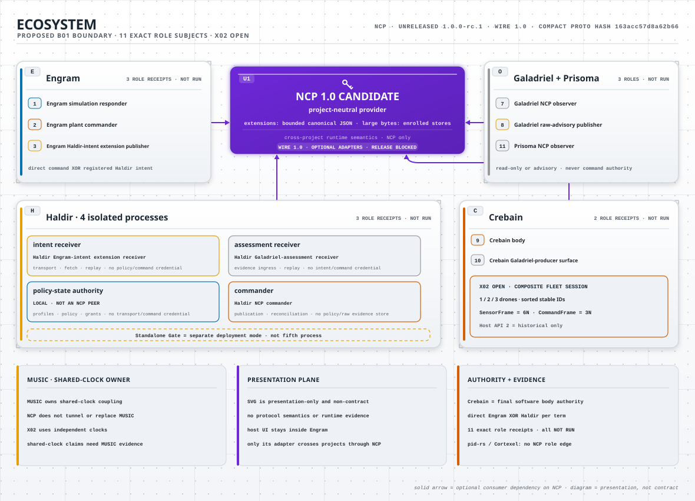

# NCP 1.0 ecosystem finalization blueprint

> **Document status:** living, non-normative implementation handoff. This file is
> evidence bookkeeping and a work plan. It is not the NCP specification, a release
> authorization, a qualification, a tag, or proof that an external gate ran.
>
> **Candidate status at the reviewed boundary:** `NO_GO`. NCP package
> `1.0.0-rc.1`, wire `1.0`, and compact proto hash `163acc57d8a62b66` remain
> unreleased. The latest immutable release is `v0.8.0`, which is a different wire.
>
> **Editing rule:** update a task from `OPEN` only in the same coherent commit that
> adds or binds its evidence. Record the exact commit, commands, results, artifact
> digests, reviewer, and residual `NOT_RUN` obligations. Commit and push each
> coherent, passing part with a professional message. Never use a status edit as a
> substitute for implementation or independent review.
>
> **Current reconciliation note (2026-08-13):** the producer branch/worktree rows
> below are preserved intake history. Canonical Crebain `origin/main` is now
> `6b82095c4443c2c2d49b5c2a8b2bd71c446e73ff` and contains the producer lineage.
> No current local or remote branch ref contains the intake commit
> `113ee70d5660daf90bb373bd7857d4b3f2f56784`. GitHub's retained
> `refs/pull/31/head` pull-request ref still exposes it as merged PR history. C04
> is still OPEN behind C03 and now verifies that consolidated lineage; it does
> not authorize branch deletion or establish a producer role receipt.

## 1. Objective and non-negotiable interpretation

The objective is to make the first stable NCP 1.0 contract internally coherent,
secure by construction, implementable in independent languages, usable by the
named ecosystem, and evolvable without silently changing its stable core. The
reviewed intake inventory is:

- canonical NCP in `sepahead/NCP`;
- the active Engram implementation in private `sepahead/Paper2Brain`, including
  its Python-native NCP runtime and source mirror;
- `sepahead/haldir`;
- `sepahead/galadriel`;
- `sepahead/crebain` (the old `sepehrmn/crebain` URL redirects here);
- the Galadriel-producer surface in canonical `sepahead/crebain`;
- `sepahead/prisoma`;
- `sepahead/pid-rs`;
- `sepahead/cortexel`, as an inspected and explicitly excluded non-peer; and
- the public `sepahead` profile/selected-work presentation.

Cortexel has no role in the NCP topology. NCP defines no Cortexel package
dependency, peer status, observer grant, control-path role, consumer role,
commander role, source-of-truth status, or atlas ownership. This plan authorizes
no NCP implementation or documentation-import work in Cortexel. Cortexel
receives no NCP role receipt.

The content-bound superseded ADR-011 review subject asked reviewers to adjudicate
an optional labeled-export boundary. That unsupported proposal remains unratified
and grants no task or work authority. The current B01 source removes the proposal.
A later B01 subject must bind this correction. This plan retains the superseded
review history.

The 2026-08-01 local discovery also found directories that are not canonical
inventory entries. `engram-origin-corpus-review.MymUYE` is a non-Git review
extraction whose copied descriptor can appear in a filesystem scan. `NCP copy` is
an old provider checkout. `Paper2Brain copy`, `pid_vla copy`, and `crebain copy`
are legacy wire-0.2/0.2.5 consumer-lineage checkouts, while `Paper2Brain` is a
placeholder-only directory. `pid-rs` copies remain protocol-neutral libraries.
None is a canonical current consumer, installed peer, or role subject. The PhD
thesis harness is instead an intentionally pinned auxiliary wire-0.8 importer,
but it is still not a peer and receives no role receipt.

“Final” cannot honestly mean that no future defect, cryptographic transition,
hardware class, or scientific need will ever exist. The implementable meaning is:

1. freeze a small stable 1.0 core only after its safety and interoperability
   obligations are met;
2. define content-addressed, default-deny extension points so new optional behavior
   does not mutate that core;
3. require a new major wire rather than reinterpreting a stable field;
4. retain explicit revocation, deprecation, and emergency-response mechanisms; and
5. make every claim traceable to exact source, installed artifacts, configuration,
   test evidence, and independent review.

Passing local tests, copying protocol files, changing manifests, completing this
blueprint, or freezing a candidate baseline does not release or qualify NCP 1.0.

## 2. Source and evidence boundary

### 2.1 Canonical NCP cut

The initial audit is bound to the following exact clean NCP source:

| Axis | Value |
|---|---|
| repository | `git@github.com:sepahead/NCP.git` |
| branch | `main` |
| commit | `8ce57bbd28b0f252dab1275f50a72861a60cbeec` |
| package candidate | `1.0.0-rc.1` |
| stable wire | `1.0` |
| compact proto hash | `163acc57d8a62b66` |
| complete normative SHA-256 | `9cae331742d01e9b164e029aa06c644e6b1886176d0816a6ef883af138355c90` |
| mandatory corpus SHA-256 | `83bdcfae2e07f1c69efa87279f0b3c27392be83f31b292647cddd10eb35226b3` |
| checked-in build identity | `unreleased-worktree` |
| release decision | `NO_GO`; `release_allowed=false` |

The hosted candidate evidence documented in
[`../1.0-candidate-receipts.md`](../1.0-candidate-receipts.md) is bound to earlier
implementation cut `ef357d20692f707e185495dcfd16b16556fec264`, not automatically
to every later commit. Re-run and rebind evidence after any normative change.

### 2.2 Supplied Engram review archive

The owner-supplied `engram-review-20260715-1504.zip` archive was inspected through a
safe, non-repository extraction. Its review identity is:

| Axis | Value |
|---|---|
| archive SHA-256 | `ed80122a960eaa72f452929f520ba237d73a12249e6123224766762154225dd9` |
| entries | 1,920 |
| uncompressed bytes | 27,815,546 |
| traversal/absolute-path violations | 0 |
| recorded source commit | `92853d2fe6e8ced7e98e2f272a34bfc0067dce57` |
| recorded branch | `main` |
| recorded state | `DIRTY` |
| bundle creation | 2026-07-15 15:04:03 UTC |
| Engram NCP mirror commit | `d0c130424414e5483f0834228a548fd1e6e4adba` |
| mirrored package/wire | `1.0.0-rc.1` / `1.0` |
| mirrored complete digest | `10b81f8dfec289dc553c320430ab3fefea0f0bb2002b6e85415383119445555b` |

The inspected `backend/neurocontrol` and `ncp` source content matched the active
Engram worktree at the review point, excluding ignored build/cache output. That is
useful development evidence only. It is not an installed artifact, clean source
cut, live peer result, or consumer role qualification. The mirror predates the
canonical NCP cut above and must eventually be repinned through Engram's mirror
tooling after the final NCP source is committed and pushed.

### 2.3 Mutable ecosystem snapshot

The following was refreshed at 2026-07-16 07:24:27 UTC after the user stopped the
other agents. Their worktrees remain inherited state, not abandoned files; every
migration task must refresh this table before editing and preserve unrelated work.

| Project | Local branch | Initial commit | Initial tracked/untracked changes | NCP state |
|---|---|---|---:|---|
| NCP | `main` | `6e82783667554b8d8b433261e6b8ae588e94d89f` | 10 B00 paths | unreleased wire-1.0 candidate; implementation ledger in progress |
| Engram / Paper2Brain | `main` | `92853d2fe6e8ced7e98e2f272a34bfc0067dce57` | 168 | active dirty native-1.0 work; stale NCP mirror |
| Haldir | `wip/current-file-review-ledger` | `bb6c0a7b27bbc57fe9935f80e22d06ca3b60e8ba` | 0 | exact immutable `v0.8.0` adapter |
| Galadriel | `main` | `f541f3eda7cfdc81a3277c3d6fecc91245179f24` | 0 | exact `v0.8.0`; optional sidecar/tap |
| Crebain | `main` | `3e3ee5d0b75269b8f5f634485871069c89a9a474` | 0 | exact `v0.8.0`; dormant bridge |
| Crebain producer clone | `feat/galadriel-integration-refresh` | `113ee70d5660daf90bb373bd7857d4b3f2f56784` | 0 | exact `v0.8.0`; duplicated producer work |
| Prisoma | `main` | `b0185d98aea8bb6512926d9a8365ba8140fd07c0` | 0 | exact `v0.8.0`; workspace-excluded observer |
| pid-rs | `main` | `1410c8808f1b4e51c76fef395360976e715d2df6` | 0 | GitHub-only `0.9.0` source-review prerelease; protocol-neutral estimator/run-log library; no NCP dependency |
| sepahead profile | `main` | `80a5c1d5af3a7b85d2a683921dd31e2bdf0406ce` | 2 | generated selected-work presentation; preserve dirty state |

The current NCP consumer-pin scan correctly fails because Engram is on the 1.0
candidate while all other declared consumers are on the incompatible 0.8 line.
That mismatch is migration evidence, not a guard to weaken.

### 2.4 B01 read-only ecosystem refresh

The B01 review refreshed the requested worktrees at 2026-07-26 13:19:19 UTC.
These are mutable source-worktree observations. They are not installed artifacts,
independent peers, live qualifications, or release evidence.

| Project | Branch | Observed HEAD | Tracked/untracked changes | Relevant state |
|---|---|---|---:|---|
| NCP | `main` | `baa79402ab94bf31c60299f15029ab46b1d6a5d5` | 33 / 2 | B01 task edits in progress; unreleased release-blocked candidate |
| Engram | `main` | `864b06ca0df4c0a95dd49e234b2f7a8bb3733981` | 41 / 17 | dirty native-1.0 migration; mirror ref equals the observed NCP HEAD |
| Haldir | `wip/current-file-review-ledger` | `bb6c0a7b27bbc57fe9935f80e22d06ca3b60e8ba` | 1 / 11 | inherited dirty work; immutable wire-0.8 adapter |
| Galadriel | `main` | `542f579280f4ae5236653b3b09b15530ed5840fe` | 0 / 0 | clean local worktree, four commits ahead of its remote; wire-0.8 integration |
| Prisoma | `main` | `7d070b2d95022314ba6add3d73fdec5f186b0269` | 22 / 1 | inherited dirty work; wire-0.8 observer and native-1.0 design target |

Engram's `.mirror-ref` equals
`baa79402ab94bf31c60299f15029ab46b1d6a5d5`, and its mirrored
`contract/manifest.v1.json` bytes equal the NCP file at that review point. This
proves source-copy equality only. The worktree is not an installed peer and gives
no consumer receipt.

The same read-only intake was refreshed again at 2026-07-27 06:46:38 UTC after
the sibling owners had advanced or cleaned their local branches. This later table
does not rewrite the historical observation above.

| Project | Branch | Observed HEAD | Tracked/untracked changes | Ahead/behind upstream | Relevant state |
|---|---|---|---:|---:|---|
| NCP | `main` | `baa79402ab94bf31c60299f15029ab46b1d6a5d5` | 37 / 2 | 0 / 0 | current B01 source/evidence edits remain uncommitted; release-blocked candidate |
| Engram | `main` | `8163e1aa458bdda25dcb12beadc4ab35ee8416f7` | 0 / 0 | 0 / 0 | clean native-1.0 migration source; mirror still binds the NCP base below |
| Haldir | `wip/current-file-review-ledger` | `bb6c0a7b27bbc57fe9935f80e22d06ca3b60e8ba` | 1 / 11 | 0 / 0 | inherited dirty work; do not use it as qualification evidence |
| Galadriel | `main` | `542f579280f4ae5236653b3b09b15530ed5840fe` | 0 / 0 | 0 / 0 | clean source; wire-0.8 integration plus native design target |
| Prisoma | `main` | `698aaab7a44337bf925342ebe6acc97841b659d0` | 0 / 0 | 0 / 0 | clean source; wire-0.8 observer plus native design target |

At this later refresh, Engram's `.mirror-ref` still equals
`baa79402ab94bf31c60299f15029ab46b1d6a5d5`. Its mirrored
`contract/manifest.v1.json` SHA-256 is
`7a71920e5f5bd62b2d7f2abfdb94c330e9a79160205300860d46e27d46c0317e`,
equal only to the NCP base bytes at that source observation. These clean/dirty
and ahead/behind facts are source intake, not installed artifacts, role
qualifications, independent review, or release evidence.

The read-only `scripts/check-consumer-pins.sh` check still exits with
`MISMATCH` because the discovered fleet contains wire-0.8 and wire-1.x pins. That
is the expected current migration signal. It also shows why N07 cannot retain a
fleet-wide “one compatible line” acceptance rule: N07 must verify exact,
target-active dependency closure and pin coherence per surface while rejecting a
mixed wire inside one surface or privilege boundary.

The exact consumer descriptors at this snapshot are legacy inputs, not the
versioned surface inventory proposed by ADR-011. Galadriel and Haldir use
`cargo_rev`/`cargo_lock_rev` rows. Prisoma uses `cargo_tag`/`cargo_lock`. Engram
uses `mirror_rev`/`python_wire`. None records the complete target kind,
default/effective features, resolution context, evaluated predicate, typed
contract identity, deployment domain or authenticated scanner receipt. The
observed locators do match the prospective model shapes:
Galadriel `crates/galadriel-ncp` plus the root lock, Prisoma
`crates/ncp-observer` plus its nested lock, and Engram `.ncp-consumer`,
`ncp/.mirror-ref` and `backend/neurocontrol/protocol.py`. Galadriel has no
`crates/galadriel-ncp10`, and Haldir has `crates/haldir-ncp08` but no
`crates/haldir-ncp10`. Native-1.0 paths in the B01 probe are synthetic future
fixtures. This observation does not prove a scan, migration or installed
integration.

### 2.5 B01 five-lens consumer audit at the 2026-07-30 11:00:43 UTC source snapshot

A read-only audit refreshed the four requested sibling repositories at
2026-07-30 11:00:43 UTC. The audit used contract, runtime, security and safety,
operability, and evidence/repository-state lenses. The rows record mutable
source trees at that instant. They are not installed-artifact, live-peer,
qualification, independent-review, or release evidence.

| Project | Local branch and HEAD | `origin/main` | Behind / ahead | Tracked / untracked changes | NCP state |
|---|---|---|---:|---:|---|
| Engram | `main` at `ad2e905c9c6bbfb80b90dc55551bc1ae04993188` | same commit | 0 / 0 | 3 / 2 inherited active release/corpus-harness changes | native-1.0 development mirror at NCP `baa79402ab94bf31c60299f15029ab46b1d6a5d5`; not an installed or qualified peer |
| Haldir | `wip/current-file-review-ledger` at `bb6c0a7b27bbc57fe9935f80e22d06ca3b60e8ba` | `ea0dc9690fb9e4ceeced24a754b3bf081aa0de5b` | 55 / 4 | 1 / 11 inherited release-work files | exact wire-0.8 experimental adapter; branch divergence forbids a blind push or merge |
| Galadriel | `main` at `8fd0a063107c4183f594016052994fd44efa0046` | `542f579280f4ae5236653b3b09b15530ed5840fe` | 0 / 3 | 0 / 0 | exact wire-0.8 read-only sidecar; all three local commits exist on `origin/review/qualification-failure-classification-20260729`, not `origin/main` |
| Prisoma | `main` at `e27ccb28bd8bd197896cbb91c8cc591882d0de9c` | same commit | 0 / 0 | 0 / 0 | exact wire-0.8 passive observer; workspace-excluded and below its declared scientific evidence gates |

The contract lens found no four-project runtime interoperability. Engram uses
the native-1.0 candidate while Galadriel, Haldir, and Prisoma use immutable wire
0.8. Source mirroring does not close that gap.

The security lens found two fail-closed blockers:

- Engram `backend/neurocontrol/bus.py:129-185` makes
  `production-secure` unavailable but lets the insecure constructor consume an
  arbitrary explicit or `NCP_ZENOH_CONFIG` configuration. Its fallback disables
  multicast discovery only. It does not prove IP loopback or an absolute
  Unix-domain socket. `backend/neurocontrol/bus.py:232-250` then accepts any
  `Bus` and registers the wildcard RPC queryable without a transport-profile or
  locality gate. This does not satisfy the `dev-loopback-insecure` boundary.
- Haldir `crates/haldir-transport-zenoh/src/live.rs:179-185,254-267`
  states that Zenoh `zid` is not an authenticated application principal and
  exposes caller-constructible ingress fields. Haldir
  `crates/haldir-gate/src/live_service.rs:186-194,296-305,658-665`
  accepts trusted state, challenge, lease, and `actual_key` from the embedding
  caller without an authenticated acquisition path or continuing
  lease/state/revocation feed. This is not a native-1.0 authority ingress.

The safety and topology lens found that Engram still exports simulation and
plant-control surfaces from one artifact. The co-location is visible in
`backend/neurocontrol/ARCHITECTURE.md:23-38` and
`backend/neurocontrol/__init__.py:24-46,79-81,116-125`. It does not provide the
required disjoint responder and commander principals, routes, stores, and build
artifacts.

The operability lens found a concrete NEST reachability defect. Every
`NestBackend.open` calls `Cleanup` and `ResetKernel` at
`backend/neurocontrol/backends.py:400-416`. The generic session service permits
16 active sessions by default and retains distinct session IDs at
`backend/neurocontrol/service.py:91-92,165-180,206-228,368-404`. Opening a
second real NEST session can therefore invalidate the first while the service
still reports both as active. Engram must either enforce one global NEST owner
or implement one shared generation-aware kernel host before it can claim
multi-session support.

The operability and evidence lenses also found that the Galadriel review sequence
through `8fd0a063107c4183f594016052994fd44efa0046` must not advance to protected
`origin/main` as NCP 1.0 evidence. Commit
`402aa35f4f5814388101d9dd346d061dc1193b87` correctly preserves an earlier
output-limit failure when cleanup crosses the command deadline. The current code
at `repo_work/qualify_candidate.py:1523-1530` still sets `cleanup_started` for a
clean child exit before it checks the command deadline. A selector wake after the
deadline can therefore return `returncode=0`, `timed_out=false`, and no other
failure even when the child was first observed after its limit. Selector timeouts
are lower bounds, so host load can reach this state. The two later commits update
release inputs and inventory bindings; they do not change this ordering or add
the missing regressions. Galadriel needs distinct cleanup-cause state and two
committed regressions: prior non-timeout failure cleanup must retain its cause
after the deadline, and a clean completion first observed after the deadline must
remain a timeout failure. Its generated audit manifest and signed commit must then
be recreated. Galadriel policy and branch protection reserve that promotion for
its release operator; this NCP audit does not authorize a push.

The evidence lens keeps every live production-principal, consumer-role,
physical-safety, independent-peer, fault, soak, performance, and release gate
at **NOT RUN**. R01 is not dependency-ready, so this audit authorizes no
consumer edit. The smallest coherent implementation order remains R01, then
E01/H01/G01/P01, followed by each downstream role and its exact evidence floor.

### 2.6 Primary-maintainer ecosystem refresh

The primary maintainer refreshed the local ecosystem worktrees at
2026-08-15 09:54:10 UTC. This was a read-only source inspection. It is not an
installed-peer, qualification, interoperability, or release result.

| Project | Branch | Observed HEAD | Tracked/untracked changes | Ahead/behind upstream | Relevant state |
|---|---|---|---:|---:|---|
| NCP | `main` | `1a04294c90c1b50eba06ae1c6afe9c951319250d` | 71 / 0 | 0 / 0 | B01 source and evidence edits remain uncommitted, release-blocked candidate |
| Engram | `main` | `4bbc98dd1a8ffa31a63a6e8b6037b4dc88a9b1b1` | 3 / 2 | 0 / 0 | inherited active ingestion and provider-pilot work. Preserve it before any cleanup. Installed qualification remains separate |
| Haldir | `main` | `60da945d087d6ed65a5c43e950adde1292c3bd10` | 0 / 0 | 0 / 0 | clean source, immutable wire-0.8 adapter remains active |
| Galadriel | `main` | `7d0483f44af22eaa8272a7e753bb15021b0ed817` | 0 / 0 | 1 / 0 | clean source with one unpushed local commit. Preserve and review it before any cleanup or promotion |
| Crebain | `main` | `6b82095c4443c2c2d49b5c2a8b2bd71c446e73ff` | 0 / 0 | 0 / 0 | clean source, wire-0.8 body integration remains active |
| Prisoma | `main` | `efcad9943af818913702f11c47ed0c280a2a1f13` | 24 / 5 | 0 / 0 | inherited dirty observer and scientific work. Preserve it before any cleanup |
| pid-rs | `review/sx-count-event-bridge-r2` | `9bbcf5ef04d26b0fd5ec552fe6a065f9a474fd56` | 69 / 56 | no upstream | inherited review work, protocol-neutral and outside NCP role qualification |
| Cortexel | `main` | `437f2a718dbdedaec66b949a66f802ba5138ad8f` | 0 / 0 | 0 / 0 | clean source, explicitly excluded non-peer with no NCP role |

Read-only live-ref checks matched each listed `main` HEAD to its authorized
remote except Galadriel, whose local `main` is one commit ahead. The pid-rs
review branch has no upstream, and remote `main` is
`bc3aa80fb6025e709c2906a08bce25a4fac40578`. These facts authorize no merge,
push, reset, or cleanup in a sibling repository.

The consumer-pin scan remains fail-closed because active surfaces still mix the
wire-0.8 and wire-1.x lines. Hidden historical Engram work directories also
duplicate candidate observations. They grant no consumer status and must not be
treated as current installed surfaces.

## 3. Authority, precedence, and completion semantics

### 3.1 Normative precedence

The complete normative source list and precedence come only from
[`../../contract/manifest.v1.json`](../../contract/manifest.v1.json). This blueprint
may identify a defect and prescribe a change; it cannot override the manifest,
protocol, proto, schemas, registries, or conformance corpus.

For a wire-visible change, the implementation commit must update together, as
applicable:

1. the normative prose and registries;
2. `proto/ncp.proto`;
3. source Rust types and validators;
4. generated JSON Schemas and generated TypeScript;
5. canonical messages, positive/negative behavior vectors, and mandatory coverage;
6. FFI fixtures and package-owned copied testdata through generators;
7. the compact proto hash and complete normative digest;
8. the unreleased candidate baseline;
9. migration documentation and consumer pin tooling; and
10. every affected package README, security statement, limitation, and release gate.

Never hand-edit generated schemas, generated TypeScript, copied testdata, or a
generated manifest. Change its source and run the owning generator.

### 3.2 Status vocabulary

The implementation plan uses this vocabulary:

- `OPEN`: work or evidence is absent.
- `IN_PROGRESS`: an owner and branch exist, but acceptance is not met.
- `BLOCKED`: a named prerequisite outside the task cannot currently be satisfied.
- `LOCAL_PASS`: exact repository-local acceptance passed; external obligations are
  still explicit.
- `EXTERNAL_PASS`: reserved for a named external campaign accepted by a separately
  authenticated verifier.
- `INDEPENDENT_PASS`: reserved for a disjoint implementation/reviewer result
  accepted by a separately authenticated verifier.
- `COMPLETE`: every acceptance criterion and required review for a locally
  admissible task passed.

The current repository-local JSON Schema admits only `OPEN`, `IN_PROGRESS`,
`BLOCKED`, `LOCAL_PASS`, and locally eligible `COMPLETE`. The checker
unconditionally rejects `EXTERNAL_PASS`, `INDEPENDENT_PASS`, and `COMPLETE` when
the task or its dependency ancestry has an external or independent evidence
floor. These reserved names describe required future outcomes. They are not
locally reachable states.

Do not use “done,” “qualified,” or “verified” without the qualifying scope. A
model-checked abstraction is not a verified implementation. A successful Zenoh
`put` is not delivery or actuation. An NCP ESTOP is not a physical safety
certification. A simulation is not calibrated posterior evidence.

### 3.3 Evidence receipt required for every status change

Every locally admissible task status change must append a receipt. The canonical
`transition_subject` binds these fields before other receipt details:

```text
schema:
receipt_kind:
task_id:
from:
to:
requirement_acceptance_sha256:
repository:
branch:
source_commit:
source_tree:
evidence_commit:
evidence_tree:
dependency_receipts:
task_subject_sha256:
correlation_id:
```

A passing receipt also retains:

```text
normative_digest_before:
normative_digest_after:
commands:
exit_codes:
test_counts_and_skips:
artifact_paths_and_sha256:
environment_and_toolchain:
reviewer_identity_and_independence:
external_gates_run:
external_gates_not_run:
residual_risks:
rollback_or_recovery:
commit:
push_remote_and_ref:
timestamp_utc:
```

Receipts belong in a machine-checkable ledger added during blueprint task `B00`.
Free-form prose alone cannot promote a state. Local receipt structure cannot
establish external or independent authority.

## 4. Mandatory ten-lens review

Every task in this blueprint must be reviewed through all ten lenses. “Not
applicable” requires a concrete reason and reviewer; it is not a shortcut.

| Lens | Required question |
|---|---|
| L1 Contract and semantics | Does the task preserve one unambiguous normative meaning across prose, proto, schemas, code, vectors, generated packages, and routes? |
| L2 Security and authority | Which verified principal, role, plane, session, key, lease, and manifest authorizes this action; can unknown, missing, stale, replayed, or downgraded input grant anything? |
| L3 Safety and plant boundary | What hazard can this create; where is final actuator authority; what is the bounded fail-safe behavior under ambiguity, expiry, restart, and ESTOP? |
| L4 Distributed systems | What happens under duplication, loss, delay, reorder, partition, process restart, clock movement, split brain, concurrency, and partial commit? |
| L5 Resource and real-time bounds | Are bytes, nesting, allocations, queues, work, deadlines, clocks, sequence space, disk, memory, and CPU bounded before semantic allocation; how does overload fail? |
| L6 Interoperability and migration | Can two independently installed implementations agree exactly; how are 0.8 history, incompatible peers, extensions, rollback, and mixed fleets handled without silent translation? |
| L7 Science and statistics | Does the task preserve provenance and non-claims; are simulations, calibration, PID validity, missing variables, estimands, uncertainty, and benchmark statistics represented honestly? |
| L8 Implementation and operations | Is the API hard to misuse; are configuration, observability, deployment, operator recovery, accessibility, documentation, and support paths executable and clear? |
| L9 Verification and evidence | Which invariant is proved or tested, at what abstraction; are negative cases, independent languages, model/refinement checks, fuzzing, artifacts, hashes, and zero-skip rules retained? |
| L10 Lifecycle and governance | Who owns the change, keys, namespace, release, incident response, revocation, dependencies, provenance, licenses, deprecation, and long-term compatibility? |

The existing max-effort ledger retains twenty open lenses for tasks `T000`–`T145`.
This blueprint does not close, replace, or weaken that ledger. `B00` must map the
ten lenses above to the existing twenty-lens taxonomy and require the stricter
obligation when they overlap.

## 5. First-principles findings that block a stable 1.0 freeze

These findings were reproduced against the exact source and consumer cuts above.
They are architecture inputs, not implementation completion. `D01` through `D19`
are defect identifiers; they are deliberately disjoint from the `F01` through
`F05` formal/verification task identifiers in section 10.

### D01 — one session opening currently has two contradictory jobs

`OpenSession` is explicitly a neural simulation request: it requires a
`NetworkRef`, recording specification, stimulus specification, simulation
configuration, and simulation provenance in the response. The reference topology
simultaneously describes Engram as the commander/hub that opens sessions with
robot/UAV bodies. A physical Crebain body neither owns an Engram neural network nor
resolves NEST record/stimulus configuration.

This cannot be repaired by documenting that “body” has two meanings. Before the
stable freeze, split the generic session core from typed session extensions:

- a **simulation-service session**, in which an authenticated client commander
  asks a simulator body/service to open, step, run, observe, and close a neural
  simulation; and
- a **plant-control session**, in which an authenticated controller/commander and
  physical or simulated plant body negotiate channels, plant profile, rates,
  security, streams, authority, and lifecycle without neural-model fields.

Both can reuse bounded session references, identity, security, lifecycle,
idempotency, and receipts, but their request kinds, required fields, capabilities,
and authorization rules must be mutually exclusive. A frame from one session type
must never be accepted in the other merely because the `session_id` matches.
The simulation responder owns its mutable simulation resource, but simulation
authority is non-fungible with plant authority and must never be called a plant or
body lease. An Engram deployment that enables both responder and commander roles
must use distinct types, state stores, build features, transport principals,
manifests, routes and endpoints. A responder-only artifact must not link command
publication code, and simulation success must never create plant authority.

### D02 — observers have no authenticated attach protocol

Prisoma and Galadriel are intended read-only observers. Current candidate transport
helpers require an exact `SessionRef`, while raw fleet/session subscriptions are
explicitly untrusted. There is no stable request by which an authenticated observer
can learn the current server-issued generation, session kind, full contract
identity, security state, plant profile, negotiated channels, participants, and
declared streams. Inferring the generation from the first data frame would let
traffic choose its own authorization context.

Add an authenticated, read-only observer attachment/descriptor exchange. It must
return a bounded descriptor for an already-live session, bind the responder and
requester identities, enumerate only permitted planes/channels, carry a finite
attachment lifetime or revocation epoch, and never grant commander/operator
authority. “Describe” without access control is insufficient because descriptors
can expose topology and enable subscriptions.

### D03 — stream epochs are normative but stream declaration is not executable

The protocol says a receiver declaration binds one epoch and that exhaustion or
restart requires a fresh authenticated declaration. No stable declaration message
or transcript currently establishes that state. Consumers therefore need
out-of-band inference. Engram's current Python runtime can silently mint a new
observation epoch at sequence exhaustion, contradicting the rule that the exhausted
publisher becomes silent until a fresh declaration.

Add explicit declare/redeclare/retire stream operations, with publisher principal,
plane, route, session generation, epoch, schema/channel set, sequence start,
security state, transcript digest, and bounded operation context. A declaration is
not authority to publish on another plane. Engram currently has silent or
caller-selected lifecycle paths for published observation, sensor, command and
control-status streams, plus first-frame epoch adoption in observation, sensor
and command receivers. Treat all of them as defects, not only observation
rollover. Sequence exhaustion must stop output until idempotent retirement and a
successful fresh declaration; construction, session binding, reconnect, silence,
HOLD, lease expiry and frame arrival must not mint, select, reset or rotate an
epoch. A pull/RPC simulation result has no data-plane `StreamPosition`; if an
observation is published, it follows the complete declared-stream lifecycle.

The standalone safety governor also has no publisher allocator or high-water
state. Its normalized `seq=1` output is a bounded wire-shape candidate, not proof
of a fresh stream position. A caller must not publish that candidate into an
existing declared stream. The owning publisher must assign and admit its next
fresh position under the complete stream lifecycle above.

### D04 — compact proto identity is advisory and incomplete

The compact `CONTRACT_HASH` covers the proto and is intentionally advisory. It does
not identify the complete normative contract, behavior corpus, security registries,
or generated package semantics. Stable 1.0 qualification cannot accept two peers
that merely share `ncp_version="1.0"` while disagreeing on safety behavior.

Define a hard, wire-visible stable-core digest and a separate complete release
identity. The stable-core digest must cover every wire-semantic input and remain
immutable after release. The complete release digest may also bind normative
documentation. Handshakes and session descriptors must carry both; a native stable
session fails closed on stable-core mismatch. Optional extensions use separate
content-addressed manifests and explicit negotiation. The compact hash remains a
diagnostic, never the hard compatibility proof.

### D05 — capabilities are not cryptographically bound into the session transcript

Capabilities exist, but the stable lifecycle does not establish one unambiguous
negotiation transcript whose digest is echoed by both session-opening parties,
observers, stream declarations, leases, and receipts. A channel/profile/capability
swap between discovery and opening must be detectable.

Define deterministic transcript construction from exact canonical capability
offers, selections, identities, security state, session type, stable-core digest,
plant profile, channels, and extension manifests. The server-issued session
response commits the transcript digest. All later declarations, authority leases,
observer descriptors, and terminal receipts bind that digest.

### D06 — transport principal proof is unavailable in the reference Zenoh callback

The `production-secure` profile correctly refuses to start because the current
Zenoh subscriber/query callback does not expose the authenticated certificate
principal needed to bind `IdentityClaim`. Zenoh source IDs are not certificate
principals. Default-deny ACL configuration and successful TLS setup do not by
themselves give the application a per-message verified actor.

Do not weaken the identity rule. Tasks N04 and N06 must implement and independently
review a production security envelope or a trusted terminating ingress that
produces an application-visible authenticated actor. The recommended stable design is a
domain-separated, end-to-end signed canonical payload using a tightly profiled JWS
representation and an enrolled key manifest, while retaining TLS 1.3 and
default-deny ACLs for hop confidentiality and route minimization. The profile must:

- allow exactly one pinned, fully specified signature algorithm in the first
  release (JOSE `Ed25519`), never accept deprecated polymorphic `EdDSA`, `none`,
  caller-selected algorithms, unprotected
  security headers, remote key URLs, or algorithm/key confusion;
- sign the exact canonical NCP payload and protected context containing the exact
  route, message class, stable-core digest, security-state digest, key epoch,
  issuer/principal, intended audience, and profile type;
- resolve `kid` only in a bounded, locally authenticated, content-addressed
  deployment manifest that maps keys to principal/entity/role/planes and validity;
- require the signed identity to equal the inner claim and authorization manifest;
- apply session/stream/operation replay rules after signature and route binding but
  before side effects;
- fail closed on key expiry, revocation, ambiguity, missing audience, unknown
  critical fields, invalid UTF-8/base64, duplicate JSON keys, or size excess;
- support overlap-based rotation without accepting a retired epoch; and
- retain cross-language known-answer, mutation, substitution, confusion,
  downgrade, and performance evidence.

This recommendation uses standardized JWS framing rather than inventing signature
serialization. It still requires a security architecture review, threat model,
cryptographic library review, and measured deadline impact. If that review selects
a terminating ingress instead, the ADR must prove equivalent per-message actor,
route, rotation, revocation, anti-confusion, and provenance properties; generic
Zenoh ACL inference is not equivalent.

Primary standards and substrate references:

- [RFC 7515: JSON Web Signature](https://www.rfc-editor.org/info/rfc7515/)
- [RFC 8037: EdDSA for JOSE](https://www.rfc-editor.org/info/rfc8037/)
- [RFC 9864: fully specified JOSE algorithms](https://www.rfc-editor.org/info/rfc9864/)
- [RFC 8725: algorithm, issuer, audience, and cross-type validation guidance](https://www.rfc-editor.org/info/rfc8725/)
- [RFC 8446: TLS 1.3](https://www.rfc-editor.org/info/rfc8446/)
- [Zenoh 1.9.0 `Sample` API](https://docs.rs/zenoh/1.9.0/zenoh/sample/index.html)
- [Zenoh default configuration and ACL model at reviewed commit `81c6c933`](https://github.com/eclipse-zenoh/zenoh/blob/81c6c933b6e41d72a05f04c4442ef57717ddc72b/DEFAULT_CONFIG.json5)

### D07 — the plant cannot report a protocol-level command disposition

A successful publisher call is not proof that the body received, admitted, applied,
rejected, superseded, expired, or physically stopped on a command. Haldir's Gate
receipt proves Gate processing, not plant execution. Current NCP documents correctly
admit this limitation, but the named physical-body use case needs a generic,
authenticated body-issued disposition before the stable core freezes.

Add a bounded command-disposition message on the observation/control telemetry
surface. It must bind the exact command publisher stream position, original frame
and content digests, session/transcript, plant body identity, body clock and
journal incarnations, monotonic disposition sequence, exact predecessor digest,
and one closed state: `received`, `rejected`, `admitted`, `applied`,
`hold_effective`, `superseded`, `expired`, `failed`,
`unknown_after_boundary`, or `stop_latched`.
Every chain starts at `received`; application or a later terminal requires the
exact `admitted` predecessor. One separately authenticated installed current
journal head rejects historical tips and sibling forks. Define terminal states and
forbid a later stronger claim after an ambiguous terminal state without a new
command. “Applied” means the defined software/hardware boundary accepted the
command at a recorded instant; it never means the physical world achieved the
requested state. Separate boundary-application evidence binds the exact admitted
record to a later body event. A stop disposition can report the boundary latch but
cannot certify a universal physical zero-safe condition.

Do not encode fail-safe priority as a disposition shortcut. Before the early
ESTOP path, require:

- raw bounds and protected-envelope verification.
- the verified transport principal and default-deny actor/action permission.
- canonical frame kind and version.
- the exact route, audience, and direct realm.
- the live session generation and exact publisher, declaration, and stream epoch.
- a positive syntactic position, current security, and structurally valid ESTOP.
- the installed plant-profile action and either an authorized unexpired live
  grant slot or one exact current post-HOLD escalation-snapshot slot. The
  snapshot preserves the same publisher, declaration, epoch, security state,
  and unchanged deadline.

ESTOP can then reserve its early latch path. HOLD has no pre-replay exception. It
can clear buffered Active output only after ordinary admission installs
`received -> admitted`. Record either qualified effect in a body-local,
non-authorizing fail-safe side-effect record and resolution bound to a distinct
ingress-attempt identity. An exact replay references its existing command chain
and cannot mint another `received`. Only an admitted chain can later report
`hold_effective` or `stop_latched`.

### D08 — authority coordination does not yet close multi-writer topology

The authority lease model is strong locally, but the specification still admits
unresolved “who steps when” and multi-writer coordination. Stable 1.0 must define a
single current authority term per plant, session generation and plane;
deterministic transfer/revocation; exact holder identity; and what happens to
in-flight commands and lifecycle operations at the boundary. A controller cannot
acquire action authority merely because it can publish a valid frame.

Direct and gated modes are mutually exclusive. In direct mode Engram may be the
enrolled commander. In gated mode Engram supplies a Haldir-local signed intent,
Haldir creates a new NCP command under Haldir's principal, and Haldir is the only
NCP commander. A transition must revoke the old lease, advance the persisted
authority term, quiesce at the plant-profile HOLD/safe boundary, retire the old
command stream, and issue a new bounded lease and stream. It cannot be a
configuration toggle or credential swap. The body rejects stale `(plant, logical
session, exact SessionRef.generation, authority term, lease ID, holder, command
stream epoch, sequence, operation/idempotency context)` fences and returns the
original receipt for an exact duplicate within the same scope. Session and stream
UUIDs are equality-only; they are not ordered epochs.

The formal model and implementation must prove that two distinct principals cannot
both hold live action authority for the same plant/session/term under the modeled
clock, crash, persistence and fault assumptions. If plant and simulation sessions
have separate authority, their terms, credentials, operations, receipts, stores and
namespaces remain disjoint.

### D09 — extension traffic currently occupies stable NCP routes

Galadriel and Crebain use a project-owned `SidecarEnvelope` with kind
`galadriel_pid_observation` on an NCP named perception route. The code explicitly
states that this payload is not an NCP normative message and has no server-issued
generation. Native NCP 1.0 cannot permit non-NCP payloads on a stable typed NCP
route, because subscribers would apply NCP route/session/security assumptions to a
different contract.

Move the project-owned sidecar to a separately versioned extension namespace whose
route cannot be mistaken for stable NCP. If Galadriel data is also required on NCP,
write a narrow adapter that emits a valid standard `SensorFrame` or
`ObservationFrame` with negotiated named channels, live session generation,
declared stream, exact units/schema, and authenticated producer. Do not add
Galadriel-specific scientific fields or kinds to the generic NCP core.

A distinct optional Galadriel-to-Haldir assessment route may be specified only as a
default-off registered extension. It uses a separate assessor principal, never the
read-only observer credential, and carries raw advisory verdict/evidence
provenance, not authoritative policy effect. Any producer-requested effect is
non-authoritative. Haldir derives eligibility under a separately signed,
deployment-qualified monitor-admission profile and only then maps exact evidence
to record-only or bounded deny-tightening. Haldir composes that receiver-owned
effect with local policy using a meet operation, so it can preserve or remove
permission but cannot grant or widen it. Unknown, malformed, stale, replayed,
unauthenticated, unqualified, profile-ineligible, or not yet eligible under the
profile's producer-declared/receiver-resolved source-position delay has no
producer-selected policy effect. That source correlation does not prove internal
computational consumption or causality. Haldir stamps its current policy revision
after ingress authentication and can evaluate the evidence only at a strictly
later profile-eligible revision. Policy may treat absence as record-only or
deny-new-missions, never as a new ALLOW. Galadriel remains outside actuation and
permission granting. Haldir's admitted use of its evidence can have a negative
control consequence and must be described honestly.

### D10 — one Crebain ESTOP path bypasses full envelope validation

Both inspected Crebain worktrees contain a legacy path that recognizes raw JSON
`mode="estop"` and constructs a minimal ESTOP before full wire validation. NCP 1.0
permits authenticated ESTOP to omit only the authority lease. It does not permit a
wrong-session, wrong-route, wrong-principal/audience, unsigned/unverifiable,
oversized, or duplicate/ambiguous-mode envelope to reach the latch.

Delete the bypass during native-1.0 migration. Before local fail-safe mutation,
apply byte and structure limits, duplicate-key rejection, protected-envelope
verification, and canonical kind and version. Require the verified transport
principal, default-deny actor/action permission, and exact route, audience, and
direct realm. Require the live session generation, publisher incarnation,
declaration, stream epoch, positive syntactic position, current security,
structurally valid ESTOP, and installed plant-profile action. Require either an
authorized unexpired live grant slot or one exact current post-HOLD
escalation-snapshot slot with the same unchanged deadline. Append a distinct
durable ingress-attempt record in that context. A qualified ESTOP can reserve
and invoke its early latch path before stream replay and the remaining command
checks.
HOLD must pass ordinary replay, lease, freshness, declaration, source, channel,
and profile admission before it can request its installed clear action. Record a
qualified effect in the separate fail-safe side-effect chain. Exact replay joins
the existing attempt and command chain without another effect or `received`.
A qualified ESTOP can still latch and then reject on stream order, an occupied
position, command-identity conflict, or a currentness/deadline race after
boundary acceptance. Wrong kind, version, declaration, epoch, position syntax,
grant, initial deadline, structure, profile, or authorization rejects before the
latch. The equivalent invalid HOLD has no side effect. Only a fully admitted
command can reach `admitted` or a later `stop_latched` disposition. An
authenticated ESTOP can omit a lease only. That exception does not bypass any
other admission check.

### D11 — Engram, NCP probe, and Prisoma variable semantics conflict

Engram architecture prose says Prisoma can replace absent language variable `L`
with zeros. Prisoma's current scientific contract says absent `L` is excluded,
never backfilled, and an abstention has no numeric placeholder. Zero-filling changes
the estimand and can create spurious statistical structure. The preliminary NCP
capture probe also used a command disposition as `D`, a latent/derived embedding
as `L`, and a commander proposal value for a row labeled
`body_boundary_applied`. Those substitutions are not transport aliases:
`CommandDisposition` is provenance for an action, not a dynamics variable; a
generic or unbound latent vector is not a declared language/instruction input;
and a proposal value is not a body-owned applied value. Prisoma's numeric L can
be a language-conditioned representation only when provider and consumer
contracts bind the exact instruction content/reference and frozen tokenizer,
encoder/model/configuration, execution graph/opset, runtime and library builds,
provider/backend and a content-addressed exhaustive numeric-environment manifest
covering numeric-relevant kernel/OS/driver/firmware/CPU-ISA/microcode/accelerator
revision, precision/quantization, deterministic-kernel/seed/thread policy,
pooling, order, dimension, numeric conversion, transform, and exact canonical
output-vector bytes/digest. Prisoma
also joins every plane on one admitted
origin sensor identity. The origin `SensorFrame` contributes a portable identity
from its own complete position `{epoch, seq}`, stream-declaration digest, and
authenticated content identity. Each driven command or observation carries a
receiver-independent `NormativeSourceRef` to that identity. The Prisoma receiver
resolves every member to its own local origin admission receipt and records
`ResolvedCaptureSourceCorrelation`; a body-local or other receiver's receipt is
separate provenance and cannot substitute. Receiver-time windows, skew bounds,
nearest-frame selection, and the driven frame's unrelated own-stream position
cannot substitute for that authenticated cross-plane correlation. This relation
proves only a producer-declared source reference resolved to exact receiver-
admitted bytes. It does not prove that the producer's computation consumed those
bytes or that the source caused the driven object; such a claim needs separately
instrumented and independently qualified evidence.

NCP remains variable-agnostic. It transports declared streams, exact delivered
bytes, provenance, and dispositions; it does not assign V/L/D/A letters or infer a
research variable from a route, kind, field name, or latent representation.
Prisoma owns a content-addressed consumer mapping and exclusion policy: `V` is its
declared sensory/vision input, `L` is an exact declared instruction/text input or
fully bound language-conditioned numeric representation, `D` is its selected
dynamics/internal-state candidate with separate architecture/probe evidence and
world-model status still untested, and `A` is the declared action estimand. An
unavailable required slot or unbound language latent excludes and counts the
tick. A
body-boundary-applied A value must come from a separate body-owned applied-value
axis and receipt, either as exact value or explicitly labeled trusted
projection; otherwise the semantics remains proposal or
proposal-with-admission/application provenance. Until native capture proves a
common authenticated driving-source position for every required member and
supplies an eligible exact L input or fully bound language-conditioned
representation, it has zero analysis-eligible Prisoma rows. The integration
remains blocked/not demonstrated; a transport-valid capture is not a positive
dataset.

The integration must transmit an explicit availability/missingness contract and
exclude unavailable axes. Preserve `calibrated_posterior=false` and
`is_simulation_output=true`; protocol, capture, or disposition success cannot
promote a population, measure, estimator, world-model, application, calibration,
or causal gate.

### D12 — formal verification is not yet part of canonical NCP

NCP has extensive executable tests and bounded state-machine checks, but no
canonical `formal/` program. Haldir has a bounded TLA+ authority model and Prisoma
has narrow Z3 obligations; neither proves NCP or transfers automatically to it.

Add bounded TLA+/TLC models for distributed lifecycle/authority and SMT or
exhaustive transition obligations for narrow algebraic properties. Add refinement
tests that execute the same traces against Rust. State exact assumptions and model
bounds. A green model checker proves only the encoded abstraction; it does not
prove cryptography, code refinement, hardware safety, liveness outside fairness
assumptions, or release readiness.

### D13 — dependencies and registry identities remain release blockers

The current root and quarantined-probe graphs select `lz4_flex 0.11.6` and
non-yanked `spin 0.9.9` and `0.10.1` through exact `zenoh-transport 1.9.0`
backport revision
`9045545b72a77602a87f40203cb614b48157b4bc`. This removes
[RUSTSEC-2026-0041](https://rustsec.org/advisories/RUSTSEC-2026-0041)
from those locks. The fork CI pins `cargo-deny 0.19.9` and rejects yanked lock
entries and current RustSec vulnerabilities. Its qualification lock also selects
fixed `crossbeam-epoch 0.9.20`, `rand 0.8.6` and `0.9.4`,
`quinn-proto 0.11.15`, `rustls-webpki 0.103.13`, and `serde_with 3.21.0`.
Compression remains disabled and checked. Cargo does not verify
Git signatures, and a root patch does not propagate from a published library
dependency. Without a consuming-root patch, metadata resolution from each
normalized `ncp-zenoh` and `ncp-gateway` source archive selects registry
`zenoh-transport 1.9.0` with affected `lz4_flex 0.10.0` and `twox-hash 1.6.3`.
The local package checker observes that fallback without compiling it. It applies
the exact patch at each consuming test root before compilation; the conditioned
graph selects `lz4_flex 0.11.6` and `twox-hash 2.1.3`. Receipt v3 retains the two
conditioned locks and three checksum-bound registry crates. Fork-source and
upstream-delta verification are point-in-time local-process attestations because
the receipt does not retain the exact fork bytes. Pre/post source comparisons are
not a compiler-input trace. Exact resolution and fetch can use network access;
only compilation and tests disable Cargo dependency access. The checker claims no
host or child-process network isolation or host filesystem isolation. The result
is only `CONDITIONAL_PASS`; self-contained distribution remains
`OPEN_FAIL_CLOSED` and `NO_GO`. Replace the temporary source with a qualified
immutable upstream release or another reviewed distribution design before
publication.

At the 2026-07-15 registry check, crates.io `ncp-core 0.2.0` belonged to the
unrelated NetCat++ project and [PyPI `ncp 1.15`](https://pypi.org/project/ncp/)
belonged to an unrelated configuration generator. The other current Rust names and
scoped npm name returned not-found, which is not ownership evidence. A stable
release cannot rely on any name the publisher does not demonstrably control.

Select owned, collision-free package names, test fresh installs, update every
manifest/import/document/generated package reference coherently, and retain
registry ownership evidence before publication. Never describe an unpublished
local archive as the registry package.

### D14 — current “wire 0.8” comments leak into present 1.0 surfaces

Several source comments and generated schema descriptions say “Wire 0.8” for
fields retained in the 1.0 candidate. Historical origin is useful, but current
generated API descriptions can be read as saying the field is not a 1.0
requirement. Change source comments to “introduced in 0.8; retained/required in
1.0” where historically relevant, regenerate all derived artifacts, and keep
frozen 0.8 baselines untouched.

### D15 — required authority leases have no stable wire lifecycle

The Rust authority machine can acquire, renew, transfer, reconnect, and retire a
lease, but the stable wire exposes no RPC that requests or returns those
transitions. A host can inject a process-local `AuthorityLease`; an independent
commander and body cannot establish one using only the advertised stable protocol.
Possession of self-constructed lease bytes must never become the missing protocol.

Add distinct simulator-issued simulation-mutation and body-issued plant-action
acquire, renew, release, and status operations; plant authority also supports the
ratified handover/transfer. The requester asks for a bounded duration and the
authoritative responder chooses the term, lease identifier, enforcement deadline,
domain and result. A plant transfer needs the current holder or an enrolled
overriding operator, but the body still performs stop-admission, durable
retirement, quiescence, and a strictly higher-term replacement.
Every operation is authenticated, idempotent, bound to the exact session,
authority domain, transcript and security epoch, and returns a responder-issued
receipt. An open session creates neither simulation mutation nor plant action
authority.

### D16 — the security-state digest binds paths, not installed public trust state

The current projection hashes configured CA/certificate/private-key path strings
but deliberately not the file bytes. Avoiding private-key serialization is correct;
using a path as the negotiated identity of public trust material is not sufficient.
Two machines can share `/etc/ncp/ca.pem` while holding different trust anchors, and
one path can change after preflight.

Redefine the semantic security-state projection to bind public trust-anchor and
leaf-certificate DER fingerprints, enrolled signing public-key fingerprints and
epochs, authority/ACL/audience manifest digests, revocation-set digest and epoch,
endpoint/service identity, profile, and downgrade policy. Never hash or expose a
private key. Retain file paths only as local deployment evidence, reopen material
with race-resistant handles where supported, and revalidate identity/validity at
use. A changed public trust state requires a controlled security-epoch transition
or fail-safe session retirement; it cannot inherit the old digest.

### D17 — release authorization is currently inside the bytes it authorizes

`contract/release-gates.v1.json` contains the mutable
`release_allowed=false` status and is itself a source in the complete normative
contract digest. Flipping that bit to true changes the source/digest/package input
after external evidence has been collected. Requiring the external evidence to
bind the post-flip source instead creates a circular condition: the source asserts
authorization before the evidence authorizes it. A final authorization-only commit
would also invalidate exact-source consumer and clean-room receipts.

Separate immutable release policy from mutable decision evidence before the final
freeze. The normative gate registry lists required gate IDs, applicability and
decision rules, but no self-authorizing current-status bit. A separately signed,
non-source release-authorization bundle binds the exact commit/tree, stable-core,
normative-release and corpus digests, package hashes, gate-policy digest, every
evidence receipt, issuer, decision, time, expiry and revocation reference. Protected
workflows verify that bundle before tag creation and again before publication.
`RELEASE_READINESS.md` may render the current decision for humans, but editing
repository prose cannot authorize a release.

### D18 — consumer pin tooling cannot represent parallel migration surfaces

Haldir, Galadriel, Crebain, and Prisoma currently retain executable or CI-built
wire-0.8 adapters while planning separate native-1.0 adapters. Historical evidence
does not require an executable legacy attack surface, but every adapter that stays
executable or CI-built must remain visible. Engram's frozen wire-0.8 inventory is
currently non-executable; its native-1.0 surfaces still require inventory. The
current `.ncp-consumer` model assigns one release identity to a complete repository
and cannot represent these facts without an omitted surface or failed check.

Version the descriptor before parallel consumer work begins. Define a surface as
one deployable target/package plus its exact resolved dependency closure, root
target/canonical feature set, role, runtime entry point, activation profile, and
credential, route, configuration, state, and evidence namespaces. Bind a stable
ID, wire, closed release state and subject kind, candidate or release label,
exact revision and artifact digests, manifest/lock/runtime selectors, resolved
provider package IDs, and a closed lifecycle status. Unknown/default values
reject. Evaluate a shared lock by reachability from each root, not by a
lockfile-wide release count.

Separate scanner inputs from the output inventory. A canonical
`.ncp-surface-inputs.v1.json` `ConsumerSurfaceInputManifest` enumerates actual
package, lock, build, deployment and runtime inputs. It excludes its own digest
and every later output. Resolution contexts and `DiscoveryRecord` values bind
that manifest and the actual inputs. `.ncp-consumer` is generated last and is
excluded from every surface key, resolution context, discovery record,
scanner-input digest and input manifest that it contains. This directed graph
forbids the descriptor from content-addressing itself.

Discover surfaces independently from tracked manifests, workspace targets, direct
and transitive dependency closures, build/package scripts, CI invocations,
deployment/launch manifests, activation configuration, credential/route
namespaces, and built dependency closures or SBOMs. Require each deployable,
CI-built, or deployment-activated root/target/canonical-feature-set/role/
activation-profile tuple whose closure contains NCP in exactly one surface.
Shared declarations and same-wire provider nodes can occur in multiple coherent
closures. Reject orphaned roots/edges. A bounded reviewed exclusion can classify
only a discovered non-executable, non-CI-built, non-activated non-surface and
binds its discovery-record or tracked-content digest, closed reason, and reviewer
disposition. Repin only an explicit target surface, report all others unchanged,
and reject an un-inventoried discovered surface. Make the repository-local
`ConsumerSurfaceInventoryStateHead` and
`InstalledConsumerSurfaceInventoryStateSelector` the one durable inventory
currentness root. A repin CAS installs a content-addressed staged set, output
descriptor and receipt in this local authority only. Working-tree, Git-ref,
deployment and cross-repository changes are separate receipted steps; a fleet
repin is never atomic.

One workspace or CI campaign may build and test multiple disjoint targets. No one
deployable target/dependency closure, deployment profile, credential set, resolved
transport namespace, state store, process, or plant session may activate
incompatible wires. The complete quiesced body-profile cut remains mandatory.

### D19 — ratification evidence and normative promotion form an uncloseable cycle

B01 is responsible for ratifying eleven ADRs, but the current non-normative
registry permits only `PROPOSED` decisions and zero review records. The generic
implementation ledger can retain independent reviewer identities. The ledger
cannot prove that all 51 exact ADR role obligations, with 52 minimum identity
slots, reviewed the same bytes. It also cannot prove that a conditional review
was closed. B01 also names the normative decision registry as its output and
requires owner authorization for a candidate rebaseline. B02 owns that
authorization and depends on B01. Under the earlier graph, B03 could write
normative allocations after B01 without depending on B02. That state machine was
either uncloseable or vulnerable to an optimistic status edit.

Keep B01 review state outside `contract/`. Compute one domain-separated decision-set
digest over the ordered current ADR identities and structured role obligations.
Retain bounded, content-addressed external human review receipts and derive each
ADR's `PROPOSED` or `ACCEPTED` state. Stale, forked, superseded, self-review,
rejected, or unresolved conditional records cannot satisfy a role. Acceptance
changes no normative bytes and grants no rebaseline or release authorization.

Use the dependency order `B01 -> B02 -> B03 -> N01`. B02 separately records the
authenticated owner authorization for the exact accepted decision set and a fresh
candidate identity. B03 makes the authorized bounded allocations. N01 alone
verifies all three predecessor subjects, promotes the accepted decision registry
into `contract/`, changes normative sources, and regenerates every affected
identity and baseline.

### D20 — Independent anchor profiles lack an owned, disjoint, installed deployment and qualification subject

ADR-004 defines an independent challenge-exposure anchor. ADR-009 defines an
independent security-artifact anchor. Before D20 and X05, the task graph assigned
no installed deployment, operator, evidence store, or external qualification
subject to either anchor. A protocol profile cannot create the independence that
its safety argument requires.

X05 remains proposed protocol infrastructure. It is not a consumer or extension
role, and it never counts toward the nine X03 role receipts. Signature, trust,
identity, revocation, deployment, and currentness requirements remain blueprint
design material only. This repository-local checker intentionally contains no X05
signature, trust-root, qualification, revocation, or currentness acceptance
parser, no cryptographic dependency, and no trust-root configuration path.

The admission rule is unconditional. `EXTERNAL_PASS`, `INDEPENDENT_PASS`, and
`COMPLETE` for a task whose dependency ancestry contains an external or
independent floor reject before any local JSON, URL, boolean, reviewer label,
Git ref, remote-tracking observation, signature, trust-root entry, currentness
window, or host-clock result can affect status. The JSON Schema does not expose
external or independent passing states. There is no configuration switch or
trust-root entry that enables them. A future admission mechanism requires an
explicit reviewed checker and schema change plus a separately authenticated,
independently qualified verifier outside this coordination process.

Supported local receipts bind structure only:

- one canonical transition subject binds the task ID, from/to states,
  requirement-and-acceptance digest, correlation ID, and receipt kind;
- one exhaustive task-to-repository policy binds each B, E, H, N, F, G, C, P, X,
  and R task, including laboratory and release scopes, to an exact local Git
  repository;
- `git check-ref-format --branch` and stricter revspec exclusions validate every
  configured and retained branch;
- a source commit/tree and strict-descendant evidence commit/tree identify
  immutable regular blobs in the local object database;
- local origin configuration, advertised-object text, and
  `refs/remotes/origin/*` are diagnostic observations only and prove no
  configured-remote reachability;
- every dependency binding names the exact active receipt generation and that
  dependency receipt timestamp is strictly earlier than the dependent receipt;
- when a dependency and dependent receipt use the same repository, the
  dependency source commit is an ancestor of or equal to the dependent source
  commit;
- a pass-class source cut, requirement digest, and task-specific subject cannot
  change until an `IN_PROGRESS` reopen starts a new generation and records exact
  descendant invalidations; and
- reviewer identities are disjoint from the task-wide implementation-owner
  union, but this local name partition never proves independence.

These rules reject cross-task receipt replay, repository transplantation,
acausal dependency receipts, older dependent source cuts, cross-swapped
reviewer/owner sets, and source or subject substitution during a pass
generation. They preserve B00 and B04 as local evidence. B01 remains
`IN_PROGRESS`. X05 remains `OPEN`, its external gate remains **NOT RUN**, and D20
cannot close.

### 5.1 Defect closure map

No defect is closed by this blueprint. The implementation ledger must retain these
minimum closure edges; an accepted ADR may add work, but may not silently delete an
edge or mark a defect closed from prose alone.

| Defect | Minimum implementing tasks | Minimum closing evidence |
|---|---|---|
| D01 | N02, E02, C01 | distinct typed simulation/plant vectors plus live role tests |
| D02 | N02, G01, G02, P01 | authenticated attach/grant/revoke and observer non-authority negatives |
| D03 | N03, E03, C03, G02, P01 | declare/retire/exhaust/restart vectors and live stream traces |
| D04 | N01, N07, N08, X01 | generated identity projections and independent exact-match/rejection results |
| D05 | N02, N04, N08, F02 | transcript swap negatives and model-to-Rust refinement |
| D06 | N04, N06, F04 | per-message actor/route provenance and live rotation/revocation campaign |
| D07 | N03, H02, C02, C05, X02 | body-issued dispositions, query/replay tests and composed live traces |
| D08 | N03, E04, H02, C02, X02 | acquire/conflict/transfer/expiry/restart multi-writer campaign |
| D09 | B03, G01, H02, C03, N10 | disjoint registered extension route, core-route rejection and corrected visuals |
| D10 | N03, N05, N08, C01, C02, C05, F01, F02, F03 | deleted raw bypass; explicit fail-safe-side-effect/disposition split; same-session semantic-invalid and wrong-context mutants at the latch boundary |
| D11 | E05, P02, P03 | explicit missingness mapping and statistical/scientific claim review |
| D12 | F01, F02, F03 | disclosed bounded models, witnesses, refinement and mutation evidence |
| D13 | B03, N09, X04, R05 | owned names, clean installs, advisory resolution, SBOM and publication receipts |
| D14 | N07, N08, N10 | regenerated current surfaces with frozen 0.8 byte identity unchanged |
| D15 | N03, E04, H02, C02 | body-issued authority lifecycle and live distributed transition evidence |
| D16 | N04, N06, F04 | semantic public-trust projection and live rebind/revoke tests |
| D17 | B01, R01, R02 | accepted release-identity decision and external exact-subject authorization |
| D18 | B01, N07, E01, H01, H02, G01, C01, P01, R07 | versioned per-surface pin inventory, hostile discovery/coherence tests and runtime wire-exclusion proof |
| D19 | B01, B02, B03, N01 | role-complete current-digest human review state, separate rebaseline authorization, bounded allocations and single-owner normative promotion |
| D20 | B01, N02, N04, E03, G02, P02, X05, X02, F04 | installed independent-anchor subject, concrete disjoint identities, full live lifecycle/fault campaign, current external receipt and independent security/operations adjudication |

## 6. Ecosystem-specific audit conclusions

### 6.1 Engram / Paper2Brain

Engram has the only active native-1.0 consumer work. Its Python implementation
already contains server-issued generations, leases, operation digests,
idempotency/receipts, bounded caches/tombstones, explicit ESTOP generation cuts,
and fail-closed limits. Those are valuable implementation inputs, not authority to
fork NCP.

Required direction:

- keep canonical protocol changes in NCP first; pass, commit, and push them before
  running Engram's mirror sync;
- update Engram's mirror, Python runtime, descriptor, fixtures, schemas, transport,
  examples, and tests in one migration series;
- model Engram's simulation-service role separately from Engram's controller role
  toward Crebain/Haldir;
- replace silent observation-epoch rollover with explicit stream redeclaration;
- make arbitrary `NCP_CONTRACT_ROOT` overrides development-only and impossible in
  a qualification/install path;
- keep `production-secure` unavailable until the selected authenticated-envelope
  or terminating-ingress design is implemented and live-tested;
- correct the Prisoma missing-`L` description; and
- obtain installed-artifact, cross-process, real-NEST, live-security, and fault
  evidence without claiming posterior calibration or paper reproduction.

### 6.2 Haldir

Retain `haldir-ncp08` and its frozen evidence as immutable history. Create a
parallel native `haldir-ncp10` adapter; do not rewrite old fixtures to look current.
Haldir cannot be a transparent NCP identity proxy because native 1.0 does not grant
delegation. It must be the enrolled NCP commander/lease holder/command publisher;
upstream signed controller intents remain Haldir-local inputs.

The native adapter must bind the exact live generation, session transcript,
plant profile, security state, declared command stream, authority lease, source
frame, channels/units, and route. Preserve one allocator across every mode
permitted by that declared stream. Keep a separately enrolled ESTOP-only stream
on its own allocator and merge streams only through the body-owned event order.
After an ambiguous fail-safe publish, block Active until a fresh-position
fail-safe is definitely accepted at the declared boundary. Use NCP command
dispositions when available, while keeping Haldir's local CBOR evidence out of
NCP stable wire.

### 6.3 Galadriel

Galadriel's NCP observer remains read-only. Move its project-owned envelopes out
of stable NCP keyspace, retain their independent schema/version, and separately
implement an NCP observer adapter if standard NCP frames are needed. A disjoint
assessor principal can publish only the registered raw-advisory extension; Haldir
alone owns any independently qualified deny-only meet. A payload `producer_id`
is a claim, not a signature. The native observer must attach through the
authenticated descriptor exchange and bind exact generation, session type,
transcript, streams, channels, profile, full contract identity, and verified
producer provenance.

If the sidecar remains on its own extension bus, its handoff/backpressure policy may
remain project-owned. If it consumes an NCP plane, it must implement that plane's
specified queue and loss-accounting policy exactly rather than relabeling
`DropNewest` as NCP behavior.

### 6.4 Crebain and the producer branch

Migrate canonical `sepahead/crebain` first. Rebase or retire the producer branch
afterward; do not maintain two consumer-specific NCP forks. Remove the minimal raw
ESTOP bypass. Crebain's plant body must own the content-addressed plant profile,
safe actions, local watchdog, hardware/local ESTOP boundary, reset generation cut,
command admission, and command dispositions. NCP input cannot directly actuate
hardware without the plant governor.

Keep the bridge dormant/off by default until its Tauri commands, configuration,
security, and plant-authority composition are intentionally registered and tested.
Move Galadriel project envelopes to their extension route or translate to standard
NCP frames as specified above.

The original branch row is now historical. Read-only reconciliation on 2026-08-01
found producer commits `dec8dcaf2ed62744a2f6f15ace955fbfaf152f0a` and
`99626d00df0cf0d05372b5e505f01e5619169f3f` in canonical Crebain main at
`43df8418f1b17b773acdc85533b7fba431dc5468`; no current branch ref contains
`113ee70d5660daf90bb373bd7857d4b3f2f56784`. GitHub's retained
`refs/pull/31/head` still exposes that commit as merged PR history. After C01-C03,
C04 must verify patch and semantic completeness on the canonical lineage and
retire stale branch references. It must not reconstruct a separate fork merely
to match the intake layout.

### 6.5 Prisoma

Retain the complete wire-0.8 fault observatory as frozen historical evidence. Add a
separate wire-1.0 observer, fixtures, manifests, and fault corpus rather than
relabelling 0.8 outputs. Join data only after authenticated observer attachment and
exact generation/stream declarations. A raw session wildcard subscription remains
diagnostic and cannot authorize dataset inclusion.

Preserve Prisoma's run log as source of truth and four scientific gates. Missing
variables are excluded, never zero-filled. Transport integrity is not delivery
completeness, PID validity, causal identification, calibration, or application
validity. Existing SMT proofs apply only to their encoded publication semantics.

### 6.6 pid-rs

Keep pid-rs a standalone, protocol-neutral estimator and run-log library. Its
workspace contains `pid-core`, `pid-runlog`, and Python bindings; it has no NCP,
Galadriel, Prisoma, Crebain, Haldir, Engram, Zenoh, identity, authority or actuator
dependency. That direction is an architectural boundary, not an integration gap.
Do not add `pid-rs-ncp`, NCP feature flags, NCP route types, transport clients,
application policy, commander terminology, or authority-bearing result fields.

Galadriel may consume `pid-core` behind its independently optional `pid` feature,
and Prisoma may consume `pid-core`/`pid-runlog` through its pinned submodule and
local adapter crates. Those consumer-owned adapters translate verified NCP capture
into protocol-neutral matrices, estimator calls and run-log events after applying
their own provenance, missingness, units, support, feature and resource contracts.
An NCP observer may write a pid-rs run log, but a run log digest is not transport
authentication and a PID result cannot grant, preserve, transfer or widen NCP or
Haldir authority.

The reviewed dependency cuts are not currently one compatibility claim: pid-rs
main is a GitHub-only `0.9.0` source-review prerelease, Galadriel pins an older
ancestor whose manifest declared `1.0.0`, and Prisoma's submodule is older again.
G01 and P01 must test their current exact pins rather than assume that SemVer or
shared history proves compatibility. They must not refresh a pin as part of those
tasks. A pin or pid-rs source change requires a separate dependency-ready upstream
task, exact source review, compatibility evidence, and descendant invalidation.
Galadriel's `pid` and `ncp` features remain orthogonal and default-off. Enabling
both composes two consumer adapters but does not create a pid-rs-to-NCP wire
contract. Prisoma's NCP observer remains excluded from its default workspace and
control path. No pid-rs source change is required for the planned integration.

### 6.7 Public repositories and selected work

The public `sepahead/engram` repository is a placeholder distinct from the active
private `Paper2Brain` implementation. Public profile text must not imply that the
placeholder is the installed native-1.0 peer. The current NCP GitHub description is
accurate because it says HEAD is an unreleased, release-blocked candidate and
`v0.8.0` is latest.

Do not change descriptions, topics, cards, ecosystem diagrams, or README release
language until their corresponding migration/release evidence exists. After a real
release, update the source generator/data for the profile cards and diagrams, then
regenerate; do not hand-edit generated SVG or generated README blocks. Galadriel
may be shown as an optional/read-only extension consumer only with that boundary
visible. Every repository card should distinguish research intent, implemented
surface, and qualification status.

## 7. Required target architecture

This section is the implementation target discovered by the audit. It is not
normative until the corresponding ADRs are reviewed, the canonical sources are
changed together, and the candidate is rebaselined. An ADR may refine a name or
encoding, but it may not remove an invariant below without recording an equally
strong alternative and repeating all dependent reviews.

### 7.1 Architectural laws

The stable 1.0 design must obey these laws:

1. **One meaning per message.** Simulation-service lifecycle and plant-control
   lifecycle are distinct typed protocols over a shared session substrate.
2. **The responder issues incarnation.** The simulator service or plant body issues
   `SessionRef.generation`; no caller or observed frame chooses it.
3. **The responder grants mutation; only the plant body grants action.** A
   simulator issues bounded simulation-operation authority and a plant body issues
   bounded plant-action authority. The domains use non-convertible types/routes;
   a requester proposes and never self-authorizes.
4. **Authentication precedes interpretation.** Production input is bounded, its
   signature and protected route context are verified, and its enrolled actor is
   established before payload identity or semantic fields can authorize anything.
5. **Routes are part of the message context.** A payload valid on one exact route,
   plane, session, message class, or audience is invalid on another.
6. **Negotiation is transcript-bound.** Contract, roles, session type, channels,
   profiles, plant, extensions, and security state cannot change between discovery,
   open, attach, stream declaration, authority, and receipt without an explicit
   revision transition.
7. **Streams are declared.** No data frame creates or rotates a stream epoch.
8. **Unknown never grants.** Unknown/default session types, roles, planes,
   capabilities, security algorithms, disposition states, authority states,
   extensions, and lifecycle states are non-authorizing or rejected as specified.
9. **The plant remains final authority.** A well-formed command is only a proposal
   to the plant governor. NCP cannot certify physical response or universal safety.
10. **Stable core and extensions do not share keyspace.** Project payloads cannot
    masquerade as stable NCP by using a stable route.
11. **Every mutation is idempotent and receipted.** Open, close, step, run, stream,
    authority, observer, rekey, and disposition-query transitions have bounded
    idempotency and explicit unknown-outcome behavior.
12. **Resource admission is pre-allocation.** Every encoding layer, signature
    wrapper, payload, collection, queue, store, retry, trace, and decompression path
    has a finite checked budget before semantic allocation or side effects.
13. **Integration is optional and standalone-first.** Engram, Haldir, Galadriel,
    Crebain, Prisoma and pid-rs retain useful documented standalone modes; no
    adapter may silently become a default build, startup or runtime dependency.
14. **One plant has one commander term.** Direct Engram and Haldir-gated command
    publication are mutually exclusive for a plant/session; handover is a
    body-coordinated stop-admission, old-lease/stream retirement, quiescence and
    strictly higher-term reacquire transition.
15. **Advisory evidence is authority-monotone.** An optional Galadriel assessment
    may preserve or remove Haldir permission, never create or widen it, and is never
    an actuator or permission-granting principal.
16. **Observer failure is control-neutral.** Observer absence, slowness, restart,
    revocation or overload cannot block watchdogs, fail-safe behavior, command
    admission or dispositions. Missing evidence remains visible rather than filled.
17. **Estimators remain below protocol and policy.** pid-rs has no NCP-facing API or
    downstream application dependency. Consumer adapters own translation and no
    estimator value, report or log grants identity, capability or authority.

### 7.2 Stable identity hierarchy

Replace the current overloaded identity signals with a hierarchy whose members have
separate purposes:

| Identity | Construction | Wire role | Compatibility rule |
|---|---|---|---|
| `wire_version` | canonical `u64` components in `1` or `1.<minor>` | major stable protocol selector | canonical same-major parsing under the stable-line rule |
| `stable_core_digest_sha256` | SHA-256 over the frozen canonical major-semantics projection | hard native-1.x stable-line compatibility identity | exact match before session success |
| `normative_release_digest_sha256` | current complete normative manifest digest | release/citation identity | exact in release-qualified artifact sets; diagnostic during explicitly labeled development only |
| `corpus_digest_sha256` | mandatory conformance manifest/corpus | proves tested expectation set | exact in conformance and qualification reports |
| `compact_proto_hash` | existing FNV proto hash | short diagnostic and migration aid | never sufficient to authorize compatibility |
| extension digest | SHA-256 of one extension manifest and schemas | optional feature identity | exact for an accepted extension |
| package build identity | immutable source/tag/attestation subject | installed implementation identity | retained in evidence, not used as protocol authority |

`stable_core_digest_sha256` must be generated, not typed into multiple files. Its
canonical projection includes native required wire shapes, canonical encoding,
typed digest projections, identifier grammar, planes, limits, closed registries,
security, authority, lifecycle, idempotency, plant-profile, and mandatory behavior
meaning. It excludes additive profiles, optional extensions, candidate gate state,
package metadata, performance results, and informative prose. The generator binds
the accepted inputs, projection schema, domain, and framing. Independent
implementations must reproduce the same projection bytes and digest.

After stable `v1.0.0`, the projected core members, projection recipe, and their
meaning are immutable. Errata that change that meaning require a new major wire.
Explanatory text and non-core sources can change without changing the projection.
A vulnerability may deprecate or revoke 1.0 without silently redefining it.

### 7.3 Shared session substrate

Introduce these closed core types. Names are proposed and should be preserved
unless an ADR proves a clearer unambiguous alternative.

#### Acyclic installed-state pattern

No signed or content-addressed object proves its own currentness. Every
independently current mutable authority, admission, journal, registry, replay or
policy root uses three disjoint layers:

1. canonical head content binds an exact domain/scope, incarnation, strictly
   increasing state version, prior-head digest, and bounded state. It contains
   neither its own digest/signature/receipt nor a successor or installed-selector
   digest;
2. a named authority-owned installed selector is a durable mutable slot holding
   the selected computed head digest and selector incarnation/version. It is read
   from trusted local storage or through a fresh challenge-bound authenticated
   authority response. A caller-supplied or bundle-carried signed selector is
   historical evidence only; and
3. after compare-and-swap succeeds, a separate transition receipt binds the
   domain/scope, operation context, expected selector incarnation/version and
   prior selected digest, recomputed new head digest, installed selector version,
   and authority identity.

A subordinate mutable head has no independently effective selector. It binds its
own exact scope/incarnation/version/prior state, excludes its own receipt and the
owner successor, and changes only as content in the owning composite successor.
After the owner compare-and-swap, a specialized subordinate receipt binds the
prior/installed subordinate heads, prior/installed owner heads, owner selector
version and generic owner commit. A caller-supplied subordinate head or receipt
cannot authorize state without that installed owner chain.

The compare-and-swap tests the trusted selector, not a field inside the candidate
head. A static transition receipt can prove which head won at that recorded
boundary and support later retained ancestry; it cannot by itself prove what is
current now. An online or local currentness decision must compare with the
authoritative installed selector. Selector rollback, ambiguity, unreachable
authority, version exhaustion, unknown domain, scope mismatch, or a valid
historical response fails closed. Domain-specific head, selector, and receipt
types cannot substitute for one another.

Empty state is not absence. Parent-scope creation atomically allocates every
independently current child root with a never-used incarnation and an authority-
owned selector in explicit `UNINITIALIZED`. A closed root genesis transition
compare-and-swaps that selector exactly once and emits the root commit receipt.
When subordinate state is required at root creation, that same transaction
installs its version-1 subordinate head and specialized receipt. Later one-use
subordinate genesis consumes an exact never-used allocation marker/key in the
winning owner head; it never creates or consumes a subordinate selector.

A missing storage slot, signed empty head, caller-supplied uninitialized marker,
process restart or reused incarnation is never genesis. After any use, absence
or ambiguity is corruption and invokes the domain-specific fence, HOLD, disable,
lineage retirement or session-generation retirement rule. The parent creation
receipt, root scope/incarnation, genesis head, selector version and commit receipt
form one acyclic chain. A subordinate chain adds its allocation marker, head and
specialized owner-bound receipt. A replacement domain requires an explicit
parent-authorized transition that fences the old domain and cannot inherit its
authority by omission. Apply this rule to security authority, observer
authorization, body session control, generic receiver admission, delivery
release, consumer semantic capture, Galadriel lifecycle, Haldir policy/commander
and Prisoma executor roots and to each of their subordinate grant, declaration,
journal, lineage, live/history, registry, handoff, replay and policy heads.
Tests include valid first root genesis, subordinate allocation, signed-but-
uninstalled empty state, sibling genesis, post-use empty reset, restart/storage
loss and incarnation reuse.

#### `SessionType`

```text
unknown              non-authorizing; invalid for open success
simulation_service   neural/model simulation lifecycle
plant_control        controller-to-plant closed-loop lifecycle
```

No “generic” success value is permitted. Future session types are extensions or a
new major core; an old implementation does not reinterpret them.

#### `ContractIdentity`

Required members:

```text
wire_version
stable_core_digest_sha256
normative_release_digest_sha256
corpus_digest_sha256
compact_proto_hash
```

All digests use lowercase fixed-length hexadecimal with exact validation. A missing
member cannot inherit the local value.

#### `InitiationContext`

Pre-session operations need idempotency without fabricating a generation:

```text
operation_id                 canonical UUIDv4, selected once by caller
request_digest_sha256        typed digest of immutable request semantics
deadline_utc_ms              positive JSON-safe integer
retry                        false initially; true only on exact retry
```

The responder keys pre-session idempotency by authenticated principal,
`operation_id`, exact request kind, and request digest. A duplicate exact request
replays the exact terminal response; a conflicting digest fails; an ambiguous
boundary returns `outcome_unknown` and never opens a second generation by guess.
Stores are bounded and durably snapshotted for production.

#### `SessionDescriptor`

A successful open and observer attachment return the same bounded authoritative
descriptor shape:

```text
session                       {session_id, server-issued generation}
session_type                  closed SessionType
descriptor_revision           positive JSON-safe integer, starts at 1
state_version                 positive JSON-safe mutation state
responder_identity            verified body/simulator IdentityClaim
commander_identity            verified enrolled commander IdentityClaim
contract_identity             exact ContractIdentity
security_binding              profile, semantic state digest, security epoch,
                              authority-manifest digest, audience id
negotiation_transcript_digest SHA-256 typed transcript digest
plant_profile_digest          required only for plant_control
simulation_provenance_policy  required only for simulation_service
selected_capabilities         sorted, unique closed stable IDs
selected_extensions           sorted exact ExtensionManifestRefs
sensor_channels               selected ChannelSpecs
command_channels              selected ChannelSpecs
observation_channels          selected ChannelSpecs
created_at_utc_ms             responder clock, diagnostic/audit
status                        non-authorizing lifecycle value at issue
```

The mutually exclusive session-type fields are schema- and semantics-enforced.
Unknown fields remain bounded forward-compatible metadata only and are excluded
from all authorization unless a registered digest projection explicitly includes
them. The descriptor is signed/authenticated as a control-plane response.

### 7.4 Split lifecycle messages

Replace overloaded `open_session` with two request/response pairs.

#### Simulation service

`OpenSimulationSession` on
`{realm}/rpc/open_simulation_session` contains:

- envelope version/kind, `InitiationContext`, `ContractIdentity`, authenticated
  commander identity, security binding, and offered capabilities/extensions;
- requested logical `session_id`;
- current `NetworkRef`, `RecordSpec`, `StimulusSpec`, `SimConfig`, and entity
  bindings; and
- an explicit provenance/non-claim policy that can only select
  `calibrated_posterior=false`, `is_simulation_output=true`, and
  `advisory_only=true` in stable 1.0.

`SimulationSessionOpened` returns success/error, `SessionDescriptor`, resolved
simulation configuration, `SimProvenance`, and a responder receipt. Failure returns
no live `SessionRef`. `StepRequest`, `RunRequest`, `StimulusFrame`, and
`ObservationFrame` are accepted only for this session type. Their exact
authorization and idempotency semantics remain session-scoped.

#### Plant control

`OpenPlantSession` on `{realm}/rpc/open_plant_session` contains:

- the common initiation, identity, security, contract, capability, and extension
  offers;
- requested logical `session_id` and exact intended body entity/audience;
- required and optional sensor, command, status, and disposition `ChannelSpec`
  offers;
- requested rates/deadlines/queue profile within protocol limits; and
- the commander's expected plant-profile digest, or an explicit request for the
  body's descriptor without authority to actuate.

`PlantSessionOpened` is issued by the body and returns the common descriptor, exact
body-owned plant-profile digest, selected channels/rates/QoS, initial non-actuating
state, and receipt. A mismatch in a required channel, unit, arity, profile,
stable-core digest, security state, audience, or capability fails before creating a
live session. Opening never grants an authority lease.

#### Shared close and type-specific operations

`CloseSession` can remain shared because it carries exact `SessionRef`, transcript,
operation context, authenticated requester, and the live type-specific mutation
authority. Its responder validates the stored session type and rejects a simulation
grant on a plant session or a plant lease on a simulation session. `Step` and `Run`
reject plant sessions.
Plant-frame publication rejects simulation sessions. An ESTOP reset remains
body-local or separately authenticated out-of-band in 1.0 and always retires the
generation; there is no remote reset RPC.

### 7.5 Capability negotiation and transcript

Replace the controller-specific `Capabilities` ambiguity with typed offer and
selection records:

```text
PeerCapabilityOffer
  identity
  intended_session_type
  role
  stable_capabilities[]
  extension_offers[]
  channel_offers[]
  limits_offer
  contract_identity
  security_binding

CapabilitySelection
  exact accepted stable capabilities
  accepted/rejected extension refs with closed reason
  exact selected channels and limits
  responder identity
```

Stable capabilities are closed, sorted, unique, and role/session-type scoped.
Unknown required capability fails. Unknown optional extension is explicitly
rejected in the response without enabling its behavior. Capability absence never
selects a default that grants a channel, mode, security profile, or authority.

The typed negotiation transcript is the closed canonical projection of:

```text
request kind and initiation request digest
both verified identities and roles
session type and logical session id
ContractIdentity from both parties
security binding and audience
complete offers and exact selection
plant profile or simulation provenance policy
channel names, kinds, units, arities, requirements and limits
extension manifest refs and decisions
responder-issued SessionRef and descriptor revision
```

Hash with a registered domain separator. Both parties retain the exact canonical
projection. All session-scoped mutations, leases, declarations, observer
attachments, frames, security transitions, dispositions, and receipts carry or
derive the exact transcript digest. Tests mutate every member independently.

### 7.6 Observer attachment

Add `AttachObserver` on `{realm}/rpc/attach_observer`. Its pre-session idempotency
context is bound to the observer principal, target logical `session_id`, intended
responder/body, requested planes/channels, and audience. The observer does not
supply a generation; the authenticated body resolves the current live generation.

`ObserverAttached` returns:

- one body/service-issued `ObserverDescriptor`. Its recomputed digest binds the
  exact responder, responder-issued descriptor revision, session kind/ID/
  generation, transcript, complete
  security-state digest and epoch, applicable plant profile,
  operation context, and bounded canonical current-stream and authorized-history
  sets. It contains no observer or delivery-boundary current clock incarnation;
  any cross-peer clock-capability hint is diagnostic and non-authorizing;
- each declared stream as one indivisible
  plane/literal-route/message-class/channel/extension tuple with publisher
  principal/entity, source, UUID epoch, first position, schema,
  provider-semantic-contract and privacy-projection content references, plus a
  bounded canonical allowed delivery-boundary set per live/history operation.
  Each boundary member binds principal, literal live-route or history-provider
  domain, security/deadline policy and never-reused instance-lineage rule. Each
  historical entry also has exact provider provenance policy and a descriptor-
  authorized closed window;
- one body/service-issued `ObserverGrant`. Its recomputed digest binds the exact
  observer, descriptor revision/digest, manifest, session/generation, security-
  state digest/epoch, revocation epoch, issuer UTC audit interval, maximum live
  duration, server/observer deadline policies, exact observer-generated
  attach/renew challenge and context, fresh grant/incarnation/nonce identities,
  issuance sequence, and a canonical set of exact operation/declared-stream/
  delivery-boundary scopes. A history scope is a subset of its one descriptor-
  authorized window. The complete installation identity is `(logical session,
  session generation, requester principal, grant-lineage incarnation, registry
  incarnation, issuance sequence, grant digest)`. The stable
  `ObserverGrantRegistryKey` is only `(requester principal, grant-lineage
  incarnation)`. An opaque ID, registry version or nonce is never authority by
  itself;
- current high-water positions only as diagnostic starting points, never as proof
  that earlier data was complete; and
- descriptor, grant, keyed grant-registry, boundary activation/enforcement,
  observer composite admission and subordinate per-stream receipts from fixed
  trust stores. A descriptor-reported publisher high water is not the observer's
  current admission tip.

Grant scopes must be an exact subset of the authenticated default-deny observer
manifest. Independently authorized tuple components cannot be recombined.
`ObserverAuthorizationStateHead` binds the current descriptor revision/digest/
lineage/privacy/security state, current coordinator clock policy/incarnation and
subordinate `ObserverGrantRegistryHead`,
which contains a bounded canonical map keyed by
stable `ObserverGrantRegistryKey = (requester principal, grant-lineage
incarnation)` to
`ObserverGrantLedgerHead`. `InstalledObserverAuthorizationStateSelector` is the
sole server currentness root. Session creation installs descriptor plus empty
registry through
`OBSERVER_AUTHORIZATION_STATE_GENESIS_FROM_SESSION_CREATION`. Attach, renew,
activation, terminal and reattach transitions change exactly one entry and emit
outer and specialized registry commit receipts. Descriptor/privacy replacement
uses the same selector and fences or terminalizes affected entries. A current-
entry proof binds the outer and registry heads and lets observer B advance
without invalidating unchanged observer A. It is historical activation evidence
at an independent delivery boundary, not a live cross-store freshness oracle.
Coordinator restart advances the same selector through receipt-free
`ObserverAuthorizationClockRestartTransitionFact`: prove no-later mapping for
every pending deadline or terminalize affected grants with
`AUTHORITY_CLOCK_DISCONTINUITY` and, when needed, the session. Any clock,
descriptor/privacy, security or session multi-entry cut includes one receipt-
free terminal subfact per affected key. The outer CAS persists the shared
transition receipt and one crash-complete
`ObserverGrantTerminalTransitionReceipt` per installed terminal entry. Without
exact restore or bridge, attach/renew/activation remains closed.
The only other outer mutations are
`REPLACE_OBSERVER_DESCRIPTOR_OR_PRIVACY`,
`APPLY_OBSERVER_SECURITY_REBOUND_OR_REVOCATION_CUT`, and
`RETIRE_OBSERVER_SESSION_GENERATION`. Their receipt-free
`ObserverDescriptorPrivacyReplacementTransitionFact`,
`ObserverSecurityRevocationCutTransitionFact`, and
`ObserverSessionRetirementTransitionFact` bind the authenticated cause, the
complete affected-key set, one terminal subfact for each affected key, and all
unchanged siblings. An unnamed outer mutation rejects.
Each keyed head is exactly `PENDING_BOUNDARY_INSTALLATION | LIVE | TERMINAL`.
The closed registry transition union is
`GRANT_REGISTRY_GENESIS_FROM_UNINITIALIZED | ATTACH_NEW_GRANT_LINEAGE |
BEGIN_GRANT_RENEWAL | ACTIVATE_PENDING_GRANT | TERMINATE_GRANT |
REATTACH_FROM_TERMINAL_GRANT`. Genesis is one-use; new-lineage attach uses a
never-used key. Renewal replaces the `LIVE` value at the same stable server key
with G1 pending, increments issuance sequence, and stops new server release
under G0. G0's server ledger head is the consumed historical predecessor, not a
second current server-map sibling. The observer can still admit already released predecessor
bytes through its separate `LIVE_RENEW_PENDING` branch. The post-CAS
`ObserverGrantRenewalPredecessorFenceReceipt` binds the byte-identical stable
registry key, distinct G0/G1 full boundary keys, consumed G0 and installed G1
keyed heads, prior/installed registry and outer heads, installed selector
version, generic outer commit and specialized registry commit. Each old boundary then installs
`SERVER_RENEWAL_FENCE`, preserving G0 released items/drains and canceling G0
pre-release state. G0 distributed authorization closes before any boundary
inserts G1 from proved canonical map non-membership under its distinct full
boundary key while preserving the exact terminal-or-quiescent G0 boundary
sibling. No materialized permissive `ABSENT` entry exists. G1 activation binds
that old closure plus its complete new prepare set.
`ACTIVATE_PENDING_GRANT` is the only pending-to-live transition. The installed
pending head, plan and commitment bind its exact genesis/attach/renew/reattach
origin. `REATTACH_FROM_TERMINAL_GRANT` consumes the terminal head and installed
`REATTACH_ALLOWED` result with fresh challenge/IDs/nonce/deadline/scope.
Historical/sibling heads, a copied entry, missing tombstone, sequence rollback,
failed preparation or `REATTACH_FORBIDDEN` cannot restore or reopen a grant.

`TERMINATE_GRANT` constructs a receipt-free
`ObserverGrantTerminalTransitionFact` over the prior installed heads, event,
closed reason, authority-clock time, revocation state, installed reattachment
policy rule and exact policy inputs. It excludes the future policy result. The
closed reasons include `AUTHORITY_CLOCK_DISCONTINUITY` and
`BOUNDARY_INSTALLATION_FAILED`; the latter binds exact omitted/late/substituted/
rejecting members and a closed failure subreason for initial or renewal install.
The
terminal keyed successor binds the fact; the registry successor binds that keyed
successor; the outer successor binds the registry. After the in-transaction
outer compare-and-swap comparison wins, the authority constructs the generic
outer, specialized registry and `ObserverGrantTerminalTransitionReceipt` values
in logical dependency order. It then constructs the closed
`REATTACH_ALLOWED | REATTACH_FORBIDDEN` result over the installed terminal head
and terminal receipt. The same transaction persists the selector, installed
heads, commits, complete signed terminal receipt and policy result. It exposes
them only after durable commit. No post-commit follow-up can mint them. No
terminal head binds either post-CAS object. Detach
remains `DETACH_PENDING` until
`ObserverGrantDistributedAuthorizationClosureReceipt` binds closed
`SERVER_TERMINAL_DECISION | SERVER_RENEWAL_PREDECESSOR_FENCE` decision evidence
and a complete per-boundary
`TERMINAL_ACKED | DEADLINE_ELAPSED_UNACKNOWLEDGED` evidence set. The acknowledged
branch carries the exact terminal receipt and retained-item root/count; the
expiry-only branch uses a shared trusted monotonic clock or qualified bounded-
drift/no-extension mapping plus a current coordinator sample to prove that the
plan's original effective source expiry instant elapsed. Its already-qualified
lower image at that source instant proves the boundary deadline elapsed. The
proof stays inside the plan's distinct source and target horizons and does not
extrapolate the mapping to the current sample. A coordinator restart requires
exact no-extension ancestry. It marks that inventory `UNKNOWN`. Server UTC or
assumed clock progress is insufficient. This proves that no new
item can become release-authorized. It does not prove that previously authorized
bytes cannot arrive. `TrustedDeliveryBoundaryTransportQuiescenceReceipt` and
`ObserverGrantTransportQuiescenceReceipt` separately require exact retained
state, closed transport dispositions, no resend right, and transport-specific
no-pending proof. `ObserverDetachCompletionResult` is closed to
`DETACH_AUTHORIZATION_CLOSED | DETACH_TRANSPORT_QUIESCENT`; a success boolean is
invalid. Before sequence/capacity/identity history loss could permit reuse,
retire all grants and the session generation. The grant remains read-only and
cannot be converted into authority, reset, publish, open, close, step, run, or
declaration rights.

Each pending grant binds one receipt-free
`ObserverGrantBoundaryInstallationPlan` over the complete required boundary set,
original operation/server time, exclusive installation-close and grant
not-after, positive reviewed `minimum_boundary_activation_budget`, reviewed
`maximum_boundary_revocation_lag`, exact coordinator clock policy/incarnation,
and each boundary clock incarnation plus a shared monotonic clock or bounded no-
extension mapping from that coordinator incarnation. A nonshared mapping binds
an authenticated calibration reference in both clock incarnations, a
proof that its source receipt existed no later than the server-local request
instant in that coordinator incarnation, a
coordinator-clock source applicability horizon that covers every mapped source
instant and duration endpoint from request through
`min(grant not-after, request time + maximum_boundary_revocation_lag)`, and a
boundary-clock target applicability horizon that covers every derived image and
checked target-domain result through `boundary_release_not_after`. It also binds
correlated lower/upper offset bounds, positive rational minimum/maximum rate
bounds, exact rounding, qualification identity/digest and source receipt.
Independently qualified per-instant/per-duration image proofs are allowed only
when they bind the same incarnations, both horizons, correlation, qualification
and source receipt. A free image is invalid. All mapped source instants and
duration endpoints must be inside the source horizon; all derived target values
must be inside the target horizon. The two clocks never share one ordered
interval. Use clock-incarnation-tagged instants and duration-image helpers, or
an equivalent validator that proves every absolute comparison has one identical
clock incarnation. Each duration image binds its exact source anchor and proves
the checked anchor-plus-duration endpoint remains inside the source horizon
before extrapolation. Before any allocation,
the authority verifies one coordinator clock incarnation and checked arithmetic
requires `request time < installation-close` and
`installation-close + minimum_boundary_activation_budget <=
min(grant not-after, request time + maximum_boundary_revocation_lag)`.
For each boundary, `boundary_prepare_close` is the conservative no-later image
of installation-close. `boundary_release_not_after` is no later than both the
conservative no-later image of grant not-after and that of request time plus the
maximum lag. Mapping uncertainty shortens both authorization deadlines. The plan
also binds the distinct non-authorizing upper/later absolute image
`boundary_latest_server_activation_at` and the conservative boundary-clock
duration upper image `boundary_minimum_activation_budget_upper`. The latter uses
the maximum qualified boundary-clock advance, including rate and rounding uncertainty. It
requires
`boundary_prepare_close <= boundary_latest_server_activation_at <
boundary_release_not_after` and
`boundary_latest_server_activation_at +
boundary_minimum_activation_budget_upper <=
boundary_release_not_after`. The lower/no-later preparation cutoff cannot prove
that feasibility property. Checked arithmetic covers request time plus lag,
effective not-after plus lower offsets, positive denominators, rate conversion,
ceiling rounding and final additions. Unknown, zero, inverted, overflowing, or
uncertainty-erased windows reject before allocation. This proves a nominal opportunity, not
receipt delivery or partition availability. Equality of request time and the
exclusive installation close also rejects. The plan is constructed before the
grant and binds only pregrant data, including the stable registry key and
proposed issuance context. It contains neither the grant digest, the derived
full boundary key, nor any successor or receipt. Against the exact installed server
pending heads, every boundary first constructs a receipt-free
`TrustedDeliveryBoundaryGrantPreparationFact`, installs a non-releasing prepared
successor through `InstalledTrustedDeliveryReleaseSelector`, and emits the
generic local commit followed by
`TrustedDeliveryBoundaryGrantEnforcementReceipt`. That specialized post-CAS
receipt binds the fact, grant/plan, local prior/installed heads, selector
version/commit, both fixed deadlines, the feasibility bound and budget, and the
server pending outer/registry/keyed heads, selector version and generic/
specialized commits. The fact/successor bind both receipt-free intents; the
commits and receipt bind their evaluations. PREPARE evaluates both
`BOUNDARY_GRANT_PREPARATION_CLOSE` and
`BOUNDARY_GRANT_RELEASE_NOT_AFTER` through the same trusted timing-proof
instance. Preparation before `boundary_prepare_close` is a durable, non-releasing
promise that blocks slot reuse until an authenticated server activation/terminal
decision or `boundary_release_not_after`. Partition can block availability; it
cannot let a boundary abort and accept a conflicting decision.
Renewal/replacement preparation additionally binds the exact predecessor
distributed-authorization-closure receipt, proves the full boundary key absent and,
for a preserved member, binds the distinct terminal-or-quiescent predecessor
sibling. The boundary recomputes that relation from authenticated G0 heads,
receipts and closure membership. Free source-grant or overlap digests reject.
Initial attach binds typed inapplicability.
A boundary-local preparation, activation, terminal, drain or quiescence receipt
is signed by the exact boundary principal with a key current in its locally
installed security state. The coordinator or a shared delivery-server key cannot
mint it.
A complete canonical prepared set then forms the receipt-free
`ObserverGrantBoundaryInstallationCommitment`. A stable operation identity is
preallocated from receipt-free transition inputs before the intent set. The
commitment binds that identity and canonical intent-set root. The `LIVE` keyed
successor binds that commitment and the same intent-set root; the registry successor binds the keyed successor; the
outer authorization successor binds the registry successor. One compare-and-
swap of the sole outer authorization selector installs that successor. The same
candidate successor binds the receipt-free
`SERVER_GRANT_INSTALLATION_CLOSE` and `SERVER_GRANT_NOT_AFTER` intent pair. The
same transaction evaluates both through one selected timing-proof instance at
the winning selector serialization point. The
generic outer commit, specialized registry commit, and
`ObserverGrantBoundaryInstallationSetReceipt` are created in that order and bind
the canonical evaluation pair plus
the installed outer, registry and keyed heads. No successor binds a future
receipt; a `LIVE` head never binds the post-CAS set receipt. Unenumerated, late-added,
delayed-first-install, incomplete or cross-live/history-provider sets
terminalize. A boundary enables release only after installing that exact set
receipt through a receipt-free
`TrustedDeliveryBoundaryGrantActivationFact`, exact PREPARED predecessor and
next local version. The post-CAS
`TrustedDeliveryBoundaryGrantActivationReceipt` proves the winning local
transition. A local terminal transition likewise binds receipt-free
`TrustedDeliveryBoundaryTerminalTransitionFact` before the successor and emits
`TrustedDeliveryBoundaryTerminalInstallationReceipt` after the winning commit.
Neither path derives fresh lifetime from contact time. This is blocking
two-phase coordination: the server transition is the durable decision, while
each independent boundary installs it locally. It claims no cross-store atomic
availability. It does guarantee that no subset of prepared boundaries can
authorize release.

Every deadline-sensitive transition constructs a receipt-free
`AuthorizationDeadlineConditionIntent` before the CAS. Its closed purpose is
`AUTHORIZATION_BEFORE_EXCLUSIVE_DEADLINE |
EXPIRY_AT_OR_AFTER_EXCLUSIVE_DEADLINE`; its closed deadline kind is
`SERVER_GRANT_INSTALLATION_CLOSE | SERVER_GRANT_NOT_AFTER |
BOUNDARY_GRANT_PREPARATION_CLOSE |
BOUNDARY_GRANT_RELEASE_NOT_AFTER | OBSERVER_GRANT_RESPONSE_CLOSE |
OBSERVER_GRANT_ADMISSION_NOT_AFTER`. The intent binds the exact store and
authority, transition kind and operation, expected prior state/head and prior
selector version, security state, unchanged clock incarnation, exact exclusive
deadline, comparator, and selected timing-proof profile. The fact and candidate
successor bind the canonical complete intent-set root, never a future sample,
linearization instant, predicate result, installed successor, installed
selector version, enforcement/abort/recheck result, commit, or receipt. The
integrated intent binds its guarantee identity. The bounded intent binds the
qualified bound, qualification-source digest and enforcement policy.
`AuthorizationDeadlineConditionIntentSetRoot` is an explicit registered object
over operation, store, canonical ordered intent digests and count. Its staged
typed digest is used unchanged by the fact, successor, evaluation set, commits
and receipts; a generic tuple digest cannot substitute.

`AuthorizationDeadlineTimingProof` is closed to
`TRANSACTION_MANAGER_LINEARIZATION | QUALIFIED_COMPLETION_BOUND`. The integrated
branch assigns one trusted authorization-linearization instant at the exact
selector serialization point, has an exact zero completion bound, and
guarantees that a successfully committed transaction orders the selector change
and every applicable predicate there. The bounded branch binds one trusted
sample, an independently qualified hard upper bound through signing and durable
commit, checked sum, qualification digest, and enforced abort or final atomic
recheck evidence. The store produces that evidence; a caller-selected opaque
hash is insufficient. Fields from the other branch reject. Post-linearization
`CommitTimeDeadlineCondition` evaluates one exact intent and binds its digest,
the installed successor digest, installed selector version, clock incarnation,
selected timing-proof branch and fields, exact deadline, and comparator result.
All evaluations use one transaction, store, timing instance, set count, and
canonical order, with one identical tagged timing profile. The transaction
recomputes both set roots and requires an exact
intent/evaluation digest bijection; it does not trust a supplied set identifier
or positional pairing. `CommitTimeDeadlineEvaluationSetRoot` is the explicit
registered artifact over the shared transaction/timing context and canonical
ordered evaluation digests. Generic/specialized commits and the specialized receipt
bind the canonical complete evaluation set. The state is unusable without those
crash-complete co-committed evaluations. Equality rejects authorization and
permits expiry. Unknown/default purpose or deadline kind, missing/extra intent
or evaluation, intent/evaluation mismatch, and duplicate conflicting member
reject. A
timestamp sampled before lock wait, signing, log flush, or durable commit is
insufficient. If the integrated guarantee is unavailable, bind an independently
qualified hard upper bound from the last trusted in-transaction sample through
signing and durable commit, require checked
`sample + bound < exclusive deadline`, and fail-closed abort or perform a final
atomic deadline recheck when that bound can be exceeded. A configured estimate
does not qualify; a zero bound requires the integrated guarantee. Server activation
checks both server deadlines. Boundary preparation checks both boundary
deadlines. Renewal begin checks predecessor not-after; server expiry uses the
elapsed form at or after it. Boundary activation/reservation/release checks
release-not-after. Observer installation/admission checks its applicable local
deadline. A multi-deadline transition evaluates the canonical complete set at
one timing-proof instance. The elapsed form also applies to local expiry and expiry-
only closure proof. Throughout this blueprint, `post-CAS` is content dependency
order inside one serialized durable transaction. It never means a second
transaction after state commit. Preallocate stable receipt identity, signer/key
version, clock context and deterministic inputs. A non-reentrant transaction
lock covers base capture, internal timing, construction, validation and the one
publication; a callback cannot publish a nested mutation. Inside the transaction,
validate the expected prior selector/head/version, security/clock currentness,
and deadline-intent set. At the exact serialization point, apply the selected
timing-proof branch, win the logical CAS comparison, and freeze the installed
head, selector version and evaluation set. A final base-identity/version check
rejects a changed base. The closed transition-kind schema, not caller data,
fixes the exact required evaluations, generic commit, selector, specialized
receipt types and outbox item. Every composite-selector mutation has one
enumerated transition kind and receipt-free fact; an unnamed internal phase
cannot mutate authority. Internal constructors and semantic validators
check every transition, operation, prior/installed head, version, evaluation,
generic, selector, specialized receipt and outbox link; a matching type name is
not sufficient. Every dynamic set derives cardinality from the receipt-free fact
or exact prior installed inventory and uses canonical keyed entries with an
exact key/digest bijection; parallel digest tuples, caller-selected subsets and
fixture-sized receipt counts reject. For a registry transition, the installed map equals the prior
map with exactly the schema-declared mutation, and its recomputed root equals
the installed outer root.

The generic commit binds the receipt-free operation commitment,
prior/installed heads and intent/evaluation roots but not a future selector
digest. The installed selector binds that generic
commit and installed head. Complete signed specialized receipts bind the
selector, generic commit and evaluations. The acyclic order is
`intent -> fact -> candidate successor -> operation commitment -> evaluation
set -> generic commit -> selector -> specialized receipt`.
`AuthorityTransitionOperationCommitment` is the registered receipt-free object
over store/authority, transition kind, operation identity, expected prior
head/version, fact, complete candidate successor, intent-set root and schema. It
is built after the candidate successor; that successor does not bind the later
commitment. Build and validate one immutable, type-domain-
separated bundle containing those objects and any applicable complete outbox
item before one atomic publication and durable commit. Canonical-copy or reject
caller-owned mutable values. Validate the semantic links again during recovery
before selecting the bundle. Digest preimages use closed canonical artifact type
identifiers and schema versions registered to exact implementation types, not
runtime class names. Only then expose or emit an object. A losing,
invalid or faulted transaction exposes nothing. Successors exclude post-CAS
evaluations, commits, selectors, receipts and items, so this rule creates no
content cycle. The transition record binds the complete receipt-free operation
commitment. The signed generic and specialized receipts bind that same
commitment; unsigned retry metadata cannot substitute. After lost
acknowledgement, an exact same-operation and
same-commitment retry returns the persisted record and receipt bytes;
conflicting reuse rejects. A candidate head alone grants no authority. A post-
commit follow-up cannot mint a missing receipt. Reconstruction is
allowed only when exact
signature bytes, or qualified deterministic signing material/capability that
remains authorized, is durably committed with the actual timing-proof fields,
condition inputs/result, and other canonical inputs. A key identifier is
insufficient after rotation, disablement or destruction. Recovery validates the
complete immutable bundle before selecting it. It cannot predate or redate the
commit or create a new receipt or lifetime.

Before activation after reattachment, descriptor/privacy replacement, security
rebound or principal rotation, each preserved boundary first terminalizes its
old lease and emits the terminal-installation receipt. Only after that receipt
is in the old distributed-authorization-closure proof can it prepare the new
lease from canonical non-membership of the new full boundary key while
preserving the old terminal-or-quiescent sibling. Every removed, substituted or policy-
changed boundary likewise supplies terminal-acknowledged or fixed-expiry member
evidence from the prior closure proof. The
reattachment-policy result is eligibility only. A partitioned old boundary can
therefore delay replacement activation until acknowledgement or its original
`boundary_release_not_after`; it cannot overlap silently with a new boundary.

The trusted body/service or terminating gateway enforces confidentiality before
route delivery or history-query bytes leave it. `TrustedDeliveryReleaseStateHead`
is its sole composite authorization/release currentness root and binds boundary
principal/instance/domain, security/clock, strict outer incarnation/version/
prior head, global release/output-slot allocation, subordinate
`TrustedDeliveryBoundaryGrantMapHead`, and grant-partitioned outbox/drain state.
The bounded canonical map key is the complete session/generation/registry-
incarnation/registry-key/issuance-sequence/grant-digest identity. Each
`TrustedDeliveryBoundaryGrantStateHead` value binds its descriptor, locally
installed activation evidence, revocation, both fixed deadlines, the separate
feasibility bound and `boundary_minimum_activation_budget_upper`, pending/pre-release state, strict
version/prior entry, and closed
`PREPARED_BOUNDARY_GRANT | LIVE_BOUNDARY_GRANT |
TERMINAL_BOUNDARY_GRANT | TRANSPORT_QUIESCENT_BOUNDARY_GRANT` phase. It has no
selector. Released commitments/items, attempt lineages, dispositions and
tombstones remain partitioned by exact grant key while output slots and attempt
identities are globally unique. A/B and G0/G1 can coexist without relabeling or
overwriting one another.
`InstalledTrustedDeliveryReleaseSelector` selects it;
`RELEASE_STATE_GENESIS_FROM_UNINITIALIZED` installs an empty map once. Every
locally effective grant import/terminal, revocation, security, descriptor, clock,
reservation, cancel, release, drain and quiescence transition compare-and-swaps
this selector and emits `TrustedDeliveryReleaseStateCommitReceipt`; entry
transitions also emit `TrustedDeliveryBoundaryGrantMapCommitReceipt` with sibling
preservation. Referenced subsystem selectors are evidence only until installed
here. The closed transition union in ADR-004 controls every grant, release,
drain, restart, retention, and eviction event.
Drain and finalized outbox-retention transitions change only the outer
partition. Quiescent grant-entry eviction changes one map entry and installs its
permanent full-key tombstone. Only the exact installed keyed live phase can
reserve or release bytes.

Release bounds the complete live payload or complete history result and installs
`TrustedDeliveryReleaseReservation` over exact bytes/digest/length, requester,
scope/boundary member, current heads, fixed `boundary_release_not_after` and
output slot. The reservation and its candidate successors bind a receipt-free
`BOUNDARY_GRANT_RELEASE_NOT_AFTER` intent-set root. Generic/map commits bind the
post-linearization evaluation.
It then constructs a receipt-free `TrustedDeliveryReleaseOutboxCommitment` over
the reservation, exact grant key, preallocated stable item/idempotency identity,
attempt namespace, payload/result digest and length, activation entry, slot and
a fresh receipt-free release-deadline intent-set root.
That commitment contains no successor, selector/commit receipt, full payload,
release receipt or complete outbox item. Candidate entry/map/outer successors
bind the commitment and the same intent root only. Generic/map commits and
`TrustedDeliveryReleaseReceipt` bind the prior/installed outer/map/entry heads;
the release receipt also binds the post-linearization deadline evaluation;
the complete outbox item binds that release receipt. One local durable
transaction installs all of them. A losing CAS exposes none.
Durable outbox ownership is that item's release-authorization point. A
revocation, head change or expiry installed first on the same boundary selector
releases nothing; a local transition installed after it sees already released
bytes. A server transition in another store has no instantaneous local order.
There is no boundary-local check-to-release or head-to-queue durability gap.
History is all-or-none under cancellation, crash and overflow. A generic
external transport queue is not assumed atomic with the selector.

External drain is not exactly-once unless the selected transport proves
same-key idempotency. `TrustedDeliveryExternalTransportDrainFact` starts one
stable grant-keyed item/attempt in a bounded versioned attempt lineage through
the release selector. A second selector CAS installs
`TrustedDeliveryExternalTransportDisposition` as
`DELIVERED | REJECTED | AMBIGUOUS_AFTER_EXTERNAL_TRANSPORT`. Delivered requires
authenticated acceptance; rejected requires definitive authenticated
no-acceptance evidence. A crash after send and before disposition becomes
ambiguous for that attempt. A successor attempt is permitted only under proved
same-key idempotency and the bounded retry policy. Terminalization cancels only
that grant's unreleased state and preserves its complete items/active attempts
without changing sibling partitions. Terminal and drain-disposition transitions
contend on the same selector. A retained item can first drain after terminal; an
active attempt that survives terminal can only resolve before any permitted
successor attempt. Retention and stable receiver-deduplication identity last
through the configured horizon and both closure receipts.

The protocol keeps three cuts distinct. The outbox CAS authorizes release of one
immutable item. Distributed authorization closure occurs only after every
boundary is terminal or its original `boundary_release_not_after` is proved
elapsed; it means
no new item can become authorized. Transport quiescence additionally requires
every retained item to have a terminal disposition, no resend right, and
transport-specific proof that no delivery remains pending. Receiver admission
is a fourth evidence cut. Server LIVE is therefore a bounded local lease, and a
server terminal transition initiates distributed fencing rather than instant
global revocation. Urgent physical/network credential cutoff is a separate
deployment mechanism and evidence gate.

Transport quiescence is installed, not sampled. Receipt-free
`TrustedDeliveryBoundaryTransportQuiescenceFact` binds the exact terminal grant
entry, outer/map heads, retained item root, dispositions/tombstones/no-retry
state and transport no-pending proof.
`MARK_BOUNDARY_GRANT_TRANSPORT_QUIESCENT` updates that entry through the sole
outer selector; its post-CAS receipt binds prior/installed outer/map/entry heads
and commits. The installed phase forbids later drain attempts. Coordinator
quiescence reconciles every original plan member, including a prior expiry-only
`UNKNOWN` inventory, to an exact boundary receipt.

A delivery-boundary restart does not create a new request-receipt time. It may
continue only after exact restoration of the persisted clock incarnation,
boundary principal/instance/security/domain, complete keyed grant map and
grant-partitioned outbox/drain state, or a receipt-free
`TrustedDeliveryBoundaryClockRestartBridge` updates the complete bounded affected
key set through one outer CAS. Every affected PREPARED/LIVE entry chooses closed
`MAP_BOUNDARY_GRANT_DEADLINE_NO_LATER |
TERMINATE_BOUNDARY_GRANT_ON_CLOCK_DISCONTINUITY`. Mapping binds the old
enforcement receipt and maps both authorization deadlines no later. It
separately recomputes the non-authorizing feasibility value as a conservative
upper/later absolute image and the budget as a conservative duration upper
image. The branch revalidates
`boundary_prepare_close <= boundary_latest_server_activation_at <
boundary_release_not_after` and
`boundary_latest_server_activation_at +
boundary_minimum_activation_budget_upper <= boundary_release_not_after` without
creating a fresh window. Equality with release-not-after is expired. Terminal
branches retain their original item/drain partitions. Generic/map commits and
the restart receipt bind all prior/installed entries. The winning transaction
also persists one crash-complete terminal-installation receipt with
`LOCAL_CLOCK_DISCONTINUITY` for every terminal branch. Partial bridging, omitted
siblings or mixed old/new clock state rejects. Without exact restore or complete
map-or-terminal proof, retire all affected grants/generations and create no new
release. Complete old outbox items remain immutable obligations of their original
grant keys. Never derive a deadline from restart, query, issuer UTC or replay
time.

Observer-local evidence admission is a second gate with its own clock and one
`ObserverAdmissionStateHead`. Its closed local grant branch is
`PENDING_FIRST_ATTACH | LIVE | LIVE_RENEW_PENDING | DETACH_PENDING | TERMINAL`;
only the live predecessor in the middle two branches can admit.
`InstalledObserverAdmissionStateSelector` is the sole receiver currentness root
for request attempts, grant install/renew/detach/expiry/revocation, descriptor/
security/clock cutover, the subordinate `ReceiverEvidenceLineageRegistryHead`
and every ADR-005 per-stream frame head.
`OBSERVER_ADMISSION_STATE_GENESIS_FROM_UNINITIALIZED` atomically installs the
empty pending admission root; missing/recreated empty state after use fences the
evidence lineage.

Before the first challenge-issuance send, the observer durably PREPAREs the
exact operation, stable key, intent and target-exclusivity proof. After it
verifies the protected challenge and before the request send,
`ObserverGrantRequestAttempt` commits a never-reused attempt/challenge,
operation kind, target/prior grant, observer clock/start and exclusive response
deadline. Every final operation phase constructs one receipt-free
`ObserverGrantRequestOperationResolution`. Its closed kind distinguishes
prepared-intent resolution without an attempt, attempt resolution without
installation and installed response. The successor composite binds that
resolution. After the in-transaction compare-and-
swap comparison wins, the observer constructs
`ObserverAdmissionStateCommitReceipt` and, when successful,
`ObserverGrantInstallationReceipt`. The transaction persists them with the
selector and installed composite. It exposes them only after durable commit. The
resolution contains no successor or receipt. Detach first installs
`DETACH_PENDING` and immediately fences queued
admission; the server terminal result installs `TERMINAL`. Restart cannot
re-date a challenge. The live branch binds descriptor revision/digest, keyed
server registry entry, grant, duration/deadline, observer clock and security/
revocation state.

Frame admission and grant/security cutover contend on this same selector. A
frame receipt binds prior/installed composite heads and its subordinate per-
stream transition. An old-grant frame either commits before renewal and becomes
the exact old-span boundary or loses; it cannot pass a grant check and append
after cutover. Enforcement requires
`request start <= install <= receive <= admission <= verifier < local not-after`.
`ObserverGrantClockRestartBridge`/commit can continue only with an exact bounded
no-extension conversion; equality, sibling/replay/loss or state loss expires the
grant. A server enforcement receipt and observer installation receipt cannot
substitute.

The trusted history provider has its own receiver-evidence lineage. It admits
history-eligible frames while each declaration is live and freezes that head at
retirement. Every post-retirement result carries exact
`ProviderHistoryProvenance`: provider identity, declaration and position,
original frame/content digests, live-admission receipt, provider lineage and
retirement anchor, plus current retained ancestry or terminal-checkpoint
membership. A privacy projection also delivers the receiver-independent
`TrustedProjectionRecord`; the observer creates local
`TrustedProjectionProvenance` only after its own admission. A current query signature or post-retirement publisher signature
cannot manufacture this proof. Missing provider provenance makes the position
unavailable or a gap. The observer's separate history-admission head then
deduplicates locally; it does not establish when the provider acquired the frame.

Add `DetachObserver` as an idempotent cleanup. Body-initiated revocation increments
the revocation epoch and emits an authenticated control/audit event. Ordinary
terminal state can reattach in the same live session only through the allowed
keyed terminal transition; session restart returns a fresh generation. The
observer retires old live admission heads into retirement anchors. When
authenticated history remains authorized, it retains the bounded anchored
history-admission head and terminalizes only after that horizon closes; without
such a horizon it creates the terminal checkpoint directly. It retains gaps and
immutable admitted evidence and never reuses an old head as current.

### 7.7 Executable stream lifecycle

Add these control-plane operations:

```text
DeclareStream  -> StreamDeclared
RetireStream   -> StreamRetired
```

`DeclareStream` is sent by the enrolled publisher and includes exact session,
transcript, descriptor revision, plane, exact route, message kind, proposed fresh
UUIDv4 epoch, starting sequence `1`, complete channel/schema selection, QoS profile,
publisher identity/key epoch, and idempotency context. The body/session authority
validates the publisher role and route, records one immutable descriptor, and
returns a receipt bound to that exact proposed epoch. It rejects an epoch present
in any live declaration or retained retirement tombstone for the
session/security domain. A publisher may not declare another principal's stream.

One `StreamDescriptor` contains:

```text
stream_id                     stable descriptor UUID, not a sequence
session and session_type
negotiation_transcript_digest
descriptor_revision
plane and exact route
message_kind
publisher principal/entity/role
epoch
first_seq = 1
channel/schema selection
qos and queue/loss policy
security epoch and audience
declared_at_utc_ms
retired flag/reason when applicable
```

Receivers admit a frame only after exact descriptor lookup and signature/actor,
route, session, epoch, kind, channel, transcript, and monotonic sequence checks.
They also require the exact installed current descriptor/declaration/security
state and, for observer delivery, the live grant/composite admission state.
Rejection occurs before application callback, mutable state, watchdog refresh or
side effect. A caller cannot authorize an epoch, and the first frame cannot
select one.
Expiry, silence, HOLD, and reconnect never reset the high-water mark. On process
restart, sequence exhaustion, security transition, schema/channel change, or
publisher change, retire the old descriptor and declare a fresh epoch. Attempting
sequence `2^53-1` consumes it at most once; the publisher becomes silent before
overflow and cannot auto-mint an epoch.

`RetireStream` is authenticated/idempotent and records the final attempted and
definitely published positions separately. It does not promise that subscribers
received the final frame. Session close retires every stream. A retired stream
cannot be reopened or refreshed.

Production role APIs expose only sealed declaration-bound publish/subscribe
capabilities. A generic bus/session, raw `put`/`send`, caller-supplied frame or
epoch, in-process shortcut, and direct actuator transport cannot bypass
envelope/declaration admission or appear in the production dependency closure.

The receiver stores a durable declaration ledger behind a separately
authenticated installed current head; a coherent historical ledger/receipt pair
cannot become current. Retirement tombstones are finite. Before bounded storage
would evict any tombstone, the receiver retires and fences the whole session
generation and accepts no later declaration in it. A fresh opaque session
generation is required. This converts storage exhaustion to bounded
unavailability instead of making an old epoch replayable.

### 7.8 Responder-issued mutation authority and plant body-issued action authority

Do not overload one serializable lease across simulation and plant domains. Add
distinct request/response kinds, route families and high-level types. Shared helper
fields may use one internal source definition, but public conversion between the
two is forbidden.

Simulation-service operations use:

| Request route | Success response | Purpose |
|---|---|---|
| `{realm}/rpc/acquire_simulation_authority` | `SimulationAuthorityGranted` | simulator grants bounded mutation of its own session state to an enrolled client |
| `{realm}/rpc/renew_simulation_authority` | `SimulationAuthorityRenewed` | simulator extends the current unexpired client grant |
| `{realm}/rpc/release_simulation_authority` | `SimulationAuthorityReleased` | client/operator retires simulation mutation authority |
| `{realm}/rpc/query_simulation_authority` | `SimulationAuthorityStatus` | authenticated non-authorizing status query |

The returned `SimulationAuthorityLease` binds simulator issuer, client principal,
simulation `SessionRef`, transcript/security epoch, term, random lease ID, bounded
duration and simulation-operation set. It can authorize only the named Step, Run,
Stimulus and Close mutations. It cannot declare an action stream, satisfy a plant
command, name a plant profile, transfer to a plant principal or appear in a plant
disposition. A responder-only Engram artifact may implement this family while
containing no plant-authority/command publisher code.

Plant-control action uses:

| Request route | Success response | Purpose |
|---|---|---|
| `{realm}/rpc/acquire_plant_authority` | `PlantAuthorityGranted` | body grants a new strictly higher term to an enrolled commander |
| `{realm}/rpc/renew_plant_authority` | `PlantAuthorityRenewed` | body extends an unexpired current holder under the same term/lease identity |
| `{realm}/rpc/transfer_plant_authority` | `PlantAuthorityTransferred` | current holder or authorized operator asks body to perform the ratified stop-admission/retire/quiesce/higher-term handover |
| `{realm}/rpc/release_plant_authority` | `PlantAuthorityReleased` | holder/operator asks body to retire current authority and enter/remain fail-safe |
| `{realm}/rpc/query_plant_authority` | `PlantAuthorityStatus` | authenticated read of current non-secret authority state; no mutation |

Every mutation contains exact session/transcript/security epoch, operation context,
requester identity, requested holder where applicable, requested bounded duration,
and reason code. The body samples its clocks, enforces maximum duration, chooses the
term and random lease ID, records a monotonic enforcement deadline, and returns a
signed receipted `AuthorityLease`. UTC issue/expiry fields are audit/interchange
metadata; the body never relies on a remote clock to enforce expiry.

Define `PlantAuthorityLease` so its issuer is the authoritative session body,
not a self-asserting commander. It binds body issuer, holder principal/entity,
session generation, transcript, security epoch, term, lease ID, issued/expiry UTC,
and maximum duration. The plant/simulator retains the local monotonic deadline and
state version used to issue it. The holder cannot lengthen, rewrite, or transfer
the lease bytes.

For a plant session, `PlantAuthorityStateHead` is subordinate to the sole
`BodySessionControlStateHead`. It binds highest used term, exact live lease or
absence, HOLD/ACTIVE/ESTOP lifecycle/latch state, pending operation, retained
lease/term tombstones, local clock/deadline and prior authority head. Every
authority/lifecycle operation constructs a receipt-free
`PlantAuthorityTransitionFact`; the authority successor binds the fact, the body
composite successor binds that authority head, and post-CAS
`PlantAuthorityStateCommitReceipt`/`PlantAuthorityCurrentnessReceipt` bind the
subordinate and composite transitions. The body-owned action-command
`DeclarationLedgerHead` is another subordinate head. Neither has an
independently effective selector.

Authority/lifecycle mutation, action-command declaration/retirement and command
admission all compare-and-swap
`InstalledBodySessionControlStateSelector`. A command append preserves the exact
prior authority and declaration heads. If either changes first, the append loses.
Every composite CAS also conditionally verifies the referenced installed
security-authority selector version in the same local durable transaction. When
that common transactional compare is unavailable, plant command admission remains
closed; a separate close-before-change procedure cannot qualify the
open-admission race.

Safety rules:

- The initial open state has no authority. Body-local policy enters HOLD.
  Wire `Init` is non-authorizing and does not request HOLD.
- only one unexpired holder exists per session generation and authority plane;
- acquisition requires a term greater than every current/retired term;
- renewal at equality with the enforcement deadline fails and transitions to HOLD;
- transfer/release retires the old lease before the new holder can act;
- an operator may request override only with an explicit manifest bit; the body
  decides and records it;
- reconnect proves the same live lease and security state and cannot extend time;
- revocation, body restart without durable clock/state continuity, ESTOP reset, or
  generation retirement invalidates authority;
- every Active command and Step/Run/Close mutation requires the exact current
  lease for its stored session/authority domain;
- every plant command admission preserves the exact authority/lifecycle and
  action-command declaration heads from its prior composite state in the winning
  journal successor;
- authenticated same-session ESTOP may omit the lease only after full envelope,
  route, actor, session, stream, and security admission; and
- lease query/status is non-authorizing and cannot be replayed as a grant.

The “current lease” rule is domain-specific. Active and HOLD command admission
use `PlantAuthorityLease`. ESTOP uses that lease when present or the exact
ratified lease-absence branch. Step/Run and simulation Close use
`SimulationAuthorityLease`. Plant Close uses the exact plant lease unless a
ratified body-local/operator retirement rule authorizes a narrower non-actuating
close. Unknown domains and cross-domain bytes reject before mutation.

A commander cannot install authority through a generic setter or a structurally
valid serialized lease. It accepts only an authenticated body
acquire/renew/transfer/release/query transition and persists the body-owned
authority head/selector, transition/currentness receipt, and receiver-local
monotonic enforcement deadline. A lease byte string, caller comment, simulation
lease or coherent historical receipt is candidate evidence only. Every Active
publication rechecks exact current descriptor/generation, body/plant identity and
profile, transcript/security/revocation state, declared command stream,
issuer/term/lease/holder, operation context and strict local deadline. Those
checks and position reservation serialize against authority/security/declaration
changes through the local queue-ownership transfer point. If a change orders
first, the commander emits no Active bytes and consumes any reserved position.
The body independently performs final admission; a race after queue transfer is
resolved only by disposition/query.

### 7.9 Production authenticated envelope

For `production-secure`, carry every stable NCP JSON payload in the flattened JWS
JSON Serialization from RFC 7515. The outer object has exactly `protected`,
`payload`, and `signature`; an unprotected `header` member is forbidden. Each value
is bounded base64url without padding. The decoded payload must be the exact NCP
canonical JSON bytes for the typed message; round-trip canonicalization must match
byte-for-byte before semantic acceptance.

The decoded protected header is also required to be exact canonical JSON with this
closed profile:

```text
alg                  exactly `Ed25519` from RFC 9864; reject deprecated `EdDSA`
kid                  bounded enrolled key id; never a URL or filesystem path
typ                  exact NCP signed-envelope media/profile type
cty                  exact canonical NCP JSON content type
crit                 exact sorted set of all ncp_* protected members below
ncp_profile          production-secure
ncp_route            exact actual transport key/selector
ncp_message_class    exact request/response/frame kind class
ncp_stable_digest    exact stable_core_digest_sha256
ncp_security_digest  exact semantic security-state digest
ncp_security_epoch   exact current positive JSON-safe monotonic security epoch
ncp_issuer           exact enrolled principal id
ncp_audience         exact enrolled recipient or audience-group id
ncp_key_epoch        positive registered key epoch
```

Do not accept `alg=none`, another algorithm, a key supplied by the message, `jku`,
`jwk`, `x5u`, embedded certificate chains, omitted/unknown critical fields,
unprotected security metadata, or permissive library defaults. Configure the JWS
library with the one allowed algorithm and resolve `kid` only from the locally
authenticated authority manifest. Validate media type, issuer, audience, message
class, route, digests, epochs, key use, key validity, and revocation independently
of signature success. Require the inner `IdentityClaim` to equal the manifest actor
and protected issuer.

The actual transport route is adapter input, never copied from the envelope. Exact
equality with `ncp_route` is checked before payload semantics. RPC responses use the
requester's principal as audience. Action uses the exact body principal. Pub/sub
perception/observation uses a content-addressed audience group whose manifest
enumerates readers; changing membership changes the security state/epoch and ACL.

TLS 1.3 mutual authentication and default-deny ACLs remain mandatory for remote
production transports to provide confidentiality, endpoint protection, and route
minimization. End-to-end JWS supplies application-visible publisher provenance
through routers; it does not make TLS optional. `dev-loopback-insecure` carries raw
canonical JSON only on loopback/UDS, advertises unmistakable insecure state, and
cannot negotiate, wrap, or downgrade into production.

#### Semantic security-state projection

The new projection must hash semantic public state:

```text
profile and exact endpoint/service identity
TLS minimum/maximum and required mutual-auth policy
sorted trust-anchor DER SHA-256 fingerprints
local leaf public certificate DER fingerprint and identity
sorted signing-key {kid, public-key fingerprint, algorithm, key epoch,
                    principal/entity/role/planes, not-before/not-after, status}
authority manifest digest
audience-group manifest digest
rendered effective ACL digest
revocation-set digest and monotonic revocation epoch
downgrade=false and insecure_status=false
```

Never include secret/private bytes. Configuration paths are recorded separately in
local deployment provenance. Use handles/permissions/HSM or protected keystore as
platform policy requires. At startup and rotation, validate certificate chains,
service names, validity, public-key match, file/keystore protection, ACL equivalence,
and digest before exposing a route.

Install semantic public trust through a canonical
`SecurityAuthorityStateHead`, `InstalledSecurityAuthorityStateSelector`, and
`SecurityAuthorityStateCommitReceipt`. The head binds authority domain,
never-reused lineage, strictly increasing `authority_state_version`, current
semantic-state digest, positive security and revocation epochs, prior head, and
bounded retained receipt-free
`SecurityAuthorityTransitionFact` values. Each non-genesis fact binds the prior
head, successor state/epochs, operation and policy but excludes every successor,
selector, commit and per-session authorization. The successor binds the fact;
the authority commit follows CAS; only then can a per-session
`SecurityStateTransitionAuthorization` bind that installed successor. The head
excludes its own digest/signature/receipt and every successor selector. An authenticated
trust-root enrollment ceremony creates the selector in `UNINITIALIZED`.
`PROVISION_FROM_UNINITIALIZED` installs authority-state version 1/security epoch
1 and emits the
commit receipt. Provisioning authorization, a signed candidate, or an absent
slot is not installed state. After any use, loss, rollback, sibling genesis,
restart reset, or lineage reuse retires the domain's sessions and requires an
authorized replacement domain and re-enrollment.

Every later security-authority compare-and-swap increments the authority state
version by exactly one. Its commit receipt binds the prior and installed
authority versions. Keep this counter separate from the semantic security and
revocation epochs. A stale, sibling, repeated, skipped, rolled-back, exhausted
or unreceipted authority version fails closed.

Allocate receipt-free `LocalSecurityCurrentnessCASCondition`. Every local
admission, authorization, release, publication or mutation that relies on
security state binds its exact operation/authority scope and the locally
installed security-authority domain/incarnation, head and selector incarnation/
version. The winning durable transaction conditionally compares those values
while it advances the operation's sole selector. The receipt-free condition
excludes the successor; the successor binds its digest, and the post-CAS commit
binds the condition, prior/installed operation heads and compared security
selector values. A subordinate security fence in that sole composite is
equivalent. Separate before/after checks are not. Apply
this to server grant, boundary release, observer/generic receiver, body,
Galadriel, Haldir and Prisoma authority surfaces. Descriptor or independent
revocation currentness used by grant authorization obeys the same rule. Without
a proven common local transaction, that surface remains closed. This orders the
local installed authority/mirror only; it does not claim instantaneous external
propagation.

`security_epoch` is a bounded persisted monotonic JSON-safe integer inside one
authenticated security authority domain. It is part of the semantic state
projection. It is never a UUID, peer-selected value, wall time, or lexically
ordered opaque identifier. Rotation installs a strictly larger value; rollback,
reuse, non-integer representation, and exhaustion fail closed. Loss of the
installed security-authority head or selector retires the domain's sessions and requires an explicitly
authorized new domain and re-enrollment. Session, stream, grant, ledger, and
receiver-clock incarnations remain opaque equality fences and are never ordered.

#### Rotation and revocation

Add an idempotent `RebindSecurity` session operation. Planned rotation may
advertise an overlap key already present in a new authenticated manifest. Both
peers verify the old live context and prepared successor state. The body closes
old-state admission, resolves active work, retires old-state streams, leases,
grants, and admission surfaces, and obtains one canonical
`SecurityStateTransitionAuthorization`. That authorization binds the exact old
and successor state digests, security/revocation epochs, session/generation,
old-state former-current ancestry, exact installed successor
`SecurityAuthorityStateHead`/selector version/commit receipt, descriptor
revisions, negotiation transcripts, operation, closed transition mode, and
retirement/fencing requirements. It excludes its own digest,
signature, selector, and later receipt and does not prove installation.

For a continuing plant session, ADR-007 appends a
`SecurityRebindJournalRecord` under the installed prior journal head. One
durable compare-and-swap of the sole
`InstalledBodySessionControlStateSelector` installs a successor
`BodySessionControlStateHead` that binds the successor descriptor/security
binding and subordinate journal head together.
`SecurityRebindJournalCommitReceipt` binds that exact transition. Planned
rotation first closes admission through that composite selector, then requires
an empty active-command map and every nonterminal ingress/
side-effect operation terminal and retained. Emergency rotation can preserve
old active tips only as fenced historical obligations while the body is in
HOLD: `received` can only close as `rejected`, and `admitted` can only close in
an exact justified non-success terminal state. It can never become `applied`
after the rebind. Every unresolved ingress/side-effect operation, including an
Active attempt, is also fenced. Normal admission remains blocked until every
fenced command tip and every fenced ingress operation is terminal and retained;
none can complete as admitted or applied after the rebind. If the prior
installed state or atomic continuation is ambiguous, retire the session
generation.

Every body composite CAS conditionally verifies the referenced
`InstalledSecurityAuthorityStateSelector` version in the same local transaction.
An emergency security-authority advance therefore makes a pending old-state
command CAS lose even before its session rebind completes. A production plant
body can admit commands only when both compare conditions use one proven local
transactional store. Separate remote checks or a planned close-before-change
procedure cannot qualify the normal open-admission race. If this transaction is
unavailable, plant command admission remains closed. This local ordering does
not claim instantaneous CA/revocation-feed or fleet propagation; live measured
rotation/revocation remains an external gate.

The old key stops at the committed boundary. Historical records retain the
transcript/security binding that was current when each append committed and
remain queryable only through current-head rebind ancestry. Retired state never
authorizes new traffic. Revocation is not an overlap transition: immediately
deny the key, move affected authority to fail-safe, apply the emergency fencing
or generation-retirement rule, and never clear ESTOP.

If a terminating-ingress alternative is selected by reviewed ADR, it must produce
an equivalent signed/local attestation consumed through the same
`AuthenticatedActor` API, preserve original actor and exact route, prevent
multiplexing confusion, survive router topology, and meet the same rotation,
revocation, replay, cross-language, and fault tests. Merely knowing that some client
passed a router ACL is insufficient.

### 7.10 Command disposition and stop evidence

Add `CommandDisposition` as a body-published stable message on the named observation
route:

```text
{realm}/session/{session_id}/observation/command-disposition
```

It contains:

```text
ncp_version and kind
session and session_id
negotiation_transcript_digest
its own declared body stream position
body identity
authenticated command publisher principal/entity and command stream position
exact raw CommandAuthorityCandidate bytes/digest or syntactic absence
closed CommandAuthorityEvidence branch
for received, originating CommandIngressAttemptRecord digest
original authenticated command-frame digest and command-content digest
command ID and applicable operation/idempotency context
original command receiver-independent NormativeSourceRef or explicit absence
optional body-local ResolvedCaptureSourceCorrelation as separate provenance
command mode
closed disposition state and reason code
disposition-journal incarnation, state version and monotonic append sequence
exact prior-record digest and prior state
body clock incarnation and body-local monotonic event time
optional software/hardware boundary id from plant profile
for `applied`, one BodyAppliedValueRef to a distinct body-owned declared value
stream; absent for every other state
security epoch
```

Closed states and required semantics:

| State | Meaning | Terminal for this boundary? |
|---|---|---|
| `received` | bounded authenticated current-session command candidate reached the named software ingress; semantic/stream admission is not implied | no |
| `rejected` | body rejected it before application; closed reason required | yes |
| `superseded` | a newer admitted command made it inapplicable | yes |
| `expired` | the unchanged body-issued grant or application deadline elapsed | yes |
| `admitted` | plant governor accepted it for the named application boundary | no |
| `applied` | the named boundary accepted/wrote the setpoint at the recorded instant | yes for that boundary |
| `hold_effective` | an admitted explicit HOLD was associated with its confirmed body-local HOLD effect | yes for that association only |
| `failed` | a definite boundary error prevented application | yes |
| `unknown_after_boundary` | body cannot distinguish application from failure after an ambiguous boundary | yes; never promote later by guess |
| `stop_latched` | named body-local stop latch entered | yes for the latch only |

Unknown/default state is invalid and non-success. Every chain starts at
`received`; only `received -> rejected` or `received -> admitted` can follow.
Every application or later terminal state requires the exact authenticated
`admitted` predecessor chain. No plant profile can skip that evidence edge.
Only exact Active, HOLD, and ESTOP modes can authorize remote command work.
`Init`, absent, default, unknown, and ambiguous modes reject as commands. A
separate body-local HOLD policy action uses only current local policy and body
state. Rejected bytes and their claimed mode cannot select or parameterize it,
and it cannot make that rejected command `hold_effective`.
The raw authority candidate and verified body authority are different closed
types. `received` carries `CANDIDATE_NOT_EVALUATED`. A successor carries
`VERIFIED_BODY_LEASE`, exact `PERMITTED_ESTOP_LEASE_ABSENCE`, or
`REJECTED_CANDIDATE_AUTHORITY`. Only the first two can admit. The verified lease
binds exact body-issued bytes/digest, term, lease ID, holder/issuer, session/
generation/security context, enforcement deadline, installed authority head and
currentness receipt; publisher equals holder. The ESTOP-absence branch binds the
exact installed rule allowing only that omission. The rejected branch binds the
candidate bytes/absence and closed failure reason but exposes no candidate term,
ID, or holder as verified provenance.
Strict bounded canonical decode recomputes all record, content and predecessor
digests from the authenticated delivered bytes; contradictory wrapper metadata
rejects.

Fail-safe side effects form a second body-local state machine. Before any remote
side effect, the body requires raw bounds, protected-envelope verification,
canonical frame kind and version, and the verified transport principal. It also
requires default-deny actor/action permission, the exact route, audience, and
direct realm, and the exact live session and generation. The publisher
incarnation, declaration, stream epoch, positive syntactic position, current
security state, structurally valid mode, and installed plant-profile action must
all match. ESTOP also requires an authorized unexpired live grant slot or one
exact current post-HOLD escalation-snapshot slot with the same publisher,
declaration, epoch, security state, and unchanged deadline.
Immediately before ESTOP reservation and again at the buffer or latch boundary,
the body rechecks the applicable security, permission, grant or escalation,
deadline, and installed-action state. A cut that wins either order installs no
new remote effect.
A qualified ESTOP can then reserve a fresh body-local attempt identity and append
`CommandIngressAttemptRecord` before ordinary stream replay and lease checks.
HOLD first passes every ordinary admission check. Its reservation CAS appends the
exact `received -> admitted` predecessor and then requests `CLEAR_ACTIVE`.
`NONE_ACTIVE` forbids reservation fields. Unknown or mixed intent,
reservation-on-Active, or a missing reservation rejects. The latter applies to
an otherwise-qualified admitted HOLD effect or qualified ESTOP effect. Attempt
identity is not command identity. An old generation,
wrong principal/route/audience, unverifiable envelope, oversized input,
duplicate/ambiguous mode, invalid grant/slot, or unclassifiable bytes causes no
attempt record or local side effect.

`BodyFailSafeSideEffectRecord` is a distinct non-command global-journal append.
It binds the exact protected envelope/candidate bytes and digests, ingress-attempt
record, verified current-session context, closed mode classification, named
buffer/latch boundary, before/after state commitments, clock and global
position, and exactly one outcome: `CONFIRMED_CHANGED`,
`CONFIRMED_ALREADY_EFFECTIVE`, or `UNKNOWN_AFTER_SIDE_EFFECT_BOUNDARY`. It grants
no authority and cannot substitute for `admitted` or `stop_latched`. A durable
reservation precedes the local effect. Crash/ambiguity starts recovery
non-actuating, preserves or asserts the applicable latch, blocks new Active
admission, and resumes only the same identity/bytes/time or retires the
generation.

Full admission independently emits `CommandIngressAttemptResolution`.
`NEW_COMMAND_CHAIN` requires identity absence and binds the one-time
`received -> rejected/admitted` result. `EXACT_REPLAY_EXISTING_CHAIN` binds exact
same bytes and the installed existing chain without another disposition.
`CONFLICTING_COMMAND_IDENTITY_REJECTED` and
`REJECTED_BEFORE_COMMAND_IDENTITY` create no chain. A later non-command
`BodyFailSafeSideEffectResolution` binds the exact side-effect and attempt
resolution without changing either machine. Thus a qualified fresh ESTOP can
latch and later reject on stream order, an occupied position, command-identity
conflict, or a currentness/deadline race after boundary acceptance. The
equivalent invalid HOLD has no side effect because it never completes ordinary
admission. Exact replay joins or returns retained state. A same-slot conflict
cannot invoke an equal or lower effect. Invalid Active has no side-effect record.
Only a valid admitted HOLD or ESTOP can later reach `hold_effective` or
`stop_latched`, respectively.

The closed `CommandIngressAttemptOperationState` is:

- `ACTIVE_ATTEMPT_PENDING`.
- `SIDE_EFFECT_RESERVED`.
- `SIDE_EFFECT_OUTCOME_PENDING_RESOLUTION`.
- `SIDE_EFFECT_RESOLVED_PENDING_COMMAND_ADMISSION`.
- `RESTRICTIVE_COMMAND_ADMITTED_PENDING_ASSOCIATION`.
- `TERMINAL`.

An Active attempt moves from pending to terminal without a fail-safe side
effect. HOLD atomically installs its admitted predecessor with the reservation.
Its path reaches pending association after the side-effect result, or terminal
after a definitive no-effect result. ESTOP alone uses
`SIDE_EFFECT_RESOLVED_PENDING_COMMAND_ADMISSION` before its command result. Pure
attempt, effect, and resolution appends preserve the per-command maps. The HOLD
reservation is the one exception because it atomically installs the admitted
command tip. Each transition advances exactly one bounded ingress-operation
entry. Compaction cannot erase an unresolved entry or its no-reuse tombstone.

Dispositions are authenticated, ordered on their own stream, retained in a
bounded body journal, and queryable by exact session/command position/digest
through an idempotent control request. One separately authenticated installed
`BodySessionControlStateHead` per stable
body/plant-profile/session/generation scope is the sole composite currentness
root for descriptor revision, negotiation transcript, security binding,
subordinate `PlantAuthorityStateHead`, action-command
`DeclarationLedgerHead`, and `DispositionJournalHead`. Every authority/
lifecycle operation, command declaration/retirement, append,
command/ingress-operation transition, clock bridge, security rebind and
retention change compare-and-swaps
`InstalledBodySessionControlStateSelector` and emits
`BodySessionControlStateCommitReceipt`. None of the three subordinate heads has
an independently effective selector. A command append preserves the exact
authority and declaration heads from its prior composite; a concurrent change
makes it lose. The CAS conditionally verifies the imported current security-
authority selector version in the same local transaction.

Canonical journal content binds its prior journal head, current descriptor
revision, transcript/security binding, current body-clock incarnation,
last-global-record digest/kind (or exact `EMPTY_GENESIS`), bounded active tips,
retained command state, bounded current ingress operations, retained terminal
operation commitments/tombstone root, and required security-transition ancestry.
It excludes every composite-head digest and its own digest/receipt/successor
selector. The composite successor binds the journal successor; post-CAS
`DispositionJournalHeadCommitReceipt` binds prior/installed composite and
journal heads plus the generic commit. Each command record matches the
transcript/security state installed at its append; it need not equal a later
current state. A signed historical or same-body wrong-scope head,
composite/subordinate mismatch, selector response, sibling fork, caller-selected
tip, or standalone terminal record is not current evidence. A gap or absent
disposition is unknown, never rejection or application.

The prior-record digest selects the prior tip for that command. Its global append
sequence is smaller but need not be adjacent because other command chains can
interleave. The authenticated prior head mechanically determines all successor
maps: first `received` requires the command absent; a non-terminal append changes
only that command's active tip; a terminal append atomically removes that tip and
adds its complete chain to retained terminal state; each ingress/side-effect
record advances exactly one operation entry; and unrelated entries remain
unchanged. An append cannot advertise an arbitrary replacement map. On
body-clock restart, a successful global-journal
`BodyClockRestartBridge` is a distinct non-command append.
`FROM_EVENT` binds old/new clock incarnations, the exact prior last event digest/
kind/sequence, first new-clock bridge context/time and prior head.
`FROM_EMPTY_HEAD` may omit the prior event only from an authenticated installed
head at sequence `0` with `EMPTY_GENESIS` and no digest. Both preserve command
and ingress-operation maps and exclude their own digest/installed head. The
bridge binds the exact prior `PlantAuthorityStateHead` and one closed recovery
branch: map a live-lease deadline into the fresh clock with a proved no-extension
bound, expire the lease and enter HOLD, or preserve HOLD with typed lease
absence. Pending authority work that cannot be mapped without extension is
canceled. If the exact authenticated monotonic-clock state and continuity are
restored under the same incarnation, no bridge occurs. Otherwise, one
body-session-control compare-and-swap installs both journal and authority
successors on the same fresh clock. After compare-and-swap,
`BodyClockRestartBridgeCommitReceipt` binds the bridge-record digest,
prior/installed journal, authority and composite heads, and generic composite
commit. The subordinate journal successor commits that bridge as its last global
record and selects the fresh new clock, so competing bridges cannot produce the
same head. A later restart after only a bridge names that prior bridge through
`FROM_EVENT`. Global sequence plus composite current-head ancestry orders across
the bridge; timestamps from different incarnations are never compared. A
partial subhead transition, deadline extension, or command/ACTIVE admission
before the bridge commit rejects.

A `SecurityRebindJournalRecord` is another closed non-command append. It binds
the exact old and successor descriptor/transcript/security bindings,
`SecurityStateTransitionAuthorization`, operation, prior head and last global
record, current clock event, and old-state retirement/fencing commitments. It
contains neither its own digest nor any successor or commit receipt. A planned
record requires no active tip and no nonterminal ingress operation. It preserves
the retained command and ingress-operation commitments. An emergency record
preserves active tips and unresolved ingress/side-effect operations only as
fenced historical obligations. It forces each to non-success terminal closure,
including every Active attempt, holds the plant, and blocks normal admission
until all are terminal and retained. None can complete as admitted or applied
after the rebind. One body-session-control
compare-and-swap installs the composite successor with its descriptor/security
binding and journal head; `SecurityRebindJournalCommitReceipt` proves the exact
prior/installed composite and subordinate transition. Current-head ancestry
preserves historical query and lifetime
command-identity fencing without letting a retired state authorize a new append.
Compaction retains every rebind edge needed by retained old-state records. An
unproved or partial continuation retires the generation.

The canonical `applied` append record binds one exact admitted-record digest to a
strictly later body journal event sequence and one `BodyAppliedValueRef`. That
reference binds the separately persisted body-owned value frame/content,
declared stream position, boundary, schema, body semantic field or contract,
clock incarnation, and authority receipt. Neither the value frame nor the append
record contains the append-record digest or a later evidence receipt. The value
object exists before or atomically with the append; an orphaned digest is not
value evidence. After compare-and-swap succeeds,
`BodyBoundaryApplicationEvidence` binds that exact append-record digest and the
prior and installed `DispositionJournalHead` and
`BodySessionControlStateHead` digests plus both commit receipts. Capture verifies the
referenced value object plus event-head ancestry or retained compaction
membership under the separately authenticated current composite/journal pair. A losing
sibling append, stale compaction root, orphaned content digest, or receiver
arrival time cannot establish this causal edge. The `applied` disposition is the
canonical append record; its evidence is the acyclic post-CAS receipt for the
same event sequence, record digest, and head transition. An `applied` claim
cannot precede the boundary event. A consumer axis mapping remains separately
authenticated consumer provenance.

“Applied” and `stop_latched` explicitly do not prove actuator motion, physical
effect, zero energy, hazard removal, or regulatory safety. Physical sensors,
hardware interlocks, and application-specific certification remain outside NCP.

### 7.11 Stable and extension keyspaces

Revise stable key grammar to enumerate message classes rather than letting payloads
borrow a neighboring route:

```text
{realm}/rpc/{registered_request_kind}
{realm}/session/{session_id}/sensor[/{registered_name}]
{realm}/session/{session_id}/command[/{registered_name}]
{realm}/session/{session_id}/observation[/{registered_name}]
```

Each declared exact route has one stable message kind/schema. A wildcard subscriber
may receive multiple declarations but dispatches only after descriptor lookup; the
route does not infer a kind.

Project-owned extensions live outside `/session`:

```text
{realm}/extension/{extension_id}/{manifest_content_address}/{typed_scope}/...
```

`extension_id` is an owned, registry-safe reverse-domain identifier or another
reviewed collision-resistant namespace. Every extension has a bounded manifest with
owner, version, digest, schemas, exact routes, encodings, security requirements,
limits, QoS, lifecycle, compatibility, and deprecation. Core ACLs do not grant
extension routes. Core fleet/session wildcards do not match them. An extension
cannot claim NCP core conformance merely because it references a session or is
listed in negotiation.

For Galadriel, use an owned extension ID such as
`org.sepahead.galadriel.observation.v1` only after its manifest and route are
reviewed. If an adapter emits stable NCP, it publishes a separately declared
standard frame; it does not wrap the project envelope on a core route.

The selected extension outer transport is a bounded raw chunk frame. It is not a
generic JSON wrapper and does not base64-encode package bytes. A prepared
activation-context digest binds the producer, audience, direct realm, complete
scope, manifest, literal route, package class, security state, processing
profiles, receiver-clock incarnation, exclusive activation expiry, and
never-reused receiver activation incarnation.

The fixed header carries only the wrapper profile, package class, activation
context digest, package digest and length, and chunk index, count, and length.
The installed frame/resource profile derives one fixed chunk payload from the
authenticated transport limit. It also binds a closed package-class registry,
hard package ceilings, and exact parser mapping. Unknown class, invalid
arithmetic, oversized package, or alternate chunk geometry rejects before slot
reservation.

One slot is keyed by activation-context and package digests. It reserves the
complete package, per-chunk no-reuse state, larger active-or-terminal overhead,
before it copies a chunk. Each new chunk moves once into its final offset. Exact
duplicates do not copy. Conflicts never overwrite. Completion hashes the final
buffer once.

Chunk retention claims an index and pins the buffer in one short owner
transition. It copies outside the lock, then rechecks currentness and commits or
discards the index in a second transition. A cut drains an in-flight claim
without waiting under the lock. The receiver then reserves the schema arena and
callback obligation before parsing. The final currentness recheck and callback
entry are one indivisible owner transition. Entry consumes one right before
extension code starts, and unresolved work keeps its reserved state until return
or proved isolation termination. Rotation, revocation, expiry, replay, and
disclosure remain fail closed.

### 7.12 Plane, QoS, and backpressure contract

Retain four core planes but make subprofiles executable:

| Plane | Publisher | Core queue | Required behavior |
|---|---|---|---|
| control | enrolled commander/body; observer only for attach, detach and permitted read-only query | bounded 128 default | reliable request/reply, explicit overload rejection, operation deadline and idempotency; observer grant never authorizes session mutation |
| perception | enrolled body | capacity 1 per declared stream | replace latest; count overwritten positions and expose gaps, never synthesize |
| action | current commander or enrolled operator for allowed fail-safe | capacity 1 per declared stream | one allocator per declared stream. The body event order applies severity across streams, consumes ambiguous attempts, and blocks Active after ambiguous fail-safe |
| observation data | enrolled body | bounded 64 default | drop oldest and count; scientific consumers mark incomplete |
| observation disposition subprofile | enrolled body | bounded journal plus bounded delivery queue | never silently drop retained terminal state; backpressure/replay query and explicit retention exhaustion |

All capacities are negotiated only downward from protocol/deployment maxima; a
remote offer cannot allocate. Each metric is bounded and low-cardinality. Sequence
loss, local queue drop, transport rejection, retry, redelivery, and journal eviction
are distinct counters. Control overload returns a registered error without partial
state. A data-plane overload never refreshes a freshness grant, lease, watchdog,
or liveness state.

### 7.13 Extension and future-evolution rules

To make stable 1.0 durable without pretending requirements never change:

1. Freeze core messages, field meanings, keys, digest projections, error meanings,
   and behavioral vectors after release.
2. Permit additive unknown JSON fields only as bounded non-authorizing metadata.
   Old peers ignore them, and no core decision depends on them. Exact signing,
   replay, or forwarding binds the admitted object before typed projection.
3. Add optional functionality through exact extension manifests and separate routes.
4. Reject unknown required extensions; explicitly decline unknown optional ones.
5. Never promote an extension into core under wire `1.0`; a future core change is a
   new major wire with an explicit terminating gateway/migration.
6. Keep 0.8 and later released baselines immutable. Gateways label both source and
   target identities, terminate trust, reject ambiguous mappings, and never claim
   transparent interoperability.
7. Publish a deprecation/revocation record separately from immutable protocol
   history. Security response can forbid deployment of an old wire without editing
   what its messages meant.

### 7.14 Required ADR set and ratification gates

Create these ADRs before changing normative files. Each ADR must include considered
alternatives, threat/hazard analysis, state-machine effects, compatibility, limits,
wire examples, failure examples, formal properties, migration, rollback, and all
ten lens decisions.

| ADR | Decision | Required reviewers before `ACCEPTED` |
|---|---|---|
| ADR-001 | split simulation-service and plant-control sessions | NCP maintainer; Engram owner; Crebain body owner; independent protocol reviewer |
| ADR-002 | stable-core/release/corpus identity hierarchy, extension freeze and external exact-subject release authorization | protocol reviewer; release and supply-chain reviewer |
| ADR-003 | production JWS authenticated envelope versus equivalent terminating ingress | security and cryptography reviewer (two distinct independent identities); transport implementer |
| ADR-004 | observer attach, grants, descriptors, privacy and revocation | Prisoma owner; Galadriel owner; security reviewer; NCP/source-provider owner; observer-anchor infrastructure owner/operator; independent anchor security/distributed-systems reviewer |
| ADR-005 | explicit stream declaration/retirement and exhaustion | distributed-systems reviewer; Engram stream owner; Haldir stream owner; Galadriel stream owner; Crebain stream owner; Prisoma stream owner |
| ADR-006 | body-issued authority operations and temporal model | safety reviewer; distributed-systems reviewer; Haldir owner; Crebain owner |
| ADR-007 | command disposition states, boundary meanings, journal and query | plant and safety reviewer; Haldir owner; Crebain owner |
| ADR-008 | extension namespace and Galadriel sidecar separation | protocol reviewer; Galadriel owner; Haldir owner; Crebain owner |
| ADR-009 | security-state semantic digest, key rotation and revocation | security reviewer; operations reviewer; supply-chain reviewer; security-artifact-anchor infrastructure owner/operator; independent anchor security reviewer |
| ADR-010 | exact per-plane QoS, retention and overload semantics | real-time and performance reviewer; Engram consumer reviewer; Haldir consumer reviewer; Galadriel consumer reviewer; Crebain consumer reviewer; Prisoma consumer reviewer |
| ADR-011 | ecosystem dependency directions, standalone modes, Engram role separation and simulation-resource authority, exclusive direct/gated plant command, body-coordinated handover, Galadriel-to-Haldir deny-only extension, and protocol-neutral pid-rs boundary | Engram owner; Haldir owner; Galadriel owner; Crebain owner; Prisoma owner; pid-rs owner; independent security and distributed-systems reviewer; release and package-tooling reviewer; Crebain plant and safety reviewer |

Ratification is blocked until:

- every named reviewer role has an identified human or independent team;
- every semantic decision is closed. A remaining concrete allocation is explicitly
  deferred to B03 with a closed owner, bound, fail-closed default, and no ability
  to change the accepted meaning;
- wire examples and negative examples can be represented in separate Rust and
  TypeScript implementations without consumer-specific assumptions;
- the proposed formal models have no obvious counterexample under their declared
  bounds;
- resource estimates fit declared maxima and cryptographic deadlines in preliminary
  benchmarks;
- Engram, Haldir, Galadriel, Crebain, and Prisoma owners confirm their required use
  case is expressible without a private core fork; and
- pid-rs and consumer owners confirm that PID remains a one-way, protocol-neutral
  library dependency with no authority semantics or hidden runtime service.

The non-normative registry derives these review results from exact current ADR and
decision-set identities. It cannot promote itself into `contract/`, authorize a
candidate rebaseline, or release NCP. B02 owns the separate rebaseline
authorization.

### 7.15 Ecosystem dependency and deployment topology

This topology is the proposed input to ADR-011, not an accepted normative decision.
Implementation remains blocked until the named human/independent reviewers accept
the same content digest. The figure shows dependency direction and authority
boundaries. It does not show completed migration or qualification.

<picture>
  <source media="(prefers-color-scheme: dark)" srcset="../diagrams/ecosystem-dark.svg">
  <source media="(prefers-color-scheme: light)" srcset="../diagrams/ecosystem-light.svg">
  
</picture>

The topology was derived from repository manifests, runtime surfaces and trust
boundaries, then challenged from three required perspectives:

- **P1 — protocol/security/plant:** no identity laundering, authority creation,
  split brain, route confusion, downgrade, stale epoch or observer actuation;
- **P2 — consumer/runtime:** every project remains usable standalone, optional
  features are explicit, startup failures are diagnosable, and recovery is finite;
- **P3 — operations/science/evidence:** exact gaps, provenance, non-calibration,
  release/qualification boundaries and `NOT RUN` gates remain visible.

#### Current B01 boundary findings and task routing

The 2026-08-01 review found two unresolved candidate boundaries. These findings
amend proposed decisions only. They do not change the normative digest, accept an
ADR, authorize a rebaseline, or satisfy a consumer role.

- The 256-entry metadata ceiling needs a trusted message-class and decoded-path
  registry. The proposed stable assignment is each
  `OpenSession.bindings[*].entity.meta` object. Counting is per immediate map;
  duplicate decoded keys reject first, and a new 257th member rejects before its
  key or value is retained. Member order, raw `kind`, or any field spelled
  `meta`/`metadata` elsewhere cannot select this rule. N01 owns the registry, N02
  the typed/schema bound, N06 finite ingress accounting, N07 binding parity, N08
  the boundary vectors, B02 the deliberate rebaseline, and F03 duration fuzzing.
- Generic command wire validity is separate from checked codec completeness and
  installed-profile plant admission. A plant-eligible Active output cannot invent
  a midpoint, zero, range endpoint, sparse component, population, or unit. N03
  preserves ADR-007's earlier body-local restrictive effect ordering; N05 owns
  codec/plant/governor implementation, N07 binding parity, N08 vectors, B02 the
  rebaseline, E04 and H02 producer behavior, and C02 the final body check.

B01 reviewers must challenge decoy metadata paths, member reordering, escaped
and duplicate keys, independent map instances, and the exact 256/257 boundary.
They must also challenge missing decoder populations, short sensors, sparse
components, unit conflicts, fallback Active output, and any codec/profile check
that suppresses ADR-007's qualified early ESTOP latch. The same failures must
prevent ordinary HOLD admission and its later effect.

#### Dependency and trust matrix

“None” means no dependency is intended, not that interoperability was proved.
Optional build dependencies must be behind separate features/crates and absent from
default artifacts. Startup dependencies apply only when that mode is explicitly
configured.

| Surface | Build-time | Startup-time | Runtime/dataflow | Trust and authority | Evidence boundary |
|---|---|---|---|---|---|
| NCP core/provider | no consumer application | no consumer application | supplies typed contract, conformance and optional transport SDKs | grants nothing by package presence; runtime actor comes from verified transport principal plus manifest | local provider tests cannot qualify any consumer or deployment |
| Independent challenge-exposure anchor | installed protocol-infrastructure implementation for the exact NCP source cut; no consumer-role identity | separately owned authority, operator, principal, key/credential, security epoch, store/selector incarnation, failure domain and bounded policies | receives protected eligibility/challenge inputs, appends anchor evidence, returns paired-frame admission evidence, and publishes permanent closure | grants no plant or consumer authority; every source-versus-anchor control identity is compared and disjoint; ADR-009 anchor state remains a distinct qualified subject | X05 external qualification and an independent security/operations adjudicator are mandatory; this infrastructure never counts toward X03's nine role receipts |
| Engram core | no Crebain, Haldir, Galadriel, Prisoma or pid-rs requirement for basic simulation | none for standalone simulation | standalone neural simulation | owns only its simulation state; simulation output has no plant authority | always `is_simulation_output=true`, `calibrated_posterior=false` |
| Engram simulation adapter | optional NCP responder-only types; no plant commander linkage | responder principal, manifest, bounded resource policy | authorized clients request simulation operations | Engram issues simulation-scoped operation grants; these are non-fungible with plant leases | independent responder interop and real-backend evidence remain separate |
| Engram commander adapter | optional NCP commander types; optional separate Haldir-intent adapter | exact plant descriptor, commander principal and either direct or gated mode | direct NCP commands to Crebain **or** Haldir-local intents, never both for one live plant term | direct mode holds only a bounded Crebain-issued lease; gated mode holds no NCP plant lease | command usefulness, plant effect and science are not inferred from protocol success |
| Haldir core/Gate | no NCP or Galadriel requirement for standalone signed-intent decisions | local policy, signer roots, anti-replay state; fail closed | signed local intents in, immutable local decisions/receipts out | standalone mode owns local ALLOW/DENY only; it is not an extra process in the integrated topology | decision evidence is not plant execution or PID validity |
| Haldir NCP commander | optional NCP adapter | Haldir commander principal, default-deny manifest, fresh Crebain lease and policy-authority publication-fence API | converts an authority-admitted intent and publishes only through an exact one-use release reservation | evaluates no policy; Crebain remains sole admission/application/disposition authority | installed Haldir plus independent body tests required |
| Haldir policy-state authority | integrated local policy target; no NCP or extension transport | base-policy and monitor-profile issuer trust, installed policy/fence selectors and replay | signed local intents and immutable admission records in; authenticated evaluations and one-use publication reservations/fence results out | sole integrated owner of base/monitor policy CAS, deny latches and release cancellation; has no NCP or extension credential | process/API/store isolation, deny-before-release races and crash idempotency required; not an NCP peer |
| Haldir Galadriel receiver | optional default-off registered-extension adapter; not Galadriel app code | distinct assessor trust root/principal and exact evidence schema/absence bounds; no profile store | push-only raw advisory evidence in; emits an evidence-only admission and authenticated bounded external disposition | producer and receiver select no policy; qualified authority-side meet composition can preserve/remove permission only | current Galadriel evidence is record-only; exact deployment calibration/qualification, profile, monotonicity/property/fuzz/live freshness and disposition-binding evidence are required before restriction |
| Galadriel core | no NCP; optional pid-core in a separate default-off crate/feature | none for standalone replay/synthetic monitor | local cross-sensor analysis | estimator/anomaly output has zero identity or authority | synthetic/component evidence is not field validation |
| Galadriel NCP observer | optional NCP read-only adapter | observer principal and exact bounded grant | reads declared standard observations/dispositions | no publish, authority, lifecycle mutation or ESTOP | read-only API, manifest and live revocation negatives required |
| Galadriel assessor | optional registered-extension producer with a principal distinct from observer | extension manifest, Haldir audience and freshness policy | push-only raw verdict/evidence provenance with optional non-authoritative requested effect; consumes authenticated bounded disposition | cannot self-admit, derive `StateUnusable`, encode authoritative effect/ALLOW/command, or reuse observer credentials | missing coverage, abstention, stale/replay/drop/disposition counters and non-calibration label are mandatory; no publisher exists yet |
| Crebain core | no NCP, Engram, Haldir, Galadriel, Prisoma or pid-rs requirement | local plant profile, watchdog and local safety boundary | standalone local research/body behavior | owns local actuator boundary regardless of NCP | not qualified for deployment and not certified for physical safety |
| Crebain NCP body | optional NCP body adapter | content-addressed plant profile, armed local watchdog, verified safe-action path, manifest and body principal | issues session generations, authority terms/leases and stream receipts; admits commands, applies at named boundary, emits dispositions | sole software body and final actuator authority for the NCP plant session | live physical/safety/security gates remain `NOT RUN` until exact artifacts exist |
| Crebain telemetry/extension producer | optional standard-frame and Galadriel-extension producer | exact extension manifest/schema and producer principal | non-blocking publish to observers; never waits for them | publication grants observers no control; Galadriel schema stays outside NCP core | stall/load/gap/source-correlation evidence required |
| Prisoma core | optional pid-core/pid-runlog via exact submodule; no NCP in default workspace | none for standalone/offline research | offline analysis and run-log verification | owns research records, no protocol or plant authority | population/measure/estimator/application gates remain independent |
| Prisoma NCP observer | optional workspace-excluded NCP adapter plus pid-runlog sink | read-only principal/grant and bounded storage | exact capture then offline translation | no publish, lease, command or mutation API; gaps are recorded, not filled | capture integrity is not delivery completeness, calibration or causal proof |
| pid-rs | no NCP or downstream application; ordinary numerical dependencies only | none; it is a library/CLI workspace | called in consumer processes; optional protocol-neutral run-log serialization | reports/logs grant no identity, capability, permission or authority | numerical/scientific gates apply only to exact estimands and reviewed source |

#### Directed edge classification

Mode-mandatory edges exist only while their named mode is active:

| Edge | Payload/operation | Boundary owner |
|---|---|---|
| authorized client → Engram simulation responder | typed simulation open/step/run/close | Engram owns simulation state and issues simulation-scoped receipts |
| Engram commander → Crebain body | NCP command under current direct-mode lease | Crebain admits/applies/disposes; Engram only proposes |
| Engram Haldir adapter → Haldir Gate | Haldir-local signed intent, not an NCP command | Haldir authenticates signer and owns local decision |
| Haldir commander → Crebain body | newly constructed NCP command under current gated-mode lease | Crebain admits/applies/disposes; Haldir never becomes actuator authority |
| Crebain body → current commander | lease status, revocation and command receipts | Crebain is authoritative; reply loss is resolved by idempotent query |
| Crebain body → attached observers | declared standard frames/dispositions | Crebain owns publication; each grant bounds reader scope |
| source provider → independent challenge-exposure anchor | protected reservation, allocation, eligibility and challenge-commitment projections | anchor admits only the exact pre-enrolled disjoint source subject and cannot create source authority |
| independent challenge-exposure anchor → source provider | protected enrollment notification and paired-frame admission evidence | source revalidates its exact current state; anchor evidence cannot bypass source admission |

Optional edges are:

| Edge | Condition | Constraint |
|---|---|---|
| Galadriel assessor → Haldir receiver | ADR-008/011 accepts the registered extension and deployment enables it | push-only raw advisory evidence, distinct principal, fresh/replay-safe; producer effect requests have no authority |
| Haldir receiver → Galadriel assessor | verified raw evidence has a bounded outcome | authenticated disposition binds the evidence-only admission and post-CAS admission-currentness receipt digests, authority-created ingress-stamp and evaluation-result/finalization digests or exact not-created markers, selected profile or no-profile state, separate receiver/authority clock evidence, authority-stamped policy head, optional verified body-authority provenance or absence, and rejected/recorded/profile-ineligible/applied-deny outcome; applied deny also binds the exact evaluated prior/installed policy-head transition, selector version, commit receipt, and current-head ancestry/retention; grants no authority |
| Crebain extension producer → Galadriel | exact Galadriel-owned extension manifest is enabled | extension keyspace, bounded non-blocking queue, explicit gaps |
| Galadriel/Prisoma → pid-rs library | consumer explicitly enables estimator/research features | in-process protocol-neutral values; consumer owns validation and provenance |
| Prisoma observer → pid-runlog | exact verified capture is translated offline | missingness/gaps retained; log hash is not authentication |

The following edges are prohibited unless a later major-wire/ADR explicitly
reopens them with equivalent safeguards:

- NCP core/provider → any consumer application dependency;
- pid-rs → NCP, Zenoh, Engram, Haldir, Galadriel, Crebain or Prisoma;
- any NCP or consumer implementation, runtime, evidence, semantic, authority,
  observation, release, or documentation-import edge to or from Cortexel;
- Galadriel or Prisoma → command publication, authority operations, plant lifecycle
  mutation, ESTOP, watchdog or disposition creation;
- an observer credential → the Galadriel assessment route, or an assessor
  credential → NCP observer/core mutation routes;
- Haldir forwarding/re-signing Engram bytes as if identity or authority transferred;
- Haldir issuing body leases, body command dispositions or actuator-success
  claims; Haldir-owned assessment dispositions are separate policy receipts;
- Engram responder principal/socket/state store → plant command publication;
- direct Engram commands and Haldir commands concurrently accepted for the same
  plant/session/term;
- Haldir querying Engram simulation during an authorization decision until a
  separate ADR specifies its trust, latency, failure and evidence semantics;
- application-specific Galadriel/PID fields on stable NCP core routes; and
- observer backpressure, disconnect or analysis failure influencing the local
  watchdog or preventing a body fail-safe action.

#### Composable deployment state

A single flat mode list would incorrectly imply that simulation service,
observation and plant command cannot coexist. Model deployment as a product of
orthogonal axes, then constrain the illegal combinations:

```text
simulation_axis = OFF | SERVICE
plant_axis      = OFF | OBSERVE_ONLY | DIRECT_ENGRAM | GATED_HALDIR |
                  HANDOVER_QUIESCE | DEGRADED_SAFE_HOLD | LOCKDOWN
observer_set    = any subset of {GALADRIEL_NCP, GALADRIEL_EXTENSION, PRISOMA}
assessment_axis = OFF | ADVISORY | REQUIRED_FOR_NEW_PERMISSION
```

`SERVICE` may coexist with any plant axis only because its types, principals,
stores, operation grants and routes are disjoint. Observers may coexist with every
plant axis and have no transition authority. `DIRECT_ENGRAM` and `GATED_HALDIR`
are mutually exclusive. `ASSESSMENT_REQUIRED_FOR_NEW_PERMISSION` is legal only
with `GATED_HALDIR`; absence or staleness denies new permission and cannot alter the
body's local fail-safe behavior. The all-standalone deployment is every axis off.

Entry to either active plant commander state requires the exact body descriptor,
stable/security/plant-profile identities, a default-deny manifest granting only
the chosen principal, an armed local watchdog, a locally verified safe-action path,
the exact live session generation, persisted authority term, one bounded lease,
one declared command stream, and a working receipt/query path.
Opening or observing a session never satisfies these guards.

The direct Engram role is a commander only. It sends protected NCP commands to
Crebain and does not own or import the body `ActionBuffer`, ROS actuator mapping,
safe-action profile, ESTOP reset, body disposition construction, or simulation
self-mint authority. A combined Rosbridge/body/actuator transport is excluded
from the direct production closure unless it is separately inventoried,
implemented and qualified as a body role with a distinct principal, target,
store and receipt surface. Package exports cannot reunify these closures.

Handover is the only `DIRECT_ENGRAM ↔ GATED_HALDIR` path:

1. an enrolled operator or ratified body policy requests the target mode with an
   idempotency key; neither commander can appoint itself;
2. Crebain stops admitting new commands from the old term and resolves or marks
   every in-flight command with a bounded disposition;
3. Crebain durably revokes the old lease and records a queryable receipt;
4. Crebain durably latches the transfer phase, retires the old command stream,
   and persists the old-term boundary;
5. the plant enters the profile-defined HOLD/safe boundary for its required dwell;
6. only then may Crebain persist a strictly higher authority term and issue one
   new bounded lease to the target principal; and
7. the new commander resynchronizes the exact session generation, authority
   term/lease/holder, descriptor, declared stream, and receipts before
   publication. The old commander halts on any fencing reject and never
   blind-retries.

If the old commander is unreachable, the receiver-local lease deadline performs
step 3 without waiting for an acknowledgement. After durable transfer acceptance,
a Crebain restart resumes
the latched transfer and never reactivates the old holder. A restart with an exact
clean `ACTIVE` snapshot enters HOLD/RECONNECTING before continuity proof. If
continuity or transfer-phase storage is corrupt or ambiguous, Crebain retires the
session generation, opens a fresh opaque UUIDv4 generation, and refuses old
authority. The standalone UI or diagnostic surface may remain available only if
it cannot actuate. A commander restart discards buffered commands from the prior
process incarnation and queries receipts before any retry. Duplicate idempotency
within the same session-generation/term/lease context returns the original
receipt; cross-context reuse is invalid.

Cross-wire migration is a separate complete body-profile cut. Crebain enters HOLD,
closes and quiesces v0.8 admission/listeners/publishers/principals and drains or
rejects bounded old queues before opening native 1.0 with fresh session, security,
stream and lease incarnations. Rollback repeats the cut and creates a fresh
compatible v0.8 incarnation; neither direction runs dual-stack admission or
revives pre-cutover listeners, replay state, queues or traffic. UUID generations
and epochs are equality fences, not ordered counters.

Observer queues are bounded, non-blocking and separated from watchdog/control work.
They expose source loss, local drop, transport gap, revocation gap and storage gap
as distinct events. Disconnect/restart resubscribes from a fresh descriptor/grant;
Prisoma never interpolates the gap and Galadriel never treats missing input as a
fresh safe assessment.

#### Galadriel-to-Haldir extension and monotonicity proof obligation

ADR-008/011 should accept a direct connection only if a registered,
Galadriel-owned, transport-authenticated extension keeps the producer advisory
and makes permission widening unrepresentable. The placeholder ID must be
replaced through B03's registry process; no code may assume an unallocated name.
Its minimum canonical raw-evidence fields are:

```text
extension_id, schema_version, manifest_digest
plant_id, logical_session_id, observed_session_generation
assessor_incarnation_id, assessment_sequence
issued_at_utc, expires_at_utc
exact eight-coordinate Galadriel AssessmentScope
typed GaladrielAssessmentBindingIdentity, typed GaladrielReleaseSuiteIdentity
exact LifecycleReceipt attachment and raw serialized complete-assessment-vector attachment
closed ordered GaladrielLifecycleAssessmentEvidence projection and raw-to-projection receipt
ordered-observation digest/count and sealed vector-member report reference
adapter scope-to-admitted-NCP-capture mapping receipt
calibrated_posterior = false
model_digest, configuration_digest, evidence_schema_digest
source_capture_digests[]
verified_body_authority_capture_digest?
requested_effect? = RECORD_ONLY | REQUEST_DENY_TIGHTEN
```

The protected envelope additionally binds actual route, Galadriel assessor
principal, Haldir audience, security/key epoch and stable/extension identities.
Any payload signature is provenance only unless it is the ratified authenticated
envelope; a payload `producer_id` never authenticates itself. The schema has no
authoritative effect, self-admission Boolean, `StateUnusable`, ALLOW, SAFE,
CLEAR_DENY or authority field. `requested_effect` is optional producer intent. It
has no authority and defaults to record-only handling. Unknown enum values and
unknown required fields fail strict parsing. Bounds apply before allocation.
The optional body-authority capture digest is provenance only. Haldir accepts it
only when it resolves to an exact observer-authorized, authenticated body-issued
descriptor or disposition capture and receipt. The assessor cannot self-assert
an authority term. Absence or failed validation remains explicit and makes the
evidence record-only whenever the installed profile requires that correlation.
The producer's plant/session/generation values are also correlation claims.
Haldir compares them with its authenticated current body/session descriptor and
the exact source captures before profile evaluation; producer assertion cannot
select the plant context.

Haldir, not Galadriel, derives `StateUnusable`, policy eligibility, and any
restriction. One separately authenticated installed current
`HaldirPolicyStateHead` binds policy authority domain, never-reused lineage
incarnation, monotonic policy revision/version, base-policy digest, exact active
monitor-profile set/digests, applied-deny latches, assessment replay heads and
prior-head digest. Canonical content excludes its
own digest/receipt and successor selector. Updates compare-and-swap
`InstalledHaldirPolicyStateSelector`, then emit
`HaldirPolicyStateCommitReceipt`; a historical profile, selector response,
same-revision sibling head, or caller-selected config cannot evaluate new
evidence. The only empty initialization is `GENESIS_FROM_UNINITIALIZED`. It compare-and-
swaps an authority-owned selector state that proves the policy domain and
lineage were never used, installs revision/state version `1`, and emits
`HaldirPolicyStateCommitReceipt`. No committed, lost, ambiguous, restarted,
deny-bearing, sibling, or reused lineage can install a fresh empty head.
Uncertain state keeps assessment effects disabled and permission deny-preserving
until an authenticated monotonic recovery or widening transition.

An active, separately authenticated Haldir monitor-admission profile binds:

```text
profile_digest, profile_issuer, receiver_policy_revision
allowed exact Galadriel schema/model/configuration/evidence-schema identities
allowed typed GaladrielReleaseSuiteIdentity values and exact AssessmentScope constraints
required scope-to-admitted-NCP-capture adapter-mapping verification rule
deployment population and independent calibration/qualification receipt
complete-vector track scope, aggregation rule, eligible verdicts and abstention handling
typed assessment-handling to permission-effect mapping and exact absence element
Haldir ingress clock, source-clock mapping/uncertainty, freshness/source window
first eligible later policy revision
maximum restriction, dwell, hysteresis, rate limit, recovery, and absence policy
```

`GaladrielReleaseSuiteIdentity` is the typed extension representation of
Galadriel's sealed `ReleaseSuite::identity()` value: algorithm `sha256`,
derivation domain `galadriel-release-suite-v1`, lowercase-hex encoding, and the
exact 32-byte `ConfigDigest`. The adapter mapping is total and injective. A human
suite name is diagnostic only; name equality cannot replace digest equality.
`GaladrielAssessmentBindingIdentity` separately maps
`AssessmentBinding::digest()` to algorithm `sha256`, derivation domain
`galadriel-assessment-binding-v2`, lowercase-hex encoding, and the exact 32-byte
`AssessmentDigest`. Bare/prefixed strings, case/domain/length changes, and a
suite digest in the binding position reject.

`GaladrielLifecycleOutcomeEvidence` binds one exact bounded serialized
`LifecycleReceipt` attachment, the exact raw
`serde_json::to_vec(&assessments)` attachment whose bytes its assessment digest
covers, the exact suite identity, and a complete ordered extension projection.
The projected member is a closed `GaladrielLifecycleAssessmentEvidence` sum:
`EVALUATED_DEFAULT_REPORT` requires track, fusion sequence, history-reset, exact
scope/binding, and a sealed report; `LIFECYCLE_ABSTAINED` requires track, fusion
sequence, and a non-empty canonically ordered exact modality set while forbidding
report, scope, binding, verdict, and policy projection. Evaluated
`insufficient_evidence` stays evaluated and is profile-ineligible. Unknown future
lifecycle variants reject until a new manifest allocates them.

Before signing, Galadriel runs its receipt decoder, digest verification, and
`verifies_assessments` against the in-memory complete vector and suite. Haldir
cannot invoke serialization-only Galadriel types. It independently recomputes
the documented receipt and assessment-digest formula over the exact raw bytes
and suite identity, applies the registered strict serialized-shape schema, and
verifies a total ordered raw-to-extension projection receipt. The receipt binds
raw attachment digest, count/order, every branch field, and report identity. Raw
whitespace/member order is byte-significant for this digest and cannot be
normalized away.

The cross-language digest projection is byte-exact. Let `LP(x)` be
`U128_BE(len(x)) || x`, and let `OPT(d)` be byte `0x00` for absence or
`0x01 || d` for a 32-byte digest. The assessment digest is:

```text
SHA256(
  ASCII("galadriel-ncp/lifecycle-assessment/v0.9") || 0x00 ||
  release_suite_config_digest_32 ||
  LP(exact_raw_serde_json_assessment_vector_bytes)
)
```

The receipt digest is:

```text
SHA256(
  ASCII("galadriel-ncp/lifecycle-receipt/v0.9") || 0x00 ||
  U64_BE(index) ||
  previous_receipt_digest_32 ||
  LP(producer_id_utf8) ||
  LP(canonical_stream_position_json) ||
  LP(canonical_lifecycle_transition_json) ||
  OPT(frame_digest) ||
  OPT(assessment_digest)
)
```

B03 freezes the exact reviewed Galadriel compact-JSON member order, nesting,
enum names, escaping, integer spelling, absence grammar, and
`serde_json`/Ryu finite-`f64` spelling, exponent/case, negative-zero treatment,
and numeric bounds for those canonical nested values and the raw vector. It
generates cross-language fixtures for length width/endian, domain NUL, option
tags, suite bytes, field order, escaping, raw length, `1`/`1.0`/`1e0`, negative
zero, exponent/case substitution, overflow, and non-finite forms. Receipt JSON
is decoded and its nested values are canonically reserialized for its preimage;
the raw assessment vector is hashed byte-for-byte and is never normalized.

One lifecycle receipt is not continuity evidence. The current Galadriel
implementation retains its detector receipts and lanes only in memory and can
initialize generation zero at an arbitrary first sequence after restart. The
native adapter therefore installs a durable extension-owned
`GaladrielLifecycleLineageHead` through
`InstalledGaladrielLifecycleLineageSelector` and emits
`GaladrielLifecycleLineageCommitReceipt`. The head binds a never-reused lineage,
strictly increasing outer `lifecycle_state_version`, exact suite and NCP mapping
profile, current `assessor_clock_incarnation`, installed receipt index/digest,
prior head, and a bounded canonical map
from every lane key to
`GaladrielLifecycleLaneAuthorityState`. Each lane binds its exact NCP
source-authority tuple: logical session ID, live `SessionRef.generation`,
descriptor revision/digest, stream-declaration digest, observer-grant
authorization tuple/digest, security-state/security/revocation epochs,
receiver-evidence lineage, coordinate-mapping receipt, source epoch/position,
state generation, used/retired epochs and bounded history/warm-up horizon.
Galadriel's nested `AssessmentScope.session_id` and source epoch do not encode
the NCP generation and cannot substitute for this tuple.

The head binds one exact `GaladrielLifecycleStateSnapshot` reference with
schema/version, canonical bytes/digest/length, implementation-contract digest,
fixed configuration/release suite, complete sorted lane map, every private
history/observation/recent-frame/position/state-generation field, used/retired
epochs, global receipt anchor/tip/index/eviction state, publication state and
terminal fault. The native adapter must implement explicit snapshot/restore and
transactional transition APIs. Each source/reset/timeout/rollover/assessment
candidate runs on an isolated clone or transaction. It computes the inner
receipt, snapshot and, for assessment, a pre-CAS
`GaladrielAssessmentPublicationCandidateFact` before one atomic lifecycle
install. The fact contains the exact publication preimage but no successor head,
selector, commit or later record.
Inner receipt/digest/serialization failure installs an outer terminal fault or
retires the lineage; it cannot leave unreceipted mutated detector state current.

The same head also binds subordinate
`GaladrielAssessmentHandoffStateHead`.
`InstalledGaladrielLifecycleLineageSelector` is the sole lifecycle and handoff
currentness root; there is no independent handoff selector. A handoff-only
successor preserves the snapshot/lane map and inner detector receipt index. It
still increments the outer lifecycle state version by exactly one. Every
lifecycle successor also increments that outer version and atomically updates
or invalidates matching handoff currentness. The generic commit receipt binds
the prior and installed outer versions, heads and selector versions. Canonical
head content excludes its own digest/receipt and every successor/selector
digest.

Assessor-clock restart uses receipt-free
`GaladrielAssessorClockRestartTransitionFact` through that same lifecycle
selector. The successor either proves a no-later mapping for every pending
publication deadline or cancels all pre-release reservation/local-queue work
while preserving detector state and already released immutable items.
`GaladrielAssessorClockRestartCommitReceipt` follows CAS. Without exact restore
or this transition, FINALIZE and local-queue release remain closed.

The selector begins in parent-created `UNINITIALIZED` and can install genesis
once. Same-lineage restart is eligible only after exact restore and continuation.
Lost/partial/ambiguous state retires the lineage. Every fresh lineage requires
full profile-qualified warm-up, including after a fresh source epoch. For an
existing epoch, an authorized late-attach/reset boundary binds actor/profile,
exact current descriptor/declaration/grant, installed receiver frame-admission
head/current high-water, exact first live—not retained/history/query/replay—
frame-admission receipt/head commit, new lineage, zero prior samples, and
exclusion of every pre-boundary position from its suffix. The boundary is
consumed once and cannot initialize a sibling lineage. Assessor-incarnation
rotation and producer assertion do not establish detector or source continuity.
Every genesis, boundary, update, handoff record, and assessment binds the same
bounded lane map and snapshot. A generation change retires its old scope. Any
descriptor, declaration, security, receiver-lineage, mapping-receipt, or
unbridged grant change must use the authenticated reset/new-lineage path with
full warm-up or retire the lineage. Only an exact same-scope grant renewal with
the exact affected lane set, old/new server grant entries, delivery and observer
installation receipts, prior/installed `ObserverAdmissionStateHead` values and
composite selector version, plus a gap-free subordinate frame-admission boundary
and successful `GaladrielLifecycleAuthorizationSpanTransition` CAS, preserves
existing lineage/warm-up. It cannot continue under an unchanged Galadriel
position by assertion. The policy-eligible native wrapper does not expose
`LifecycleDetector::clear_histories`; any diagnostic call atomically retires the
lineage and requires a new lineage plus full warm-up.

An envelope binds the lineage head that installed its assessment receipt and a
separately authenticated current-selector attestation at signing. If advanced, a
bounded `HEAD_CHAIN` or authenticated `COMPACTION_BRIDGE` proves ancestry/
retained membership to the attested current head while preserving all accepted,
rejected, and faulted transitions and lane state. A receipt gap is valid only
when that proof explains it. An assessment-bearing transition atomically
persists the exact snapshot, receipt, candidate fact and lifecycle/handoff head
H1. Generic commit C1 is post-CAS. The handoff authority then constructs the
immutable publication record over fact/H1/C1 and installs it only in a second
handoff-only H1-to-H2 CAS that preserves the snapshot/lane map. A lifecycle
advance or invalidation before H2 installs
`CANCELED_BEFORE_RECORD_INSTALL`, makes H2 lose and exposes no record. Crash
after H1 resumes the same deterministic record or that tombstone. A one-head
construction is invalid because the record and containing head would commit each
other. Non-assessment rejected/faulted transitions need no envelope but remain in
the durable chain. Receipt index/root reset, unexplained skip, historical head in
a fresh envelope, old-epoch reuse, losing/sibling selector, stale compaction root,
or missing commit/currentness proof rejects policy eligibility. Haldir admission
binds assessment head/commit, signing-current attestation, and ancestry/compaction
proof.

Push-only verification cannot resolve a Galadriel-local digest later. The
protected envelope carries bounded bytes for assessment/current lineage heads,
head commit receipt, current-selector attestation, and head-chain/compaction
proof, plus the exact coordinate-mapping receipt and source-authority objects
referenced by the heads. Every attachment reference binds ID, exact digest, byte
length, and media type/schema; the envelope authenticates the complete set and
aggregate size. Missing/tampered/cross-envelope bytes, dangling digest, head
without commit, source-authority tuple without locally verifiable objects, or
attestation without proof rejects locally.

Observer/assessor process isolation uses one explicit authenticated one-way local
artifact handoff. While serialization-only values are live, the observer-side
lifecycle adapter—with observer credential but no extension key—runs
`verifies_assessments` and installs exact receipt/vector/projection, source
captures and outbox identity in the H1 publication-candidate fact. After H1/C1,
the distinct handoff authority deterministically constructs
`GaladrielAssessmentPublicationRecord` and installs it in H2 as above.
Later head changes append currentness/ancestry or invalidation updates.

The assessor—with extension key but no `ObserverReadCapability`, bus escape
hatch, observer credential, or detector store—strictly verifies that bounded
audience-bound record through narrow local IPC. It uses two-phase CAS against
the sole installed lifecycle selector and its subordinate handoff head:
`RESERVE` is valid only from `RECORD_INSTALLED`; it binds one sequence and
unsigned envelope preimage; after signing, `FINALIZE` succeeds only if that
reservation remains installed with no intervening advance/invalidation. The
winning transaction samples the trusted assessor monotonic clock, conditionally
verifies its exact incarnation and requires
`finalize_now < strict_not_after`; equality, later time or restart atomically
installs `CANCELED_BEFORE_FINALIZE`, consumes the reservation/sequence and emits
no release receipt or outbox item. A successful FINALIZE
constructs a receipt-free
`GaladrielAssessmentReleaseOutboxCommitment` over the exact signed bytes,
literal route, audience, manifest/security context, strict assessor-local
clock incarnation/finalize sample/not-after, reservation and consumed sequence.
The handoff successor binds only
that commitment. The generic commit and
`GaladrielAssessmentPublicationReleaseReceipt` then bind the installed
successor, and the complete `GaladrielAssessmentReleaseOutboxItem` binds the
receipt. One local durable
transaction installs all four; the successor never binds the complete item or a
post-CAS receipt. The append is the release point, not a reusable authorization
token. A lifecycle currentness change or invalidation and FINALIZE contend on
the same selector; there is no asynchronous import gap or independent handoff
selector.

A transport worker drains only those exact bytes once. It first constructs one
`GaladrielAssessmentQueueTransitionFact` that contains no lifecycle/handoff
head, selector, commit or later resolution. One local durable transaction
installs the successor lifecycle/handoff head that binds the fact, generic
handoff commit, exact queue item in a bounded durable extension queue in the
same transactional store, and post-CAS
`GaladrielAssessmentPublicationResolution`. The resolution binds the fact,
prior/installed heads, selector and generic commit, and records
`CANCELED_BEFORE_LOCAL_QUEUE |
RELEASED_TO_LOCAL_DURABLE_EXTENSION_QUEUE`; every result consumes the sequence.
A lost local commit reply is recovered from the installed selector and queue;
it is not an ambiguous local outcome. A later worker drains the local queue to
the external extension transport with the exact immutable bytes, an idempotency
context and a transport receipt. Its separate
`GaladrielAssessmentExternalTransportDisposition` is
`DELIVERED | REJECTED | AMBIGUOUS_AFTER_EXTERNAL_TRANSPORT`; it is not part of
the lifecycle transaction and cannot authorize publication. Delivered requires
the exact authenticated acceptance receipt; rejected requires a definitive
authenticated no-acceptance result; ambiguous binds the attempt and forbids
either definitive receipt. Unknown or mixed branch members reject. An ambiguous
external disposition retries only when the transport proves same-key
idempotency; otherwise it remains terminal and explicit.
Invalidation immediately before reserve fails it; invalidation/advance after
reserve cancels finalize, while invalidation after outbox append orders after an
already released immutable entry. Crash after reserve/before sign resumes only
the same preimage/sequence; crash/lost reply after finalization queries the
installed lifecycle selector/outbox and never re-signs or reallocates. Queue failure or
ambiguity stays explicit. The handoff exposes no mutable role store and grants
neither NCP observation nor extension publication by itself. Tampered, stale,
sibling, replayed, invalidated, unlinked, or differently reconstructed records
reject.

Policy-bearing evidence uses `GaladrielSealedDefaultReportEvidence`: literal
family `galadriel_default_report_v1`, exact typed lifecycle-assessment digest,
raw-vector attachment digest, zero-based member index, and a total injective
projection of the `FusedVerdict` in the exact complete `DefaultReport` bytes at
that member. The existing digest domain is
`galadriel-ncp/lifecycle-assessment/v0.9\0` over the exact release-suite identity
and complete vector bytes. NCP does not invent a second per-report digest or
claim a one-member inclusion proof from Galadriel's flat vector hash. Haldir
retains the full vector and never reconstructs a report from projected fields.
Variants use exact snake-case spelling; attributed/unclassified variants retain
the bounded unique exact modality list; attributed inconsistency retains required
`MagnitudeEvidence`. A baseline `Verdict`, unbound fusion tuple, free label,
unknown variant, missing/duplicate channel, `radio_frequency` in place of
`radiofrequency`, or missing/substituted magnitude is ineligible.

The flat extension scope has a total reversible coordinate mapping to
Galadriel's nested Serde `AssessmentScope`. Every coordinate is mutation-tested.
The terminal sequence must equal the maximum observation sequence, and the
terminal timestamp must equal the maximum timestamp among observations at that
sequence, matching `prepare_release_assessment`.
`AssessmentScope.clock_domain` is exactly one of `unix_utc`,
`monotonic_process`, `simulation_time`, or `tai`; unknown deployment labels do
not map by guess.

For a native NCP origin mapping, a registered profile identifies one exact
declared coordinate stream. The receipt retains both NCP and Galadriel
coordinates. Checked `galadriel_sequence = ncp_stream_seq - 1`: source sequence
`1` maps to lifecycle sequence `0`, source `2` maps to `1`, and each fresh NCP
epoch restarts at that mapping. NCP source-process-local monotonic seconds map to
`monotonic_process` integer milliseconds only when finite, non-negative,
exactly millisecond-representable, JSON-safe, and strictly increasing where
required. The adapter never rounds, merges two source times, or substitutes its
receive/UTC clock. Verified transport/descriptor/declaration/frame evidence
supplies producer, session/generation, epoch, and stream. Galadriel alone derives
and receipts `state_generation`; it is not copied from NCP.

The profile applies one content-addressed complete-vector aggregation rule to an
exact expected/allowed track scope. Closed qualified `ANY`, `ALL`, or bounded
`THRESHOLD` rules state how evaluated insufficient evidence, lifecycle
abstention, mixed verdicts, zero members, missing/extra/duplicate tracks, and an
inapplicable population behave. Without one exact qualified applicable rule, the
whole vector is record-only. The producer cannot cherry-pick an alarming member
or omit a sibling. The evidence-only `AssessmentAdmissionRecord` binds the
complete vector identity and bytes. The policy-authority-created
`HaldirPolicyEvaluationResult` binds selected member indices, every member
classification, the aggregation-rule digest, and the aggregation result.

The profile issuer is independent of the Galadriel assessor principal. The
producer cannot select it or copy its digest into authority. Galadriel's current
diagnostic evidence is unsuitable for restrictive policy; without exact
deployment-specific calibration, qualification, and profile evidence, Haldir
records the raw evidence only.

For each envelope, Haldir emits a distinct dynamic
`AssessmentAdmissionRecord` that binds the raw envelope digest,
assessor/incarnation/sequence, exact sealed `AssessmentBinding`,
eight-coordinate scope, release suite, exact receipt/raw-vector/projection
identities, ordered observation/report and source-capture identities, verified
adapter mapping, installed Galadriel lifecycle-lineage head/commit, receiver
principal/instance/clock/first-receive evidence, exact admitted body/session
correlation evidence or explicit absence, and receiver single-flight identity.
It contains no profile, member selection/classification, aggregation rule/result,
policy head/revision/deadline, eligibility, handling, permission effect, local
permission, meet, evaluated successor, or commit receipt. The receiver first
installs the exact evidence preimage in pending head R1. The immutable admission
record binds R1 and its reservation commit, not the successor that installs the
record. Successor R2 binds the record digest. The generic receiver commit binds
R1/R2, and post-CAS `HaldirAssessmentAdmissionCurrentnessReceipt` binds the
record, R1/R2, selector and commit. Policy ingress requires both record and
currentness receipt.

On first delivery of that immutable record, the policy-state authority constructs
`HaldirPolicyIngressReservationFact` over the admission/currentness pair,
authority principal/instance/clock/first-receive time, and closed
`HaldirPolicyIngressProfileSelection`. The fact excludes every policy head,
selector, commit, stamp, barrier, result and finalization receipt. One policy
compare-and-swap installs pending H1 keyed by admission/fact; H1 and generic C1
exclude the stamp. The authority then constructs `HaldirPolicyIngressStamp` over
the fact, admission/currentness pair, exact installed H1/selector/C1, state
version, permission revision and selection. H2 is the first head that binds the
stamp.
`PROFILE_SELECTED` binds the profile and authority-local profile deadline.
`NO_PROFILE` binds an installed base-policy no-profile rule/source receipt and
its separate authority-local deadline; it has no profile-derived member and
terminates profile-ineligible in a second H1-to-terminal-H2 compare-and-swap that
binds only the stamp and closed `NO_PROFILE_NOT_EVALUATED` outcome. After that
compare-and-swap, the generic commit and no-result/no-barrier finalization
receipt bind the prior and installed heads. H2 excludes both post-CAS receipts.
The receiver cannot create or modify the fact or stamp. The authority
alone constructs receipt-free
`HaldirAssessmentEvaluationBarrierFact` after delay/currentness guards pass and
before the deadline. The fact binds the record/currentness pair, ingress
fact/stamp, profile, H1 ancestry, authority clock/time, original deadline, every
passed guard, preserved policy/evaluation inputs and exclusive token. It
contains no H2, selector, commit, evaluation result or finalization receipt. One
no-widening CAS advances H1 or its proved current descendant to barrier H2,
first binds the stamp and barrier fact, and preserves base policy/profiles/
latches/permission. The generic policy commit binds the fact and transition;
only after that CAS does
`HaldirAssessmentEvaluationBarrierCommitReceipt` bind the fact, exact
prior/installed heads, selector and generic commit. A losing or conflicting fact
has no receipt. The composite root holds one pending token for that admission,
not a global policy-store lock. Restrictive/
fail-safe work can preempt it; bounded permission-preserving work can advance;
widening waits for terminalization. The authority evaluates exact current H2
outside the short selector transaction and rechecks the token, preserved inputs
and original exclusive deadline at finalization and restriction. It constructs
`HaldirPolicyEvaluationResult` against the barrier fact and installed H2. The
result contains profile, selected members/classifications, aggregation
rule/result, qualification and clock-mapping evidence, eligibility, typed
handling/effect, local permission and meet. It has no terminal successor or
commit fields. The terminal successor
binds the result digest and installs H2F for no restriction/expiry/invalidation/
preemption or H3 for restriction. The post-CAS
`HaldirPolicyEvaluationFinalizationCommitReceipt` binds the result, terminal
kind, prior/installed heads, selector and generic policy commit. Quiet state
therefore does not wait for an unrelated update, and the deny transition cannot
manufacture its own eligibility.
`HaldirAssessmentDisposition` binds the immutable admission record,
ingress-reservation fact, ingress stamp, and evaluation-result digests or exact
not-created markers and one closed policy-evidence variant.
`NO_RESTRICTIVE_POLICY_MUTATION` is either `NOT_EVALUATED`, with no barrier, or
`EVALUATED_NO_RESTRICTION`, with exact H1/H2 barrier, H2F finalization and no H3
candidate. `RESTRICTION_COMMITTED` binds barrier H2, restrictive H3, the
finalization receipt, selector version, `HaldirPolicyStateCommitReceipt`, and
current-head ancestry or retained membership; it is required for applied deny.
The static profile does not change per envelope.

Let Haldir's order be `DENY ≤ ALLOW`. Evidence first maps to the closed handling
type `RECORD_ONLY | ELIGIBLE_RESTRICTION`. A separate typed projection maps
handling to a permission-lattice element. `RECORD_ONLY` and advisory absence map
only to `NO_ADDITIONAL_RESTRICTION`, the lattice top/meet identity; in the binary
lattice its value is `ALLOW`, but it preserves the local value and is never an
assessment grant. Required absence maps to the exact profile-owned deny element,
and an eligible restriction maps to its exact qualified bounded deny element.
Unknown or inconsistent handling/effect pairs reject.

Haldir computes `final = local ∧ permission_effect`. Therefore
`DENY ∧ identity = DENY`, `ALLOW ∧ identity` remains the pre-existing local
`ALLOW`, and `final ≤ local` for every accepted value. The policy ingress stamp,
evaluation result, disposition, and installed policy head bind handling, mapped
effect, profile rule, and result. The admission record cannot assert them.
Property tests must enumerate the finite lattice. Mutation and fuzz tests must
prove that producer intent, a forged/self-signed profile, absent qualification,
receiver-supplied policy fields, detached dynamic admission, or an ineligible
verdict cannot select a restriction. An admitted restriction latches until the
profile's bounded dwell, hysteresis, expiry, and authenticated recovery rules
allow a transition; a later assessment cannot rewrite an issued decision.

The transport is push-only. Haldir never calls Galadriel during decision execution,
which prevents a hidden synchronous availability dependency. Each assessment
uses an opaque never-reused assessor incarnation plus a bounded strictly
increasing persisted sequence. Before evaluation, Haldir durably reserves one
evidence-ingress single-flight operation keyed by assessor principal/
incarnation/sequence plus exact envelope digest. The receiver winner durably
stores the authenticated raw envelope, receiver clock/receive stamp, body/session
evidence or absence, and every evidence-only admission-record preimage. It then
uses the acyclic R1-record-R2-commit-currentness construction above. It stores no
Haldir profile, head, deadline, selection, classification, handling, effect, or
meet.

The policy authority separately reserves first delivery of the admission and
currentness-receipt pair.
Its winner creates one receipt-free ingress-reservation fact, installs H1/C1
that exclude the stamp, then creates one stamp from that fact, its own clock,
H1/C1, selected profile and deadline or exact no-profile branch. Barrier or
terminal H2 is the first head that binds the stamp. A selected profile can create
exactly one no-widening evaluation-barrier CAS and exactly one terminal H2F/H3
CAS under the same pending evaluation token.
Same-digest retries return or resume the respective receiver and authority
winners; neither process recomputes the other's values after a head advances.
Different content at the receiver position rejects. A receiver crash before
record storage reconstructs only its evidence preimage. An authority crash after
H1 but before H2 reconstructs the exact stamp from the fact and C1; a crash after
H2 recovers the installed commit receipt/current ancestry and finalizes once.

Restart changes the incarnation; state loss, sequence exhaustion or incarnation-
reuse uncertainty stops publication. Haldir retains bounded high-water/retired-
incarnation/unfinished-operation evidence and disables the affected profile or
rotates to a non-replayable producer/manifest security context before eviction.
The initial extension allocation rejects before corresponding allocation above
20 MiB for the complete protected package and attachments, 16 KiB for the
lifecycle receipt, 16 MiB for the raw assessment vector, 1,024 members, or
256 KiB for one complete report. An otherwise valid larger Galadriel outcome is
unpublishable and profile-ineligible, not truncated or cherry-picked. Larger
vectors or per-member proofs require a separately versioned Galadriel commitment
and manifest.

Producer UTC fields are audit/duration evidence, not Haldir freshness.
After evidence authentication, the receiver stamps its receive time and clock
incarnation for provenance. On authenticated admission delivery, the policy
authority independently stamps its clock and derives its not-after from the
closed selected-profile/no-profile branch. Source age is eligible only through the profile's authenticated
clock-domain mapping and bounded uncertainty; absent mapping is record-only.
Neither restart can extend the authority deadline. Haldir exposes
last-fresh-assessment age, coverage, reject, replay, expiry and rate-limit
counters. Malformed/flooded input is dropped and alarmed. After authenticating
the admission at its narrow API, the policy authority stamps
`received_under_policy_revision`; evidence cannot affect that revision or an
earlier revision, and the profile names guards for the no-widening evaluation
barrier plus any delay derived from the producer-declared, receiver-resolved
source position. That correlation proves the declared reference and resolved
bytes, not that Galadriel's computation consumed them or that they caused the
assessment. Neither a producer-supplied policy revision nor a self-asserted
authority term can satisfy that guard. Extension failure never changes an
in-flight plant fail-safe action.

For every verified assessment, Haldir emits an authenticated bounded disposition
that binds assessor principal, assessor incarnation/assessment sequence and digest, exact
Galadriel binding/scope/suite/receipt/raw-vector/member-selection/aggregation/
ordered-input/report and adapter-mapping identities, typed handling/mapped
permission effect/meet result,
`AssessmentAdmissionRecord` digest or rejected-before-admission marker,
`HaldirPolicyIngressReservationFact`, `HaldirPolicyIngressStamp`, and
`HaldirPolicyEvaluationResult` digests or explicit not-created markers,
monitor-admission profile digest or no-profile marker,
separate receiver and policy-authority ingress clock evidence, authority-local
not-after, authority-stamped Haldir policy-head digest/revision, optional verified
body-authority provenance or explicit absence, and
exactly one rejected, recorded, profile-ineligible or applied-deny outcome.
Applied deny additionally requires the exact evaluated prior/installed heads,
selector version, post-CAS commit receipt, and current-head ancestry or retained
membership. No-policy-mutation outcomes carry no evaluated successor.
Galadriel retries and deduplicates on that identity. Missing, delayed, overflowed
or unauthenticated disposition remains unknown and never implies `APPLIED_DENY`;
the receipt cannot encode ALLOW, body authority or actuator success.

#### pid-rs boundary triple-check

The dependency graph, manifest topology and authority semantics all select the same
answer: no pid-rs/NCP adapter crate is justified.

1. **Dependency lens:** current pid-rs manifests contain no NCP/downstream
   dependency. Adding one would invert the stable library direction and couple its
   release cadence to a wire protocol.
2. **Runtime lens:** pid-core is called in-process and pid-runlog serializes
   protocol-neutral scientific provenance. Galadriel and Prisoma already own the
   locations where verified capture becomes estimator input; a pid-rs transport
   client would duplicate and confuse those adapters.
3. **Authority/evidence lens:** PID output is data with estimand/support/uncertainty
   limits. Putting NCP command, identity, lease or policy types beside it would make
   a scientifically invalid authority inference easier, not safer.

Consumer pin rules follow: use immutable 40-hex commits or a genuinely published
immutable tag plus verified commit/archive; make manifest version requirements
match the pinned source; retain a source-review/compatibility receipt; keep
Galadriel `pid` and `ncp` features independently default-off; keep Prisoma's NCP
observer workspace-excluded; and never require both features merely to run either
project standalone. pid-rs need not share the NCP 1.0 version number or release date.

#### Mandatory topology failure campaign

At minimum ADR-011, the formal composition model, consumer tests and X02 must cover:

| Failure | Required safe result |
|---|---|
| authority state rolls back or restart continuity is unproved | retire the session generation and open a fresh opaque generation; old generation/term/lease/stream rejects |
| old commander partitions during handover | receiver-local lease expiry, old-admission/stream retirement, and safe hold precede the higher-term lease |
| old commands arrive after new lease | stale generation/term/lease/holder/stream rejection; no application |
| handover reply is lost | idempotent query returns durable original receipt |
| Engram responder uses commander credentials | manifest/role/route rejection before semantic effects |
| Engram emits direct command in gated mode | Crebain rejects non-holder; Engram adapter reports mode violation |
| Haldir forwards intent bytes unchanged | conversion/provenance test rejects identity laundering |
| Galadriel observer credential posts assessment | route/audience/principal rejection |
| Galadriel evidence encodes authoritative effect, self-admission, `StateUnusable`, unknown or ALLOW-like value | strict parse rejection; alarm; no policy effect |
| producer requests deny without the exact Haldir profile and qualification receipt | evidence is recorded/profile-ineligible; no restriction |
| assessor signs or selects the admission profile | independent Haldir profile-issuer rejection; no restriction |
| verdict abstains, is ineligible, or has wrong schema/model/configuration/source digest | record/profile-ineligible; no restriction |
| lifecycle-abstained branch carries a report/scope/binding, evaluated branch omits its report, or evaluated insufficient is relabelled abstained | strict branch rejection; no restriction |
| raw assessment vector changes whitespace/order/content, omits/reorders a sibling, or disagrees with its projection/report/suite | attachment/digest/mapping rejection; no restriction |
| profile or producer cherry-picks one alarming member, ignores an abstained/conflicting sibling, or lacks an applicable complete-vector rule | whole vector is record-only; no restriction |
| `RECORD_ONLY` is treated as a lattice value, identity is treated as a grant, or handling/effect are unknown or inconsistent | typed mapping rejection; local permission remains authoritative |
| lifecycle vector/report/member/envelope exceeds its pre-parse ceiling | reject without truncation or partial-member evaluation; no restriction |
| NCP/Galadriel mapping is off by one, maps fresh sequence 1 other than 0, rounds source time, substitutes receiver UTC, or copies state generation | adapter receipt rejection; assessment is profile-ineligible |
| evidence would affect the same ingress-stamped policy revision under which it was received | defer or reject under the profile; no same-state feedback |
| assessment expires or clock skew exceeds bound | advisory absence or deny-new-permission per explicit mode |
| assessment replays after assessor restart | instance/sequence rejection and coverage warning |
| concurrent/same-digest retry arrives after policy advancement or crash occurs around policy CAS | one durable reservation returns/resumes the original ingress-bound operation; at most one CAS and one disposition |
| same assessor/incarnation/sequence carries a different envelope digest | replay-conflict rejection; original operation remains authoritative |
| profile restriction/recovery oscillates or recovery precedes dwell | bounded latch/hysteresis rejects transition and prevents feedback storm |
| applied-deny assessment disposition is missing, forged or mismatched | Galadriel records unknown/rejected outcome and never infers application; Haldir policy remains authoritative |
| v0.8 traffic arrives during native 1.0 or after rollback | cross-wire or stale-incarnation rejection; no dual-stack admission or old-state revival |
| Galadriel/Prisoma stalls or disconnects | control/watchdog latency unaffected; explicit observation gap |
| telemetry queue saturates | bounded drop policy and gap count; no control backpressure |
| pid-rs returns NaN/error/resource refusal | consumer records failure; no fabricated assessment or authority |
| pid-rs pin/version declaration disagrees | build/coherence gate fails before integration evidence |
| simulation and plant reuse an ID | typed route/principal/state separation rejects cross-use |
| Haldir policy or replay state is missing after restart | fail closed for new permission |
| body disposition is absent/ambiguous | remains unknown; commander cannot claim application |
| production security configuration downgrades | startup/hot-reload rejects; no fallback to insecure remote mode |

#### External-advisor disposition

An exact `claude-fable-5` Messages API review on 2026-07-16 returned `end_turn` and
recommended **REVISE**, not acceptance or qualification. Its useful findings were
mapped to existing D01/D08/D09 and ADR-001/004/006/008/009/010 plus new ADR-011:
exclusive handover, role/principal separation, telemetry isolation, simulation
resource authority and a typed advisory seam. This blueprint further corrected
the advisor's flat deployment state list into the orthogonal product above, because
simulation service and read-only observation may safely coexist with either plant
commander mode when their trust/state domains are disjoint. The model response is
non-normative, not an independent reviewer, and satisfies no evidence floor.

## 8. Verification, formal methods, and evidence program

The verification strategy is layered because no single tool can prove protocol
semantics, Rust implementation, cryptography, a distributed deployment, physical
safety, statistical performance, and scientific validity at once. Each layer has a
named claim boundary and a retained exact-source receipt.

### 8.1 Assurance layers and prohibited inference

| Layer | What it can establish | What it cannot establish by itself |
|---|---|---|
| schema/static validation | bounded shape, required fields, closed values and generated parity | temporal behavior, authentication, delivery, physical effect |
| unit/property/conformance tests | behavior on executed cases and generated domains | unexecuted states, independent interoperability, proof of absence |
| TLA+/TLC | safety/liveness of a finite abstract distributed transition system under stated fairness | code refinement, cryptography, unbounded systems, hardware |
| Z3 SMT obligations | validity/satisfiability of narrow encoded formulas | whole-protocol behavior or correspondence to implementation |
| Kani bounded model checking | bit-precise properties of selected Rust functions within unwind/object bounds | network environment, omitted code, unbounded loops, full distributed liveness |
| cryptographic KAT/negative corpus | library/profile agreement and rejection behavior for cases | private-key protection, CA operations, side channels, future cryptanalysis |
| live fault/security campaign | behavior of exact installed peers/configuration under injected faults | other builds, all networks, permanent physical certification |
| performance experiment | distributions and uncertainty for declared workloads/platforms | universal real-time guarantees or safety |
| consumer role qualification | exact named consumer/artifact interoperability | unnamed consumers or later commits |

Every report must state the layer and its exclusions. The phrases “formally
verified NCP,” “proved secure,” “zero failure rate,” and “certified safe” are
forbidden unless a narrower object and claim are named immediately.

### 8.2 Canonical formal directory and toolchain

Add a top-level `formal/` with:

```text
formal/README.md
formal/tools.lock.json
formal/tla/NcpSession.tla
formal/tla/NcpSession.cfg
formal/tla/NcpAuthority.tla
formal/tla/NcpAuthority.cfg
formal/tla/NcpStreams.tla
formal/tla/NcpStreams.cfg
formal/tla/NcpOperations.tla
formal/tla/NcpOperations.cfg
formal/tla/NcpObserver.tla
formal/tla/NcpObserver.cfg
formal/tla/NcpDisposition.tla
formal/tla/NcpDisposition.cfg
formal/tla/NcpSecurityEpoch.tla
formal/tla/NcpSecurityEpoch.cfg
formal/tla/NcpComposition.tla
formal/tla/NcpComposition.cfg
formal/smt/*.smt2
formal/kani/README.md
formal/traces/<model>/<configuration>/*.json
formal/results/<tool>/<source-and-config-digest>/*
```

`tools.lock.json` records exact release URL, version, SHA-256, license, runtime,
container digest where used, and the expected version output for TLA+ tools/JRE,
Z3, Kani/CBMC, Rust, and every trace converter. Download helpers require HTTPS,
verify SHA-256 before execution, never use an unpinned `latest` asset in CI, and
support an offline preseeded cache. Generated result directories are immutable
evidence artifacts; normal CI may upload them, while reviewed summary/digest
manifests are committed.

Use the official TLA+ tools/TLC distribution for distributed models, Z3 for narrow
SMT-LIB obligations, and a pinned Kani release for selected Rust transition code.
Kani harnesses must use explicit object and unwind bounds plus `kani::cover` checks
so an over-constrained proof cannot pass vacuously. Sanitizers, Miri, Loom,
property tests, and fuzzers are complementary test tools, not formal proofs.

Primary method references:

- [TLA+ tools and TLC](https://github.com/tlaplus/tlaplus)
- [TLC capabilities](https://lamport.azurewebsites.net/tla/tools.html)
- [Kani usage and proof harnesses](https://model-checking.github.io/kani/usage.html)
- [Z3](https://github.com/Z3Prover/z3)

### 8.3 TLA+ model decomposition

#### `NcpSession`

Model session type, logical ID, server-issued generation, lifecycle, descriptor
revision, transcript, plant/simulation discriminator, open idempotency, close,
reset, restart, and retirement.

Minimum finite constants:

```text
Principals = {body, simulator, commander1, commander2, operator, observer}
SessionIds = {s1}
Generations = {g1, g2}
SessionTypes = {simulation_service, plant_control}
DescriptorRevisions = 0..2
OperationIds = {op1, op2}
```

Exercise duplicate open, same operation with different digest, reply loss,
ambiguous commit, body restart before/after durable commit, close/reopen, ESTOP
reset, stale frame, and wrong session-type operation.

Required invariants:

- `TypeOK`;
- `GenerationIssuedOnlyByResponder`;
- `OneLiveGenerationPerLogicalSessionAtBody`;
- `RetiredGenerationNeverLive`;
- `ResetCutsGenerationAndAuthority`;
- `SimulationOperationNeverTargetsPlantSession`;
- `PlantFrameNeverTargetsSimulationSession`;
- `FailedOpenReturnsNoLiveGeneration`;
- `ExactOpenRetryDoesNotCreateSecondGeneration`; and
- `DescriptorRevisionNeverDecreases`.

#### `NcpAuthority`

Model responder-issued terms and closed authority domain, distinct simulation and
plant lease types, lease IDs, plant/session key, direct/gated mode, holder,
requester/operator, UTC metadata, responder-local monotonic deadline, lifecycle,
handover quiescence, transfer, renewal, release, reconnect, revocation, restart,
and Active/Step/Run/Close admission.

Finite constants include two commanders, an operator, one body, terms `0..3`,
clock `0..4`, two leases, two security epochs, and both session types.

Required invariants:

- `PlantLeaseIssuerIsBody`;
- `SimulationLeaseIssuerIsSimulator`;
- `SimulationAndPlantLeasesAreNonFungible`;
- `AtMostOneLiveHolderPerPlantSessionAndPlane`;
- `ActiveImpliesCurrentGenerationAndUnexpiredLease`;
- `MutationImpliesCurrentLeaseAndIdempotencyContext`;
- `TermStrictlyIncreasesOnAcquireOrTransfer`;
- `RenewalNeverChangesHolderTermOrLeaseId`;
- `ExpiredLeaseNeverRevives`;
- `OldHolderCannotActAfterTransfer`;
- `DirectAndGatedCommanderNeverOverlap`;
- `HandoverRevokesThenAdvancesEpochThenQuiescesBeforeGrant`;
- `CrashAtAnyHandoverCutNeverRestoresOldAuthority`;
- `ReleaseAndRevocationEnterNonActuatingState`;
- `ReconnectNeverExtendsDeadline`;
- `BodyRestartWithoutContinuityInvalidatesLease`;
- `OperatorOverrideRequiresManifestRight`;
- `SerializedLeasePossessionIsInsufficient`; and
- `EstopLeaseExemptionDoesNotBypassFullAdmission`.

#### `NcpStreams`

Model declarations, publisher actor, plane, exact route, epoch, sequence, attempted
versus definitely published position, receive high-water, duplicates, reorder,
silence, restart, exhaustion, retirement, queue overflow, and source correlation.

Required invariants:

- `PublishImpliesLiveDeclaration`;
- `DeclarationActorMatchesPublisher`;
- `RouteKindPlaneSessionTranscriptAllMatch`;
- `SequenceStartsAtOneAndStrictlyIncreases`;
- `AttemptConsumesPositionEvenWhenAmbiguous`;
- `NoSequenceReuse`;
- `NoEpochAdoptionFromFrame`;
- `NoSilentEpochRotation`;
- `DeclarationGenesisConsumesUninitializedExactlyOnce`;
- `LiveAdmissionGenesisRequiresFreshAuthorizedLineage`;
- `HistoryGenesisConsumesInstalledRetirementAnchorExactlyOnce`;
- `SignedOrSiblingEmptyHeadIsNeverInstalled`;
- `RetiredStreamNeverAccepts`;
- `ExpiryOrSilenceNeverReanchorsHighWater`;
- `SourceIsCorrelationNotOwnSequence`;
- `ProjectionRecordContainsNoReceiverOrReceipt`;
- `ProjectionProvenanceIsReceiverLocalAndPostAdmission`;
- `QueueSizeNeverExceedsPlaneCapacity`;
- `AmbiguousFailSafeBlocksActiveUntilFreshFailSafeSuccess`; and
- `EstopPriorityNeverCrossesSessionOrActorBoundary`.

#### `NcpOperations`

Model reservation, immutable request digest, expected state, in-progress,
committed/rejected/cancelled/unknown outcomes, response loss, bounded replay cache,
durable snapshot, restart, principal transfer, and eviction/tombstone behavior.

Required invariants:

- `AtMostOneSemanticExecutionPerOperationKey`;
- `SameKeyDifferentDigestNeverExecutes`;
- `TerminalReceiptMatchesRequestAndResponder`;
- `ReceiptStateVersionNeverPrecedesExpectedState`;
- `AuthorityTransferCannotReplayAnotherPrincipalsResult`;
- `UnknownOutcomeNeverBecomesSuccessByRetryGuess`;
- `EvictionDoesNotPermitDuplicateExecutionWithinRetentionContract`;
- `CapacityExhaustionRejectsBeforeMutation`; and
- `SnapshotRestoreDoesNotWidenAuthorityOrDeadline`.

#### `NcpObserver`

Model attach without caller-supplied generation, body descriptor resolution, route
grant, grant expiry/revocation, detach, session restart, wildcard diagnostic input,
and attempted mutation/publish.

Required invariants:

- `ObserverNeverAcquiresCommanderOperatorOrBodyAuthority`;
- `AttachGenerationComesFromBody`;
- `GrantRoutesSubsetOfManifestAndRequest`;
- `ExpiredOrRevokedGrantAdmitsNoNewFrame`;
- `FirstGrantConsumesUninitializedLedgerExactlyOnce`;
- `ServerAndObserverDeadlinesRemainInSeparateClockDomains`;
- `ObserverInstallReceiptCannotReplaceDeliveryEnforcement`;
- `ProviderHistoryRequiresLiveAdmissionAndRetainedAnchor`;
- `ConsumerRegistryCutoverClosesOldSegmentsBeforeSuccessor`;
- `ConsumerRegistryTerminalizationRequiresInstalledFinalHead`;
- `OldGrantDoesNotFollowNewGeneration`;
- `RawWildcardTrafficNeverCreatesDescriptor`;
- `UnauthorizedDescriptorIsNotDisclosed`; and
- `DetachDoesNotMutateSession`.

#### `NcpDisposition`

Model the command/disposition state graph, body journal, query, terminal states,
missing evidence, journal eviction, body restart, stop latch, the orthogonal
fail-safe reservation/side-effect/result/resolution machine, and ambiguous
hardware/software boundary.

Required invariants:

- `DispositionReferencesExactlyOneAdmittedCommandIdentity`;
- `OnlyBodyPublishesDisposition`;
- `TerminalStateNeverTransitionsToContradictoryState`;
- `AppliedRequiresAdmittedOrDeclaredAtomicBoundary`;
- `JournalGenesisIsAtomicWithSessionCreation`;
- `InterleavedAppendChangesOnlySelectedCommandTip`;
- `TerminalAppendMovesTipToRetainedExactlyOnce`;
- `ClockRestartRequiresCommittedBridge`;
- `PlannedSecurityRebindRequiresQuiescedActiveTips`;
- `EmergencySecurityRebindNeverAppliesOldTip`;
- `RetiredSecurityStateCannotAuthorizeAppend`;
- `AppliedValueExistsBeforeOrWithAppliedAppend`;
- `ApplicationEvidenceRequiresWinningAppendAndAvailableValue`;
- `UnknownAfterBoundaryNeverPromotesByGuess`;
- `MissingDispositionNeverMeansAppliedOrRejected`;
- `StopLatchedNeverMeansPhysicalZero`;
- `FailSafeSideEffectFollowsAuthenticatedCurrentSessionContext`;
- `SameSessionInvalidNonActiveCanSideEffectButOnlyRejects`;
- `FailSafeSideEffectNeverCreatesAdmittedOrStopDisposition`;
- `WrongContextOrAmbiguousModeNeverMutatesBufferOrLatch`;
- `UnresolvedSideEffectBlocksActiveAcrossRestart`;
- `SideEffectAppendPreservesEveryCommandTip`;
- `JournalQueryCannotFabricateEvictedEntry`; and
- `DispositionStreamObeysDeclarationAndSequenceRules`.

#### `NcpSecurityEpoch`

Model key IDs/epochs, manifest state, audience, exact route/message class, stable
digest, JWS verification result, revocation, planned overlap rotation, session
rebind, descriptor revision, stream retirement, and downgrade attempts. Cryptographic
unforgeability is an assumption; signature verification is a boolean relation whose
inputs must all be modeled explicitly.

Required invariants:

- `SemanticAdmissionImpliesSignatureVerified`;
- `VerifiedKeyMapsToExactInnerIdentityRoleAndPlane`;
- `ActualRouteEqualsProtectedRoute`;
- `AudienceAndMessageClassMatchUse`;
- `StableAndSecurityDigestsMatchSession`;
- `RevokedOrExpiredKeyNeverAdmits`;
- `UnknownAlgorithmNeverAdmits`;
- `SecurityAuthorityGenesisConsumesProvisionedUninitializedExactlyOnce`;
- `SecurityTransitionAuthorizationAloneIsNotInstalledState`;
- `ProductionNeverAcceptsRawOrInsecureEnvelope`;
- `DevelopmentProfileNeverNegotiatesAsProduction`;
- `OldKeyStopsAtCommittedRotationBoundary`;
- `SecurityChangeRetiresOldStreams`;
- `SameGenerationHistoryRetainsSecurityRebindAncestry`;
- `RevocationForcesFailSafeWithoutClearingEstop`; and
- `ExtensionRouteCannotSatisfyCoreRoutePredicate`.

#### `NcpComposition`

Compose the smaller models with reduced constants. Include the orthogonal ADR-011
simulation, plant-mode, observer-set and assessment axes. This is the critical place
to find bugs that disappear in isolated proofs: open/authority reply loss,
direct-to-gated and gated-to-direct handover at every crash cut, old-commander
partition, transfer during stream rollover, observer attach during restart,
revocation during ambiguous Active/HOLD/ESTOP publication, security rotation with
pending idempotent operation, Galadriel deny flapping, extension replay/expiry,
observer backpressure, close with missing disposition, and session-type confusion.

Composition invariants include every safety property whose variables cross two
modules. Do not claim the conjunction of isolated model results proves the
composition.

Required cross-module properties include:

- `SimulationGrantCannotSatisfyPlantAuthority`;
- `ResponderPrincipalCannotPublishPlantCommand`;
- `HaldirCommandHasHaldirPrincipalAndIntentOnlyAsProvenance`;
- `HaldirProjectedTransferCarriesRecordNotForeignReceipt`;
- `HaldirProjectionProvenanceUsesLocalAdmission`;
- `FinalHaldirDecisionNeverExceedsLocalDecision`;
- `AppliedDenyRequiresWinningPolicyTransitionAndCurrentAncestry`;
- `ObserverOrAssessorNeverGrantsPermissionOrActuation`;
- `ObserverFailureDoesNotBlockWatchdogOrFailSafe`;
- `FailSafeSideEffectRequiresCurrentAuthenticatedContext`;
- `FailSafeSideEffectNeverImpliesCommandAdmission`;
- `RejectedFailSafePreservesClearOrLatchWithoutStopDisposition`;
- `ExtensionRouteNeverSatisfiesCoreAdmission`;
- `OnlyCrebainTransitionsPlantCommanderMode`; and
- `PidResultIsAbsentFromIdentityAuthorityAndAdmissionState`.

### 8.4 Liveness and fairness boundary

Check liveness only with explicit environment assumptions. At minimum:

- if the body remains alive, clocks advance, a valid control request is delivered,
  and response delivery is weakly fair, the operation eventually reaches a terminal
  response;
- an unexpired holder that continually requests a valid release eventually reaches
  non-actuating state under the same delivery/processing assumptions;
- once the body clock reaches lease expiry, enabled fail-safe processing eventually
  enters HOLD/ESTOP if the body scheduler is weakly fair;
- a close eventually retires streams/session only if its admitted mutation and
  durable commit steps execute; and
- a declared frame is not guaranteed to reach an observer under best-effort QoS.

Do not assert eventual delivery, fail-safe actuation, or recovery during a permanent
partition, crashed body, unfair scheduler, exhausted storage, or failed physical
plant. TLC configurations that check liveness must record fairness operators and
must not use state/action constraints that invalidate the liveness conclusion.

### 8.5 Model non-vacuity, coverage, and review

Every model includes reachability/coverage properties proving that ordinary success
and each important failure state is reachable. A safety property that passes because
no session can open is a failed model review.

For each configuration retain:

```text
TLA+/CFG/tool SHA-256
constants and symmetry sets
worker count and JVM flags
states generated, distinct states and search depth
invariants and liveness properties checked
coverage/reachability counts
warnings
exit status and elapsed resources
counterexample trace when present
```

Run small configurations on every pull request and larger exhaustive configurations
on a protected scheduled/release workflow. Use at least two independently reviewed
constant sets per module, including one with two commanders and a security epoch
transition. A model change invalidates old result receipts.

An independent reviewer must inspect each model for missing actions, over-strong
assumptions, accidental constraints, incorrect fairness, and mismatch with
normative prose before its result can support a release gate.

### 8.6 SMT obligations

Use SMT-LIB with a small bounded command subset and an output/time-limited Python
runner similar in discipline to Prisoma's, but owned by NCP. Register the expected
`sat` or `unsat` result, description, assumptions, and source digest for every
`check-sat`. Include satisfiable premise witnesses to prevent vacuous `unsat`
claims.

Required initial obligations:

| File | Expected result and claim boundary |
|---|---|
| `authority_inductive.smt2` | `unsat` counterexample to one-step preservation of single live body-issued authority under encoded guards |
| `authority_handover.smt2` | `unsat` overlap of direct Engram and gated Haldir live authority across stop-admission/retire/quiesce/higher-term grant and modeled crash cuts |
| `session_type_isolation.smt2` | `unsat` possibility that a typed plant operation is admitted to a simulation session or inverse |
| `operation_at_most_once.smt2` | `unsat` second semantic execution for the same encoded operation key/digest |
| `disposition_terminal.smt2` | `unsat` contradictory transition after an encoded terminal disposition; `sat` witnesses for every legal state |
| `observer_non_authority.smt2` | `unsat` derivation of mutation/publish right from an observer grant |
| `assessment_monotonicity.smt2` | `unsat` case where any accepted, absent or rejected Galadriel assessment widens Haldir's local decision under either configured absence mode; `sat` witness for each legal effect |
| `security_admission_order.smt2` | `unsat` any local side effect before bounds, signature, manifest actor, actual route, audience, digest, canonical kind/version, live session/generation, declaration/epoch, positive position, security state, grant/slot, initial deadline, installed profile, and unambiguous structurally valid mode. `unsat` Active or HOLD effect, or any admitted disposition, before stream/replay/lease/source/channel/profile checks. `sat` witnesses cover a qualified ESTOP latch followed by stream-order, occupied-position, command-identity, or post-boundary currentness/deadline rejection. `unsat` equivalent invalid HOLD effect. |
| `typed_digest_prefix_free.smt2` | `unsat` ambiguous parse for the bounded typed canonical projection grammar; explicitly assumes SHA-256 collision resistance rather than proving it |
| `queue_bounds.smt2` | `unsat` capacity excess under each encoded overflow transition; `sat` witness for every overflow branch |

Solver output is not trusted as prose. The runner rejects model mutation, unexpected
commands, missing results, `unknown`, timeout, stderr excess, output spoofing, and a
different Z3 version. At least one second solver or independently checked algebraic
argument should cover the simplest critical obligations when practical; solver
agreement is not a proof that the encoding matches NCP.

### 8.7 Rust refinement and bounded implementation checking

Refactor the reference implementation so critical transitions are pure functions
over explicit bounded state and typed events. Transport, clocks, entropy, storage,
and audit are injected effects around that core. This makes authorization order and
state changes reviewable and model-checkable.

Add Kani harnesses for:

- session type dispatch and failed-open non-allocation;
- authority acquire/renew/transfer/release with arbitrary bounded terms/clocks;
- direct/gated handover with arbitrary crash cuts and stale old-holder commands;
- operation reservation/commit/retry and snapshot validation;
- stream sequence allocation at `0`, `1`, maximum-1, and maximum;
- action queue severity and ambiguous fail-safe blockade;
- command disposition transition table plus the orthogonal fail-safe
  reservation/effect/result/resolution state machine, including every crash cut;
- observer-grant subset and expiry checks;
- Galadriel assessment parsing, replay/freshness and deny-only composition;
- typed digest projections and length-prefix bounds;
- JWS/base64 decoded-length arithmetic before allocation; and
- FFI pointer/length/ownership state where Kani supports the used features.

Each harness states its unwind bound, uses cover assertions for all branches, and
has an ordinary Rust regression test for any counterexample. Unsupported Kani
features are explicit gaps, not assumed proofs.

Build a finite refinement harness:

1. TLC dumps the complete state/edge graph for selected small configurations.
2. A digest-bound converter maps abstract actions to a versioned neutral JSON trace
   schema without importing Rust code.
3. The Rust reference executes each admissible trace with deterministic mock clocks,
   entropy, storage, transport and actors.
4. A separately implemented projection compares Rust state with the abstract state
   after every step.
5. Every abstract error/action has coverage; extra Rust-authorizing transitions are
   failures.

The trace converter, projection, and Rust implementation need separate review
because shared code can repeat one bug. Retain all counterexamples and minimize them
without deleting the original trace.

### 8.8 Canonical encoding and cross-language differential verification

The independent TypeScript implementation and a native Python implementation must
implement bounded outer-JWS parsing, protected-header validation, canonical payload
bytes, typed digests, schemas, state transitions needed for their roles, and error
classification without calling the Rust FFI. Rust-backed Python/C bindings remain
useful package/ABI consumers but do not count as independent semantics.

Generate and execute a mandatory corpus containing:

- every stable message, success response and registered error;
- minimum/maximum valid bounds and one-beyond failures at every nesting layer;
- duplicate keys before and after escape decoding;
- invalid UTF-8, surrogate, numeric, negative-zero, non-finite and safe-integer
  cases;
- alternate JSON spellings that canonicalize identically and invalid
  non-canonical signed payloads;
- valid RFC/JWS known-answer vectors and signature/header/payload mutations;
- algorithm confusion, deprecated `EdDSA`, `none`, embedded/remote key, `crit`,
  issuer, audience, route, kind, stable/security digest and key-epoch substitution;
- every session-type cross-product;
- every lifecycle, authority, observer, stream, disposition and security transition;
- stale generation, epoch, lease, descriptor revision and security epoch;
- every plane's overflow, retry, loss/reorder and ambiguity behavior; and
- gateway 0.8 inputs that are safely translatable or must fail closed.

For each vector compare acceptance/error code, normalized typed value, canonical
bytes, request/transcript/payload/security/stable-core digests, state before/after,
receipt, audit projection, and output bytes. The manifest declares the exact
mandatory implementation set; zero silent skips are allowed.

### 8.9 Cryptographic and live security verification

Cryptography is library use plus protocol profiling, not a home-grown primitive.
Before choosing libraries, review maintenance, constant-time claims, unsafe code,
platform support, license, supply chain, MSRV, independent audit, and known
vulnerabilities. Pin exact versions and features; disable remote key retrieval and
all algorithms except `Ed25519` in the profile.

Run known-answer and negative tests from RFC 7515/RFC 8032/RFC 9864 and a pinned,
reviewed Project Wycheproof Ed25519 corpus where applicable. Cross-check Rust,
TypeScript, and native Python signatures in both directions. Zeroize private-key
buffers where the library exposes them, keep keys out of logs/core dumps, and test
permission/HSM/keystore failure paths. Timing tests may detect regressions but do
not prove absence of side channels.

The external production campaign uses exact installed artifacts, a real router,
separate processes and at least two hosts. It must include:

- correct TLS 1.3 mutual authentication and hostname/service identity;
- wrong CA, self-signed leaf, wrong EKU/SAN, expired and not-yet-valid certificate,
  hostname mismatch, weak/disabled TLS version, plaintext and discovery downgrade;
- default-deny ACL, every exact allowed role/plane/route, every cross-role/plane
  denial, wildcard action rejection, and extension/core separation;
- JWS correct path plus every mutation/confusion/substitution case above;
- key overlap rotation with proof of possession and an exact old-key cutoff;
- immediate revocation during idle, Active, pending mutation, stream publication,
  observer delivery, and reconnect;
- authority fail-safe and audit evidence after revocation without clearing ESTOP;
- packet/process/ACL captures that contain no private key or prohibited payload;
- router restart, client reconnect and certificate rotation without identity
  reassignment; and
- a separately controlled emergency-revocation drill.

The campaign report binds certificate public fingerprints, semantic security digest,
authority/ACL/audience/revocation manifests, source/build/package identities,
router image/config, host clocks, commands, captures and outcomes. Test private keys
are ephemeral and destroyed after evidence sealing; production keys are never used.

### 8.10 Fault, concurrency, fuzz, and sanitizer program

Use deterministic schedulers for unit tests and real process/network injection for
external evidence. Cover independently and in combinations:

```text
loss, delay, reorder, duplication, corruption, burst and partition
request accepted/reply lost; publish accepted/outcome ambiguous
commander, body, observer, router and storage process crash/restart
clock equality, advance, rewind indication and monotonic discontinuity
disk full, fsync ambiguity, snapshot truncation/corruption and permission loss
queue saturation, slow subscriber, CPU starvation and memory pressure
authority transfer/expiry/revocation during Active/HOLD/ESTOP
session reset/reopen and stream rollover with stale traffic in flight
security rotation and descriptor revision with pending operations
```

The fault oracle asserts safety state and audit/receipt consistency, not eventual
network delivery. Store injection truth separately from observed response. Replay
every deterministic schedule at least twice and compare semantic digests.

Add coverage-guided targets for bounded raw JSON, flattened JWS, protected headers,
base64, canonicalization, every message decoder, proto/schema parity inputs,
security/plant/extension manifests, snapshot restore, audit chains, gateway capture,
FFI, and stateful operation sequences. Seed with the mandatory corpus and every
historical counterexample.

Release-bound fuzz evidence requires a preregistered duration/CPU budget, exact
fuzzer/toolchain/corpus/source identities, coverage progression, crash/hang/OOM
artifacts, minimization without loss of originals, and rerun confirmation. At
minimum, high-risk parsers receive 24 uninterrupted CPU-hours per target and the
stateful composition receives 72 aggregate CPU-hours on each release platform;
the final campaign owner may increase these numbers but may not shorten them after
seeing results. A coverage plateau is reported, not called exhaustive.

Run ASan/UBSan on C/C++/Rust FFI and native helpers, TSan or Loom for concurrency
where supported, Miri for unsafe/FFI-adjacent Rust models where meaningful, and
platform-specific memory tools. Tool exclusions and unsupported combinations stay
`NOT_RUN`. Threaded FFI stress includes invalid pointers/lengths only inside a safe
test harness that does not invoke undefined behavior before the NCP boundary.

### 8.11 Performance experiment and statistical decision rules

Performance evidence is release-bound and preregistered before measurement. Do not
reuse the repository's informative historical plots as acceptance evidence.

#### Workload matrix

Measure at least:

- raw development and signed production envelopes;
- simulation and plant sessions;
- 1, 10 and 100 active sessions where supported;
- 0, 1, 4 and 16 observers;
- 20, 100, 500 and 1,000 Hz declared streams;
- minimum messages, representative channel sets, 4 KiB, 64 KiB and maximum
  permitted frames;
- success, signature rejection, schema rejection, overload, expiry, ESTOP,
  disposition and idempotent replay paths;
- steady state, burst, queue saturation, router hop, cross-process and cross-host;
- every release OS/architecture and at least the slowest supported body class; and
- rotation/revocation and audit-enabled overhead.

Record separately canonicalization, signing, verification, bounded parse, semantic
validation, governor decision, serialization, transport, queue, application-boundary
and end-to-end latency; CPU, resident/peak memory, allocation count/bytes, bandwidth,
queue depth/drop, and energy where the target can measure it.

#### Acceptance threshold derivation

Do not invent a universal latency number. For each exact plant profile under
qualification, derive the protocol budget from its control period, unchanged
command-grant deadline,
watchdog, body-local governor/application budget, network budget and explicit
safety margin. The owner signs the threshold before data collection. At minimum:

```text
validation + security + queue budget
  < min(declared control period, command-grant deadline, watchdog interval)
    - body computation/application budget
    - network budget
    - preregistered safety margin
```

The release gate uses a one-sided upper confidence bound for the chosen high
quantile (normally p99.9 for active command admission) below that budget on every
preregistered platform/workload in the release-qualification matrix. Report
p50/p90/p95/p99/p99.9 and maximum, never only an average. ESTOP/fail-safe paths
have a separately derived stricter budget and cannot be hidden in aggregate
traffic.

#### Sampling and inference

- perform an explicit warm-up determined before measurement;
- use multiple independent process starts and randomized workload order;
- retain raw per-event data or a lossless content-addressed trace subject to privacy;
- account for autocorrelation with block bootstrap or run-level resampling;
- use exact/order-statistic or validated bootstrap confidence intervals for
  quantiles and state the method/coverage;
- report environment, thermal/power state, CPU affinity/governor, clocks, background
  load, compiler flags and package identities;
- correct or clearly scope multiple comparisons across the matrix;
- publish failures/outliers with predefined exclusion rules, never delete them
  post hoc; and
- rerun the complete preregistered cell when an environment fault invalidates it.

For zero observed safety-relevant failures, report the binomial upper confidence
bound (for example, the approximate 95% “rule of three,” `3/n`) rather than “zero
failure rate.” Choose the acceptable bound and required `n` before testing. A
statistical bound never substitutes for a deterministic safety invariant.

### 8.12 Scientific and simulation verification

Protocol conformance tests assert that every simulation output retains
`is_simulation_output=true`, `calibrated_posterior=false`, and the declared model,
backend, seed, numerical environment, network reference, parameters and raw-output
digest. No adapter can flip those flags based on test success.

Prisoma integration tests must include missing language `L`, missing/partial V/D/A,
stream gaps, duplicate/conflicting evidence, observer attach after start, and
revocation. Missing axes are excluded with explicit status; they are never zero,
NaN, empty-vector, or prior-filled placeholders. Dataset publication requires the
visible receipt/run-log contract and records delivery incompleteness separately.

Population, measure, estimator, and application gates remain independent. NCP
transport/security evidence cannot promote a PID result, posterior calibration,
causal claim, paper reproduction, or empirical hypothesis. Statistical changes in
consumer projects require their own preregistration, power, uncertainty, multiple-
comparison and estimator-validity review.

### 8.13 Evidence manifest and reproducibility

Every verification run emits a signed or attestable evidence manifest with:

```text
claim IDs and assurance layer
source commit/tree and dirty-state rejection
stable-core, normative-release and corpus digests
package names/versions/archive SHA-256/build identities
tool/runtime/container/configuration SHA-256
host/OS/architecture and clock source
commands, environment allowlist and exit statuses
test/model/vector counts, skips and expected failures
raw artifact names, sizes and SHA-256
result summary and threshold decision
all NOT_RUN gates and residual risks
reviewer/producer identity and independence
creation/expiry/retention and revocation reference
```

The manifest generator rejects absolute developer paths, secrets, mutable image
tags, dirty worktrees, missing artifacts, duplicate subjects, unregistered claims,
silent skips, and source/digest mismatch. Evidence is immutable; corrections create
a superseding record without deleting history. Independent reproduction starts
from tagged source and documented public inputs in a clean environment, not a copy
of the producer's build directory or caches.

### 8.14 Current formal-tool execution status

At blueprint construction on macOS 26.5.1 arm64:

- Z3 `4.16.0` was present and version-queryable;
- the shell `cargo`/`rustc` were `1.96.0`, which is not the repository's release
  MSRV/toolchain `1.88.0` and therefore is not release evidence;
- Node was `26.3.0`, npm `11.16.0`, Buf `1.71.0`, and protoc `35.0`;
- `/usr/bin/java` existed as a stub but no Java runtime was installed; and
- Kani, TLC, and Apalache commands were unavailable.

No NCP TLA+, Kani, or new SMT model described above has been executed because those
models do not yet exist and the architecture ADRs are unratified. Their state is
`NOT_RUN`, not pass. Z3 availability alone proves nothing. The implementation tasks
must add, pin, review, run, and retain the program before any formal claim.

## 9. Documentation, diagram, graph, and visual-quality program

“Pixel and letter perfect” is an acceptance process, not a subjective claim. For
this release it means that every public document and visual is semantically current,
generated from reviewed source, legible and non-overlapping in every supported
theme and viewport, accessible without color or sight, reproducible from exact
inputs, and approved from retained renders by both automation and a human reviewer.
A generator returning zero is necessary but cannot establish any of those other
properties.

### 9.1 Current tracked inventory and audit result

At the original blueprint audit cut described in section 12.1, the repository
tracked 47 Markdown files and 16 SVG files. At this living-document handoff
revision, `git ls-files` tracks 81 Markdown files and 18 SVG files. The
documentation manifest must derive and bind the inventory at execution; neither
historical count is an acceptance allowlist. The SVG set was:

| Class | Tracked files | Current source | Current document use |
|---|---:|---|---|
| logos | 2 light/dark files in `assets/` | no documented deterministic generator | no Markdown reference found |
| protocol diagrams | 12 files: six light/dark pairs in `docs/diagrams/` | `scripts/gen_diagrams.py` | topology, versioning, simulation sequence, and admission are embedded in the low-overhead architecture. The safety FSM is embedded in `RESILIENCE.md`, and the ecosystem map is embedded in this blueprint. |
| historical plots | 4 files: two light/dark pairs in `docs/plots/` | `scripts/plot_perf.py` plus optional recorded data | both pairs are embedded in `PERFORMANCE.md` |

The deterministic diagram and pinned historical-plot checks passed during the
current local repair. The diagram check establishes byte freshness for 12 generated
diagrams, the direct-view accessibility structure for the exact 18-SVG inventory,
and at least 4.5:1 text contrast for the declared FSM text/background pairs,
including each ESTOP gradient stop. The plot check reproduced all four historical
SVGs from the explicitly labeled fallback constants. These local checks do not
establish correct architecture, browser accessibility-tree behavior, visual
acceptance, release readiness, or retained independent evidence.

The first rendered inspection found these open defects and review obligations:

| ID | Asset | Finding | Required disposition |
|---|---|---|---|
| V01 | `versioning-{light,dark}.svg` | the original `VERSION HANDSHAKE` heading collided with the right-aligned metadata; the current generator uses the shorter `VERSION GATE` heading and the two retained theme renders no longer collide, but no exhaustive render-matrix evidence exists | retain the corrected layout; prove non-overlap in all required render matrices before closure |
| V02 | versioning | the corrected source depicts canonical same-major parsing and exact stable-core identity as the two hard native-session checks. Other identities have no independent native-session authority. The full render matrix and human review remain open. | retain the corrected rule and verify it against accepted ADR-002/B03 identity inputs before release acceptance |
| V03 | sequence | the corrected diagram isolates the simulation lifecycle and preserves non-calibration provenance. It remains informative, uses the current descriptive request names, and does not cover plant or observer lifecycles. | retain the simulation-only boundary. Add separate plant and observer sequences only after their accepted contract shapes exist. |
| V04 | topology | the corrected diagram shows the commander, body, read-only observer, four planes, body gate, and body-grant deadline. It does not show typed session kinds, declared streams, the authenticated production boundary, dispositions, or the separate emergency lane. | update it from accepted ADR-001/003/004/005/006/007 shapes. Keep the current plane, authority, and non-certification boundaries explicit. |
| V05 | ecosystem | the corrected map includes all in-scope repositories, role direction, command-mode exclusivity, advisory monotonicity, and the two explicit non-peers. It does not prove installed package pins, active wire versions, migration completion, or role qualification. | retain the authority and dependency direction. Bind exact consumer status only from the later reviewed inventory and qualification evidence. |
| V06 | FSM | it is visually dense and represents only the current candidate admission model | perform bounding-box review and update it for body-issued authority, typed sessions, stream declaration, security epoch/rebind, disposition, and exact ESTOP-reset boundary |
| V07 | protocol diagrams | all six generated pairs are referenced by maintained owner documents at this cut. Embedding does not accept their semantics or complete the render matrix. | retain one explicit owner reference and exact alt text for each pair. Reject any future orphaned release visual. |
| V08 | logos | the two variants require background/theme, reduced-motion, accessible-name, unused-definition, and deterministic-source review | define supported logo uses, make visual differences intentional, add a reproducible source or freeze reviewed source with exact provenance, and remove unused or unsafe SVG content |
| V09 | historical plots | they are clearly labeled non-release historical material; the original overlap-plot title collision is corrected in the current source and retained theme renders, but visual inspection is not yet a retained gate | reproduce with pinned dependencies/data, audit labels/contrast/clipping/alt text across the required render matrix, and keep them separate from any release-bound benchmark figures |
| V10 | all SVG | **OPEN:** all 18 current SVG roots now use `role="img"` and `aria-labelledby` with one direct, concise `<title>` and `<desc>`. The local deterministic check covers that structure and requires the direct `<desc>` to state `UNRELEASED` and non-certification status. It does not prove a visible on-canvas qualifier, embedded accessibility trees, host-name conflicts, long-description policy, the atlas manifest, or independent acceptance. | retain the local guard. Complete and independently accept the direct-file and embedded-`` accessibility matrix and atlas policy before closing V10. |
| V11 | NCP and ecosystem atlas | NCP and the five exact consumer repositories lack one complete, source-bound, accessible static and finite-motion visual atlas | NCP and each exact consumer producer own one semantic graph and generated variants for their exact roles and limitations; excluded non-peers receive no atlas task or implied NCP relationship |

These are release-blocking documentation findings, not permission to hand-edit the
generated SVG files. The source generator, normative architecture, embedding
document, alt text, and tests change together.

### 9.2 Canonical documentation map

Create `docs/documentation-manifest.v1.json` from a reviewed source manifest. It
must list every public Markdown, SVG, graph data file, schema example, and generated
documentation output with:

```text
path and document/visual ID
owner and normative/informative/historical class
source generator and exact inputs, or explicit hand-authored provenance
intended audience and owning section
release/wire/stable-core identity projected into it
light/dark pairing and dimensions
embedding documents and anchor IDs
alt-text source and long-description target
source-data and methodology target for graphs
reviewed terminology and spelling dictionary
last semantic, accessibility, and visual receipt IDs
```

Generate a reciprocal-use index and fail if a public asset is orphaned, if a
document references an unregistered asset, if a light/dark pair is incomplete, or
if one asset is embedded under inconsistent semantic descriptions. Historical
documents and frozen release baselines remain registered as historical and are not
rewritten merely to match current values.

Assign the following minimum owner documents after the ADRs are accepted:

| Visual | Owner document and required truth |
|---|---|
| architecture overview | `README.md`: what NCP is, exact candidate/release boundary, typed session split, supported packages; no qualification implication |
| ecosystem status | `README.md` or a dedicated ecosystem page: every named consumer, repository identity, exact pin/migration/qualification status, and no private-repository disclosure beyond authorized facts |
| simulation-service sequence | protocol lifecycle section: request/reply, operation idempotency, provenance, result and close |
| plant-control sequence | security/safety section: signed open, generation, stream declarations, body-issued authority, command/disposition, fail-safe and close |
| observer-attach sequence | observer/privacy section: attach resolution, grants, route subset, expiry/revocation, detach and restart behavior |
| production security envelope | `SECURITY.md`: TLS/ACL versus end-to-end signature responsibilities, exact protected fields, validation order, rotation/revocation/rebind |
| authority and stream lifecycle | protocol/state-machine section: body terms/deadlines and publisher-issued declared sequence space without silent rollover |
| plant safety FSM | `RESILIENCE.md`: protocol state versus physical boundary, profile actions, reset and disposition truth |
| version/identity gate | migration/version section: wire, stable-core, normative release and corpus identity; exact hard/advisory decisions |
| release evidence graph | `RELEASE_READINESS.md`: local, external, consumer, publication and post-publication gates without turning `NOT_RUN` into pass |

If one visual becomes too dense, split it. A visual must not carry more concepts
than can remain legible at the minimum supported rendered width. Cross-document
links supply detail; tiny type does not.

The atlas must cover these semantic families. “Cover” means that every named
boundary appears in at least one registered visual and its complete adjacent
description or table. It does not require one unreadable master diagram.

| Family | Minimum truth that the atlas must preserve |
|---|---|
| architecture and planes | contract, transport, session, control, observation, extension, evidence and physical-actuator boundaries |
| typed lifecycles | separate simulation-service, plant-control and observer-attach sequences, including close, restart and terminal states |
| production security | principal binding, default-deny manifest, signature and transport responsibilities, exact validation order, rotation, revocation and rebind |
| authority and commands | body-issued terms and bounded leases, direct/gated exclusivity, handover quiescence, idempotency, dispositions and ambiguous-result recovery |
| streams and resources | declaration, bounded sequence space, gaps, retire/redeclare, exhaustion, queues, overload and fail-closed allocation |
| plant safety | body-final authority, profile identity, watchdog, HOLD/ESTOP effects, reset boundary, fail-safe action limits and absence of physical certification |
| simulation and science | resource authority, provenance, `is_simulation_output=true`, `calibrated_posterior=false`, missingness and no paper-reproduction inference |
| observers and privacy | grant scope, non-authority, delivery versus admission, expiry, revocation, detach, restart, gaps, retention and disclosure boundaries |
| identity and migration | wire, stable-core, normative release and corpus identities, unreleased candidate versus immutable 0.8, and native migration without a private fork |
| packages and languages | Rust provider, Python, TypeScript, C and C++ boundaries, generated sources, installed-artifact evidence and independent-peer limits |
| conformance and release | corpus, local gates, external qualification, nine exact role receipts, publication, post-publication checks and emergency revocation |
| ecosystem topology | Engram, Haldir, Galadriel, Crebain and Prisoma roles; pid-rs shown only as a protocol-neutral consumer dependency with no authority edge; unrelated repositories are omitted |

Each owning repository generates all variants from one semantic graph:

- static light and dark SVGs for wide layouts;
- static light and dark compact SVGs for the minimum supported mobile width;
- finite one-shot motion light and dark SVGs whose final frame equals the complete
  static meaning; motion never loops autonomously, never carries unique meaning,
  settles within a registered duration, and renders the complete final state when
  `prefers-reduced-motion: reduce` applies; and
- a long description and semantic table that enumerate every node, edge, state,
  qualifier and exception without requiring sight, color, hover or animation.

Do not use script, `foreignObject`, event handlers, external URLs, network fonts,
or raster images. Use declarative SVG/CSS motion only when it remains safe under
the sanitizers and renderers in section 9.4. A static asset is required when motion
does not materially clarify ordering, handover, validation, failure propagation or
state change.

The NCP repository owns the shared informative atlas contract and its protocol
semantic sources. Each consumer owns the graph for its own implemented roles:

| Producer | Required role-specific atlas ownership |
|---|---|
| NCP | all shared semantic families above, without presenting informative visuals as normative contract or qualification evidence |
| Engram | simulation responder plus mutually exclusive direct and Haldir-gated commander paths, with simulation/science limits |
| Haldir | commander, separate policy-state authority and default-off Galadriel assessment receiver, with no body authority |
| Galadriel | authenticated read-only observer and separate raw-advisory publisher, with advisory/non-calibration and deny-only downstream limits |
| Crebain | body/final-actuator boundary and consolidated Galadriel producer surface, with physical-safety limitations |
| Prisoma | read-only capture, missingness/provenance and research-claim partition, with no control edge |

Consumer-owned public Engram atlas assets must not disclose private implementation
structure, source, credentials, repository identity, or qualification detail
beyond facts explicitly approved for the public placeholder. The NCP handoff
inventory remains evidence bookkeeping and is not permission to copy its source
coordinates into public consumer documentation. No unrelated figure, gallery, or
export workflow is a source, transport, or target for NCP architecture assets.

Every semantic source or per-asset manifest records the visual ID, owner
repository, exact source commit and tree, semantic and generator digests, role and
disclosure class, candidate/release/wire identity, claim tier, evidence status,
source ADRs/requirements, every output path and SHA-256, accessibility metadata,
finite-motion duration/final-state identity, and automated, human and independent
review receipt IDs. The checker rejects an output whose manifest, source, claim or
owner boundary is missing or stale.

N10 creates and owns versioned schemas for the atlas manifest, semantic graph,
coverage matrix and render receipt. The coverage matrix
maps every section 9.2 family, required producer role, requirement/ADR, limitation,
node, edge and long-description entry to at least one visual ID. It rejects missing
coverage, contradictory duplicate meanings, an unlabeled claim, and a visible fact
that is absent from the non-visual description. A V11 owner cannot pass with an
unrelated artifact: the ledger checker must require the task-specific producer,
aggregate or release-refresh subjects and current receipts once that task leaves
`OPEN`.

The shared atlas-artifact schema is closed and bounded. Unless N10 justifies a
stricter reviewed limit, one producer output set contains at most 256 assets and
128 MiB total;
one SVG is at most 2 MiB; one semantic graph, long description, table or manifest
is at most 1 MiB; a relative UTF-8 path is at most 240 bytes; one SVG has at most
10,000 XML elements, 50,000 path commands and 128 declarative animation elements;
and finite motion settles within 12 seconds. Reject unknown or duplicate fields,
non-canonical JSON, invalid UTF-8, absolute or traversing paths, links, hardlinks,
special files, duplicate normalized paths, XML entity expansion, excess nesting,
and any byte or count overflow before semantic allocation. Producer approval is an
authenticated review receipt that binds the producer-owned commit, tree, manifest
and disclosure decision; repository location alone cannot substitute for approval.

For every semantic family, retain the plan, design constraints, materially distinct
prototypes, render matrices, rejected variants with reasons, and final synthesis.
Review from these 20 lenses before selection: semantic truth; normative versus
informative boundary; security; safety; failure and concurrency; resource bounds;
interoperability; science and statistics; release/qualification claims; source and
generator reproducibility; provenance; accessibility; motion and reduced motion;
light/dark themes; mobile/desktop geometry; typography; contrast and color vision;
information hierarchy; audience task completion; and maintainability. Select the
most coherent whole that survives all lenses. Do not combine attractive fragments
when their geometry, vocabulary, motion grammar or claim hierarchy conflicts.

### 9.3 Diagram source and layout contract

Keep protocol diagrams as deterministic, text-preserving SVGs generated from code.
Extend `scripts/gen_diagrams.py` or replace it with an equivalently reviewable
generator, but do not hand-edit outputs. The generator must:

1. read candidate/release identities from canonical generated manifests, never
   duplicate them as literals;
2. read labels and alt/long descriptions from one structured semantic source so
   visible and accessible descriptions cannot drift;
3. assign stable, unique element IDs and emit valid XML with a fixed view box,
   explicit width/height, `<title>`, `<desc>`, and a tested accessible-name policy;
4. use only repository-owned or system fallback fonts and never fetch remote fonts,
   images, style sheets, scripts, or resources;
5. forbid executable script, `foreignObject`, event handlers, external URLs,
   embedded raster data unless separately registered, and cross-file ID references;
6. choose font sizes, line heights, padding, corner radii, marker sizes and stroke
   widths from named tokens, with an absolute minimum readable size approved in the
   rendered matrix;
7. wrap text from measured rendered width, not character-count heuristics;
8. reserve non-intersecting title, metadata, content, legend and safe-margin
   regions before placing nodes;
9. route edges so arrowheads, labels and interaction halos do not cross text or
   obscure state boundaries;
10. encode status by text and shape/pattern in addition to hue; and
11. emit light and dark variants from the same geometry and semantic graph unless
    an explicitly tested theme difference is necessary; and
12. emit the registered wide, compact and finite-motion variants plus their long
    description and semantic table from that same graph, and prove that the motion
    final frame and reduced-motion rendering preserve the complete static meaning.

The source semantic graph must give every node and edge a unique ID, type, status,
claim tier, source requirement/ADR, short label, full explanation, and allowed
themes. A generator test rejects missing IDs, unreferenced requirements, duplicate
labels with different meanings, disconnected nodes, directionless directed edges,
and a visual status not present in the evidence manifest.

### 9.4 Automated geometry and rendering gate

Add `scripts/check_visuals.py` and self-tests. Use a pinned browser/rendering stack
and at least one independent SVG renderer because a single renderer can hide font
or filter defects. The gate must execute this matrix for every SVG pair:

| Dimension | Required values |
|---|---|
| theme | explicit light and dark; browser `prefers-color-scheme` light/dark |
| native scale | 1x and 2x device-pixel ratio |
| displayed width | intrinsic, 820/860 px as applicable, 640 px, 480 px, and 320 px or the documented minimum if horizontal scrolling is intentional |
| font environment | primary supported system stack and forced final fallback |
| renderer | pinned Chromium plus pinned librsvg or another recorded independent implementation |
| motion | registered static and finite-motion variant groups; normal first frame, every semantic transition, declared settle time and post-settle frame; reduced motion at first paint and post-settle |

For each matrix cell retain the original SVG, raster render, browser screenshot,
DOM geometry JSON, accessibility-tree excerpt, tool versions and SHA-256. Automated
checks must reject:

- any text/client rectangle outside its view box or declared safe margin;
- intersection of heading, metadata, labels, legends, nodes, arrowheads, or
  forbidden edge/text zones beyond an explicit allowlist;
- glyph clipping, ellipsis, missing-glyph boxes, fallback-induced wrapping, or a
  computed font smaller than its approved token;
- non-finite, negative, zero, or unexpectedly fractional geometry;
- duplicate XML IDs, unresolved references, invalid paint/filter/marker references,
  broken theme pairs, or different semantic text between themes;
- external requests, console/CSP errors, animation after reduced-motion is set, or
  a raster whose painted bounds are unexpectedly blank;
- indefinite or repeating motion, motion beyond its declared settled duration,
  unique meaning visible only during animation, or a final/reduced-motion state
  that differs semantically from the registered static variant;
- accessible-name/description mismatch, duplicate announcements, keyboard-focus
  traps, or meaningful information exposed only by color; and
- a pixel-difference beyond reviewed thresholds against the accepted baseline.

Sample declarative timelines with a controlled clock. For each registered variant
group, compare wide-static, compact-static, motion-final and reduced-motion-first-
paint semantic trees and labeled geometry. A compact motion output is optional only
when its manifest explicitly selects the compact-static fallback and proves that no
mobile meaning is lost. Waiting for wall-clock animation is not a deterministic
test.

Pixel comparison is a regression detector, not the acceptance oracle. Baselines are
created only from a reviewed render receipt and are re-approved when intended
content changes. Anti-aliasing differences are isolated with masks/tolerances that
cannot hide moved text, missing glyphs, clipping, or contrast regression. Include
mutant self-tests that deliberately introduce the V01 title collision, clipped
text, missing font, duplicate ID, broken dark asset, remote URL, blank output,
low-contrast label, color-only state, and inaccessible image; the checker must fail
each mutant for the intended reason. Also include indefinite/repeating animation,
delayed non-settlement, final-frame semantic mismatch, reduced-motion intermediate
state, motion-only information and undeclared compact fallback mutants.

### 9.5 Contrast, color, and accessibility acceptance

Use WCAG 2.2 AA as the minimum web-document baseline: normal text contrast at
least 4.5:1, large text at least 3:1, and meaningful non-text graphics/state
boundaries at least 3:1 against adjacent colors. Measure actual composited colors,
including opacity, gradients, backgrounds and both themes; checking palette hex
values alone is insufficient.

Every state/plane/decision uses at least two independent cues among label, shape,
line pattern, icon, fill pattern, or position. Test common color-vision deficiency
simulations and monochrome rendering. Do not use animation as the only cue. Honor
reduced motion; disable decorative pulses and retain a static equivalent state.

Every embedded `` has concise alt text that states the conclusion and critical
boundary rather than narrating decoration. Complex diagrams also link to a nearby
text or table containing every node, edge, state, qualifier and exception. Alt text
must include `UNRELEASED`, `NOT RUN`, historical, simulation, or non-qualification
qualifiers whenever omission could inflate a claim. Decorative duplicates receive
empty alt text and are hidden from the accessibility tree. Test direct SVG viewing
and embedded viewing separately.

### 9.6 Graph and numerical-figure contract

No graph exists without a machine-readable registered source, an exact generator,
and a methodology note. Each graph records:

```text
dataset/trace ID, SHA-256, schema and provenance
source commit, dirty state, package and environment identity
population/workload, units, transforms and exclusions
sample count and independent-run structure
uncertainty interval and method
interpolation, extrapolation or modeled/synthetic status
release-bound versus historical/informative claim tier
generator/tool/dependency versions and output SHA-256
```

Axes have visible names and units; legends map every mark; scales and zero handling
are explicit; uncertainty is never encoded only by hue; annotations identify
interpolated, unsampled or synthetic values. Tables beside the figure expose exact
plotted values. The checker rejects non-finite values, silent truncation, duplicate
coordinates, inconsistent units, a log scale with non-positive values, missing
cells, a legend/series mismatch, or a graph title/alt text that exceeds the source
claim tier.

Keep existing overlap and realtime plots labeled historical and non-release-bound.
Do not overwrite them with the section 8.11 release experiment. Release-bound plots
receive new IDs, datasets, methodology, filenames and evidence receipts.

### 9.7 Letter-perfect Markdown and prose gate

Add a pinned Markdown/documentation pipeline over the complete registered corpus:

1. validate UTF-8, one trailing newline, no forbidden control/bidi characters,
   normalized line endings, deliberate non-ASCII glyphs, and no trailing space;
2. lint heading hierarchy, unique stable anchors, lists, tables, fences, HTML,
   reference definitions and maximum line policy without rewriting frozen history;
3. spell-check visible prose, diagram strings, alt text, code comments, package
   descriptions and GitHub metadata using a small reviewed technical/proper-name
   dictionary; every exception has a reason;
4. enforce canonical capitalization and spelling: `NCP` for the protocol/project,
   lowercase package/crate/import/route names such as `ncp-core`, and exact
   `Engram`, `Haldir`, `Galadriel`, `Crebain`, `Prisoma`, `Zenoh`, `TLA+`, `Z3`,
   `Kani`, `Ed25519`, `JWS`, `ESTOP`, and `fail-safe` meanings;
5. detect stale wire/version/hash/digest/package values by projecting them from the
   canonical manifests and allowing old values only in explicitly frozen history;
6. validate every relative link, anchor, image, source citation and public URL,
   including case sensitivity and percent encoding, with a controlled network
   policy for external links;
7. compile or execute every declared code sample in the narrowest safe harness and
   schema-validate every JSON/YAML/TOML/protobuf example;
8. compare normative keywords, error names, field names, route templates, defaults,
   limits and state transitions with generated protocol artifacts;
9. render GitHub-flavored Markdown in a pinned GitHub-compatible engine, inspect
   tables/code blocks/images at supported desktop and narrow widths, and retain
   browser screenshots; and
10. fail on draft markers, unresolved TODO/FIXME, broken footnotes, unsupported
    claims, missing status qualifiers, or a generated file changed without its
    generator/input.

Human copy review is performed independently in three passes: technical truth and
claim boundaries; language, spelling, grammar and internal consistency; then final
render reading from first character to last with links and visuals exercised. The
reviewer must not rely on the source diff alone.

### 9.8 Visual receipt and release decision

Each accepted asset has one receipt containing:

```text
visual/document ID and semantic source digest
SVG/Markdown/output SHA-256 and generator/input SHA-256
browser, renderer, OS, fonts and dependency identities
theme/viewport/DPR/motion matrix and artifact digests
geometry, contrast, accessibility, spelling and link results
pixel-baseline ID, masks/tolerances and reason for every accepted difference
human reviewer, review time, independence and signed decision
known limitations and superseded receipt
```

The release visual gate passes only if V01–V11 are closed with receipts; every
registered document/asset has a current automated and independent-human pass; no
orphan, stale identity, missing graph source, overlap, clipping, missing glyph,
contrast failure, accessibility failure, broken link, spelling error, or unreviewed
pixel delta remains; and the final tagged-source clean-room render reproduces the
accepted outputs. Until then the exact status is `NOT_RUN` or `FAIL`, never
“pixel-perfect.”

## 10. Dependency-ordered implementation DAG

Every task originally started `OPEN`. After B00 exists,
[`../../evidence/implementation/task-ledger.v1.json`](../../evidence/implementation/task-ledger.v1.json)
is the machine-checkable status and receipt authority; the status labels retained
in this blueprint are navigation aids that must be updated with the same coherent
change. Task status describes implementation, not this blueprint's completeness.
An implementer must not mark a task `LOCAL_PASS` merely because the instructions
exist.

### 10.1 Execution and repository-change protocol

Use one low-lag edit loop for a dependency-ready task. Capture the repository
snapshot once, edit canonical sources, run affected focused checks, and regenerate
owned outputs once after the sources stabilize. Run the complete task gate on the
coherent handoff candidate, then commit, push, and verify the remote object. Do not
repeat unrelated exhaustive campaigns between local edits. Recheck the snapshot
only when its branch, `HEAD`, ownership, dependencies, toolchain, or dirty state
can have changed.

The implementation agent must perform these steps for every task, in order:

1. read this blueprint, the repository's `AGENTS.md`, and every prerequisite named
   by that repository before touching a file;
2. record repository path, canonical remote, branch, exact `HEAD`, tree digest,
   dirty/untracked state, submodules, tool versions, and task dependencies;
3. if the repository is dirty, on a non-authorized branch, or being changed by
   another agent, do not stash, clean, reset, checkout, rebase, or overwrite it;
   coordinate with its owner or use an explicitly authorized independent worktree;
4. set the task to `IN_PROGRESS` in this document and the machine ledger from B00,
   commit that status only with the first coherent implementation commit, and do
   not invent evidence before execution;
5. modify source and generators first; never hand-edit generated schemas,
   TypeScript, testdata mirrors, manifests, plots, diagrams, or baselines;
6. run focused tests after each semantic unit, inspect the complete diff including
   generated bytes, and record failures rather than weakening guards;
7. run the task acceptance commands from a clean index/worktree candidate and
   retain exact logs/artifact hashes; a skip, missing tool, timeout, warning promoted
   by policy, or expected-but-unexplained difference is not a pass;
8. update normative prose, migration, security, operations, examples, alt text and
   evidence in the same coherent task where their meaning changes;
9. create a professional imperative commit whose scope matches one reviewable
   semantic unit, for example `core: add body-issued authority lifecycle`; never
   use “WIP,” “fix stuff,” autogenerated prose, or a release claim;
10. push the commit to the authorized remote branch immediately after the focused
    gate passes, record remote/ref/pushed commit in the receipt, and verify the
    remote ref resolves to the same object;
11. never force-push, rewrite a released tag, publish a package, edit GitHub
    metadata, merge to a protected branch, or advance another repository's pin
    unless the corresponding task explicitly authorizes that action; and
12. set the task to `LOCAL_PASS` only after source, tests, docs, receipt, commit and
    push are complete. External and independent requirements remain `NOT_RUN` until
    their own tasks produce evidence.

Cross-repository work is not one atomic Git transaction. Use one correlation ID in
all receipts and PR descriptions, land the provider before consumers, and preserve
a working rollback pin. A consumer commit that depends on an unmerged provider
commit stays on its integration branch and cannot be presented as the consumer's
release state.

The human-readable `Depends on` blocks can repeat transitive safety, evidence and
release prerequisites to make a task executable in isolation. The JSON ledger
stores the minimal immediate dependency edges and is authoritative for start
readiness. Every additional prose prerequisite must be reachable through those
edges or named as an external gate; a non-transitive mismatch is an error.

### 10.2 Topological order and stop gates

The following levels are the only default execution order. Tasks within a level may
run concurrently only when their file ownership does not overlap and their inputs
are frozen.

```text
L0  B00
L1  B04
L2  B01
L3  B02
L4  B03
L5  N01
L6  N02
L7  N03, N04
L8  X00, N05, F01
L9  N06, F02
L10 N07
L11 N08, N09
L12 N10, F03
L13 R01, R11
L14 E01, H01, G01, C01, P01
L15 E02, H02, G02, C02, P02
L16 H04, E03, C03
L17 E04, C04, X01
L18 E06, X05, E05, H03
L19 X02
L20 H05, G03, P03, F04
L21 C05, R10
L22 X03
L23 X04
L24 F05
L25 R00
L26 R02
L27 R03
L28 R04
L29 R05
L30 R06, R07, R09
L31 R08
incident-triggered invocation remains available at any state: R10
```

Stop the DAG immediately if an accepted ADR changes, a stable-core projection is
ambiguous, an invariant counterexample is unexplained, a security downgrade is
found, a physical-boundary claim is unsupported, a generated artifact cannot be
reproduced, a consumer needs a private core fork, or rollback cannot restore a
known safe candidate. Resolution requires a new decision/receipt and re-execution
of invalidated descendants.

### 10.3 Bookkeeping and ratification tasks

#### B00 — create the live implementation and evidence ledger

**Status:** `LOCAL_PASS`<br>
**Depends on:** none<br>
**Repository:** NCP<br>
**Create/update:** `docs/implementation/NCP_1_0_TASK_LEDGER.md`,
`docs/implementation/NCP_1_0_RESUMPTION.md`,
`evidence/implementation/task-ledger.v1.json`,
`evidence/implementation/task-ledger.schema.v1.json`,
`scripts/generate_implementation_ledger.py`, `scripts/check_implementation_ledger.py`,
`scripts/check.sh`, `scripts/README.md`, `AGENTS.md`, `.gitignore`, handoff index,
this blueprint.

Implementation:

- define a strict JSON Schema-backed record for task ID, status, dependencies,
  source/target commits, dirty-state refusal, changed files, requirement/ADR IDs,
  all ten lens dispositions, commands, tool identities, result counts, skips,
  artifacts/hashes, reviewers, commit, push remote/ref, rollback and invalidation;
- map L1–L10 to the existing T000–T145 twenty-lens ledger and require the stricter
  obligation wherever they overlap;
- generate the Markdown view from JSON while preserving a dedicated reviewed
  comment field; reject hand-edited generated status/content;
- allow only the transitions in section 3.2 and require a receipt before every
  transition other than `OPEN` to `IN_PROGRESS`;
- assign every task a minimum `LOCAL`, `EXTERNAL`, or `INDEPENDENT` evidence
  class and a checked claim tier; retain external and independent floors as
  required work, but reject their admission and all externally dependent
  completion until a separately authenticated verifier boundary exists;
- recompute every retained artifact's size and SHA-256, bind every passing receipt
  to the exact latest dependency receipts, and bind the checker, generator and
  schema hashes;
- retain structured tool versions, passing command results, bounded aggregate
  evidence references/bytes, immutable local source/evidence Git cuts, and a
  content-checked local remote-observation artifact for every passing receipt;
- bind every receipt to one canonical task, transition, acceptance digest,
  repository policy, unambiguous branch, source/evidence cut, dependency
  generation, task-subject generation, and correlation ID;
- reject all local attempts to convert named gate IDs, reviewer identities, URLs,
  booleans, Git refs, remote observations, signatures, or clocks into external or
  independent evidence;
- reset the evidence class whenever a passing task reopens, and record exact
  descendant task/receipt-digest invalidations so historical external or
  independent evidence cannot upgrade a changed local implementation;
- allow reduced coordination receipts for blockers and invalidation/reopen events
  without pretending an unavailable push exists, but require their exact active
  dependency-receipt bindings so a resume cannot launder stale lineage; reserve
  annotated-tag receipts for the signed-tag task only;
- map D01–D20 explicitly to closure tasks and require the defect IDs in those task
  records so architecture findings cannot disappear through a status edit;
- reject unknown task IDs, missing dependencies, cycles, optimistic status,
  cross-task replay, repository transplantation, acausal dependency receipts,
  non-ancestral same-repository cuts, pass-generation substitution, task-wide
  reviewer/owner role swapping, ambiguous branch revspecs, non-40-hex commits,
  dirty evidence, missing output, duplicate artifact subjects, and secrets or
  absolute local paths; and
- add self-tests for every rejection plus a clean positive fixture.

Acceptance: generator check, verifier self-test, verifier against the live ledger,
Markdown-link check, and complete local `scripts/check.sh`. Commit and push as
`docs: add NCP 1.0 implementation evidence ledger`.

Ten-lens record:

1. **L1:** one generated ledger is the task-status truth; prose cannot disagree.
2. **L2:** receipts contain identities and public evidence only, never credentials;
   status cannot authorize runtime behavior.
3. **L3:** a green task record cannot waive a hazard or plant gate.
4. **L4:** immutable task/commit keys and invalidation edges handle concurrent and
   partially landed repositories.
5. **L5:** bound record/file/log counts and lengths before loading; large raw logs
   are content-addressed artifacts.
6. **L6:** record exact provider and consumer commits/pins; no branch-name evidence.
7. **L7:** claim tier and statistical/scientific exclusions are mandatory fields.
8. **L8:** documented update/check commands and actionable failures make the ledger
   usable without editing generated views.
9. **L9:** mutant self-tests prove the checker detects false passes and stale data.
10. **L10:** CODEOWNERS, retention, supersession, schema versioning and incident
    correction are explicit.

#### B04 — prove authenticated-ingress and independent-parser feasibility

**Status:** `LOCAL_PASS`<br>
**Depends on:** B00<br>
**Repository/environments:** NCP prototypes; pinned Zenoh API; isolated native
TypeScript and Python parsers<br>

Before ADR ratification, execute bounded, disposable prototypes for the two hardest
assumptions rather than deciding them from prose:

- prove exactly what authenticated peer/route identity the pinned Zenoh callback,
  query, liveliness and router APIs expose to application code, with source/API
  citations and a live negative probe; do not infer payload identity from TLS;
- prototype both viable alternatives for D06: a terminating authenticated ingress
  that supplies a verified principal, and a flattened per-message JWS envelope with
  protected route, plane, session, stream, operation and semantic-content binding;
- use exact Ed25519 algorithm/profile identifiers, explicit key/manifest epochs,
  bounded protected-header parsing, unknown-key rejection, replay negatives and no
  fallback algorithm;
- implement two tiny, non-Rust, independently written parsers over proposed
  identity/session examples to expose ambiguity before stable-core fields freeze;
- retain source/toolchain/API versions, prototype bytes, results and limitations;
  delete or quarantine prototypes from shipped packages unless an ADR adopts them;
  and
- record Fable/model advice only as optional non-normative input. It cannot count
  as the independent parser, reviewer, security evidence or decision authority.

Acceptance: the pinned transport capability is source- and live-probe-bound; both
security alternatives have executable positive/hostile cases and measured bounds;
two non-Rust parsers agree on the proposed examples without Rust FFI; B01 receives
an explicit feasibility matrix and no wire field is changed. Commit/push
`research: prove NCP authenticated-ingress feasibility`.

Ten-lens record:

1. **L1:** prototypes make proposed bytes and actor/route semantics unambiguous.
2. **L2:** payload claims never authenticate themselves; downgrade and algorithm
   substitution fail closed.
3. **L3:** prototypes are non-actuating and cannot grant plant authority.
4. **L4:** replay, reorder, restart, key rotation and ambiguous delivery are tested.
5. **L5:** header, key, manifest, parser, queue and verification work are bounded.
6. **L6:** two independent non-Rust parsers reveal implementability problems early.
7. **L7:** no simulation, calibration or scientific status changes.
8. **L8:** operator configuration, diagnostics, rotation and recovery costs appear
   in the feasibility matrix.
9. **L9:** exact probes, negative vectors and limitations are retained; advice is
   labeled non-evidence.
10. **L10:** ADR owners decide from evidence and own cryptographic/transport change.

#### B01 — decide and ratify ADR-001 through ADR-011

**Status:** `IN_PROGRESS`<br>
**Depends on:** B00, B04<br>
**Repository:** NCP<br>
**Create/update:** `docs/adr/0001-*.md` through `docs/adr/0011-*.md`,
`docs/adr/README.md`, `docs/adr/B01_REVIEW_PACKET.md`,
`docs/adr/decision-registry.source.v1.json`,
`docs/adr/decision-registry.proposed.schema.v1.json`,
`docs/adr/decision-registry.proposed.v1.json`,
`docs/adr/selector-closure.source.schema.v1.json`,
`docs/adr/selector-closure.source.v1.json`,
`docs/adr/B01_SELECTOR_CLOSURE_MATRIX.md`,
`scripts/generate_decision_registry.py`, bounded pre-ratification challenge
sources, threat/hazard and traceability generator sources, and the B00 ledger.
This task does not create `contract/decision-registry.v1.json`.

Implementation:

- create one document per decision listed in section 7.14 with context, exact
  decision, rejected alternatives, wire examples, invalid examples, actor/role and
  state transitions, bounds, threat/hazard changes, formal properties, migration,
  operational recovery, compatibility, rollback and open questions;
- retain one generated selector-closure matrix as a non-gating diagnostic.
  It cannot substitute for an ADR, implementation review, or independent review.
  For each authority root, allocate every semantic event, transition kind,
  prior-to-successor branch, mutation footprint, pre-CAS fact, receipt family,
  owner, and fail-closed unknown/default result. This matrix is a non-normative
  B01 semantic allocation. It is not wire or runtime evidence;
- replace prose-only role lists with bounded role obligations. Compute one
  domain-separated decision-set digest over the candidate, wire, ordered ADR
  paths/content hashes/byte lengths, role obligations, and defect mapping;
- run human design review with every role named in section 7.14. Retain the
  authenticated provider response, stable reviewer identity, role authorization,
  implementation-owner set, independence result, exact decision-set/ADR/source
  identities, decision, conditions, closure evidence, timestamp, and
  content-addressed external receipt;
- derive each decision status from the active exact-subject review chains. Reject
  unknown roles, manual optimistic status, stale or forked chains, self-review for
  an independent obligation, duplicate identities where distinct reviewers are
  required, active rejection, and unresolved conditional acceptance;
- resolve the JWS versus terminating-ingress decision with a concrete threat model
  and proof-of-API feasibility against the pinned Zenoh version; use `Ed25519`, not
  polymorphic `EdDSA`, if the JOSE profile is accepted;
- record the exact stable-core membership and whether any functionality moves to a
  separately versioned required extension; and
- ratify the section 7.15 dependency matrix, orthogonal deployment state,
  direct/gated handover, simulation-resource separation, Galadriel deny-only
  extension and pid-rs boundary without adding consumer-specific core fields;
- close every semantic question. Defer only a bounded allocation to B03, and give
  it an owner, fail-closed default, maximum bound, and no power to change the
  accepted decision; and
- keep promotion blocked even after all eleven non-normative decisions derive
  `ACCEPTED`. Acceptance does not authorize a rebaseline or alter the complete
  normative digest.

Acceptance: `generate_decision_registry.py --require-all-accepted` proves that
exact-subject human records satisfy the current role obligations and distinct
identity requirements. It also proves that no active rejection, unresolved
condition, or semantic-closure blocker remains. The separate complete local gate
must pass the registry/schema, links, traceability, bounded probes, and both
prototype semantic engines. The complete normative digest must remain unchanged,
and `contract/decision-registry.v1.json` must remain absent. Commit each
independent ADR or tightly coupled group professionally and push. Make a final
`docs: ratify NCP 1.0 architecture decisions` commit only when all eleven derived
states are accepted.

Ten-lens record:

1. **L1:** each normative meaning has one accepted decision and explicit precedence.
2. **L2:** security reviewers approve principal, signature, manifest, lease and
   downgrade rules, including protected-route binding.
3. **L3:** plant reviewers approve authority/disposition/ESTOP boundaries without
   implying physical certification.
4. **L4:** decisions cover loss, replay, partition, restart, concurrency and
   ambiguous commit.
5. **L5:** every message/state machine has finite limits and overload behavior.
6. **L6:** independently implementable wire examples and explicit 0.8 termination
   prove migration is not silent compatibility.
7. **L7:** simulation, calibration, provenance and observer data semantics retain
   the non-claim boundary.
8. **L8:** operators receive configuration, observability, rotation and recovery
   consequences, not only type definitions.
9. **L9:** each decision names model invariants, negative vectors and evidence gates.
10. **L10:** reviewer roles, namespace owners, change policy and future extension
    process are accepted before code.

#### B02 — authorize and identify the deliberate pre-release rebaseline

**Status:** `OPEN`<br>
**Depends on:** B01<br>
**Repository:** NCP<br>
**Update:** `docs/1.0-scope.md`, `VERSIONING.md`, `CHANGELOG.md`,
`contract/surface.v1.json`, candidate baseline registry/source, migration docs,
B00 ledger.

Implementation:

- obtain an explicit owner decision that the unreleased `1.0.0-rc.1` baseline may
  be replaced before 1.0. Bind the authenticated owner response to the exact B01
  decision-set digest, all accepted ADR digests, current source commit/tree, and
  the proposed fresh candidate identifier. Retain its stable provider identity,
  immutable HTTPS permalink, raw response path, SHA-256, byte length, media type,
  decision, timestamp, expiry/revocation policy, and role authorization. Do not
  infer authorization from repository prose, a reaction, a mutable branch, or a
  display name; do not mutate the immutable v0.8.0 release;
- reserve a new candidate identifier such as the next RC before code generation,
  apply it consistently to the implementation branch, and do not tag or publish it
  until the content and release gates are ready; never recycle `1.0.0-rc.1` for a
  different stable core;
- define old-candidate disposition: unsupported development snapshot, no transparent
  gateway, and exact archive retention for audit only;
- update compatibility prose so canonical same-major parsing and exact
  stable-core checks are hard while normative-release/corpus identities have
  their ratified diagnostic or gate role.
- list every consumer that must move and preserve a known rollback pin until its
  native migration passes; and
- do not create a v1.0.0 baseline, tag, or release row in this task.

Acceptance: the authenticated owner authorization and its retained bytes verify
against the exact accepted B01 decision set and fresh candidate identifier; all
current/candidate text uses the candidate/release distinction; frozen 0.8 checks
pass byte-for-byte; and no generated file or package claims a new release.
Commit/push `docs: authorize the final NCP 1.0 candidate rebaseline`.

Ten-lens record:

1. **L1:** candidate, wire, stable-core, release and corpus identities remain
   distinct everywhere.
2. **L2:** old RC bytes never gain trust from a reused label or permissive match.
3. **L3:** mixed candidate fleets fail closed before actuation.
4. **L4:** rolling upgrade and rollback terminate sessions/streams/leases explicitly.
5. **L5:** identity checks are fixed-size/bounded and occur before expensive decode.
6. **L6:** v0.8 history is immutable; old RC and new RC are explicitly incompatible.
7. **L7:** candidate movement changes no scientific evidence status.
8. **L8:** operators have exact detection, error, rollback and recovery instructions.
9. **L9:** baseline mutation and label-reuse negative tests are required.
10. **L10:** owner authorization, archive retention and future freeze policy are
    recorded.

#### B03 — reserve registries, namespaces, error codes, and owners

**Status:** `OPEN`<br>
**Depends on:** B02<br>
**Repository:** NCP<br>
**Create/update:** `contract/surface.v1.json`, `contract/errors.v1.json`,
`contract/capabilities.v1.json`, `contract/planes.v1.json`, proposed
`contract/operations.v1.json`, `contract/extensions.v1.json`,
`.github/CODEOWNERS`, governance and integrating docs.

Implementation:

- reserve every new kind, enum, route component, operation, capability, extension
  prefix, error and disposition before code uses it;
- give each entry owner, stability class, session types, actors, planes, authority,
  limits, default/unknown behavior, conformance requirements and retirement rule;
- reserve Galadriel's project extension under its own extension namespace; do not
  legitimize the current standard sensor-route sidecar;
- allocate `SecurityAuthorityStateHead`,
  `InstalledSecurityAuthorityStateSelector`, and
  `SecurityAuthorityStateCommitReceipt`,
  `SecurityAuthorityTransitionFact`, `LocalSecurityCurrentnessCASCondition`,
  plus closed
  `PROVISION_FROM_UNINITIALIZED |
  INSTALL_PLANNED_NONROTATION_SECURITY_STATE_UPDATE |
  PREPARE_PLANNED_SECURITY_KEY_ROTATION |
  BEGIN_PLANNED_SECURITY_KEY_OVERLAP |
  RETIRE_PREDECESSOR_SECURITY_KEY |
  ADVANCE_REVOCATION_SET |
  APPLY_EMERGENCY_SECURITY_FENCE |
  RECOVER_FROM_EMERGENCY_SECURITY_FENCE |
  RETIRE_SECURITY_AUTHORITY_DOMAIN_FOR_REPLACEMENT`. Authenticated trust-root
  enrollment creates a
  never-used authority-domain selector; the first head binds
  `authority_state_version = 1`, and every later CAS increments it by exactly
  one. The commit receipt binds prior/installed authority versions. A prepared
  key rotation preserves the current enforcement digest and both epochs. It is
  non-authorizing. Every current enforcement semantic-state change increments
  the security epoch by exactly one. A canonical revocation-set change also
  increments the revocation epoch by exactly one. Every other transition
  preserves that set and epoch. Recovery preserves all revocations and cannot
  reactivate a retired key. Domain replacement terminalizes the old domain and
  provisions a distinct parent-authorized never-used domain. The first state
  installs once, while
  post-use absence, sibling genesis, rollback, restart reset, or lineage reuse
  retires domain sessions. A non-genesis fact contains no successor/selector/
  commit/per-session authorization; successor then generic commit then
  `SecurityStateTransitionAuthorization` is the only acyclic order. Reject
  stale/sibling/repeated/skipped/rolled-back/exhausted/unreceipted authority
  versions. Require every security-dependent admission/authorization/release/
  publication/mutation CAS to compare the exact local security selector in its
  winning transaction or subordinate the fence to its sole composite. Define
  `LocalSecurityCurrentnessCASCondition` as receipt-free content over the
  operation scope, security-authority domain and lineage, exact expected
  authority-state version, security and revocation epochs, semantic head digest,
  installed selector digest and local transaction-store identity. The consumer
  successor and post-CAS receipt bind its digest; neither invents those values
  from a grant or payload.
  Enumerate
  grant, boundary, observer/generic receiver, body, Galadriel, Haldir and Prisoma
  surfaces. Test security-first, operation-first, the exact race and no-common-
  store closed behavior; descriptor/revocation roots used by grant authorization
  obey the same ordering;
- allocate the server-side composite `ObserverAuthorizationStateHead`,
  `InstalledObserverAuthorizationStateSelector`,
  `ObserverAuthorizationStateCommitReceipt`, and
  `OBSERVER_AUTHORIZATION_STATE_GENESIS_FROM_SESSION_CREATION`, plus
  `ObserverAuthorizationClockRestartTransitionFact` and
  `ObserverAuthorizationClockRestartCommitReceipt`,
  `ObserverDescriptorPrivacyReplacementTransitionFact`,
  `ObserverSecurityRevocationCutTransitionFact`, and
  `ObserverSessionRetirementTransitionFact`. The closed outer transition union
  is `OBSERVER_AUTHORIZATION_STATE_GENESIS_FROM_SESSION_CREATION |
  OBSERVER_AUTHORIZATION_CLOCK_RESTART |
  REPLACE_OBSERVER_DESCRIPTOR_OR_PRIVACY |
  APPLY_OBSERVER_SECURITY_REBOUND_OR_REVOCATION_CUT |
  RETIRE_OBSERVER_SESSION_GENERATION`. It binds exact
  server/session/generation scope, strict incarnation/version/prior head, current
  `ObserverDescriptor` revision/digest/lineage/privacy/security binding,
  coordinator clock policy/incarnation, and
  subordinate `ObserverGrantRegistryHead`,
  `ObserverGrantRegistryCommitReceipt`, and
  `ObserverGrantRegistryActivationEntryProof`. Its bounded canonical map is keyed
  by explicit stable `ObserverGrantRegistryKey = (requester principal,
  never-reused grant-lineage incarnation)`. Each value is one subordinate
  `ObserverGrantLedgerHead`; it has no independently
  authoritative selector. Allocate closed
  `GRANT_REGISTRY_GENESIS_FROM_UNINITIALIZED`,
  `ATTACH_NEW_GRANT_LINEAGE`, `BEGIN_GRANT_RENEWAL`,
  `ACTIVATE_PENDING_GRANT`, `TERMINATE_GRANT`,
  `REATTACH_FROM_TERMINAL_GRANT`,
  `ObserverGrantTerminalTransitionFact`,
  `ObserverGrantTerminalTransitionReceipt`,
  `ObserverGrantRenewalPredecessorFenceReceipt`,
  `ObserverGrantAuthorizationClosureDecision`, closed
  `SERVER_TERMINAL_DECISION | SERVER_RENEWAL_PREDECESSOR_FENCE`,
  terminal reasons including `AUTHORITY_CLOCK_DISCONTINUITY |
  BOUNDARY_INSTALLATION_FAILED`,
  `ObserverGrantBoundaryInstallationFailureMemberEvidence`, closed
  `REQUIRED_BOUNDARY_MISSING | BOUNDARY_PREPARATION_AFTER_CLOSE |
  UNENUMERATED_BOUNDARY_PRESENT | BOUNDARY_IDENTITY_SUBSTITUTED |
  BOUNDARY_DELIVERY_DOMAIN_SUBSTITUTED |
  BOUNDARY_DEADLINE_MAPPING_UNAVAILABLE | BOUNDARY_PREPARATION_REJECTED |
  PREPARED_SET_NONCANONICAL`, and
  `ObserverGrantReattachmentPolicyResult` and closed
  `REATTACH_ALLOWED | REATTACH_FORBIDDEN`. The transition fact is receipt-free
  and excludes the future result; the terminal successor binds the fact, the
  registry and outer successors bind it, the post-CAS receipts bind those
  successors, and only then does the uniquely keyed deterministic policy result
  bind the terminal receipt, rule/evaluator/inputs and complete signed bytes.
  A conflicting second result rejects. Session creation consumes
  one parent-created never-used outer selector and installs descriptor plus empty
  registry v1. The subordinate genesis consumes no selector.
  Coordinator restart through the same selector proves no-later mapping for
  every pending deadline or terminalizes affected grants/session. Every
  clock/descriptor/privacy/security/session multi-entry terminal cut carries one
  pre-CAS subfact and persists one crash-complete terminal receipt per affected
  key in the winning outer transaction; without exact restore/bridge attach,
  renewal and activation are closed.
  Descriptor/privacy replacement, a security rebound or revocation cut, and
  session-generation retirement use their exact receipt-free fact. Each binds
  the authenticated cause, complete affected-key set, one terminal subfact for
  each affected key, and all unchanged siblings. An unnamed outer mutation
  rejects.
  `BEGIN_GRANT_RENEWAL` replaces live G0 with pending G1 at the same stable
  server key, increments issuance sequence, and emits the post-CAS predecessor-
  fence receipt. G0 is the consumed server-head predecessor, not a current
  sibling. Every old boundary installs
  `SERVER_RENEWAL_FENCE`; G0 authorization closure precedes G1 preparation under
  its distinct full boundary key and activation;
  `ACTIVATE_PENDING_GRANT` alone changes pending to live, with origin fixed by
  the pending head/plan/commitment. Every later attach, renew, terminate or reattach changes
  exactly one keyed entry and preserves all siblings. Descriptor/privacy
  replacement contends on the same outer selector and atomically fences or
  terminalizes affected entries. An activation-entry proof binds the installed
  outer and registry heads at the server activation cut. It is historical
  evidence at an independent boundary, not live cross-store currentness; a
  historical registry head or copied keyed entry cannot authorize delivery by
  itself;
- allocate `ObserverGrantBoundaryInstallationPlan`,
  `ObserverGrantBoundaryInstallationCommitment`,
  receipt-free `ObserverGrantRenewalTransitionFact`,
  `ObserverGrantBoundaryInstallationSetReceipt`, and
  `TrustedDeliveryBoundaryGrantPreparationFact` plus
  `TrustedDeliveryBoundaryGrantEnforcementReceipt`,
  `TrustedDeliveryBoundaryGrantActivationFact`,
  `TrustedDeliveryBoundaryGrantActivationReceipt`,
  `TrustedDeliveryBoundaryBulkTerminalTransitionFact`,
  `TrustedDeliveryBoundaryTerminalTransitionFact`, and
  `TrustedDeliveryBoundaryTerminalInstallationReceipt`. The plan enumerates the
  complete bounded live/history delivery-boundary set, original attach/renew
  operation, positive reviewed `minimum_boundary_activation_budget`, reviewed
  `maximum_boundary_revocation_lag`, and the exact coordinator/boundary clock
  policy and mapping inputs. A nonshared mapping binds calibration reference,
  distinct coordinator-source and boundary-target applicability horizons,
  correlated offset bounds, positive rational rate bounds, rounding,
  qualification digest and receipt. Separately qualified image proofs bind those
  same inputs; free numeric images reject. Every source instant and duration
  endpoint must be inside the source horizon. Every derived image and checked
  target-domain result must be inside the target horizon; a source instant and
  target instant are never directly ordered. Before allocation,
  use checked arithmetic and require
  `request time < installation-close` and
  `installation-close + minimum budget <=
  min(grant not-after, request time + maximum lag)` with checked arithmetic.
  `boundary_prepare_close` is the conservative lower/no-later image of
  installation-close. `boundary_release_not_after` is no later than the
  conservative no-later images of both grant not-after and request time plus the
  maximum lag. The separate non-authorizing
  `boundary_latest_server_activation_at` is the upper/later absolute image of
  installation-close. `boundary_minimum_activation_budget_upper` is the
  conservative duration upper image, including rate and rounding uncertainty. Require
  `boundary_prepare_close <= boundary_latest_server_activation_at <
  boundary_release_not_after` and
  `boundary_latest_server_activation_at +
  boundary_minimum_activation_budget_upper <=
  boundary_release_not_after`. Unknown, zero, inverted, overflowing or
  uncertainty-erased values, nonpositive denominators, out-of-horizon instants,
  and rate/ceiling/add overflow reject. These checks prove a nominal time
  opportunity, not receipt delivery. The plan is constructed before the grant.
  It binds the stable registry key, proposed issuance sequence/context, and
  candidate fields, but neither the grant digest nor the derived full boundary
  key, successor or receipt. The sealed grant then binds the plan; its digest
  derives the full boundary key, which the server PENDING chain binds. Every
  member constructs a receipt-free preparation fact
  against the exact server pending outer/registry/keyed heads, outer selector
  version and generic/specialized commits, installs a local
  `PREPARED_BOUNDARY_GRANT` entry/map/outer successor, wins the in-transaction CAS
  comparison, and constructs the generic, map and enforcement receipts in
  logical dependency order. The same transaction persists all state and complete
  signed receipt bytes. It exposes the enforcement receipt only after durable
  commit. That receipt binds the winning local transition, both boundary-local
  deadlines, feasibility bound, and budget. Every boundary-local specialized
  receipt signer/key must equal the exact plan member principal and locally
  installed current security state. A coordinator/shared signer rejects.
  PREPARE checks both deadline kinds through one timing-proof instance.
  The complete prepared-receipt set
  forms one receipt-free commitment; the pending keyed
  grant becomes `LIVE` only when one outer observer-authorization in-transaction
  compare-and-swap comparison wins, both server deadline kinds pass at one
  authorization-linearization instant, and the transaction later commits
  durably under the transaction-manager guarantee. After the in-
  transaction comparison wins, the generic and activation-
  set receipts bind the installed successor. The transaction persists them with
  the state and exposes them only after durable commit. The successor never binds
  either receipt. Each
  boundary constructs the activation fact from its exact PREPARED predecessor
  and constructs its activation receipt after the local in-transaction CAS
  comparison wins. It co-commits the receipt bytes and exposes them afterward.
  Terminal likewise binds a receipt-free fact with a closed
  `SERVER_TERMINAL | SERVER_RENEWAL_FENCE |
  LOCAL_FIXED_DEADLINE_EXPIRED | LOCAL_SECURITY_REVOKED |
  LOCAL_CLOCK_DISCONTINUITY | BOUNDARY_RETIRED` cause and exact canceled,
  tombstoned, retained-item and active-drain sets before its installation
  receipt. A shared security/descriptor/clock/retirement cut uses the bulk
  envelope with one per-key subfact; each entry binds its subfact, the map/outer
  successors bind the complete envelope, and each post-CAS receipt binds both.
  A late, omitted, added or substituted boundary terminalizes the
  pending grant; a subset cannot authorize release. Prepared members block slot
  reuse until the authenticated coordinator decision or grant expiry. The
  coordinator and independent boundary stores do not share one atomic
  transaction; partition can block availability but cannot widen authority.
  Ordinary renewal terminalizes each old entry with `SERVER_RENEWAL_FENCE`,
  completes old distributed authorization closure, and only then inserts the
  candidate PREPARED full boundary key from canonical map non-membership and
  never-used history while preserving the exact terminal-or-quiescent
  predecessor sibling. The relation recomputes from authenticated G0 heads,
  terminal/quiescent receipts and closure membership. Free overlap/source hashes
  reject. No materialized permissive `ABSENT` entry exists.
  Before a reattach or descriptor/security/principal replacement grant can
  activate, preserved boundaries terminalize the old local lease, contribute
  that receipt to the old closure proof, and only then prepare the new lease
  from canonical non-membership of the new full boundary key while preserving
  the old terminal-or-quiescent sibling.
  Every removed/substituted/policy-changed old
  boundary likewise supplies terminal-acknowledged or fixed-expiry closure
  evidence;
- allocate
  `ObserverGrantDistributedAuthorizationClosureMemberEvidence` with closed
  `TERMINAL_ACKED | DEADLINE_ELAPSED_UNACKNOWLEDGED`,
  `ObserverGrantDistributedAuthorizationClosureReceipt`,
  `TrustedDeliveryBoundaryTransportQuiescenceFact`,
  `TrustedDeliveryBoundaryTransportQuiescenceReceipt`,
  `ObserverGrantTransportQuiescenceReceipt`,
  `ObserverDetachCompletionResult`, and closed
  `DETACH_AUTHORIZATION_CLOSED | DETACH_TRANSPORT_QUIESCENT`. An acknowledged
  member binds the exact terminal receipt and retained-item count/root. An
  expiry-only member proves worst-case elapsed expiry through the plan's shared
  clock or qualified bounded-drift/no-extension mapping and marks inventory
  `UNKNOWN`. A current coordinator sample proves that the original effective
  source expiry instant elapsed; the plan's qualified lower image at that source
  instant proves the boundary had reached `boundary_release_not_after`. Both
  values remain inside their distinct source and target applicability horizons;
  the proof does not extrapolate the mapping to the later current sample. A
  coordinator-incarnation change requires the exact no-extension restart
  ancestry. The clock policy advances across suspend, or
  pause/rollback/continuity loss creates a fresh incarnation that requires
  fail-closed reconnect and no-extension bridge. It cannot use UTC/assumed clock
  progress, fabricate membership, or satisfy quiescence. Authorization closure means only that no new item can
  become release-authorized. Transport quiescence also requires later exact
  item state, terminal dispositions, no resend right, and transport-specific
  no-pending proof. `MARK_BOUNDARY_GRANT_TRANSPORT_QUIESCENT` commits that fact
  through the same outer selector, installs
  `TRANSPORT_QUIESCENT_BOUNDARY_GRANT`, and permanently rejects later attempts
  for that key. The coordinator reconciles every original member, including
  prior `UNKNOWN`, to an exact installed receipt. Lost boundary state can leave
  the stronger result unproved permanently;
- allocate receipt-free `AuthorityTransitionOperationCommitment`,
  `AuthorizationDeadlineConditionIntent`,
  `AuthorizationDeadlineTimingProof` with closed
  `TRANSACTION_MANAGER_LINEARIZATION | QUALIFIED_COMPLETION_BOUND`, and post-
  linearization `CommitTimeDeadlineCondition` with closed
  `AUTHORIZATION_BEFORE_EXCLUSIVE_DEADLINE |
  EXPIRY_AT_OR_AFTER_EXCLUSIVE_DEADLINE`, closed deadline kind
  `SERVER_GRANT_INSTALLATION_CLOSE | SERVER_GRANT_NOT_AFTER |
  BOUNDARY_GRANT_PREPARATION_CLOSE |
  BOUNDARY_GRANT_RELEASE_NOT_AFTER | OBSERVER_GRANT_RESPONSE_CLOSE |
  OBSERVER_GRANT_ADMISSION_NOT_AFTER`. The operation commitment binds exact
  store/authority, transition kind, operation identity, expected prior
  head/version, receipt-free fact, complete candidate successor, intent-set root
  and schema. The successor does not bind the later operation commitment. Each
  intent binds exact store and
  authority, transition kind and operation, expected prior state/head and prior
  selector version, security state, commit-clock incarnation, exclusive
  deadline, comparator, and selected timing-proof profile, but no future
  sample/instant/result/installed successor/installed selector/enforcement
  result/commit/receipt. The bounded intent binds its qualified bound,
  qualification-source digest and enforcement policy, not a future outcome.
  Every applicable fact and candidate head binds the canonical complete
  intent-set root. Each post-linearization evaluation binds its exact intent
  digest, installed successor digest and installed selector version, selected
  timing-proof branch and fields, deadline, and result. All members share one
  store, transaction, tagged timing profile, timing instance and count. The
  store, not the caller, produces bound-enforcement/abort/recheck evidence.
  Recompute both canonical set
  roots and require an exact digest bijection; positional zip and a supplied set
  identifier are not authority. Generic/specialized commits and receipts bind
  the complete evaluation set. The predicate runs inside the same serialized transaction as
  the selector CAS; equality rejects authorization and permits expiry. Server activation
  checks both server deadlines; PREPARE checks both boundary deadlines; renewal
  begin checks predecessor not-after; server expiry uses its elapsed condition.
  Missing/extra/mismatched intent or evaluation, duplicate-conflicting, unknown
  or default kinds reject. A pre-CAS
  timestamp is insufficient. If the integrated guarantee is unavailable, bind
  an independently qualified hard upper bound through signing and durable
  commit, require checked `sample + bound < exclusive deadline`, and abort or
  perform a final atomic deadline recheck if the bound can be exceeded. A mere
  estimate is invalid. The integrated branch has an exact zero bound and rejects
  bounded-branch fields. The qualified branch binds the qualification digest
  and enforced abort/recheck evidence and rejects integrated-branch fields. Also
  require `post-CAS` to mean logical content order inside the same serialized
  durable transaction, never a post-commit follow-up. Preallocate stable
  identity/signer inputs. Evaluate the intent set, apply the selected timing-
  proof branch, win the logical CAS, freeze installed heads/version/evaluation
  set, construct generic then specialized bytes, persist all state/evaluations/
  receipts, durably commit, and only then expose. A closed transition schema,
  not caller data, fixes the exact evaluations, generic commit, specialized
  receipts, selector and outbox. Under the store lock, require the installed
  registry to equal the prior registry with exactly the declared mutation and
  require its recomputed root to equal the outer successor root. Validate every
  type-domain-separated semantic link before the one atomic publication and
  again during recovery. Permit
  reconstruction only from durably committed exact signature bytes or qualified
  deterministic signing material/capability that remains authorized, plus the
  actual timing-proof fields, condition inputs/result and canonical inputs. A
  key ID alone is insufficient;
- allocate the delivery-boundary composite
  `TrustedDeliveryReleaseStateHead`,
  `InstalledTrustedDeliveryReleaseSelector`,
  `TrustedDeliveryReleaseStateCommitReceipt`,
  `TrustedDeliveryBoundaryGrantKey`,
  `TrustedDeliveryBoundaryGrantMapHead`,
  `TrustedDeliveryBoundaryGrantStateHead`,
  `TrustedDeliveryBoundaryGrantMapCommitReceipt`,
  `TrustedDeliveryReleaseReservation`,
  `TrustedDeliveryReleaseOutboxCommitment`,
  `TrustedDeliveryReleaseOutbox`,
  `TrustedDeliveryReleaseReceipt`,
  `TrustedDeliveryExternalTransportDrainFact`,
  `TrustedDeliveryExternalTransportDisposition`,
  the closed release-state transition union in ADR-004, and closed
  `DELIVERED | REJECTED | AMBIGUOUS_AFTER_EXTERNAL_TRANSPORT`, plus
  `PREPARED_BOUNDARY_GRANT`, `LIVE_BOUNDARY_GRANT`,
  `TERMINAL_BOUNDARY_GRANT`, `TRANSPORT_QUIESCENT_BOUNDARY_GRANT`,
  `TrustedDeliveryBoundaryClockRestartBridge` and
  `TrustedDeliveryBoundaryClockRestartCommitReceipt`, with closed
  `MAP_BOUNDARY_GRANT_DEADLINE_NO_LATER |
  TERMINATE_BOUNDARY_GRANT_ON_CLOCK_DISCONTINUITY`. The bounded map key is exact
  logical-session/generation/registry-incarnation/stable
  `ObserverGrantRegistryKey`/issuance-sequence/grant-digest identity. Each entry
  owns descriptor/activation/revocation, both deadlines, feasibility bound,
  `boundary_minimum_activation_budget_upper`, phase and pre-release state; it has
  no selector. The outer root partitions
  every released item/drain by grant key and enforces global output-slot/attempt
  uniqueness. Every candidate grant key has canonical map non-membership plus
  never-used tombstone/history proof before its first entry-version-1 insertion;
  there is no materialized `ABSENT` entry. Renewal/replacement binds a distinct retained terminal-or-
  quiescent predecessor sibling and preserves it byte-for-byte. Grant-entry
  import, descriptor/revocation/security/clock change,
  reservation, cancellation, release, drain and quiescence all contend on the
  one outer selector. Entry transitions preserve siblings. One local durable
  transaction installs successor entry/map/outer heads that bind only the
  receipt-free commitment. It then persists the generic/map/release receipts and
  exact complete outbox item without making any successor bind a future receipt
  or item. The commitment preallocates stable item/idempotency identity and
  attempt namespace. The full item binds the release receipt and bytes but is
  not content of the head.
  An external transport queue is outside that atomicity claim. Drain-start and
  disposition each contend on the release selector. A send crash is ambiguous
  and retries only with proved same-key transport idempotency. Terminalization
  cancels only that grant's pre-release state and preserves its complete items/
  active attempts. A retained item may first drain after terminal; a surviving
  active attempt resolves before any policy-permitted same-key successor
  attempt. It can deliver a prefix, but
  a receiver admits no history evidence and reports no completed result until
  the full declared length and digest verify. Each independently trusted
  boundary has its own principal, instance, delivery domain, two deadlines,
  feasibility bound, budget and receipt. Restart restores exact outer/map state
  or uses one multi-entry bridge CAS to map-or-terminalize the complete affected
  key set. A mapping branch maps both deadlines no later, maps the feasibility
  bound/budget without creating a fresh window, and revalidates their ordering.
  It persists one local
  terminal-installation receipt per terminal branch, preserves all item/drain
  partitions and rejects partial/mixed-clock updates. Otherwise it retires the
  affected grants/generations, creates no new item, and preserves exact already
  released items for constrained drain;
- allocate the observer-local composite `ObserverAdmissionStateHead`,
  `InstalledObserverAdmissionStateSelector`,
  `ObserverAdmissionStateCommitReceipt`, closed
  `PENDING_FIRST_ATTACH | LIVE | LIVE_RENEW_PENDING | DETACH_PENDING |
  TERMINAL`, and
  the complete observer-admission transition union from ADR-004. Allocate
  `ObserverGrantRequestAttempt`, `ObserverGrantRequestOperationResolution`,
  `ObserverGrantInstallationReceipt`, `ObserverGrantClockRestartBridge`, and
  `ObserverGrantClockRestartCommitReceipt`. The observer commits request start
  and fresh challenge before it sends attach or renew. It installs the result,
  descriptor/security/clock cutover, subordinate receiver-lineage registry, and
  per-stream frame-head transition through the same selector. Detach fences
  local admission immediately. Restart uses an exact no-extension bridge or
  requires reattachment. Server-boundary and observer-local receipts remain
  distinct and never compare numeric values from different clock domains;
- allocate generic `ProviderHistoryProvenance`. It binds one trusted provider's
  live frame-admission receipt to that provider receiver-evidence lineage and
  retained retirement anchor/checkpoint. A query-time signature, observer-local
  genesis anchor, or post-retirement publisher signature cannot substitute;
- allocate the ADR-005 frame-admission sequence-policy values and the
  generic `ReceiverAdmissionStateHead`,
  `InstalledReceiverAdmissionStateSelector`,
  `ReceiverAdmissionStateCommitReceipt` and
  `RECEIVER_ADMISSION_STATE_GENESIS_FROM_UNINITIALIZED`. Its strict
  receiver/session/security scope, exact descriptor revision/digest,
  incarnation/version/prior-head content subordinates
  `DeclarationLedgerHead`, `DeclarationLedgerHeadCommitReceipt`, receiver-
  evidence lineage registry, and the bounded map of frame-admission
  head/receipt identities needed to prove one current receiver tip per
  declared-stream/evidence lineage, plus the live retirement anchor, bounded
  authenticated late-attach genesis retirement anchor, bounded post-retirement
  `HistoricalAdmissionHead`, terminal
  checkpoint and lineage-fence identities. Canonical heads bind prior state and
  exclude their own digest/receipt/successor selector. Allocate closed
  generic receiver transitions from ADR-005. Allocate
  subordinate declaration `GENESIS_FROM_UNINITIALIZED |
  COMMAND_DECLARATION_GENESIS_FROM_BODY_SESSION_CREATION |
  DECLARE_STREAM | RETIRE_STREAM | REDECLARE_STREAM`, frame admission
  `LIVE_GENESIS_FROM_UNINITIALIZED | APPEND_LIVE_FRAME |
  RETIREMENT_FREEZE | LATE_ATTACH_GENESIS`, history
  `GENESIS_FROM_RETIREMENT_ANCHOR | APPEND_HISTORICAL_FRAME |
  TERMINALIZE_FROM_HISTORY_HEAD | TERMINALIZE_FROM_RETIREMENT_ANCHOR`, and
  lineage registry `REGISTRY_GENESIS_FROM_UNINITIALIZED |
  ALLOCATE_EVIDENCE_LINEAGE | RETIRE_EVIDENCE_LINEAGE`,
  `FrameAdmissionHeadCommitReceipt`, and
  `HistoricalAdmissionHeadCommitReceipt`. A retirement anchor and terminal
  checkpoint bind only already installed predecessor heads/receipts and exclude
  the post-CAS receipt that installs them. Each history domain binds a
  never-reused `history_state_incarnation`, predecessor anchor/head and strict
  `history_state_version`. Genesis installs version 1; every history update and
  terminal checkpoint increments by exactly one. The history commit receipt
  binds prior/installed history versions, and the checkpoint binds its terminal
  version. Only the top-level generic or role composite genesis consumes an
  exact parent-created never-used selector. It atomically installs declaration
  and lineage-registry version-1 heads. Live/history genesis consumes one exact
  never-used subordinate allocation marker/key in the winning composite head;
  no subordinate selector authorizes evidence. A generic receiver serializes
  declare/retire/redeclare, lineage, live/history append, anchor and checkpoint
  through `InstalledReceiverAdmissionStateSelector`. Descriptor replacement uses
  the same selector and fences incompatible declaration/admission substate.
  The body action-command ledger is subordinate to
  `BodySessionControlStateHead`; declare, retire and command admission contend on
  its selector. For an observer,
  every live/history frame-head transition, retirement-anchor installation,
  late-attach genesis, and terminal-checkpoint installation is subordinate to and
  serialized by `InstalledObserverAdmissionStateSelector`; no standalone
  historical selector is allocated;
- allocate the installed-current `ReceiverEvidenceLineageRegistryHead` used to
  prove a late-attach lineage has no predecessor, plus
  `ReceiverEvidenceLineageRegistryCommitReceipt`; bind incarnation/version,
  active/retired lineages and prior head in canonical content, then bind the
  prior/installed transition only in the post-CAS receipt. Carry
  `REGISTRY_GENESIS_FROM_UNINITIALIZED` as the subordinate transition that
  installs its empty version-1 head during top-level composite genesis. It
  consumes no subordinate selector. For an observer, the registry is
  subordinate state in `ObserverAdmissionStateHead`; lineage allocation,
  retirement and first historical admission all contend on
  `InstalledObserverAdmissionStateSelector`;
- allocate ADR-007 composite `BodySessionControlStateHead`,
  `InstalledBodySessionControlStateSelector`,
  `BodySessionControlStateCommitReceipt`, subordinate
  `PlantAuthorityStateHead`, `PlantAuthorityTransitionFact`,
  `PlantAuthorityStateCommitReceipt`, `PlantAuthorityCurrentnessReceipt`,
  `PLANT_AUTHORITY_GENESIS_FROM_BODY_SESSION_CREATION`, action-command
  `DeclarationLedgerHead`, and
  `DispositionJournalHead`,
  `DispositionJournalHeadCommitReceipt`,
  `SecurityStateTransitionAuthorization`, `SecurityRebindJournalRecord`,
  `SecurityRebindJournalCommitReceipt`,
  `CommandAuthorityCandidate`, closed `CommandAuthorityEvidence`,
  `CommandIngressAttemptRecord`, `CommandIngressAttemptResolution`,
  closed `side_effect_intent`, `BodyFailSafeSideEffectReservation`,
  `BodyFailSafeSideEffectRecord`, `BodyFailSafeSideEffectResolution`,
  `BodyAppliedValueRef`, body-owned applied-value stream/declaration, and
  `BodyBoundaryApplicationEvidence` identities. Allocate
  `BODY_SESSION_CONTROL_GENESIS_FROM_SESSION_CREATION` to atomically install a
  version-1 composite head that binds the HOLD/no-lease authority head, empty
  action-command declaration ledger and sequence-0 `EMPTY_GENESIS` journal from
  its parent-created `UNINITIALIZED` selector, with composite and all subordinate
  commit receipts. The composite head binds stable
  body/plant/session/generation scope, current descriptor/transcript/security
  binding and exact three subordinate heads. The journal binds current clock
  incarnation, last global record digest/kind or `EMPTY_GENESIS`, maps, retained
  rebind ancestry and prior journal, but excludes every composite head. None has
  an independent selector. Every authority/lifecycle change, command declaration/
  retirement and command admission contends on the composite selector; a command
  successor preserves the exact prior authority/declaration heads. The CAS also
  conditionally verifies the imported security-authority selector version.
  Each command record binds the security state installed
  at its append. A rebind record and post-CAS receipts are the only path that can
  change the composite and journal current binding together. The immutable
  value reference binds
  one separately persisted body-owned frame/content object without embedding
  its raw value in the disposition. The application evidence binds one exact
  admitted record and value reference to a strictly later successful
  body-journal append through acyclic post-CAS receipts over its record and
  prior/installed journal/composite head digests plus current-head ancestry or
  retained-compaction membership. Allocate distinct `BodyClockRestartBridge` and
  `BodyClockRestartBridgeCommitReceipt` identities for an acyclic successful
  body-session-control clock-incarnation transition. Allocate closed
  `FROM_EVENT` and `FROM_EMPTY_HEAD` journal-history forms; the latter requires
  the exact installed empty head, while a restart after any committed bridge
  uses `FROM_EVENT`. The same receipt-free bridge binds the exact prior
  `PlantAuthorityStateHead` and one
  `MAP_LIVE_LEASE_DEADLINE_NO_LATER |
  EXPIRE_LEASE_AND_ENTER_HOLD | PRESERVE_HOLD_NO_LEASE` recovery branch. One
  composite CAS installs journal and authority successors on the same fresh
  clock; its receipt binds both prior/installed subordinate pairs. The journal
  successor commits bridge digest/kind and leaves per-command tips unchanged.
  The fail-safe side-effect record binds exact
  authenticated current-session candidate bytes/ingress-attempt record, closed
  mode, before/after buffer/latch state and closed confirmed/ambiguous result.
  The attempt resolution selects exact new-chain, exact-existing-replay,
  conflicting-identity, or rejected-before-identity. The side-effect resolution
  binds that exact attempt result. All are non-authorizing global appends and
  leave per-command maps unchanged. Allocate a
  durable unresolved reservation that starts recovery non-actuating and blocks
  Active until exact finalization or generation retirement. Derive active-tip
  and retained-terminal command maps, plus bounded current and retained ingress-
  operation maps, from the prior head. Allocate closed
  `CommandIngressAttemptOperationState` with
  `ACTIVE_ATTEMPT_PENDING | SIDE_EFFECT_RESERVED |
  SIDE_EFFECT_OUTCOME_PENDING_RESOLUTION |
  SIDE_EFFECT_RESOLVED_PENDING_COMMAND_ADMISSION |
  RESTRICTIVE_COMMAND_ADMITTED_PENDING_ASSOCIATION | TERMINAL`. An Active
  attempt moves from pending to terminal without a fail-safe side effect. HOLD
  atomically installs its admitted predecessor with the reservation and reaches
  pending association after the effect result. ESTOP alone uses
  `SIDE_EFFECT_RESOLVED_PENDING_COMMAND_ADMISSION`. A first command record adds
  one command tip, a non-terminal successor changes one tip, and a terminal
  successor moves that command to retained state. Each ingress-operation
  transition changes exactly one operation entry under the same global journal
  compare-and-swap. Pure attempt, effect, and resolution appends preserve command
  maps. The HOLD reservation atomically adds its admitted tip. Unrelated entries
  never change. Planned mode
  requires the active command map empty and every nonterminal ingress operation
  terminal and retained,
  while emergency mode fences old-state tips and every unresolved ingress/
  side-effect operation, including an Active attempt, to non-success terminal
  closure and blocks normal admission until all are terminal and retained. None
  can complete as admitted or applied after the rebind. Per-command tips can
  interleave and are not inferred from adjacent global positions;
- allocate the ADR-008 optional verified body-authority provenance-reference
  type, assessor-incarnation/replay identities, sealed Galadriel
  assessment-scope/binding, typed `GaladrielReleaseSuiteIdentity`,
  `GaladrielAssessmentBindingIdentity`,
  `GaladrielLifecycleOutcomeEvidence`, closed
  `GaladrielLifecycleAssessmentEvidence`, and
  `GaladrielSealedDefaultReportEvidence`. Allocate
  `GaladrielLifecycleLaneAuthorityState`,
  `GaladrielLifecycleStateSnapshot`,
  `GaladrielLifecycleLineageHead`,
  `InstalledGaladrielLifecycleLineageSelector`,
  `GaladrielLifecycleLineageCommitReceipt`,
  `GaladrielLifecycleBoundaryCommitReceipt`,
  `GaladrielLifecycleAuthorizationSpanTransition`,
  `GaladrielLifecycleAuthorizationSpanCommitReceipt`,
  `GaladrielLifecycleCurrentSelectorAttestation`,
  `GaladrielLifecycleCompactionBridge`, and closed `HEAD_CHAIN`/
  `COMPACTION_BRIDGE` currentness evidence. The snapshot reference binds
  schema/version, canonical bytes, digest/length, implementation contract, every
  private detector field, lane state, history, receipt anchor and publication
  state. The lineage head binds the bounded canonical lane map, snapshot and
  subordinate `GaladrielAssessmentHandoffStateHead`. It also binds an outer
  `lifecycle_state_version` that starts at 1 and increments by exactly one on
  every lifecycle or handoff-only composite compare-and-swap. Keep it separate
  from the inner detector lifecycle receipt index. Bind prior and installed
  outer versions in `GaladrielLifecycleLineageCommitReceipt`.
  Allocate `GaladrielAssessorClockRestartTransitionFact` and
  `GaladrielAssessorClockRestartCommitReceipt` with closed transition kind
  `GALADRIEL_ASSESSOR_CLOCK_RESTART`; bind current assessor-clock
  incarnation in the lineage head and serialize no-later mapping or complete
  pre-release cancellation through the lifecycle selector.
  `InstalledGaladrielLifecycleLineageSelector` is the sole lifecycle and handoff
  currentness root; do not allocate an independent handoff selector or genesis.
  A lifecycle transition updates or invalidates the handoff state in the same
  compare-and-swap;
- allocate `GaladrielAssessmentPublicationCandidateFact`, closed
  `PENDING_RECORD_INSTALL | RECORD_INSTALLED |
  CANCELED_BEFORE_RECORD_INSTALL`, and
  `GaladrielAssessmentPublicationRecord`,
  `GaladrielAssessmentHandoffStateCommitReceipt`,
  `GaladrielAssessmentPublicationReservation`,
  `GaladrielAssessmentReservationCancellationReceipt`,
  bounded `GaladrielAssessmentReleaseOutbox`,
  `GaladrielAssessmentReleaseOutboxCommitment`,
  `GaladrielAssessmentReleaseOutboxItem`,
  `GaladrielAssessmentQueueTransitionFact`,
  `GaladrielAssessmentPublicationReleaseReceipt`, and closed
  `GaladrielAssessmentPublicationResolution`, including
  `CANCELED_BEFORE_FINALIZE`. An assessment transition first installs snapshot,
  receipt and candidate fact in H1. The fact contains no H1/selector/commit/
  record. The post-CAS record binds fact/H1/C1 and a handoff-only H1-to-H2
  compare-and-swap binds the record while preserving snapshot/lane state. A
  lifecycle change first cancels the candidate and exposes no record. `RESERVE`
  is valid only after H2. `RESERVE`, pre-finalize cancellation,
  `FINALIZE`, currentness advance, invalidation and queue resolution all advance
  the lifecycle composite selector. One local durable transaction installs the
  final lifecycle/handoff head, acyclic release receipt and exact signed outbox
  item. The head binds only the receipt-free commitment; the item binds the
  post-CAS receipt.
  Queue transfer first constructs a fact with no head/selector/commit fields;
  the successor binds that fact, and one transaction in the selector's local
  durable store persists the successor, exact bounded local extension-queue
  item, generic handoff commit and post-CAS resolution. The local resolution is
  exactly `CANCELED_BEFORE_LOCAL_QUEUE |
  RELEASED_TO_LOCAL_DURABLE_EXTENSION_QUEUE`; a lost commit reply is recovered
  from that store. Cancellation uses the same acyclic fact/head/receipt order.
  A later external-transport drain is not part of the transaction. It binds the
  immutable bytes, queue-item digest, exact idempotency context and transport
  receipt in `GaladrielAssessmentExternalTransportDisposition`, whose closed
  result is `DELIVERED | REJECTED |
  AMBIGUOUS_AFTER_EXTERNAL_TRANSPORT`. That disposition cannot authorize
  publication or change the signed bytes; an ambiguous send can retry only
  under proved same-key transport idempotency;
  Every head, snapshot, boundary, handoff transition and assessment binds the
  exact bounded map of NCP logical session, live generation, descriptor,
  declaration, observer grant, security state, receiver-evidence lineage and
  coordinate-mapping receipt. A generation change retires the affected lane.
  Only a gap-free same-scope renewal, bound to the old/new observer composite
  heads and successful authorization-span/lifecycle compare-and-swap, preserves
  qualified state. Every genesis or other tuple change requires a separately
  authenticated boundary and full warm-up or retirement;
- allocate one bounded protected attachment-reference shape over exact
  ID/digest/byte-length/media-type. Require local bytes for every lifecycle/
  currentness object, complete NCP source-authority bundle, adapter-mapping
  receipt and cited source capture. Digest-only or fetch-later references are
  invalid. Bind exact receipt/raw-vector attachments, NUL-terminated lifecycle
  domains, U64/U128 big-endian encodings, length prefixes, optional-digest tags,
  canonical nested JSON including reviewed finite-float/Ryu spelling, suite,
  vector/member identity, total ordered raw-to-projection mapping, observations
  and coordinate mappings. Allocate complete-vector member
  selection/classification and aggregation rule/result, closed assessment
  handling, and separate permission-effect/meet results only in policy-authority
  types. Allocate pre-parse ceilings of 20 MiB per complete protected package and
  attachments, 16 KiB per receipt, 16 MiB per raw vector, 1,024 members, and
  256 KiB per complete report;
- allocate the Haldir receiver composite
  `HaldirAssessmentReceiverStateHead`,
  `InstalledHaldirAssessmentReceiverStateSelector`,
  `HaldirAssessmentReceiverStateCommitReceipt`, and
  `HaldirAssessmentAdmissionCurrentnessReceipt`, plus
  `RECEIVER_STATE_GENESIS_FROM_UNINITIALIZED`. It owns bounded first-ingress
  reservations, assessor replay/high-water state, immutable evidence-only
  `AssessmentAdmissionRecord` values, unfinished dispositions and retirement.
  The record binds the installed pending-preimage head, not the successor that
  installs it. The successor binds the record digest; the generic commit then
  binds prior/successor heads; the post-CAS currentness receipt binds all three.
  The head excludes both receipts. Require the record plus currentness receipt
  at policy ingress.
  The admission type structurally cannot contain a monitor profile, selected
  members, aggregation, policy head/revision/deadline, eligibility,
  handling/effect/meet, evaluated successor or policy commit;
- allocate the Haldir policy-authority composite `HaldirPolicyStateHead`,
  `InstalledHaldirPolicyStateSelector`,
  `HaldirPolicyStateCommitReceipt`, and closed
  `GENESIS_FROM_UNINITIALIZED`, plus
  `HaldirPolicyClockRestartTransitionFact` and
  `HaldirPolicyClockRestartCommitReceipt` with closed transition kind
  `HALDIR_POLICY_CLOCK_RESTART`. The head has separate monotonically
  increasing state version and permission revision and binds current
  `policy_clock_incarnation`. It binds base policy, active profiles, deny
  latches, evaluation-operation map, subordinate
  `HaldirIntentIngressState`, intent replay/source-admission-fact commitments,
  `HaldirPublicationFenceState`, bounded release-outbox
  commitment/pending-ownership state, receipt-free
  `HaldirPolicyReleaseOutboxCommitment` values, and
  `HaldirPublishedCommandHistoryHead`. No subordinate store is independently
  authoritative. Complete post-CAS `HaldirPolicyReleaseOutboxItem` values are
  atomically persisted sidecars whose commitments are current through the head;
  the successor never content-binds them. Allocate
  `HaldirPolicyIngressReservationFact`,
  `HaldirPolicyIngressStamp`, closed
  `HaldirPolicyIngressProfileSelection`,
  receipt-free `HaldirAssessmentEvaluationBarrierFact`,
  `HaldirPolicyEvaluationResult`,
  `ASSESSMENT_EVALUATION_BARRIER`,
  `HaldirAssessmentEvaluationBarrierCommitReceipt`,
  `HaldirPolicyEvaluationFinalizationCommitReceipt`, and
  `HaldirPermissionPreservingHeadProof`. The receipt-free reservation fact
  precedes H1. H1/C1 bind the fact and exclude the post-C1 stamp; the
  profile-selected barrier H2 or no-profile terminal H2 is the first head that
  binds the stamp. A selected-profile operation then progresses to
  permission-preserving terminal H2F or restrictive H3. No-profile, expiry,
  invalidation and preemption terminalize explicitly.
  Before the barrier CAS, construct the barrier fact over the exact admission,
  stamp, profile/H1 ancestry, authority time/deadline, passed guards, preserved
  inputs and exclusive token, with no H2/selector/commit fields. H2 and its
  generic commit bind the fact; only the post-CAS barrier receipt binds
  fact/H2/selector/commit. Construct the immutable evaluation result against
  that fact and installed H2 before terminal CAS; it
  contains no H2F/H3, selector, state commit or finalization receipt. The
  successor binds the result digest, the generic commit binds prior/successor
  heads, and the post-CAS finalization receipt binds the result, terminal kind,
  heads, selector and generic commit. Its disjoint no-profile branch binds the
  fact/stamp and H1/H2 transition but no result or barrier.
  Clock restart through this same selector either proves a no-later mapping for
  every pending deadline or cancels/expires pending evaluations, ALLOW
  decisions, reservations and receipt-free pre-release outbox commitments while
  preserving deny/fail-safe state. Already released complete outbox items and
  worst-case history remain immutable obligations; commander-local clock, body
  and security checks still apply. No bridge leaves policy deny-preserving;
  Restrictive/fail-safe work preempts evaluation; widening waits for the pending
  token. The original authority-local exclusive deadline is rechecked at
  finalization and restriction;
- allocate receipt-free `HaldirIntentSourceAdmissionFact`,
  post-CAS `HaldirIntentSourceAdmissionReceipt`,
  authority-signed `HaldirPolicyDecisionRecord`, and
  `HaldirPolicyDecisionCommitReceipt`. The policy authority, not the commander,
  owns local-intent and source admission. It constructs the fact before source-
  admission CAS; the successor binds it, then the generic commit and receipt
  bind the installed transition. A later policy-state compare-and-swap consumes
  that installed source receipt and commits the acyclic decision plus history
  inputs. The record contains no future NCP position, command ID,
  protected-command digest, body lease, route, queue slot or publication claim.
  Allocate closed `HaldirPublicationAuthorizationOrigin` with only
  `POLICY_ALLOW_DECISION` and `AUTHENTICATED_FAIL_SAFE_TRIGGER`. The latter
  permits only authenticated HOLD or ESTOP under its installed rule; it forbids
  Active and synthetic ALLOW. Haldir-originated fail-safe publication remains
  best-effort and does not replace body/Crebain/action-buffer authority;
- allocate the commander composite
  `HaldirCommanderPublicationStateHead`,
  `InstalledHaldirCommanderPublicationSelector`,
  `HaldirCommanderPublicationStateCommitReceipt`, and
  `COMMANDER_PUBLICATION_GENESIS_FROM_UNINITIALIZED`, plus
  `HaldirCommanderClockRestartTransitionFact`,
  `HaldirCommanderClockRestartCommitReceipt`, closed
  `HALDIR_COMMANDER_CLOCK_RESTART`,
  `HaldirCommanderQueueTransitionFact`,
  `HaldirCommanderPublicationPreflight`,
  `HaldirCommanderPreflightInstallationReceipt`,
  `HaldirCommandPublicationReservation`,
  `HaldirPolicyReleaseOutboxCommitment`,
  `HaldirPolicyReleaseOutboxItem`,
  `HaldirCommandPublicationRelease`,
  `HaldirCommandPublicationResolution`, and
  `HaldirCommandPublicationFeedback`. The commander head binds current
  `commander_clock_incarnation`. Clock restart through the same selector maps
  every pending deadline no later or cancels/terminalizes pending preflights/
  queues; without exact restore/bridge, Active is closed and only fresh new-
  incarnation preflights proceed. The receipt-free preflight is content in
  the commander successor that binds an `imported_body_lease_view`, exact
  Crebain issuance/currentness receipt and local freshness/expiry, and atomically
  reserves only commander-local stream position, security, bounded capacity and
  output slot. Its distinct
  post-CAS installation receipt proves the winning heads/selector/generic commit
  and consumed position. The policy-side reservation requires both and binds
  both the original decision/origin deadline
  and a separately derived handoff deadline; equality with either is expired.
  A restrictive policy transition fences affected ALLOW reservations. One
  policy-state transaction orders cancellation against exact durable outbox
  append and worst-case publication history. Its successor binds only the
  receipt-free outbox commitment; the post-CAS release binds the successor, and
  the complete outbox item binds that release. One later commander-state
  transaction orders current preflight context against exact NCP-queue ownership
  transfer. The queue-transition fact contains no commander head, selector,
  commit or resolution. The successor binds the fact; the post-CAS resolution
  binds that fact, prior/successor heads and generic commander commit. Numeric
  clock values from the authority and commander are never
  compared. Missing or ambiguous feedback remains worst-case; proved pre-queue
  cancellation cannot count as publication;
- allocate `HaldirAssessmentDisposition` with closed
  `NO_RESTRICTIVE_POLICY_MUTATION` or `RESTRICTION_COMMITTED` evidence.
  `NOT_EVALUATED` has no barrier; no-profile binds its terminal finalization.
  `EVALUATED_NO_RESTRICTION` binds H1/H2 and the H2-to-H2F finalization,
  including expired, invalidated or preempted reason, with no H3.
  `RESTRICTION_COMMITTED` binds H2, restrictive H3, selector version, commit and
  current-head ancestry or retained membership, and is mandatory for applied
  deny. Keep static monitor profiles separate from dynamic admission records.
  Do not allocate an assessor-self-asserted authority term or producer-selected
  freshness deadline. The suite type binds exact SHA-256/domain/32-byte digest
  and an injective adapter from Galadriel `ConfigDigest`; any human name is
  diagnostic only. The binding type binds SHA-256/domain/32-byte
  `AssessmentDigest`. The sealed report binds literal family
  `galadriel_default_report_v1`, exact flat-hashed vector/member location and a
  total injective `FusedVerdict` projection; do not allocate a second per-report
  hash or fake inclusion proof. Allocate only Galadriel's four exact
  `ClockDomain` spellings and an injective NCP mapping with checked one-based to
  zero-based sequence and exact seconds-to-milliseconds conversion;
- allocate only a generic content-reference type for a consumer-owned semantic
  axis registry/contract. Allocate composite
  `ConsumerSemanticCaptureStateHead`,
  `InstalledConsumerSemanticCaptureStateSelector`, and
  `ConsumerSemanticCaptureStateCommitReceipt`. This is the sole currentness root
  for registry installation, segment open/close, sample append, cutover,
  retention and terminalization. Its subordinate
  `ConsumerSemanticRegistryHead` binds the exact
  `consumer_owner_trust_state_digest`, incarnation, monotonic version, prior
  head and registry digest. The parent-creation receipt and composite head bind
  the same trust-state digest. It is immutable within that capture incarnation;
  a trust change fences/terminalizes open segments and requires a new
  parent-authorized never-used incarnation. Allocate
  `ConsumerSemanticRegistryHeadCommitReceipt`; the first composite version
  consumes a parent-created `UNINITIALIZED` selector once. Canonical head
  content excludes its own digest, receipt and successor selector. Do not
  allocate an independently authoritative semantic-registry selector. Do not put
  Prisoma V/L/D/A
  slots or mappings in an NCP core registry and do not let provider/body trust
  select a consumer registry. Allocate
  `ConsumerSemanticRegistryCutoverReceipt` to close every bounded open segment
  under the predecessor at an exact last-sample boundary in the same composite
  compare-and-swap that installs the successor. A concurrent sample commits
  before that cut or loses; it cannot append under the predecessor after
  cutover. Every new segment subhead is constructed against the prior installed
  composite head and prior generic commit only; the composite successor then
  binds that segment, and the new generic commit follows the CAS. A segment must
  not bind the same composite successor or commit that binds it. Allocate
  `ConsumerSemanticRegistryTerminalCommitment` and
  `ConsumerSemanticRegistryFinalizationReceipt`. Terminalization
  compare-and-swaps the exact final installed head to a canonical commitment
  that binds its selector version, last head-commit receipt, retained ancestry,
  closed segment intervals, and reference horizon. The finalization receipt
  proves that transition. A signed sibling, stale final head, fabricated
  former-current interval, or zero-entry state without exact genesis and
  finalization receipts cannot authorize archived validation;
- reserve in a Prisoma-owned consumer artifact namespace, not the NCP stable
  core: receipt-free `PrisomaNativeCaptureEventFact`, closed
  `PrisomaNativeCaptureEvent`, bounded
  `PrisomaNativeCaptureEventOutboxItem`, closed
  `LNumericTransformContract` variants `FROZEN_NEURAL_NUMERIC` and
  `FROZEN_CATEGORICAL_NUMERIC`,
  `PrisomaNumericTransformExecutionReceipt`,
  `PrisomaNumericEnvironmentManifest`,
  `PrisomaNumericExecutorStateHead`,
  `InstalledPrisomaNumericExecutorStateSelector`,
  `PrisomaNumericExecutorStateCommitReceipt`,
  `PrisomaNumericExecutionFact`,
  `PrisomaNumericExecutorEvidence`, and
  `NUMERIC_EXECUTOR_GENESIS_FROM_UNINITIALIZED`. The execution result is exactly
  `NEURAL_EXECUTION | CATEGORICAL_EXECUTION | INPUT_EXCLUDED`; exclusion has
  exactly `SOURCE_ABSENT | EMPTY | UNBOUND | PARSE_FAILED` and no output/row/
  estimator fields. The execution fact is pre-CAS and contains no executor
  head/selector/commit/evidence. Parent-created genesis binds exact
  `trust_state_digest` and `policy_head_digest` for the executor incarnation.
  The fact and every successor preserve both; a change fences pending work and
  requires a new incarnation. The terminal head binds the fact; the generic
  commit binds prior/installed heads; post-CAS executor evidence binds all three;
- for native capture append, construct `PrisomaNativeCaptureEventFact` from the
  exact bounded event preimage before capture CAS. It excludes the successor,
  selector, generic commit and complete event. The segment successor binds the
  fact. One local selector-store transaction installs the successor, generic
  capture commit and complete outbox item/event that binds fact, prior/installed
  heads and commit. The successor never binds the complete event. Drain exact
  bytes idempotently to C with a stable key and C position/digest, or prove C is
  the same conditional transactional store;
- allocate receiver-independent `NormativeSourceRef`, receiver-owned
  `ResolvedOriginEvidence` and `ResolvedCaptureSourceCorrelation`, and generic
  receiver-independent `TrustedProjectionRecord` plus receiver-local
  `TrustedProjectionProvenance` as separate identities. The first
  binds an origin session/generation, full `StreamPosition {epoch, seq}`, stream
  declaration, and origin frame/content identity and never contains a receiver
  admission receipt. An origin `SensorFrame` establishes this identity from its
  own authenticated bytes without a self-reference. A driven command or
  observation carries the first identity. `ResolvedOriginEvidence` is a closed
  union of exact original-frame admission or trusted projected-origin admission.
  The transferable record binds projector, original identity/digest,
  content-addressed policy/transform, exact projected frame/content, declared
  stream and audience, and contains no receiver receipt. Projection provenance
  binds that record digest to one named receiver/evidence lineage and its local
  projected admission receipt. Enforce acyclic construction: projected
  content/frame without record/provenance/receipt, then projection record, then
  protected projector envelope/signature, then receiver admission, then local
  provenance. The correlation binds an
  origin or driven frame to the same receiver-local evidence object. Explicit
  absence is a non-correlating state. Two named receivers can admit one record
  only into distinct provenance objects. A swapped original/policy/projected value/
  receiver receipt, receipt from another receiver, future receipt embedded in a
  transfer, record digest/provenance/receipt embedded in projected frame, or driven frame's own stream
  position is not source identity. The correlation's claim is exactly
  `producer_declared_resolved_source`: it proves neither internal computational
  consumption nor causality. None of these types assigns a scientific variable
  meaning. Register, as an extension rather than core type, Haldir's
  separately versioned `haldir.intent.v2` schema/kind and canonical-CBOR profile:
  exactly one `SOURCE_PRESENT` with full reference/transfer and full ordered
  reference/transfer watermarks, or `SOURCE_ABSENT` with no dummy/transfer/
  source-derived watermark. Preserve V1 allocation/meaning and reject downgrade;
- allocate pin-inventory `ConsumerSurfaceInputManifest`, `DiscoveryRecord`,
  `ConsumerSurfaceInventoryStateHead`,
  `InstalledConsumerSurfaceInventoryStateSelector`,
  `ConsumerSurfaceInventoryStateCommitReceipt`, and
  closed content-addressed `TrustedSubjectAuthorizationState` and
  `TrustedScannerAuthorizationState`, plus
  `SURFACE_INVENTORY_GENESIS_FROM_UNINITIALIZED`. The input manifest enumerates
  actual source inputs and excludes its own and every later digest.
  Resolution/discovery binds it; output `.ncp-consumer` is constructed last and
  is excluded from every key/context/discovery/scanner-input digest that it
  contains. The inventory head binds a stable repository inventory-authority
  scope, never-reused inventory-state incarnation, strict state version, one
  repository-local content-addressed staged set, descriptor, trusted descriptor-
  version floor, closed authority status, subordinate
  `trusted_subject_authorization_state_digest`, independently trusted subject
  receipts, subordinate `trusted_scanner_authorization_state_digest`, current
  scanner policy/version and scan-receipt eligibility, and prior head. It
  excludes its own digest, selector and commit receipt. An authenticated parent
  creation receipt creates the
  matching selector in `UNINITIALIZED`; genesis consumes it once and installs
  state version 1. Each later CAS increments state and selector versions by
  exactly one. Missing/recreated/caller-supplied or post-use
  `UNINITIALIZED`, reset, rollback, storage loss, sibling genesis or reused
  incarnation disables repin and fences the inventory authority. Its CAS has no
  working-tree, Git-ref, build, deployment or cross-repository atomicity;
- define both authorization-state objects with one deterministic canonical
  encoding, closed members, inventory scope/incarnation, repository,
  authorization domain and policy/version. Subject state contains the sorted
  exact authorized subject-receipt digests and bounded authenticated grant/
  revoke evidence. Scanner state contains scanner principal, executable and
  resolved dependency-closure digests, scanner policy/version, closed
  scan-receipt eligibility and bounded authenticated grant/revoke evidence.
  Retain their exact canonical bytes. Unknown/duplicate/unordered members,
  missing retained revocation, or an unresolvable digest rejects. Neither state
  has an independent selector;
- allocate closed inventory transitions
  `SURFACE_INVENTORY_REPIN_COMPARE_AND_SWAP |
  DESCRIPTOR_VERSION_FLOOR_ADVANCE |
  TRUSTED_SUBJECT_AUTHORIZATION_GRANT |
  TRUSTED_SUBJECT_AUTHORIZATION_REVOKE |
  TRUSTED_SCANNER_AUTHORIZATION_GRANT |
  TRUSTED_SCANNER_AUTHORIZATION_REVOKE |
  FENCE_INVENTORY_AUTHORITY | RETIRE_INVENTORY_AUTHORITY` in addition to
  genesis, and closed status
  `ACTIVE | MIGRATION_REQUIRED_DISABLED |
  AUTHORIZATION_REVOKED_DISABLED | FENCED | RETIRED`. Floor, subject-
  authorization and repin changes all advance the same inventory selector.
  Floor advance above the descriptor and authorization revocation preserve
  evidence/pins but enter their disabled status. Unknown/default never activates;
- reject case-fold collisions, Unicode confusables, prefix overlap, aliases,
  wildcard core names, recycled error numbers and an unknown/default that grants;
- make registry validation deterministic and part of manifest generation.

Acceptance: registry self-tests/mutants, exact cross-registry referential
integrity, generated manifest check and CODEOWNERS coverage; every installed
domain has a valid first-genesis positive and signed-but-uninstalled empty,
sibling genesis, post-use empty reset, restart/storage loss, and reused-
incarnation negative; canonical authorization-state bytes/digest and
grant/revoke evidence mutants reject; floor, subject authorization, scanner
authorization and repin operations prepared from one predecessor cannot both
win; a repin prepared before any of those advances loses; disabled status
preserves pins/evidence and authorizes no repin. Commit/push
`contract: reserve NCP 1.0 core and extension namespaces`.

Ten-lens record:

1. **L1:** every surface name resolves to one typed meaning and stability class.
2. **L2:** unknown/unowned names authorize nothing and extension names cannot match
   core admission predicates.
3. **L3:** safety/error/disposition names cannot imply an actuator effect not proven.
4. **L4:** operation and stream names include lifecycle/replay ownership.
5. **L5:** name length, character set, registry size and lookup work are bounded.
6. **L6:** independent peers consume the same registry; no consumer-private core IDs.
7. **L7:** scientific status fields and extension claims have explicit owners/tiers.
8. **L8:** names are diagnosable, documented and stable for telemetry/support.
9. **L9:** collision/confusable/unknown mutants and full manifest coverage are tested.
10. **L10:** allocation, review, deprecation and incident revocation policy has owners.

### 10.4 Canonical NCP implementation tasks

#### N01 — establish the single normative source graph and identity projections

**Status:** `OPEN`<br>
**Depends on:** B02, B03<br>
**Repository:** NCP<br>
**Update/create:** `contract/*.v1.json`, `proto/ncp.proto`,
`ncp-core/src/contract_identity.rs`, `ncp-core/src/canonical_digest.rs`,
`ncp-ts/src/contract-identity.ts`, `scripts/generate_contract_manifest.py`,
`scripts/generate_conformance_manifest.py`, identity fixtures and docs.

Implementation:

- verify the exact accepted B01 decision-set and review subjects, the authenticated
  B02 rebaseline authorization, and every B03 allocation before changing a
  normative byte. Create `contract/decision-registry.v1.json` only here. Promotion
  is a deterministic projection of those predecessors, not a new decision or an
  optimistic status edit;
- define a typed, domain-separated, length-prefixed projection for
  `stable_core_digest_sha256`; specify path ordering, byte encoding, line endings,
  absent/empty distinction and exactly which immutable core sources it covers;
- retain a distinct full normative-release digest and corpus digest, each with its
  own domain and projection; keep the compact FNV hash only if ADR-002 preserves it
  as a non-security diagnostic;
- add `ContractIdentity` to Rust/proto/JSON with exact fixed lowercase-hex lengths;
  reject missing, uppercase, truncated, prefixed, wrong-algorithm and conflicting
  identity values before session allocation;
- materialize the B03-selected extension outer-frame profile as one fixed raw
  header plus payload bytes. Generate its magic, version, package-class table,
  field widths, byte order, digest domains, chunk arithmetic, and parser-profile
  mapping from the accepted allocations. Do not create a JSON or base64 wrapper.
- make the manifest generator derive all identities and emit one dependency graph;
  no Rust/TypeScript/Python hard-coded copy is accepted without generated equality;
- add prefix-free projection test vectors including empty, Unicode, reordered,
  duplicate-path, CRLF, maximum-length and deliberate collision-of-concatenation
  examples; and
- change no generated output by hand.

Acceptance: stale, missing, conditionally unresolved, rejected, unauthorized, or
wrong-candidate predecessor subjects fail before normative output; the promoted
registry matches the accepted non-normative decision projection exactly; Rust and
independent TypeScript/Python recompute identical bytes/digests; SMT prefix-free
obligation, property tests and negative corpus pass; manifests and version
coherence reproduce. Commit/push `contract: define NCP 1.0 stable identity
hierarchy`.

Ten-lens record:

1. **L1:** identity projections have exact source membership and canonical bytes.
2. **L2:** stable-core mismatch hard-fails and no compact hash authenticates data.
3. **L3:** identity failure allocates no plant session or authority.
4. **L4:** session transcript pins identities across retries/restarts/rotation.
5. **L5:** fixed digest sizes and bounded projection input prevent allocation abuse.
6. **L6:** three independent implementations and frozen vectors agree exactly.
7. **L7:** corpus/release identity never upgrades simulation or scientific claims.
8. **L8:** diagnostics name expected/observed identity without leaking secret state.
9. **L9:** differential vectors, property tests and SMT obligation cover ambiguity.
10. **L10:** core membership changes require major-wire governance; extensions have
    separate identities.

#### N02 — implement typed simulation, plant, and observer session lifecycles

**Status:** `OPEN`<br>
**Depends on:** N01<br>
**Repository:** NCP<br>
**Update/create:** `proto/ncp.proto`, `ncp-core/src/messages.rs`, proposed
`ncp-core/src/session.rs`, `ncp-core/src/idempotency.rs`,
`ncp-core/src/request_digest.rs`, `contract/surface.v1.json`, error/limit registries,
schemas/vectors through generators.

Implementation:

- replace overloaded `OpenSession` with `OpenSimulationSession` and
  `OpenPlantSession`, sharing explicit `InitiationContext` but having disjoint
  required fields and responder roles;
- implement `SimulationSessionOpened`, `PlantSessionOpened`, `AttachObserver`,
  `ObserverAttached`, `DetachObserver`, `QuerySessionDescriptor`, and versioned
  `SessionDescriptor` with server/body-issued generation and revision;
- implement `ObserverAuthorizationStateHead` behind its one installed selector,
  with current descriptor revision/digest/lineage/privacy/security binding and a
  subordinate keyed `ObserverGrantRegistryHead`. Its stable
  `ObserverGrantRegistryKey` is `(requester principal, grant-lineage
  incarnation)`. Session genesis installs the descriptor and empty registry.
  Attach, renew, activate, terminate and reattach change one principal/lineage
  entry and preserve every sibling. Renewal replaces the value at the same
  stable key and increments issuance sequence. Bind the activation-entry
  proof over both outer and registry heads into the server decision. At an
  independent boundary, treat it as historical activation evidence and require
  the locally installed lease/terminal/security/deadline state for release.
  Descriptor/privacy
  replacement contends on the same selector and fences or terminalizes affected
  entries. Install no live grant until the complete bounded
  `ObserverGrantBoundaryInstallationPlan` is prepared by every named gateway and
  history provider before its original `boundary_prepare_close`. Construct the
  pregrant plan from the stable key, proposed issuance/context and candidate
  fields. Validate the strict server request/installation-close order, the
  positive minimum activation budget against both server upper bounds, and each
  boundary's lower/no-later prepare cutoff, upper/later feasibility image,
  `boundary_minimum_activation_budget_upper`, and release-not-after order before
  allocation.
  The plan cannot bind the later grant digest or full boundary key. Seal the
  grant over the plan, derive the full boundary key, and bind it in the PENDING
  chain. Construct the
  receipt-free `ObserverGrantBoundaryInstallationCommitment`, bind it in the
  keyed `LIVE` successor, and require the commitment and successor to bind the
  same preallocated operation identity and canonical deadline-intent-set root.
  Before `BEGIN_GRANT_RENEWAL`, construct
  `ObserverGrantRenewalTransitionFact` over the exact prior heads, candidate
  plan/grant/full key, currentness and predecessor intent-set root without
  mutating the sealed pregrant plan. Bind the fact and the same intent-set root
  in the candidate pending successor. Bind keyed into registry and registry into the outer
  authorization successor, commit the sole outer selector, and only then emit
  `ObserverGrantBoundaryInstallationSetReceipt`. Construct a receipt-free
  `ObserverGrantTerminalTransitionFact` before every terminal successor and emit
  its terminal receipt only after durable co-commit with the selector, heads and
  generic registry commit. Here “only then emit” means exposure after the one
  durable transaction. Inside that transaction, the logical CAS comparison wins
  before receipt construction. Persist each complete signed specialized receipt
  with the winning head/generic commit; reconstruction needs exact signature bytes or qualified retained
  signing material, not a key ID. Every multi-entry server cut persists one
  terminal receipt per affected key. A
  missing, late, added or substituted boundary terminalizes the pending grant.
  Use `BOUNDARY_INSTALLATION_FAILED` with exact member/subreason evidence.
  Model server LIVE as a fixed bounded lease. Detach remains pending until
  `ObserverGrantDistributedAuthorizationClosureReceipt` proves every boundary
  terminal-acknowledged or `boundary_release_not_after`-expired. Report authorization closure
  separately from stronger transport quiescence. Require old removed,
  substituted or policy-changed boundaries' closure member proofs before
  replacement activation. A preserved boundary also terminalizes its old lease,
  contributes that receipt to closure, and only then prepares the replacement
  from canonical full-key map non-membership while preserving its terminal-or-
  quiescent predecessor sibling. No `ABSENT` sentinel is an entry. For ordinary renewal, emit
  `ObserverGrantRenewalPredecessorFenceReceipt`, install
  `SERVER_RENEWAL_FENCE` at every old boundary, close G0 authorization, then
  prepare/activate G1;
- at each delivery boundary, use one
  `TrustedDeliveryReleaseStateHead`/selector with a bounded canonical
  `TrustedDeliveryBoundaryGrantMapHead`. Key entries by exact logical-session/
  generation/registry-incarnation/stable registry-key/issuance-sequence/grant-
  digest identity. Each entry binds descriptor, activation, revocation, both
  deadlines, feasibility bound, `boundary_minimum_activation_budget_upper`, phase
  and pre-release state;
  shared outer state binds security/clock and grant-
  partitioned outbox/drains with global slot/attempt uniqueness. Every A/B or
  G0/G1 transition preserves siblings. Before the server can count that boundary as prepared, construct a
  receipt-free `TrustedDeliveryBoundaryGrantPreparationFact`, bind it in a
  non-releasing local successor, commit that successor, and only then emit
  `TrustedDeliveryBoundaryGrantEnforcementReceipt` over the winning local
  entry/map/outer and exact server-pending outer/registry/keyed heads, selector
  version and commits. PREPARE checks both boundary deadlines at one
  timing-proof instance. Server activation checks both server deadlines through
  one timing-proof instance.
  Install later server activation through
  receipt-free `TrustedDeliveryBoundaryGrantActivationFact` and post-CAS
  `TrustedDeliveryBoundaryGrantActivationReceipt`. Install terminal through
  receipt-free `TrustedDeliveryBoundaryTerminalTransitionFact` and post-CAS
  `TrustedDeliveryBoundaryTerminalInstallationReceipt` on the same local
  selector and retain exact old-grant partitions. A shared multi-entry cut uses
  `TrustedDeliveryBoundaryBulkTerminalTransitionFact`, one per-key subfact, and
  one crash-complete receipt per terminal key. Install
  `TrustedDeliveryReleaseReservation` through its receipt-free release-deadline
  intent, then construct a receipt-free
  `TrustedDeliveryReleaseOutboxCommitment` with a fresh release-deadline intent;
  preallocate its stable item/idempotency identity and attempt namespace, bind
  only it in successor entry/map/outer heads, then bind those transitions in
  generic/map/release receipts and their exact post-linearization evaluations,
  then bind the release receipt plus complete bytes in the outbox
  item. One local durable transaction installs all of them. Use
  `CommitTimeDeadlineCondition` inside every deadline-sensitive serialized CAS.
  Bind the integrated transaction-manager linearization guarantee or the
  qualified hard completion bound with enforced abort/final recheck; an
  unbounded signing or durable-commit stall cannot inherit an early sample.
  Equality rejects authorization. Do not claim atomicity
  with a generic external transport queue. Start and resolve transport drain
  through the same selector and closed
  `DELIVERED | REJECTED | AMBIGUOUS_AFTER_EXTERNAL_TRANSPORT` disposition.
  Retry ambiguous sends only under proved same-key idempotency. Terminalization
  preserves that grant's complete items and active attempts while canceling only
  its pre-release state. Mark quiescence through receipt-free fact -> same outer
  CAS -> post-CAS receipt; the installed phase forbids later attempts. A receiver can observe a transport prefix, but it
  admits no history evidence and reports no complete result until declared
  length and digest verify. On boundary restart, restore exact outer/map state
  or atomically map-or-terminalize the complete affected key set. Map both
  deadlines no later and preserve/revalidate the feasibility bound and budget;
  persist one
  terminal receipt per terminal branch and reject partial/mixed-clock bridges.
  Otherwise retire affected grants/generations and create no new release
  reservation or commitment. Preserve
  and drain only exact complete outbox items committed before that retirement.
  Require exact state, terminal dispositions, no resend right and transport no-
  pending proof before reporting transport quiescence;
- install observer-local request, grant, descriptor/security/clock, subordinate
  receiver-lineage registry and per-stream frame heads in one
  `ObserverAdmissionStateHead`. Commit request start and challenge before sending
  attach or renew. Serialize every result/cutover/frame admission on
  `InstalledObserverAdmissionStateSelector`; detach fences admission
  immediately. Observer restart requires an exact no-extension bridge and
  post-CAS receipt or reattachment;
- make open/attach/close mutations use exact operation ID, request digest, expected
  state, deadline and durable receipt semantics; the same key/different digest is a
  conflict and ambiguous outcomes remain unknown;
- ensure failed open/attach returns no usable generation, descriptor, grant, route,
  authority, or capability; prevent caller-supplied observer generation;
- make all discriminants closed and reject missing/unknown/default session types;
- define restart/reset/close retirement of generations, grants, streams, leases and
  pending operations in one transition table.

Acceptance: generated parity; exhaustive transition/unit/property vectors;
duplicate/lost-response/restart/cross-type/unauthorized-observer negatives;
delivery-boundary restart immediately before/at/after its exclusive deadline for
queued live/history bytes, exact restore, conversion equality/no-extension, old
grant/head/request-time replay, and cross-provider/instance receipt substitution;
request time equal to/after installation-close; zero/unknown/inverted/overflowing
minimum budget; request-plus-maximum-lag tighter than grant not-after; lower-
image substituted for the required upper/later absolute or duration image;
uncalibrated/free image, missing correlation/reference/horizon/qualification,
out-of-horizon instant, nonpositive rate denominator, offset/rate/rounding/
ceiling/add overflow and uncertainty extremes; inconsistent
`prepare_close <= latest_server_activation < release_not_after`; pregrant plan
binding a grant digest/full boundary key; materialized `ABSENT` sentinel or
omitted prior-use tombstone;
revocation/expiry/head/security change at every cut before boundary reservation
and outbox ownership transfer; server terminal versus local activation in both
orders; removed partitioned old boundary X versus replacement Y activation;
check-before-deadline/commit-at-or-after, lock-wait and clock-restart races;
crash after each decision CAS before specialized receipt exposure, including
signing-key rotation/disablement/destruction; concurrent A/B and renewal G0/G1
prepare/release/revoke/terminal/drain with sibling and cross-grant item-root
mutants; multi-entry restart map/terminal mixtures, omitted sibling and partial
bridge; suspended/paused/rolled-back boundary clock under partition; crash after
send before disposition, double drain,
same-key-idempotent retry, ambiguous non-idempotent send, and terminal versus
active drain in both orders; authorization closure with an expiry-only
`UNKNOWN` retained inventory, and transport-quiescence rejection until exact
state/no-pending proof exists; quiescence fact versus concurrent drain-start in
both orders, with the losing stale/sibling fact rejected; transport prefix truncation never admits evidence
or reports a completed history result; observer restart
before/at/after deadline, exact no-extension bridge, equality, old/sibling/
second-conversion/lost-CAS/state-loss rejection;
TLA `NcpSession`/`NcpObserver` traces replay in Rust. Commit/push `protocol: split
NCP session and observer lifecycles`.

Ten-lens record:

1. **L1:** each session type has one responder, purpose and legal operation set.
2. **L2:** verified actor/role/manifest/transcript gates opening and descriptor
   disclosure; payload identity never self-authenticates.
3. **L3:** plant open starts non-actuating and grants no authority implicitly.
4. **L4:** idempotent retry, generation fencing, restart and ambiguous commit are
   explicit.
5. **L5:** identifiers, descriptors, capabilities, operation cache and deadlines are
   bounded before allocation.
6. **L6:** disjoint messages remove consumer guesses; 0.8 requires a terminating
   labeled migration.
7. **L7:** simulation sessions preserve simulation/provenance flags and no
   calibration claim.
8. **L8:** typed APIs, exact errors, query/recovery and descriptor observability are
   hard to misuse.
9. **L9:** model traces, negative vectors, schema/proto parity and independent peers
   verify every branch.
10. **L10:** lifecycle ownership, retention, close/reset privileges and extension
    evolution are registered.

#### N03 — implement declared streams, domain-separated authority, and command disposition

**Status:** `OPEN`<br>
**Depends on:** N01, N02<br>
**Repository:** NCP<br>
**Update/create:** `proto/ncp.proto`, `ncp-core/src/messages.rs`,
`ncp-core/src/stream_fence.rs`, `ncp-core/src/authority.rs`, proposed
`ncp-core/src/disposition.rs`, `ncp-core/src/resilience.rs`, `ncp-core/src/safety.rs`,
operation/capability/plane/error/limit registries and generated artifacts.

Implementation:

- add idempotent `DeclareStream`/`StreamDeclared` and
  `RetireStream`/`StreamRetired`; bind publisher actor/entity, session generation,
  plane, exact key, kind, security/transcript digest, epoch, first sequence,
  capacity/QoS and expiry;
- consume a sequence number before an attempted publish and never reuse it after an
  ambiguous result; at exhaustion require explicit retirement/redeclaration—no
  silent epoch rollover or receiver adoption from an arbitrary frame;
- add distinct simulator-issued simulation-authority and body-issued plant-authority
  acquire/renew/release/query request/receipt families; add plant-only
  transfer/handover with an exact session-generation fence, monotonically
  increasing authority term, fresh lease/stream identities and responder-local
  monotonic deadline; serialized lease fields are evidence, not bearer
  capability;
- make `SimulationAuthorityLease` and `PlantAuthorityLease` closed,
  non-convertible public types with disjoint routes, operations, issuer roles,
  manifests and negative vectors; opening either session grants neither lease;
- implement the one body-session composite root. A receipt-free
  `PlantAuthorityTransitionFact` produces a subordinate
  `PlantAuthorityStateHead`; the body action-command `DeclarationLedgerHead` and
  `DispositionJournalHead` are the other subordinate heads. Authority/lifecycle
  mutation, action-command declare/retire and every command journal append
  compare-and-swap `InstalledBodySessionControlStateSelector`. Emit generic and
  specialized post-CAS receipts; no candidate lease/head or standalone
  declaration selector is authority. Conditionally fence each CAS on the imported
  security-authority selector version in the same proven local transactional
  store. If that compare is unavailable, plant command admission remains closed;
  a separate close-before-change procedure is not a substitute;
- require current generation, transcript, security epoch, exact actor/plane,
  unexpired live lease, operation context and plant gates for mutating/active paths;
  implement the exact two-stage fail-safe boundary. Before any remote local
  mutation, require bounds, the protected envelope, canonical kind and version,
  and the verified transport principal. Also require default-deny actor/action
  permission, exact route, audience, direct realm, live session generation,
  publisher incarnation, declaration, stream epoch, positive syntactic position,
  current security, a structurally valid mode, the installed plant-profile
  action, and an authorized unexpired live grant slot or exact current post-HOLD
  escalation-snapshot slot. A qualified ESTOP can append a fresh
  `CommandIngressAttemptRecord` before stream replay and the remaining semantic
  checks. HOLD must complete ordinary admission and install
  `received -> admitted` before it can request its clear action. Resolve the
  attempt as an exact new command chain, same-bytes replay of an existing chain,
  same-identity conflict, or rejection before canonical identity. Record a
  qualified effect through `BodyFailSafeSideEffectRecord`/resolution. A later-
  invalid fresh ESTOP remains rejected, exact replay creates neither a new effect
  nor a second `received`, and only a fully admitted ESTOP can use the narrowly
  ratified lease exception and later `stop_latched` disposition;
- add body-only `CommandDisposition` stream/journal/query with the exact closed
  `received`, `rejected`, `admitted`, `applied`, `hold_effective`, `superseded`,
  `expired`, `failed`, `unknown_after_boundary`, and `stop_latched` states.
  Require the full predecessor chain, separately authenticated current
  `BodySessionControlStateHead` and its subordinate
  `DispositionJournalHead`, one composite-selector compare-and-swap for append/
  retention, and acyclic post-CAS
  `BodyBoundaryApplicationEvidence` bound to the successful `applied` append.
  Permit valid interleaving of per-command tips in the global log and require a
  distinct committed `BodyClockRestartBridge` plus its post-CAS
  `BodyClockRestartBridgeCommitReceipt` across clock incarnations. The bridge
  drives one body-session-control CAS over both journal and plant-authority
  successors. It binds the exact prior authority head and one no-later live-lease
  mapping, expire-to-HOLD, or preserve-HOLD/no-lease branch; its receipt binds
  both subordinate pairs. Reject partial subhead transitions, extended deadlines,
  and command/ACTIVE admission before the commit. Treat fail-safe
  ingress-attempt/attempt-resolution and side-effect/resolution as non-command
  global appends that preserve command maps. Bind raw candidate authority
  bytes/absence separately from the closed final verified-lease, permitted-ESTOP-
  absence, or rejected-candidate evidence branch;
  persist unresolved effect reservations, recover non-actuating, and block Active
  until exact finalization or generation retirement; and
- specify queue ordering/backpressure so fail-safe traffic cannot be starved but
  also cannot cross session/actor boundaries.

Acceptance requires:

- transition tables, vectors, Loom, property, and concurrency tests.
- sequence-maximum and ambiguous-publish tests, cross-domain lease rejection,
  two-commander handover, every crash cut, and restart/clock/expiry coverage.
- authority revoke/transfer/expiry, HOLD/ESTOP, action-command declaration
  retirement/replacement, descriptor/security change, and command admission
  raced at every pre-CAS/fact/subordinate/composite/post-CAS cut. Only one
  composite winner is permitted, and a stale checked command never appends.
- disposition terminality, strict payload recomputation, missing-evidence,
  historical-head, sibling-fork, stale-tip, retention-atomicity,
  application-before-admission, applied-before-evidence, losing-append, and
  stale-compaction-membership rejection.
- valid two-command interleaving, wrong-command adjacent-tip substitution,
  missing or losing restart bridges, and cross-clock timestamp-order rejection.
- a fresh ESTOP that passes the exact pre-replay gate can latch and then receive
  stream-order, occupied-position, command-identity, or post-boundary
  currentness/deadline rejection. Zero position, foreign epoch, or any other
  pre-replay failure cannot latch. The equivalent invalid HOLD has no side effect.
- an admitted HOLD installs `received -> admitted`, the restrictive reservation,
  fence, and one-use operation in one winning owner transition. A losing or stale
  HOLD installs none of them. Only its retained confirmed association can append
  `hold_effective`.
- exact same-bytes replay after active or terminal state joins the retained
  attempt without a new effect or command chain. Same-identity different-content
  rejects without a new chain, and invalid Active has no side-effect record.
- unknown or mixed side-effect intent, reservation-on-Active, and missing
  reservation on a qualified HOLD/ESTOP effect reject. Absent, invalid, or stale
  lease candidates never appear as verified authority.
- wrong-principal, route, audience, generation, unsigned, oversized, or
  ambiguous-mode input causes no side effect.
- every crash point before, at, and after side-effect reservation, effect,
  record, result, and resolution.
- replay of the TLA authority, stream, disposition, and side-effect traces.

Commit and push reviewable units such as `core: add declared stream lifecycle`,
`core: separate simulation and plant authority`, and `core: add command
disposition receipts`.

Ten-lens record:

1. **L1:** stream, domain-specific lease and disposition state machines match
   prose/proto/code.
2. **L2:** only the simulator issues simulation authority and only the body issues
   plant authority/disposition; leases are checked against authenticated live state,
   never trusted from payload possession or cross-domain conversion.
3. **L3:** ambiguity/expiry/revocation/restart enters profile-declared non-actuating
   behavior; disposition never claims physical zero.
4. **L4:** loss, duplication, reorder, partition, rollover, transfer and journal
   eviction have deterministic outcomes.
5. **L5:** queues, sequence space, terms, clocks, journals and operation caches are
   bounded with fail-closed exhaustion.
6. **L6:** canonical vectors make producer/receiver rules independently testable;
   no implicit 0.8 mapping.
7. **L7:** dispositions describe protocol/declared hardware boundaries only and do
   not establish causal or scientific results.
8. **L8:** query APIs, metrics, audit fields and operator recovery expose ambiguity.
9. **L9:** TLA, Kani/Loom, negative corpus and two-writer live tests cover invariants.
10. **L10:** body/stream owners, retention, term exhaustion, revocation and incident
    rules are registered.

#### N04 — implement the production authenticated envelope and semantic security state

**Status:** `OPEN`<br>
**Depends on:** N01, N02, B01 ADR-003/009<br>
**Repository:** NCP<br>
**Update/create:** `ncp-core/src/security.rs`, `ncp-core/src/bounded_json.rs`,
`ncp-core/src/canonical_digest.rs`, proposed `ncp-core/src/jws.rs`,
`contract/security-profiles.v1.json`, `contract/security-state-digest.v1.json`,
security conformance vectors, deploy profiles/templates, `SECURITY.md`.

Implementation:

- implement the accepted flattened JWS JSON profile with exact protected header,
  payload and signature members; require fully specified `alg=Ed25519`, known
  critical headers and exact canonical bytes; reject `EdDSA`, `none`, algorithm/key
  confusion, unprotected security context and duplicate JSON keys;
- bind issuer key/principal/entity/role, audience, route, message kind, plane,
  session/generation, stable-core, transcript, security epoch and bounded freshness
  context in the protected projection before semantic decode;
- enforce validation order: raw byte/depth/token/string/member limits; envelope
  shape/base64 decoded-size arithmetic; algorithm/key/epoch/revocation; signature;
  protected context versus actual delivery; then bounded inner decode and semantics;
- redesign security-state digest around normalized public trust anchors, public
  identity-key mappings, ACL/manifest rights, algorithm profile, revocation and
  epoch—not filesystem paths, private key bytes, timestamps or host-specific names;
- derive extension activation contexts only after the complete security-state
  digest. Bind the exact producer, audience, realm, scope, manifest, route,
  package class, processing profiles, clock incarnation, exclusive expiry, and
  never-reused receiver activation incarnation.
- implement planned overlap rotation, emergency revocation, session rebind,
  descriptor revision and old-stream retirement; production never accepts raw
  unsigned messages and development never negotiates as production;
- zeroize secret buffers where owned, prohibit secret logging/core dumps/test
  fixtures, and document HSM/process-boundary expectations without claiming them
  implemented by software.

Acceptance: RFC-derived KATs within quotation limits, independent library agreement,
hostile envelope corpus, cross-route/audience/replay/downgrade/rotation/revocation
tests, no semantic callback before verification, semantic digest portability across
paths/hosts and mutation sensitivity. Commit/push `security: bind NCP messages to
authenticated session context`.

Ten-lens record:

1. **L1:** protected projection and semantic digest have one exact canonical form.
2. **L2:** cryptographic identity is mapped by default-deny manifest; every missing,
   stale, revoked, mismatched or unknown input rejects.
3. **L3:** security failure/revocation drives the ratified non-actuating transition
   and never clears ESTOP.
4. **L4:** replay, rotation overlap, partition, restart and rebind are epoch-fenced.
5. **L5:** hostile input is bounded before base64 allocation, signature work and
   inner decode.
6. **L6:** independent JWS libraries and canonical vectors agree; transport identity
   is not assumed from Zenoh callbacks.
7. **L7:** signatures attest origin/integrity, not model validity or calibration.
8. **L8:** key/ACL configuration, rotation, revocation, audit and recovery are
   executable and secret-safe.
9. **L9:** KATs, negative corpus, TLA security model, live mTLS/ACL campaign and
   independent review produce separate receipts.
10. **L10:** algorithms, keys, CA/manifest owners, expiry, revocation SLAs and crypto
    agility policy are explicit.

#### N05 — refactor critical Rust behavior into pure checked transition cores

**Status:** `OPEN`<br>
**Depends on:** N02, N03, N04<br>
**Repository:** NCP<br>
**Update/create:** `ncp-core/src/{session,authority,stream_fence,idempotency,
disposition,security,resilience,safety}.rs`, `ncp-core/src/audit.rs`, `lib.rs`, tests.

Implementation:

- represent session, operation, stream, authority, disposition and security states
  as closed types with private fields and checked constructors;
- implement pure `State × Event -> Result<State, EffectPlan, Error>` transitions;
  transport, monotonic/UTC clocks, entropy, durable storage, signature verification,
  audit and actuator calls are injected effects;
- order transitions so validation/reservation/durable intent precede irreversible
  effects and success receipts follow the ratified commit boundary; represent
  ambiguous effect outcomes explicitly;
- model fail-safe classification as a separate checked transition. The complete
  pre-replay ESTOP gate precedes its durable reservation and latch. HOLD first
  completes ordinary admission and installs its admitted predecessor before its
  durable reservation and clear. Neither effect outcome can create `admitted`.
  Restart with an unresolved reservation is non-actuating and Active-blocked.
- remove optimistic `Default`, unchecked public field mutation, lossy casts,
  wrapping counters and stringly typed privilege decisions from critical paths;
- add snapshot schema/version/digest with fail-closed restoration and migration;
  restart cannot extend deadlines, revive leases, accept retired generations or
  widen authority;
- make audit records bounded, structured and correlated without payload secrets.

Acceptance: unit/property/mutation/concurrency tests, Miri where supported, zero
unsafe code unless separately justified, Kani harnessability and TLC trace replay.
Run fmt/clippy/tests on every commit and push `core: make NCP admission transitions
explicit and verifiable`.

Ten-lens record:

1. **L1:** private typed states implement the normative transition tables exactly.
2. **L2:** authorization precedes effects and cannot be bypassed via constructors or
   restore.
3. **L3:** effect ambiguity and invalid snapshots choose bounded fail-safe behavior.
4. **L4:** explicit events model retries, crashes, concurrent writers and partial
   durable/effect commit.
5. **L5:** checked arithmetic and bounded containers cover counters, caches, queues
   and snapshots.
6. **L6:** neutral traces/vectors, not Rust internals, define peer behavior.
7. **L7:** provenance flags and receipts cannot be promoted by internal success.
8. **L8:** API types make illegal states difficult; audit/recovery remain operable.
9. **L9:** property, mutation, Kani, Miri/Loom and refinement tests cover each state.
10. **L10:** unsafe/dependency/API ownership and snapshot evolution have review rules.

#### N06 — integrate security and state machines into Zenoh without trusting callbacks

**Status:** `OPEN`<br>
**Depends on:** N04, N05<br>
**Repository:** NCP<br>
**Update/create:** `ncp-zenoh/src/lib.rs`, proposed modules under
`ncp-zenoh/src/`, `ncp-zenoh/tests/`, deploy JSON5/templates,
`scripts/check_acl_template.py`, `scripts/verify_acl_deployment.py`, README/security
docs.

Implementation:

- retain TLS 1.3 mutual authentication and default-deny Zenoh ACL as link/router
  defenses, but require the verified NCP envelope for message-to-principal binding;
- expose separate typed clients/servers for simulation, plant and observer roles;
  raw generic publish/query cannot enter stable semantic callbacks;
- construct actual route and message class from transport delivery and compare them
  to protected context; never accept route/payload declarations as self-proof;
- declare exact RPC keys and stream routes after authenticated session/grant, retain
  undeclare guards, and retire them on generation/security/grant/stream change;
- implement per-plane queues, priority, congestion, retention and deadlines exactly;
  control/data overload cannot refresh leases/watchdogs or starve admitted fail-safe;
- implement the selected raw extension chunk path with header/class/arithmetic
  checks before slot reservation, one copy into each final offset, digest-once
  completion, pre-reserved schema arena, one callback right, and compact
  activation-lifetime tombstones. Rotation, revocation, expiry, conflict, and
  unresolved callback work must preserve the ADR-008 resource and no-reuse rules.
- expose development loopback/UDS only behind visibly insecure types/config; reject
  non-loopback endpoints and any production negotiation;
- close and audit on ACL/cert expiry/revocation/rotation faults; no silent reconnect
  reuses a generation, stream or lease.

Acceptance: in-process and cross-process tests, hostile raw publisher, wrong route,
wrong audience, cert/ACL mutants, queue overload, reconnect/restart, zero semantic
callback before signature+manifest+session checks, and external live campaign later.
Commit/push `transport: enforce authenticated typed NCP sessions over Zenoh`.

Ten-lens record:

1. **L1:** typed route builders and message kinds agree with contract registries.
2. **L2:** TLS/ACL and JWS are layered; callback limitations cannot grant identity.
3. **L3:** loss/overload/revocation invokes plant state rules and cannot fake stop.
4. **L4:** query retry, sample duplication/reorder, reconnect and undeclare races are
   covered.
5. **L5:** per-plane byte/message/work queues and decode deadlines are enforced.
6. **L6:** Zenoh configuration/version/features are pinned and independent peers use
   the same wire profile.
7. **L7:** transport delivery never upgrades simulation/scientific evidence.
8. **L8:** deployment templates, metrics, structured errors and recovery are tested.
9. **L9:** unit/in-process/live fault-security receipts remain distinct.
10. **L10:** route/ACL owners, cert rotation, dependency patching and incident actions
    are documented.

#### N07 — regenerate and harden all supported language/package surfaces

**Status:** `OPEN`<br>
**Depends on:** N06, X00<br>
**Repository:** NCP<br>
**Update/create:** `ncp-core/src/bin/gen-schemas.rs`, `schemas/`,
`ncp-core/bindings/`, `ncp-ts/src/generated/`, `ncp-ts/src/*.ts`, `ncp-ts/dist/`,
`ncp-python/`, `ncp-cpp/`, `ncp-gateway/`, `INTEGRATING.md`, consumer pin
tooling, build scripts and READMEs.

Implementation:

- generate JSON Schemas and TypeScript from Rust source with closed security/safety
  enums, exact integer/string limits and no optimistic defaults;
- provide high-level TS/Rust/Python/C APIs for typed sessions, observer attach,
  streams, authority and dispositions; unsafe low-level decode/publish is clearly
  named and cannot bypass validation in production;
- document and test the distinction between standalone governor output and
  publisher admission in every binding: the governor owns no position allocator
  or high-water mark, normalized `seq=1` is not freshness evidence, and an owning
  publisher must assign and admit the next fresh position before publication;
- make TypeScript bounded parsing preserve safe integers/exact strings and implement
  canonical JWS/identity bytes independently rather than calling Rust for the
  required independent-peer evidence;
- define C ABI ownership, alignment, nullability, length, error-buffer, panic and
  thread-safety contracts for every new type; add ABI version/size negotiation;
- keep Python FFI packaging deterministic and ensure exceptions never turn unknown
  outcomes into success; add typing/stubs where shipped;
- make `ncp-gateway` an explicitly terminating, authenticated, labeled boundary;
  do not implement transparent 0.8↔1.0 authority or safety translation; and
- create canonical `.ncp-surface-inputs.v1.json`
  `ConsumerSurfaceInputManifest` from actual package, lock, build, CI,
  deployment and runtime inputs. It excludes its own digest, `.ncp-consumer`,
  discovery/scan receipts, generated inventory views and every later digest.
  Bind its externally computed digest and actual input digests into resolution
  contexts and `DiscoveryRecord` values. Generate versioned `.ncp-consumer` last
  as an output inventory descriptor. Exclude its bytes/digest from every surface
  key, resolution context, discovery record, scanner-input digest and input
  manifest that it contains. A synchronized Python mirror locator binds the input
  manifest, actual Python package/dependency manifest, `ncp/.mirror-ref` and exact
  runtime module, never `.ncp-consumer`;
- use `.ncp-consumer` for explicit discovered-surface identities. Bind
  repository, root, ecosystem locator, target kind, target, default-feature mode,
  canonical effective features, role, activation profile and the full canonical
  resolution-context digest. The context document binds host and target triples,
  resolver and toolchain, profile, evaluated configuration predicates, lock,
  configuration, patch, environment, flags, build scripts, CI invocation,
  and deployment invocation, but no resulting artifact or output descriptor.
  Hash build/package artifacts separately after the context is fixed; an artifact
  bound by discovery cannot embed `.ncp-consumer` or its digest. Define resolved provider
  package and source identities separately from the closed typed wire-contract
  identity. Separate closed release state (`candidate` or `immutable_release`)
  from subject kind (`git_commit`, `published_package`, or
  `synchronized_mirror`). Unknown/default values reject;
- discover direct NCP dependencies from tracked manifests, workspace targets,
  locks, build/package scripts, CI, deployment/launch manifests, activation
  configuration, and credential/route namespaces, then compare built dependency
  closures or SBOMs. Retain only runtime, target-active edges. Evaluate the closed
  target-predicate language against the bound resolution context; syntax alone or
  a caller-supplied `active` flag is insufficient. A shared lock is checked by
  reachability from each surface root. Require each complete surface key in
  exactly one entry; allow a coherent same-wire provider node in multiple
  closures; reject orphaned roots, edges, cycles and mixed-wire privilege
  boundaries; and allow a content-bound reviewed exclusion only for a discovered
  non-executable, non-CI-built, non-activated non-NCP root;
- make scanner evidence independent of the output descriptor under test. Bind the exact
  scanner source revision and artifact, policy and version, trust-root and
  authenticated scanner principal, scanned repository/tree, full scope,
  resolution inputs, invocation digest, canonical `DiscoveryRecord` bytes,
  deployment-topology input, output digest and receipt. Retain package/deployment
  owner scope authorization. The local N07 fixture can test this receipt shape,
  but it cannot claim that a real consumer scan or independent adjudication ran;
- target repins by one explicit surface and one repository-local
  `ConsumerSurfaceInventoryStateHead`. Derive the exact repository/lock/provider
  closure group from the authenticated pre-state, require it to equal the caller-
  authorized group, and require exact independently authorized new-subject
  receipts. Prepare content-addressed inputs, rescan that staged state, update the
  input manifest, derive contexts/discovery and generate the output descriptor
  last. Preserve all unrelated surfaces and receipts. Only after complete
  validation, compare-and-swap
  `InstalledConsumerSurfaceInventoryStateSelector` and persist the staged set,
  descriptor, successor head and `ConsumerSurfaceInventoryStateCommitReceipt` in
  one local durable transaction. Exercise
  `SURFACE_INVENTORY_GENESIS_FROM_UNINITIALIZED` exactly once against an
  authenticated parent-created selector with a never-used inventory-state
  incarnation. Require the head and selector to bind one stable repository
  inventory-authority scope and incarnation; require head state version 1 at
  genesis and exact increments thereafter. Missing/recreated or post-use
  `UNINITIALIZED`, reset, rollback, storage loss, sibling genesis or incarnation
  reuse disables repin and fences the authority. This claim excludes
  mutable working trees, Git refs, builds, deployments and other repositories
  unless an implementation proves those resources are the same transactional
  store. Cross-repository migration remains staged and is never called atomic;
  and
- retain a trusted per-repository descriptor-version floor and revocable subject-
  and scanner-authorization state inside the installed inventory head. A legacy descriptor is
  eligible only before any versioned inventory has been accepted and when trusted
  discovery finds exactly one surface. Once a versioned inventory exists, a
  descriptor or rollback cannot lower the floor, erase a surface, or self-assert
  retirement. Lowering the floor requires separately authenticated owner
  retirement/migration authority and a complete trusted rescan. Floor advance,
  subject/scanner authorization grant/revoke and repin serialize through the
  same selector and commit chain. A prepared repin against an older floor,
  subject authorization, scanner authorization or scan-policy version loses. A
  separate currentness store is permitted only when its exact version is
  conditionally compared in the same proven local durable transaction;
  otherwise repin is disabled. Test scanner revoke before/after/exactly racing
  repin. Keep real scanner execution **NOT RUN** until exact evidence exists.

Acceptance: generator idempotence, TS build/package/corpus, installed wheel corpus,
C/C++ ABI tests including sanitizers, package archive self-containment, independent
TS canonical/security implementation, hostile multi-surface discovery/omission/
duplicate-assignment/shared-lock/unknown-version/context/predicate/scanner-receipt
tests, descriptor/input-manifest/artifact self-reference mutants, built-closure
comparison, descriptor downgrade-floor tests, targeted one-use inventory genesis,
stale/sibling CAS, unrelated-preservation, repin/descriptor-upgrade/rollback and
cross-repository partial-install tests, exact pre/post inventory digests, and no
generated drift. Actual consumer scans, deployment-scope adjudication, and
post-repin installed behavior remain downstream evidence. Use separate commits for
generators, TS, FFI, gateway, and pin tooling when reviewable. Push each after
focused gates.

Ten-lens record:

1. **L1:** all public APIs/codecs preserve identical field/state meaning.
2. **L2:** safe high-level APIs require verified context; FFI errors/defaults grant
   nothing.
3. **L3:** bindings cannot construct active authority or applied disposition from
   missing/unknown values.
4. **L4:** retry/ambiguous outcome/generation semantics survive language boundaries.
5. **L5:** decoded sizes, integers, buffers, ownership and concurrency are bounded.
6. **L6:** TypeScript is genuinely independent; Python/C wrappers are disclosed as
   Rust-backed, and every executable consumer surface has an explicit pin.
7. **L7:** provenance/non-calibration flags and missing values remain exact.
8. **L8:** packaging, types, examples, errors and gateway operations are usable.
9. **L9:** differential corpus, ABI sanitizers, installed artifacts and negative
   package tests provide evidence.
10. **L10:** registry names, SemVer, ABI policy, support and deprecation are owned.

#### N08 — rebuild conformance, behavior, migration, and fixture coverage

**Status:** `OPEN`<br>
**Depends on:** N02, N03, N04, N07<br>
**Repository:** NCP<br>
**Update/create:** source vectors under `conformance/`, behavior corpus,
`scripts/generate_conformance_manifest.py`, conformance checkers, crate testdata via
`scripts/sync_rust_package_testdata.py`, `e2e/`, `conformance/README.md`.

Implementation:

- create canonical positive, boundary and negative vectors for every message,
  operation, state transition, protected envelope, digest and error;
- require exact mandatory coverage by actor, session type, plane, transport class
  and implementation; a new stable field/state without vectors fails generation;
- add stateful sequences for duplicate/lost replies, same-key/different-digest,
  restart, stream exhaustion, authority transfer, observer revocation, key rotation,
  disposition ambiguity and overload;
- preserve and extend the action-buffer corpus with the exact side-effect/
  disposition split. A fresh ESTOP that passes the complete pre-replay gate can
  latch and then receive stream-order, occupied-position, command-identity, or
  post-boundary currentness/deadline rejection. The equivalent invalid
  HOLD and invalid Active have no side effect. Wrong principal, route, audience,
  generation, security state, signature, bounds, grant/slot, or ambiguous mode
  cannot mutate the buffer/latch. Cover every crash cut through reservation,
  effect, side-effect record, command result, and resolution;
- add malicious raw JSON/base64/Unicode/number/nesting/duplicate-key cases evaluated
  before semantic allocation;
- freeze v0.8 baselines untouched; replace the unreleased candidate baseline only
  through B02-authorized generation and retain the superseded RC digest separately;
- encode 0.8 migration as explicit reconstructability/terminating-gateway cases,
  never as native compatibility.

Acceptance: Rust, independent TS and installed peer corpus with exact zero-skip
coverage; proto/schema parity; fixture sync; baseline and Buf checks; corpus digest
and testdata reproducibility. Commit/push `conformance: cover the final NCP 1.0
state machines`.

Ten-lens record:

1. **L1:** every normative branch maps to a manifest vector and exact clause.
2. **L2:** unknown/missing/stale/replayed/downgraded cases all reject explicitly.
3. **L3:** negative paths assert no allocation/authority/actuation/success.
4. **L4:** stateful traces cover network and restart ambiguity.
5. **L5:** minima/maxima/exhaustion/overload and preallocation rejection are covered.
6. **L6:** independent installed peers and immutable 0.8/migration cases are exact.
7. **L7:** provenance, simulation and missing-data semantics have positive/negative
   vectors.
8. **L8:** errors and recovery actions are observable and documented.
9. **L9:** mandatory manifest coverage rejects deletion, skip and stale fixture.
10. **L10:** corpus IDs are immutable, owned and versioned with supersession rules.

#### N09 — remove supply-chain and package-identity release blockers

**Status:** `OPEN`<br>
**Depends on:** N06, N07<br>
**Repository:** NCP<br>
**Update:** `Cargo.toml`, `Cargo.lock`, `deny.toml`, package manifests/locks,
`scripts/check_dependency_exposure.py`, supply-chain generator/evidence sources,
package READMEs and surface registry.

Implementation:

- retain the exact `RUSTSEC-2026-0041` remediation across every root graph. The
  current source uses fixed `lz4_flex 0.11.6` through the reviewed immutable
  Zenoh transport backport and carries no advisory ignore. Its normalized
  Zenoh-bearing archives still require that patch from the consuming root and are
  not self-contained distribution evidence. Source-only archive metadata must
  retain the observed registry fallback without compiling it. Qualification must
  apply the exact patch at each consuming test root, verify the conditioned graph,
  and retain receipt v3's locks and checksum-bound registry sources without
  overstating point-in-time fork verification or pre/post source comparison as an
  exact compiler-input trace. That run remains only `CONDITIONAL_PASS` while the
  gate is `OPEN_FAIL_CLOSED` and `NO_GO`. Replace the temporary source with a
  qualified upstream release or another reviewed distribution design before
  publication. Do not enable unreviewed compression or default features;
- resolve crates.io/PyPI/npm package-name ownership/collision before promising
  publication: reserve/rename through ADR and update every package, import, docs,
  candidate surface and consumer plan consistently;
- pin direct security/transport/generator dependencies and audit transitive feature
  activation, MSRV, licenses, sources, yanks, unmaintained advisories and build
  scripts;
- produce deterministic archives, SBOM, license inventory and provenance subjects;
  test extracted/offline builds and installed behavior, not only workspace builds;
- never check private registry tokens, signing keys or host paths into evidence.

Acceptance: current and pinned advisory scans, `cargo deny 0.19.9`, dependency
exposure mutants, archives built twice, extracted offline tests, registry ownership
evidence, SBOM/license/provenance validation. Commit by cause, e.g. `deps: remove
vulnerable transport compression path`, and push each passing unit.

Ten-lens record:

1. **L1:** renames preserve wire names only where explicitly ratified; package and
   protocol identities stay distinct.
2. **L2:** dependency features/build scripts and registry ownership cannot introduce
   an unreviewed trust path.
3. **L3:** dependency changes do not weaken fail-safe or plant boundaries.
4. **L4:** transport/runtime upgrades repeat loss/restart/concurrency tests.
5. **L5:** compression/resource amplification and build/runtime costs are bounded.
6. **L6:** consumer pins and installed packages resolve exact immutable artifacts.
7. **L7:** package availability or benchmark changes imply no scientific validity.
8. **L8:** MSRV/platform/install/offline/support behavior is documented and tested.
9. **L9:** advisory, feature, archive, SBOM and clean-install receipts are retained.
10. **L10:** namespace ownership, update SLA, licenses, provenance and revocation are
    assigned.

#### N10 — rewrite normative and user documentation and regenerate visuals

**Status:** `OPEN`<br>
**Depends on:** N01, N02, N03, N04, N05, N06, N07, N08, N09 and accepted
ADRs<br>
**Repository:** NCP<br>
**Update/create:** all current protocol/security/release docs, migration/integration
docs, examples, `scripts/gen_diagrams.py`, `docs/diagrams/`, documentation manifest
and visual checker from section 9; preserve frozen historical docs.

Implementation:

- rewrite protocol prose from the final generated contract and decision registry;
  remove stale wire-0.8 comments from current surfaces and overloaded session/hash
  language;
- document exact quick starts for simulation, plant, observer and extension roles,
  each visibly development-only or production-secure as applicable;
- implement the shared informative atlas contract and NCP-owned semantic graphs,
  regenerate the separate diagrams listed in section 9.2, close V01–V11, embed or
  delete every visual, and supply exact alt/long descriptions and semantic tables;
- compile every code/config example and validate every route, field, error, digest,
  command and status against generated artifacts;
- make limitations prominent: unreleased until release task, no physical
  certification/universal zero-safe, simulation not calibrated, external gates and
  consumers `NOT_RUN` until evidenced;
- update changelog/migration/support/security contact and package READMEs without
  changing GitHub metadata or claiming release.

Acceptance: documentation/visual program section 9 in full, examples compiled,
current identity projection, spelling/terminology/link/accessibility/render receipts,
independent technical/copy/visual review. Commit/push `docs: align NCP 1.0 guidance
and visuals with the final contract`.

Ten-lens record:

1. **L1:** prose/examples/visuals project the generated normative truth exactly.
2. **L2:** security diagrams and quick starts never imply payload self-authentication
   or permit downgrade.
3. **L3:** plant/ESTOP/disposition language states software and physical boundaries.
4. **L4:** retry/restart/partition/ambiguous outcomes and recovery are visible.
5. **L5:** all limits, queues, deadlines and overload behavior are documented.
6. **L6:** role-specific integration and explicit 0.8 migration enable independent
   implementations without a fork.
7. **L7:** simulation, posterior, PID, missing-data and benchmark claims are exact.
8. **L8:** guides, diagrams, errors, deployment and accessibility are executable.
9. **L9:** compiled examples and pixel/letter/claim receipts support every surface.
10. **L10:** document owners, archival policy, support and future extension process
    are clear.

### 10.5 Formal and executable verification implementation tasks

#### F01 — implement and independently review the TLA+ model suite

**Status:** `OPEN`<br>
**Depends on:** N02, N03, N04 transition tables<br>
**Repository:** NCP<br>
**Create/update:** `formal/README.md`, `formal/tools.lock.json`, `formal/tla/*`, trace
exporter, CI workflows, B00 ledger.

Implementation: follow sections 8.2–8.5; implement all seven component models and
the composition model, small and large configurations, safety, liveness, fairness,
non-vacuity and coverage properties, a pinned TLC/JRE, and retained state counts,
configuration/source digests and counterexamples. An independent reviewer must
search for omitted actions, overconstraints and invalid fairness. Every model
counterexample becomes an ADR/code/vector issue before the task can pass. Commit
models by coherent state machine and push after small checks; final commit
`formal: model the composed NCP 1.0 lifecycle` follows reviewed large runs.

Acceptance: every section 8.2–8.5 property passes under every registered bound;
coverage and non-vacuity witnesses exist; no counterexample is unexplained; exact
tool/configuration/source/result receipts and independent review are complete.

Ten-lens record:

1. **L1:** variables/actions refine accepted state tables and stable meanings.
2. **L2:** security/authority invariants forbid unauthenticated or stale admission.
3. **L3:** fail-safe, ESTOP and disposition properties preserve stated boundaries.
4. **L4:** the model explicitly explores loss, reorder, duplication, restart,
   partition abstraction and concurrency.
5. **L5:** finite constants are disclosed and exhaustion states are reachable.
6. **L6:** model actions are neutral and map to independent wire traces.
7. **L7:** model success makes no empirical/scientific claim.
8. **L8:** counterexamples are reproducible and mapped to operational scenarios.
9. **L9:** non-vacuity, coverage, multiple configurations and independent review
   constrain false confidence.
10. **L10:** model/tool owners, version pins, review and invalidation policy are set.

#### F02 — implement SMT, Kani, and model-to-Rust refinement checks

**Status:** `OPEN`<br>
**Depends on:** N01, N05, F01 trace schema<br>
**Repository:** NCP<br>
**Create/update:** `formal/smt/*.smt2`, bounded runner/tests,
`formal/kani/`, Rust proof harnesses behind non-shipping configuration,
`formal/traces/`, converter and refinement executor.

Implementation:

- implement every obligation in section 8.6 with expected result, premise witness,
  timeout/output bounds, exact Z3 version and spoof/unknown rejection;
- add Kani harnesses from section 8.7 with unwind/object bounds and `kani::cover`;
  unsupported paths are explicit gaps;
- export TLC graphs for selected configurations through a digest-bound neutral JSON
  schema, execute them against deterministic Rust effects, and compare an
  independently implemented state projection;
- add negative self-tests by mutating one guard/transition/projection at a time and
  require the corresponding proof/refinement check to fail;
- retain solver/proof counts, bounds, warnings and exact source/tool artifacts.

Acceptance: all registered obligations return expected results with witnesses;
Kani covers intended branches; every selected abstract edge maps or has a reviewed
abstraction reason; mutant suite fails correctly. Commit/push `formal: check NCP
1.0 transition refinements`.

Ten-lens record:

1. **L1:** formulas/harnesses cite exact normative transition/field projections.
2. **L2:** admission-order, authority and observer non-authority obligations are
   central.
3. **L3:** failure/ambiguity branches prove no optimistic plant transition.
4. **L4:** bounded state edges include retry/restart/transfer/rollover interactions.
5. **L5:** every proof bound and arithmetic domain is explicit; no unbounded claim.
6. **L6:** neutral traces decouple the model from Rust internals.
7. **L7:** formal results are not evidence of calibration, efficacy or hardware.
8. **L8:** counterexamples map to readable tests and operator-relevant failures.
9. **L9:** coverage, witnesses, mutants, independent projection and tool pins prevent
   vacuous claims.
10. **L10:** proof maintenance, tool upgrade, exception and invalidation ownership is
    defined.

#### F03 — implement differential, property, fuzz, sanitizer, and mutation campaigns

**Status:** `OPEN`<br>
**Depends on:** N07, N08, F02<br>
**Repository:** NCP<br>
**Create/update:** Rust/TS/FFI test and fuzz targets, corpus seeds, CI/scheduled
workflows, evidence manifests.

Implementation:

- implement independent Rust/TypeScript encode/decode/validation/JWS/digest/state
  differential tests across canonical, generated and hostile corpora;
- add structured generators that preserve outer validity while mutating one
  semantic/security property; shrink failures without dropping the cause;
- mutate the fail-safe boundary in both directions: delete or reorder each
  pre-replay ESTOP gate, suppress a qualified ESTOP latch before a later
  stream-order, occupied-position, command-identity, or post-boundary
  currentness/deadline rejection, move a
  HOLD clear before ordinary admission, promote a rejected command to admitted/
  `stop_latched`, create a side effect for invalid Active or wrong-context input,
  and lose/rebuild a crash reservation. Each mutant must be killed by a distinct
  property/vector.
- fuzz bounded JSON, base64/JWS, schema/proto codecs, FFI pointers/lengths, route
  parsing, snapshots, state transitions and gateway labels with seed/coverage/crash
  retention;
- run ASan/UBSan/LSan/TSan where supported, Miri on pure unsafe-sensitive code,
  Loom for concurrency, and mutation testing for critical guards;
- separate PR smoke duration from scheduled/release duration; a short pass cannot
  satisfy the release campaign.

Acceptance: zero unexplained differential result, sanitizer finding, crash/hang,
data race or surviving critical guard mutant; coverage/seed/tool/source receipts;
all skips fail unless registered as platform gaps with an alternate. Commit/push
`test: add adversarial NCP 1.0 differential campaigns`.

Ten-lens record:

1. **L1:** different implementations agree on bytes, errors and transitions.
2. **L2:** structured mutations attack every trust/admission boundary.
3. **L3:** fuzzed invalid input cannot cause actuation/success or erase ESTOP.
4. **L4:** concurrency/fault schedules exercise races, replay and restart.
5. **L5:** allocation/time/output bounds and OOM/timeout behavior are measured.
6. **L6:** installed independent TypeScript, not only wrappers, participates.
7. **L7:** generated/random cases are test evidence, not empirical validation.
8. **L8:** failures retain minimal reproducers and actionable diagnostics.
9. **L9:** coverage, mutation score, duration, seeds and sanitizer matrices are exact.
10. **L10:** corpus disclosure, CI budget, tool updates and vulnerability handling
    have owners.

#### F04 — execute the live security, fault, soak, rotation, and revocation campaign

**Status:** `OPEN`<br>
**Depends on:** consumer implementations, X01, X02, F03<br>
**Repositories/environment:** NCP plus isolated deployment lab<br>
**Artifacts:** external evidence only; no private keys in Git.

Execute section 8.9–8.10 on exact installed candidate artifacts: independent router,
CA and principals; mTLS/ACL; NCP signatures; wrong cert/key/role/route/audience;
expiry, planned rotation, emergency revocation, ACL change, router/peer restart,
packet loss/duplicate/reorder/delay/partition, queue/disk pressure, clock movement,
operation reply loss, stream exhaustion, authority transfer and prolonged soak.
Record packet/config/log/result artifacts with secrets redacted by construction.
Require fail-safe and recovery behavior at the correct software boundary; use a
non-actuating test plant unless a separate physical-safety authority approves more.

Acceptance: every preregistered scenario has expected/observed/result; no open
critical/high finding; rotations/revocations and recovery succeed; retained exact
receipts independently reviewed. This task is not satisfied by
`verify_acl_deployment.py --self-test`. Commit only public evidence summaries, push
`evidence: record NCP 1.0 live security and fault campaign`.

Ten-lens record:

1. **L1:** deployed configs/artifacts match the exact candidate contract identities.
2. **L2:** live attacks verify layered identity, manifest, route, lease and
   downgrade rejection.
3. **L3:** fault/revocation effects reach the declared non-actuating boundary and do
   not overclaim physical stopping.
4. **L4:** real loss/partition/restart/rotation/concurrency schedules are exercised.
5. **L5:** queue, CPU, memory, disk, latency and recovery bounds are observed.
6. **L6:** independent installed peers and actual router config participate.
7. **L7:** campaign success does not establish scientific or model validity.
8. **L8:** operator detection, rotation, revocation, recovery and incident logs are
   usable.
9. **L9:** raw evidence, preregistration, exact artifacts and independent review are
   retained.
10. **L10:** CA/key/router/incident owners, evidence expiry and revocation actions are
    exercised.

#### F05 — execute release-bound performance, resource, and final visual campaigns

**Status:** `OPEN`<br>
**Depends on:** X03, X04, N10, F04<br>
**Repository/environments:** NCP, release-qualification platform matrix<br>
**Update/create:** release performance data/methodology/plots, final section 9 visual
receipts and evidence summaries.

Preregister and execute section 8.11 without changing thresholds after seeing data.
Measure canonical encode/sign/verify/decode/admit, RPCs, command/disposition,
fail-safe, observer load, queue pressure and recovery on every supported platform
and workload. Retain run-level raw data; report quantiles/maximum/confidence bounds,
autocorrelation-aware resampling, failure upper bounds and all outliers. Then run the
complete documentation/visual matrix from section 9 against tagged-source candidate
bytes. Keep historical plots separate.

Acceptance: every preregistered cell meets its derived deadline/resource bound with
the required confidence; no hidden failure/exclusion; V01–V11 closed; every document
and visual has machine and independent-human receipts. Commit/push public,
privacy-safe evidence as `evidence: record NCP 1.0 performance and visual acceptance`.

Ten-lens record:

1. **L1:** measured operations and visual labels map to exact candidate semantics.
2. **L2:** security costs/profile remain enabled; no benchmark-only downgrade.
3. **L3:** fail-safe deadlines are separate and derived from plant profiles.
4. **L4:** load, competing traffic, restart and recovery distributions are included.
5. **L5:** bytes/CPU/memory/disk/queues/latency and overload are quantified.
6. **L6:** installed peer/platform matrix, not a developer workspace, is measured.
7. **L7:** preregistration, uncertainty and claim tiers prevent performance/science
   inflation.
8. **L8:** plots/docs are exact, accessible and useful to deployers.
9. **L9:** raw data, methods, hashes, confidence rules and visual matrices are
   independently reproducible.
10. **L10:** platform support, regression budgets, evidence retention and benchmark
    ownership are assigned.

### 10.6 Consumer and ecosystem tasks

These tasks must not be executed against the mutable snapshot from section 2.3
without a fresh intake receipt. At that snapshot Engram was heavily dirty, Haldir
was on a non-main work branch, and the other repositories could change at any time.
Preserve all concurrent work. A pin edit is the last step of a migration, never the
first and never its proof.

The required role allocation is:

| Repository/surface | Native-1.0 role | Explicitly forbidden inference |
|---|---|---|
| Engram / private Paper2Brain implementation | simulation-service responder; optional plant-session commander/client | not the physical body merely because it computes commands; mirror bytes are not qualification |
| Haldir | commander-side authorization/reference monitor and authority requester | not body lease issuer, actuator authority, or an implicit identity delegator |
| Crebain canonical repository | plant body, final software actuator authority, sensor publisher and command-disposition publisher | not certified physical safety; NCP ESTOP is not universal zero-safe |
| Galadriel | authenticated read-only observer of standard observations plus its own advisory extension | extension payload is not a standard NCP sensor/frame and cannot authorize control |
| Prisoma | authenticated read-only research observer and offline evidence producer | capture integrity is not delivery completeness, PID validity, calibration or causal proof |
| pid-rs | protocol-neutral estimator and content-addressed run-log library consumed only through consumer-owned optional adapters | not an NCP peer, transport, policy engine, authority source or shared runtime service |
| Crebain Galadriel-producer integration surface | extension producer running inside the Crebain/body deployment | not a separate canonical repository or a second body identity unless explicitly deployed as one |

#### E01 — establish Engram's clean native-1.0 integration baseline

**Status:** `OPEN`<br>
**Depends on:** N07–N09 candidate provider commit, R01 final source cut, fresh
consumer intake<br>
**Repository:** local `engram`, canonical remote verified at intake<br>
**Update:** `.ncp-consumer`, `ncp/.mirror-ref`, `ncp/` only through
`scripts/sync_ncp_mirror.sh`, `scripts/ncp_mirror_pin.py`, mirror drift tests,
integration ledger.

Implementation:

- wait for the active Engram work to be intentionally committed/pushed or obtain an
  owner-authorized clean worktree; do not reuse the audited dirty tree;
- record the exact Engram base commit and canonical remote, then re-audit all
  `backend/neurocontrol/` changes made since archive commit
  `92853d2fe6e8ced7e98e2f272a34bfc0067dce57`;
- synchronize the complete NCP provider commit through the consumer-owned mirror
  script with a candidate label and exact 40-hex revision; never copy selected
  protocol files or hand-edit `engram/ncp/`;
- require the mirrored tree digest, `.mirror-ref`, provider manifest, stable-core
  digest, release digest, corpus digest and Engram descriptor to agree;
- keep `v0.8.0` and the supplied review archive as historical inputs; do not merge
  old candidate mirror files into the new contract. Record that inventory as
  non-executable; if discovery finds a restored build or CI path, inventory it as
  a separate surface;
- inventory every native Engram deployable NCP target by root, target, canonical
  feature set, role, activation profile, runtime entry point, resolved provider
  identity and mirror source. Prove that responder and commander surface tuples
  are separate deployable closures and each is inventoried exactly once; shared
  same-wire provider nodes may appear coherently in both;
- change `.ncp-consumer` only after Engram runtime/tests consume the new identity;
  before that, record the provider commit in the integration branch receipt rather
  than claiming a completed pin.

Acceptance: mirror sync/drift self-tests; exact tree comparison to provider commit;
per-surface discovery/descriptor/closure checks including the non-executable 0.8
inventory; no hand-edited mirror difference; a clean integration branch; Engram
baseline test suite still passes before semantic migration begins. Commit/push
`build: sync the final NCP 1.0 candidate source`.

Ten-lens record:

1. **L1:** the full mirror and runtime point at one provider identity.
2. **L2:** mirroring grants no trust; runtime signature/manifest gates remain needed.
3. **L3:** no plant or action path activates during a source synchronization.
4. **L4:** rebase and mirror updates are deterministic and reject partial copies.
5. **L5:** mirror size/path/file-count/symlink limits and exact hashes are checked.
6. **L6:** candidate revision is immutable; 0.8 history remains distinct.
7. **L7:** archive/mirror synchronization upgrades no scientific evidence.
8. **L8:** clean-worktree, sync, drift and rollback commands are documented.
9. **L9:** provider-tree comparison and consumer baseline test receipts are retained.
10. **L10:** Engram/NCP owners approve mirror revision, retention and rollback.

#### E02 — split Engram's simulation responder from plant commander types

**Status:** `OPEN`<br>
**Depends on:** E01, N02, N07<br>
**Repository:** Engram<br>
**Update:** `backend/neurocontrol/protocol.py`, `session.py`, `service.py`,
`bridge_server.py`, `backends.py`, `loop.py`, `resilience.py`, `transport.py`,
`codec.py`, `__init__.py`, API bridge files, README, examples and focused tests.

Implementation:

- replace Engram's development copies of overloaded `OpenSession`/`SessionOpened`
  with generated/faithful `OpenSimulationSession` and simulation result types;
- keep NEST/network configuration, stimuli, step/run and simulation provenance only
  in the simulation-service lifecycle; the responder issues generation,
  `SimulationAuthorityLease` and durable operation receipts;
- add a separate plant-control client/commander facade that consumes
  `OpenPlantSession`, body-issued descriptor/generation, declared streams, authority
  and disposition; it must not reuse the simulation backend's responder state;
- use disjoint Python classes, factories, route builders and test fixtures so a
  wrong-session operation is not representable through the high-level API;
- use distinct build extras/features, transport principals, manifests, endpoints,
  state stores and entry points; a responder-only installation cannot import or
  link plant command publication, and a simulation lease cannot be serialized into
  a plant lease field;
- bind NEST kernel ownership to the simulation session. When a backend uses the
  process-global NEST kernel, admit only one live NCP simulation session per
  process unless each session has an isolated qualified worker process. Reject a
  second independent open before `Cleanup()` or `ResetKernel()` changes the live
  kernel. A session close must not clean or reset a kernel that another live
  session owns. Use named populations in one session when one kernel represents a
  multiplexed fleet;
- preserve `is_simulation_output=true` and `calibrated_posterior=false` on every
  NEST-derived output and retain complete backend/network/seed/numerical provenance;
- delete stale hard-coded candidate digests only after they are generated/validated
  from the synchronized contract. Remove language that treats a same-major match
  as sufficient or the stable-core identity as advisory.

Acceptance: Python types/vectors match provider; cross-type calls fail before
backend/plant effects; duplicate/lost reply/restart/close tests; API tests; NEST
focused tests; two-session open, interleave and close-order tests prove worker
isolation or reject the second open before kernel mutation while preserving the
first session; installed independent Python corpus where counted. Commit/push
`neurocontrol: separate simulation and plant NCP sessions`.

Ten-lens record:

1. **L1:** simulation responder and plant commander have disjoint messages/state.
2. **L2:** neither payload nor backend object authenticates a plant principal.
3. **L3:** plant APIs start non-actuating; simulation success grants no actuator
   authority.
4. **L4:** operation replay, lost responses, restart and generation fencing are
   explicit in both lifecycles.
5. **L5:** models, network inputs, operations, results and caches retain bounds.
6. **L6:** Python behavior matches provider vectors without a private core fork.
7. **L7:** simulation and non-calibration provenance is mandatory and immutable.
8. **L8:** role-specific APIs/examples/errors make misuse obvious.
9. **L9:** independent Python differential and backend side-effect tests cover paths.
10. **L10:** Engram owns simulation semantics; NCP owns the wire; plant owns action.

#### E03 — implement Engram's authenticated transport and declared streams

**Status:** `OPEN`<br>
**Depends on:** E02, N04, N06<br>
**Repository:** Engram<br>
**Update:** `backend/neurocontrol/bus.py`, `transport.py`, `bridge_server.py`,
`loop.py`, `resilience.py`, `service.py`, `session.py`, `protocol.py`,
`codec.py`, `profiles.py`, `__init__.py`, configuration/API auth surfaces,
examples, documentation, and security/bus/transport tests.

Implementation:

- implement the NCP production envelope independently in Python using a reviewed
  library/profile, exact canonical bytes and protected route/session context;
- keep `production-secure` unavailable until message signature, key mapping,
  manifest, route/audience, stable-core, transcript and security epoch are all
  validated before semantic callbacks; do not infer peer identity from Zenoh;
- retain `dev-loopback-insecure` only for loopback/UDS with prominent insecure
  status, distinct types and no production negotiation;
- inventory every stream-position producer, receiver, and caller-selected/raw
  publication path. Own each sensor, published-observation, command, and
  control-status stream through one authenticated installed declaration selector
  and transition receipt. Construction, session bind/rebind, reconnect, silence,
  HOLD, lease expiry and frame arrival cannot select, reset or rotate an epoch.
  Sequence `1` is usable only after the exact current `StreamDeclared`. Consume a
  position before its publication attempt, attempt `2^53-1` at most once, then
  remain silent until idempotent `RetireStream` and fresh `DeclareStream`
  succeed. A pull/RPC simulation result has no data-plane position; if Engram
  publishes an observation, it follows this same lifecycle;
- remove `authorize_epoch(...)` and every first-frame adoption path. Before any
  callback, state change, side effect or watchdog refresh, require the full
  protected envelope, live grant where applicable, and installed current
  descriptor/declaration/security state to match actor/entity/role, plane, actual
  route/audience, session/generation, kind/channels, transcript, epoch and
  monotonic sequence. Retire admission on generation, grant, descriptor,
  transcript or security change;
- export only sealed role-specific production publish/subscribe capabilities.
  Raw `Bus.put`, public `.bus`, caller-supplied frames/epochs, generic transport
  `send_*`, `InProcessTransport`, default empty positions and direct ROS
  actuation must not bypass envelope/declaration admission or appear in the
  production closure. Migrate examples or explicitly label/exclude them from
  native evidence;
- enforce preallocation JSON/JWS limits and per-plane queue/backpressure behavior;
  data traffic never refreshes a lease/watchdog.

Acceptance: independent crypto KAT/negative corpus; wrong route/key/role/session/
epoch rejects; parameterized sensor/observation/command/status at max-minus-one,
max and the next attempt; constructors, bind/rebind, reconnect, HOLD and lease
expiry never rotate; declaration/retirement failure, reply loss and crash before/
after authority commit and local selector install; generation/security/
transcript/descriptor/route/role/channel rotation; concurrent publishers;
stale/sibling/historical declaration and first-frame injection; no callback,
side effect or watchdog refresh on reject; a recording bus proves every emitted
frame came from an installed descriptor; import/AST/package-closure gates reject
raw production publisher and actuator paths; migrated or explicitly excluded
quickstart/SITL/latency/multi-UAV/showcase examples; dev profile rejects remote
endpoint.
Commit/push `neurocontrol: authenticate and declare NCP streams`.

Ten-lens record:

1. **L1:** Python protected bytes/routes/declarations match provider exactly.
2. **L2:** signature plus manifest supplies message identity; no callback trust gap.
3. **L3:** transport failure/revocation blocks active output and preserves ESTOP.
4. **L4:** rollover, reorder, reconnect, rotation and callback races are fenced.
5. **L5:** raw bytes/base64/JSON/queues/sequences and callback work are bounded.
6. **L6:** independent Python and Rust/TS peers agree over live transport.
7. **L7:** delivery/security does not establish simulation or posterior meaning.
8. **L8:** configuration, metrics, rotation, errors and recovery are executable.
9. **L9:** KAT, corpus, concurrency and live fault receipts remain distinct.
10. **L10:** key/manifest/route owners and dependency/security update policy are set.

#### E04 — implement Engram's direct plant integration

**Status:** `OPEN`<br>
**Depends on:** E03, Crebain C02 interface fixture<br>
**Repository:** Engram<br>
**Update:** `backend/neurocontrol/loop.py`, `resilience.py`, `session.py`,
`service.py`, `transport.py`, `protocol.py`, `codec.py`, `__init__.py`,
`profiles.py`, Crebain client example/tests and documentation.

Implementation:

- make the direct plant client request, renew and release authority from the body
  and use the body's monotonic-deadline receipt; Engram cannot execute a transfer,
  mint a lease or renew one from local state;
- replace `NeuroControlLoop.bind_session(..., authority=...)`,
  `set_authority(...)`, and every generic caller-installed lease path with a
  closed installation API that accepts only an authenticated body acquire/
  renew/transfer/release/query transition. Persist the body-owned authority head/
  selector, transition/currentness receipt and receiver-local monotonic
  enforcement deadline. A serialized lease, caller comment, simulation lease or
  coherent historical receipt is candidate data only;
- before every Active attempt, require exact current plant generation/descriptor,
  body and plant profile, transcript/security/revocation state, declared command
  stream, body issuer, term/lease, holder equal to the authenticated Engram
  publisher, operation context and strict receiver-local deadline. Serialize
  these checks and sequence reservation against local authority/security/
  declaration changes through queue-ownership transfer. If a change orders
  first, emit no Active bytes and consume the reserved position. Crebain
  independently performs final admission; a race after transfer resolves only
  through disposition/query;
- bind the exact portable `NormativeSourceRef` from Engram's admitted origin input
  or explicit absence into each command. Engram can use its own local
  `TrustedProjectionProvenance` to establish that portable identity, but it never
  copies its receiver receipt into producer command bytes. If body policy
  requires local origin resolution, the body independently admits exact original
  protected evidence or a `TrustedProjectionRecord` whose audience already names
  the body and creates its own local provenance; missing evidence rejects or
  holds and cannot become source absence. Absence is valid only when the exact
  plant policy permits it and yields no source-correlated Prisoma row;
- allocate sequence before attempted publish and treat ambiguous exposure as
  consumed. Require a fresh successful fail-safe publication before later Active
  after an ambiguous fail-safe attempt;
- strictly decode `CommandDisposition`, compare with the installed current
  `BodySessionControlStateHead`, subordinate `DispositionJournalHead` and both
  commit receipts, verify its complete chain and query after reply/sample loss.
  Never infer application or stop from publish success, silence, timeout,
  historical state, or a standalone terminal record;
- when body query/evidence includes fail-safe attempts, separately verify exact
  `CommandIngressAttemptRecord`/resolution and
  `BodyFailSafeSideEffectRecord`/resolution bytes, digests, append ancestry,
  candidate/command-chain bindings, and closed outcomes. A side effect paired
  with a fresh `received -> rejected`, exact replay of an existing chain,
  same-identity conflict, or pre-identity rejection proves only the named
  buffer/latch transition. It never proves command admission, `stop_latched`,
  application, physical stop, or command success. Missing/mismatched resolution,
  a replay attempt presented as a new command, or a standalone side-effect record
  remains unresolved and keeps Active blocked according to profile;
- close in the ratified release/retire order and keep unknown outcomes visible;
- keep the direct Engram production closure commander-only. It cannot import or
  own the body `ActionBuffer`, ROS actuator mapping, safe-action profile, ESTOP
  reset, body disposition construction, simulation `AuthorityLease`, or local
  simulation self-mint authority. Retire/quarantine the combined
  `RosbridgeTransport` from this closure or inventory and qualify it as a
  separate body role with disjoint target, principal, store and exports. Package
  `__init__` must not reunify these surfaces; and
- correct Engram architecture/runtime paths that replace absent Prisoma `L` with
  zero. Missing or empty L is excluded and counted.

Acceptance: Engram↔Crebain fixtures; exact lease/generation/declaration/source and
disposition vectors; expired-at-equality, revoked/superseded term, wrong lease/
holder/issuer/entity/body/plant/profile/session/generation/transcript/security/
revocation, historical/sibling selector/receipt, simulation lease, raw caller
injection, restart without durable clock continuity, and authority change before/
after reservation/queue transfer all emit no Active bytes and refresh no
watchdog; package/import/binary/runtime closure cannot reach `ActionBuffer`, ROS
publishers/actuator mapping, Rosbridge ESTOP reset, generic `AuthorityLease`,
simulation self-mint authority, or raw bus/send APIs; identity/receipt laundering, source epoch/sequence/
declaration/content/projection, absent-source-policy and command-own-stream
substitution negatives; lease expiry/restart; publish ambiguity; disposition
terminal/query/eviction; side-effect with `received -> rejected`, exact duplicate
attempt against an active/terminal chain, missing/mismatched attempt/effect
resolution, and standalone side-effect laundering; ESTOP and reset generation
cut; missing-L exclusion docs/tests. Commit/push
`neurocontrol: implement direct NCP plant control`.

Ten-lens record:

1. **L1:** Engram uses exact body lease and disposition semantics.
2. **L2:** serialized lease fields grant nothing without current body state.
3. **L3:** proposal, admission, boundary application and physical effect differ.
4. **L4:** ambiguous publish/result, restart and journal eviction fail closed.
5. **L5:** lease, operation, journal, queue and sequence bounds are finite.
6. **L6:** fixtures and live tests agree with Crebain independently.
7. **L7:** absent L is excluded; dispositions do not validate PID.
8. **L8:** recovery, query and operator status are executable.
9. **L9:** stateful negative tests cover each direct transition.
10. **L10:** commander, body, operator and evidence ownership is explicit.

#### E05 — qualify Engram's exact installed native-1.0 roles

**Status:** `OPEN`<br>
**Depends on:** E04, X01<br>
**Repository/environment:** Engram and isolated qualification environment<br>
**Update:** Engram status/handoff/security docs, `.ncp-consumer`, public-safe evidence.

Build/install from a clean pushed Engram commit and exact NCP artifact; run the full
Engram test/gate suite, independent Python conformance, simulation service, plant
commander against reference/Crebain body, security negatives, faults, resource
bounds and clean-room reproduction. Verify the synchronized mirror is unused as
runtime proof except where explicitly intended. Only after success update the
descriptor/pin and consumer receipt. Keep `production-secure` `NOT_RUN` if no real
security campaign occurred. Issue separate installed role receipts for the
simulation responder and direct plant commander. Optional gated integration is
not a precondition for either role receipt. Remove unbound point estimates such
as protocol-overhead percentages. Retain a performance value only when its receipt
binds the exact workload, platform, source and installed artifacts, configuration,
raw measurements, statistical method and claim scope. Treat the result as
qualification-specific.

Acceptance: exact installed commits/packages/configs and zero skips; distinct
responder and direct-commander role receipts; all claim
boundaries; external evidence reviewed; provider consumer-pin checker matches.
Commit/push `evidence: qualify Engram's NCP 1.0 integration roles`.

Ten-lens record:

1. **L1:** installed runtime, mirror, descriptor and provider identities agree.
2. **L2:** production identity/ACL/signature negatives execute live.
3. **L3:** plant campaign is non-actuating or separately authorized and bounded.
4. **L4:** fault/restart/partition/retry behavior is exercised.
5. **L5:** declared platform/resource/latency bounds are measured.
6. **L6:** installed Python and Rust/TS/Crebain interoperability is exact.
7. **L7:** simulation/non-calibration and missing-axis claims remain constrained.
8. **L8:** install/config/operation/recovery/docs are clean-room executable.
9. **L9:** exact logs/hashes/skips/review receipt support only named claims.
10. **L10:** artifact owner/support/security/revocation and expiry are recorded.

#### E06 — implement Engram's optional Haldir-gated integration

**Status:** `OPEN`<br>
**Depends on:** E04, H02<br>
**Repository:** Engram<br>
**Update:** gated-intent adapter, mode/handover configuration, source-transfer
fixtures, resilience tests, documentation, and Engram-owned atlas semantic source
and generated variants.

Implementation:

- define a closed configured `DIRECT_ENGRAM` versus `GATED_HALDIR` mode bound to
  the body authority term. In gated mode Engram holds no NCP plant lease and
  publishes no NCP command; it emits only the parallel signed
  `HaldirIntentV2`/`haldir.intent.v2` contract. It never emits or reinterprets
  frozen `HaldirIntentV1` on the native route;
- treat Haldir's decision receipt as local policy evidence, never a body
  disposition. Haldir creates a new NCP command under its own principal;
- carry exactly one V2 `SOURCE_PRESENT` or `SOURCE_ABSENT` branch. Present carries
  the exact portable source reference plus one bounded
  `ProtectedOriginTransfer` and only full ordered reference/transfer watermark
  entries. Absent carries the profile-permitted reason and forbids dummy source,
  transfer, and source-derived watermarks. `EXACT_ORIGIN_TRANSFER` carries the original
  protected producer evidence. `TRUSTED_PROJECTED_ORIGIN_TRANSFER` carries
  protected projected bytes and exact receiver-independent
  `TrustedProjectionRecord`, never Engram's local
  `TrustedProjectionProvenance`. Both bind
  Haldir audience, intent/plant-session context and transfer policy. The original
  or projection audience must already include Haldir; Engram cannot authorize
  redisclosure. Haldir admits the record and creates its own
  `TrustedProjectionProvenance`; Engram cannot precompute or supply that local
  receipt;
- preserve explicit source-bearing versus source-absent intent. Missing Haldir
  admission cannot downgrade a source-bearing intent to absence;
- stop and resynchronize on mode/fencing mismatch. Neither commander appoints
  itself; only the body's ratified handover and new receipt changes the holder;
  and
- keep the optional adapter, feature, credential and local route absent from the
  direct-only artifact unless explicitly selected. Never activate both modes for
  one plant session generation; and
- generate Engram's V11 atlas from one owned semantic graph. Show the simulation
  responder, direct commander and gated-intent paths; direct/gated exclusivity;
  body-owned handover and dispositions; and simulation, science, privacy and
  qualification limits. Produce every section 9.2 variant and manifest without
  exposing private implementation details on the public placeholder.

Acceptance: Engram↔Haldir fixtures; direct/gated feature, process, credential and
authority exclusivity; no NCP lease/command in gated mode; protected-transfer
exact/projected positives; altered producer/declaration/security/context/
audience/projection, two receivers admitting one record into distinct local
provenance, Engram-authored redisclosure, controller-receipt substitution,
future-receipt/cycle, local-receipt/time/
command-position substitution and source-to-absence downgrade negatives;
V1-on-native/downgrade, weak-ref-as-V2, dummy absence, source-without-transfer,
transfer-without-source, changed declaration/content/session generation,
attachment-under-same-signature, weak/full watermark substitution and canonical-
CBOR/signature coverage;
two-commander conflict and both body-coordinated handover directions. This task
creates integration evidence, not a new NCP role receipt. The Engram atlas passes
the V11 semantic, variant, accessibility, motion, manifest and 20-lens review
contract. Commit/push
`neurocontrol: add optional Haldir-gated control`.

Ten-lens record:

1. **L1:** intent, Haldir command and body disposition remain different facts.
2. **L2:** Engram cannot delegate identity, authority or disclosure.
3. **L3:** mode mismatch and missing source evidence block active output.
4. **L4:** handover, fencing, restart and ambiguity are explicit.
5. **L5:** transfer, replay, queue and source attachments are bounded.
6. **L6:** Engram and Haldir fixtures preserve one portable source identity.
7. **L7:** source absence/projection remains visible to research capture.
8. **L8:** mode, handover and rejection status are operable.
9. **L9:** identity, audience, source and two-writer mutants reject.
10. **L10:** body owns commander selection; each project owns its local evidence.

#### H01 — add a parallel `haldir-ncp10` adapter without mutating v0.8 history

**Status:** `OPEN`<br>
**Depends on:** N07–N09 provider commit, R01 final source cut, fresh Haldir
intake<br>
**Repository:** Haldir<br>
**Create/update:** `crates/haldir-ncp10/`, root `Cargo.toml`/`Cargo.lock`,
`crates/haldir-contracts/` mappings, `.ncp-consumer`, compatibility docs/tests.

Implementation:

- preserve `crates/haldir-ncp08/` and its frozen `tests/data/ncp-v0.8.0/` bytes;
  create a separate adapter crate and feature for native 1.0;
- pin NCP crates to the exact candidate commit with defaults disabled and reviewed
  features; do not switch a non-main dirty Haldir tree or use movable `main`;
- record `haldir-ncp08` and `haldir-ncp10` as separate descriptor surfaces. Bind
  each root crate/target/feature set, runtime entry point and resolved dependency
  closure through the shared lock. Never omit the CI-built 0.8 surface;
- preserve `HaldirIntentV1` and `NcpSourceRefV1` exactly. V1's mandatory weak
  `{source_key, stream_epoch, stream_seq}` cannot represent native-1.0 session/
  declaration/content identity, protected transfer, or explicit absence. Add a
  parallel signed `HaldirIntentV2`/`haldir.intent.v2` canonical-CBOR contract.
  Its closed source union is exactly `SOURCE_PRESENT { NormativeSourceRef,
  ProtectedOriginTransfer, full ordered reference/transfer watermarks }` or
  `SOURCE_ABSENT { profile-permitted reason }`; absence forbids dummy source,
  transfer and source-derived watermarks. The signature covers the discriminant,
  complete identities, attachments, order, intent/session and action/admission
  context. Native routes reject V1/downgrade;
- map Haldir mission/action/identity/lease/status types to NCP plant-session,
  authority request and command types through total fallible conversions. Map the
  V2 receiver-independent `NormativeSourceRef` as one indivisible portable origin
  identity or explicit absence; never accept V1 weak reference, an Haldir-local
  admission receipt, receiver time, or command-own-stream position as that
  identity. H01's conversion and H02's decoder use the same exported V2 type, not
  shadow structs;
- make unknown enum/status, lossy unit, missing identity, authority mismatch,
  excessive bound or unrepresentable intent reject; no `Default` grants;
- label v0.8 and v1.0 adapters in public types/logs so one process cannot mix frames
  or evidence accidentally.

Acceptance: both adapter crates build/test independently and in one workspace/CI
campaign; frozen 0.8 fixtures unchanged; per-surface discovery/descriptor/closure
checks; conversion/property/negative vectors, including altered source
session/generation/epoch/sequence/declaration/content/transfer and local-receipt/
time substitution; V1-on-native/downgrade, dummy/empty absence, source without
transfer, transfer without source, weak/full watermark substitution and
canonical-CBOR/signature mutations; dependency
feature audit; no single
deployable artifact, dependency closure, feature graph, process, profile,
credential set, state store, resolved transport namespace, or plant session can
link or activate both wire types.
Commit/push `ncp: add a separate NCP 1.0 commander adapter`.

Ten-lens record:

1. **L1:** total conversions preserve exact Haldir/NCP meaning or reject.
2. **L2:** Haldir requests authority; it does not issue body leases or delegate by
   serialized claim.
3. **L3:** rejected/unknown intent never becomes active output.
4. **L4:** adapter exposes operation retry/term/generation/ambiguous outcomes.
5. **L5:** conversion, payload, queue, lease and intent sizes are bounded.
6. **L6:** explicit parallel crates prevent 0.8/1.0 mixed-wire confusion.
7. **L7:** policy/evidence results establish no scientific validity or physical
   certification.
8. **L8:** feature flags, logs, errors and migration are operable.
9. **L9:** provider corpus plus Haldir property/mutation tests cover conversions.
10. **L10:** adapter owners, pin update and v0.8 retirement policy are recorded.

#### H02 — integrate body-issued authority and dispositions into Haldir Gate

**Status:** `OPEN`<br>
**Depends on:** H01<br>
**Repository:** Haldir<br>
**Create/update:** preserve standalone `crates/haldir-gate`, and factor its
decision core into an integrated `crates/haldir-policy-authority` target/process
plus an NCP conversion/publication-commander target; add the narrow
receiver-to-policy evaluation API and commander-to-policy publication
reservation/fence API;
update `haldir-contracts`, distinct receiver/policy/commander state and durable/
evidence crates, `haldir-transport-zenoh/src/keys.rs`,
`deploy/secure-reference-v1/profile.json`, authority ADR/docs and tests.

Implementation:

- make the policy-state authority a separate process, completing the three-process
  topology when H04 adds the optional receiver. It embeds the existing Gate
  decision core and alone owns base policy, signed-intent replay/admission,
  installed monitor profiles, `HaldirPolicyStateHead`/selector, deny latches,
  policy-evaluation single-flight state, command-publication reservations/fence,
  and policy commit receipts. It has a Haldir-local API credential but neither
  extension-ingress nor NCP commander credential, route, bus handle, or state
  store. The assessment receiver sends only immutable evidence-only
  `AssessmentAdmissionRecord` plus its post-CAS
  `HaldirAssessmentAdmissionCurrentnessReceipt` and receives only authenticated
  `HaldirPolicyIngressStamp` plus `HaldirPolicyEvaluationResult`. The commander
  submits exact publication preimages and receives only one-use reservation/fence
  results; it cannot evaluate policy or read raw assessment/admission/replay/
  profile state. Preserve standalone Gate as a different deployment mode, not a
  fourth integrated process. No integrated process activates two role surfaces,
  and the policy authority is not an NCP peer;
- keep Haldir's local policy authorization distinct from NCP body authority: a
  policy allow may request/acquire/renew a body lease but cannot fabricate one;
- replace the current cross-boundary use of mixed `DecisionReceiptV1` with
  authority-signed, commander-audience `HaldirPolicyDecisionRecord`. It binds
  exact signed intent/action/source, replay operation, policy inputs and
  base/monitor head, result/reason, authority-clock evaluation time/deadline and
  decision single-flight identity. It structurally forbids future NCP stream
  epoch/sequence, command/frame ID, body lease, route, protected command digest,
  queue slot or publication result. DENY creates no publication reservation.
  The policy authority constructs the record before its successor, then one
  `InstalledHaldirPolicyStateSelector` compare-and-swap consumes the pending
  intent/source operation, commits the decision and history inputs, and emits
  `HaldirPolicyDecisionCommitReceipt`. The commander requires the record, commit
  and exact current or permission-preserving ancestry proof. It alone transforms
  that ALLOW into later body/NCP context and bytes;
- accept upstream controller input only through the policy authority as a
  Haldir-local signed intent. After authority admission, the commander constructs
  a new NCP command under Haldir's enrolled commander principal and retains the
  intent/decision digests as provenance data, never delegated identity or
  authority. Publication still requires the one-use release fence below. The
  native route accepts only the parallel
  `HaldirIntentV2`, never frozen `HaldirIntentV1` or its weak
  `NcpSourceRefV1`. Decode the exact shared H01 V2 canonical-CBOR/signature type
  and its closed `SOURCE_PRESENT`/`SOURCE_ABSENT` union. The present branch
  carries the exact portable `NormativeSourceRef` from the controller's
  authenticated/admitted origin input and a bounded Haldir-local
  `ProtectedOriginTransfer` in one closed form. `EXACT_ORIGIN_TRANSFER` binds the
  exact original protected producer envelope and declaration/security evidence.
  `TRUSTED_PROJECTED_ORIGIN_TRANSFER` binds protected projected bytes plus exact
  receiver-independent `TrustedProjectionRecord` from the portable original
  identity through the projector/policy/transform/audience. It never carries a
  controller-local receiver receipt. Both bind the intended Haldir policy-
  authority ingress, intent/plant-session context and transfer-policy digest.
  The integrated policy
  authority strictly decodes
  before allocation, independently verifies the applicable producer or trusted
  projector chain, manifest, declaration, session, security state and transfer
  actor/audience/context, compare-and-swaps the pending operation in subordinate
  `HaldirIntentIngressState`, constructs receipt-free
  `HaldirIntentSourceAdmissionFact`, and compare-and-swaps a successor that binds
  it. The generic policy commit and post-CAS
  `HaldirIntentSourceAdmissionReceipt` then bind the fact, prior/installed heads
  and selector. For
  projected evidence, the policy authority creates
  Haldir-local `TrustedProjectionProvenance` from the record digest and that
  installed receipt. A losing source fact creates neither receipt nor
  provenance. Projected evidence remains labeled
  projected and cannot claim unavailable original content. The protected
  producer/projector evidence must already include the exact Haldir audience;
  the controller signature and transfer-policy digest cannot widen disclosure.
  Source freshness requires an authenticated
  clock mapping with bounded uncertainty when policy depends on source age;
  Haldir arrival time alone proves only transfer arrival.

  This capability is part of the policy authority's authenticated local-intent
  surface and accepts only intent-bound attachments. It exposes no observer
  attach, subscription, history query, wildcard route, or generic read transport
  and creates no additional NCP role. The commander copies only the unchanged
  portable identity from the authority decision into the new command, never the
  local receipt. A controller-local or
  other receiver's receipt, arrival time, either command stream position,
  unauthorized attachment, portable reference without matching local origin
  evidence cannot substitute. Missing local evidence rejects or holds the
  source-bearing intent and cannot silently downgrade it to explicit absence.
  The absent branch forbids source/transfer/dummy values and source-derived
  watermarks. Every present watermark carries a full portable reference and
  matching transfer, is independently admitted, and remains a declared input
  position rather than delivery order, authority, or computational-causality
  proof;
- bind the frame and transport actor for every attempted Active, HOLD, or ESTOP
  publication to the enrolled Haldir commander. Bind an initiating authenticated
  operator, when present, only as separate provenance; it never becomes the
  publisher. Every preflight carries one closed
  `HaldirPublicationAuthorizationOrigin`.
  `POLICY_ALLOW_DECISION` binds the exact current committed ALLOW decision and
  its exclusive authority-clock validity deadline.
  `AUTHENTICATED_FAIL_SAFE_TRIGGER` binds the installed manifest, plant-profile,
  session and security rule plus a durable fresh watchdog/restart/operator
  trigger. It permits only HOLD or ESTOP, forbids Active and synthetic ALLOW, and
  remains restrictive under DENY. Both forms bind plant
  session/generation/transcript, operation, declared stream, security state,
  source, channel/unit contract and actual route. Active and HOLD require the
  exact body lease; ESTOP can omit only that lease where the installed rule
  permits it;
- treat Haldir-originated fail-safe publication as best-effort. Policy-authority,
  store or narrow-API loss blocks new Active and lease renewal, but it does not
  prove that Haldir published HOLD or ESTOP. Crebain/body watchdog and
  action-buffer behavior remain the final actuator-authority fallback under the
  exact plant profile. Require live fault evidence; do not convert process
  availability into a safety claim;
- install every commander authority/security/allocator/capacity change,
  publication preflight, cancellation and queue transfer in one
  `HaldirCommanderPublicationStateHead` behind
  `InstalledHaldirCommanderPublicationSelector`. Initialize it only through
  `COMMANDER_PUBLICATION_GENESIS_FROM_UNINITIALIZED`; missing, recreated,
  rolled-back or sibling state blocks publication;
- coordinate multiple local writers through one publication coordinator and reject
  stale term/holder/generation; implement explicit transfer/release and body conflict;
- use one allocator for every mode permitted by each declared stream, and consume
  positions whose byte exposure is ambiguous. Never compare positions from
  different publisher incarnations. The body-owned event order merges their
  attempts. Before priority selection, validate version/kind, bounded structure,
  actor, actual route, plant session/generation,
  stream/declaration, transcript, security state, plant profile, source,
  channel/unit contract, and semantics. Use bounded priority capacity, prevent
  Active from starving HOLD/ESTOP, and expose no raw-byte or caller-prevalidated
  bypass;
- replace permission snapshots with an exact one-use publication protocol.
  After constructing complete protected command bytes, the commander
  constructs receipt-free `HaldirCommanderPublicationPreflight` and
  compare-and-swaps a successor that binds it into its composite publication
  root. It reserves the exact authorization-origin union, body
  lease or permitted ESTOP absence, session/generation, security, stream
  position and bounded output slot under a commander-local deadline. The
  position is consumed by the winning successor. Only after CAS does
  `HaldirCommanderPreflightInstallationReceipt` bind the preflight,
  prior/installed commander heads, selector version, generic commit and consumed
  position. The commander sends the immutable preflight, installation receipt
  and exact bytes to the policy authority, which verifies both and installs one
  `HaldirCommandPublicationReservation` in its composite policy root. A losing,
  stale or sibling preflight, or one whose position was not consumed, cannot
  reserve policy state, outbox capacity or history.
  `POLICY_ALLOW_DECISION` requires the exact committed decision, current head or
  bounded `HaldirPermissionPreservingHeadProof`, and authority time strictly
  before the decision's original exclusive validity deadline.
  `AUTHENTICATED_FAIL_SAFE_TRIGGER` requires the exact current restrictive rule
  and HOLD/ESTOP trigger without ALLOW. The authority stamps its own receive
  time and derives a second handoff not-after. The reservation binds both
  authority-clock deadlines; equality with either is expired. Commander and
  authority numeric clocks/deadlines are never compared; an authenticated
  no-extension mapping can only tighten local checks.

  `HaldirPublicationFenceState` serializes restrictive policy/profile changes
  with append to the authority-owned durable bounded outbox sidecar and its
  head-bound commitment/pending-ownership state. A restrictive transition first sets every
  affected ALLOW reservation cancel pending. One successful release CAS
  rechecks origin/currentness/preflight and both authority deadlines. It first
  constructs a receipt-free `HaldirPolicyReleaseOutboxCommitment` and worst-case pending
  `HaldirPublishedCommandHistoryHead` entry, then installs the successor policy
  head that binds them. The generic commit and
  `HaldirCommandPublicationRelease` bind the installed successor; the complete
  `HaldirPolicyReleaseOutboxItem` binds that post-CAS release. One local durable transaction
  installs all of them. The successor never binds the complete item or a
  post-CAS receipt.
  This append is the policy-authorization ownership-transfer point; it does not
  claim a cross-process commander enqueue. The policy authority has no
  transport credential or body-lease store.

  The commander drains only that authenticated outbox entry. Its separate
  composite-root CAS rechecks the `imported_body_lease_view`, exact Crebain
  issuance/currentness receipt and local freshness/expiry, security, commander-
  local deadline/slot and atomically installs exact NCP-queue
  ownership with the successor commander state. A local change first cancels without
  queue transfer; queue transfer first is released, and ambiguity at that local
  boundary is terminal for the attempt. The closed
  `HaldirCommandPublicationResolution` is
  `POLICY_CANCELED_BEFORE_RELEASE | LOCAL_CONTEXT_CANCELED |
  RELEASED_TO_NCP_QUEUE | AMBIGUOUS_AFTER_NCP_QUEUE_BOUNDARY`. Every branch
  binds both distinct clock domains/receive times/deadlines and consumes
  preflight/reservation/position. Reply loss queries both installed
  selectors; crash, deadline equality, stale/sibling state, changed bytes/route/
  lease/security, cross-preflight substitution, double drain, or missing store
  cannot fall back to a snapshot or mint another release. Ambiguity blocks Active
  and requires body-disposition reconciliation. This is no cross-store claim of
  current body authority. NCP queue release is neither body admission nor
  application; Crebain/body revalidates the lease/session/security/command and
  remains final actuator authority;
- preserve policy-authority ownership of published-command slew/duty history.
  The commander sends one authenticated one-use
  `HaldirCommandPublicationFeedback` bound to decision, preflight, policy outbox
  transition, local queue transition and final publication resolution. Policy
  outbox release first installs a pending worst-case entry in
  `HaldirPublishedCommandHistoryHead`; history-dependent decisions treat it as
  published until exact feedback. `RELEASED_TO_NCP_QUEUE` and
  `AMBIGUOUS_AFTER_NCP_QUEUE_BOUNDARY` finalize conservative accounting exactly
  once. Exact `LOCAL_CONTEXT_CANCELED` can clear the matching pending entry only
  by proving no queue transfer; cancellation before policy release creates none.
  Missing/conflicting/duplicate/reordered feedback or crash keeps worst-case
  accounting or blocks the next decision. Use authority-local feedback receive
  time as the conservative effective time unless an authenticated no-later clock
  mapping is available; never copy commander numeric time. Serialize feedback
  head CAS with the next policy decision;
- record command disposition separately from policy decision/publication receipt;
  an allow or successful publish never means applied. Consume ambiguous positions
  and query the body. Strictly decode and recompute the exact delivered record and
  protected envelope bytes. Verify the separately authenticated installed
  `BodySessionControlStateHead`, its exact subordinate global
  `DispositionJournalHead`, both commit receipts, complete predecessor chain,
  successful append
  ancestry or retained-compaction membership, and for `applied` the acyclic
  post-CAS `BodyBoundaryApplicationEvidence` bound to the exact record and
  prior/installed heads. Reject historical/sibling heads, caller-selected tips,
  losing appends, stale compaction roots and standalone terminal records. An
  authenticated `BodyFailSafeSideEffectRecord`/resolution for an ESTOP that
  latched before its command later rejected proves only the named latch side
  effect. It never proves command admission, `stop_latched` disposition,
  application, physical stop, or permission. Verify its exact ingress-attempt
  and closed new-chain/exact-replay/
  conflict/pre-identity resolution bindings when present; exact replay cannot
  create a second command chain. An
  unresolved query remains `ACTIVE_BLOCKED`; if the body journal cannot resolve
  it, require an authenticated operator reconciliation operation and an exact
  profile-required body disposition for a fresh fail-safe sequence before later
  Active. No lower-severity action can pass an unresolved higher-severity attempt;
- move Haldir-local intent and local evidence payloads to exact registered
  extension routes. Standard NCP `CommandFrame` and body command dispositions
  stay on their stable registered routes. Wrong-direction route/message
  combinations reject;
- on policy reload, authority change, security change, disconnect, deadline or
  restart, cease active publication, retire relevant stream/lease and request the
  profile-defined fail-safe path; never clear body ESTOP;
- preserve Haldir's local CBOR/durable evidence as Haldir evidence, correlated to
  but not substituted for NCP receipts;
- have only the policy-state-authority target maintain one separately
  authenticated installed current
  `HaldirPolicyStateHead` that binds policy authority domain, never-reused
  lineage, separate monotonic state version and permission revision, base policy,
  monitor profiles, deny/recovery state, assessment operations, subordinate
  `HaldirIntentIngressState`, intent/source replay commitments,
  `HaldirPublicationFenceState`, bounded release-outbox
  commitment/pending-ownership state, `HaldirPublishedCommandHistoryHead`, and
  prior-head digest. Complete post-CAS outbox items are atomically persisted
  sidecars referenced by those commitments and are never successor content. Seed
  it only by `GENESIS_FROM_UNINITIALIZED` against a selector proven never used;
  restart loss, a prior deny, sibling genesis, or reused lineage cannot install
  an empty reset. Canonical content excludes its own digest/receipt and
  successor selector. Every change compare-and-swaps
  `InstalledHaldirPolicyStateSelector` and emits
  `HaldirPolicyStateCommitReceipt`. A historical/sibling head or caller-selected
  config cannot authorize the commander. Intent admission, decision, reservation,
  cancellation, release, feedback and history changes all use this selector; no
  subordinate store can advance independently. Only the exact decision commit
  or restrictive trigger, commander preflight, current one-use policy outbox
  release and successful commander-local queue transition can publish exact
  bytes; a signed current or historical permission snapshot never can. H02 builds the
  policy authority and publication-fence API plus the dormant
  receiver-evaluation API contract, but no assessment receiver, route, credential
  or extension activation; H04 owns that optional surface.

Acceptance: two writers/operators; publisher/operator separation; durable
watchdog-trigger provenance; deny/error separation; transfer/revocation; reply
loss; durable restart; disposition ambiguity and exact body reconciliation; shared
Active/HOLD/ESTOP saturation, bounded-priority, starvation, and raw-bypass tests;
malformed/wrong-context ESTOP rejection; stable/extension wrong-route rejection;
base/monitor policy has one authority owner; commander-side policy evaluation and
standalone-Gate-as-hidden-fourth-process negatives; mixed `DecisionReceiptV1`
cross-boundary rejection, future NCP field in policy decision, decision/intent/
source/head/deadline substitution, missing/wrong
`HaldirPolicyDecisionCommitReceipt`, DENY-to-ALLOW preflight and
commander-authored ALLOW; closed authorization-origin cross-branch substitution,
Active in fail-safe origin, synthetic policy decision, and stale fail-safe rule;
policy reload race; deny,
profile revocation, body-lease change and security change immediately before/
after commander preflight, before/after policy reservation and outbox CAS, and
before/after commander-local queue CAS; deny-vs-outbox and body-change-vs-queue
at every cut; crash/lost reply at every IPC/store boundary; policy release with
local cancellation, independent commander/authority clock skew and restarts,
original decision/origin and handoff deadlines each immediately before/at/after
equality, cross-clock numeric
comparison, absent/over-uncertain mapping, changed payload/route/stream/context,
cross-preflight substitution, double outbox append/drain, and
`AMBIGUOUS_AFTER_NCP_QUEUE_BOUNDARY` recovery; historical
snapshot never authorizes; publication feedback duplicate/loss/conflict/reorder,
crash before/after feedback CAS, released/ambiguous exact-once worst-case
slew/duty accounting, pre-policy and proved local cancellation non-accounting,
missing feedback blocking/conservative next decision, commander-clock
substitution and no-mapping timing;
disposition delivered-byte mismatch, missing predecessor,
historical/sibling current head, losing append, stale compaction membership, and
applied-without/mismatched post-CAS evidence; intent identity-laundering
negatives; three-target process/credential/route/store isolation; receiver cannot
publish NCP, commander cannot read assessment/admission/replay/profile state,
policy authority has neither transport credential, wrong narrow-API audience/
message rejection; installed Haldir policy-selector rollback/sibling/currentness and
commit-receipt hostiles; valid first policy genesis, post-deny empty genesis,
sibling empty genesis, restart reset and reused-lineage hostiles; source
loss/altered portable source/local
receipt/time substitution across intent translation; valid protected-origin
transfer and Haldir policy-authority source admission, missing local origin bytes,
other-receiver receipt, two receivers/same record/distinct provenance,
future-receipt/cycle, wrong producer/declaration/security/context/audience,
controller-authored audience widening, altered projection record, unavailable
source-clock mapping, attempted observer
attach/subscribe/query through commander credentials, and
source-bearing-intent-to-absence downgrade; provider stateful vectors and Haldir
audit verifiers; commander-publication genesis/rollback/sibling/currentness
hostiles; commander queue-transition fact versus post-CAS resolution cycle
mutants; kill or partition policy authority/store/API and prove new Active and
lease renewal stop without claiming Haldir HOLD/ESTOP publication; independently
exercise body/Crebain/action-buffer fallback. Commit/push
`gate: bind decisions to body-issued NCP authority`.

Ten-lens record:

1. **L1:** policy decision, body authority, publish receipt and disposition are four
   distinct typed facts.
2. **L2:** authenticated principal/manifest/lease/session gates publication; no
   implicit delegation.
3. **L3:** denial/error/expiry/reload/restart produces non-actuating behavior without
   physical claims.
4. **L4:** multi-writer races, transfer, lost reply and durable restart are explicit.
5. **L5:** policy work, queues, journals, deadlines and evidence storage are bounded.
6. **L6:** NCP vectors and Crebain body responses agree with Haldir mappings.
7. **L7:** Haldir evidence cannot validate PID/model performance.
8. **L8:** operator status explains which of the four facts failed and recovery.
9. **L9:** concurrency/model traces, negative tests and durable receipts are retained.
10. **L10:** policy/commander/operator/body owners and incident rules are explicit.

#### H03 — qualify Haldir's secure commander role

**Status:** `OPEN`<br>
**Depends on:** H02, C02, X01<br>
**Repository/environment:** Haldir plus isolated router/Crebain or reference body<br>
**Update:** transport crate/config, assurance/compatibility/claim docs and evidence.

Update `crates/haldir-transport-zenoh/` and `deploy/secure-reference-v1/` for the
final NCP envelope/routes/ACLs, then execute a real secure campaign with certificate
identity, route binding, acquire/renew/transfer/release, command/disposition,
revocation, reconnect, overload and fail-safe. Kill and partition the policy
authority, its store and narrow API: prove new Active and lease renewal stop, do
not infer Haldir HOLD/ESTOP publication, and separately measure the exact
body/Crebain/action-buffer fallback under the installed plant profile. Preserve
existing v0.8 and Haldir
0.9 evidence as historical; do not overwrite it. Update `.ncp-consumer` only after
the installed-artifact campaign passes. Build no optional assessment receiver
into this qualification subject. Prove the commander artifact exposes no
assessment credential, raw assessment route, replay store, or receiver
activation.

Acceptance: exact installed commits/configs, live evidence, no callback identity
assumption, full Haldir commander gates, clean-room build and provider pin match;
one exact commander receipt and assessment-surface absence negatives. Commit/push
`evidence: qualify Haldir's NCP 1.0 commander`.

Ten-lens record:

1. **L1:** deployed adapter/transport/docs use the same final contract.
2. **L2:** live TLS/ACL/JWS/manifest/lease negatives reject.
3. **L3:** non-actuating fail-safe and ESTOP boundary are observed, not overclaimed.
4. **L4:** transfer/restart/revocation/partition/overload execute live.
5. **L5:** commander resource/latency/evidence bounds are measured.
6. **L6:** installed Haldir and independent body/peer interoperate.
7. **L7:** qualification is exact-role, artifact, and configuration specific.
8. **L8:** deploy/rotate/revoke/recover instructions are exercised.
9. **L9:** exact external receipts and zero skips support the status.
10. **L10:** deployment support, key/policy ownership and expiry are recorded.

#### H04 — implement Haldir's isolated optional assessment receiver

**Status:** `OPEN`<br>
**Depends on:** H02, G01<br>
**Repository:** Haldir<br>
**Create/update:** separate assessment-receiver crate/binary and deployment
profile, extension routes/schemas, receiver-to-policy-authority API client,
receiver replay/admission/disposition stores, policy-ingress/evaluation references,
status, tests, and Haldir-owned atlas semantic source and generated variants. The
H02 policy-authority target owns profiles/policy state.

Implementation:

- build the default-off Galadriel assessment receiver as a separate deployable
  target, process, NCP surface, activation, principal, credential, route/audience
  set, replay store and evidence namespace from both commander and policy-state
  authority. Make `HaldirAssessmentReceiverStateHead` the sole receiver
  currentness root for pending ingress, replay/high-water state, immutable
  admissions/rejections, unfinished dispositions and rotation. Initialize it
  once with `RECEIVER_STATE_GENESIS_FROM_UNINITIALIZED`; missing, empty,
  rolled-back, sibling or reused state disables admission;
- authenticate the registered raw evidence, exact never-reused assessor
  incarnation and sequence, typed binding/suite identities, flat-to-nested scope,
  exact installed Galadriel lifecycle-lineage head/commit, exact receipt and raw
  complete-vector attachments, closed ordered lifecycle projection and mapping
  receipt, complete reports by vector/member reference, ordered observations, and
  adapter mapping to admitted NCP captures. Recompute the exact NUL/domain,
  U64/U128 big-endian length/tagged-option digest formulas and reject any
  byte/projection mismatch. Verify the total injective mappings from Galadriel
  `ConfigDigest`, `AssessmentDigest`, lifecycle branches and `FusedVerdict`; a
  human suite name is diagnostic only. An abstained branch forbids a report and
  an evaluated report is mandatory in the evaluated branch. Evaluated
  `insufficient_evidence` is ineligible, not abstained. Map only exact modalities
  and the four closed clock domains. Verify checked NCP sequence-minus-one and
  exact seconds-to-milliseconds mapping; receiver time and copied local state
  cannot satisfy it. Stamp only the receiver's evidence-ingress principal,
  instance, clock and first-receive time after authentication; producer UTC and
  requested effect are non-authoritative;
- issue an evidence-only `AssessmentAdmissionRecord` over the exact envelope,
  assessor identity, binding/scope/suite, lineage/currentness, full
  receipt/vector/report and ordered observations, source captures and adapter
  mapping, exact admitted body/session correlation evidence or explicit absence,
  receiver stamp, and receiver single-flight identity. Its closed schema has no
  profile, member selection/classification, aggregation rule/result, policy
  head/revision/deadline, eligibility, handling, permission effect, local
  permission, meet, successor, or commit field. Atomically reserve receiver first
  ingress before stamping/building the record; persist only exact evidence and
  receiver preimages in pending head R1. Construct the record against R1; it
  cannot bind the successor or commit that installs it. Compare-and-swap R2 to
  bind the record digest, then emit the generic state commit and
  `HaldirAssessmentAdmissionCurrentnessReceipt` over record, R1, R2, selector and
  commit. Require both objects downstream. Same-position same-digest retries
  return/resume that record/currentness pair; conflicting content rejects;
- send only that immutable record plus its exact post-CAS admission-currentness
  receipt through the H02 authenticated API. The policy authority separately
  constructs `HaldirPolicyIngressReservationFact` over their digests, its own
  principal/instance/clock/receive time, and closed selection. The fact excludes
  every head, selector, commit, stamp, barrier, result and finalization receipt.
  One CAS installs pending H1/C1 keyed by admission/fact, with no stamp
  dependency. The authority then constructs `HaldirPolicyIngressStamp` over the
  fact and exact installed H1/selector/C1. `PROFILE_SELECTED`
  carries the independently signed monitor profile and authority-local profile
  deadline. `NO_PROFILE` carries the installed base-policy no-profile rule/source
  receipt and its own authority-local deadline, contains no profile-derived field,
  and terminates profile-ineligible without evaluation through a second CAS whose
  terminal H2 first binds the stamp and whose finalization receipt contains no
  result or barrier. It alone verifies the selected profile's schema/model/config/evidence/release
  allowlists, scope/mapping and source-clock policy, allowed track population,
  qualified complete-vector aggregation/absence rule, handling/effect map,
  qualification evidence, eligible verdicts, later-revision/dwell/hysteresis/
  recovery bounds, and maximum restriction. After delay/currentness guards and
  before the profile deadline, it constructs
  `HaldirAssessmentEvaluationBarrierFact` over profile/H1 ancestry, authority
  clock/time, original deadline, every passed guard, preserved inputs and the
  exclusive token, with no H2/selector/commit/result fields. One no-widening CAS
  installs barrier H2 from H1 or its current permission-preserving descendant
  and binds the stamp plus fact. The generic commit binds the transition; only
  then does `HaldirAssessmentEvaluationBarrierCommitReceipt` bind the fact,
  prior/installed heads, selector and commit. A losing or conflicting fact has
  no receipt. The composite root retains one pending token for this admission;
  it is not a global store lock.
  Restrictive/fail-safe work can preempt it, permission-preserving command work
  can make bounded progress, and widening waits for terminalization. Evaluate
  exact H2 outside the short selector transaction. The authority alone selects
  and classifies members, aggregates, derives eligibility/handling/effect, reads
  local permission and computes the meet. Recheck the unchanged token, preserved
  inputs and original exclusive deadline before finalization and again before
  restriction. Construct one authenticated `HaldirPolicyEvaluationResult`
  against the admission/stamp, barrier fact and installed H2 before terminal
  CAS, with no H2F/H3 or commit fields. Every path then terminalizes once: no restriction,
  expiry, invalidation or preemption installs H2F; restriction installs H3.
  The successor binds the result digest, and post-CAS
  `HaldirPolicyEvaluationFinalizationCommitReceipt` binds result, terminal kind,
  prior/installed heads, selector and generic policy commit. Same-digest retries
  return the original stamp/barrier/result/finalization even after H1 is
  historical. Quiet state, concurrent policy change, deadline equality, and
  crash before/after barrier have exact outcomes; a sibling barrier or losing
  terminal CAS cannot apply twice or select another profile;
- emit `HaldirAssessmentDisposition` over the admission-record,
  ingress-reservation-fact, ingress-stamp and evaluation-result digests or exact
  not-created markers, separate receiver and
  authority clock evidence, authority-stamped H1/profile/deadline, optional
  verified body-authority provenance or absence, and one closed
  rejected/recorded/profile-ineligible/applied-deny outcome. A
  `NO_RESTRICTIVE_POLICY_MUTATION` outcome is `NOT_EVALUATED` with no barrier or
  `EVALUATED_NO_RESTRICTION` with H1/H2 barrier, H2F finalization and no H3.
  Applied deny requires
  `RESTRICTION_COMMITTED` with the exact evaluated H2/installed restrictive H3
  finalization, selector version, `HaldirPolicyStateCommitReceipt`, and
  current-head ancestry or retained membership. A losing or merely signed
  candidate is not evidence. The disposition cannot encode ALLOW, and a missing
  disposition never implies deny;
- persist an authenticated monotonic Haldir transition before retraction, expiry,
  disable, base-policy widening, override or recovery can widen permission.
  Unrestored deny state remains denied; and
- expose coverage, age, reject, replay, profile, qualification and absence state.
  The commander never consumes this disposition as permission. It can publish
  only through the separate H02 exact publication reservation/fence under the
  policy authority's then-current base/monitor head. Receiver, policy authority,
  and commander cannot access one another's credentials/routes or non-contract
  state; and
- generate Haldir's V11 atlas from one owned semantic graph. Show the commander,
  separate policy-state authority and default-off assessment receiver; evidence-
  only admission; receiver/authority currentness; deny-only meet; publication
  fence; and the body-authority prohibition. Produce every section 9.2 variant,
  manifest and complete semantic table.

Acceptance: build/process/activation/credential/route/store isolation;
shared-runtime and mixed-credential negatives; stable/extension wrong-route;
assessor incarnation/sequence rollback/exhaustion; equal verdict with changed
scope/suite digest/order/report/mapping; same suite name with different digest,
algorithm/domain/encoding/length substitution; binding prefix/case/domain/length/
suite substitution; lifecycle length-prefix width/endian/NUL/option-tag/canonical-
JSON/raw-vector mutation; omitted/reordered sibling and raw/projection/report
mismatch; evaluated-without-report, abstained-with-report, insufficient relabel,
unknown lifecycle/modality, `radio_frequency`, missing/duplicate channel,
missing/substituted magnitude, baseline-vs-fused collision; source sequence
`1 -> 0`, `2 -> 1`, fresh-epoch `1 -> 0`, off-by-one/zero/overflow and
negative/non-finite/fractional-millisecond/colliding/JSON-unsafe source-time,
receiver-UTC and state-generation substitutions; lifecycle-lineage restart in
same epoch, arbitrary late initialization, receipt index/root reset, skipped
receipt, old-epoch reuse and sibling head; producer-UTC freshness; missing/
uncertain clock mapping; unknown clock domain; complete-vector mixed/abstained/
insufficient/zero/duplicate/missing/extra track aggregation, alarming-member
cherry-pick, fake one-member inclusion, and exact envelope/receipt/vector/member/
report oversize; missing/tampered/cross-envelope lifecycle attachment, head
without commit, attestation without currentness proof, aggregate attachment
overflow; raw replay/flood/absence; receiver-supplied profile, head, deadline,
selection/classification, aggregation, eligibility, handling/effect/meet,
successor or commit field; policy-authority use of receiver clock; swapped
receiver/authority principal, instance, clock or first-receive stamp; missing/
forged/cross-admission `HaldirPolicyIngressReservationFact`,
`HaldirPolicyIngressStamp` or evaluation result; a stamp bound by H1/C1 or an H2
that does not first bind the post-C1 stamp; forged/
mixed/unknown profile-selection union, profile-derived field in `NO_PROFILE`,
missing/wrong no-profile base-policy rule/source/deadline; forged/wrong profile
issuer, historical/sibling policy head, profile rollback, missing
qualification, abstention,
quiet-head H1/H2 barrier, concurrent base-policy predecessor, sibling/losing
barrier, crash before/after barrier, deadline expiry at equality, interleaved
policy transition while the pending evaluation token exists, starvation bound,
missing/wrong barrier or finalization receipt, restriction that uses H1->H2
instead of terminal H2->H3, successor/installation commit embedded in admission
record or evaluation result, missing/wrong
`HaldirAssessmentAdmissionCurrentnessReceipt`,
applied-deny with missing/wrong prior head, installed head, selector version or
commit receipt, losing/sibling candidate as applied deny, advanced selector
without current ancestry/retention proof, H3 in
`NOT_EVALUATED`/`EVALUATED_NO_RESTRICTION`,
assessor-self-asserted authority, concurrent duplicate, duplicate after policy
advance, same envelope with different receiver or authority receive time,
receiver retry attempting to restamp authority fields, authority retry attempting
to restamp receiver fields, crash after receiver key reservation before record
storage, crash after record before authority stamp, crash after authority stamp
before CAS, crash after CAS before disposition, same-position different digest,
dwell/hysteresis/recovery, restart and widening-persistence
hostiles; authenticated disposition for each verified assessment; V11 semantic,
variant, accessibility, motion, manifest and 20-lens review receipts. Commit/push
`gate: add isolated deny-only assessment receiver`.

Ten-lens record:

1. **L1:** raw evidence, admission, policy evaluation and disposition are distinct.
2. **L2:** assessor cannot select profile, policy head, authority or audience.
3. **L3:** effects are record-only or deny-tightening and never create permission.
4. **L4:** replay, expiry, retraction, recovery and restart preserve latch state.
5. **L5:** payload, rate, queue, replay and evidence stores are bounded.
6. **L6:** exact Galadriel extension fixtures map to admitted NCP captures.
7. **L7:** calibration/qualification remains deployment-specific and external.
8. **L8:** coverage, age, profile and absence state are observable.
9. **L9:** lattice, revision-order, mutation and separation tests retain receipts.
10. **L10:** Galadriel owns raw schema; Haldir receiver owns evidence admission;
    Haldir policy authority alone owns profile selection and policy evaluation.

#### H05 — qualify Haldir's optional assessment-receiver role

**Status:** `OPEN`<br>
**Depends on:** X02<br>
**Repository/environment:** Haldir assessment receiver, Galadriel assessor,
isolated policy authority and secure transport environment<br>
**Update:** assessment deployment/claim/security docs, `.ncp-consumer` surface,
public-safe exact-role evidence.

Build and install the assessment-receiver target from a clean pushed commit.
Run a distinct live identity/route/audience/freshness/replay/flood/absence and
policy-handoff campaign against the exact Galadriel producer and Haldir policy
authority. The subject contains no commander activation, credential, command
route, body lease or publication capability. Exercise the narrow admission-to-
policy and policy-result paths without sharing process/runtime/state with the
commander. Issue one exact assessment-receiver role receipt only after all named
external evidence exists; otherwise retain **NOT RUN**.

Acceptance: exact installed artifact/config/provider pin; zero skips; live
security and revocation negatives; independent profile evidence for any
restrictive-policy claim; shared binary/process/activation/credential/route/
replay/evidence namespace negatives; exact distinct role receipt. Commit/push
`evidence: qualify Haldir's assessment receiver`.

Ten-lens record:

1. **L1:** installed receiver matches the registered extension and policy contract.
2. **L2:** live identity, route, audience and credential separation reject.
3. **L3:** campaign cannot publish commands or create body authority.
4. **L4:** restart, revocation, replay, expiry and recovery execute live.
5. **L5:** rate, latency, queue and retained-evidence bounds are measured.
6. **L6:** installed Galadriel/Haldir artifacts interoperate exactly.
7. **L7:** role evidence does not certify model calibration or physical safety.
8. **L8:** deployment, rotation, status and recovery are reproducible.
9. **L9:** exact logs/hashes/skips and review bind only this role.
10. **L10:** profile, key, support, expiry and incident owners are recorded.

#### G01 — create Galadriel's native-1.0 observer and extension adapter

**Status:** `OPEN`<br>
**Depends on:** N07–N09, B03 extension allocation, R01 final source cut, fresh
Galadriel intake<br>
**Repository:** Galadriel<br>
**Create/update:** preferably `crates/galadriel-ncp10-observer/` plus a separate
optional assessor crate/binary, root manifests/locks/features, Galadriel-owned
extension schemas, separate process/deployment profiles, `.ncp-consumer`,
migration/docs/tests.

Implementation:

- keep the current `galadriel-ncp` v0.8 adapter/frozen schema available as historical
  migration input; add a clearly separate native-1.0 crate/feature until retirement;
- record the v0.8 observer, native-1.0 observer, and optional assessor producer as
  separate descriptor surfaces. Bind each root/target/canonical-feature-set/role/
  activation-profile tuple, runtime, and dependency closure, and keep deployable
  binaries and process profiles disjoint;
- pin exact candidate NCP artifacts and consume `AttachObserver`, descriptor and
  bounded read-only grants; never infer session generation from the first sensor.
  Keep the stable server `ObserverGrantRegistryKey = (requester, lineage)`
  distinct from the full boundary key that also binds logical session,
  generation, registry incarnation, issuance sequence and sealed grant digest.
  Renewal G0/G1 uses the same stable server key but distinct full boundary keys;
- verify the acyclic pregrant-plan -> sealed grant -> full boundary key -> server
  PENDING -> boundary preparation -> server LIVE chain. Reject a plan that binds
  its future grant digest or full boundary key, a materialized `ABSENT` boundary
  entry, an activation proof without its exact installed registry head, or a
  renewal fence without the stable key, registry heads and specialized commit;
- verify the plan's strict request/installation-close order, positive
  `minimum_boundary_activation_budget`, maximum revocation-lag cap, distinct
  lower/no-later preparation cutoff, upper/later feasibility image, conservative
  duration upper image, and release-not-after ordering. Require PREPARE and
  server activation receipts to bind their complete intent/evaluation sets and
  one timing-proof instance: the transaction-manager linearization guarantee or
  enforced qualified completion bound. Never use the non-authorizing
  feasibility image to admit bytes or claim receipt delivery;
- keep the optional pid-core pin at its current exact reviewed source and verify
  that its declared version matches the manifest requirement. If compatibility
  requires a new pin or pid-rs source change, stop G01 and add a separate upstream
  task and dependency. Keep `pid` and `ncp` independently default-off and prove
  each builds without the other;
- move `SidecarEnvelope` and `MonitorEnvelope` off
  `{realm}/session/{session_id}/sensor/{channel}` to the registered Galadriel
  extension keys;
  they are not NCP `SensorFrame`s and must not use stable core routes;
- version/sign the extension envelope and bind producer, extension ID/schema digest,
  actual route, plant session/generation, security epoch and source correlation;
- keep standard `ObservationFrame` ingestion separate; translate only where a
  Galadriel value has a semantically valid NCP standard representation;
- preserve the NCP observer as read-only and prohibit command, authority,
  plant/session/stream/security/authority lifecycle mutation and ESTOP APIs. Its
  constructor accepts only the sealed `ObserverReadCapability`: attach is limited
  to the authenticated principal's manifest-authorized session scope; renew/
  detach are limited to that principal's grants; and subscribe/query require a
  live grant. It neither accepts, retains, nor exposes a raw Zenoh session, aliased
  generic bus, unsafe publisher, or transport escape hatch;
- install attach, renewal, detach, security/descriptor/clock cutover and frame
  admission through the sole local `InstalledObserverAdmissionStateSelector`.
  Treat the server activation proof as historical at that independent store.
  Require the exact local LIVE head, full grant identity and local deadline for
  every frame. On renewal, admit G0 bytes only through `LIVE_RENEW_PENDING`;
  install G1 before any G1 frame and reject an old frame after cutover. Report
  release authorization, distributed authorization closure, transport
  quiescence and receiver admission as four distinct cuts. A generic detach-
  success boolean is invalid; and
- define a second Galadriel-owned assessment extension contract and separate
  producer crate/binary/process profile for the optional Haldir edge. It contains
  no ALLOW/command/lease field, requires
  `calibrated_posterior=false`, and is generated/distributed from one
  content-addressed schema/manifest rather than copied application types. Join
  it to the observer-side lifecycle adapter only through the one-way
  audience-bound `GaladrielAssessmentPublicationRecord` handoff. The observer
  has no extension key; the assessor has no `ObserverReadCapability`, raw bus,
  detector store, or reverse callback.

Acceptance: route and extension registry vectors; observer attach/history/
revocation with exact historical publisher/stream/schema authorization and atomic
prequeued-frame rejection; wrong route/schema/producer/session/source rejects; one
stable-server-key/full-boundary-key substitution; G1 fresh-lineage or same-full-
key reuse; pregrant plan/grant-digest cycle; forged `ABSENT` entry; missing
registry-head/commit in activation or renewal receipts; request-time equality/
inversion, lower/upper image swap, uncalibrated/free/out-of-horizon mapping,
nonpositive rate denominator, offset/rate/rounding/ceiling/add extremes, zero/inverted/
overflowing budget, request-plus-lag tighter than grant not-after, missing second
deadline condition and check-before/commit-after mutants; delayed boundary LIVE
versus terminal in both orders; G1 preparation before G0 distributed closure;
coordinator/shared-key boundary receipt, wrong-current boundary key, free
source-grant/overlap hash, boundary-clock restart/no-extension and four-cut
detach-result confusion;
workspace/CI campaign can build all disjoint targets, but no deployable closure,
binary, process profile, or credential set combines observer and assessor
authority or incompatible wires; observer-side code cannot obtain the extension
key, assessor-side code cannot obtain observer read/bus/detector capability, and
tampered/stale/sibling/invalidated publication records plus crash/duplicate
publication reject;
per-surface discovery/descriptor/closure checks; compile-time external-caller
fixtures reject raw bus/session access, publishing, publisher/queryable/stream
declaration, command creation, disposition creation, lease/authority operations,
ESTOP, assessor access, and prohibited lifecycle APIs; cross-session attach,
cross-principal renew/detach, and pre-grant subscribe/query reject; a local
recording transport observes zero prohibited calls, without claiming production
ACL evidence; no core sensor route carries sidecar bytes;
pid-only/NCP-only/both/neither feature matrix; assessment schema cannot encode
permission widening. Commit/push
`ncp: add Galadriel's NCP 1.0 observer extension`.

Ten-lens record:

1. **L1:** standard observations and Galadriel extension payloads are disjoint.
2. **L2:** observer grant/signature/route/producer mapping authorizes read only.
3. **L3:** advisory outputs cannot acquire authority or actuate.
4. **L4:** attach/restart/revoke/gap/reorder/producer epoch are explicit.
5. **L5:** envelope, covariance/vector, reorder, queue and gap bounds remain strict.
6. **L6:** registered extension enables independent producer/consumer agreement;
   v0.8 stays labeled.
7. **L7:** NIS/CUSUM/PID fields retain exact evidentiary and advisory limits.
8. **L8:** feature/config/route/errors and migration are clear.
9. **L9:** extension corpus, schema/semantic negatives and live observer tests run.
10. **L10:** Galadriel owns extension schema/namespace/support/deprecation.

#### G02 — bind Galadriel lifecycle and monitoring to authenticated observer state

**Status:** `OPEN`<br>
**Depends on:** G01, N04, N06<br>
**Repository:** Galadriel<br>
**Update:** native-1.0 equivalents of `assembler.rs`, `config_identity.rs`,
`lifecycle.rs`, `live.rs`, `monitor.rs`, `monitor_live.rs`, `operational_live.rs`,
deploy configs, security/state-machine docs, and Galadriel-owned atlas semantic
source and generated variants.

Implementation:

- start subscriptions only after the exact `ObserverAttached` descriptor/grant,
  server activation set, and observer-local installation are committed through
  `InstalledObserverAdmissionStateSelector`. A returned server receipt alone is
  not local currentness. Avoid the current non-atomic two-subscription window by
  a declared readiness or buffering protocol that cannot accept pre-grant
  evidence;
- verify NCP and extension envelopes before decode/assembly; bind actual route,
  producer identity, session generation, source stream, stable server registry
  key, full boundary grant key and exact locally installed grant. Each queued
  frame admission contends on the observer composite selector, so terminal/
  security/clock cutover or G1 installation cannot lose and still admit a stale
  G0 frame;
- use declared streams and explicit retire/redeclare instead of sidecar-owned
  session-ID restart conventions where NCP state applies;
- preserve bounded serialized ingress, reorder/gap deadlines, fail-stop first fault
  and immutable emitted evidence; grant expiry/revocation terminates delivery.
  Delivery-boundary receipts bind the exact boundary clock, prepare-close,
  release-not-after, feasibility bound,
  `boundary_minimum_activation_budget_upper`, entry/map/outer heads and map
  commit. Observer admission uses its separate local deadline and never
  compares numeric values from those different clock domains;
- distinguish missing delivery, rejected evidence, monitor failure and an advisory
  anomaly; none becomes a plant command;
- persist the complete Galadriel detector lanes, receipt chain, used/retired
  source epochs, history horizon and an installed never-reused lifecycle-lineage
  head atomically before publication. Represent every lane as
  `GaladrielLifecycleLaneAuthorityState` in one bounded canonical sorted map.
  Persist an exact `GaladrielLifecycleStateSnapshot` on every transition. It
  binds schema/version, canonical bytes/digest/length, implementation-contract
  digest, fixed configuration/release suite, every private per-lane history/
  observation/recent-frame/position/state-generation field, used/retired epochs,
  global receipt anchor/tip/index/eviction state, publication state and terminal
  fault. Add explicit native snapshot/restore and transactional transition APIs;
  public detector outputs are insufficient. Run each candidate source/reset/
  timeout/rollover/assessment transition on an isolated clone or transaction,
  then atomically install inner receipt, snapshot and, for assessment, a
  pre-CAS `GaladrielAssessmentPublicationCandidateFact` in lifecycle head H1.
  The fact contains no H1, selector, commit or publication record. An inner
  receipt/digest/serialization failure installs an
  outer terminal fault or retires the lineage; it cannot leave mutated
  unreceipted state current. The head and every genesis/boundary/update/
  handoff/assessment bind the exact NCP logical session, live
  `SessionRef.generation`, descriptor, declaration, observer grant, security
  state, receiver-evidence lineage, and coordinate-mapping receipt—not only
  Galadriel session/epoch/position. Continue a lineage after restart only from
  the exact committed state and tuple. A generation change retires its old scope;
  same-scope renewal can preserve it only through an authenticated
  `GaladrielLifecycleAuthorizationSpanTransition` over the exact affected lane
  set, old/new server grant entries, delivery/observer installation receipts,
  prior/installed `ObserverAdmissionStateHead` values and composite selector
  version, plus a gap-free old-last/new-first subordinate frame-admission
  boundary. Install it by lifecycle-head CAS before any winning new-grant frame
  enters detector state. The span also binds G0 distributed authorization
  closure and G1's distinct full boundary key; it cannot treat G0 transport
  quiescence as a prerequisite for G1, or closure as proof that retained G0 bytes
  cannot arrive. Any other tuple
  change or admission gap requires authenticated reset/new lineage with full
  warm-up or retirement. State loss retires it. Every fresh lineage needs
  complete warm-up. Existing-epoch genesis additionally needs a one-use authorized
  boundary over the exact current descriptor/declaration/grant, installed live
  frame-admission high-water/receipt, zero prior samples, and exclusion of all
  earlier positions. Bind the assessment head to a signing-current selector by
  exact head chain or compaction bridge across every assessment/non-assessment
  transition. Historical/sibling heads and unexplained receipt gaps reject.
  Assessor-incarnation rotation cannot reset detector history. The
  policy-eligible wrapper does not expose or call
  `LifecycleDetector::clear_histories`; a diagnostic invocation atomically
  retires the lineage and requires a new lineage plus full warm-up. Compile-time
  visibility and runtime post-clear tests enforce this rule;
- in the distinct optional assessor process/principal, publish only the completed
  immutable `GaladrielLifecycleOutcomeEvidence`: exact committed lifecycle-
  lineage head/receipt, receipt attachment, exact raw complete serialized
  assessment-vector attachment, and total closed ordered projection. The
  observer-side lifecycle adapter runs Galadriel's native
  `verifies_assessments` while the serialization-only values are live and
  installs the exact publication preimage in H1's candidate fact. After H1/C1,
  the handoff authority constructs `GaladrielAssessmentPublicationRecord` over
  fact/H1/C1. A second handoff-only H1-to-H2 CAS binds the record while preserving
  snapshot/lane state. If lifecycle advance/invalidation wins first, it installs
  `CANCELED_BEFORE_RECORD_INSTALL`; H2 loses and no record is exposed. Crash
  resumes the same deterministic bytes or tombstone. Make
  `InstalledGaladrielLifecycleLineageSelector` the sole lifecycle and handoff
  currentness root. It binds subordinate
  `GaladrielAssessmentHandoffStateHead`; do not create an independent handoff
  selector. Candidate transition, lifecycle advance/invalidation,
  publication-record append,
  `RESERVE`, pre-finalize cancellation, `FINALIZE`, queue transfer and
  resolution all contend on that selector. `RESERVE` is legal only after H2.
  The assessor signs only the exact reserved preimage. FINALIZE installs the
  signed outbox entry and release receipt in one local durable transaction only
  if the reservation is still current, the trusted assessor clock incarnation
  is unchanged and its winning sample is strictly before the bound deadline.
  Equality/after/restart installs the cancellation tombstone and no outbox item.
  Queue transfer uses a pre-CAS
  `GaladrielAssessmentQueueTransitionFact`; the successor binds the fact and the
  post-CAS resolution binds prior/installed lifecycle/handoff heads and generic
  commit. Every such handoff-only change increments the outer lifecycle state
  version even though it preserves the inner detector receipt index. Reject
  stale, sibling, repeated, skipped, rolled-back, exhausted or unreceipted outer
  versions. The assessor verifies only that
  immutable record through narrow local IPC and never receives observer
  capability, bus access, detector state, or serialization-only reconstruction.
  Encode
  only `EVALUATED_DEFAULT_REPORT` with its complete report or
  `LIFECYCLE_ABSTAINED` with canonical unavailable modalities and no report/
  scope/binding. Retain the full vector; do not cherry-pick one report.
  `GaladrielSealedDefaultReportEvidence` uses the exact assessment-vector digest/
  attachment/member index, literal `galadriel_default_report_v1`, injectively
  mapped `FusedVerdict`, typed suite/binding identities, exact flat-to-nested
  scope, ordered observations/source captures, and adapter proof to admitted NCP
  captures. The NCP coordinate stream maps checked source sequence minus one and
  only exactly representable source-monotonic seconds to integer milliseconds;
  local state generation is separately committed. Bind
  `calibrated_posterior=false`, UTC audit/duration fields, a never-reused process-
  incarnation ID, and strictly increasing persisted assessment sequence. State
  loss or exhaustion stops publication; any requested effect is explicitly non-
  authoritative, and publication to Haldir has no synchronous query path; and
- treat estimator errors, NaN/non-finite data, unsupported population contracts,
  resource refusal, missing input and incomplete capture as explicit unavailable or
  record-only evidence. Never synthesize a safe/ALLOW assessment from them; and
- keep release authorization, distributed authorization closure, transport
  quiescence and receiver admission as four separate evidence cuts in monitoring,
  detach and recovery state. Boundary clock restart requires exact restoration or
  a no-extension bridge for both deadlines and the feasibility mapping. Observer
  clock restart requires its own exact bridge. A server terminal head, expiry-
  only `UNKNOWN` inventory, or generic success flag cannot establish transport
  quiescence or receiver non-admission; and
- generate Galadriel's V11 atlas from one owned semantic graph. Show the read-only
  observer and distinct raw-advisory publisher, authenticated capture lineage,
  grant/revocation/gap behavior, non-authoritative output, non-calibration labels,
  and the optional Haldir-bound deny-only downstream limit. Produce every section
  9.2 variant, manifest and complete semantic table.

Acceptance: attach/start atomicity; pre-grant injection; grant expiry/revocation;
atomic rejection or purge of an old-grant frame queued before revocation; exact
historical publisher/stream/schema authorization; route swaps; gaps/reorder/
duplicates/restart; queue capacity; fail-stop recovery; assessment expiry/replay/
stable-key/full-key confusion, G0/G1 same-full-key reuse, G1 frame before local
install, G0 frame after cutover, delayed boundary LIVE versus terminal, G1 before
G0 closure, closure/quiescence/admission substitution; boundary and observer
clock-restart bridge substitution; lower/no-later cutoff used as the feasibility
upper bound, duration lower image used instead of upper image, uncalibrated/free/
out-of-horizon mapping, nonpositive denominator, offset/rate/rounding/ceiling/
add extremes, request-time/install-close equality, request-plus-lag tighter
than grant not-after, missing second deadline condition and commit-at-equality;
restart/rate/latch vectors; assessor incarnation reuse, sequence rollback/
exhaustion and replay-state eviction; equal-verdict/different producer/session/
epoch/stream/state-generation/terminal-sequence/terminal-time/clock-domain,
release-suite digest, same-name/different-digest,
algorithm/domain/encoding/length, binding prefix/case/domain/length, observation-
order, report, raw vector, or adapter-mapping mutants; exact lifecycle length-
prefix/endian/NUL/option/canonical-JSON vectors; evaluated/abstained branch
confusion, evaluated insufficient, unknown lifecycle/modality,
baseline-vs-fused name collision, unknown verdict, missing/duplicate channel,
`radio_frequency`, omitted/substituted magnitude; complete-vector omitted/
reordered/mixed/zero/duplicate siblings and oversize rejection without
truncation; NCP sequences `1 -> 0`, `2 -> 1`, rollover `1 -> 0`, off-by-one/
zero/overflow, exact source-time conversion and negative/non-finite/fractional/
colliding/huge/receiver-UTC negatives; canonical snapshot round-trip over every
private field and sorted multi-lane map; omitted/reordered/private-field and
implementation-contract mutants; isolated-candidate failure at receipt,
serialization, snapshot and selector cuts; restart restores byte-identical state
or retires; policy wrapper cannot reach `clear_histories`, and diagnostic clear
retires plus requires full warm-up; cross-lane authority substitution and
one-lane change preserving siblings; content-addressed graph cycle mutants;
lineage same-epoch restart, arbitrary
late sequence, old-retained/history/query/before-high-water boundary, boundary
reuse, pre-boundary suffix, fresh-epoch-without-warm-up, receipt root/index reset,
unexplained skipped receipt, skipped rejected/faulted bridge, crash post-state-
CAS at H1 before record construction, deterministic H1 restart, H1-to-H2
publication-record install, lifecycle/invalidation winner producing
`CANCELED_BEFORE_RECORD_INSTALL`, attempted RESERVE before H2, one-head
record/head digest cycle, old-epoch reuse, historical/sibling current selector,
stale compaction root, outer lifecycle-state-version stale/sibling/repeat/skip/
rollback/exhaustion and handoff-without-outer-increment, lost-state warm-up, and
independent logical-session/live-
generation/descriptor/declaration/grant/security/receiver-lineage/mapping-receipt
substitution; valid gap-free same-scope renewal span without warm-up reset;
changed-scope/security renewal, missing/losing span CAS, old/new grant receipt
swap, overlap/gap/duplicate/expired or revoked interval, and new-grant frame
before span install; invalidation immediately before/after assessor reserve,
before/after final outbox append, crash/lost reply after finalization, queue
cancellation/ambiguity, sequence reuse and changed-byte second drain;
independent-handoff-selector negative, lifecycle invalidation versus FINALIZE at
every common-selector cut, and queue-transition fact/resolution cycle mutant;
observer-with-extension-key,
assessor-with-read-capability, tampered/stale/sibling/invalidated handoff and
serialization-only reconstruction; producer UTC-as-local-freshness, missing/
over-uncertain clock mapping and restart-deadline extension; pid error/resource/
non-finite cases; V11 semantic, variant, accessibility, motion, manifest and
20-lens review receipts; real signed transport later.
Commit/push
`observer: bind Galadriel monitoring to NCP grants`.

Ten-lens record:

1. **L1:** lifecycle/assembler state follows descriptor, grant and stream contracts.
2. **L2:** signatures and read-only route subset precede all evidence callbacks.
3. **L3:** monitor faults/anomalies remain advisory and non-actuating.
4. **L4:** startup race, reorder, gap, restart, revocation and close are deterministic.
5. **L5:** line/envelope/vector/reorder/queue/time limits fail stop.
6. **L6:** standard and extension paths agree with Crebain producer vectors.
7. **L7:** missingness, incomparability and advisory statistics remain honest.
8. **L8:** faults/status/reconnect/detach are observable and recoverable by policy.
9. **L9:** property/fault/live tests and exact receipts cover each state.
10. **L10:** grant/extension/monitor/evidence owners and retention are explicit.

#### G03 — qualify Galadriel's observer and raw-advisory publisher roles

**Status:** `OPEN`<br>
**Depends on:** G01, G02, C03, X01, X02<br>
**Repository/environment:** Galadriel and isolated observer deployment<br>
**Update:** claims/security/producer/deploy docs, release evidence, `.ncp-consumer`.

Run all default/pid-only/NCP-only/combined-feature Galadriel gates, JSONL and live
extension corpora,
installed NCP artifacts, Crebain producer, real authenticated router signature/
ACL/grant negatives,
gap/reorder/overload/revocation faults and clean-room reproduction. Demonstrate by
API and ACL that the observer credential cannot declare a publisher, queryable, or
stream; publish core/extension frames; create commands or dispositions; acquire,
renew, transfer, or release a lease/authority; invoke ESTOP; or mutate plant/
session/stream/security lifecycle. Require an independent peer and router audit to
observe no prohibited frame or state mutation.

At declared worst-case Galadriel observer rate, run independent action/control
traffic on its reserved path while saturating observer queues, router subscriptions,
network, scheduler, and memory bounds. Verify explicit observer gaps or detachment,
bounded action/control latency, no shared-queue growth, and no watchdog or fail-safe
interference. Qualify the optional raw-evidence publisher separately against
Haldir: prove its distinct credential succeeds only on the registered assessment
route and cannot use observer/core mutation routes or authenticate an admission
profile. Prove that its type cannot encode authoritative effect, self-admission,
`StateUnusable`, or ALLOW. The current Galadriel evidence remains record-only.

Before a Haldir restriction profile can pass, require a separately signed
Haldir-owned profile and exact deployment-specific calibration/qualification
receipt. Exhaustive/fuzz/live cases must reject producer-requested deny without
that exact profile, wrong profile issuer/digest, ineligible verdict, abstention,
stale/wrong source window, evaluation at the ingress-stamped or an earlier policy
revision, assessor-self-asserted authority, missing required body-authority
correlation, missing qualification, and recovery without dwell/hysteresis. Prove
that every admitted profile mapping is bounded and never widens Haldir's local
decision. Update pins only after success.

Acceptance: exact artifacts/configs, zero unexplained skips, a read-only observer
receipt with real-ACL and measured shared-resource non-interference results, a
separate raw-evidence publisher receipt when enabled, a separate Haldir
admission-profile/restrictive-policy receipt only when its external evidence
floor is met, scientific claim audit and independent review. Commit/push
`evidence: qualify Galadriel's NCP 1.0 integration roles`.

Ten-lens record:

1. **L1:** installed extension/observer/docs match provider identity.
2. **L2:** observer and assessor manifests/principals are disjoint; negative
   mutation, credential-swap and authority tests execute.
3. **L3:** producer output has no direct policy effect; only an independently
   qualified Haldir profile can preserve/remove permission, and no path to
   permission grant, NCP command, lease, watchdog or actuation exists.
4. **L4:** live gaps/reorder/restarts/revocation/overload are tested.
5. **L5:** declared resource/latency bounds are measured.
6. **L6:** installed Galadriel, Haldir, Crebain and provider peers agree on their
   separate standard/extension roles.
7. **L7:** claims/evidence retain advisory and statistical limitations;
   deployment calibration and policy qualification remain separate evidence.
8. **L8:** deployment, faults, detach/recovery and docs are executable.
9. **L9:** exact corpus/live/claim receipts support only named role.
10. **L10:** support/security/schema/evidence owners and expiry are recorded.

#### C01 — create Crebain's separate native-1.0 plant adapter and exact pins

**Status:** `OPEN`<br>
**Depends on:** N07–N09, R01 final source cut, fresh canonical Crebain intake<br>
**Repository:** canonical `sepahead/crebain`; the historical producer branch is
intake evidence, not a second canonical repository<br>
**Create/update:** explicit `ncp10` feature and `src-tauri/src/ncp10/` (or a renamed
equivalent), `src-tauri/Cargo.toml`/`Cargo.lock`, `package.json`/`bun.lock`,
`.ncp-consumer`, coherence script and migration docs.

Implementation:

- preserve the optional v0.8 adapter as labeled migration input; never resolve
  v0.8 and v1.0 `ncp-core` types into the same feature graph or runtime;
- discover each deployable Rust or npm target that directly resolves NCP. Record
  v0.8 and native-1.0 targets as separate descriptor surfaces, bind each root,
  lock reachability, features, runtime, and source identity, and record their
  deployment composition without inventing a surface for an NCP-free package;
- pin Rust and npm artifacts to one exact candidate commit/archive; avoid tag-only
  or movable refs during candidate integration;
- make native 1.0 a separate feature, module, route/config namespace and UI status;
  a build rejects mutually enabled 0.8/1.0 features;
- inventory every command/sensor/observation/extension path and map only exact
  registered meanings/units/shapes; invalid conversions reject;
- run the default NCP-off product gates to prove the optional integration does not
  silently enter default artifacts.

Acceptance: feature-graph/coherence checks, default-off build, 0.8-only and 1.0-only
build/tests, per-surface discovery and exact closure/pin checks, un-inventoried-
dependency negatives, and no deployable closure/profile with mixed symbols or
resolved routes. Commit/push
`ncp: add a separate native-1.0 plant adapter`.

Ten-lens record:

1. **L1:** v0.8 and v1.0 modules/types/routes are unmistakably separate.
2. **L2:** pin/feature selection grants no runtime authority.
3. **L3:** integration remains inert until body session/plant gates pass.
4. **L4:** mixed-version/restart/config transitions fail closed.
5. **L5:** dependency/features/binary size and adapter bounds are checked.
6. **L6:** exact immutable artifacts and no silent translation support migration.
7. **L7:** research prototype status remains explicit.
8. **L8:** build flags/status/errors/migration/rollback are clear.
9. **L9:** feature mutants and all build matrices produce receipts.
10. **L10:** canonical repo owns the adapter; clone/branch cannot become a fork.

Current lineage note: canonical `origin/main` at
`43df8418f1b17b773acdc85533b7fba431dc5468` already contains the historical
producer work. C01 creates the native-1.0 surface in that lineage; it does not wait
for or recreate `113ee70d5660daf90bb373bd7857d4b3f2f56784`.

#### C02 — implement Crebain as body-issued authority and disposition source

**Status:** `OPEN`<br>
**Depends on:** C01, N03–N06<br>
**Repository:** Crebain<br>
**Update:** native-1.0 module, `src-tauri/crates/plant-authority/src/{contract,
lifecycle,expiry,deadline_monitor,safe_action,apply_observation,adapter,runtime,
frame_conventions,health}.rs`, daemon/tests, plant/profile docs.

Implementation:

- make plant-authority the sole software body for session generation, authority
  terms/deadlines, command admission, disposition journal and stream declarations;
- implement `BodySessionControlStateHead` as the sole installed currentness root
  for subordinate plant-authority/lifecycle, action-command declaration and
  disposition-journal heads. Authority transition facts precede their successor;
  generic and specialized receipts follow the composite CAS. Make every acquire/
  renew/transfer/release/revoke/expiry/HOLD/ESTOP, command declare/retire, ingress
  operation and disposition append contend on that selector. Conditionally fence
  the CAS on the current security-authority selector in the same proven local
  transactional store. If that compare is unavailable, keep plant command
  admission closed; a separate close-before-change procedure is not a substitute;
- key acquire/renew/transfer/release by exact plant and session generation through
  durable, monotonic, single-holder state; direct Engram and Haldir command terms
  are mutually exclusive;
- implement ADR-011 handover as body-coordinated stop-admission, bounded in-flight
  resolution, durable revoke and old-stream retirement, persisted higher
  authority term, profile HOLD/safe quiescence, then one new lease. A config flip
  or credential replacement cannot transfer authority;
  restart without proved continuity invalidates sessions/leases and enters the
  profile-defined non-actuating state;
- before any remote fail-safe side effect, verify bounds, the protected envelope,
  canonical kind and version, the transport principal, and default-deny
  actor/action permission. Verify the exact route, audience, direct realm, live
  session generation, publisher incarnation, declaration, stream epoch, positive
  syntactic position, current security state, structurally valid mode, installed
  plant-profile action, and an authorized unexpired live grant slot or exact
  current post-HOLD escalation-snapshot slot. A
  qualified ESTOP can append a fresh durable `CommandIngressAttemptRecord`
  before declared-stream epoch/sequence/replay and remaining operation semantics.
  HOLD must pass ordinary replay, lease, freshness, declaration, source, channel,
  and profile admission before it can reserve or invoke its installed clear
  action. Resolve a new identity through its one disposition chain and resolve
  exact replay/conflict without another effect or `received`. Require every
  remaining check and the exact verified live lease before `admitted` or
  application, except the narrowly ratified exact lease-absence branch for an
  otherwise fully admitted same-session ESTOP. Keep raw candidate authority
  fields separate from verified body-issued term/lease/holder provenance.
- remove `minimal_estop_command`, the raw JSON `mode == "estop"` bypass, and the
  early unauthenticated/wrong-context typed ESTOP bypass in
  `src-tauri/src/ncp/mod.rs`; unsigned, oversized, ambiguous-mode, wrong-principal/
  route/audience/generation/security input cannot latch or actuate. An authenticated
  current-session candidate that fails later semantics uses the exact side-effect
  attempt/record and, for a new identity, `received -> rejected`, never a repaired
  command; exact replay references its existing chain. Keep any plant-
  required local/out-of-band physical ESTOP independently designed and authorized
  outside the NCP validation path;
- implement the exact ADR-007 state graph. Publish a body-boundary application
  only after `received -> admitted`. Append the canonical `applied` record with
  that admitted-record digest, a strictly later body event sequence and
  body-owned applied-value evidence, then issue the acyclic post-CAS
  `BodyBoundaryApplicationEvidence` over its record and prior/installed composite
  and journal head digests plus both commit receipts. Serialize append/query/
  retention under `InstalledBodySessionControlStateSelector` and retain
  current-head ancestry/compaction membership;
- implement the separate durable `BodyFailSafeSideEffectRecord`/resolution path.
  It binds the distinct `CommandIngressAttemptRecord` and closed attempt
  resolution. Attempt, effect and resolution appends preserve command-tip maps,
  and an unresolved reservation survives restart as non-actuating/Active-blocked
  until exact finalization or generation retirement;
- ensure reset retires generation, grants, streams, leases, operation state and
  buffers; it never restores remote authority automatically;
- never equate zero velocity with universal safe state; dispatch the content-addressed
  plant profile's HOLD/ESTOP actions and record limitations.

Acceptance requires:

- raw, unverifiable, wrong-context, oversized, or ambiguous-mode ESTOP input to
  reject before state mutation.
- a fresh ESTOP that passes the complete pre-replay gate can latch and then
  receive stream-order, occupied-position, command-identity, or post-boundary
  currentness/deadline rejection with exact attempt and side-effect evidence.
  Wrong kind, version, declaration, epoch, position syntax, grant, initial
  deadline, structure, profile, or authorization rejects before the latch. The
  equivalent invalid HOLD has no side effect and finishes `received -> rejected`
  for a new canonical identity.
- exact same-bytes replay after the original terminal state and later
  Active/HOLD state references the existing attempt and chain without another
  effect or `received`. Invalid Active has no side-effect evidence.
- absent, invalid, or stale lease candidates never appear as verified
  term/ID/holder evidence. Unknown or mixed side-effect intent,
  or reservation-on-Active rejects. A missing reservation also rejects an
  otherwise-qualified admitted HOLD effect or qualified ESTOP effect.
- a valid fully admitted same-session ESTOP has priority with or without a lease
  exactly as ratified.
- a valid HOLD atomically installs its admitted predecessor, restrictive
  reservation, fence, and one-use operation. A losing or stale HOLD installs none
  of them, and only confirmed retained association evidence reaches
  `hold_effective`.
- active, hold, expiry, revocation, restart, and transfer tests cover both
  direct-to-gated and gated-to-direct handover crash points, old-commander
  partitions, and stale-buffer rejection.
- authority/lifecycle or action-command declaration transitions race command
  admission at every fact, subordinate, composite, and receipt cut. No stale
  checked append is permitted.
- disposition journal/query, historical-head, fork, stale-tip, strict payload
  recomputation, predecessor/application causality, applied-without-evidence,
  losing-append, stale-compaction-membership, body-versus-consumer semantic
  contract, and atomic-retention tests pass.
- profile mutation, deadline, apply-boundary, and every side-effect reservation,
  local effect, record, rejected/admitted result, and resolution crash cut pass.
- the non-actuating hardware/mock campaign passes.

Commit in units, including `plant: remove unauthenticated NCP ESTOP
bypass` and `plant: issue NCP authority and command dispositions`, pushing each.

Ten-lens record:

1. **L1:** body session/lease/admission/disposition matches NCP transition tables.
2. **L2:** every mode needs full verified context; local physical ESTOP is separate.
3. **L3:** body remains final authority; profile actions and physical boundary are
   explicit; reset cannot restore actuation.
4. **L4:** multi-writer, retry, reply loss, restart, transfer and apply ambiguity are
   deterministic.
5. **L5:** envelopes, queues, operations, journals, channels, terms and deadlines are
   bounded.
6. **L6:** Haldir/Engram fixtures and independent peers agree with body receipts.
7. **L7:** command execution/disposition validates no research model or PID claim.
8. **L8:** operator ESTOP/reset/status/query/recovery and audit are executable.
9. **L9:** TLA traces, hostile corpus, plant tests and live campaign cover gates.
10. **L10:** body/profile/hardware/operator/key/journal owners and incident response
    are assigned.

#### C03 — migrate Crebain sensor and Galadriel-extension publication

**Status:** `OPEN`<br>
**Depends on:** C02, G01<br>
**Repository:** Crebain<br>
**Update:** native NCP module, `src-tauri/src/{galadriel_producer,
producer_monitor,sensor_fusion,pid_observation}.rs`, extension schemas/config/docs
and tests.

Implementation:

- declare standard NCP sensor/observation streams through the body and publish only
  valid standard frames on core routes;
- publish `SidecarEnvelope`/monitor data only on registered Galadriel extension
  keys using the extension schema/security/source correlation from G01;
- bind producer identity to the Crebain body deployment/manifest, exact plant
  session generation, declared extension stream and security epoch;
- preserve Galadriel advisory output as observation/evidence; it cannot enter
  plant-authority command admission. The optional Galadriel-to-Haldir deny-only
  extension terminates at Haldir local policy and creates no direct
  Galadriel-to-Crebain control edge;
- handle extension subscriber absence/backpressure without blocking or weakening
  control/fail-safe planes; expose dropped/late/incomplete evidence.

Acceptance: core route rejects sidecar bytes; extension route rejects core confusion;
source correlation, gap/reorder/restart/revocation, queue isolation and Galadriel
interoperability; optional producer-off build. Commit/push
`galadriel: publish advisory evidence on the NCP extension traffic class`.

Ten-lens record:

1. **L1:** standard frames and extension envelopes have separate exact meanings.
2. **L2:** signed producer/route/session/extension grant is verified.
3. **L3:** observer/advisory traffic cannot authorize actuator behavior.
4. **L4:** producer restart, subscriber absence, reorder/gap and revocation are fenced.
5. **L5:** extension work/queue/vector/envelope bounds cannot starve control.
6. **L6:** Crebain/Galadriel share registered schema/vectors, not copied guesses.
7. **L7:** missing/dropped/advisory/statistical state remains visible.
8. **L8:** producer status/config/errors/disable/recovery are clear.
9. **L9:** route-confusion, load, live and differential tests retain receipts.
10. **L10:** extension/producer/schema/support and retention ownership is explicit.

#### C04 — verify the consolidated Galadriel producer lineage and retire stale branch references

**Status:** `OPEN`<br>
**Depends on:** C01–C03, fresh canonical lineage comparison<br>
**Repository:** canonical Crebain<br>
**Update:** canonical producer lineage receipts, Crebain-owned body/producer atlas
semantic source and generated variants, and stale branch references.<br>
**Historical audit input:** branch `feat/galadriel-integration-refresh` at
`113ee70d5660daf90bb373bd7857d4b3f2f56784`; canonical main at that intake point
was `3e3ee5d0b75269b8f5f634485871069c89a9a474`.<br>
**Current audit input:** canonical `origin/main` at
`43df8418f1b17b773acdc85533b7fba431dc5468`, containing producer commits
`dec8dcaf2ed62744a2f6f15ace955fbfaf152f0a` and
`99626d00df0cf0d05372b5e505f01e5619169f3f`; no current local or remote branch
ref contains the historical branch commit. GitHub's retained
`refs/pull/31/head` still exposes it as merged PR history.

Implementation:

- fetch canonical remote state and make a content-addressed lineage and
  patch-equivalence inventory against the retained historical patch set;
- review semantic differences file-by-file. Do not create, merge, rebase, or
  cherry-pick a duplicate branch solely to reproduce the intake topology;
- port only changes still required by C02/C03 into canonical Crebain, preserving
  authorship and correlation in commit messages and receipts;
- run the complete canonical Crebain gates and producer-specific campaign there;
- record the historical-to-canonical replacement map. Delete a surviving remote
  branch only with owner authorization and after retention/rollback needs are met;
- keep one canonical implementation and one issue/evidence location—no silent
  consumer-specific NCP fork; and
- generate Crebain's V11 atlas from that canonical lineage. Show the body as final
  software and actuator-boundary authority, plant profile/watchdog/fail-safe and
  disposition paths, the separate Galadriel producer surface, observer isolation,
  and the physical-certification limits. Produce every section 9.2 variant,
  manifest and complete semantic table.

Acceptance: patch-equivalence ledger; no lost unique change; no duplicate behavior;
canonical full gates; historical replacement mapping; V11 semantic, variant,
accessibility, motion, manifest and 20-lens review receipts; owner approval for any
actual branch deletion. Commit/push
`chore: verify the consolidated Galadriel producer lineage`.

Ten-lens record:

1. **L1:** one canonical producer/plant implementation remains.
2. **L2:** reconciliation cannot reintroduce old authentication/route bypasses.
3. **L3:** plant changes receive fresh hazard review, not equivalence by filename.
4. **L4:** concurrent histories/duplicate patches/rollback are explicitly mapped.
5. **L5:** branch/file/patch inventory is bounded and content-addressed.
6. **L6:** canonical provider/consumer pins replace branch-local assumptions.
7. **L7:** branch evidence is preserved but does not inflate claims.
8. **L8:** maintainers have one source, migration map and recovery point.
9. **L9:** semantic diff, full tests and exact commit map support closure.
10. **L10:** branch deletion/retention/authorship/ownership requires approval.

#### C05 — qualify Crebain body and Galadriel-producer surface separately

**Status:** `OPEN`<br>
**Depends on:** C02–C04, H03/E05/G03 as applicable, X01, X02<br>
**Repository/environment:** canonical Crebain and isolated non-actuating plant lab<br>
**Update:** release/security/hazard/NCP/producer docs, `.ncp-consumer`, evidence.

Run default-off and NCP-on complete Crebain gates, installed artifacts, Haldir and
Engram commanders, authority conflict/transfer, signed commands, malformed ESTOP,
fail-safe/deadline/profile/reset/disposition, including an authenticated current-
session ESTOP latch followed by command rejection, invalid HOLD and Active with
no remote side effect, wrong-context no-mutation, and every side-effect crash cut.
Run the Galadriel extension, rotation/revocation, resource/fault/soak, and clean-room
reproduction. Produce two receipts:
Crebain body role and Crebain Galadriel-producer surface role. Neither receipt is
physical safety, airworthiness, field deployment or research validity.

Acceptance: zero skips in declared matrix, exact artifacts/configs, independent
review, provider pin match and all hazard residuals visible. Commit/push
`evidence: qualify Crebain's NCP 1.0 body and Galadriel-producer roles`.

Ten-lens record:

1. **L1:** body and Galadriel-producer receipts bind exact separate surfaces.
2. **L2:** live identity/authority/route/revocation negatives pass.
3. **L3:** non-actuating plant boundary and residual physical hazards are explicit.
4. **L4:** multi-writer/fault/restart/partition/rotation/soak execute.
5. **L5:** plant/producer resource and deadline bounds are measured.
6. **L6:** installed Haldir/Engram/Galadriel/provider peers interoperate.
7. **L7:** protocol role evidence makes no empirical efficacy/PID claim.
8. **L8:** install/operate/ESTOP/reset/recover/disable docs are exercised.
9. **L9:** two exact role receipts, raw evidence and independent review are retained.
10. **L10:** support/security/hazard/profile/hardware/schema ownership and expiry are
    recorded.

#### P01 — add a parallel native-1.0 Prisoma observer

**Status:** `OPEN`<br>
**Depends on:** N07–N09, R01 final source cut, fresh Prisoma intake<br>
**Repository:** Prisoma<br>
**Create/update:** `crates/ncp-observer10/Cargo.toml`,
`crates/ncp-observer10/src/lib.rs`,
`crates/ncp-observer10/src/observatory.rs`,
`crates/ncp-observer10/src/bin/observe.rs`,
`crates/pid-sim/src/offline_harness.rs`,
`crates/pid-sim/src/bin/offline_harness.rs`,
`protocols/ncp_vlda_native10_schema_v1.json`,
`scripts/audit_ncp_vlda_native10_schema.py`,
`crates/pid-sim/fixtures/ncp_vlda_native10/`, root/exclusion metadata as
appropriate, `.ncp-consumer`, observer docs, tests and research ledgers.<br>
**Finalized native control-artifact paths:** `runlog.jsonl`,
`dataset.json`, `ncp_capture_manifest.json`, `ncp_bundle_index.jsonl`, and
`dataset.json.publication.json`, relative to one finalized capture root.
`runlog.jsonl` is the canonical native typed capture-event stream; the separately
named bundle index prevents it from being confused with a later audit index.<br>
**Protocol-neutral compatibility boundary:** inspect but do not change
`pid-rs/crates/pid-runlog/src/lib.rs` or the pid-rs submodule pin in this task.

Implementation:

- preserve `crates/ncp-observer/` and its wire-0.8 semantics as historical. Create
  separate native-1.0 crate/binaries until the exact installed observer-role
  qualification in P03 passes;
- label the retained observer as the wire-0.8 base-route profile. Do not describe
  it as supporting every conforming named-route producer;
- record the wire-0.8 and native-1.0 observers as separate descriptor surfaces.
  Bind each root/target/canonical-feature-set/role/activation-profile tuple,
  binary, and resolved lock dependency closure without repinning the frozen
  observer;
- keep Prisoma's pid-rs submodule at its current exact commit. The canonical
  native capture stream uses a distinct Prisoma-owned closed typed envelope
  because existing deny-unknown-fields generic `pid-runlog` variants cannot
  structurally carry NCP grant/segment/provenance objects. Derive existing generic
  events only in the finalized bundle index through a consumer-owned adapter. If
  compatibility requires a new pin or pid-rs source change, stop P01 and add a
  separate upstream task and dependency before that change;
- pin exact candidate NCP artifacts and use authenticated `AttachObserver`, body
  descriptor/generation, route grant and declared stream state. Keep stable
  `ObserverGrantRegistryKey = (requester, lineage)` separate from the full
  logical-session/generation/registry-incarnation/stable-key/issuance-sequence/
  sealed-grant-digest boundary key. G0/G1 replaces one stable server-key value
  while using distinct full boundary keys;
- subscribe only to literal granted sensor, command-proposal, observation, and
  disposition routes, including multiple named streams. An action-plane read grant
  never grants publication. Accept only the sealed `ObserverReadCapability` for
  attach within the authenticated principal's manifest-authorized session scope,
  renew/detach of that principal's grants, and subscribe/query under a live grant.
  Neither accept, retain, nor expose a writable or aliased generic bus/session,
  unsafe publisher, authority, assessor, or prohibited lifecycle API. Enforce this
  through types, feature graph and target inspection locally, then real ACLs in
  P03;
- bind full session generation, security-state digest and epoch, revocation epoch,
  stream/source positions, descriptor/grant digests and verified producer
  identities. Retain the
  `TrustedDeliveryBoundaryGrantEnforcementReceipt` separately from the
  receipt-free preparation fact, local prepared release-state head/selector/
  generic commit, receipt-free activation fact and post-CAS activation receipt,
  the server activation-time keyed grant-registry entry proof, complete
  boundary-installation plan/set receipt, local terminal fact/installation
  receipt when present, and the observer's request-start attempt,
  `ObserverAdmissionStateHead`/commit/installation receipt,
  `ObserverGrantClockRestartBridge`/commit, frame-admission head, clock
  policy/incarnation and local deadline. Verify that each delivery receipt names
  the exact gateway/provider principal, instance, security state, literal
  delivery domain, deadline policy, delivery-boundary clock incarnation,
  `boundary_prepare_close`, `boundary_release_not_after`, non-authorizing
  `boundary_latest_server_activation_at`, and conservative boundary-clock
  duration upper image of the positive `minimum_boundary_activation_budget`;
  another
  boundary's receipt cannot substitute. The observer deadline is no later than
  request start plus maximum duration. Verify the server request time is strictly
  before installation-close and that installation-close plus the minimum budget
  is no later than both grant not-after and request time plus reviewed
  `maximum_boundary_revocation_lag`. `boundary_prepare_close` is the lower/no-
  later image of installation-close. `boundary_release_not_after` is no later
  than the lower/no-later image of both grant not-after and request time plus the
  maximum lag. Require the distinct upper/later absolute image plus the duration
  upper-image budget to fit before release-not-after and require prepare-close
  not to exceed that upper image. These bounds prove a nominal opportunity, not
  message delivery. PREPARE and server activation each bind their two required
  deadline intent/evaluation sets to one timing-proof instance. Delayed
  response, activation,
  reinstall, renewal and restart cannot reset any bound. A delivery-boundary restart either
  restores the exact persisted boundary outer/map state, both deadlines,
  feasibility bound and budget or
  supplies the authenticated multi-entry
  `TrustedDeliveryBoundaryClockRestartBridge`/commit chain. A mapping branch
  moves both deadlines no later, maps the upper feasibility bound and duration
  budget without creating a fresh window, and revalidates their order. A coordinator restart
  uses its distinct observer-authorization clock transition and cannot
  substitute. Absence retires affected grants/generations and creates no new
  reservation or outbox commitment. A complete item committed before retirement remains an
  immutable released obligation of its original exact boundary grant key and
  can drain only its exact bytes. Verify the
  `TrustedDeliveryBoundaryGrantKey`, outer release-state head, subordinate
  grant-map/entry heads and map commit. Concurrent observer A/B and renewal G0/G1
  entries preserve siblings and keep every retained item/drain partition under
  its registry incarnation/key, issuance sequence and grant digest. Verify the
  pregrant plan binds no future grant digest or full boundary key. Derive that
  key only after sealing the grant over the plan and bind it through the installed
  server PENDING chain. New keys require canonical map non-membership plus never-
  used history, not a permissive `ABSENT` sentinel. Verify the
  exact `TrustedDeliveryReleaseReservation`,
  receipt-free `TrustedDeliveryReleaseOutboxCommitment`, generic state commit,
  release receipt and complete outbox item over complete bytes/result and atomic
  boundary queue ownership. The release-state head binds only the commitment;
  the full item binds the post-head receipt. No revoked/expired/
  changed-head item can cross a check-to-release gap. A transport can physically
  deliver a history prefix, but the receiver must buffer and reject it: no
  evidence is admitted and no completed result is reported until the full
  declared length and digest verify. Treat outbox CAS, distributed authorization
  closure, transport quiescence and observer evidence admission as four distinct
  cuts. A server terminal event alone is not local boundary closure.
  Authorization-closed detach can retain exact or `UNKNOWN` item inventories;
  only the stronger quiescence result proves exact dispositions, no resend right
  and transport no-pending state. Require the installed boundary quiescence fact/
  CAS/receipt; a free-floating or stale snapshot does not qualify.
  Observer restart separately requires its own installed-head no-extension
  bridge/commit or reattachment.
  Neither clock's numeric values are compared across domains. Exercise raw-client
  route delivery and history query after server-side expiry/revocation; observer
  evidence rejection alone is not confidentiality enforcement. Exercise restart
  immediately before/at/after the server deadline, queued live/history output,
  old grant/head/request-time replay, conversion equality, and cross-provider
  receipt substitution; repeat for the observer deadline with old/sibling/
  second-conversion/lost-CAS bridges, and race revocation/expiry/head/security
  change at every preparation/reservation/queue-transfer cut. Test trusted
  authorization-linearization predicates by stalling lock acquisition, signing,
  and durable commit across equality. Require the integrated transaction-manager
  guarantee or fail-closed bound enforcement/final atomic recheck. Also test crash
  recovery of every complete signed specialized receipt across signing-key
  rotation/disablement/destruction, removed
  partitioned boundary X before replacement Y activation, and drain-start/send/
  disposition versus terminal in both orders. Exercise `SERVER_RENEWAL_FENCE`,
  old closure before new preparation, multi-entry restart partial/mixed branches,
  shared bulk-terminal envelope/per-key subfact substitution, cross-grant item
  relabeling, lower/upper-image swap, duration-lower-image substitution, offset/
  rate/rounding extremes, uncalibrated/free/out-of-horizon mapping, nonpositive
  denominator, ceiling/add overflow, zero/inverted/overflowing budget, request-time equality,
  request-plus-lag as the tighter bound, missing second deadline condition,
  pregrant/full-key cycle, forged `ABSENT` entry, and suspended/paused boundary
  clocks. Reject a coordinator/shared-key boundary receipt, a wrong-current
  boundary key, and free source-grant/overlap hashes. Never assume exactly-once external
  delivery without same-key transport idempotency. For projected
  commands, bind original command identity/digest, delivered projection digest,
  and redaction-policy digest; never let the first sensor self-authorize a
  generation or let redacted channels become present;
- verify the complete bounded multi-stream descriptor body and body receipt before
  accepting its digest. Every current or historical declared stream must bind one
  closed manifest-authorized plane/literal-route/message-class/channel/extension
  tuple, publisher principal/entity, source, UUID stream epoch, first position,
  schema artifact, provider semantic-contract artifact and projection. Bind each
  grant scope to the exact declared-stream digest. Treat a body-valid historical
  renewal-ledger snapshot as stale unless its digest is also the authenticated
  installed current head; require compare-and-swap, a new body-generated
  nonce/UUID grant incarnation and bounded consumed history for renewal. Retain
  content-addressed activation-time registry/keyed entry, installed activation-
  entry proof, local boundary currentness and revocation evidence in the
  finalized manifest. A later renewal or
  revocation does not erase an
  immutable frame admission receipt that proves the old grant was live,
  unrevoked and transport-principal-bound when the receiver admitted that frame.
  Maintain one subordinate current frame-admission tip per receiver, declared
  stream and receiver-evidence lineage inside
  `ObserverAdmissionStateHead`. Grant/security/clock cutover, lineage allocation
  and every live/history sample contend on
  `InstalledObserverAdmissionStateSelector`; no separate frame or lineage-
  registry selector can authorize observer evidence. The bounded journal has one
  predecessor chain, no sibling forks, no duplicate/conflicting stream position,
  and no valid-but-stale tip accepted as current. Grant renewal and live/history
  overlap do not reset or bypass it; a fresh frame ID cannot make one source
  position a second sample. On declaration retirement, construct a receipt-free
  `RetirementAnchor` from the exact installed live head, prior selector version,
  and already installed last `FrameAdmissionHeadCommitReceipt`. Install the
  anchor by compare-and-swapping `InstalledObserverAdmissionStateSelector` and
  preserving every sibling substate, then emit the separate post-CAS
  `FrameAdmissionHeadCommitReceipt` with transition kind `RETIREMENT_FREEZE`.
  The anchor never binds that receipt. If post-retirement history remains
  authorized, create exactly one bounded history-admission head from that anchor
  for the same evidence lineage. Bind its parent-allocated never-reused history-
  state incarnation, version 1 and predecessor anchor. Increment the history
  state version by exactly one on each later history CAS, and bind the prior
  anchor/head plus prior/installed versions in the commit receipt. It can admit
  an unseen position within the exact history window but cannot erase a live gap
  or claim live completeness. Only
  after the history-admission horizon closes, construct a receipt-free
  `FrameAdmissionTerminalCheckpoint` from the exact installed history head or
  retirement anchor and its already installed prior commit receipt. Install it
  through that same observer composite selector with
  `TERMINALIZE_FROM_HISTORY_HEAD` or
  `TERMINALIZE_FROM_RETIREMENT_ANCHOR`, then emit the separate post-CAS
  `HistoricalAdmissionHeadCommitReceipt`. The checkpoint binds the history-state
  incarnation and exact next terminal version, but never that receipt. Reject a
  stale, sibling, repeated, skipped, rolled-back, exhausted or unreceipted
  history version. Capacity eviction
  first fences and finalizes the evidence lineage; later history cannot claim
  continuity, and a new lineage cannot be pooled with the fenced one as complete
  or duplicate-free capture. A receiver first attached after retirement uses an
  authenticated genesis retirement anchor only in a proved-fresh lineage selected
  by the exact subordinate installed-current
  `ReceiverEvidenceLineageRegistryHead` in that same observer composite root. It
  binds the tombstone,
  descriptor/history grant, empty local live state and
  `live_delivery_completeness = not_assessed`; it cannot mask lost state or use a
  historical/sibling empty lineage-registry head;
- for each post-retirement result, verify exact `ProviderHistoryProvenance`
  showing that the trusted provider admitted the original frame in its own
  lineage while the declaration was live and retained it through its retirement
  anchor/current checkpoint. Keep this provider proof separate from the
  observer's history-admission head. Reject query-time or post-retirement
  backfill, missing provider membership, wrong provider/lineage, and a projected
  frame whose `TrustedProjectionRecord` does not match. Admit that record locally
  and construct this observer's `TrustedProjectionProvenance`; reject a
  provider-supplied or other-receiver admission receipt;
- before a disposition, boundary-application, or semantic frame can affect
  capture, obtain its exact delivered bytes from the content-addressed attachment,
  apply strict bounded canonical decode, and recompute the closed semantic record
  and every record/predecessor/content digest. Reject unknown required members,
  duplicate keys, trailing bytes, and contradictory wrapper metadata. Verify one
  separately authenticated installed current `BodySessionControlStateHead`, its
  exact subordinate `DispositionJournalHead`, stable
  body/plant/session/generation scope, current descriptor/transcript/security
  binding, global append sequence, current body-clock incarnation,
  last-global-record digest/kind, active-command tips, retained-chain commitment,
  and required `SecurityRebindJournalRecord` ancestry. Require the composite and
  journal commit receipts. Each command record must
  match the binding installed at its own append. A retired binding is accepted
  only for historical interpretation through that ancestry and never as current
  admission authority.
  Validate each command chain and application event as successful ancestors or
  retained members of that current head. Per-command predecessors follow the
  selected active tip and can have other commands interleaved. Derive the
  successor active/retained maps from the prior head; reject dropped or changed
  unrelated tips, a skipped selected tip, terminal-still-active state, missing
  retained terminal state, and reuse of a retained command identity. Across a
  body-clock change, require a distinct global-journal
  `BodyClockRestartBridge` and its post-CAS
  `BodyClockRestartBridgeCommitReceipt`; the bridge must preserve every command
  tip and bind the exact prior plant-authority head. Accept `FROM_EMPTY_HEAD`
  only from the installed sequence-zero `EMPTY_GENESIS` head; use `FROM_EVENT`
  after any event or bridge. Verify one composite CAS installs journal and
  authority successors on the same fresh clock and implements exactly one
  no-later live-lease mapping, expire-to-HOLD, or preserve-HOLD/no-lease branch.
  Its receipt binds both prior/installed subordinate pairs. Reject a partial
  bridge, deadline extension, or command/ACTIVE admission before that commit.
  Never compare timestamps from different incarnations.
  Treat `BodyFailSafeSideEffectRecord` and
  `BodyFailSafeSideEffectResolution` as separate non-command appends that preserve
  every command tip. Verify their exact ingress-attempt and closed new-chain/
  exact-replay/conflict/pre-identity resolution bindings. A side effect associated
  with `received -> rejected` or an exact replay is capture provenance for the
  named buffer/latch only and cannot satisfy command admission, application,
  `stop_latched`, physical effect, or any A-axis semantics that requires them.
  Across a security change, require the exact
  `SecurityStateTransitionAuthorization`, `SecurityRebindJournalRecord`, atomic
  body-session-control transition, and `SecurityRebindJournalCommitReceipt`. Planned
  mode has no active old-state tip or nonterminal ingress operation. Emergency
  mode permits only non-success terminal closure of every fenced old-state tip
  and ingress/side-effect operation, including an Active attempt, and blocks
  normal admission until all are terminal and retained. None can complete as
  admitted or applied after the rebind.
  Reject a partial, replayed, sibling, wrong-selector, backfilled, or
  compacted-away rebind.
  `BodyBoundaryApplicationEvidence` binds
  its exact append-record digest, admitted-record digest, strictly later body
  event sequence, prior/installed composite and journal head digests, both commit
  receipts, current-head ancestry or compaction-membership proof, and a distinct, available
  `BodyAppliedValueRef`. When privacy permits only a projected value, require
  exact transferable `TrustedProjectionRecord` from that original reference,
  then this receiver's separately created `TrustedProjectionProvenance` to its
  admitted projected frame, and preserve the transform label.
  For `applied`, the disposition is the canonical successful append record and
  application evidence is the acyclic post-CAS receipt over that record and head
  transition; reject a disposition that precedes or omits the successful event.
  Body evidence binds only the body-owned schema/semantic field or contract. Map
  it to the Prisoma A contract only through the independently authenticated
  consumer segment; digest equality is neither required nor authority.
  Reject losing sibling appends, historical caller-selected tips, stale
  compaction roots, and same/earlier or wrong-admission application evidence.
  Receiver arrival proximity cannot establish body causal order;
- treat a publisher-authenticated `NormativeSourceRef` and an observer-owned
  `ResolvedCaptureSourceCorrelation` as different objects. Origin `SensorFrame`
  bytes establish a receiver-independent origin identity without embedding a
  future receipt. A driven command or observation carries only the portable
  source reference. Resolve both forms to this observer's exact local
  `ResolvedOriginEvidence`: either exact original-frame admission or
  `TrustedProjectionRecord` followed by this observer's
  `TrustedProjectionProvenance` to an admitted projected origin. A body-local or
  other observer's receipt cannot replace it; swapping the original identity,
  policy, projected bytes/audience or receiver receipt rejects, and resolution
  cannot change publisher-frame bytes or digest;
- before pid-runlog translation, emit and validate an immutable semantic
  `CaptureAxisContract` for every projected perception, command proposal,
  observation, disposition-qualified action, and body-owned outcome. Bind ordered
  route, stream/channel/record identity, kind, registry-qualified unit, arity,
  coordinate frame, schema digest, and transform content digest and exact
  parameters. Install the Prisoma-owned semantic registry through a consumer trust
  root. Make `ConsumerSemanticCaptureStateHead` and
  `InstalledConsumerSemanticCaptureStateSelector` the sole currentness root for
  registry installation, segment open/close, sample append, cutover, retention
  and terminalization. Its parent receipt, composite head and subordinate
  `ConsumerSemanticRegistryHead` bind one exact immutable
  `consumer_owner_trust_state_digest`, incarnation, monotonic version, prior head
  and complete registry digest. Every successor preserves the trust-state digest
  byte-for-byte. Trust change fences/terminalizes all open segments and requires
  a new parent-authorized never-used capture incarnation.
  Every transition emits `ConsumerSemanticCaptureStateCommitReceipt`; registry
  transitions also emit `ConsumerSemanticRegistryHeadCommitReceipt`. A
  provider/body key, bundle-embedded key, historical head or sibling successor
  cannot select it. Before each segment open, sample append or segment close,
  construct the new segment subhead against the exact prior installed composite
  and registry heads, prior generic commit receipt and entry plus
  descriptor/grant/security-state digests and epochs,
  receiver clock incarnation, producer/source, session/generation, and validity
  interval. The composite successor then binds that subhead, and the new
  post-CAS commit binds the successor. The segment subhead never binds that same
  successor or its commit. Prior-current-head proof is mandatory when the
  segment opens and when each sample is admitted. Sample append and registry
  cutover contend on the same composite selector. The cutover closes every
  bounded predecessor-authorized
  open segment at an exact last-sample/admission-receipt boundary in the same
  compare-and-swap that installs the registry successor. A
  `ConsumerSemanticRegistryCutoverReceipt` binds that segment set and the
  successful predecessor/successor composite and registry transitions. A
  concurrent sample commits before the cut or loses; after installation no old
  segment accepts another sample. Capture opens a new segment under the
  successor. Archived validation accepts a former-current capture-time head only with an
  authenticated ancestry/retention proof to a later installed head or terminal
  `ConsumerSemanticRegistryTerminalCommitment`, matching
  `ConsumerSemanticRegistryFinalizationReceipt`, and matching validity interval.
  That commitment binds the exact final installed head, selector version, last
  head-commit receipt, retained ancestry, closed segment intervals, and reference
  horizon. It cannot authorize new samples. Before bounded lineage proof is
  discarded, the consumer authority installs the terminal commitment by
  compare-and-swap or fences the affected capture lineage. A signed sibling,
  stale final head, fabricated interval, or zero-entry terminal state without
  exact genesis/finalization receipts rejects. The
  verified publisher authenticates the delivered frame. The observer authenticates
  the consumer-owned axis/segment mapping; the publisher does not endorse
  consumer semantics. Grant renewal does not change the
  `CaptureAxisContract`, but its new authorization provenance starts a new
  immutable segment or an explicitly ordered immutable authorization subspan.
  Publisher, consumer-registry head, schema, transform, or semantic change also
  starts a new immutable segment;
- keep NCP observer/capture primitives variable-agnostic. They preserve declared
  streams, exact bytes, provenance and disposition chains, but never canonize
  V/L/D/A slots or infer one from route, channel, message kind, field name, or
  latent representation. `CaptureAxisContract` and the content-addressed V/L/D/A
  mapping are Prisoma-owned consumer artifacts. An NCP test may carry a labeled
  Prisoma fixture only when it validates that mapping as consumer input rather
  than protocol semantics;
- keep provider and consumer contracts in different types and digest sets. A
  `ProviderContractRef` binds wire, immutable provider source revision, provider
  artifact SHA-256, complete normative-manifest SHA-256 and the provider semantic
  contract; the compact protocol hash is informational only. A consumer
  `CaptureAxisContract` binds the selected V/L/D/A meaning, transform, parameters,
  ordered members and per-member numeric domain. Never require a provider
  semantic-contract digest to equal the consumer V/L/D/A contract-set digest;
- capture provenance per ordered axis member, not once per row or only for A.
  Every member sample binds its axis/member contract, immutable authorization
  segment, exact declared stream and grant scope, descriptor/grant/security
  digests, verified publisher principal/entity and source, session/generation,
  source position, receiver time, delivered payload digest and length, original/
  projection references, and value. Concurrent sources may overlap in time;
  authorization spans must be ordered and non-overlapping only within the same
  stream/member lineage. The row content digest covers its values, evidence and
  every provenance reference;
- make `protocols/ncp_vlda_native10_schema_v1.json` the one closed native artifact
  schema. Define the native dataset envelope, ordered axis-contract set, immutable
  capture segments, per-row provenance references, capture manifest, and
  publication receipt version 2 in that source. Before P01 freezes that schema,
  allocate closed `LNumericTransformContract` variants
  `FROZEN_NEURAL_NUMERIC` and `FROZEN_CATEGORICAL_NUMERIC` plus the shared closed
  `PrisomaNumericTransformExecutionReceipt`. Its result is exactly
  `NEURAL_EXECUTION`, `CATEGORICAL_EXECUTION`, or `INPUT_EXCLUDED`.
  The two execution branches structurally bind exact nonempty instruction/
  category input, content-addressed transform profile, dimension/order/domain/
  dtype/conversion, canonical binary64 output bytes/digest, and their variant-
  specific evidence. `INPUT_EXCLUDED` binds the selected transform plus exactly
  one `SOURCE_ABSENT | EMPTY | UNBOUND | PARSE_FAILED` reason and structurally
  forbids category/index/output bytes, row identity, or estimator call.

  Allocate `PrisomaNumericExecutorStateHead`,
  `InstalledPrisomaNumericExecutorStateSelector`,
  `PrisomaNumericExecutorStateCommitReceipt`, closed
  `NUMERIC_EXECUTOR_GENESIS_FROM_UNINITIALIZED`, and
  `PrisomaNumericExecutionFact` plus
  `PrisomaNumericExecutorEvidence`. The state head is consumer-owned and binds
  executor principal, process incarnation, exact `trust_state_digest` and
  `policy_head_digest`, state version,
  pending/terminal one-use operations and retained tombstones. Executor evidence
  uses an acyclic transition. Parent-created genesis fixes those two trust/policy
  digests for the complete executor incarnation. Every reserve and terminal
  successor preserves them byte-for-byte. A change fences pending work and
  requires a new never-used executor incarnation. The pre-CAS execution fact
  binds both digests plus one-use run/
  operation, exact input digest, executing binary plus resolved transitive/
  dynamic dependency closure, environment self-inspection, and exact output or
  exclusion result, but no executor head, selector, commit or later evidence.
  The terminal successor binds that fact. The generic executor commit binds
  prior/installed heads. Post-CAS `PrisomaNumericExecutorEvidence` binds the
  fact, prior/installed heads, selector and generic commit. A bundle author
  cannot synthesize an unsigned receipt that merely restates an environment and
  chosen vector.
  The neural branch requires tokenizer/model/graph/opset/determinism fields and a
  content-addressed `PrisomaNumericEnvironmentManifest` over the exact executing
  binary and container-or-host image; compiler/toolchain/version/flags; resolved
  loaded transitive/dynamic dependency closure; process launch arguments and
  numeric-relevant environment configuration; runtime/library/kernel/OS/libc/
  driver/firmware; CPU architecture/model/stepping/ISA/microcode; accelerator
  vendor/model/revision/provider/backend/device properties; precision/
  quantization; deterministic kernel/seed/thread policy; floating-point rounding,
  FTZ/DAZ/denormal and math-kernel state. Every platform-specific member has a
  closed `APPLICABLE` value or reasoned `NOT_APPLICABLE` branch; null/default/
  unknown is invalid. Startup self-inspection and loaded-module evidence must
  equal the manifest.

  The categorical branch requires exact vocabulary/category map, present-unknown
  policy, input parsing/canonicalization and encoding. `PRESENT_KNOWN` and
  optional preregistered `PRESENT_UNKNOWN` require actual nonempty bound source
  bytes and computed category/index/output. A literal token such as `"missing"`
  is a category only when those exact bytes are a vocabulary entry; it is never
  source absence. The categorical branch forbids a neural environment member.
  The P01 schema auditor rejects unknown/mixed/missing variant members and any
  excluded result with output. P02 owns semantic recomputation and analysis
  eligibility without changing this frozen shape.

  Exact instruction/category evidence is inline only when bounded privacy policy
  permits it; otherwise it is a content-addressed encrypted reference that binds
  digest, length, media type, audience, retention/redaction/encryption policy and
  key context. Publication uses an explicit privacy-safe projection. A digest is
  linkage evidence, not anonymization.
  The generic offline V/L/D/A shape can remain available for non-NCP input. An
  input that identifies native NCP wire 1.0 must contain the native envelope and
  cannot substitute flat string metadata;
- allocate receipt-free `PrisomaNativeCaptureEventFact`, closed
  `PrisomaNativeCaptureEvent` and bounded
  `PrisomaNativeCaptureEventOutboxItem` in the native schema. Before sample CAS,
  construct the fact from the exact bounded event preimage; it contains no
  successor, selector, generic commit or complete event. The segment successor
  binds the fact. One local durable selector-store transaction installs that
  successor, `ConsumerSemanticCaptureStateCommitReceipt`, and the complete
  event/outbox item binding the fact, prior/installed capture heads, selector and
  commit. A losing CAS exposes no event. The successor never binds its complete
  post-CAS event.

  An idempotent worker drains only those exact event bytes to
  `C = runlog.jsonl`, binding a stable idempotency key, C position/digest and
  drain receipt/tombstone. Alternatively, prove C itself is the same conditional
  transactional store. During live capture, the installed capture outbox is
  authoritative for undrained events. Before C closure/finalization, reconcile
  every item and prove the outbox empty; reply loss queries C position/digest and
  never creates changed bytes. C is then Prisoma's canonical source-of-truth
  capture run-log event stream, not a generic pid-runlog event file. Each typed event binds only facts that exist when the receiver admits it:
  descriptor revision/digest, grant and delivery/admission currentness,
  security state, consumer semantic/capture composite head/entry/receipt,
  axis contract, segment, frame, action semantics, exact per-member provenance,
  and delivered-byte or normalized-projection references. It may identify a
  generic compatibility payload but cannot flatten these closed objects into
  `BTreeMap<String,String>` metadata. A raw event cannot name a future dataset,
  manifest, finalized bundle index, publication receipt, or row identity. Close
  C only after outbox reconciliation and before dataset finalization. D must reconstruct from C alone; treat C as one
  required content-addressed attachment;
- construct the finalized artifacts in the acyclic order `C -> D -> M -> R -> P`:
  `D = dataset.json`, derived from the closed C;
  `M = ncp_capture_manifest.json`, which binds C, D and the exact closed
  attachment/provider/consumer-contract/consumer-registry-head/lineage-proof/
  segment/grant sets and consumer-owner receipt;
  `R = ncp_bundle_index.jsonl`, which is a distinct finalized index/audit log that
  binds C, D and M and contains the dataset and manifest generic
  `ArtifactLogged` events; and
  `P = dataset.json.publication.json`, which binds D, M and R. No artifact includes
  its own digest or a later artifact. Each artifact and attachment reference binds
  SHA-256, byte length and media type. Receipt version 2 binds the schema and
  canonicalization versions, exact wire/provider/contract identity, ordered
  consumer axis-contract-set digest, consumer trust-root and installed registry
  capture-time head/receipt plus ancestry/retention or terminal proof,
  provider-contract set, capture-segment-set digest, exact used-grant set,
  action-semantics partition and estimand identity, the C reference, and the
  D/M/R bytes. Each row binds exact
  V/L/D/A contract and per-member provenance references, producer/source,
  route/stream position, one closed action-semantics value, and its own content
  digest. A native wire-1.0 artifact never falls back to receipt schema version 1.
  Receipt schema version 1 remains eligible only for the exact frozen wire-0.8
  producer and configuration identity;
- use independent bounded queues with the exact per-plane eviction policy and gap
  counters. Local observer queues cannot backpressure local action/control queues;
  provider/router/scheduler/network isolation remains a live shared-resource gate;
- preserve immutable emitted rows, conflicting-evidence invalidation and
  receipt-last publication; and
- translate verified native capture into generic pid-runlog events only after C,
  D and M finalization. Preserve bounded delivered bytes or a deterministic normalized
  projection as an available content-addressed attachment, with digest algorithm,
  canonicalization/version, length, schema/contract digests, finalization receipt,
  retention/redaction state, exact route/producer/position, reconnect/gap evidence,
  source clock domain/unit/precision, receiver monotonic time, wall-time mapping and
  synchronization uncertainty where used, and every clamp/normalization operation.
  Put separate generic `ArtifactLogged` events for
  `ncp_capture_manifest.json` and `dataset.json` in finalized R. Native typed C
  records deterministically derive the generic `EmbeddingContract`,
  `FrameObserved`, and `EmbeddingCaptured` compatibility events in R; those
  generic variants are not the raw NCP evidence carrier. Reconstruct and compare
  R's index/event set independently from C, D and M. Derive finalized row and
  bundle joins in D, M and R. Verify C source reconstruction and R index parity
  separately rather than trusting a replay summary that can discard metadata.
  Do not import NCP types into pid-rs;
- make `crates/pid-sim/src/offline_harness.rs` verify the native schema, receipt,
  capture manifest, dataset reconstruction from canonical C, and finalized R
  index parity before it returns an
  analysis-eligible dataset. Apply the same gate before ordinary analysis,
  uncertainty, split, baseline, geometry, summary, and analysis run-log paths.
  The CLI in `crates/pid-sim/src/bin/offline_harness.rs` cannot bypass that gate.
  The gate orders checks as raw bounds, canonical scalar types, content digests,
  authenticated receipts and fixed trust, closed registry/manifest scope,
  independent provider and consumer trust roots, current-head authorization for
  new consumer segments or capture-time former-current ancestry/retention proof
  for archived segments, exact consumer registry entry,
  descriptor/grant/current-renewal-head/revocation, receiver frame-admission head,
  installed current disposition-journal head, command-chain and body-application
  membership, frame/source resolution and per-member provenance, provider and
  consumer contracts, row/action semantics, exact set closure, then D/M/R/P
  parity. No estimator callback or output write occurs before the last check.

Acceptance: wire-0.8 source, fixtures and artifact bytes unchanged; frozen native
schema/auditor structurally accept one valid neural and one valid categorical L
contract/receipt with authenticated executor state/evidence and reject unknown/
mixed/missing variant fields, unsigned/self-authored execution, unknown numeric
environment defaults, and every exclusion branch carrying output before P02;
per-surface
discovery/descriptor/closure checks; 1.0
attach/grant/revoke/restart/literal-route/named-stream tests, including exact
historical publisher/stream/schema authorization and atomic rejection or purge of
prequeued old-grant frames; compile-time external-caller fixtures reject raw
bus/session access, publishing, publisher/queryable/stream declaration,
command/disposition creation, lease/authority operations, ESTOP, assessor access,
and prohibited lifecycle APIs; cross-session attach,
cross-principal renew/detach, and pre-grant subscribe/query reject; target-feature
inspection and a local recording transport observe no write attempt, without
claiming production ACL evidence; no writable transport escape; per-plane local
saturation/gap tests plus deferred system saturation at P03;
descriptor-body/receipt, future-receive, delayed grant response, reinstall,
late-renewal, restart deadline extension, raw-client server-side post-expiry and
post-revocation delivery/query, ledger rollback/CAS/reused-incarnation,
closed stream registry, per-stream admission sibling fork, duplicate position under
fresh frame ID, valid-but-stale admission tip, live/history and
subscribe/history duplicate, valid unseen post-retirement history through the
anchored history head without erasing its live gap, provider-admitted
pre-retirement history with retained membership, post-retirement publisher
backfill, query-time service-signature substitution, wrong provider lineage,
missing provider-retention membership, projected-history provenance mismatch,
retire-then-compact history replay, duplicate post-retirement history, terminal checkpoint capacity without
prior lineage fence, valid first post-retirement attachment with
`not_assessed` live completeness, forged/self-attested genesis anchor and
existing-lineage state-loss-as-genesis, stale/sibling empty lineage-registry
head rejection, history-state incarnation substitution and version stale/
sibling/repeat/skip/rollback/exhaustion, terminal checkpoint without exact next
history version, contradictory delivered disposition/body payload,
stale/sibling/wrong-stable-scope/current-session-security-mismatch disposition
head, two-command losing journal branch, dropped or
changed unrelated active tip, skipped selected tip, terminal-still-active,
terminal-without-retained-chain and retained-command reuse, wrong
admitted-record digest, same/earlier body event, losing-sibling application
append, stale compaction membership, applied-before/without-evidence, mismatched
applied/evidence head transition, body-receipt-to-consumer-axis laundering,
valid projected body-applied value, projected-applied original/ref/policy/bytes/
audience/receiver substitution,
valid interleaved command chains, adjacent-wrong-command predecessor, missing/
losing body-clock restart bridge, valid empty-head bridge, fabricated nonempty
prior for empty bridge, competing different-new-clock bridges, repeated restart
after bridge, old-clock replay after bridge, cross-clock timestamp order,
valid planned security rebind with historical query continuity, rebind
authorization without installed transition, old-state append after boundary,
nonempty planned-rebind active map, emergency old-state application, emergency
new-command admission before fenced-tip closure, missing old-state retirement,
replayed/sibling/partial/wrong-selector rebind, missing transition ancestry, and
compacted-away referenced rebind,
application-before-admission, producer receipt embedded in publisher source,
cross-receiver receipt substitution, valid projected-origin correlation,
projected-origin record original/policy/bytes/declaration/audience mutation,
two receivers/same projection record/distinct local provenance,
controller-receipt substitution, projected transfer with future receipt/cycle,
and receiver/provenance substitution, and
driven-own-stream/arrival
source-alignment mutants;
consumer trust-root substitution, provider-issued consumer registry,
bundle-self-signed registry, stale/sibling consumer-registry head, registry
rollback, successor-without-segment-cutover, predecessor-segment sample after
successor install, unretained/invalid-interval former head and fabricated
ancestry proof, sibling terminal commitment, stale final head, missing last
head-commit/finalization receipt, empty-genesis or zero-entry terminalization,
and fabricated former-current interval;
an archived dataset remains valid after a legitimate registry successor when its
capture-time receipt and retained ancestry prove former currentness; contract
collision/reordered-axis/grant-renewal/publisher/schema/projection mutants;
exact reconstruction of normalized capture from the five finalized control
artifacts and their closed manifest-listed content-addressed attachment set,
including typed source-of-truth C; a crash after capture-state CAS but before the
C write leaves exactly one recoverable outbox item, a losing capture CAS exposes
no event, reply loss followed by retry locates the same C position/digest, double
drain is idempotent, changed-byte retry is rejected, and closure is rejected
while any capture outbox item is unreconciled; exact
producer/schema/consumer type parity; deterministic derivation of generic
compatibility events only in R; one manifest and one dataset `ArtifactLogged`
event; rejection of generic pid-runlog metadata as typed C evidence and of
missing, duplicated, tampered, downgraded, cross-bundle, or
swapped wire/schema/canonicalization/provider/contract/axis/segment/grant/security/
manifest/dataset/run-log/row references before any analysis call or output write;
exact equality of provided, segment-used and manifest grant sets; per-member
provenance and row-content mutation tests; artifact length/media/digest and acyclic
C/D/M/R/P tests;
receipt-schema-1 rejection for native wire 1.0; exact provider coherence; unchanged
pid-rs pin and source; default Prisoma operation without NCP; pid-rs tests remain
NCP-free.
Commit/push
`ncp: add Prisoma's native-1.0 read-only observer`.

Ten-lens record:

1. **L1:** native observer maps final NCP frames/source/disposition exactly.
2. **L2:** authenticated grant is read-only; raw traffic cannot create session state.
3. **L3:** no control/authority/actuation surface exists.
4. **L4:** attach/restart/gap/reorder/duplicate/revocation/eviction are deterministic.
5. **L5:** payload/vector/in-flight/resident/log/process bounds remain enforced.
6. **L6:** explicit parallel crate preserves 0.8 and avoids mixed-wire capture.
7. **L7:** capture/delivery/population/measure/estimator/application gates stay
   independent.
8. **L8:** observe/detach/fault/status/publication verification is operable.
9. **L9:** schema parity, raw-log reconstruction, hostile bundle mutants, property,
   fault and read-only tests retain receipts.
10. **L10:** observer/data/privacy/evidence/support/pin owners are assigned.

#### P02 — preserve missing-variable and research-claim semantics in native capture

**Status:** `OPEN`<br>
**Depends on:** P01<br>
**Repository:** Prisoma<br>
**Update:** `crates/ncp-observer10/src/lib.rs`,
`crates/ncp-observer10/src/observatory.rs`,
`crates/pid-sim/src/offline_harness.rs`,
`crates/pid-sim/src/bin/offline_harness.rs`,
`crates/pid-sim/fixtures/ncp_vlda_native10/`, `RESEARCH_VLA_D_NCP.md`,
`LIMITATIONS.md`, `EXPERIMENTS.md`, protocol/evidence ledgers, tests, and
Prisoma-owned atlas semantic source and generated variants.<br>
**Fixed P01 inputs:** `protocols/ncp_vlda_native10_schema_v1.json`,
`scripts/audit_ncp_vlda_native10_schema.py`, receipt version 2, and the five
finalized control-artifact
paths. If P02 needs to change these inputs, reopen P01 and invalidate its
content-bound evidence before P02 continues. P01 already allocates both closed L
numeric variants, the shared execution-receipt union and numeric-environment
manifest shape; P02 implements and verifies those fixed forms rather than adding
schema members after the freeze.

Implementation:

- keep V/L/D/A mappings explicit, content-addressed, and Prisoma-owned. `V` is the
  declared sensory/vision input. Exact instruction/text is retained L-source
  evidence, but it is not itself an analysis value because Prisoma's
  `OfflineVldaSample.l` is `Vec<f64>`. Analysis-eligible `L` is one closed,
  finite numeric representation. `FROZEN_NEURAL_NUMERIC` binds the exact
  instruction content/reference plus frozen tokenizer, tokenizer configuration,
  encoder/model and configuration, serialized execution graph and opset,
  runtime/library/build identities, execution provider/backend, precision and
  quantization parameters, deterministic-kernel/seed/thread policy, truncation/
  padding/sequence policy, pooling, output member order, dimension, numeric
  domain/dtype, conversion, and transform. It also binds one content-addressed
  `PrisomaNumericEnvironmentManifest` that exhaustively names numeric-relevant
  executing binary and container-or-host image; compiler/toolchain/flags;
  resolved loaded transitive/dynamic dependency closure; process launch arguments
  and numeric-relevant environment; OS/kernel/libc, driver/firmware; CPU
  architecture/model/stepping/microcode/enabled ISA; accelerator vendor/model/
  revision, execution-provider/backend/runtime/library builds/device properties;
  precision/quantization and deterministic-kernel/seed/thread settings; and
  floating-point rounding, FTZ/DAZ/denormal and math-kernel state. “Device class”
  alone is invalid. Each platform member is `APPLICABLE` with exact value or
  reasoned `NOT_APPLICABLE`; unknown/default/null rejects. Startup self-inspection
  and loaded-module evidence must equal the manifest. A changed member or
  different environment starts a new contract segment or produces no row.

  The `NEURAL_EXECUTION` branch of
  `PrisomaNumericTransformExecutionReceipt` binds that profile/environment,
  exact instruction input and exact finite analysis-vector bytes/digest, plus
  authenticated `PrisomaNumericExecutorEvidence`: consumer owner/executor
  principal, process incarnation, executable/dependency closure, one-use
  operation/run and input digest, runtime self-inspection, and successful prior/
  installed executor-state transition/commit. Common
  canonical analysis bytes are the dimension as unsigned 8-byte big-endian
  followed by every `OfflineVldaSample.l` member's exact IEEE-754 binary64
  big-endian bits, including the sign of zero; non-finite values reject. A
  claimed deterministic profile/environment must reproduce identical bytes in
  repeated known-answer and capture-replay runs. An environment, runtime,
  backend, device, precision, quantization or determinism change creates a new
  segment or no row; nondeterministic repetition is ineligible.
  `FROZEN_CATEGORICAL_NUMERIC` binds the exact instruction/category
  content/reference plus content-addressed vocabulary/category map, present-
  unknown policy, input parsing/canonicalization, encoding, output member order,
  dimension, numeric domain/dtype, conversion and transform. The
  `CATEGORICAL_EXECUTION` receipt branch is exactly `PRESENT_KNOWN` or the
  preregistered `PRESENT_UNKNOWN`; both require real nonempty bound input,
  authenticated executor evidence, computed category/index, and common canonical
  output bytes/digest, and forbid a neural environment field. The separate
  `INPUT_EXCLUDED` receipt binds `SOURCE_ABSENT | EMPTY | UNBOUND | PARSE_FAILED`
  and forbids category/index/output/row/estimator fields. A literal `"missing"`
  token is present data only when its exact bytes occur in the vocabulary. The verifier
  recomputes category selection, index, encoding and every binary64 output bit
  from the bound input and map before any row or estimator call. A declared
  vector/receipt cannot substitute for recomputation. Wrong category/index,
  reordered output, changed bit, or sign-of-zero substitution rejects.
  Raw-text-only L, an implicit hash/scalar, unauthenticated execution evidence,
  or any missing or changed transform member produces no row and no estimator
  call. Exact input evidence uses the P01 inline/reference audience, retention,
  redaction, encryption and publication-projection policy; its digest is not
  anonymization. `D` is the selected
  dynamics/internal-state candidate whose architecture/probe support is recorded
  separately and whose world-model status remains untested; `A` is the declared
  action estimand. `CommandDisposition` can prove parts of A provenance but is
  never D. An arbitrary latent cannot stand in for L. NCP routes, names, kinds,
  or slot letters never select these
  meanings. An absent/empty or unbound L, D, V or A excludes the tick with
  reason/count and never becomes zero, NaN, a hash, a prior, an unrelated latent
  substitute, or a fabricated fixed-width vector;
- derive each research variable from an exact finalized P01 capture-axis contract
  and record the selected axis/segment digests. V, L, D, and A are separate slots
  and can have different contracts. The contract for one slot stays exact across
  comparable rows. Each A row records one closed action-semantics value; different
  A semantics can coexist only in a non-analysis index that references separate
  finalized, content-addressed capture roots. Each root repeats P01's five relative
  bundle paths and has one semantics and estimand, its own dataset/run ID and
  receipt, and a separate harness invocation. No metric can pool or aggregate rows
  across those roots;
- use closed A semantics: `proposal`, `proposal_admitted`, or
  `body_boundary_applied`. Proposal evidence requires the delivered command or
  authenticated projection and its original/projection identities; admission
  additionally requires an exact authenticated prior-digest disposition chain
  containing `received -> admitted` for the same command identity/digest, session,
  and generation. A standalone `admitted`, `applied`, `expired`, `failed`,
  `superseded`, `unknown_after_boundary`, or `stop_latched` record does not prove
  its missing predecessors. Rejected, missing, ambiguous, invalid-chain, or
  unknown outcomes remain non-admitted. Boundary application requires body-owned
  value evidence on a distinct body-owned applied-value stream and a
  `BodyBoundaryApplicationEvidence` post-CAS receipt that matches the exact command
  identity and original digest, session and generation, exact admitted-record
  digest, strictly later body event sequence, event-record and prior/installed
  disposition-head digests, current-head ancestry or retained-compaction
  membership, `BodyAppliedValueRef`, named boundary, schema and
  body-owned semantic-contract digest, producer/source, and stream position. The
  receiver either verifies the exact referenced value or exact
  `TrustedProjectionRecord` plus its own separately created
  `TrustedProjectionProvenance` to the admitted projected value. The projected
  form preserves projector/policy/transform/audience in the A-axis contract and
  never claims the unavailable original value. The
  `applied` disposition is the canonical successful append record; application
  evidence is the acyclic post-CAS receipt over that same sequence, event digest
  and head transition. The Prisoma A-axis contract is separate consumer-owned
  mapping provenance and need not equal the body contract. An admitting
  disposition, a value field on a non-applied disposition, or an optional digest
  alone is not applied-value evidence. A proposal value joined to a boundary
  receipt remains a proposal with boundary-application provenance; it cannot be
  labeled `body_boundary_applied`. That label sources A from the separate
  body-owned applied-value stream and exact successful journal evidence;
- treat physical outcome as a separate authenticated sensor/observation axis, not
  a stronger command state. A preregistered analysis that names outcome as A uses a
  distinct estimand and dataset. Temporal proximity never proves admission,
  application, physical effect, or causality. Call the protocol-level fact
  `authenticated_measurement_delivered`; authentication and exact provenance do
  not prove that the measurement is physically true or that the command caused it;
- pair only when every selected member resolves to the same exact authenticated
  local `ResolvedCaptureSourceCorrelation`: one portable origin session/
  generation, `StreamPosition {epoch, seq}`, stream-declaration and content
  identity bound to this observer's `ResolvedOriginEvidence`. `EXACT_ORIGIN`
  uses this observer's admission receipt for original protected bytes.
  `TRUSTED_PROJECTED_ORIGIN` uses a receiver-independent
  `TrustedProjectionRecord` followed by this observer's local admission and
  `TrustedProjectionProvenance`; it does not claim the unavailable original. An
  admitted origin `SensorFrame` establishes the portable identity from its own
  protected original or projection chain. A driven
  command or observation carries a receiver-independent `NormativeSourceRef`
  that must resolve to that exact local origin. A body-local or second observer's
  receipt and the driven frame's own stream position are not substitutes. Never
  join by receiver arrival time, skew window, bare sequence, unrelated per-stream
  positions, or a future/nearest frame. If native NCP lacks that correlation or
  an eligible exact/bound L, report zero eligible rows and explicit exclusion
  counts. Label an accepted relation
  `producer_declared_resolved_source`: it proves the producer-declared reference
  and this receiver's exact resolution, not that producer computation consumed
  the source or that it caused the driven object. Do not use a causal estimand or
  claim without separately instrumented, content-bound, independently qualified
  computational-dependence evidence;
- represent stream gaps, grant gaps, revocation, late data, conflicting evidence,
  unknown disposition and capture incompleteness independently;
- grade visible receipt joins separately from delivery completeness. Missing
  independent delivery evidence defaults to `not_assessed`, never `complete`;
- retain `calibrated_posterior=false` and simulation provenance; no transport/
  capture result advances population, measure, estimator or application gates;
- make `validate_dataset` reject a missing, unknown, or mixed action-semantics or
  estimand partition before any estimator sees a row. Apply this rule to every
  `--pid-mode` value, training and held-out splits, baselines, geometry,
  uncertainty, summaries, and analysis run-log output. Do not flatten partitions
  before `compute_analysis` or `compute_offline_pid_uncertainty`;
- validate numeric values without first converting them to floating point. Reject
  booleans as numbers, integers outside the JSON-safe range, non-finite values,
  magnitudes above `1e300`, and values outside the exact per-member numeric domain
  before allocation or analysis. Bounds apply to source positions, sequences,
  times and lengths as well as dataset values;
- carry the exact action-semantics, estimand, partition, axis-contract-set and
  capture-segment-set digests into each summary and raw analysis run-log event.
  Verify that every derived metric has exactly one matching homogeneous partition;
  and
- preregister any actual PID analysis, population support, estimator, missing-data
  policy, multiplicity and uncertainty outside the transport migration; and
- generate Prisoma's V11 atlas from one owned semantic graph. Show read-only
  capture, grant and gap state, exact provenance joins, independent V/L/D/A
  missingness, proposal/application/physical-outcome partitions, fail-before-
  analysis behavior and the no-control/no-scientific-inference boundary. Produce
  every section 9.2 variant, manifest and complete semantic table.

Acceptance: distinct valid V/L/D/A contracts and valid frozen-neural and
frozen-categorical numeric L variants; missing/partial axes, gaps, conflicts,
late/reordered frames, revocation/restart, simulation flags and publication receipt
tests; an exact native fixture with no eligible exact/bound L is excluded and
counted before analysis with zero estimator calls; raw-text-only L,
command-disposition-as-D, unbound-latent-as-L, missing/altered instruction
reference, tokenizer/tokenizer-configuration/encoder/model/model-configuration/
execution-graph/opset/runtime/library-build/execution-provider/backend/device/
numeric-environment-manifest/executing-binary/container-or-host-image/compiler/
toolchain/flags/transitive-or-dynamic-dependency/loaded-module/launch-argument/
environment/OS/kernel/libc/driver/firmware/CPU-architecture/model/stepping/
microcode/ISA/accelerator-vendor/model/revision/device-property/precision/
quantization/deterministic-kernel/seed/thread/rounding/FTZ/DAZ/denormal/math-
kernel/applicability/truncation/padding/
sequence/pooling/order/dimension/numeric-domain/dtype/conversion/transform,
missing or mismatched `PrisomaNumericTransformExecutionReceipt`, executor owner/
principal/process-incarnation/executable-closure/operation/input/self-inspection/
state-head/selector/commit substitution, changed
canonical output vector bytes/digest, sign-of-zero substitution, nondeterministic repeat,
vocabulary/category-map/present-unknown-policy/encoding/order/
dimension/numeric-domain/dtype/transform, wrong categorical category/index/
present-known/present-unknown branch/output bits/order/sign-zero, absent/empty/
unbound/parse-failed exclusion carrying category/index/output/row, literal
`"missing"` conflated with source absence, categorical receipt with neural
environment, declared categorical vector without recomputation, inline/reference
audience/retention/redaction/encryption/publication-projection substitution,
route/name/letter-inferred mapping,
receiver-time/skew-only alignment, bare-sequence alignment, mixed driving epoch or
sequence, missing portable source reference, missing local origin receipt,
publisher-embedded receiver receipt, cross-receiver receipt substitution,
driven-own-stream substitution, same-dimension channel rename, unit swap,
observable swap, transform swap, and disposition-state mutants reject; same-slot
contract drift and unlabeled or pooled mixed A semantics,
disposition-value-as-A, proposal-value-as-body-applied,
accepted-without-distinct-applied-value, wrong-command/digest/admitted-record/
session/generation/boundary/schema/source-position application joins,
applied-before-or-without-evidence, mismatched applied/evidence append,
body-receipt-to-consumer-axis laundering, same-or-earlier application event,
losing-sibling application append, stale disposition head or compaction root,
redacted/reordered projection,
standalone-terminal/skipped-prior/wrong-prior disposition chains,
unauthenticated or wrong-source measurement delivery, unsafe-integer, non-finite,
above-`1e300`, per-member-domain, and proximity-join mutants reject;
whole-tick omission cannot report delivery-complete; every `none`, `continuous`,
`discrete`, and
`discrete-pls` PID mode plus training, held-out, baseline, geometry and uncertainty
paths reject mixed, missing, or swapped semantics before estimator, metric, summary,
or run-log emission; valid distinct semantics produce separate finalized
partitions, receipts, invocations and metrics with no aggregate result; claim/docset
audits reject zero-fill, E3 overstatement, source-causality overstatement, and
overclaim; V11 semantic, variant, accessibility, motion, manifest and 20-lens
review receipts. Commit/push
`research: preserve missing-axis semantics for NCP 1.0 capture`.

Ten-lens record:

1. **L1:** axis identity, mapping, transform, join and missingness have one exact
   documented meaning.
2. **L2:** only granted verified frames enter capture; no authority is derived.
3. **L3:** research observation cannot affect plant control.
4. **L4:** gaps/reorder/restart/conflict/late evidence never trigger guessed joins.
5. **L5:** axis dimensions, buffers, samples, logs and finalization are bounded.
6. **L6:** source/session identifiers agree with producers and provider vectors.
7. **L7:** proposal/application/physical-outcome separation, missingness,
   provenance, estimand, uncertainty and gate independence are primary criteria.
8. **L8:** exclusion counts/reasons and dataset verification are usable.
9. **L9:** negative fixtures prove fail-before-analysis semantic isolation. Formal
   publication checks and claim audits keep their stated narrow scope.
10. **L10:** data/privacy/research/publication/retention responsibilities are explicit.

#### P03 — migrate the fault observatory and qualify Prisoma's installed observer role

**Status:** `OPEN`<br>
**Depends on:** P01, P02, X01, X02<br>
**Repository/environment:** Prisoma and isolated read-only deployment<br>
**Update:** `crates/ncp-observer10/src/observatory.rs`,
`crates/ncp-observer10/src/bin/observe.rs`,
`crates/ncp-observer10/src/bin/fault_observatory.rs`,
`crates/pid-sim/src/bin/offline_harness.rs`, README/security/evidence and
`.ncp-consumer`.

Port the deterministic offline fault schedules to the final lifecycle and add live
read-only scenarios for attach, descriptor/grant, declared streams, route/security
binding, gaps/reorder/duplicates, revocation, observer restart, producer restart,
unknown disposition and bounded pressure. With installed artifacts and the exact
observer credential, use real authenticated router ACLs to deny publisher,
queryable and stream declaration; publish; command and disposition creation;
authority; prohibited lifecycle; and ESTOP operations on core and extension routes.
Require an independent peer and router audit to observe no prohibited frame or
state mutation.

At declared worst-case observer rate, run independent action/control traffic on its
reserved path while saturating observer queues, router subscriptions, network,
scheduler and memory bounds. Verify explicit observer gaps or detachment, bounded
action/control latency, no shared-queue growth, and no watchdog or fail-safe
interference. Replay deterministic cases twice. Verify the P01 five-artifact bundle,
receipt-last output, and the P02 fail-before-analysis partition rule through the
installed CLI. Run Prisoma repository-integrity and NCP capture-specific
publication, missingness, and claim-boundary gates. Scientific freeze, population,
measure, estimator, application, and broader claim-governance gates outside this
observer qualification remain **BLOCKED** or **NOT RUN** as their own evidence
requires. Update the NCP consumer pin only after installed-artifact and live
read-only evidence. Do not change the pid-rs pin.

Acceptance: deterministic outputs/hashes; installed real-ACL read-only proof;
measured shared-resource non-interference within the declared profile; no fabricated
axes; installed native bundle and homogeneous-semantics corpus pass; Prisoma
repository-integrity and NCP capture-specific gates pass; unrelated scientific and
claim-governance gates retain their exact current status; a task-scoped clean build
and replay from exact inputs; independent review. This task-scoped replay is not
X04's later ecosystem clean-room reproduction. The receipt qualifies only the exact
installed Prisoma NCP observer role and configuration. It does not establish
Prisoma science, pid-rs validity, delivery completeness, calibration, causal
validity, or application validity, and it does not qualify NCP release readiness.
Commit/push
`evidence: qualify Prisoma's NCP 1.0 observer role`.

Ten-lens record:

1. **L1:** observatory schedules/results match final NCP semantics.
2. **L2:** attach/grant/route/revocation negatives are live and read-only.
3. **L3:** no control surface or physical-safety claim exists.
4. **L4:** deterministic and live fault schedules cover lifecycle/network events.
5. **L5:** memory/disk/process/time/sample bounds are measured/enforced.
6. **L6:** installed Prisoma and independent producers interoperate for the exact
   observer role.
7. **L7:** NCP capture-specific claim boundaries, missingness and publication gates
   pass. Unrelated scientific gates remain separate and retain their exact status.
8. **L8:** operator/researcher capture, verify, detach and recovery are executable.
9. **L9:** exact offline/live/raw/receipt evidence with zero skips is retained.
10. **L10:** observer/data/research/security/support and evidence expiry are recorded.

### 10.7 Cross-ecosystem qualification tasks

#### X00 — prototype an early independent non-Rust draft peer

**Status:** `OPEN`<br>
**Depends on:** N02, N03, N04<br>
**Environment:** a reviewer/implementer independent of the Rust implementation,
using a native TypeScript or Python stack without Rust FFI<br>

Freeze a draft contract identity and mandatory positive/negative subset at the
exact N02–N04 provider commit, then have an independent implementer build a minimal
parser/validator/state-transition peer before package and documentation work hardens
around Rust assumptions. It must cover typed session open/attach, contract identity,
authenticated envelope, stream declaration, authority acquisition, disposition and
unknown/default rejection. The peer is a draft ambiguity detector, not the final
installed two-peer qualification and not a release artifact.

Any byte, error, ordering or state disagreement reopens the owning ADR/provider
task before N07. Preserve the independent source, package graph, author/reviewer
identity, corpus results and exact ambiguity report. Do not import or call Rust,
copy generated decision code, or count Fable/model review as implementation
independence.

Acceptance: one independent native non-Rust draft peer passes the frozen subset
with zero skips; every discrepancy has a provider/ADR disposition; N07 depends on
the resulting receipt. Commit/push `evidence: exercise an early independent NCP
draft peer`.

Ten-lens record:

1. **L1:** independent parsing exposes ambiguous fields, bytes and errors early.
2. **L2:** actor, signature, manifest, lease and unknown-value negatives are native.
3. **L3:** all plant cases use a non-actuating reference body.
4. **L4:** retry, replay, reorder, close and restart traces are compared.
5. **L5:** the independent parser enforces the same pre-allocation bounds.
6. **L6:** native non-Rust source proves draft implementability without shared FFI.
7. **L7:** the prototype grants no scientific or calibration claim.
8. **L8:** packaging, diagnostics and recovery friction is reported before freeze.
9. **L9:** source, corpus, results and discrepancy dispositions are retained.
10. **L10:** independence, ownership, licensing and later replacement by X01 are
    explicit.

#### X01 — qualify two genuinely independent installed non-Rust peers

**Status:** `OPEN`<br>
**Depends on:** N07, N08, E03, X00<br>
**Repositories/environments:** NCP TypeScript package plus independent Engram Python
or another clean-room non-Rust implementation.

The Rust-backed Python and C FFI wrappers do not count. Install the candidate npm
package from its archive in a clean environment and install/run the independent
native Python implementation without importing the Rust codec. Each must parse,
validate, sign/verify, canonicalize, compute identities, execute its supported state
transitions and reject the full mandatory negative corpus. Exercise both against an
installed Rust peer over actual transport and prove package-source independence.

Acceptance: two independent non-Rust implementation receipts, exact package hashes,
zero mandatory-vector skips, byte/error/state equality and live interoperability.
Commit/push public summaries as `evidence: qualify independent NCP 1.0 peers`.

Ten-lens record:

1. **L1:** peers agree on bytes, errors, identities and state outcomes.
2. **L2:** independent signature/manifest/admission implementations reject attacks.
3. **L3:** plant scenarios use a non-actuating reference body.
4. **L4:** retries/reorder/restart/rotation are exercised cross-language.
5. **L5:** each peer enforces the same limits before allocation.
6. **L6:** independence and installed archives satisfy the gate, not shared Rust FFI.
7. **L7:** interop makes no scientific/calibration claim.
8. **L8:** install, configuration, errors and support matrices are reproducible.
9. **L9:** full corpus/live logs/artifact hashes and independence review are retained.
10. **L10:** peer owners, versions, support and revocation are recorded.

#### X05 — qualify the disjoint observer challenge-exposure anchor infrastructure

**Status:** `OPEN`<br>
**Depends on:** G02, P02, X01<br>
**Environment:** independent challenge-exposure anchor lab<br>
**Evidence floor:** `EXTERNAL` through
`disjoint-independent-challenge-exposure-anchor-infrastructure`<br>
**Subject kind:** `PROTOCOL_INFRASTRUCTURE_NOT_CONSUMER_ROLE`.

The previously described qualification, signature chain, root enrollment,
identity partition, dependency closure, deployment records, live campaign,
revocation record, and currentness window remain requirements for a future
external verifier design. They are not a local checker format. Repository-local
parsing or in-process signature verification cannot establish the external facts
and cannot admit X05.

The current checker rejects an X05 `EXTERNAL_PASS` before it reads any asserted
qualification result. It has no local trust-root table or X05 acceptance parser.
A JSON artifact, HTTPS URL, reviewer label, remote-tracking ref, signature result,
or host-clock observation cannot change this outcome. X05 also cannot reach
`COMPLETE`, and X02 cannot start because X05 has not met its external dependency
floor.

Before X05 can become admissible, implement a verifier boundary that is:

- separately authenticated from this repository and its process;
- independently qualified with retained ownership and operational evidence;
- capable of binding the exact installed provider, Galadriel, Prisoma, anchor,
  deployment, campaign, revocation, and ADR-004/ADR-009 separation subjects;
- authoritative for its own currentness and rollback detection; and
- integrated only through an explicit reviewed checker and schema change.

Acceptance is intentionally unavailable in the current ledger. X05 stays
`OPEN`; `disjoint-independent-challenge-exposure-anchor-infrastructure` stays
**NOT RUN**; the checker has no production trust-root set or configuration path;
and there is no current X05 window or expiry to report. Do not invent one from
local time or a placeholder artifact. The proposed infrastructure remains
`counts_toward_nine_consumer_role_receipts=false`.

Ten-lens record:

1. **L1:** the installed profile and all provider/corpus subjects match exactly.
2. **L2:** source and anchor control identities are concrete and disjoint.
3. **L3:** the anchor grants no plant authority or physical-safety claim.
4. **L4:** bootstrap through closure, failure, restart, and recovery run live.
5. **L5:** timing, capacity, storage, retry, and retention limits are finite.
6. **L6:** exact source, Galadriel, Prisoma, and independent peers interoperate.
7. **L7:** exposure evidence grants no scientific or calibration claim.
8. **L8:** ownership, operation, rotation, revocation, and recovery are executable.
9. **L9:** exact commands, artifacts, external receipt, and adjudication are retained.
10. **L10:** expiry, revocation, succession, separation, and limitations are owned.

#### X02 — run the composed ecosystem and multi-writer campaign

**Status:** `OPEN`<br>
**Depends on:** E06, H04, C04, X05<br>
**Environment:** isolated router and non-actuating reference/Crebain body.

Execute compositions, not only pairs:

- Engram simulation responder with an independent client;
- Engram simulation service concurrently with observation and each plant commander
  mode, proving its principal/grants/state never enter plant authority;
- direct Engram commander and gated Haldir commander contending for one Crebain
  body, including acquire/conflict, both handover directions, quiesce, crash at
  every transition boundary, old-commander partition, lease-deadline expiry,
  restart, stale
  buffered commands and disposition query;
- Engram-to-Haldir local signed intent, proving Haldir constructs a new command and
  never launders Engram identity/authority;
- Galadriel and Prisoma attaching read-only during operation, restart, key rotation
  and grant revocation;
- source, Galadriel, and Prisoma using the exact X05 anchor deployment during
  bootstrap, enrollment, append, relay, closure, rotation, revocation, fault, and
  recovery;
- the optional Galadriel assessor pushing fresh/stale/replayed/malformed/flooded
  assessments to Haldir under a distinct principal, with exhaustive proof that
  advisory and required-coverage modes never widen a local decision;
- Galadriel extension publication under control/data pressure without starving
  fail-safe/control traffic;
- Galadriel pid-only, NCP-only, combined and estimator-failure paths plus Prisoma
  pid-runlog capture, proving pid-rs remains protocol-neutral and off every control
  path;
- close/reset/reopen while commands, observations and dispositions are in flight;
- old 0.8 and superseded RC peers attempting connection and failing closed, plus an
  explicitly terminating migration gateway if one is shipped.

Acceptance: all cross-module TLA scenarios have live counterparts; exact expected
state at every participant; no private core fork; no authority split brain; no
observer mutation; bounded resources; independent review. Commit/push
`evidence: record the composed NCP 1.0 ecosystem campaign`.

Ten-lens record:

1. **L1:** all roles observe one session/stream/authority/disposition truth.
2. **L2:** actor/role/manifest/route/lease isolation holds in composition.
3. **L3:** contention/faults remain non-actuating and preserve ESTOP boundary.
4. **L4:** multi-writer, observer, rotation, close/reset and in-flight races execute.
5. **L5:** aggregate queues/CPU/memory/disk/deadlines stay bounded by plane.
6. **L6:** every named consumer and independent peer interoperates without forks.
7. **L7:** observer outputs retain missingness/advisory/non-calibration truth.
8. **L8:** operators can diagnose ownership, failure, recovery and evidence gaps.
9. **L9:** model-to-live scenario map and exact multi-repo receipts are retained.
10. **L10:** cross-repo incident/upgrade/rollback/support coordination is exercised.

#### X03 — issue nine exact consumer and extension role qualification receipts

**Status:** `OPEN`<br>
**Depends on:** H05, C05, P03, F04<br>
**Subjects:** Engram simulation responder; Engram plant commander; Haldir NCP
commander; Haldir Galadriel-assessment receiver; Galadriel NCP observer; Galadriel
raw-advisory publisher; Crebain body; Crebain Galadriel-producer surface; Prisoma NCP
observer.

For each role subject issue a distinct receipt binding repository/commit/tree, installed
artifact hashes, NCP identities, configuration/security/plant/extension profiles,
role, tests/scenarios/counts/skips, external campaign IDs, reviewer, limitations,
expiry and revocation. Multiple roles in one repository never share a receipt. The
Crebain producer is a separate role receipt, not falsely described as a separate
repository or independent body. pid-rs receives no NCP role receipt because it is
not an NCP peer; its exact consumer compatibility evidence is attached to the
Galadriel/Prisoma receipts. X05 receives no role receipt because it is protocol
infrastructure, not a consumer or extension role. A failure in one receipt does
not get averaged into fleet success.

Acceptance: all nine exact role subjects pass their mandatory role gates with no critical
open finding or unexplained skip; provider validates signatures/schema/subjects;
receipts cannot be replayed for later commits/configs. Commit/push
`evidence: record nine NCP 1.0 ecosystem role receipts`.

Ten-lens record:

1. **L1:** each receipt identifies one exact role/contract/artifact/configuration.
2. **L2:** each role's allowed/forbidden authority and live security evidence is bound.
3. **L3:** plant versus observer/simulation boundaries remain distinct.
4. **L4:** required lifecycle/fault scenarios are subject-specific and complete.
5. **L5:** platform/resource/deadline scope is explicit.
6. **L6:** all nine pass individually; no copied pin or aggregate inference.
7. **L7:** subject claim tiers and scientific exclusions are explicit.
8. **L8:** install/operate/recover/support evidence is attached.
9. **L9:** commands/counts/skips/artifacts/review make each result auditable.
10. **L10:** issuer, owner, expiry, supersession and revocation are enforceable.

#### X04 — reproduce the provider and ecosystem from clean rooms

**Status:** `OPEN`<br>
**Depends on:** X03, N09<br>
**Environment:** at least two independent clean builders, including supported Linux
and another declared platform/architecture.

From tagged-source candidate commits and public inputs only, build all provider
archives twice, verify SBOM/licenses/provenance subjects, install independent peers
and each consumer integration, reproduce conformance/doc/visual artifacts and run
the defined smoke/qualification subset. Do not reuse producer caches, build trees,
local sibling paths, secret registries or unrecorded toolchains. Differences require
root cause and rebuilt receipts; normalization cannot hide source/output drift.

Acceptance: bit-for-bit where promised and semantically/exact-manifest equivalent
where platform bytes legitimately differ; all artifacts install offline/under the
declared network policy; subject hashes match release inputs; independent signoff.
Commit/push `evidence: reproduce the NCP 1.0 ecosystem from clean source`.

Ten-lens record:

1. **L1:** rebuilt artifacts project the same normative identities/content.
2. **L2:** build sources/scripts/dependencies/attestations and secret absence are
   verified.
3. **L3:** clean-room tests use safe/non-actuating plant boundaries.
4. **L4:** build/install ordering and partial failure/rollback are exercised.
5. **L5:** build/runtime resource and artifact size limits are recorded.
6. **L6:** platforms/peers/consumers resolve without local siblings or mutable refs.
7. **L7:** reproduction supports software artifacts, not scientific results unless
   separately preregistered/reproduced.
8. **L8:** public build/install/run instructions are sufficient.
9. **L9:** independent builders, exact logs/hashes/diffs and signatures are retained.
10. **L10:** builders, provenance/signing, retention, embargo and revocation are owned.

#### R00 — hand the qualified candidate to the release runbook

**Status:** `OPEN`<br>
**Depends on:** F01, F02, F03, F04, F05, N10, R01, X03, X04<br>
**Repository:** NCP<br>

Freeze exact candidate source/artifacts/receipts and evaluate every release gate
without changing status optimistically. This task does not tag, publish or edit
GitHub metadata. It produces the immutable input set for section 11 and stays
`NOT_RUN` until every dependency is actually complete.

Acceptance: the frozen candidate is the exact surviving R01 source cut; every
section 11.2 row evaluates `PASS` against current exact-subject evidence; the
complete adjudication report has no skip, unknown, expired receipt or unresolved
exception; named release authorities sign the handoff without creating a tag.

Ten-lens record:

1. **L1:** one frozen candidate identity covers source, contract, corpus and packages.
2. **L2:** security/signature/revocation evidence and residual risks are complete.
3. **L3:** safety/hazard/plant limitations and evidence are visible.
4. **L4:** faults, rollback and incident states have passed qualification.
5. **L5:** supported resource/performance bounds are evidenced.
6. **L6:** installed peers and nine consumer/extension role subjects are exact.
7. **L7:** scientific/benchmark claims remain properly scoped.
8. **L8:** release/operator/support/documentation inputs are executable.
9. **L9:** every gate receipt is current, independent where required and zero-skip.
10. **L10:** release authority remains human/explicit; freeze cannot self-publish.

## 11. Release, publication, GitHub, rollback, and stewardship runbook

This section is executable only after the implementation tasks produce their own
evidence. It does not authorize this repository's current candidate. As of the
blueprint audit, `v0.8.0` remains the latest immutable release and every external
1.0 gate remains `NOT_RUN`.

### 11.1 Release state machine and invariants

Use this release state machine; every transition has a signed receipt:

```text
BLOCKED
  -> FINAL_SOURCE_CUT
  -> QUALIFIED
  -> AUTHORIZED
  -> TAGGED
  -> ARTIFACTS_VERIFIED
  -> PARTIALLY_PUBLISHED
  -> PUBLISHED
  -> POST_PUBLICATION_VALIDATED

Any state before TAGGED -> ABANDONED_CUT
TAGGED or later         -> WITHDRAWN or REVOKED, never rewritten
```

Rules:

1. State is monotonic for one source cut. A failure does not turn `NOT_RUN` into
   pass or move a release back to an earlier successful-looking state.
2. The subject is always exact: tag object, peeled commit/tree, stable-core digest,
   normative-release digest, corpus digest, package/archive hashes, toolchain and
   authorization bundle. A branch, version string or manifest alone is not a
   subject.
3. No tag, registry upload, GitHub Release publication, DOI deposit, metadata claim
   or consumer stable pin occurs before `AUTHORIZED`.
4. The stable tag is signed and annotated, created once and never moved, replaced,
   force-pushed or silently deleted. A defect produces withdrawal/revocation and a
   new version.
5. Registry publication is not transactional. `PARTIALLY_PUBLISHED` is a first-class
   incident state; already published bytes are never replaced under the same name
   and version.
6. Build once per platform policy, verify, sign and publish those exact subjects.
   Never rebuild different bytes locally because one registry upload failed.
7. All GitHub and registry credentials use protected environments, least privilege,
   short-lived/OIDC identity where supported, named human approval and secret-safe
   logs. Pull-request workflows never receive publication secrets.
8. A release claim names its boundary. “Perfect,” “proved secure,” “formally verified
   NCP,” “certified safe,” “zero failures,” and “all platforms” are prohibited.
9. Publication cannot certify a physical plant or airworthiness, establish a
   scientific result, posterior calibration, or field performance, or qualify an
   unnamed consumer.
10. Stable 1.0 core meaning is immutable after tag. Corrections use implementation
    patches, errata that do not change meaning, separately identified extensions,
    or a future major wire—never a silent reinterpretation.

### 11.2 Exact pre-release adjudication matrix

The final authorization bundle must contain one current receipt for every row:

| Required gate | Producing tasks/evidence | Exact pass rule |
|---|---|---|
| normative contract and generated parity | B01–B03, N01–N08 | accepted ADRs; exact stable/full/corpus identities; proto/Rust/schema/TS/FFI/manifest parity; no generated drift |
| zero-skip conformance | N08, F03, X01 | every mandatory vector executed by every applicable implementation; no skip/unknown/unexplained difference |
| live mTLS/ACL/signature/rotation/revocation | N04, N06, F04 | exact installed production profile; negative principals/routes/keys/epochs; planned rotation and emergency revocation |
| two independent non-Rust peers | X01 | two installed decision implementations with no Rust decision FFI; live and corpus pass |
| fault/backpressure/restart/soak | F04, X02 | preregistered duration/scenarios, bounded resources, no open critical/high defect |
| fuzz/sanitizer duration | F03 | release-duration matrix, retained coverage/seeds, no crash/race/UB/leak or critical surviving mutant |
| performance/resource profile | F05 | every declared platform/workload meets preregistered bounds/confidence; all outliers/failures visible |
| installed package matrix | N07, N09, X01, X04 | exact crates/wheel/sdist/npm/C++ artifacts install and pass applicable behavior on supported platforms |
| registry namespace ownership | N09 | every final distribution name is controlled, verified and collision-free before upload |
| disjoint independent challenge-exposure anchor infrastructure | X05, X02, F04 | admission intentionally unavailable in the repository-local checker, which contains no X05 acceptance parser, cryptographic dependency, or trust-root configuration path; requires a separately authenticated, independently qualified verifier boundary plus an explicit reviewed checker/schema integration; local identities, refs, clocks, and receipts grant no status; does not count toward consumer-role receipts |
| nine consumer/extension-role qualifications | E05, H03, G03, C05, P03, X03 | nine exact role receipts: Engram simulation responder; Engram plant commander; Haldir NCP commander; Haldir Galadriel-assessment receiver; Galadriel NCP observer; Galadriel raw-advisory publisher; Crebain body; Crebain Galadriel-producer surface; Prisoma NCP observer; `pid-rs` is not an NCP peer and receives no NCP role receipt; no aggregate substitution |
| independent clean-room reproduction | X04 | at least two independent builders from public inputs; promised byte/semantic reproduction succeeds |
| signed SBOM/provenance | N09, X04 | complete subjects, licenses/advisories, publisher signatures/attestations and independent verification |
| formal/evidence claim boundary | F01–F03 | all required models/obligations/refinements pass under disclosed bounds and no broad proof claim |
| documentation and visual acceptance | N10, F05 | V01–V11 closed; all registered prose/examples/visuals have current machine and independent-human receipts |

If a receipt binds an earlier commit, different package hash, different contract
digest, expired configuration, superseded key/manifest, narrower platform or an
unexplained skip, that row fails. Re-running only a local smoke cannot refresh an
external receipt.

### 11.3 Release tasks

#### R01 — create the final untagged 1.0.0 source cut and publication machinery

**Status:** `OPEN`<br>
**Depends on:** N10, F03; accepted release-authorization design resolving D17<br>
**Repository:** NCP<br>
**Update:** all version-bearing manifests, `contract/release-gates.v1.json`, release
workflow/scripts, `CHANGELOG.md`, `CITATION.cff`, release notes template, package
surface, documentation status text and B00 ledger.

Implementation:

- remove the self-authorizing status bit described in D17 from normative identity;
  keep gate definitions/decision rules immutable and define a strict external
  signed authorization-bundle schema/verifier;
- configure a protected, manually approved pre-tag verification workflow and a
  tag-triggered publication workflow that both verify the same external bundle,
  exact commit/tag subject, artifact set and protected environment;
- set package versions to `1.0.0` across Rust, Python, npm and generated surfaces;
  use wording such as “1.0.0 release source; it is released only when the signed
  annotated `v1.0.0` tag and published artifacts exist,” so the untagged commit does
  not claim release;
- derive build identity from the exact source commit and build subject; remove the
  worktree sentinel only in reproducible tagged/candidate builds and reject dirty or
  unpushed source;
- write release notes with architecture, packages, migration, supported platforms,
  security profile, formal-result bounds, consumer-role scope, known limitations,
  checksums/signature verification, install/upgrade/rollback and support;
- make tag and package workflows dry-run safely without publication credentials;
  test missing/invalid/expired/wrong-subject authorization, fork/PR secret denial,
  partial artifact and replay mutants;
- commit and push one final source cut. After it, any source change abandons the cut
  and invalidates every descendant receipt; do not “fix the tag” later.

Acceptance: complete local gate; hosted dry-run on exact pushed commit; generated
versions/archives/docs reproduce; authorization verifier mutants; no tag/registry
mutation. Commit/push `release: prepare the final untagged NCP 1.0.0 source cut`.

Ten-lens record:

1. **L1:** final source has one version/identity/policy truth without authorization
   self-reference.
2. **L2:** protected workflows and signed exact-subject authorization fail closed.
3. **L3:** release wording preserves plant/ESTOP/physical limitations.
4. **L4:** abandoned cut, duplicate workflow, replay and partial build states are
   explicit.
5. **L5:** workflow/artifact/log/authorization sizes, time and concurrency are bounded.
6. **L6:** final packages/interfaces are exactly what consumers qualify.
7. **L7:** release notes preserve simulation/statistical/scientific claim boundaries.
8. **L8:** dry-run, verification, installation, migration and support are executable.
9. **L9:** full gates and authorization mutants bind the pushed commit.
10. **L10:** release managers, environment approvers, namespace/signing owners and
    abandonment policy are named.

R01 must precede all consumer final pins and qualifications. Development may begin
against an earlier RC, but X01–X05, F04/F05 and every qualification receipt must
bind R01 or a later fully recut replacement.

#### R02 — issue the signed release-authorization bundle

**Status:** `OPEN`<br>
**Depends on:** R00, R10, R11 and every row in section 11.2<br>
**Environment:** independent release adjudication, not a source edit<br>
**Pre-release prerequisite:** the R10 playbook has a current passing exercise
receipt.<br>

Implementation:

- assemble the strict bundle with final commit/tree, all protocol/package digests,
  exact gate-policy digest, artifact manifest, receipt IDs/digests, reviewer/
  producer independence, authorization decision, timestamp, short expiry and
  revocation reference;
- independently recompute every hash and validate every receipt's subject/status/
  applicability/expiry/skips; do not trust a generated summary;
- require named protocol, security, safety, release/supply-chain and owner approvals;
  a reviewer signs the exact canonical bundle bytes, not a screenshot;
- store the bundle/signature in an immutable, access-controlled evidence location
  retrievable by protected workflows; publish a privacy-safe digest/summary;
- run the pre-tag protected workflow against the exact R01 commit and bundle, then
  verify its hosted-runner/attestation identity and outputs.

Acceptance: two independent bundle verifications; every gate current/pass; protected
pre-tag run passes; bundle unexpired and unrevoked; no repository source changes.
The transition is `QUALIFIED -> AUTHORIZED`.

Ten-lens record:

1. **L1:** bundle binds one exact source/contract/corpus/package set.
2. **L2:** signatures, reviewer identities, storage and revocation are verified.
3. **L3:** safety evidence/residual hazards are mandatory and cannot be waived.
4. **L4:** stale/superseded/duplicate/partially missing receipt states reject.
5. **L5:** canonical bundle and verifier inputs are bounded before allocation.
6. **L6:** all peers/consumers/artifacts reference the same final source cut.
7. **L7:** claim tiers and exclusions are part of authorization.
8. **L8:** release operators can retrieve/verify without private producer state.
9. **L9:** independent recomputation and hostile bundle mutants provide evidence.
10. **L10:** approvers, expiry, custody, supersession and revocation authority are set.

#### R03 — create and verify the immutable signed tag and draft GitHub Release

**Status:** `OPEN`<br>
**Depends on:** R02<br>
**Repository/GitHub:** NCP<br>

Implementation:

1. confirm `git status --porcelain=v1` is empty, local `HEAD` equals the authorized
   40-hex commit and `origin/main`, and no local/remote `v1.0.0` ref exists;
2. verify the authorization bundle again and record tagger identity/signing-key
   fingerprint and protected-environment approval;
3. create a signed annotated `v1.0.0` tag whose message includes commit, stable-core,
   normative-release, corpus and authorization-bundle digests;
4. locally verify signature, tag object, peeled commit and message; push only that
   tag without force and verify the remote tag object byte identity;
5. wait for the tag workflow's authorization and subject preflight; it must
   re-verify authorization before dispatching protected R04 builders or obtaining
   any publication credential, and it must not publish;
6. create a **draft** GitHub Release for the existing tag, populate exact reviewed
   notes and do not mark it latest or public yet.

Acceptance: signed tag and remote object verified; tag workflow authorization and
subject preflight pass without building a divergent source or publishing; draft
release remains private; audit receipt contains API responses and object hashes.
Transition: `AUTHORIZED -> TAGGED`.

Ten-lens record:

1. **L1:** tag message and peeled source identities agree exactly.
2. **L2:** signing key, protected authorization and remote verification prevent tag
   substitution.
3. **L3:** release notes retain qualification and physical-certification boundaries.
4. **L4:** duplicate/tag-race/workflow-replay states reject.
5. **L5:** tag/message/API inputs and workflow concurrency are bounded.
6. **L6:** one immutable tag becomes the common consumer/artifact anchor.
7. **L7:** tag existence confers no scientific claim.
8. **L8:** operators have exact preflight and verification steps.
9. **L9:** signature/tag/API/workflow receipts are retained.
10. **L10:** tagger, signing-key custody, ruleset and no-move policy are explicit.

#### R04 — build, compare, sign, attest, and stage final artifacts

**Status:** `OPEN`<br>
**Depends on:** R03<br>
**Environment:** protected release builders for every supported platform<br>

Build only from the tag's peeled source. Produce the resolved package surface from
N09: Rust crate archives in dependency order, Python sdist/wheels for declared
platform/ABI matrix, npm tarball(s), C/C++ headers/library packages where promised,
source archive, checksums, SBOM, license notices and provenance. Build twice where
reproducibility is promised; compare direct versus sdist-rebuilt wheels only under
their declared equivalence rule. Install and run the mandatory corpus from staged
artifacts. Sign checksum/subject manifests and create verified OIDC/SLSA and
CycloneDX attestations with pinned workflows/actions. Follow GitHub's current
[artifact-attestation verification guidance](https://docs.github.com/en/actions/how-tos/secure-your-work/use-artifact-attestations/use-artifact-attestations)
and retain the exact action revisions, subject names and verification command; a
workflow badge is not an attestation receipt.

Acceptance: artifact manifest is a closed exact set; all hashes/signatures/
attestations verify independently; archives contain no secret/absolute path/cache/
unexpected file; installed behavior passes; staged bytes match X04 subjects.
Transition: `TAGGED -> ARTIFACTS_VERIFIED`.

Ten-lens record:

1. **L1:** artifacts expose final version/build/contract identities.
2. **L2:** isolated builders, signatures, attestations and secret hygiene are verified.
3. **L3:** package tests cannot claim hardware safety.
4. **L4:** concurrent/retry build and partial platform failure retain exact subjects.
5. **L5:** archive/file/path/symbol/resource bounds and build time are enforced.
6. **L6:** supported installed package/language/platform matrix passes.
7. **L7:** artifact publication confers no scientific validation.
8. **L8:** install/verify/uninstall and offline procedures are tested.
9. **L9:** twice-build comparisons, corpus, hashes, SBOM and provenance are retained.
10. **L10:** builder/publisher/signing/license/dependency owners are recorded.

#### R05 — publish exact registry artifacts and the GitHub Release

**Status:** `OPEN`<br>
**Depends on:** R04<br>
**External state:** crates.io, Python registry chosen in N09, npm, GitHub Releases

Publication order:

1. re-verify authorization, tag, artifact manifest, signatures and registry
   namespace/account/2FA/token scope immediately before first upload;
2. publish the base Rust crate first, wait for immutable registry availability and
   install it by exact version; then publish dependent Rust crates in generated DAG
   order, waiting/verifying each before the next;
3. publish the Python sdist and all declared wheels as one version set, then install
   by exact name/version on clean supported environments and verify identity/corpus;
4. publish npm tarball(s) by exact name/version, install with lifecycle scripts
   disabled for verification, then run package/corpus/integer/WebSocket checks;
5. publish any remaining signed binary/source artifacts exactly as registered;
6. attach the closed artifact/checksum/signature/SBOM/provenance set to the draft
   GitHub Release, verify downloaded bytes, publish the release and mark it latest;
7. record immutable registry/API/download responses, timestamps and hashes.

After the first successful external upload the state is `PARTIALLY_PUBLISHED` until
all subjects and the GitHub Release verify. Do not continue after an unexplained
hash, ownership, availability, install or signature failure. Resume only with the
same verified bytes when safe; otherwise invoke R10.

Acceptance: every intended registry subject resolves/downloads/installs at the
exact version/hash; GitHub assets match; release notes/checksums/verification links
work; no RC/latest-channel ambiguity. Transition to `PUBLISHED`.

Ten-lens record:

1. **L1:** registry metadata/artifacts match tag identities exactly.
2. **L2:** least-privilege publishers, 2FA/OIDC, signatures and downloads verify.
3. **L3:** public wording preserves safety limitations.
4. **L4:** irreversible partial publication has explicit stop/resume/incident state.
5. **L5:** upload/download/archive/install limits and timeouts are bounded.
6. **L6:** clean registry installs pass in dependency/platform order.
7. **L7:** release/latest badges do not imply scientific validation.
8. **L8:** users receive working install, verify, migrate and support links.
9. **L9:** every API response, downloaded hash and smoke result is retained.
10. **L10:** publisher accounts, tokens, registries, yanking/deprecation and support
    owners are explicit.

#### R06 — update NCP README, GitHub description, topics, and repository controls

**Status:** `OPEN`<br>
**Depends on:** R05<br>
**Repository/GitHub:** `sepahead/NCP`<br>

Before publication, the current GitHub description correctly says HEAD is an
unreleased, release-blocked candidate and must remain. After R05 succeeds, use the
following reviewed target description unless the final package surface differs:

> NCP (Neuro-Cybernetic Protocol): a stable canonical-JSON contract for
> authenticated neural simulators, robots/UAVs, and read-only observers over
> Zenoh. Rust reference with TypeScript, Python, and C/C++ packages. v1.0.0 is the
> current stable wire.

Set the homepage to the canonical documentation/repository URL that actually
exists. Use at most the following 20 evidence-backed topics, deleting stale ones
rather than exceeding GitHub's limit:

```text
brain-simulation
canonical-json
closed-loop
cpp
cyber-physical-systems
formal-methods
nest-simulator
neuromorphic
neurorobotics
network-protocol
provenance
pyo3
robotics
rust
security
spiking-neural-networks
typescript
uav
wire-protocol
zenoh
```

Update `README.md` from source/generators with: released/version badges linked to
the exact release; two-minute simulation, plant and observer quick starts; package
matrix and verification commands; architecture/session/security diagrams; stable
identity values; supported platforms; 0.8 migration; nine scoped role receipts;
security/safety/science limitations; docs map; support/security contacts; citation
and license. Refresh the NCP-owned atlas semantic inputs against the immutable tag,
regenerate every static, compact and finite-motion variant, and retain the
candidate-to-release claim-label diff. Remove candidate warnings only where the
tag/publication makes them false; keep warnings about unnamed consumers, physical
certification and simulation/statistics. Regenerate diagrams and pass section 9.

Via GitHub API/CLI, capture before/after JSON and verify exact description, homepage,
topics, default branch, security policy, issue/PR templates, CODEOWNERS, branch/tag
rulesets, required checks, signed-tag protection, environments and least-privilege
workflow permissions. Do not enable a control that has not been tested for the
repository/plan. At execution, record the API version and revalidate GitHub's
current official rules for [repository topics](https://docs.github.com/en/repositories/managing-your-repositorys-settings-and-features/customizing-your-repository/classifying-your-repository-with-topics),
[rulesets](https://docs.github.com/en/repositories/configuring-branches-and-merges-in-your-repository/managing-rulesets),
and [protected deployment environments](https://docs.github.com/en/actions/reference/workflows-and-actions/deployments-and-environments),
because account-plan and platform capabilities can change. Commit README/doc
changes on `main` after the tag as a clearly
post-release documentation commit; never move the tag to include them. Push
`docs: present NCP 1.0.0 as the current stable release`.

Acceptance: the public API state, README and rendered documentation agree with the
published release; all install/verification links and quick starts pass from clean
hosts; the release-bound NCP atlas and manifests resolve the immutable tag; section
9 passes; required repository controls are tested and evidenced; the immutable
release tag is unchanged.

Ten-lens record:

1. **L1:** README/metadata describe the published artifacts and stable wire exactly.
2. **L2:** “authenticated” appears only after production security evidence; controls
   and security contact are live.
3. **L3:** safety/ESTOP/plant limitations remain prominent.
4. **L4:** migration/rollback/revocation and post-release state are documented.
5. **L5:** support/platform/resource limits remain visible.
6. **L6:** badges/install commands/consumer receipts resolve exact public artifacts.
7. **L7:** no profile/README wording inflates scientific evidence.
8. **L8:** visual, accessible quick starts and repository controls are usable.
9. **L9:** before/after API, link, render and clean-install receipts are retained.
10. **L10:** metadata/docs/ruleset/support owners and future update policy are named.

#### R07 — repin and revalidate every consumer against the immutable tag

**Status:** `OPEN`<br>
**Depends on:** R05, all consumer repositories available cleanly on authorized main
branches<br>
**Repositories:** Engram, Haldir, Galadriel, canonical Crebain, Prisoma; producer
surface remains within canonical Crebain. pid-rs is explicitly not an NCP consumer
and receives no NCP pin.

Implementation:

- verify `v1.0.0` peels to the exact R01 commit and all published hashes equal the
  qualified subjects;
- run `scripts/repin-ncp.sh --dry-run v1.0.0 <consumer-base>` and inspect every
  discovered descriptor/action; do not run while Engram is dirty or Haldir remains
  on a work branch;
- use the coordinated repinner only when every discovered consumer is clean,
  tracked, non-sparse, lockable and owner-authorized; otherwise perform separate
  consumer PRs with exact equivalent controls;
- Engram synchronizes its mirror by tag label plus 40-hex revision; Rust consumers
  pin the tag **and** resolved immutable revision/lock; npm lockfiles resolve the
  published exact package if N09 chose registry publication;
- target only each native-1.0 surface. Verify every retained wire-0.8 surface stays
  explicitly inventoried and pinned to its immutable historical identity. Compare
  discovered manifests/CI roots and built dependency closures or SBOMs with the
  inventory; shared locks are resolved from each target root;
- run each complete consumer gate and its installed-artifact smoke again; pin-only
  equivalence is not assumed, even when the commit matches;
- regenerate the five producer-owned consumer atlases from their immutable-tag
  inputs, update their per-asset manifests and claim labels, and repeat every
  static, compact, finite-motion, reduced-motion, accessibility and 20-lens review
  gate. This changes no role receipt unless its bound semantic/runtime subject also
  changed;
- make one professional commit and push per repository, then run NCP's fleet pin
  checker against the exact roots and retain remote-ref receipts.

Acceptance: every discovered per-surface descriptor/root/dependency-closure/mirror/
runtime identity is internally coherent; every executable, CI-built, or
deployment-activated root/target/canonical-feature-set/role/activation-profile
tuple whose closure contains NCP is inventoried exactly once; shared same-wire
nodes agree;
each native surface resolves to the immutable release subject appropriate to its
subject kind; retained 0.8 surfaces remain unchanged; all five producer-owned
consumer atlases and manifests resolve the immutable tag; nine role receipts
reference the tag/published hashes or a signed equivalence supplement; no consumer
work is lost. Suggested commit: `build: pin NCP v1.0.0 release artifacts`.

Ten-lens record:

1. **L1:** consumer descriptors/runtime/locks resolve the immutable release exactly.
2. **L2:** a tag/pin grants no runtime authority; security tests repeat.
3. **L3:** plant consumers repeat safety/fail-safe gates after repin.
4. **L4:** coordinated locks/rollback and concurrent-repo refusal prevent partial
   hidden mutation.
5. **L5:** lock/install/package resource bounds and scripts are controlled.
6. **L6:** all five NCP consumer repositories and nine qualified roles use the
   public immutable anchor without forks; pid-rs remains outside the NCP pin set.
7. **L7:** stable pin changes no scientific status.
8. **L8:** professional per-repo commits, clear PRs and recovery are provided.
9. **L9:** full consumer tests and fleet checker receipts are retained.
10. **L10:** each repo owner approves, supports and can revoke/upgrade its pin.

#### R08 — update ecosystem repository metadata and the public selected-work profile

**Status:** `OPEN`<br>
**Depends on:** R06, R07; exact role receipt for each statement<br>
**Repositories/GitHub:** Haldir, Galadriel, Crebain, Prisoma, pid-rs,
public Engram placeholder, private implementation as authorized, and
`sepahead/sepahead` profile source.

The live GitHub metadata snapshot at 2026-07-15 showed:

- `sepehrmn/crebain` redirects to canonical `sepahead/crebain`; never treat it as a
  second repository or qualify both names;
- Haldir's description is evidence-aware but it has no topics;
- Galadriel, Crebain and Prisoma descriptions correctly preserve research/advisory
  scope and should not be replaced with production language;
- pid-rs correctly documents a GitHub-only `0.9.0` source-review prerelease and a
  standalone protocol-neutral boundary; consumption by Galadriel/Prisoma is not a
  reason to add an NCP peer or authority claim;
- public `sepahead/engram` is a computational-neuroscience placeholder, while the
  reviewed active implementation is private; do not expose private source or make
  the public placeholder look like its qualified artifact;
- the public profile selected-work section already lists NCP, the public Engram
  placeholder, Haldir, Galadriel, Crebain and Prisoma; its generated text currently
  calls NCP an unreleased/release-blocked RC; and
- the local profile worktree contained unrelated untracked `.claude/` and
  `.playwright-mcp/` directories, which must not be staged, deleted or overwritten.

After exact role qualifications, use these description targets, adjusting only if
final truth differs:

| Repository | Target description |
|---|---|
| Haldir | `Experimental fail-closed NCP commander-side mission-authorization reference monitor: signed intents, body-issued authority, receipts, and an optional deny-only Galadriel evidence receiver. Not production-ready or airworthy.` |
| Galadriel | `Experimental cross-sensor consistency monitor: read-only NCP observation plus an optional Haldir-bound raw-advisory extension whose independently qualified effect is a receiver-owned deny-only meet, and PID evidence. Synthetic/component evidence, not field validation.` |
| Crebain | `Research-only Tauri/React/Rust spatial-visualization, sensor-fusion, drone-simulation, and NCP reference-body prototype with ROS/Gazebo integration; not qualified or approved for deployment.` |
| Prisoma | `Auditable experiment semantics and read-only NCP capture for intervention-grounded diagnosis of embodied policies; PID remains a gated optional diagnostic.` |
| pid-rs | preserve the exact current release/source-review status; describe it as a standalone safe-Rust PID/MI estimator and run-log library, never an NCP peer or authority component |
| public Engram placeholder | keep its public-placeholder description unless its own source is actually published; do not mention private qualification as public code |
| private Engram implementation | update only within authorized private visibility, naming its exact NCP simulation/commander role and non-reproduction boundary |

Add `ncp` and role-relevant topics only after the corresponding public code/receipt
exists. Haldir may add `access-control`, `authorization`, `ncp`, `policy-engine`,
`reference-monitor`, `robotics`, `rust`, `security`, `signed-data`, `zenoh`.
Galadriel may add `ncp`, `nis`, `cusum`, `read-only` to its existing topics.
Crebain may add `ncp` and `cyber-physical-systems`; Prisoma may add `ncp`,
`provenance`, `reproducible-research`. Do not add `ncp` to pid-rs merely because
consumer adapters use it; keep its estimator/information-theory topics. Keep
existing accurate topics and remain under the GitHub limit.

In the profile repository, edit only canonical `scripts/data.mjs` semantic source
and any graph relationship source—not generated `README.md`, SVG cards, HTML,
JSON-LD, `llms.txt` or sitemap. NCP's post-release source should say:

```text
desc: Canonical-JSON neural-control contract for authenticated simulators,
      robots/UAVs and read-only observers. v1.0.0 is the stable wire.
status: v1.0.0 is the first stable protocol release; scoped software-role receipts
        do not certify physical safety or establish scientific results.
```

The longer summary must name the packages and exact scope without saying every
consumer or platform is qualified. Update Haldir/Galadriel/Crebain/Prisoma summaries
only with their exact role-receipt links and limitations. Keep the Engram card
linked to the public repository and labeled placeholder until public source
actually changes. Add or update pid-rs in selected work only through the canonical
profile source: Galadriel/Prisoma may point to it as an optional library dependency,
while no edge points from pid-rs to NCP or an application. Update the ecosystem
graph edges/legend only after X03: distinguish
stable protocol, qualified exact role, historical 0.8, advisory extension and
intended/unqualified relationship by both text and shape; never label the whole
ecosystem “production.”

Run exactly:

```text
node --check scripts/data.mjs
node --check scripts/sync-selected-work.mjs
node --check scripts/work-cards.mjs
node --check scripts/work-graph.mjs
node scripts/sync-selected-work.mjs --write
node scripts/work-cards.mjs
node scripts/work-graph.mjs
node scripts/sync-selected-work.mjs --check
```

Then run the profile CI generators a second time and require no diff; run its full
light/dark/reduced-motion/pixel/text/link/accessibility audit; inspect every selected
work letter and edge at supported viewports. Commit only intended source/generated
paths and push `docs: reflect the NCP 1.0 ecosystem release`.

Acceptance: GitHub API before/after receipts match every approved description and
topic; the profile generator is idempotent; every card, edge, label, link and
accessibility check passes at all registered viewports; public/private and
qualified/unqualified boundaries remain exact; the public profile agrees with the
refreshed producer assets; unrelated worktree files are untouched.

Ten-lens record:

1. **L1:** every description/card/edge states exact repository and role status.
2. **L2:** metadata never implies identity/authority or leaks private implementation
   details.
3. **L3:** research/physical-safety limitations remain visible.
4. **L4:** redirects, mutable metadata and partial consumer updates are handled.
5. **L5:** topic/description/card/graph bounds and rendering remain valid.
6. **L6:** canonical public repository links and exact stable/legacy edges are used.
7. **L7:** statistical/scientific status is not inflated for visual appeal.
8. **L8:** generator-first, accessible, pixel/letter-perfect public surfaces result.
9. **L9:** API before/after, generator idempotence and visual receipts are retained.
10. **L10:** each repo/profile owner approves metadata and future drift correction.

#### R09 — run post-publication installs and emergency-revocation exercise

**Status:** `OPEN`<br>
**Depends on:** R05<br>
**Timing:** start immediately after publication; R06 through R08 may run in
parallel where safe.<br>
**Environment:** clean public-network install hosts and isolated revocation lab.

Within the preregistered operational window, install every artifact from public
registries/Release URLs on clean supported environments, verify downloads/signatures/
identities and rerun package/corpus/live smoke. Separately exercise the documented
emergency revocation procedure against test keys/artifacts: publish signed
revocation state, update manifest/ACL, force affected sessions non-actuating, reject
old key/artifact and recover with a new authorized key without clearing ESTOP.

A failure does not retroactively claim the initial release was never published. It
sets post-publication validation `FAIL`, opens an incident and invokes R10. Commit
and push public evidence only after redaction/verification as
`evidence: record NCP 1.0 post-publication validation`.

Acceptance: every published artifact installs and verifies from its public origin
on every supported clean environment; the emergency-revocation exercise rejects
the old subject, preserves ESTOP and restores only newly authorized operation; all
results, propagation delays and incidents are retained without hidden skips.

Ten-lens record:

1. **L1:** public downloads identify the same release/contract/corpus.
2. **L2:** signatures and emergency revocation are verified end-to-end.
3. **L3:** revocation drives declared non-actuating behavior and preserves ESTOP.
4. **L4:** registry propagation/cache/retry/session recovery are exercised.
5. **L5:** install/download/revocation/recovery bounds are measured.
6. **L6:** every public package/platform/peer smoke is included.
7. **L7:** post-validation makes no broader science claim.
8. **L8:** public users can install, verify and follow incident guidance.
9. **L9:** public-source hashes/logs/results and exact failures are retained.
10. **L10:** operational SLA, registry/security owners and escalation are exercised.

#### R10 — execute rollback, withdrawal, revocation, and incident response

**Status:** `OPEN` until exercised; incident instances have unique IDs<br>
**Depends on for planned pre-release completion:** N10, F04; an actual qualifying
incident invokes the response immediately regardless of DAG state<br>
**Pre-release prerequisite:** document and exercise this response before R02.<br>

Trigger on signing/private-key compromise, signature/admission bypass, authority
split brain, unsafe actuation or malformed safety-path acceptance, stable-core/
artifact identity mismatch, malicious/compromised registry artifact, critical
dependency vulnerability, irreproducible published bytes, incorrect consumer-role
receipt or failed required post-publication validation.

Response:

1. open a time-stamped incident, assign commander/security/protocol/safety/
   communications roles, preserve logs/artifacts and freeze new releases;
2. contain runtime risk: revoke affected keys/certs/manifests/ACL rights, retire
   sessions/streams/leases, enter each plant's declared non-actuating behavior and
   use independent physical safety procedures as authorized;
3. verify scope across packages, consumers and mirrors; privately coordinate via a
   GitHub Security Advisory or equivalent until disclosure is safe;
4. before tag publication, mark the source cut `ABANDONED_CUT`, invalidate all
   descendant receipts and create a new commit/cut; never reuse old receipts;
5. after tag/publication, never move or overwrite tag/artifact/version. Mark the
   release withdrawn/revoked, publish a signed advisory/revocation record, yank or
   deprecate registry versions using current official registry mechanisms, and
   direct consumers to the exact fixed/replacement version;
6. in `PARTIALLY_PUBLISHED`, stop further uploads. Resume only with the already
   verified exact bytes and explicit incident approval; otherwise deprecate/yank
   published subjects and issue a new version;
7. patch as `1.0.x` only when stable-core meaning remains identical. If security or
   safety repair requires changing core semantics, use an explicit new major wire
   or terminating gateway; do not reinterpret 1.0;
8. update all nine role revocation/deny records, affected pid-rs compatibility
   receipts, and profile/public metadata with exact impact; do not delete history;
9. perform root-cause, counterexample/vector/test/model additions and independent
   review before replacement; and
10. publish a factual timeline, affected subjects, user actions, evidence limits and
    resolution when disclosure permits.

Acceptance: the pre-release exercise and every real incident instance have a
time-stamped ID, exact subject scope, tested containment/recovery path, preserved
evidence, named owners and independently reviewed closure; no tag or published
artifact is rewritten and every affected consumer receives an enforceable deny or
replacement path.

Ten-lens record:

1. **L1:** affected contract/artifact/version scope is exact and history immutable.
2. **L2:** credential/release revocation and compromise containment lead.
3. **L3:** plant containment uses declared actions and independent physical process.
4. **L4:** partial publication, caches, partitions and mixed consumer states are
   handled.
5. **L5:** incident/log/evidence/response-time bounds and overload channels are set.
6. **L6:** all packages/peers/consumers receive exact deny/fix guidance.
7. **L7:** correction does not hide invalid scientific/benchmark claims.
8. **L8:** operators/users have tested detection, containment, recovery and comms.
9. **L9:** preserved evidence, root cause, regression/model tests and exercise prove
   readiness.
10. **L10:** incident commander, disclosure, CVE/advisory, registry, support and
    postmortem ownership are named.

#### R11 — establish durable 1.0 stewardship without pretending software is eternal

**Status:** `OPEN`<br>
**Depends on:** N10<br>
**Timing:** approve the policy before R02 and operate it continuously after R05.<br>
**Repositories:** NCP and ecosystem governance/support surfaces.

No engineering process can prove that version 1.0 will be the last version ever
needed: future vulnerabilities, platforms, laws, cryptography and use cases are
unknown. The sound commitment is stronger and testable: released wire-1.0 core
semantics and stable-core digest never change; the defined ecosystem needs are
covered at release; fixes that preserve meaning use 1.0.x; optional additions use
registered, separately versioned extensions; any necessary core semantic change is
an explicit new major wire with migration and a terminating trust boundary.

Before release, publish an owner-approved support policy covering supported
platforms/languages, security contact/response targets, dependency/advisory cadence,
cryptographic algorithm review, registry/signing-key/CI maintenance, extension and
namespace review, errata rules, consumer-receipt expiry/renewal, periodic fault/
revocation exercises, deprecation and end-of-support notice. Do not invent a support
duration the owner has not committed to. Maintain immutable 0.8 and 1.0 release
baselines and signed revocation/errata records separately.

Acceptance: an owner-approved, public and versioned policy names every listed
support/security/stewardship responsibility, cadence, evidence lifetime and
succession path; R02 verifies the policy digest; post-publication operations retain
current receipts without redefining stable 1.0 semantics.

Ten-lens record:

1. **L1:** stable 1.0 meaning remains immutable; errata cannot redefine it.
2. **L2:** crypto/dependency/key/registry reviews and response targets continue.
3. **L3:** plant profiles/hazards/physical certifications remain deployment-specific.
4. **L4:** mixed fleets, extension evolution, deprecation and migration are planned.
5. **L5:** supported resource/platform envelopes and regression budgets are tracked.
6. **L6:** extension and future-major rules preserve independent interoperation.
7. **L7:** scientific evidence expires/evolves independently of protocol stability.
8. **L8:** maintainers/users receive clear support, upgrade and end-of-support paths.
9. **L9:** periodic conformance/security/fault/reproduction receipts detect drift.
10. **L10:** long-term owners, funding/availability assumptions and succession are
    explicit.

### 11.4 Release stop checklist

Do not stop the implementation effort or declare 1.0 released until all are true:

- every B/N/F/E/H/G/C/P/X task is complete with a pushed professional commit and
  exact receipt, or is explicitly excluded by an accepted ADR before final source;
- R01 final source has not changed since every external/qualification receipt;
- R02 authorization is valid, current, unrevoked and independently verified;
- R03–R08 completed in order with exact remote/registry/API receipts;
- R09 completed or, because it is necessarily post-publication, is actively owned
  within its promised window and any failure invokes R10;
- a separately authenticated and independently qualified verifier boundary exists,
  its explicit reviewed checker/schema integration admits X05 for the exact
  installed subject, and it validates the required infrastructure, fetch,
  revocation, separation, and security/operations adjudication evidence; the
  repository-local proposed X05 formats grant no status and X05 is not substituted
  for an X03 role receipt;
- all documentation and visuals meet section 9, including public profile artifacts;
- no critical/high security/safety/release defect, unexplained skip, stale evidence,
  namespace collision, vulnerable dependency hold, private fork, unowned key/
  package/route or unresolved consumer mismatch remains; and
- the final report says exactly what is and is not established, without “perfect”
  or forever claims.

## 12. Blueprint progress index

This index tracks construction of the blueprint itself. It does not track NCP
release completion.

| Part | Scope | Status | Evidence |
|---|---|---|---|
| P0 | mandated NCP documents and boundary | `LOCAL_PASS` | source cut and digest recorded above |
| P1 | archive, local consumers, and public metadata inventory | `LOCAL_PASS` | archive digest and mutable snapshot recorded above |
| P2 | first-principles blockers and ecosystem conclusions | `LOCAL_PASS` | findings D01–D20 above; implementation remains open |
| P3 | target 1.0 architecture and normative decision records | `LOCAL_PASS` | target laws, messages, security, extensions, and ADR gates in section 7; ADRs remain unratified |
| P4 | formal, executable, statistical, security, and fault verification program | `LOCAL_PASS` | layered program, models, invariants, refinement, security/fault/fuzz and statistical rules in section 8; all new executions remain `NOT_RUN` |
| P4A | documentation, diagram, graph, accessibility, and visual-quality program | `LOCAL_PASS` | current defects V01–V11 and exact automated/human acceptance program in section 9; remediation and release renders remain `NOT_RUN` |
| P5 | exact implementation task DAG and per-repository file/runbook detail | `LOCAL_PASS` | dependency order, execution protocol, B/N/F provider tasks, all named consumer tasks, cross-ecosystem qualification and ten-lens records in section 10; implementation remains `OPEN`/`NOT_RUN` |
| P6 | release, package, documentation, GitHub, rollback, and incident runbook | `LOCAL_PASS` | exact release state machine, gate matrix, signed authorization, tag/artifact/publication order, NCP/ecosystem/profile metadata, consumer repin, post-publication, incident and stewardship tasks in section 11; execution remains `OPEN`/`NOT_RUN` |
| P7 | triple review, repository gate, commit, and push receipts | `LOCAL_PASS` | three review passes, a clean committed-tree gate, the final handoff-tree gate, and the locally retained containing-commit/remote-observation record are recorded in section 12.1; this closes blueprint construction only and proves no configured-remote state |

### 12.1 Triple-review and render receipt

The original review sequence began from pushed NCP commit
`2f742144f959a592dfdba8bc87c35026576c00de`. Its first complete clean-tree run
exposed stale generated audit evidence and failed closed. The evidence was
regenerated only through `scripts/generate_audit_artifacts.py --write`, reviewed,
checked with the generator's hostile self-test, committed, and pushed. A second
complete run then started clean at commit
`fcb0f6ff3cdfeb50b6e30e2e732c846c99eb8bcf`, tree
`89cb89c8cbe8708d9125d5fd7ede72374f2fbeec`, and exited zero.

On 2026-07-16 this living document was materially extended with the machine-checked
implementation ledger and provisional ADR-011 ecosystem topology. The earlier
commit receipts remain valid only for their historical bytes. The B00-bound
2026-07-16 revision was reviewed again and is bound by B00 in
[`task-ledger.v1.json`](../../evidence/implementation/task-ledger.v1.json). Its
containing Git commit, complete current-tree gate, push assertion, and local
remote-observation equality are recorded in that task's content-bound transition
receipt and the handoff;
a commit cannot embed its own object ID without changing that ID. This section
establishes blueprint and coordination-artifact quality only. It does not satisfy
an NCP 1.0 protocol, formal, consumer, live-security, physical-safety, scientific,
external, publication, or release gate.

Each `LOCAL_PASS` receipt in the following table applies only to that exact
B00-bound historical cut. Later B01 amendments, including the current bytes of
this living document, do not inherit these receipts or their render counts.

| Pass | Status | Exact local result |
|---|---|---|
| technical structure and cross-repository truth | `LOCAL_PASS` | 17 unique D01–D17 findings and 17/17 closure-map rows; 56 unique dependency-ordered tasks; 9 exact intake repositories/worktrees including the protocol-neutral pid-rs boundary; 11 proposed ADRs; 9 distinct future NCP role receipts; every task has status, evidence floor, acceptance, rollback, residual risk, three perspectives and ten lenses; the hostile checker rejects missing repositories, optimistic status, stale hashes, invalid dependencies and insufficient evidence |
| security, safety, science and release claims | `LOCAL_PASS` | the B00-bound revision separates simulation-resource authority from body-issued plant authority, makes direct Engram and Haldir-gated command mutually exclusive, gives only Crebain body authority over handover, makes Galadriel-to-Haldir input deny-only, keeps pid-rs protocol-neutral, and preserves standalone modes; the candidate remains `NO_GO`, implementation and external/formal work remain open or `NOT_RUN`, and no local/model result is promoted to release, qualification, physical-safety certification, posterior calibration, paper reproduction, perfection or permanence |
| prose and Markdown | `LOCAL_PASS` | `codespell 2.4.1`, `cspell 10.0.1`, `proselint 0.14.0`, `markdownlint-cli2 0.23.0`/`markdownlint 0.41.0`, candidate-link/anchor checks, JSON parsing and `git diff --check` report zero current findings under the narrow reviewed technical-name/Markdown configuration recorded by B00; long lines remain allowed only where tables, commands or digests require them |
| browser/accessibility/render sampling | `LOCAL_PASS` | `agent-browser 0.27.2` and direct pinned Chrome-for-Testing `149.0.7827.55` inspection of a temporary `marked 18.0.6` render exposed one H1, 12 H2, 80 H3, 83 H4, 26 tables and 31 code blocks in the blueprint; Playwright `1.61.0-alpha-1781023400000` sampled blueprint topology/receipt, ledger tasks and the resumption boundary at 1440×1000 and 390×844 with document scroll width equal to viewport, all table/code overflow confined to labeled scroll containers, zero page/console errors and no observed overlap, clipping, missing glyph or illegible text |
| generated visual freshness | `LOCAL_PASS` | `python3 scripts/gen_diagrams.py --check` reports all 12 generated protocol diagrams current, audits the exact 18-SVG direct-view accessibility inventory, and checks declared FSM normal text against solid and gradient backgrounds at 4.5:1 or better. This local automation does not close V01–V11 or claim visual, atlas, accessibility-matrix, or release acceptance. |
| historical clean committed-tree `scripts/check.sh` | `LOCAL_PASS` | from clean commit `fcb0f6ff3cdfeb50b6e30e2e732c846c99eb8bcf`, tree `89cb89c8cbe8708d9125d5fd7ede72374f2fbeec`, the command exited zero with `NCP LOCAL PREFLIGHT PASSED — EXTERNAL RELEASE GATES REMAIN NOT RUN`; this receipt is historical and does not cover the 2026-07-16 revision |
| historical B00-bound revision gate, commit, push and local remote observation | `LOCAL_PASS` | B00's transition receipt binds the exact checked source/target commits, artifact digests, commands, local-only evidence class, push assertion, and local remote-observation record; these local records do not prove configured-remote reachability, and the handoff reports the containing ledger-status commit because embedding it here would change it; no protocol, consumer, formal, live-security, release or publication gate is inferred |

The implementation task IDs will use prefixes `B` (bookkeeping/decisions), `N`
(canonical NCP), `F` (formal/verification), `E` (Engram), `H` (Haldir), `C`
(Crebain), `G` (Galadriel), `P` (Prisoma), `X` (cross-ecosystem campaigns), and
`R` (release/public metadata). Dependencies, ten-lens findings, acceptance, and
receipts will be explicit for every task.
