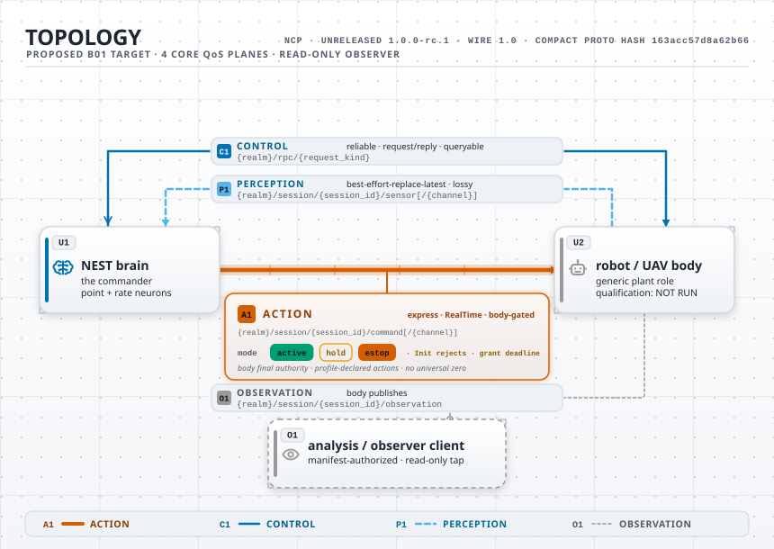
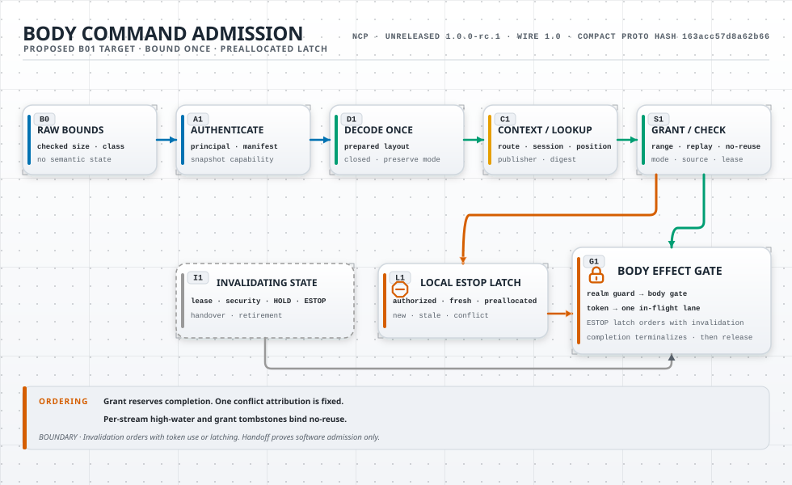

# NCP 1.0 low-overhead architecture

> **Status:** proposed B01 design for the unreleased, release-blocked
> `1.0.0-rc.1` candidate. This document is non-normative until the ADR set is
> ratified and the deliberate rebaseline is authorized. It does not release,
> certify, publish, or qualify NCP or an ecosystem peer.

## Purpose

NCP connects a simulation service, a plant body, commanders, and read-only
observers. The protocol must keep those roles interoperable without turning the
runtime into a distributed proof database.

The architecture has two forms of overhead:

- runtime overhead in bytes, allocations, copies, parsing, queues, and latency.
- ecosystem overhead in duplicated contracts, custom adapters, ambiguous roles,
  and project-specific forks.

Both forms must remain bounded and measured. Security and safety checks remain
explicit even when they cost time. The optimization target is duplicated work
and repeated metadata, not required authority checks.

In this document, **low overhead** means low allocation, copying, parsing,
locking, queueing, and repeated metadata. It does not mean fewer authority,
safety, security, or validation checks.

This document separates three states that must not be merged:

- **selected target** means the architecture proposed for B01 review.
- **current prototype** means source that explores part of that target without
  changing the candidate contract.
- **implemented contract** means B02 has authorized the rebaseline and B03 has
  allocated the required registries. Dependency-ready N-series work has also
  updated the complete normative graph and every binding together.

Only the first state exists for the complete architecture below. This document
is an implementation-facing recommendation for B01 review. It does not override
an ADR, close an ADR question, or allocate wire values. A source file, test,
diagram, or local benchmark cannot promote it to the third state.

## Design laws

1. One production path must have one named entry point. Unsafe and diagnostic
   paths must use different entry points.
2. The control plane and hot data planes have different encodings and workload
   profiles.
3. A peer validates deployment configuration once and compiles a session handle.
4. A hot frame is bounded before semantic allocation and decoded once.
5. One receiver-recognized publisher incarnation owns one stream epoch and one
   increasing sequence allocator. Assignment consumes a position. Later local
   failure creates a visible gap.
6. A body is the final software authority before an actuator boundary.
7. Serialized lease possession never creates live authority.
8. Unknown or default values never grant identity, authority, capability,
   lifecycle success, or action.
9. ESTOP is restrictive. Replay policy must not suppress an authenticated,
   authorized, current, fresh, structurally valid ESTOP latch. HOLD has no replay
   exception.
10. Every queue is finite and has one declared overload policy.
11. NCP remains project-neutral. Ecosystem projects depend on NCP, not the reverse.
12. Local evidence never becomes a release, safety, or interoperability claim.
13. One owner serializes each body generation's mutable authority, stream,
    command, restrictive, and executor-admission state.
14. No lock spans an application callback, network operation, device operation,
    or other work with an external latency bound.
15. A missing or unknown remote action mode is a rejection. It cannot request a
    remote HOLD or ESTOP effect. A body-local fail-safe response is a separate,
    explicitly attributed result.
16. Receiver-owned monotonic time drives every live deadline. Remote monotonic
    and UTC values are bounded correlation or audit evidence, not live authority.
17. Authority, replay, generation, term, epoch, and no-reuse counters use
    checked arithmetic. Diagnostic counters may saturate only when saturation
    is explicit, visible, and unable to grant authority or conceal overload.
18. Every production callback has a finite execution contract or a terminable
    isolation boundary. A count-bounded pool is not time-bounded when work
    cannot stop.
19. A mutating forwarded operation installs its exact durable outbox identity
    before network send. Ambiguity never creates a fresh operation.
20. An observer source owner orders projection release against grant revocation.
    Receiver checks cannot repair an unauthorized source release.
21. A deployment owner excludes overlapping physical effect paths across every
    realm, session, process, and failover generation.
22. Receiver arrival never starts or refreshes remote command freshness. The
    body issues a bounded absolute freshness grant before the publisher sends.
23. Stream positions are ordered only inside one declared stream. The body-owned
    event order, not a cross-stream sequence comparison, merges command streams.
24. Source correlation resolves through a bounded retained publication record.
    A timestamp, latest-value fallback, or reused position cannot replace it.
25. A native stable message has a closed member set. An unknown member rejects
    before typed conversion, replay lookup, signing, or effect. Evolution uses a
    negotiated wire/profile or an explicit bounded extension member.

## Runtime layers

Each layer has one job. A later layer cannot repair a failed earlier layer.

| Layer | Responsibility |
|---|---|
| Transport | Confidentiality, endpoint security, bounded delivery, and plane QoS |
| Application trust | Publisher principal, manifest, key set, security state, audience, route, and frame class |
| Session | Exact logical session, server-issued generation, role, and negotiated descriptor |
| Stream | Declared publisher epoch, increasing sequence, replay fence, and overload state |
| Typed frame | Kind, numeric bounds, exact layout, finite values, and source correlation |
| Plant profile | Command channels, units, arity, ranges, and body-local restrictive actions |
| Authority | Current authenticated commander lease and receiver-local monotonic deadline |
| Safety | Body-issued absolute command freshness, geofence, rate limits, link state, HOLD, and ESTOP latch |
| Body executor | Deployment-specific actuator mapping and physical safety case |

The actuator interface accepts a body-issued admission token. It does not accept a
raw map, a transport message, or a serialized lease.

One realm owner installs immutable security snapshots. Each snapshot has a
one-way currentness state. Only verified ingress can create an actor capability
that refers to that exact snapshot. Application code cannot construct,
invalidate, or recombine actor and currentness parts.

Each body generation has one state owner. That owner serializes lease changes,
stream admission, replay decisions, HOLD, ESTOP, command dispositions, and the
bounded executor slot. After bounded authentication and one decode, an action
callback enters the short body-owned admission transition directly. It does not
wait behind observation, extension, or control queues. The transition never
runs network, application, or device code. Other planes can use separate bounded
mailboxes with their declared overload policies.

The body owner has fixed reserved cells for lifecycle cuts, local restrictive
escalation, and the enrolled ESTOP-only lane. It observes a closed security or
session currentness gate before ordinary command work. It services those cells,
then any ready ESTOP, then HOLD or Active, then perception. Normal traffic cannot
replace or consume a cut or emergency cell. This priority check uses fixed state,
not a shared queue scan.

The prepared scheduler caps consecutive ordinary command transitions and gives
pending perception a finite service bound. That fairness rule cannot delay a
lifecycle cut, local restrictive escalation, or ready ESTOP. B03 selects the
numeric cap with the other local QoS values.

### Current implementation boundary

The current candidate implementation does not yet implement the complete runtime
above:

- Default `ncp-core` has no receiver-owned opaque ingress capability and no
  implemented A-direct transport can mint one.
- `AuthenticatedActor` is a public caller-constructible value.
  `AuthorityManifest::authenticate` also accepts a caller-supplied certificate
  identity. The core has no inseparable security-currentness capability. These
  types are integration helpers, not a production minting boundary.
- `PrincipalGrant` authorizes a complete plane. It carries no exact route,
  audience, frame class, session kind, or operation allow-list. The selected
  prepared ingress context must narrow every grant before typed delivery.
- `AuthorityManifest` validates `certificate_identity` with the NCP key-segment
  grammar. A transport-native identity such as a SPIFFE URI is not a route
  segment. The selected security profile must bound and compare its native form,
  then map it once to a canonical NCP principal.
- Generic Zenoh cannot expose the verified remote principal. Its
  `production-secure` path remains unavailable.
- Generic Zenoh open methods can also accept an arbitrary non-loopback config
  without minting a distinct insecure capability. They are diagnostic transport
  helpers, not the selected `dev-loopback-insecure` boundary.
- The runtime does not have one body owner that linearizes security cuts, leases,
  stream positions, restrictive effects, dispositions, and executor admission.
- The runtime has no deployment-wide effect-path registry. Separate realms or
  processes therefore have no selected software fence against the same hardware.
- Mutating B-over-A forwarding has no selected durable exact-byte outbox, and
  observer release has no source-owned order against revocation.
- The current command wire defaults an omitted mode to HOLD. Unknown and `Init`
  modes also reach a local HOLD result. This conflicts with the selected rule
  for explicit remote intent.
- The same command shape carries predictive-horizon fields plus publisher and
  source timestamps for every mode. The selected compact command represents one
  setpoint and omits both timestamps. HOLD and ESTOP also contain no remote value
  vector or source coordinate. Their actions come only from the installed plant
  profile.
- The current plant path does not require the live holder lease for an explicit
  HOLD. It also permits replayed ESTOP without an exact-byte binding.
- The current authority lease omits the direct realm, plant profile, declared
  action stream, and security state selected here. Its state-version increment
  saturates instead of retiring at a declared exhaustion boundary.
- The current authority machine lets an unaided commander issue its own first
  lease and renew a commander-issued lease. Its ESTOP reset checks an operator
  grant but not the installed plant profile or deployment interlock. The
  selected body owner must issue and renew leases. Reset must also satisfy the
  enrolled local interlock and profile state.
- The current Rust and TypeScript negotiation paths accept any `1.x` wire and
  also accept both `1` and `1.0`. They treat an absent or different compact proto
  hash as advisory. They do not require the exact supported wire literal and
  stable-core identity selected here.
- Rust message structs accept and discard unknown members within a compatible
  major. The generic validator repeats that policy. Exact native `1.0` admission
  must instead reject a member outside the selected closed shape, so signing,
  replay, typed semantics, and forwarding cannot observe different objects.
- The compatibility governor still returns wire-shaped substitute commands. It
  does not return the selected body-local decision type.
- The Zenoh compatibility publisher assigns lease commands and normalized local
  ESTOP to one locally minted command stream. It has no separately authenticated
  emergency publisher, declaration, or drain grant.
- No accepted compact data-plane encoding, complete live command no-reuse owner,
  body-issued command freshness-grant registry, optional durable-continuity
  store, or complete disposition journal exists.
- Stable key builders reject delimiters and wildcards but set no UTF-8 byte
  ceiling for a realm, realm segment, session ID, or channel name. Current JSON
  schemas also leave those identity strings at the universal per-string limit.
- The current idempotency cache is session-local compatibility code. Its key does
  not yet bind the direct realm, authenticated entity, operation class, and
  complete target selected here. Its retry API cannot return a terminal result
  after the request deadline or live lease has elapsed.
- The current contract requires a server-issued UUIDv4 generation, but no
  selected realm owner reserves generations across process restart. Randomness
  alone is not the selected no-reuse proof for a plant generation.

If B01 accepts this target, these items are implementation gaps rather than
alternate protocol choices. Later tasks must either implement the accepted
boundary or reopen B01 explicitly.

A security cut first closes the old snapshot to new work. The body owner rechecks
that same snapshot immediately before it commits an admission or restrictive
transition. Work that overlaps the cut has one local order: it commits before
the cut or it rejects after the cut. Pending actuator work rechecks currentness
at bounded executor acceptance. No realm-wide reader lock waits for callbacks,
network I/O, or device I/O.

The executor handoff ends when the body-owned slot accepts the exact command and
its evidence transition. The slot operation is bounded and nonblocking. Device
I/O starts after that handoff and makes no protocol-level physical-effect claim.

### Logical proof versus deployed shape

An ADR can name facts, commitments, receipts, selectors, and recovery evidence
to state an invariant precisely. Those names do not require separate public wire
objects, tables, services, transactions, or network round trips.

A local implementation of this recommendation can collapse related logical
artifacts into one immutable record and one atomic state transition. It must
preserve all observable bindings, failure order, no-reuse rules, and recovery
results. It can derive an exported receipt after commit from that retained
record. It must not invent a fact that was unavailable at the commit boundary.

A cross-process protocol is justified only when the authoritative owners are
actually separate. Even then, the hot data path does not wait for a proof graph.
The control plane can import a bounded, authenticated result into the prepared
context before hot traffic starts. B02 authorizes a wire-visible change, B03
allocates its registered identities, and later N-series work updates the
contract. B01 diagrams or model names alone do not.

### Minimal deployed object graph

```text
DeploymentRuntime
├── EffectPathRegistry spanning every realm and actuator-capable process
└── bounded RealmRuntime entries
    ├── SecurityOwner
    │   └── current immutable SecuritySnapshot + one-way currentness gate
    ├── bounded SessionDirectory
    │   ├── SimulationSessionRuntime
    │   │   ├── immutable PreparedSession
    │   │   └── SimulationStepOwner
    │   │       ├── strict next-execution position
    │   │       ├── bounded request window + no-reuse state
    │   │       └── bounded retained response slots
    │   └── PlantSessionRuntime
    │       ├── immutable PreparedSession
    │       └── PlantBodyOwner
    │           ├── AuthorityMachine
    │           ├── bounded command declarations and freshness grants
    │           ├── per-stream position no-reuse state
    │           ├── bounded source-publication windows
    │           ├── priority command slot + executor handoff slot
    │           ├── restrictive state + ESTOP latch + emergency drain budget
    │           └── bounded DispositionJournal
    ├── bounded ControlForwardingOutbox entries
    ├── bounded ObserverGrantRuntime entries with separate release slots and queues
    └── bounded ExtensionActivationRuntime entries with separate assembly queues
```

An authenticated endpoint holds immutable prepared ingress contexts. A
publisher holds one stream allocator and one bounded outgoing slot. Neither
object owns body authority. Observer and extension callbacks receive only their
least-privilege capabilities.

The session handle contains only state fixed by session admission. Each accepted
stream declaration creates a separate immutable prepared stream context. That
context binds one receiver-owned publisher incarnation.

For A-direct traffic, the incarnation is inseparable from the verified connection
instance. A payload cannot select it. The session directory publishes or retires
those contexts atomically. A data frame cannot create or alter either object.

Variable names, routes, grants, layouts, units, and parser profiles are compiled
into the immutable prepared objects. A hot operation uses fixed identities,
indexes, and bounded slots. Mutable ownership does not cross the object graph.
Cross-owner work uses a bounded event or an immutable result. It does not share a
mutable map or hold a lock across a callback.

## Planes and ownership

| Plane | Normal publisher | Consumer behavior | Queue |
|---|---|---|---|
| Control | authenticated role authority | bounded request, idempotent mutation, retained receipt | reject overflow |
| Perception | body | newest valid sample wins | replace latest |
| Action | lease holder or enrolled emergency principal | direct bounded body admission, then preserve strongest unconsumed mode | one body priority slot |
| Observation | body or declared producer | read-only delivery | drop oldest and count |
| Extension | manifest-authorized producer | isolated reassembly and parser callback | reject or follow the selected delivery profile |

<picture>
  <source media="(prefers-color-scheme: dark)" srcset="../diagrams/topology-dark.svg">
  <source media="(prefers-color-scheme: light)" srcset="../diagrams/topology-light.svg">
  
</picture>

Lifecycle and management control messages are low-rate, descriptive, and
audit-relevant. Bounded canonical JSON is appropriate there. A compact simulation
step remains under control authority, but it uses a separately declared frame
class, stream, route, and resource partition. It cannot inherit plant-action
authority or occupy the lifecycle mutation queue.

Every mutating control operation uses one opaque idempotency key. Its scope binds
the realm, authenticated transport principal and entity, operation class, and
exact target. A session-scoped target includes session kind, logical ID, and
generation.

Session creation uses the same rule before a generation exists. Its target is
the session kind and logical namespace. The first winning reservation allocates
one generation, and an exact retry returns that retained `SessionOpened` result.
Timeout, cancellation, or a concurrent local open never starts a second
generation under the same operation identity.

One local durable transaction binds the operation identity, canonical request
digest, namespace reservation, and never-reused generation before the response
becomes visible. Ambiguous storage completion keeps that namespace closed until
recovery proves the retained result or permanent retirement. It never allocates
a replacement generation for the same unresolved operation.

The session directory also serializes all opens for the same realm, session
kind, and logical namespace. This rule is independent of the caller's operation
ID. While one open is pending or live, a different operation ID rejects without
allocating another generation. Reopening is possible only after terminal
retirement, and it always receives a new reserved generation.

Session close is an authenticated idempotent control operation against one exact
live generation. Its winning transition first closes that generation to new
streams, grants, callbacks, and mutations. It then starts the kind-specific
bounded retirement outside the directory lock.

A plant retirement enters its installed restrictive policy and closes lease,
command, source, token, and executor admission. A simulation retirement closes
new steps and terminalizes later reservations. Observer and extension retirement
close currentness before subscription, parser, and callback cleanup.

`SessionClosed` is terminal success only after every effect or mutation right is
definitive or permanently fenced. A deadline can return pending or outcome-unknown
state, but it cannot manufacture clean closure. Exact retry and query read the
same retained operation. They never reopen the generation or start cleanup again.

The receiver stores one canonical request digest with the terminal response.
The same key and digest return that response only through the explicit retry or
query path. A second first-attempt request rejects. The same key with a different
canonical mutation projection always conflicts. A retry marker and renewable
authority envelope can remain outside that projection only when the selected
profile authenticates and validates them separately. This is one bounded local
table, not a required distributed transaction graph.

An exact retry while the entry is pending returns `IN_PROGRESS`. It does not
start another mutation.

A control backend has a prepared execution deadline and one reserved worker
budget. Canceling an async waiter does not release that budget while synchronous
work still runs. A backend that cannot stop within its contract runs behind a
terminable process or equivalent isolation boundary. Losing that boundary
terminalizes a known pre-effect failure or an outcome-unknown obligation. It
never turns the same request into new work.

The request deadline controls whether a new mutation can start. It does not
erase a reserved operation identity. An authenticated exact retry or query can
read the retained state at or after that deadline when current authorization
still permits the lookup. The retry cannot extend the deadline or restart the
mutation. A retry or query never creates state.

An absent retry returns a non-success absence result without mutation or
reservation. It cannot assert that no effect occurred unless retained state
proves that fact.

A new request reserves its identity before mutation. A new request at or after
its deadline rejects without mutation or reservation. If state loss makes an
earlier effect possible, the affected generation cannot resume.

For a new request, the receiver samples its UTC and monotonic clocks once. It
checks the supplied UTC deadline against a bounded skew and duration profile,
then derives an exclusive receiver-monotonic deadline with checked arithmetic.
Only that local deadline governs ongoing work. A retry never derives a new one.

Receipt retention and operation-identity retention are different bounds. A
compact tombstone retains the request digest and no-reuse identity after the
complete response expires. If it also retains an authenticated terminal label,
it can return only that label. Otherwise an exact query returns
`EVIDENCE_UNAVAILABLE` without asserting an outcome.

`OUTCOME_UNKNOWN` is reserved for an operation that can have crossed its effect
boundary without a definitive result. Changed request bytes still conflict. A
full table rejects new mutations. Durable target retirement can release entries
only after the target generation becomes permanently unable to resume or accept
reuse.

Sensor and command frames are high-rate. Their negotiated names, units, roles,
routes, session generation, and security state must be compiled outside the tick
loop. Repeating those strings in every future compact frame is waste.

The realm owner partitions count and byte budgets by plane and installed role.
Session, stream, observer, and extension creation reserves its complete state
before publication. Observation or extension pressure cannot borrow action,
security, restrictive, or no-reuse capacity. A full partition rejects new work
without evicting a live authority record or a retained no-reuse obligation.

## Disjoint session kinds

NCP must use separate entry messages and state types for these session kinds:

- simulation service.
- plant control.
- observer attachment to an existing session.

A simulation request may carry a network, recording, stimulus, and simulation
configuration. A plant request carries a plant profile, channel layout, control
rate, body identity, and safety boundary. Optional fields in one generic request
must not select between those meanings.

Simulation provenance is advisory input to a commander. It never becomes plant
authority. A component that implements simulation and commander roles uses
separate principals, keys, routes, stores, and process capabilities.
Simulation output retains `calibrated_posterior=false` and
`is_simulation_output=true`. Protocol success does not establish paper
reproduction or posterior calibration.

### Contract identity

Wire family, stable-core semantics, complete release sources, conformance corpus,
extension manifests, and publication authorization are different identities.
The compact protobuf hash is a diagnostic only. It cannot establish native
compatibility or authorize publication.

A native session requires an explicitly supported wire and exact stable-core
identity. The complete release identity can change for packaging or maintained
prose without changing the stable-core identity. An explicit terminating gateway
can join different wires, but it has separate source and target identities and
does not report a native match.

Each native JSON profile selects one exact version literal. The recommended
`stable-1.0` literal is `1.0`. An alternate spelling or unselected same-major
minor rejects rather than creating a second digest spelling for the same claimed
profile. Compact hot frames bind that literal through their prepared context and
do not repeat it.

Runtime peers compare prepared fixed-size identities. They do not hash a source
tree during handshake or frame admission. B03 must select each exact source set,
domain, algorithm, framing rule, and field layout before implementation.

### Wire migration

Wire `0.8` and wire `1.0` are different protocols. A native peer never accepts a
copied schema, filename, package version, or compact hash as migration proof. A
terminating gateway has separate authenticated source and target sessions,
principals, manifests, generations, streams, idempotency state, and receipts.
It validates the complete source message, applies an explicit content-addressed
mapping, and constructs a new target message. Identity and authority do not pass
through the gateway by implication.

An absent source field, unit, role, provenance flag, security binding, or stream
fact rejects by default. A reviewed mapping can mark that exact field unavailable
only when the target operation remains non-authorizing. The gateway cannot infer
a plant command or active lease from historical simulation traffic. Gateway
receipts state translation facts only. They do not report native
interoperability or consumer qualification.

## Prepared session handle

After a successful handshake, each peer prepares one immutable session handle.
The session handle binds:

- logical session ID and server-issued generation.
- session kind and local role.
- exact routes and expected remote principals.
- security profile, authority manifest, public keys, security epoch, revocation
  epoch, and audience.
- permitted data-plane encodings.
- permitted sensor and command channel layouts.
- for a simulation session, the prepared step request and response layouts,
  advance unit, execution order, pipeline window, and retained-result limits.
- exact units, arities, numeric ranges, and plant profile digest.
- queue capacities and overload policies.
- receiver clock incarnation and local deadline ceilings.

Preparation rejects inconsistent values before subscriptions, publishers, or
actuator resources are created. Mutable replay fences remain in their declared
stream or body owner. The immutable handle carries only their compiled profile
and identity. The tick loop reads prepared fields. It does not rescan manifests,
channel maps, or profile text.

Before it exposes `SessionOpened`, the realm owner durably reserves a generation
that cannot repeat under that realm and session kind. The issuer uses checked
state and retires on exhaustion. Restart restores only the issuer's no-reuse
state, not a live session or lease. This low-rate reservation occurs once per
opening and adds no per-frame storage operation. B03 must select its exact
identity, storage, and crash-consistency profile. If the issuer cannot prove its
state, it cannot open a new generation.

An accepted stream declaration then compiles one immutable stream context. That
context binds the exact route, publisher, epoch, frame class, encoding, layout,
position bounds, replay profile, and overload policy. Retirement closes that
context before cleanup. Installing a successor requires a new declaration.

An action stream that reports perception correlation also binds one exact source
stream declaration and source epoch. An explicitly approved open-loop action
stream binds the absence of a source instead. A hot command cannot select or
change its source stream.

### Machine identifiers and routes

The recommended portable machine-identifier grammar is lowercase ASCII. A
segment starts and ends with `a-z` or `0-9`. An internal byte can also be `.`,
`_`, or `-`. Empty segments, alternate spellings, percent encoding, Unicode,
whitespace, controls, wildcards, and key-expression delimiters reject.

The recommended B03 ceilings are:

- 128 bytes for one general identity segment.
- 64 bytes for a logical session, channel, or scope segment.
- 8 segments and 512 bytes for a realm.
- 1,024 bytes for one complete literal route.

Every applicable ceiling must pass at the same time. An implementation scans
untrusted bytes once with checked arithmetic. It does not split the realm into
an attacker-sized string array. It compares the installed route byte for byte.
Display labels can use a separate bounded Unicode field, but a display label is
never an authority, route, session, principal, or registry identity.

A verified transport identity is also a separate class. Its selected transport
profile defines the bounded canonical certificate, URI, or operating-system
identity form. The receiver compares that form without rewriting it, then maps it
to one canonical NCP principal during context preparation. A transport identity
is never interpolated into a route or accepted as a caller-supplied principal.

These values are a B01 recommendation, not current allocations. B03 must freeze
the accepted classes and ceilings before generated schemas or bindings change.

## Stream lifecycle

An authenticated idempotent control operation declares each stream before data
traffic can use it. The declaration binds the complete session, plane, literal
route, authenticated publisher, receiver-owned publisher incarnation, frame
class, random epoch, encoding, and layout. It also binds the position ceiling,
gap policy, overload policy, and security state.

Only one live connection or authenticated handoff can hold that incarnation. A
second connection for the same principal cannot share its allocator or grants.
Reconnect, process handoff, or publisher failover retires the declaration through
control state before a successor declaration receives a new incarnation and
epoch. Copied payload fields cannot perform that handoff.

One stable stream slot has at most one declared or live epoch. Data can move a
declaration from declared to live. Data cannot create, replace, renew, or retire
a declaration. Retirement is a control operation, and a retired epoch never
returns to live state.

An action declaration either binds one live perception declaration as its source
or marks the action profile open-loop. The source binding includes its route,
publisher, frame class, session generation, and epoch. A source sequence without
that prepared binding rejects. A source-bound Active command requires one positive
source sequence. Open-loop Active, HOLD, and ESTOP carry no source sequence.
Restrictive admission never depends on source evidence.

The body retains a finite correlation window for each bound source declaration.
Each entry binds the exact admitted source position, frame digest, publisher,
session generation, declaration, receiver-arrival sample, and currentness state.
It also carries the exact bounded safety projection required by the plant profile.
The profile bounds entry count, aggregate bytes, and receiver-local lifetime.
Eviction never enables a timestamp, bare sequence, or latest-value fallback. A
command whose source record is absent or expired rejects as unavailable.

Sensor admission sends that small prepared projection through a bounded
replace-latest perception slot. The source window is subordinate state of the
`PlantBodyOwner`, not a second lock owner. Perception events cannot consume the
action slot, and the owner processes a pending action event first. It does not
retain the complete compatibility frame merely for command correlation.

For a new source-bound Active position, one body transition copies the exact
matching projection and record digest into its grant-reserved source-pin slot.
It installs that pin atomically with the command-position binding, before the
window can advance. The pin binds the grant range, command position, source
declaration, source position, record digest, and prepared projection. Exact
retry observes the same pin even after window eviction.

Changed coordinates or bytes conflict and cannot replace it. A missing, changed,
expired, or consumed record rejects without consulting the latest sensor value.
No second owner or cross-owner lock is required.

One lease-bound command declaration accepts Active, explicit HOLD, and any ESTOP
permitted for its authenticated publisher. A separately enrolled emergency
principal uses a distinct ESTOP-only declaration and can receive only
ESTOP-mode grants. Its bounded transport receive lane through authentication
dispatch, authenticated ingress context, raw-frame slot, and decode budget are
separate from the lease-bound command path. Ordinary command traffic cannot
consume them.

Ordinary capacity rules apply while normal grant admission is open. The one-use
drain budget preserves or installs the sole final ESTOP slot under its restrictive
entry conditions. Each declaration has its own epoch, allocator, replay fence,
and no-reuse state. Sequence values from different declarations are never
compared. The body owner merges their accepted events in one local order. An
ESTOP latch then prevents later Active admission without a global cross-principal
sequence.

Before publication, the body issues a bounded freshness grant for one declaration.
It binds the authenticated publisher, receiver-owned publisher incarnation,
declaration, epoch, receiver clock incarnation, and a non-overlapping position
range. It also binds permitted modes, issue tick, exclusive maximum tick, and the
complete reserved disposition budget. For each permitted lease-bound mode, it
also binds the exact holder, term, lease ID, and authority version current at
issue.

The publisher can consume only positions in that range through the same prepared
incarnation. Exact grant-request retry returns the same range. Ambiguity never
allocates a replacement range.

The resource profile caps positions per grant, simultaneously live normal grants
per declaration, and aggregate reserved bytes. A normal publisher can prefetch a
bounded successor grant over a disjoint range before the current grant expires.
The command position selects at most one live grant because the ranges cannot
overlap. The high-rate path therefore repeats no grant reference and waits for no
control round trip on each tick. No prefetch extends an existing deadline or
permits overlapping positions.

The first normal grant for a declaration starts at position one. Each successor
starts at the prior allocated range's exclusive end. The body allocates that
contiguous range with checked arithmetic. A publisher can leave visible gaps by
not sending assigned positions, but it cannot choose another range start.

The body keeps the current and one prefetched live range in fixed slots. A new
command checks those slots directly rather than searching historical grants.
Range tombstones remain in the bounded no-reuse state for stale and recovery
decisions, but they cannot become live again.

Grant installation claims concrete entries from preallocated no-reuse,
disposition, source-pin, and fail-safe pools. Open-loop or non-Active-only ranges
need no source pins. A soft accounting counter is insufficient. Expiry or
completion can release only the difference permitted by the selected retention
profile, after the range tombstone remains installed.

The publisher assigns each positive increasing granted position before
serialization or queue admission. Assignment is irreversible. A later local
failure creates a visible gap. Active, HOLD, and ESTOP in the same declaration
share its allocator. Restrictive priority across declarations comes only from the
body-owned event order.

A receiver validates the declaration and syntactic position before lower
semantics. An ordinary stream retains a high-water mark and bounded gap evidence.
A command stream also retains its grant-range tombstones and digest-bound state
for consumed positions. Its high-water mark and tombstones prevent reuse after
complete result evidence becomes unavailable. A restart that cannot restore
required command no-reuse state retires the stream or generation.

Position exhaustion never rotates implicitly. The publisher stops, the session
authority retires the declaration, and a new random epoch requires a new
declaration. The old retirement record remains non-authorizing evidence.

## Receiver time and deadlines

The body issues each command freshness grant from its receiver-owned monotonic
clock. The grant records its clock incarnation, issue tick, and exclusive maximum
tick. It also reserves the complete no-reuse and disposition capacity for every
position in its range before the grant becomes visible.

A command carries only its granted stream position. That position resolves at
most one live range or retained range tombstone inside its declared stream. The
grant's exclusive maximum tick is the command deadline. Equality is expired.

Transit, transport buffering, decode, and queue delay all consume this unchanged
lifetime. Receiver arrival never starts or refreshes it. A shorter application
deadline requires a separately prepared grant rather than caller-selected frame
metadata.

The receiver still samples monotonic arrival after authenticated ingress and
before retention. That sample is bounded correlation and operational evidence.
It does not grant freshness. A retry uses the original grant, slot, and deadline.
Restart changes the clock incarnation and invalidates every old live grant.

Publisher monotonic time orders one publisher's evidence. UTC supports audit and
bounded duration derivation. Neither clock is compared directly with another
process clock to grant freshness. Command source correlation uses the exact
sensor stream position and the body's retained publication record. A source
timestamp without that position and record proves no sensor freshness.

Every retained live deadline binds one receiver clock incarnation. A restart
creates a new incarnation. Serialized deadlines, leases, grants, and pending
tokens from an older incarnation do not become live in the new process.

## Authenticated transport boundary

Zenoh callbacks do not expose a verified remote principal to the current adapter.
TLS alone therefore cannot bind an NCP payload to its application publisher.

An endpoint selects one installed security profile before it prepares ingress.
`production-secure` failure rejects startup or admission. It never falls back to
another profile. `dev-loopback-insecure` is a separate entry point and capability
type. It accepts only an IP loopback endpoint or an absolute Unix-domain socket,
and every status surface marks it unmistakably insecure. An insecure capability
cannot convert into an authenticated A-direct context or satisfy a production
role receipt.

The B01 recommendation uses the two trust cases proposed in ADR-003. No case
falls back into another:

- A direct authenticated transport can omit an application signature only when
  the receiving API supplies a receiver-owned opaque ingress context. Caller
  bytes cannot construct, alter, or recombine it. The context identifies the
  verified connection instance, publisher, audience, route, class, and security
  state.
- A forwarded control message uses the strict flattened-JWS profile proposed by
  ADR-003. Control traffic is low-rate and benefits from the standard envelope.

The high-rate production target uses A-direct. The transport authenticates a
connection once. It derives one immutable ingress context for each permitted
route and frame class. That context fixes the connection instance, publisher,
audience, realm, session, security state, and parser. A frame does not repeat a
key identifier, context digest, security epoch, revocation epoch, or application
signature that the context already fixes.

One authenticated connection represents one application principal. A transport
that multiplexes principals must provide separate cryptographically verified
contexts, or the operation must use B-over-A. Payload bytes cannot select a
principal within an A-direct context.

If a forwarding process cannot preserve that authenticated connection context,
it uses B-over-A. It can instead open a new A-direct authenticated connection as
the new transport peer. It does not invent another signature wrapper. Untrusted
frame bytes never select a key, realm, route, security epoch, or parser.

A process that terminates transport becomes the publisher on its outgoing
connection. It cannot preserve origin authority by copying a principal field.
A selected schema can carry bounded signed origin evidence as provenance. That
evidence does not grant the relay's route, callback, lease, or command authority
to the original signer.

Every mutating B-over-A operation first reserves one bounded durable outbox
item. The item binds the stable signer, security state, exact protected bytes,
target, route, audience, realm, session, operation class, and idempotency key.
Installation and the no-reuse binding are one local transaction. A retry or
restart resumes or queries that item.

Changed bytes or coordinates conflict. A timeout without authenticated
non-acceptance remains pending and cannot start fresh work. This low-rate control
work never enters the hot tick path.

Each external send attempt uses one short outbox-owner transition. The owner
rechecks the bound security snapshot, revocation state, target permission, and
operation deadline. It then marks the exact attempt active before network work.

If a security cut wins first, the owner terminalizes unsent work without a send.
If the attempt wins first, network work runs outside the lock. Timeout or process
loss leaves that same attempt unresolved. It cannot become a new outbox item or a
second send attempt without authenticated non-acceptance from the target.

Portable control objects and exported evidence carry their direct
`AuthorityRealmKey`. A future compact hot frame can bind that key through its
exact authenticated ingress context instead of repeating both realm strings
on every tick. Replay under another realm, route, session, or security state then
fails context admission. This prepared-context binding is a B01 recommendation.
It must not be inferred for an unprepared connection or portable control object.

The current compatibility digest includes validated deployment configuration,
including local certificate and key paths. It is deterministic for that exact
configuration, but it is not the path-free public `SecurityState` projection
proposed by ADR-009. ADR-009 preparation remains required before any production
adapter can compile a semantic security context.

A custom per-frame signature carrier would repeat context metadata and add
public-key work to every hot frame. It is not the recommended default data
plane. A-direct is not implemented, and `production-secure` remains closed.

The production implementation target has these properties:

- a verified connection exposes receiver-owned opaque ingress contexts.
- observer-only processes retain no publisher private key.
- a production adapter exposes no raw transport handle that can publish into an
  NCP namespace. Diagnostic or host-sharing access uses a separate capability.
- a wrong route, class, audience, manifest, realm, session, or security state
  rejects before typed delivery.
- unauthenticated payloads never enter a trusted subscriber callback.
- one installed-state owner mints the inseparable actor/currentness capability.
- rotation installs new prepared ingress contexts and invalidates the old
  contexts without waiting for application code.

The selected transport profile also bounds work that occurs before application
ingress. It sets a finite fragment count, complete delivered-byte limit, and
concurrent reassembly budget. Application-level compression is off on core hot
planes. If a transport or extension profile permits compression, it bounds both
compressed and expanded bytes plus the expansion ratio before semantic parsing.
An implementation cannot cite the application frame limit after an unbounded
transport decompression allocation has already occurred.

Live mTLS, ACL, rotation, revocation, and key-custody qualification remain separate
pre-release gates.

## Compatibility JSON hot path

Until a compact inner encoding is ratified, the wire-1.0 compatibility path uses
bounded JSON. A production path still requires the unavailable authenticated
transport boundary described above.

A corrected compatibility sender performs this work:

1. validate every position-independent typed field.
2. assign the frame's final stream position.
3. construct and validate the exact positioned frame.
4. serialize once into one owned bounded byte vector.
5. move the vector into the authenticated transport.

Position assignment is irreversible. Validation, serialization, queue, or
transport failure after assignment creates an observable gap. The publisher
never assigns that position to a different frame. Application retransmission is
legal only after an accepted profile defines digest-bound receiver state and
retained outcomes for the position. Until then, the current candidate consumes
an attempted put and does not retry ambiguous bytes.

An asynchronous action publisher retains the exact JSON vector in its one
outgoing slot. It does not retain a second payload-sized application buffer.
Each replacement receives its own newer position. The displaced unpublished
frame becomes a local pretransport supersession and leaves a visible stream gap.
It is not a body-issued `SUPERSEDED` disposition, because the body never admitted
that frame.

A corrected compatibility receiver performs this work:

1. reject an oversized segmented transport payload.
2. borrow contiguous bytes, or flatten a segmented payload once within the bound.
3. obtain the verified prepared ingress context without copying the payload.
4. start one bounded typed decode and enforce each JSON limit before its related
   allocation.
5. reject every member outside the route profile's closed message shape.
6. require every intent-selecting field that the route profile marks explicit.
7. create one typed frame.
8. check route, session, stream, role, and frame semantics.
9. move the frame into its bounded consumer slot.

No application should parse an already admitted typed callback again.

The typed decoder counts depth, objects, arrays, members, keys, decoded string
bytes, numeric tokens, and aggregate bytes as it consumes input. Escape handling
checks remaining per-string and aggregate budgets before appending decoded bytes.
It rejects an unknown member while parsing the selected shape. It never builds a
generic value tree or performs a separate full preflight parse.

### Direct implementation audit

The current reference path does not yet satisfy that shape. Direct source review
found these avoidable costs:

- `SensorFrame` and `CommandFrame` repeat maps, strings, session identity, stream
  identity, and authority data on each JSON frame.
- `ControlTransport::latest_sensor` returns an owned clone. The in-process
  command path also clones before and during queue replacement.
- the reusable stream fence hashes the complete route, message kind, and session
  generation for every frame before a tree lookup. It also adopts the first
  admitted epoch. A prepared stream context must instead provide a fixed slot and
  declared epoch, so the hot path performs neither string hashing nor discovery.
- `AuthorityManifest` applies the route-segment grammar to
  `certificate_identity`. That grammar cannot represent common transport-native
  identities such as a SPIFFE URI without rewriting them. A prepared security
  profile must validate the native identity type once. It then maps that identity
  to an NCP principal without using it as a route field.
- `AuthorityManifest::authenticate` scans the principal list and clones the
  principal, certificate, and entity strings on every call. Prepared ingress
  must resolve the verified native identity once and retain fixed or borrowed
  actor coordinates instead of repeating that work for each frame.
- the control loop commits its command position only after local transport-slot
  acceptance. Governance or serialization failure can therefore reuse an
  already assigned candidate position.
- the Zenoh control transport rewrites lease commands and locally normalized
  ESTOP into one transport-owned stream. That compatibility path cannot represent
  the selected separately authenticated emergency principal and ESTOP-only
  declaration.
- the Zenoh pending slot reports its first position as accepted. A later local
  replacement can put different command bytes at that same reported position
  before publication.
- `SafetyGovernor::govern` serializes for bounds, clones the complete command,
  and serializes again after mutation.
- checked codec calls validate static codec configuration and rebuild
  string-keyed maps on each call. There is no prepared codec object.
- the checked codec synthesizes midpoint rates for absent sensor components,
  midpoint command values for absent populations, and zero-filled sparse command
  components. It can also select a channel unit from mapping order. These are
  plausible values, not a universal safe action. A prepared plant codec must
  reject missing required input, sparse output, and unit disagreement before an
  Active command exists.
- the Zenoh action path performs multiple bounded-serialization passes before
  publication, while the receive path returns owned frame clones.
- `ZenohBus::put` clones the complete admitted byte slice before it calls Zenoh.
  The action dispatcher already owns those exact bytes, so the selected sender
  path must transfer that buffer instead of making another payload-sized copy.
- every typed Zenoh receive path converts the admitted payload into an owned
  byte vector. A contiguous payload cannot remain borrowed through admission.
- typed Zenoh subscribers decode a frame for admission, discard that typed
  value, and invoke the callback with raw owned bytes. The control transport
  then decodes the same sensor bytes again.
- most Zenoh subscriber callbacks invoke caller code inline on a receive task.
  The adapter does not prove that a slow observer, sensor consumer, or action
  callback cannot occupy transport execution needed by another plane.
- one normal Zenoh-to-Python lifecycle request can be parsed five times before
  its correlated reply leaves the gateway. Dispatch error context, selector
  validation, gateway admission, and reply correlation each rebuild request
  state. The rare control path can retain one bounded raw frame beside one typed
  request and pass borrowed correlation fields instead.
- the universal JSON preflight decodes each string into an owned `String` before
  it checks the decoded per-string and aggregate limits. The raw frame bound
  caps this cost, but the scanner does not enforce those limits incrementally.
- the core `decode_validated` path builds a generic JSON value. Its generic
  validator clones and deserializes that value to prove the typed shape. The
  caller then deserializes the original value into the same type again. An
  accepted frame therefore pays for one generic tree and two typed
  materializations.
- the Rust message structs and generic validator deliberately ignore unknown
  members for major-version forward compatibility. Typed conversion then drops
  bytes that a replay digest, signature, gateway, or another implementation can
  still observe. The selected exact `1.0` profile closes each stable shape and
  reserves extensibility for explicit bounded members or a negotiated profile.
- the TypeScript request-digest writer retains projection bytes as JavaScript
  numbers. It copies them into a `Uint8Array` and then into a padded hash buffer.
  A bounded streaming hash avoids the representation expansion and both full
  copies.
- the TypeScript safety path first walks a complete data-plane object to count
  canonical bytes. Its canonical emitter then builds nested child strings and a
  final full string. One bounded streaming writer can validate size and emit
  once without the duplicate traversal or retained fragments.
- the TypeScript WebSocket client limits request count but not aggregate queued
  payload bytes. Its 128 legal pending frames can retain roughly 128 MiB before
  string and promise overhead. The selected profile needs one checked byte
  reservation across queued payloads and transport buffering.
- the same WebSocket client assigns replies to waiters in FIFO order instead of
  by an authenticated request identity. A server that completes legal requests
  out of order can make each reply fail the wrong caller's correlation check. The
  selected control path needs one bounded identity lookup and must not consume an
  unrelated waiter on mismatch.
- the Zenoh adapter bounds each observation queue to 64 entries and concurrent
  RPC requests to 128. It does not reserve aggregate payload bytes for either
  class. Maximum legal frames can therefore retain roughly 64 MiB of observation
  payload and 128 MiB of RPC payload before task, key, reply, and queue overhead.
  Its observation-drop counter also uses wrapping atomic addition. The selected
  profile needs checked aggregate byte reservations and non-wrapping diagnostics.
- the Zenoh RPC semaphore stays held until a synchronous `spawn_blocking` handler
  returns. Such a handler cannot be preempted. All 128 permits can therefore stay
  occupied indefinitely. The gateway also wraps that already-blocking handler in
  a redundant `block_in_place` call.
- `ZenohBus` retains subscriber handles and observation worker tasks in vectors
  with no session-level entry ceiling. Repeated local subscription calls can
  grow selectors and tasks even though each observation queue is finite.
- several live Zenoh paths synchronously format and write diagnostics to standard
  error. Some include a complete session identifier or parser error. The selected
  hot path records a fixed result code and bounded counter outside its state
  transition.
- generic Zenoh open methods can connect through arbitrary configured endpoints
  without enforcing the loopback-only development profile. They are not a
  deployment entry point for either selected security profile.
- `ZenohBus::session`, `put`, and `subscribe` expose raw transport operations.
  `ZenohBus::from_session` creates the same wrapper from a host-owned session.
  These paths can bypass typed NCP admission. They must remain a separate
  diagnostic or host-integration capability, not part of a production adapter.
- the `ncp-zenoh` package enables TCP, UDP, TLS, and shared-memory links in every
  build. An installed role cannot select a smaller reviewed link footprint, and
  Cargo feature unification can silently widen that footprint.
- several bus and Zenoh paths validate a generic JSON value and then use panic
  assertions to extract its required fields. This repeats lookup and couples
  process availability to perfect agreement between the validator and caller.
  A typed fallible admission result must carry those fields forward once.
- the public Rust and TypeScript `ActionBuffer` helpers latch an ESTOP mode before
  complete wire validation. This is conservative only inside their documented
  trusted local context. They are not remote admission APIs. The selected body
  entry authenticates, decodes, and validates the command before the latch path.
- the Rust and TypeScript watchdog helpers start a command TTL from local frame
  arrival. They also normalize a binary64 duration inside the helper. A delayed
  remote command can therefore receive a new lifetime. The selected compact body
  path carries no per-frame TTL. It uses only the unchanged absolute deadline
  from the body-issued freshness grant.
- `LinkMonitor::new` silently clamps or replaces invalid loss parameters and
  accepts any positive finite CUSUM threshold. One sequence jump evaluates at
  most 256 missing samples, so a larger threshold can miss an arbitrarily large
  burst. Its loss counters can also saturate without a visible saturation state.
  A prepared profile must reject unsupported parameters and make bounded-work
  saturation unable to suppress the restrictive result.
- the public `ActionBuffer` and reusable stream fence adopt the first valid frame
  epoch in their local context. The selected prepared-stream owner must supply
  the declared epoch, so an admitted frame can compare with it but never establish
  it.
- `LinkMonitor::on_seq` replaces its stored epoch with a newly allocated copy on
  every valid sample. It relies on its caller to preserve the declaration. A
  prepared monitor must own one immutable epoch and receive only the changing
  sequence on the hot path.
- `LocalBus` and `InProcessTransport` intentionally remain co-process or test
  helpers. Their registrations and retained command or status histories have no
  production capacity profile. Deployed ingress must use prepared bounded
  owners instead.
- the C ABI accepts NUL-terminated JSON without an explicit input length. It
  must discover the terminator before the universal frame limit can run. A
  production ABI needs pointer-and-length inputs so it can reject the raw byte
  count before UTF-8 or JSON traversal.
- the Python binding accepts an already allocated `str`, builds a generic JSON
  value, and then builds the typed value. That interface is suitable for local
  tooling. Installed ingress needs a bounded bytes or buffer view and one typed
  decode after raw preflight.
- the plant-profile command validator is not integrated into action admission.
  A future projection must compare each incoming channel unit with the prepared
  profile before it discards names or units.
- `PlantProfile::validate_active_command` revalidates, canonicalizes, and hashes
  the complete profile for each call. It then rebuilds a channel-name set. A
  prepared plant profile must validate once and expose indexed borrowed command
  checks without per-command profile hashing or name-set allocation.
- `SafetyGovernor::with_channels` invents the configured velocity channel when
  the supplied command-channel set is empty. Safe-frame construction can later
  emit an empty channel map. Prepared plant admission must reject an empty
  required set instead of manufacturing or erasing required channels.
- `ActionBuffer` retains a complete command. Its polling path clones a
  channel map on every tick and replays tick-zero or horizon values from receiver
  arrival time. One remote position can therefore drive several later values
  without the selected per-position admission token and disposition boundary.
  This helper remains local compatibility code, not the selected executor path.
- idempotency capacity pressure can evict a terminal or unavailable entry before
  its retention deadline. A later non-retry call can then reserve the same
  operation identity again when another state check does not stop it.
- pending idempotency entries have no execution deadline or runtime transition
  to unavailable. A canceled or lost backend can retain capacity indefinitely.
  Deleting that entry would instead permit an unsafe second mutation.
- the retry path validates the original request deadline and active authority
  lease before it looks up retained state. It therefore cannot return a known
  terminal result after either mutation authority has expired.
- `AuthorityMachine::acquire` permits commander self-acquisition when no live
  holder exists, and `renew` accepts a commander as the granting issuer. These
  compatibility rules do not implement body-issued authority. `reset_estop`
  checks the operator grant but has no installed plant-profile or deployment-
  interlock input.
- Rust and TypeScript treat a matching wire major as compatible. The compact
  proto hash is optional and advisory in their default handshake paths. A
  production prepared session needs an exact supported wire and selected
  stable-core identity before it creates runtime resources.
- `OpenSession` has no idempotency context. The TypeScript client can send a
  second open while the earlier request remains in flight. It discards the older
  reply without retiring the server generation that request created.
- `CloseSession` carries an operation context, but the core has no session owner
  that closes child authority first and proves every mutation right definitive or
  fenced before `SessionClosed`. Adapter reply correlation is not that owner.
- the simulation `StepRequest` repeats session and authority objects, carries a
  nullable binary64 advance, and nests a string-keyed stimulus map. Its
  `ObservationFrame` reply uses the TypeScript client's FIFO waiter path. There
  is no prepared fixed-layout step pair, strict execution cursor, or retained
  response slot keyed by the request position.

These findings do not authorize a B01 runtime edit. They set implementation
targets for the dependency-ready descendant tasks. Preparation must move static
validation and name lookup out of the tick loop. A fixed-layout core tick should
use borrowed input, indexed values, one owned outgoing payload, and bounded local
state. Compatibility JSON can remain correct while it is slower.

The repository's `ncp-core` overhead example is a diagnostic, not a performance
gate. At commit `1ffd3bf9`, one local release-mode run showed the governor path
costing much more than the reflex-controller step on a small command. Repeated
serialization and cloning explain much of that gap. This observation does not
establish fleet capacity, a deadline, or performance qualification.

## Compact inner data plane

A later deliberate rebaseline should add a negotiated compact encoding. It must
not appear as an unannounced consumer extension.

The session descriptor carries channel names, units, arities, ranges, frame
identity, encoding ID, byte order, and layout digest. A hot frame carries only
changing values and the minimum correlation data.

A compact sensor frame needs:

- stream sequence.
- one fixed-width unsigned producer-monotonic tick in the descriptor's registered
  time unit.
- ordered finite binary64 channel values.

A compact command frame needs:

- one positive increasing stream position.
- mode.
- for Active, ordered finite binary64 channel values.
- for source-bound Active, one sequence in its prepared source stream.
- for explicit HOLD, no source or value vector.
- for ESTOP, no lease, source, or value vector.

The stream position selects at most one non-overlapping body grant range. That
grant carries the absolute body-clock deadline and any lease coordinate required
by the selected mode. The compact frame repeats neither value. A grant cannot
renew a lease, and a frame cannot select a different grant or lease.

The body resolves a source position through its retained publication record.
The command does not repeat the source timestamp because that copy cannot replace
the exact retained source identity or prove freshness.

The compact command also omits the publisher's local timestamp. Its stream
sequence already orders publisher evidence. The body-issued grant and body clock
govern every live deadline. A deployment can carry publisher timing in a separate
bounded diagnostic stream, but that value grants no command authority.

The prepared context binds the route, session generation, publisher, frame class,
layout, profile, manifest, security state, and any source-stream declaration.
Those values do not need to repeat inside each compact payload.

Binary64 values use one fixed network byte order and preserve exact bits. Each
mode has one prepared exact length. Decoders never truncate, pad, invent a unit,
or fabricate a missing component.

The lean core carries one setpoint per command position. It does not replay
tick-zero or a predictive horizon after publication. A future trajectory profile
must be a separate registered object with exact per-step authority, source,
deadline, admission, application, and disposition rules. It requires its own
deliberate rebaseline and cannot inherit the compatibility helper's behavior.

A fixed numeric observer projection can use a third compact frame. Its prepared
grant binds the observer output declaration, exact source declaration, field
projection, numeric layout, units, privacy policy, and security state. The frame
carries:

- observer output sequence.
- exact source sequence and fixed source-frame digest.
- one fixed-width unsigned producer-monotonic tick when the projection permits it.
- ordered finite binary64 projected values.

The source and output sequences remain different coordinates. The receiver never
infers their relation from arrival or equality. A variable, nested, or text-heavy
observation stays on a bounded JSON or registered extension path. A bare `NCPB`
block remains local or offline data and cannot substitute for this authenticated
frame.

### Compact simulation tick path

Simulation opening, configuration, and retirement remain bounded idempotent
control operations. A prepared simulation session can separately negotiate one
fixed-layout compact step profile for high-rate numeric work. The profile binds:

- requester and simulator principals.
- session generation, request-publisher incarnation, and request stream epoch.
- request and response routes and frame classes.
- step-grant profile and bounded live-grant count.
- exact stimulus and observation layouts, units, and numeric domains.
- advance unit, queue window, response retention, and gap-wait duration.
- maximum step-execution duration, backend isolation, and security state.

The receiver issues a bounded simulation-operation authority lease called a step
grant. It binds the prepared stream, clock incarnation, non-overlapping position
range and exclusive deadline. The range length is the exact mutation quota.
Before publication, grant installation
reserves every fixed request slot, response slot, digest entry, no-reuse record,
and byte budget for that range.

The first grant starts at position one. Each successor starts at the prior
allocated range's exclusive end. Checked allocation therefore makes every issued
range contiguous even when the publisher never sends an assigned position. The
owner checks only the current and one prefetched range on the request path.

The step grant authorizes only the declared simulation mutation. It grants no
plant, observer, extension, or lifecycle authority. The request position selects
exactly one installed non-overlapping grant range, so the compact frame repeats
no lease object or grant identifier. Exact grant-request replay returns the same
range. A publisher can prefetch one bounded successor before the current range
closes. Prefetch does not refresh the old grant or change its stream context.

A compact step request carries:

- one positive increasing fixed-width unsigned step position.
- one positive fixed-width unsigned advance value.
- ordered finite binary64 stimulus values.

The matching compact step response carries:

- the exact request step position.
- one fixed result code and simulation-time tick.
- ordered finite binary64 observation values for a successful step.

The result code is closed. The simulation-time tick is a checked fixed-width
unsigned integer in the prepared unit. No integer field accepts a floating-point
alternate, negative value, saturation, wrap, or default.

Each result code has one prepared exact frame length. A non-success result
structurally forbids observation values. The request position is both the reply
correlation coordinate and the response no-reuse coordinate. A second responder
sequence would duplicate state without adding identity.

Raw bounds, authenticated context, exact frame length, closed shape, and position
syntax run before slot lookup. The owner rechecks current security and exact
lookup permission before it reveals any slot result. An exact retained digest
returns or joins its prior result without renewing authority or starting work.
Different bytes at an occupied position conflict.

For a new position, the owner atomically rechecks the security state, step grant,
range, and unchanged receiver-clock deadline. It then consumes the position,
binds its exact frame digest, and selects its already reserved response slot
before numeric-domain checks or mutation. A semantic rejection therefore keeps
the position and exact retained response.

A terminal pre-mutation rejection advances the execution cursor exactly once.
It permits the next retained position to run without treating the rejection as a
simulator mutation. An unresolved execution instead retires the generation.

The server executes accepted requests in strict step order. It can retain a
bounded prepared window of later requests, but it cannot skip a missing position
or let arrival order choose simulator state. A request beyond the advertised
window rejects without allocation and cannot evict an earlier position.

Immediately before simulator entry, the owner rechecks the security state, step
grant, and exclusive grant deadline. The same transition changes the exact
request from reserved to in flight. It samples the receiver clock once and
derives a checked exclusive completion deadline from the profile's maximum
duration. Failed currentness terminalizes the response without a simulator call.

Simulator work runs outside the owner lock. One completion can fill only that
request's pre-reserved response slot. It writes directly into the final fixed-size
response buffer and then freezes that buffer. Retention and outgoing transport
refer to the same immutable bytes rather than cloning a second response.

A backend success first requires the exact tick, arity, finite-value, and
numeric-domain checks. An invalid backend result fills a closed failure response
with no values. A backend with no finite execution contract runs behind the
selected terminable isolation boundary.

A duplicate or uncorrelated completion cannot fill a slot or start the step
again. If no exact completion arrives before the completion deadline, the result
becomes outcome unknown. A lost isolation boundary has the same result. The owner
retires the simulation generation and terminalizes every later request without
execution.

The first retained request beyond a gap starts one checked receiver-local
exclusive gap deadline from the prepared profile. Later arrivals do not refresh
it. If the missing position does not arrive in time, the server terminalizes the
reserved requests and retires the simulation generation. It never guesses or
executes a later state transition. After a completed response leaves its bounded
retention window, the monotonic high-water state still prevents another mutation
at that position. A later query reports evidence unavailable rather than running
the step again.

The client can pipeline only within that advertised window. It correlates each
response by the exact request position, not FIFO waiter order. Cancellation does
not free a mutation identity or permit reuse. Restart retires the simulation
generation unless an explicitly selected durable profile restores the exact
simulator state, request index, and retained results.

The prepared response context fixes `calibrated_posterior=false` and
`is_simulation_output=true`. A compact step proves only ordered protocol work. It
does not create plant authority, paper-reproduction evidence, or posterior
calibration. Variable-size artifacts use a separate bounded extension or offline
transfer profile rather than changing the compact step layout.

This is a session-local high-rate frame class with its own finite request,
response, and byte capacity. It does not create a new authority plane and cannot
borrow plant-action, observer, extension, or lifecycle-control capacity.

JSON and compact encodings must use distinct negotiated route or context values.
An endpoint never guesses the encoding from input bytes and never falls back after
a failed compact decode.

## Body command admission

<picture>
  <source media="(prefers-color-scheme: dark)" srcset="../diagrams/admission-dark.svg">
  <source media="(prefers-color-scheme: light)" srcset="../diagrams/admission-light.svg">
  
</picture>

The body processes a complete authenticated command in this order:

1. Enforce raw transport and frame bounds.
2. Verify the transport principal and current default-deny manifest permission
   for the exact route, audience, direct realm, session, and command class.
3. Match the session generation and declared stream.
4. Verify the current security state.
5. Sample receiver-monotonic arrival for evidence and decode the bounded command
   envelope once.
6. Preserve an absent or unknown mode as an explicit non-authorizing state.
7. Validate the complete stream identity, syntactic position, and bounded frame
   digest. These checks derive candidate lookup coordinates without granting
   action.
8. Enter the body state owner and find the primary position binding plus the
    generation's optional restrictive-conflict attribution.
9. Recheck the current security snapshot and lookup permission. If the digest
    matches either slot, return or join that retained state. This path creates no
    second action, latch, position, or deadline refresh even when the grant is now
    cut or expired. It never starts or resumes executor work. An earlier in-flight
    operation can resolve through its original slot. Recovery can also preserve
    only the same installed restrictive obligation.
10. Classify different bytes at an occupied primary position as a command
    conflict without replacing that primary digest.
11. Return that conflict immediately unless explicit, structurally valid ESTOP
    bytes can qualify for the local latch.
12. For a new candidate or possible conflicting ESTOP, resolve the position to
    exactly one live receiver-installed grant range. Match its publisher
    incarnation, declaration, stream epoch, receiver clock, and permitted mode.
13. If no live range matches, return the occupied-position conflict or reject a
    new position without state. Neither result reaches a remote fail-safe effect.
14. Atomically recheck the security snapshot, exact permission, grant currentness,
    and unchanged exclusive deadline. A cut or expiry causes no remote fail-safe
    effect. Its reserved range remains unavailable under the grant tombstone.
15. For a new candidate, consume the granted position and bind its exact digest
    and preserved mode before lower semantic checks. For source-bound Active,
    atomically copy a present matching body-owned source record into the
    pre-reserved pin. Absence leaves no pin and the lower source check rejects.
16. Apply the grant's permitted-mode constraint and mode-specific actor
    authorization.
17. Classify an absent, unknown, structurally invalid, or unauthorized mode as a
    non-authorizing rejection. Terminalize a newly bound candidate, or retain a
    conflict for changed bytes. Neither branch continues to the latch.
18. For an authorized, fresh, structurally valid ESTOP, select its preallocated
    idempotent local latch slot.
19. Install or retain that latch for a new, stale-position, or conflicting intent
    from the still-live grant and context.
20. For a new ESTOP, including one that is stale in stream order, retain the
    obligation in its primary position record.
21. If a conflicting ESTOP first changes the latch, fill the one
    preallocated generation-wide restrictive-conflict attribution.
22. Bind that attribution to the complete coordinate, digest, rejection, and
    separate latch result.
23. Never replace the primary digest at an occupied position. If the attribution
    slot already contains another conflict, reject different conflicting bytes
    without another invocation or allocation. A different new position still
    uses its own reserved primary record.
24. Apply stream monotonicity to ESTOP command acceptance after latch selection.
    Reject a stale-position or conflicting ESTOP as a command and attribute any
    local latch separately. This branch then terminates.
25. Apply the declared stream monotonicity rule to HOLD and Active without a
    replay exception.
26. Prevent a stale HOLD from clearing newer admitted output.
27. Terminalize every newly bound semantic rejection as `REJECTED` with a reason
    that separates any body-local restrictive transition.
28. Require the grant's actor and lease coordinate to match the live body lease
    for HOLD and Active.
29. Invoke a newly admitted HOLD through the installed bounded HOLD path and
    retain its association result.
30. Associate an admitted ESTOP with its retained latch without invoking it
    again.
31. For Active, validate the plant profile, link state, freshness, and safety
    policy. A source-bound profile also requires its retained source publication.
32. For Active, issue one short-lived, single-use body admission token.
33. For Active, consume that token through the body state owner and its bounded
    executor slot.

The owner derives the token's exclusive acceptance deadline with checked
receiver-clock arithmetic. It selects the earliest command-grant, live-lease,
source-pin, and applicable prepared safety deadline. An open-loop profile omits
only the source-pin term. No payload timestamp can extend this deadline.

The final bounded handoff rechecks the security snapshot, exclusive deadline,
source pin, safety state, restrictive state, authority version, and live lease.
An invalidating transition and acceptance therefore have one order. If
invalidation wins, the token cannot expose command values. If acceptance wins,
its evidence records the exact earlier state. The executor performs no
application callback while holding a realm or body lock.

A stale-position ESTOP is older only within its current declared action stream.
It can reach the latch only while its body-issued grant and absolute deadline are
still live. A stale session generation, stream epoch, security state, route,
grant, deadline, or authorization rejects before the latch boundary.

Action admission has a dedicated execution budget. Observation, extension,
control, and perception work cannot consume it. Freshness-grant installation
reserves the worst-case no-reuse, disposition, and fail-safe state for every
granted position. A verified ESTOP therefore enters the short body transition
without new heap or queue allocation.

The generation also reserves one enrolled ESTOP-only ingress slot, drain-grant
budget, and complete escalation capacity before normal command capacity can
fill. This reservation grants no authority. Only an authenticated, current,
separately enrolled emergency principal can receive or use the grant. Transport
and CPU rate limits remain per principal and declaration, so one publisher cannot
borrow another publisher's reserved budget.

Network loss, process loss, CPU starvation, and power loss can still prevent
delivery. The reserved software path is not a physical-availability claim.

No durable or externally visible ESTOP position binding can exist without its
retained latch or an explicit unresolved restrictive obligation. A grant or
position tombstone is no-reuse evidence, not effect evidence. An unresolved
restrictive obligation blocks Active admission until recovery resolves it.

The body rejects Active at or after the local monotonic lease deadline. UTC is
audit metadata and an initial duration bound. It never drives ongoing expiry.

The installed HOLD and ESTOP actions are deployment-specific profile members.
NCP does not define a universal zero-safe action. Protocol ESTOP is not physical
certification.

Remote command outcome and local fail-safe action are different types. A missing
or unknown mode, malformed command, stale Active command, or local governor fault
can produce a command rejection and an independently attributed body-local HOLD.
That local action does not turn the rejected command into `HOLD_EFFECTIVE`.

`HOLD_EFFECTIVE` requires an admitted, explicit HOLD command and its exact local
association evidence. `STOP_LATCHED` requires an admitted, explicit ESTOP command
and the retained latch evidence. A rejected or conflicting ESTOP can cause a
separately attributed local latch. It cannot receive `STOP_LATCHED` as its command
disposition.

The target safety governor returns a body-local `SafetyDecision`. It never
fabricates a wire command, stream position, publisher identity, or authority
fact.

The current compatibility governor returns a wire-shaped candidate. That
API is implementation debt and is not the selected body admission interface.

`ncp-zenoh` remains a transport adapter. It does not own or invoke deployment
authority, plant, sensor, governor, or actuator state automatically. A deployment
callback must pass the authenticated command into the core body entry. It must
also convert network-derived sensor input into typed admitted perception evidence
through its separate authenticated path. Raw sensor frames do not enter plant
governance. The subscriber callback alone is not actuator admission.

The current runtime therefore does not meet this boundary. The deliberate
rebaseline and later dependency-ready implementation tasks must correct the
types and wire rules together. No adapter may claim the selected body interface
before then.

## Body lease and handover

One body-owned authority machine holds at most one live commander lease for a
plant generation. The lease binds holder identity, positive increasing term,
random lease ID, plant profile, one lease-bound command declaration, security
state, and an exclusive receiver-local monotonic deadline.

Serialized lease bytes do not recreate authority. Active and explicit HOLD must
use a grant whose retained lease coordinate matches the machine's live lease.
That match includes holder, term, lease ID, session, profile, stream, and security
state. Those values do not repeat in the compact command.

ESTOP is the only remote mode that can omit the live lease. It still requires
authenticated and authorized action ingress, a live session, and a declared
command stream. It also requires a live body-issued freshness grant, current
security state, and explicit ESTOP intent. A separate emergency principal uses
only its enrolled ESTOP-only declaration and an installed ESTOP-only grant. That
grant can come from ordinary reserved capacity or the one-use restrictive drain
path.

Acquire, renew, transfer, revoke, and reset are authenticated idempotent control
operations. A command never renews a lease. Renewal must finish before the local
deadline and advances the authority state version. Restart changes the clock
incarnation and restores no live lease from serialized data alone.

ESTOP reset is not an action-frame mode. The body accepts it only through a
separate idempotent control operation from a current principal with the exact
reset permission. The installed plant profile and deployment interlock must also
report their local reset preconditions. Success retires the complete session
generation, including its lease, streams, positions, buffers, and pending tokens.
The old latch remains retired audit state. A fresh `SessionOpened` generation,
new streams, and a new body-issued lease are required before Active.

An ambiguous ESTOP boundary remains restrictive until the qualified local
inspection and interlock procedure retires that generation. NCP reset success
does not certify a physical device or permit remote software to invent a local
interlock result.

A commander handover uses one body-owned operation:

1. Enter the installed HOLD or ESTOP policy.
2. Stop new Active admission from the old holder.
3. Revoke the old lease and terminalize pending old-holder work.
4. Retire the old lease-bound command stream and its normal freshness grants.
5. Preserve an emergency ESTOP-only right only through its explicit manifest
   policy and the same ordered restrictive transition.
6. Prepare the new topology, holder, greater term, lease ID, and stream.
7. Atomically install the new lease and declaration.
8. Return the retained terminal result.

No earlier step grants the new holder. Failure leaves no live commander. A new
plant generation is the recovery path when exact prior state is unavailable.

### Executor capability and process ownership

The body admission token is a receiver-owned, non-serializable capability. It
references one reserved executor slot instead of copying the command and its
proof fields. That slot binds body generation, owner incarnation, command
coordinate, digest, plant profile, security snapshot, and authority version. It
also binds the optional source-pin digest, safety and restrictive-state versions,
and exclusive local deadline.

Only the body owner can mint the token. The executor consumes it once through
the same owner. Consumption changes the reserved slot to one in-flight executor
operation before external work begins. That transition samples the receiver clock
and derives one checked completion deadline from the executor profile's maximum
duration. It does not release that slot or permit a second device operation. A
wrong slot generation, completed slot, expired admission deadline, retired owner,
or invalidated state rejects without exposing command values.

Restart and handover change the owner incarnation and invalidate every unconsumed
token.

Each plant generation has one serialized actuator lane. Device work runs outside
the body lock. Executor acceptance first reserves the lane's one preallocated
completion slot. The driver can fill that slot once with a bounded result for the
exact in-flight operation. Completion delivery cannot fail because an unrelated
queue is full and requires no new allocation.

The owner consumes the result, terminalizes the command, and releases the lane.
A duplicate or late result cannot target a successor operation. The body can
retain one bounded next command while work is in flight, subject to the priority
and supersession rules below. It cannot invoke that command early.

The installed executor profile sets a finite maximum software-handoff duration.
A driver that can block indefinitely cannot satisfy this interface. Completion
deadline or executor loss keeps Active closed and leaves a known failure or
unresolved boundary result. It retires or isolates the affected lane before any
successor generation can use the device. It never frees the lane for an
uncorrelated retry.

The preallocated ESTOP latch is also visible through a dedicated local
restrictive signal. It does not wait behind the ordinary actuator lane. That
signal can interrupt or constrain device work only when the installed executor
and plant profile implement that behavior. Its software transition is not proof
of physical cancellation or physical stop.

An invalidation after executor acceptance cannot undo external work. The owner
records the exact earlier acceptance and retains a resolution obligation until a
bounded completion, known failure, or `UNKNOWN_AFTER_BOUNDARY` result. An ESTOP
still installs its local latch immediately and becomes the strongest pending
work. NCP does not claim that it physically cancels an operation already in
flight.

Exactly one actuator-capable process owns a live plant generation. Deployment
failover must establish exclusive ownership before it admits a body token. If it
cannot prove that fence and restore the required no-reuse state, it creates a
new generation and leaves the old generation retired. A network lease or
serialized token alone cannot fence an actuator or establish physical safety.

Process ownership is not enough when two realms or sessions can address the
same hardware. A deployment owner reserves the content-addressed set of physical
effect paths before it opens a plant generation. Two live reservations with an
overlapping path conflict, even when their realms, sessions, or processes differ.

Handover and failover preserve that fence. Unknown reservation state keeps the
path unavailable and cannot be repaired with a network lease. Every process that
can write a path must share this fencing authority. Otherwise, that path cannot
open for NCP control. This is software exclusivity, not a physical-safety claim.

When the executor is in another process, B01 must select an authenticated,
bounded handoff that preserves the same owner-incarnation fence. A plain byte
encoding of the local token is not that handoff. The exact cross-process profile
remains B03 allocation and later implementation work.

## Bounded state and recovery

The runtime needs finite state with explicit ownership:

- one durable checked session-generation issuer per realm.
- one body state owner per live plant generation.
- one authority machine inside that owner.
- one idempotency cache and bounded no-reuse state per mutating control boundary.
- one replay fence entry per declared stream.
- one bounded body-issued command freshness-grant registry with range tombstones.
- one digest-bound primary result per finalized command position.
- one latest sensor slot per controller.
- one finite source-publication correlation window per bound perception stream.
- one outgoing command slot per publisher.
- one priority command slot per plant body generation.
- one ESTOP-only drain-grant budget that can be used once per plant body
  generation.
- one dedicated drain escalation capacity per plant body generation.
- one fixed capacity-cut record per plant body generation.
- one preallocated restrictive-conflict attribution per plant body generation.
- one finite observation queue per subscriber.
- one strict simulation execution cursor, bounded request window, exact request
  digest, and retained response slot per accepted compact simulation step.
- one bounded disposition journal per body session.

Every authority, replay, generation, term, epoch, sequence, state-version, and
no-reuse counter uses checked arithmetic and a declared maximum. Exhaustion
rejects or retires the owning scope. It never saturates, wraps, rotates
implicitly, or grants a default successor. A telemetry-only counter can
saturate only when the saturated state is explicit and cannot grant authority
or hide queue, loss, or overload state.

The disposition journal, grant registry, and compact no-reuse entries share one
declared capacity. A live generation does not evict an entry if eviction could
permit a second effect or conflicting reuse. Grant installation reserves the
complete worst-case record budget for its range. When capacity cannot admit that
reservation, the body rejects the new grant before it becomes visible. It does
not issue positions that can later fail for ordinary journal capacity. Retirement
can release state only after the generation becomes permanently unable to resume.

The body priority slot orders ESTOP above HOLD and HOLD above Active. Equal
severity can replace only work that has not crossed body admission. A reserved
or in-flight executor operation is never overwritten. Its owner expires an
unconsumed reservation or resolves an in-flight operation from one completion
event.

Every granted command position reserves its complete primary terminal record
before the publisher can use it. Separately, body-generation creation allocates
one restrictive-conflict attribution beside the ESTOP latch. The attribution can
hold only the qualified changed ESTOP at an occupied position that first changes
the latch.

A stale but previously unseen position uses its own primary record. It binds the
complete coordinate, digest, command rejection, and separate latch result. It
never replaces a primary digest or creates another `RECEIVED` record. A later
exact replay returns that retained result. Different bytes reject without another
latch invocation or allocation.

A slot replacement terminalizes the displaced command as `SUPERSEDED` using the
primary reservation in the same body-owned transition. An ordinary grant request
that cannot reserve its complete range rejects without changing the slot. An
ESTOP from an installed drain grant can still install the preallocated latch and
its exact no-reuse binding through the dedicated capacity. That restrictive
transition invalidates a weaker unconsumed token, whose own reserved record
remains available for terminalization.

The ESTOP latch, one-use drain-grant budget, dedicated escalation capacity, and
capacity-cut record are fixed state allocated when the body generation is
created. Journal, queue, or heap pressure cannot make those transitions depend
on a new allocation.

When normal grant capacity is exhausted, the body closes normal command admission
and enters its installed restrictive drain policy. The same transition can
preserve exactly one policy-authorized, unexpired, unused position from an
installed ESTOP-only grant. It tombstones every other unconsumed remote position.

If no eligible position exists, the transition can use the untouched budget to
issue exactly one grant with one position to the enrolled emergency principal.
Use, expiry, rejection, or tombstoning closes that remote edge permanently. It
never mints a successor grant inside the generation.

A rejected or conflicting ESTOP can cause the separately attributed local latch.
It cannot claim the `STOP_LATCHED` command disposition without the required
retained association record.

The default retire-on-restart behavior lets its high-water marks, freshness
grants, journal, drain-grant budget and any installed drain slot, pending tokens,
and live lease remain memory-only. A process restart treats the old body
generation as permanently retired. The restored realm issuer reserves a
different generation before it creates new authority. This behavior performs
one durable reservation per session opening. It does not perform one synchronous
storage write per high-rate command.

An optional durable-continuity behavior can resume the same generation. Before
resumption, it atomically restores every high-water mark, grant record, range
tombstone, and source-correlation record. It also restores the journal, drain
budget and slot, ESTOP latch, predecessor owner-incarnation fence, and exclusive
actuator state.

It converts every pre-restart live grant to an exact clock-restart expiry
tombstone before admission can reopen. A source record from the former clock
incarnation remains historical evidence and cannot satisfy command freshness.
The behavior then installs a fresh owner incarnation, so no pre-crash token can
be used. It persists required no-reuse state before exposing a new effect token.
A missing, corrupt, ambiguous, or partially restored record retires the
generation. B03 must select the exact storage, profile identifier, and recovery
contract before implementation.

The body state owner uses one local event order. It does not take a realm-wide
read lock around arbitrary callbacks. The runtime does not need cross-store proof
envelopes, selector forests, recursive receipt DAGs, or global transaction
machinery on the public wire.

After bounded closed-shape decode and authenticated context identify a declared
stream and position, the receiver never accepts different bytes at that position.
An object with unknown members never becomes such a frame. Ordinary data streams
can consume an identified position in their monotonic high-water state. Action
commands also bind the exact frame digest before lower-priority semantic checks.
That state supports exact replay without permitting a second command there.

A process restart never restores Active from serialized state alone. A durable
profile restores restrictive and no-reuse state, then requires an explicit
continuity proof and a newer lease. Ambiguous command delivery consumes its
stream position. A publisher
cannot issue different bytes or a second application at that position. An exact
transport retry or query returns retained state when its digest binding remains.
When only the high-water mark remains, the receiver rejects the position as
stale and reports evidence unavailable without another effect.

The restart snapshot also restores control-operation no-reuse tombstones. If it
cannot do so, the affected session generation cannot resume.

### Shutdown and internal faults

Orderly shutdown first closes new Active and HOLD admission. The body enters its
installed restrictive policy, expires unconsumed tokens, terminalizes reserved
records, retires authority, and then releases transport resources. A simulation
owner closes new steps, terminalizes later reserved requests, and resolves its
single in-flight step or retires it as outcome unknown. Observer and extension
owners close currentness before they stop subscriptions and callbacks. No cleanup
step holds a body or realm lock while it waits for external work.

The body transition code is finite and contains no user callback, network I/O,
device I/O, dynamic schema lookup, or panic-based control flow. An internal state
fault retires the owner and invokes the installed body-local restrictive path.
It does not fabricate a command receipt or claim physical effect. Process death,
transport loss, CPU starvation, and power loss can still prevent remote ESTOP
arrival. The deployment safety case therefore needs an independent local
watchdog and physical emergency mechanism.

## Command disposition

The body retains a bounded journal under the direct realm and body principal. Its
command key contains session kind, logical session ID, generation, authenticated
publisher, stream declaration and epoch, and position. A record contains the
command digest, receive time, disposition, reason code, and body-local effect
evidence when available.

`RECEIVED` and `ADMITTED` are the protocol's nonterminal records. An internal
attempt can be in flight, but that internal phase does not create a second wire
disposition. Recovery consumes the command's bounded invocation, query, and
resolution rights. Only after every such right ends without a definitive result
can the body install terminal `UNKNOWN_AFTER_BOUNDARY`. That state never
strengthens later.

The terminal disposition set is `REJECTED`, `APPLIED`, `HOLD_EFFECTIVE`,
`STOP_LATCHED`, `SUPERSEDED`, `EXPIRED`, `FAILED`, and
`UNKNOWN_AFTER_BOUNDARY`. `RECEIVED` and `ADMITTED` remain nonterminal.

`APPLIED` means that the body executor reported completion of its defined
software application boundary. `FAILED` can report a known software failure
after that boundary. Neither state reports physical achievement.

`ADMITTED` proves software admission only. It does not prove physical
achievement. A retained commitment can prove only its exact historical terminal
label and no-reuse identity. It cannot prove application, HOLD association,
ESTOP association, or physical effect without the retained body-local chain.

The B01 recommendation for the query result is a closed three-way union:

- `RETAINED_DISPOSITION` carries the complete retained chain and current
  membership evidence.
- `RETIRED_DISPOSITION_COMMITMENT` carries only the retained terminal label,
  command identity, and no-reuse commitment.
- `QUERY_FAILURE` carries `EVIDENCE_UNAVAILABLE` and no disposition claim.

Each result uses an exact receipt-free canonical projection. Its digest excludes
itself, signatures, transport metadata, and the later receipt. The receipt then
binds that digest and the complete query coordinate. This order prevents a hash
cycle and command substitution. ADR-007 must reconcile and close this question
before B01 can pass.

## Extensions

Stable NCP routes contain no consumer name. Extensions use an explicit extension
namespace under a manifest-authorized route. A core peer that has no matching
manifest entry rejects the route before extension allocation.

Extension packages are opaque to the core reassembly layer. The recommended
prepared path derives an activation-context digest. It commits the publisher,
audience, realm, scope, extension manifest, route, package class, parser,
security-state digest, and resource profile.

The security-state projection commits accepted extension manifest identities.
It does not commit a derived activation-context digest. The receiver computes
`security_state_digest` first and then derives the activation-context digest.
This one-way order prevents a hash cycle. The digest name and projection remain
B03 allocation work.

The recommended low-overhead B03 target uses a fixed binary header followed by
raw bytes. It carries a magic value, wrapper version, activation-context digest,
package digest, total length, index, count, and chunk length. It does not
base64-encode package bytes or repeat variable route and identity strings.

The installed resource profile fixes a positive maximum chunk payload `C`.
The fixed header plus one chunk payload must fit the authenticated transport's
complete delivered-byte limit. The profile derives `C` from that limit rather
than applying the universal structured-JSON limit to reassembled package bytes.
For a positive total length `L`, the declared count must equal `ceil(L / C)` and
remain within the profile maximum. Chunk `i` has checked offset `i * C` and exact
length `min(C, L - i * C)`. Any overflow, alternate count, overlap, gap, or
non-final short chunk rejects before reservation.

Raw header arithmetic and the authenticated context match run before slot
lookup. The stable slot key binds the prepared activation context and package
digest. The slot also retains the complete immutable wrapper metadata. An
existing slot compares that metadata exactly before duplicate or conflict
handling. Changed length, count, version, class, or context cannot allocate a
parallel assembly under the same slot.

When the slot is absent, the receiver reserves the complete package bytes, fixed
per-chunk metadata, and the greater of active-state or terminal-tombstone
overhead. Capacity failure creates no slot. Any valid first index can create the
reserved slot after those checks.

The receiver rechecks current security and exact lookup permission before it
reveals an active-slot or tombstone result. A closed context cannot use replay to
read retained state. That rejection allocates no slot and changes no tombstone.

The receiver then copies each new raw chunk once into its checked offset in one
final package buffer and tracks a bitmap with fixed fingerprints. An exact
duplicate compares without another package copy. Different bytes at an accepted
index terminalize the slot as a conflict without overwriting package bytes.

The first accepted chunk records one receiver-clock incarnation, admitted tick,
and checked exclusive expiry derived from the installed resource profile. Later
chunks recheck the activation, security state, route, producer, audience, and
receiver clock before retention. A duplicate does not extend the expiry. A
receiver-owned timer can expire an incomplete slot without waiting for more
traffic.

Rotation, revocation, expiry, conflict, and completion release package bytes and
leave only the selected compact no-reuse tombstone. The activation owner
terminalizes every active slot when a rotation or revocation cut wins. It does
not wait for another chunk or callback attempt. That tombstone retains the
terminal cause, result, and bounded accepted-index fingerprints. An exact replay
of an accepted chunk returns the retained result. Altered or absent-index replay
remains a conflict and cannot create another assembly or callback.

The receiver checks the complete length and hashes the completed buffer once. It
rechecks currentness and expiry before bounded schema parsing and again
immediately before callback entry. Before parsing, it reserves the complete
schema-specific node, string, item, decoded-byte, and callback-slot budgets from
the activation profile.

Capacity failure terminalizes the package without parser or callback work. The
reservation selects a concrete bounded arena and callback slot, not only an
accounting value. A schema-specific parser runs only after complete authentication,
digest verification, and that reservation. This recommendation is not wire until
the deliberate rebaseline and B03 allocation authorize it.

Callback entry consumes the reserved slot once and marks the package in flight
before extension code can run. A lost or timed-out result remains unresolved and
cannot invoke the same package again inside that activation. Restart without the
exact activation no-reuse state retires the activation and reports no callback
success. A callback that needs no-repeat behavior across distinct activations
must use its own durable idempotency identity and selected recovery profile.

An at-most-once activation retains package no-reuse state until the activation
retires. Capacity exhaustion rejects a new package before callback work. An
activation can use shorter evidence retention without permitting execution
again. Only an explicitly selected at-least-once profile can discard no-reuse
state earlier, and its callback must be idempotent by activation and package
digest. The profile also bounds accepted packages per activation. A long-lived
at-most-once activation therefore rotates explicitly or stops accepting new
packages when its no-reuse budget fills.

Galadriel is one extension producer. It is not part of core NCP authority, plant
control, or simulation truth.

## Observer attachment

An observer attaches through an authenticated control operation to one complete
live session generation. Its finite grant allow-lists the observer, producer,
audience, routes, frame classes, field projection, rate, frame bytes, queue
capacity, lifetime, manifest, and security state. A missing or wildcard
permission grants nothing.

The receiver compiles the filters once, samples its own monotonic clock, reserves
the complete queue and byte budgets, and then opens subscriptions. Traffic cannot
mint, widen, renew, or revive a grant. Each delivery checks producer, route,
class, session, security currentness, and deadline before retention. It applies
the prepared field projection into a new bounded observer frame and erases
source-only fields before that frame enters the observer queue. The callback
cannot access the unprojected source object. The receiver rechecks currentness
before callback entry.

The source owner also orders release against revocation. A first short transition
rechecks the grant and reserves one bounded projection and outgoing slot for an
immutable source record. It also irreversibly assigns the observer output
position. The reservation pins an already owned immutable record. It neither
clones the complete frame under the owner lock nor aliases a mutable producer
buffer. Projection and encoding run outside the owner lock.

A second short transition rechecks the same grant and either commits the exact
projected bytes for release or discards them.

Projection, encoding, or commit failure leaves a visible output gap and never
reuses the assigned position. The projector writes once into the reserved final
JSON or compact buffer and retains no second full projection tree. No bytes become
visible between those transitions, and no lock spans projection, encoding, or the
network.

Bytes committed before revocation can still arrive and remain historical
evidence. Revocation can claim release quiescence only after every earlier
uncommitted reservation is discarded and every earlier committed slot is terminal
or explicitly unresolved.

Revocation first closes the grant's one-way currentness state. Subscription and
queue cleanup follows outside application callbacks. A bounded callback that
entered earlier can finish. No later item can be retained or enter under the old
grant.

A lossy observer queue drops the oldest item and exposes a gap count. A lossless
claim also requires prepared flow control or a finite producer-burst proof for
the complete grant lifetime. Reserved capacity alone does not establish
lossless delivery. Observer work cannot block action or control currentness.

A gap, absent channel, excluded field, or revoked projection remains missing.
The transport, observer adapter, and capture store do not fill it with zero,
carry a prior value forward, or synthesize a midpoint. An offline consumer can
apply a content-addressed mapping and imputation policy after capture. That
derived dataset retains the source gaps and policy identity. It does not become
NCP truth, calibrated posterior evidence, or proof of causal or physical effect.

## Security-state changes

One installed security state binds the authority manifest, public keys, key uses,
revocations, transport profile, and accepted extension manifest identities. The
canonical state projection excludes the state digest itself. It has independent
positive JSON-safe `security_epoch` and `revocation_epoch` counters plus a
canonical digest. Prepared activation-context digests are derived only after that
state digest exists.

One owner holds the current immutable snapshot. Activation validates a complete
successor, closes the predecessor's one-way currentness state, and then publishes
the successor or a closed state. It never exposes a mixture or a caller-created
currentness handle.

A frame must match the current state before retention. Each body owner rechecks
the same snapshot before its local transition, and the executor rechecks before
acceptance. A revoked key cannot authorize new work. Unknown key use or transition
kind rejects. Planned rotation can quiesce admitted work. Emergency revocation
closes new work immediately and leaves any already admitted item as an explicit
resolution obligation.

The current core has no installed security-snapshot owner or inseparable
actor/currentness capability. The selected implementation must use one-way
currentness that never waits for user, network, or device code. It also requires
the body owner's bounded event order and a recheck before retention or effect.
A realm-wide reader lock around a callback cannot satisfy this requirement.

Recovery may narrow authority without all former signers. It cannot widen
authority. Widening requires the configured higher authority and a fresh state.

## Ecosystem dependency direction

NCP owns the neutral contract, reference validators, transports, and qualification
requirements. Ecosystem repositories consume a pinned NCP package and descriptor.
They do not copy protocol source trees or maintain private wire variants.

| Repository surface | NCP role target |
|---|---|
| Engram simulation responder | simulation session responder |
| Engram plant commander | direct plant commander using advisory simulation output |
| Haldir NCP commander | gated plant commander |
| Haldir Galadriel-assessment receiver | isolated extension consumer |
| Galadriel NCP observer | read-only observer |
| Galadriel raw-advisory publisher | isolated extension publisher |
| Crebain body | plant session responder and final body executor |
| Crebain Galadriel-producer surface | isolated sidecar-evidence extension publisher |
| Prisoma NCP observer | read-only observer |
| pid-rs | local control library, not an NCP peer |

Each installed role has its own principal, manifest grants, routes, and receipt.
One repository may implement multiple roles, but a broad process credential must
not collapse them.

Direct Engram command and Haldir-gated command are mutually exclusive for one
live plant authority term. In direct mode, Engram holds the body-issued lease.
In gated mode, Engram sends a Haldir-local signed intent and holds no NCP plant
lease. Haldir evaluates its local policy, creates a new NCP command under the
Haldir principal, and holds the sole body-issued lease. It never forwards or
re-signs Engram bytes as transferred NCP identity.

A Galadriel assessment enters Haldir only through its isolated extension role.
It cannot create `ALLOW`, widen a lease, publish a command, or grant authority.
The Haldir-owned composition can preserve or remove existing permission. The
Crebain body still performs final software admission and disposition.

pid-rs receives no NCP peer or role receipt. The enclosing NCP role owns every
network identity, session, stream, authority, and disposition obligation.

## Ecosystem integration surface

A consumer should need only:

- a pinned NCP package and contract identity.
- one deployment descriptor.
- one adapter that exposes only the component's declared NCP role.
- application keys supplied by the deployment secret boundary.
- a body executor or observer callback.
- the role-specific qualification command.

Consumer repositories do not import B01 evidence machinery. They do not reproduce
NCP schemas, generated bindings, or route builders by hand.

Provider work lands before consumer work. After the provider contract is frozen,
role migrations can run in parallel where their dependencies permit. Existing
dirty consumer worktrees must not be overwritten during that migration.

### Package and build shape

`ncp-core` remains independent of an async runtime, Zenoh, FFI language runtime,
schema generator, and consumer repository. Optional schema and binding generators
run only when their feature is selected. No core build script discovers a sibling
repository, executes a generator, initiates network access, or runs B01 evidence.

Transport adapters, the gateway, and each language FFI remain separate packages.
An observer-only component does not link plant execution code or hold publisher
keys. A local codec user does not inherit Zenoh. A consumer selects only its
declared role package and a pinned contract identity.

An installed transport artifact also binds its exact link features. TCP, UDP,
TLS, shared memory, and future links are explicit package features or separate
adapters. A role enables only its reviewed set. Compiled link availability never
selects a runtime security profile, and feature unification cannot authorize a
wider deployment surface.

Generated language bindings have one NCP-owned source and are checked into an
authorized release subject. Consumer builds do not regenerate or patch them.
Consumer-specific convenience code stays in the consumer and cannot add a wire
field, implicit behavior, identity, or authority path.

## Performance and evidence boundary

The implementation target uses one owned payload buffer per publisher slot. A
contiguous receive payload needs no copy. A segmented payload permits one bounded
flattening copy. The hot path has no configuration scan, duplicate typed decode,
or unbounded queue. These are design requirements, not performance qualification
results.

Every count limit has an aggregate byte or abstract allocation budget when item
size varies. Admission reserves both before copying or semantic allocation. Queue
completion releases both. A count-only limit is insufficient for one-megabyte
control or extension items.

The implementation review uses these structural budgets:

| Path | Required shape after preparation |
|---|---|
| Compact core encode/decode | Work is linear in the declared value count. Static names and units are not hashed or allocated per frame. |
| Contiguous receive payload | Borrow once, bound once, decode once, and move one typed result. |
| Segmented receive payload | Permit one bounded flattening buffer, then follow the contiguous path. |
| Publish slot | Retain one exact payload buffer and fixed metadata. A queue adapter does not clone the full payload. |
| Command freshness | Amortize one bounded grant across a fixed position range. Keep only the current and one disjoint prefetched range live. Let the position select the range, with no repeated grant field or per-frame round trip. |
| Body admission | Use one bounded event and one body-owned transition. No external work runs under its state lock. |
| Replay and disposition | Use one bounded key lookup and one retained record. Do not traverse a receipt graph on the hot path. |
| Simulation step | Prepare the complete fixed request and response window. Move one request into its reserved slot and mark it in flight before mutation. Execute once outside the owner lock. Correlate by request position, not FIFO arrival. |
| Extension reassembly | Reserve the complete budget first. Store package bytes once and fixed per-chunk state. |

For a fixed-layout compact core, steady-state codec work should require no heap
allocation after preparation. A transport implementation can still own one
bounded frame buffer. Compatibility JSON is permitted to allocate within its
declared raw and semantic budgets, but it must not parse or serialize the same
frame twice.

Local microbenchmarks may guide work. They do not establish fleet capacity,
real-time deadlines, independent interoperability, or release readiness. Those
gates remain **NOT RUN** until exact external evidence exists.

## Operational visibility

Runtime diagnostics must preserve the same bounded shape as admission. Metric
labels use fixed plane, frame-class, profile, result-code, and queue identifiers.
They never use a principal, realm, session, route, request, command, package, or
payload value as a label.

Diagnostic counters use checked or explicit saturating arithmetic. Saturation
sets a separate visible flag and cannot turn loss, overload, expiry, or rejection
into success. Operators can distinguish at least these conditions:

- raw-bound and parser rejection.
- authentication, authorization, currentness, and route rejection.
- stale position, changed-digest conflict, and evidence unavailability.
- queue count, reserved bytes, replacement, drop, and capacity rejection.
- deadline, lease, grant, activation, and reassembly expiry.
- local restrictive action, remote command result, and unresolved obligation.
- insecure development mode.

Logs use bounded structured fields and stable result codes. They do not include
payload bytes, private material, bearer capabilities, secret paths, or complete
untrusted identity strings. A bounded digest or escaped prefix can support local
correlation only when its disclosure policy permits that field.

The hot path increments preallocated counters and emits no synchronous log,
network export, stack trace, or dynamically formatted payload. A separate
bounded diagnostic owner snapshots counters and drains finite event records.
Diagnostic backpressure drops diagnostics visibly. It never blocks action
admission or security-currentness transitions.

## Development and review overhead

Architecture review is a human responsibility. A generated matrix, mutation
count, or parser replay can expose a narrow regression. It cannot establish that
the protocol is sufficient, coherent, secure, or operable.

The primary review surface is the eleven ADRs, this architecture, the exact
review subject, and the task ledger. Mechanical checks are supporting evidence.
Wire parsers and conformance vectors belong to tasks that select and implement
exact schemas. A B01 review aid must not become a second executable protocol or
a production dependency graph for wire objects that B03 has not selected.

The ordinary edit loop runs focused package tests and lightweight source checks.
The complete local preflight remains a handoff gate. Mutation, fuzz, soak,
performance, clean-room, and installed-peer campaigns run at their declared task
boundaries. Repeating those campaigns for an unrelated documentation edit adds
latency without adding evidence about the changed claim.

## B01 design corrections recommended

Direct review found the conflicts below. The table records a maintainer-side
recommendation for B01 reconciliation. It does not assert that the current ADR
bytes already agree, and it does not close an open question. Exact wire schemas,
numeric allocations, implementation, and independent review remain open. A test
result or generated decision matrix cannot complete those tasks.

| Area | Conflict found during direct review | Recommended direction for review |
|---|---|---|
| Realm identity on hot frames | Several ADRs require both realm strings in every frame. The compact path binds them through prepared authenticated context. | Keep direct realm fields in control objects and portable evidence. Permit an authenticated prepared-context binding for hot frames. |
| Stable-core identity | ADR-002 leaves the exact stable-core source set for later enumeration. A complete release digest also changes for packaging and maintained prose. | Register one ordered source set containing only accepted wire, security, safety, and semantic behavior. Exclude packaging and maintained prose. Prepare its fixed digest before runtime admission. |
| Version spelling | Current negotiation accepts both `1` and `1.0`, plus every parseable same-major minor. Exact replay and signature inputs can then carry different strings for one claimed profile. | Select one literal per native JSON profile. Use exact `1.0` for the recommended stable profile. Require a separately negotiated successor profile for another minor. Compact frames inherit the selected literal from prepared context. |
| Identifier grammar and bounds | Route helpers block delimiter injection but omit portable character, segment-byte, realm-segment-count, and complete-route limits. The manifest also treats a transport certificate identity as an NCP key segment. | Select exact UTF-8 or ASCII grammar and checked byte limits for each NCP identity class. Give transport-native identities a separate bounded profile and map them once to canonical principals. Enforce the complete route limit before allocation in every binding. |
| Unknown stable members | Rust and TypeScript use major-version forward compatibility, while Rust typed conversion discards unknown members. A signer, replay digest, gateway, and typed receiver can therefore observe different objects. | Close every exact native `1.0` message shape. Reject unknown members before typed conversion. Add evolution only through a negotiated wire/profile or an explicit bounded extension member whose bytes and semantics are bound. |
| Forwarded authentication | ADR-003 proposes flattened JWS and rejects custom signature framing. Per-frame application signatures also add avoidable hot-path work. | Use A-direct for hot traffic and B-over-A only for explicit forwarding. Keep custom signature carriers outside `stable-1.0` and the default runtime. |
| Forwarded mutation recovery | Authentication alone does not prevent a crash between forwarding and recording the result. A fresh retry can duplicate a remote mutation. | Install exact protected bytes, target coordinates, signer, and idempotency key in one bounded durable outbox. Recheck security and mark one attempt active before each external send. Resume or query the same item after ambiguity. |
| Ingress process isolation | ADR-003 leaves process-isolated direct-capability handoff open. A same-process verified transport does not need an extra process or byte envelope merely to prove isolation. | Require an opaque receiver-owned capability in the same trust process. If transport termination is separate, require an authenticated OS-protected handoff or B-over-A. Plain caller-supplied identity bytes never substitute. |
| Local ordering | Expanded ADR models require selector forests and broad transaction graphs. The runtime needs deterministic local ownership with bounded cross-store import. | Use one state owner per local authority boundary. Keep distributed evidence outside the hot public wire. |
| Security currentness | The core has no installed security-snapshot owner or inseparable actor/currentness capability. It also lacks one body-owned event order for every security and effect transition. | Use one-way snapshot currentness and serialized body/executor admission. Never hold synchronization across external work. |
| Observer release ordering | Receiver-side currentness does not define whether source release or revocation won. Building a maximum projection inside the source-owner lock can also block action work. | Reserve an immutable source record and slot in one short transition. Project outside the lock, then recheck and commit or discard in a second short transition. Drain uncommitted reservations. Treat earlier committed bytes as historical and wait for terminal or unresolved slots before claiming quiescence. |
| Remote restrictive modes | `CommandFrame` defaults missing mode to HOLD and carries remote values, horizon fields, and a source timestamp for every mode. Explicit HOLD lacks a live-holder check. The body result merges remote HOLD with a local response. ADR-007 also selects the remote HOLD side effect before stream replay and the live-lease check. Its complete ESTOP gate names source evidence. | Require an explicit known mode and a live holder for HOLD. HOLD obeys stream monotonicity before it can request the installed HOLD action. Reserve the lease exemption and early idempotent latch for ESTOP. HOLD and ESTOP structurally forbid source, value-vector, and horizon fields. Their actions come from the installed profile. Separate rejection from the body-local response. |
| Physical effect-path ownership | A session-local lease or process-local owner cannot exclude another realm or process from the same device path. | Reserve the content-addressed physical effect-path set at deployment scope. Reject overlapping live reservations and preserve the fence through handover and failover. |
| Control retry and correlation | The compatibility idempotency API rejects every call after the request deadline, including a read of an existing terminal result. The TypeScript WebSocket client also assigns replies by FIFO waiter order. | Use the deadline only to start new mutation work. Permit authenticated exact retry and query of retained state without extending the deadline. Correlate each reply through one bounded exact request identity and leave unrelated waiters untouched. |
| Remote command freshness | The compatibility watchdog starts a binary64 TTL at receiver arrival and normalizes it locally. A delayed command therefore receives a new lifetime, while ADR-007 defines an unchanged body-clock deadline. | Issue a bounded body freshness grant before publication. Bind its clock incarnation, absolute window, mode, lease coordinate, position range, and reserved state. Allocate position one first and successors contiguously. Let the position select that non-overlapping range. Repeat no grant, lease, or TTL field in the compact command. Arrival records evidence only. |
| Command-stream scope | A single action-stream phrase cannot cover both the current lease holder and a separately enrolled emergency principal. Sequence values from different publishers are not comparable. Principal identity alone also cannot serialize two simultaneous publisher connections. Shared ingress capacity can suppress the reserved emergency body slot. | Use one lease-bound command declaration plus a bounded ESTOP-only declaration when policy enrolls an emergency principal. Bind each declaration and grant to one receiver-owned publisher incarnation. Reserve separate emergency ingress work. Keep per-stream allocators and merge them only through the body-owned event order. |
| Predictive command replay | `ActionBuffer` retains a complete command, clones values on each poll, and replays tick-zero or horizon values from receiver arrival. One command can therefore drive several later values while the selected body model has one position, token, application attempt, and disposition. | Keep one setpoint per compact command position. Do not replay it implicitly. Define any future trajectory as a separate registered profile with per-step authority, deadlines, source binding, application, and disposition. |
| Observation hot path | Observer grants define exact projections, but the selected architecture previously named compact sensor and command frames only. The local `BulkBlock` has no transport identity or provenance envelope. | Add a grant-bound compact numeric observer projection with exact source position and digest. Keep nested and variable observations on bounded JSON or registered extension paths. Never transport a bare `NCPB` block as an NCP frame. |
| Simulation tick overhead | Stateful simulation steps currently use descriptive JSON lifecycle requests and responses. Repeated names, generic trees, binary64 durations, and FIFO reply handling add work to every tick. | Keep lifecycle operations on control JSON. Add a grant-bound fixed-layout step pair with pre-reserved ranges, strict execution order, exact request-digest replay, retained responses, request-position correlation, and a terminable backend boundary. |
| Publisher position | The current control loop commits a candidate command position only after local slot acceptance. Earlier failure can reuse that candidate. | Consume a position when it is assigned. Record a visible gap after any later local failure. |
| Stream retry | Current wire has no digest-bound receiver result for a command position. It cannot distinguish retained admission from delivery ambiguity. | Never reassign a position. Bind an action position before lower semantic checks. Permit retransmission only after an accepted profile defines exact digest-bound replay state and retained outcomes. |
| Source-correlation retention | The selected Active path requires an exact retained source publication, but the bounded-state list previously named only a latest sensor slot. A fast source can overwrite evidence before a valid command arrives. | Reserve a finite per-declaration correlation window by count, bytes, and receiver time. Absent or evicted source evidence rejects without timestamp, bare-sequence, or latest-value fallback. |
| Disposition query | ADR-007 leaves retained, retired, and unavailable query results open. | Reconcile the three-way union in this document and bind every branch to the exact query coordinate. |
| Extension size | ADR-008 allows packages larger than the universal structured-frame limit without a selected outer transport. | Select raw bounded chunk framing before package bytes become a stable profile. |
| Security and activation context | ADR-009 commits accepted extension manifest identities. ADR-008 makes installed activation realm-scoped but does not select a compact prepared-context identity. | Derive a prepared activation-context digest from the completed security-state digest. Keep its exact name and projection in B03 allocation work. |
| Extension no-reuse | A finite evidence tombstone can expire while an at-most-once activation remains live. | Retain compact no-reuse state for the activation lifetime, or use an explicit idempotent at-least-once profile. |
| Extension parser capacity | Package reassembly bounds do not reserve schema-tree or callback work. A complete authenticated package can otherwise trigger a second unreserved allocation domain. | Reserve the schema-specific semantic and callback budgets after digest verification and before parsing. Terminalize without callback when that reservation cannot be made. |
| Cross-store audit opening | ADR-009's companion module leaves its exact-opening byte maximum symbolic. A proposed JSON capsule cannot evade the universal structured-frame ceiling. | Derive and freeze one numeric payload maximum from the complete canonical capsule shell, encoding expansion, and the universal frame bound. Test exact, one-below, one-above, and aggregate optional-scope cases. |
| QoS profile completeness | ADR-010 names the semantics but leaves its exact numeric fields and corrupt-profile behavior open. Transport defaults cannot fill either gap. | Select capacity, aggregate bytes, deadline, retention, and bounded retry fields for each class. Missing, unknown, corrupt, zero-authority, or uninstalled profiles reject before queue allocation. B03 selects measured values without changing those meanings. |

The detailed ADR proof models remain useful design analysis. They are not, by
their presence alone, required public wire objects or required runtime stores.
The maintained ADR files remain unchanged until B01 reconciles these
recommendations through its exact review process.

## Author review lenses

This table records the maintainer-side design review. It is not the independent
review required by B01.

| Lens | Selected target | Current gap or later evidence |
|---|---|---|
| Role and type separation | Simulation, plant, observer, extension, and local-library roles are disjoint. | B03 must allocate the required identities, and later N-series work must select exact schemas and role descriptors. The current wire still uses the older session shape. |
| Identity and correlation | Realm, session generation, stream, request, command, package, and contract identities have explicit scopes. | Exact field layouts, digest domains, and the durable generation issuer remain B03 work. The current transport path does not supply the selected prepared-context binding. |
| Authentication and authorization | Direct transport context and explicit forwarded signing are default-deny and non-downgrading. | A-direct is not implemented. The current actor helper trusts caller-supplied transport evidence, and manifest grants are plane-wide. Live identity, route ACL, custody, rotation, and revocation remain external gates. |
| Error precedence | Raw bounds and profile selection precede identity-sensitive diagnostics. Exact conflicts cannot become fresh admissions. | The selected diagnostic map remains B03 work. The current governor still merges some remote rejection and body-local responses. |
| Freshness and replay | Body-issued absolute freshness grants, per-stream positions, declared epochs, and post-admission rechecks fail closed. Receiver arrival never refreshes command lifetime. | Exact limits, grant encoding, digest-bound command replay, control retry-after-deadline behavior, and restart profiles remain B03 and implementation work. |
| Lifecycle and concurrency | One-way session and security currentness feed one body owner that orders stream, lease, restrictive, disposition, and executor transitions. | The reference runtime does not yet have those owners, their complete order, or atomic handover. |
| Resource and denial of service | Raw limits precede semantic allocation, command grants reserve completion state, every queue is finite, and planes cannot borrow action capacity. | B03 must select numeric profiles and aggregate budgets. Current bounded queues do not form one accepted end-to-end profile. |
| Hot-path overhead | Prepared contexts avoid manifest scans. Compact sensor, command, simulation-step, and numeric-observer frames decode once. Extension bytes use one raw package buffer. | A-direct and compact framing are absent. Performance qualification remains **NOT RUN**. |
| Failure and crash recovery | Restart grants no Active authority, retired identities do not revive, and ambiguity never becomes success. | The durable generation issuer, no-reuse state, and disposition recovery profiles are not implemented. The compatibility idempotency key is narrower than the selected target. Fault campaigns remain later work. |
| Plant safety and effect claims | Crebain owns final software admission, restrictive modes remain plant-specific, and protocol receipts stop at software boundaries. | The current body path is incomplete. Consumer safety cases and physical qualification remain external. |
| QoS and overload | Lifecycle control, simulation-step, action, perception, observation, and extension resources have separate finite policies. Source correlation, step responses, and extension parsing have explicit reservations. | Exact scheduler, aggregate byte budgets, non-wrapping metrics, transport mappings, and load evidence remain B03 and implementation work. |
| SDK buffering | Per-request bounds compose with a checked aggregate byte reservation and one finite pending-request count. | The TypeScript WebSocket client currently bounds only count. Browser and installed-peer load qualification remain later work. |
| Extension isolation | A prepared activation and raw binary chunks keep extension parsing and load outside stable action semantics. | B03 must select the exact activation-context identity, its one-way derivation, and the delivery profile. Galadriel schemas and installed qualification remain later work. |
| Evolution and compatibility | Stable-core, release, corpus, extension, and publication identities remain distinct. | B02 must authorize the rebaseline before any normative or generated contract change. |
| Wire and schema parity | Each selected wire object has one source, generated forms, canonical projection, and cross-language corpus. | Current prototype source is not normative parity. B03 and N01 must select and generate the exact forms. |
| Ecosystem dependency direction | Consumers pin NCP packages and expose thin role adapters. NCP imports no consumer application code. | Consumer work starts only after provider dependencies are ready. No installed role is qualified. |
| Operability and observability | Bounded gaps, drops, supersessions, deadlines, terminal reasons, and insecure mode are visible. | Exact metrics, labels, persistence, and operator procedures remain B03 and deployment work. |
| Claims and release state | Local code and tests cannot imply safety, interoperability, publication, or release authorization. | B01 independent review and every declared external gate remain unsatisfied. |

## B01 closure criteria

B01 is ready for independent review when the eleven ADRs express this
architecture. ADR-003, ADR-007, ADR-008, ADR-009, and ADR-010 must close their
current semantic questions. Every B03 deferral must also have a finite selection
predicate that cannot change accepted meaning.

The ADR set must also order mutating forwarding against durable outbox
installation and each external attempt against a security cut. It must order
observer release against revocation. It must order plant generation opening
against deployment-wide effect-path reservation. These are control-plane
invariants. They add no per-tick proof object or network round trip.

ADR-002 and every stable message profile must require the exact supported wire,
stable-core identity, and closed member set. Unknown stable members reject before
typed conversion. Explicit bounded extension members and negotiated successor
profiles are the only extensibility paths.

ADR-004 must bind any compact numeric observer projection to the exact grant,
source position, source digest, and prepared layout. It must not authorize bare
`NCPB` transport or infer provenance from delivery order.

ADR-001, ADR-005, and ADR-010 must define:

- the compact simulation step pair and bounded authority grant.
- strict mutation order and digest-bound no-reuse.
- bounded retained responses and finite pre-reserved pipeline capacity.
- response correlation by request position.

They must not infer simulator order from arrival or a FIFO waiter. An unresolved
backend call retires the generation and never executes again.

ADR-005 through ADR-007 must agree that command freshness comes from a
body-issued absolute grant, not receiver arrival. They must define the
lease-bound and ESTOP-only command-stream scopes, per-stream position ordering,
contiguous body grant allocation, reserved completion capacity, and finite
source-publication correlation window.
Only ESTOP can bypass ordinary stream replay and live-lease checks for its
separately attributed restrictive latch. One command position selects one
setpoint and one application attempt. A future trajectory cannot inherit
compatibility horizon replay. ADR-008 must reserve schema and callback work
separately from raw reassembly.

The ADRs must distinguish required wire/runtime behavior from retained
proof-model analysis. The retained analysis does not need to be deleted. Each
ADR must clearly identify its selected decision, invariants, bounds, recovery,
rejected alternatives, and open allocations. An explored receipt or store object
is not automatically a mandatory runtime surface.

B01 still requires its configured independent evidence floor. A local rewrite or
green test suite cannot close it. B02 and later implementation tasks remain blocked
until that review and the deliberate rebaseline authorization occur.
