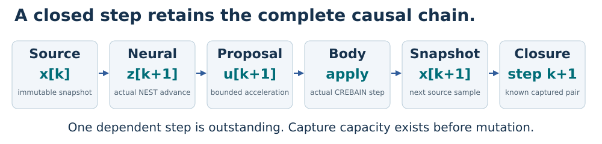

# NCP local simulation reference

An illustrated guide to causality, evidence, and bounded execution.

**Status:** First bounded development profile. Final product v1 requirements and qualification remain open.

Generated from [guide.source.json](guide.source.json) by [build.py](build.py).
The [vector PDF](ncp-local-v1-guide.pdf) contains the same explanations and equations.

## One reference experiment. Four owners.

This bounded development example connects four native owners. Final v1 still requires optional project combinations, profiles for many entities and sensor modalities, and Prisoma experiment ownership.


### Who does the work?

Engram coordinates the experiment and privately owns NEST. CREBAIN owns the body and fusion kernels. Prisoma captures evidence. Galadriel runs its detector.

### What does NCP own?

NCP supplies the shared profile, bounded messages, exact outcome retention, and independent decoder contract. It is not another application orchestrator.

### Read the boundary

This reference profile admits local direct simulation with record-only monitoring. Remote control, physical actuation, Haldir gating, and real-time guarantees remain excluded from this profile.

## A command needs the correct predecessor.

A fast message can still carry the wrong causal step. First establish what each command depends on, then measure transmission cost.



```math
z_{k+1}=N(z_k,E(x_k)),\qquad u_{k+1}=D(z_{k+1})
```

The encoder E maps observation x into neural input. N advances persistent neural state z. Decoder D produces the next proposed action u. Observation x has per-component position and velocity units. Neural state z uses the installed model units. Action u has acceleration components.

```math
x_{k+1}=F(x_k,u_{k+1})
```

Body transition F consumes that proposal and returns the next observation. The subscripts identify logical boundaries, not wall-clock completion times.

### A small delay can change stability

Consider the dimensionless teaching model x[k+1] = x[k] + u[k+1], with u[k+1] = -1.5 x[k]. Its multiplier is -0.5, so errors shrink.

### Use the previous sample by mistake

A one-step stale command gives x[k+1] = x[k] - 1.5 x[k-1]. The characteristic roots have magnitude sqrt(1.5), approximately 1.225. Errors grow.

### Scope of this example

This calculation proves behavior of the stated recurrence. It is not a stability proof for the NEST controller or the CREBAIN body.

## Logical time and recorded spikes.

A logical clock counts declared simulator advances. A wall clock measures elapsed execution. Pausing a deterministic experiment does not advance its logical clock.

```math
t_k=k h,\qquad \operatorname{mod}(h,r)=0
```

k is the completed step count. h is the step duration in integer microseconds. r is the NEST integration resolution in the same unit.

```math
W_k=\left(\max(0,(k-1)h-\delta),\;kh-\delta\right]
```

delta is the admitted recording delay. W is the completed readout interval. The left endpoint is excluded and the right endpoint is included.

### Worked clock example

For h = 20,000 microseconds and r = 100 microseconds, each step contains exactly 200 integration intervals. After 128 steps, t = 2.56 seconds.

### Worked readout example

With a 1,000-microsecond delay, the first windows are (0, 19] milliseconds and (19, 39] milliseconds. A spike at 19 milliseconds belongs only to the first.

### Persistent state needs a real test

Keep the actual NEST network between steps. Test the selected stimulus update mechanism on the exact installed build. Do not assume every runtime mutation is legal.

### Do not mix clock domains

Subtract timestamps only when their clock origin and meaning agree. A coordinator round trip is not automatically body-source-to-application latency.

## NIS measures scaled residual magnitude.

Normalized innovation squared (NIS) compares a prediction error with its declared uncertainty. It does not turn a finite number into calibrated evidence.

```math
q=e^{\mathsf{T}}S^{-1}e
```

e is the three-dimensional innovation in meters. S is its covariance in square meters. q and the innovation dimension d are dimensionless.

```math
e=(0.2,-0.1,0.1),\quad S=\mathrm{diag}(0.04,0.01,0.01)
```

This diagonal covariance gives three separate squared terms. It is a teaching input, not a retained CREBAIN measurement.

```math
q=\frac{0.2^2}{0.04}+\frac{(-0.1)^2}{0.01}+\frac{0.1^2}{0.01}=3
```

Each squared residual is scaled by its variance. Changing units consistently changes e and S together, leaving q unchanged.

### Assumptions before probability

The chi-square reference requires a justified Gaussian innovation model and positive definite covariance. Finite matrix entries alone establish neither condition.

### Three dimensions are one modality

CREBAIN's selected adapter supplies one Visual NIS value with d = 3. This is one sensor modality, not three independent modalities.

## A detector must be allowed to abstain.

The local Galadriel adapter invokes the actual SubsetMagnitudeV0_9 engine. It preserves its research classification and the unchanged evidence minimum.

```math
Q=\sum_{i=1}^{n}q_i,\qquad Q\sim\chi^2(nd)
```

n counts accepted observations in one channel window. The reference also needs the stated temporal independence assumptions and fixed innovation dimension d. Index i runs from one through n. The chi-square reference has n times d degrees of freedom.

```math
n=64,\quad d=3,\quad q_i=3\;\Longrightarrow\;Q=192
```

This synthetic arithmetic matches the reference mean. It does not establish model validity, temporal independence, or cross-modal consistency.

### The actual evidence floor

The unchanged named detector uses a 64-sample window, at least 32 samples, and at least two modalities. One Visual channel remains InsufficientEvidence.

### Birth is not a zero residual

Track birth has no prior innovation. The adapter returns not_ready without creating a detector observation. A later actual update starts an empty window.

### Loss retires the window

Missing evidence after activation retires that entity's window for the complete endpoint generation. Later observations cannot silently restore readiness.

### Evidence is not permission

Even a favorable synthetic detector control grants no command, lease, reset, or policy authority. calibrated_posterior stays false.

## Know the outcome before advancing.

A lost response does not reveal whether execution happened. Exact retained outcomes let a caller recover known work without executing it twice.

```math
D_R=H(\mathrm{domain}\;||\;\mathrm{canonical}(R\setminus\{D_R\}))
```

R is the complete response. D_R is its result_digest field. Excluding only that field avoids a circular definition while covering the whole result body. H is SHA-256. The double bar concatenates the domain separator and typed canonical bytes.

### Before execution

The owner checks the binding, plan, operation, sequence, data, and available response slot. A rejection at this stage performs no backend mutation.

### After known completion

The owner retains the complete response. An identical retry returns those bytes. A changed retry conflicts. A successor waits for the exact result acknowledgement.

### After uncertainty

An execution exception, unrepresentable result, or unresolved process failure retires mutable state. Cancellation does not mean rollback. Dependent owners cannot continue an uncertain experiment.

### After acknowledgement

The payload may be released. The retained high-water state still prevents re-execution. A later lookup returns unavailable rather than a reconstructed result.

### Coordinator audit journal

Engram records dispatch intent before sending. It records the response before coordinator progress. Unresolved loss leaves an unknown-outcome record. This owner-local journal supports audit. It grants no peer integration route or authority to resume uncertain state.

The typed canonical encoding preserves exact integers and binary64 values. A one-bit probability change is a digest failure, not harmless formatting.

## A complete subset can hide an incomplete run.

Individually valid rows are insufficient. A capture must prove its declared roster, every contiguous step pair, and a matching terminal record.

```math
P=\max\{p\in\{0,\ldots,N\}:\;\mathrm{closed}(1),\ldots,\mathrm{closed}(p)\}
```

A step is closed only after its required neural, body, and capture outcomes are known and joined. A later row cannot fill an earlier gap. The empty prefix has length zero. Index p ranges from zero through planned count N.

```math
C=T\;\wedge\;(P=N)\;\wedge\;J\;\wedge\;\neg U
```

T means the terminal record matches the plan. N is the planned step count. J means every causal join validates. U means an unresolved mutation remains. C is the Boolean capture-completeness result.

### Worked missing-step example

A four-step plan retains valid rows 1, 2, and 4. Its maximal closed prefix is 2. Three valid rows do not prove four completed steps.

### Worked terminal example

All four rows exist, but the terminal record is absent or conflicts. Completeness remains unresolved or invalid. Do not infer a successful finish.

### Capture before progress

Reserve required evidence capacity before neural or body mutation. If the reservation fails, pause or reject at that declared boundary.

## Bounds and measurements need honest names.

A structural buffer bound is not a resident-memory measurement. An observed percentile is not a guarantee about future deadlines.

```math
M_{\mathrm{retained\;wire}}\leq E F=4\times65{,}536=262{,}144\;\mathrm{bytes}
```

E is the endpoint count and F is the maximum result frame. This bound excludes parsed objects, pipe buffers, simulator state, and captured history.

```math
T_{\mathrm{effect}}=t_{\mathrm{body\;application}}-t_{\mathrm{body\;source}}
```

Both timestamps need the same body-owned clock and the specified event boundaries. A coordinator request timer measures a different interval. T is elapsed time in seconds. Both timestamps use the same unit.

### Measure a paired comparison

Run matched direct and NCP trials with the same logical inputs, seed, build, and instrumentation. Compare paired differences rather than subtracting unrelated percentiles.

### Publish the observation

Report sample count, p50, p99, p99.9, maximum, failures, host, worker placement, and instrumentation. State untested loads and all excluded timing guarantees.

### Keep the release gate visible

The 70-case mapping tracks local requirements and enforced exclusions. Final native, containment, installed-artifact, and reproduction receipts remain open in this guide.

### What this guide proves

The worked calculations explain their stated models. Diagrams and numerical examples are not substitute evidence for an installed NCP release.

Read the adjacent README.md, decision.md, and acceptance-70.md for this reference profile, open product requirements, and every required acceptance control.

## Review and rebuild

Read the [reference profile](README.md), [decision record](decision.md), and [70-case mapping](acceptance-70.md) before interpreting release status.

The guide explains the supplied closed-loop review's mathematical concerns and the reference native adapter contracts.
Its examples are illustrative calculations, not corpus, simulator, or deployment qualification receipts.

Install the pinned documentation dependencies from `requirements-docs.txt` into a separate environment.
Run `python docs/local-v1/build.py --pdf` from the repository root.
Run `python docs/local-v1/build.py --check` to check the generated SVG and Markdown files.
